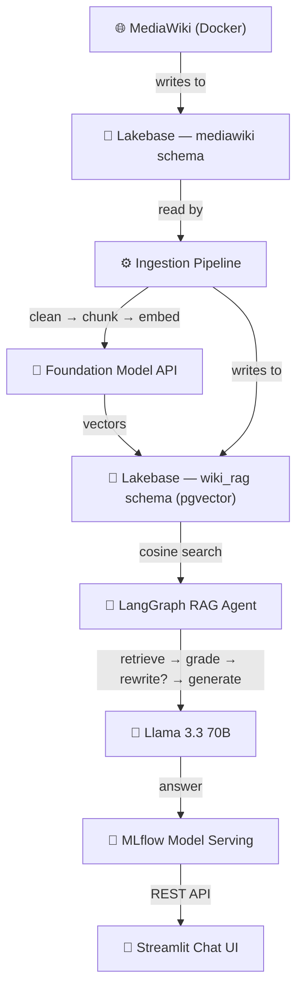

# 📖 Wiki RAG on Databricks

End-to-end Retrieval-Augmented Generation (RAG) system that turns a self-hosted **MediaWiki** into an intelligent Q&A assistant — powered entirely by **Databricks**.


## 🚀 Quick Start

### Prerequisites

- **Databricks workspace** with Unity Catalog enabled
- **Databricks CLI** `>= 0.236.0`, authenticated (`databricks auth login`)
- **Docker** and **Docker Compose**
- **Python** 3.11+ with `databricks-sdk` installed

> [!IMPORTANT]
> **Azure Brazil South:** enable [cross-geography routing](https://learn.microsoft.com/en-us/azure/databricks/resources/databricks-geos#cross-geo-processing) in workspace settings for Foundation Model API calls.

### 1. Setup (one-time, ~10 min)

```bash
make setup-secrets      # Prompts for Lakebase password (the ONE interactive step)
make setup-lakebase     # Provisions Lakebase instance, creates DB + role + DDL
make docker-up          # Auto-generates .env from secrets, starts MediaWiki
```

### 2. Deploy (~20 min)

```bash
make deploy-agent       # Logs model to MLflow, deploys serving endpoint
make ingest             # Runs ingestion pipeline (clean → chunk → embed)
make bundle-deploy      # Deploys Streamlit app + job schedules
```

### 3. Verify

```bash
databricks apps get wiki-rag-app    # Get the Streamlit app URL
```

Open the URL and ask a question about your wiki.

### Teardown

```bash
make destroy-all        # Removes all Databricks resources + Docker containers
```

### All Make Targets

```bash
make help               # Show all available targets
```

---

## 🏗️ Architecture

| Component        | Technology                               | Description                             |
| ---------------- | ---------------------------------------- | --------------------------------------- |
| Knowledge source | MediaWiki 1.42 (Docker)                  | Self-hosted wiki backed by PostgreSQL   |
| Database         | Lakebase Provisioned (PG 16)             | Hosts both MediaWiki and RAG tables     |
| Embeddings       | `databricks-gte-large-en`                | Foundation Model API — 1024-dim vectors |
| Vector search    | pgvector + HNSW index                    | Cosine similarity retrieval             |
| RAG agent        | LangGraph + ResponsesAgent (MLflow 3)    | retrieve → grade → rewrite → generate   |
| Conversation mem | Lakebase PostgreSQL                      | Multi-turn conversation history         |
| LLM              | `databricks-meta-llama-3-3-70b-instruct` | Answer generation                       |
| Model serving    | MLflow ResponsesAgent + Model Serving    | Real-time endpoint with auto-scaling    |
| Chat UI          | Streamlit (Databricks App)               | Web interface for end users             |

**Data flow:**



## 📁 Project Structure

```
wiki-rag-dtbricks/
├── databricks.yml                # DAB bundle config (single source of truth)
├── Makefile                      # Deployment automation (make deploy / destroy)
├── resources/
│   ├── jobs.yml                  # DAB jobs: setup, deploy, ingestion
│   └── apps.yml                  # Databricks App resource
├── docker/
│   ├── docker-compose.yml        # MediaWiki container
│   ├── LocalSettings.php.template
│   ├── .env.example              # Credentials template (auto-generated if missing)
│   └── setup.sh                  # Container bootstrap (auto-generates .env from secrets)
├── src/
│   ├── setup_secrets.py           # One-time: create secret scope + password
│   ├── config.py                 # Shared Lakebase connection helper
│   ├── ingestion.py              # MediaWikiIngestion — reads MW native PG tables
│   ├── pipeline.py               # WikiPipeline — clean, chunk, embed, caption images
│   └── rag.py                    # WikiRAGAgent — ResponsesAgent + LangGraph RAG
├── notebooks/
│   ├── 00_setup_lakebase.py      # Provision Lakebase + DDL (DAB job)
│   ├── 01_ingest_mediawiki.py    # Ingest → clean → chunk → embed (DAB job)
│   ├── 02_rag_agent.py           # Interactive RAG testing
│   └── 03_deploy_serving.py      # Register model + deploy endpoint (DAB job)
└── app/
    ├── app.py                    # Streamlit chat UI
    ├── app.yaml                  # Databricks App config
    └── requirements.txt
```

## 🔧 Configuration

All configuration is centralized in `databricks.yml` variables:

| Variable | Default | Description |
|----------|---------|-------------|
| `lakebase_instance_name` | `wiki-rag-lakebase` | Lakebase PostgreSQL instance |
| `endpoint_name` | `wiki-rag-endpoint` | Model serving endpoint |
| `app_name` | `wiki-rag-app` | Databricks App name |
| `model_name` | `main.wiki_rag.wiki_rag_agent` | Unity Catalog model |
| `secret_scope` | `wiki-rag` | Databricks secret scope |
| `catalog` | `main` | Unity Catalog name |
| `schema` | `wiki_rag` | Schema for RAG tables |
| `db_name` | `wikidb` | Lakebase database name |
| `embedding_model` | `databricks-gte-large-en` | Embedding endpoint |
| `llm_model` | `databricks-meta-llama-3-3-70b-instruct` | LLM endpoint |

**Environment variables** (read at runtime, not in DAB):

| Variable | Default | Description |
|----------|---------|-------------|
| `VISION_MODEL` | `databricks-claude-sonnet-4-6` | Vision LLM for image captioning |
| `MEDIAWIKI_URL` | `http://localhost:8080` | MediaWiki base URL for image fetching |

Override for production: `make deploy TARGET=prod`

---

## 🗄️ Database Schema

A single `wikidb` database on Lakebase hosts two schemas:

| Schema      | Owner        | Purpose                                                                    |
| ----------- | ------------ | -------------------------------------------------------------------------- |
| `mediawiki` | MediaWiki    | Native tables (`page`, `revision`, `slots`, `content`, `pagecontent`, ...) |
| `wiki_rag`  | RAG pipeline | Chunks, embeddings, sync state, images, and conversation memory            |

```sql
-- Cleaned and split wiki text (chunk_source: "text" or "image")
wiki_rag.wiki_chunks (chunk_id, page_id, page_title, page_ns, rev_id, chunk_index, chunk_text, chunk_source, created_at)

-- 1024-dim vectors with HNSW index (cosine similarity)
wiki_rag.wiki_embeddings (embedding_id, chunk_id, embedding vector(1024))

-- Vision LLM image descriptions
wiki_rag.wiki_images (image_id, page_id, page_title, filename, alt_text, caption, created_at)

-- Watermark for incremental processing
wiki_rag.sync_state (key, value, updated_at)

-- Conversation memory (multi-turn RAG)
wiki_rag.conversations (conversation_id, user_id, created_at, updated_at, metadata)
wiki_rag.messages (message_id, conversation_id, role, content, sources, created_at)
```

---

## 🔌 SQL Client Connection

Use **pgAdmin**, **DBeaver**, or **VS Code SQLTools** to inspect the data.

**Option A — Static password (recommended for tooling):**

| Field    | Value                                                  |
| -------- | ------------------------------------------------------ |
| Host     | `databricks secrets get-secret wiki-rag lakebase_host` |
| Port     | `5432`                                                 |
| Database | `wikidb`                                               |
| Username | `mediawiki`                                            |
| Password | *(the password you set via `make setup-secrets`)*      |
| SSL      | `require`                                              |

**Option B — OAuth token (expires ~1h):**

| Field    | Value                                                                                 |
| -------- | ------------------------------------------------------------------------------------- |
| Host     | *(same)*                                                                              |
| Port     | `5432`                                                                                |
| Database | `wikidb`                                                                              |
| Username | *(your Databricks email)*                                                             |
| Password | `databricks database generate-database-credential --instance-names wiki-rag-lakebase` |
| SSL      | `require`                                                                             |

---

## 🔐 Secrets Reference

All credentials live in the `wiki-rag` Databricks secret scope:

| Key                      | Description                              | Created by           |
| ------------------------ | ---------------------------------------- | -------------------- |
| `mw_password`            | Static password for the `mediawiki` role | `make setup-secrets` |
| `lakebase_instance_name` | Lakebase instance name                   | `make setup-lakebase` |
| `lakebase_user`          | Databricks username (email)              | `make setup-lakebase` |
| `lakebase_db`            | Database name (`wikidb`)                 | `make setup-lakebase` |
| `lakebase_host`          | Lakebase endpoint DNS                    | `make setup-lakebase` |
| `lakebase_port`          | PostgreSQL port (`5432`)                 | `make setup-lakebase` |
| `mw_role`                | MediaWiki PG role (`mediawiki`)          | `make setup-lakebase` |
