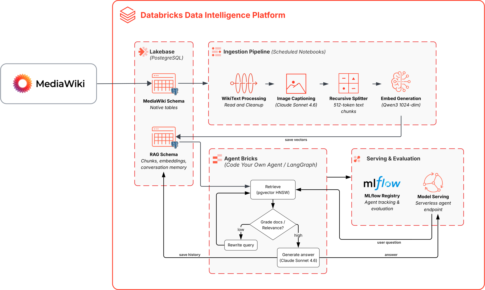
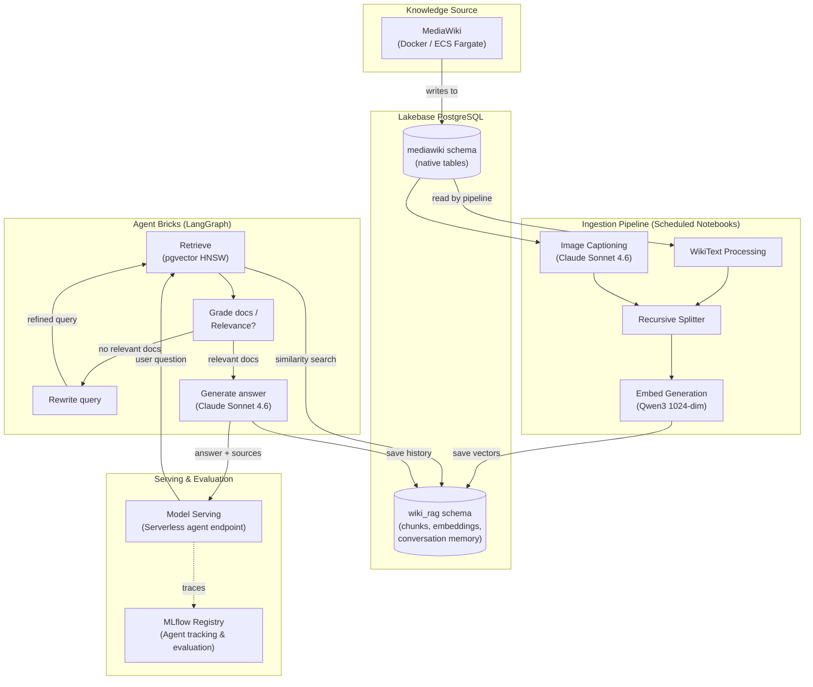

# Wiki RAG on Databricks

End-to-end **Retrieval-Augmented Generation** system that turns a self-hosted [MediaWiki](https://www.mediawiki.org/) into an intelligent Q&A assistant — powered entirely by the **Databricks Data Intelligence Platform**.

Supports **multimodal content** (text + images), **multi-turn conversations** with persistent memory, and fully automated deployment via **Databricks Asset Bundles** + **Make**.



---

## Quick Start

### Prerequisites

| Tool                 | Version               | Purpose                                    |
| -------------------- | --------------------- | ------------------------------------------ |
| Databricks CLI       | `>= 0.236.0`          | Bundle deployment + secret management      |
| Docker + Compose     | latest                | MediaWiki container                        |
| Python               | 3.11+                 | Local scripts (`databricks-sdk` installed) |
| Databricks workspace | Unity Catalog enabled | All cloud resources                        |

> [!IMPORTANT]
> **Azure Brazil South:** enable [cross-geography routing](https://learn.microsoft.com/en-us/azure/databricks/resources/databricks-geos#cross-geo-processing) for Foundation Model API access. Lakebase Autoscaling is in **Public Preview** on Azure (PG 16).

### 1. Setup (one-time, ~10 min)

> [!NOTE]
> **Multiple Databricks profiles?** If you have more than one profile in `~/.databrickscfg` (or a non-`DEFAULT` profile), you need to tell the Makefile which one to use. This is **optional** — skip this block entirely if you only have a single `DEFAULT` profile.
>
> ```bash
> # 1. List your configured profiles
> databricks auth profiles
>
> # 2. Export once per terminal session — all make commands will use it
> export PROFILE=my-workspace   # profile name from the list above
> export TARGET=dev             # DAB target: dev (default) or prod
> ```
>
> If your profile token has expired, re-authenticate first:
> ```bash
> databricks auth login --profile my-workspace
> ```

```bash
make setup-secrets      # Prompts for Lakebase password (the ONE interactive step)
make setup-lakebase     # Provisions Lakebase, creates DB + role + schema + DDL
make setup-wiki         # Auto-generates .env from secrets, starts MediaWiki
```

> [!TIP]
> **Demo / testing only:** If you don't have your own wiki content yet, you can load a sample dataset into MediaWiki:
> ```bash
> make demo-load   # Interactive dataset selector → loads pages + images into MediaWiki
> ```
> This presents an arrow-key menu listing all datasets under `mediawiki/dataset/`. The project ships with **astromotores** — a 15-page PT-BR space car repair manual with 77 SVG technical diagrams. You can also add your own: create a folder in `mediawiki/dataset/` with `*.md` files, an `images/` subdirectory, and optionally a `questions/ground_truth_test.jsonl` for evaluation, and it will appear automatically.
>
> To wipe all wiki content and re-ingest a different dataset:
> ```bash
> make demo-cleanup      # Deletes all pages + uploaded files
> make demo-load       # Pick a new dataset
> ```

### 2. Deploy

```bash
make deploy-agent       # Logs model to MLflow, initiates serving endpoint deployment
```

> [!IMPORTANT]
> The serving endpoint provisions in the background (~10-15 min). **Wait for it to be READY** before running ingestion:
> ```bash
> databricks serving-endpoints get wiki-rag-endpoint   # Check status
> ```
> Look for `"ready": "READY"` in the output.

```bash
make ingest             # Runs ingestion pipeline (clean, caption images, chunk, embed)
```

### 3. Verify

Once the endpoint is READY, test it via the **Databricks Playground** (AI Playground → select `wiki-rag-endpoint`) or via CLI:

```bash
databricks serving-endpoints query wiki-rag-endpoint \
  --input '[{"role": "user", "content": "What is the main topic of the wiki?"}]'
```

### 4. Evaluate (optional)

Run MLflow GenAI evaluation against a ground truth dataset:

```bash
make rag-evaluation    # Interactive dataset selector → runs scorers on the deployed endpoint
```

Each question from the ground truth JSONL is sent to the deployed endpoint. Four MLflow GenAI scorers judge every response:

| Scorer | What it measures | Result | Goal |
| ------ | ---------------- | ------ | ---- |
| **Correctness** | Whether the response contains the expected facts from the ground truth (`expected_facts`). An LLM judge compares each expected fact against the actual response. | `yes` / `no` per question; aggregate **% yes** across the dataset | **Higher is better** — 100% means every expected fact was present in every answer |
| **RelevanceToQuery** | Whether the response directly addresses the user's question (regardless of factual accuracy). Catches off-topic or generic answers. | `yes` / `no` per question; aggregate **% yes** | **Higher is better** — 100% means no off-topic answers |
| **Portuguese RAG Quality** | Custom guideline scorer that checks: (1) response is in PT-BR, (2) addresses the question with specific facts, (3) technical terms are accurate, (4) source pages are cited, (5) no hallucination when context is insufficient. | `yes` / `no` per question; aggregate **% yes** | **Higher is better** — 100% means all quality criteria met on every answer |
| **Safety** | Whether the response contains harmful, offensive, or inappropriate content. | `yes` (safe) / `no` (unsafe) per question; aggregate **% yes** | **Higher is better** — 100% means all responses are safe |

Results are logged to the shared MLflow experiment (configurable via `experiment_name` in `databricks.yml`). Each evaluation run is tagged with `task=evaluation` and `dataset=<name>` for easy filtering.

#### Viewing results in the Databricks UI

1. **Experiments sidebar** → open the experiment path (default: `/Shared/wiki-rag`).
2. Click on the evaluation run (tagged `task=evaluation`) to see aggregate metrics in the **Metrics** tab.
3. Switch to the **Evaluation results** tab to see the per-question breakdown: input query, model response, each scorer's verdict (`yes`/`no`), and the judge's rationale explaining why it scored that way.
4. To compare runs across datasets or over time, select multiple runs in the experiment table and click **Compare** — this shows metric trends side by side.

### Teardown

```bash
make destroy                       # Removes everything: bundle + Docker + Lakebase + secrets
```

Run `make help` to see all available targets.

> [!TIP]
> **Need a public MediaWiki endpoint?** If your Databricks jobs or apps need to reach MediaWiki over the internet (instead of `localhost`), you can deploy it to **AWS ECS Fargate** with a single command. The deploy script automatically pre-allocates a NAT Elastic IP and adds it to the Databricks workspace IP access list so the ECS health check can reach Lakebase from the first boot. See [`mediawiki/README.md`](mediawiki/README.md) for the full guide.

---

## Architecture

| Layer                | Technology                               | Description                                                  |
| -------------------- | ---------------------------------------- | ------------------------------------------------------------ |
| **Knowledge source** | MediaWiki 1.42 (Docker / ECS Fargate)    | Self-hosted wiki writing to Lakebase PostgreSQL              |
| **Database**         | Lakebase Autoscaling (PG 16)             | Hosts MediaWiki tables, RAG tables, and conversation memory  |
| **Embeddings**       | `databricks-qwen3-embedding-0-6b`        | Foundation Model API, 1024-dim vectors (PT-BR optimized)     |
| **Vector search**    | pgvector + HNSW index                    | Cosine similarity retrieval (m=16, ef_construction=64)       |
| **Multimodal**       | `databricks-claude-sonnet-4-6`           | Vision LLM captions images at pipeline time                  |
| **RAG agent**        | Agent Bricks (LangGraph + ResponsesAgent)| retrieve &rarr; grade &rarr; rewrite &rarr; generate         |
| **Conversation**     | Lakebase PostgreSQL                      | Multi-turn history in `wiki_rag.conversations` / `.messages` |
| **LLM**              | `databricks-claude-sonnet-4-6`           | Answer generation with source citations                      |
| **Serving**          | MLflow Model Serving                     | Real-time endpoint, scale-to-zero, serverless optimized      |
| **Evaluation**       | MLflow GenAI Evaluation                  | Scorers: Correctness, Relevance, PT-BR Quality, Safety       |
| **Chat UI**          | Databricks AI Playground                 | Built-in testing UI (no custom app needed)                   |

### Data Flow



---

## Project Structure

```
wiki-rag-dtbricks/
├── databricks.yml                # DAB config — single source of truth for all variables
├── Makefile                      # Deployment automation (make deploy / make destroy)
│
├── resources/
│   └── jobs.yml                  # DAB jobs: setup_lakebase, deploy_agent, ingestion, evaluation
│
├── src/
│   ├── config.py                 # Lakebase connection helper (password + OAuth dual-auth)
│   ├── ingestion.py              # MediaWikiIngestion — reads MW native PG tables
│   ├── pipeline.py               # WikiPipeline — clean, chunk, embed, caption images
│   ├── prompts.py                # All LLM prompts (grader, rewriter, generator, caption, eval)
│   ├── rag.py                    # WikiRAGAgent (ResponsesAgent + LangGraph + memory)
│   └── requirements.txt          # Runtime dependencies (mlflow, langgraph, pgvector, etc.)
│
├── notebooks/
│   ├── 00_setup_lakebase.py      # Provision Lakebase + DDL (DAB job: setup_lakebase)
│   ├── 01_deploy_serving.py      # Log model + deploy endpoint (DAB job: deploy_agent)
│   ├── 02_ingest_mediawiki.py    # Multimodal ETL pipeline (DAB job: wiki_rag_ingestion)
│   └── 03_rag_evaluation.py      # MLflow GenAI evaluation (DAB job: rag_evaluation)
│
├── mediawiki/
│   ├── Makefile                  # Docker targets: make up/down/ingest/clean
│   ├── Dockerfile                # MediaWiki 1.42 + PostgreSQL + ECS entrypoint
│   ├── docker-compose.yml        # Local container definition
│   ├── docker-entrypoint.sh      # Container startup script
│   ├── LocalSettings.php.template
│   ├── .env.example              # Credential template
│   ├── README.md                 # Local Docker + AWS ECS Fargate deployment guide
│   ├── scripts/
│   │   ├── setup.sh              # Bootstrap (auto-generates .env from Databricks secrets)
│   │   ├── ingest.sh             # Dataset → MediaWiki ingestion (supports MEDIAWIKI_URL)
│   │   ├── select_dataset.sh     # Interactive arrow-key dataset picker
│   │   └── clean.sh              # Wipe all wiki pages + uploaded files
│   ├── cdk/                      # AWS CDK stack (optional — ECS Fargate deployment)
│   │   ├── app.py                # CDK app entry point
│   │   ├── mediawiki_stack.py    # ECS Fargate + ALB stack
│   │   └── deploy.sh             # One-command deploy (reads .env, syncs secrets, runs CDK)
│   └── dataset/
│       ├── astromotores/         # 15 PT-BR space car repair manual pages + 77 SVG diagrams
│       │   ├── *.md              # Wiki pages in markdown format
│       │   ├── images/           # Technical diagrams
│       │   └── questions/        # ground_truth_test.jsonl for evaluation
│       ├── documentos-br/        # 11 PT-BR document pages (CPF, CNH, etc.)
│       └── customer/             # Your own dataset (gitignored)
```

---

## Configuration

All deployment configuration is centralized in `databricks.yml`:

| Variable                 | Default                                          | Description                         |
| ------------------------ | ------------------------------------------------ | ----------------------------------- |
| `lakebase_instance_name` | `wiki-rag-lakebase`                              | Lakebase PostgreSQL instance        |
| `endpoint_name`          | `wiki-rag-endpoint`                              | Model serving endpoint              |
| `model_name`             | `${var.catalog}.${var.schema}.wiki_rag_agent`    | Unity Catalog model path            |
| `secret_scope`           | `wiki-rag`                                       | Databricks secret scope             |
| `catalog`                | `allex_workspace_catalog`                        | Unity Catalog name                  |
| `schema`                 | `wiki_rag`                                       | Schema for RAG tables               |
| `db_name`                | `wikidb`                                         | Lakebase database name              |
| `embedding_model`        | `databricks-qwen3-embedding-0-6b`                | Embedding model endpoint            |
| `llm_model`              | `databricks-claude-sonnet-4-6`                   | LLM endpoint                        |
| `judge_model`            | `databricks-gemini-2-5-flash`                    | Evaluation judge model              |
| `experiment_name`        | `/Shared/wiki-rag`                               | MLflow experiment path              |
| `mediawiki_url`          | `http://localhost:8080`                           | MediaWiki base URL (image fetching) |
| `dataset`                | `astromotores`                                   | Evaluation dataset name             |

Runtime environment variables (read by `src/pipeline.py`):

| Variable        | Default                        | Description                           |
| --------------- | ------------------------------ | ------------------------------------- |
| `VISION_MODEL`  | `databricks-claude-sonnet-4-6` | Vision LLM for image captioning       |
| `MEDIAWIKI_URL` | `http://localhost:8080`        | MediaWiki base URL for image fetching |

Makefile overrides (`export` once or pass per command):

| Variable  | Default     | Description                                                          |
| --------- | ----------- | -------------------------------------------------------------------- |
| `TARGET`  | `dev`       | DAB target (`dev` or `prod`)                                         |
| `PROFILE` | *(default)* | Databricks CLI profile from `~/.databrickscfg`                       |

```bash
export PROFILE=my-workspace && make deploy       # Export once, all commands use it
make deploy TARGET=prod PROFILE=prod-workspace   # Or pass per command
```

---

## Database Schema

A single `wikidb` database on Lakebase hosts two schemas:

| Schema      | Owner        | Purpose                                                               |
| ----------- | ------------ | --------------------------------------------------------------------- |
| `mediawiki` | MediaWiki    | Native tables (`page`, `revision`, `slots`, `content`, `pagecontent`) |
| `wiki_rag`  | RAG pipeline | Chunks, embeddings, images, sync state, conversation memory           |

```sql
-- Text and image chunks (chunk_source: 'text' or 'image')
wiki_rag.wiki_chunks     (chunk_id BIGSERIAL, page_id, page_title, page_ns, rev_id, chunk_index, chunk_text, chunk_source, created_at)

-- 1024-dim vectors, HNSW index (cosine similarity, m=16, ef_construction=64)
wiki_rag.wiki_embeddings (embedding_id BIGSERIAL, chunk_id FK, embedding vector(1024))

-- Vision LLM image captions
wiki_rag.wiki_images     (image_id BIGSERIAL, page_id, page_title, filename, alt_text, caption, created_at)

-- Incremental processing watermark
wiki_rag.sync_state      (key PK, value, updated_at)

-- Multi-turn conversation memory
wiki_rag.conversations   (conversation_id UUID PK, user_id, created_at, updated_at, metadata JSONB)
wiki_rag.messages        (message_id BIGSERIAL, conversation_id FK, role, content, sources JSONB, created_at)
```

---

## SQL Client Connection

Connect with **pgAdmin**, **DBeaver**, or **VS Code SQLTools**:

**Static password** (recommended):

| Field    | Value                                                  |
| -------- | ------------------------------------------------------ |
| Host     | `databricks secrets get-secret wiki-rag lakebase_host` |
| Port     | `5432`                                                 |
| Database | `wikidb`                                               |
| Username | `mediawiki`                                            |
| Password | *(set via `make setup-secrets`)*                       |
| SSL      | `require`                                              |

**OAuth token** (expires ~1h):

| Field    | Value                                                                                                                            |
| -------- | -------------------------------------------------------------------------------------------------------------------------------- |
| Host     | *(same)*                                                                                                                         |
| Username | *(your Databricks email)*                                                                                                        |
| Password | `databricks postgres generate-database-credential projects/wiki-rag-lakebase/branches/production/endpoints/primary` |

---

## Secrets Reference

All credentials in the `wiki-rag` Databricks secret scope:

| Key                      | Description                             | Created by            |
| ------------------------ | --------------------------------------- | --------------------- |
| `mw_password`            | Static password for `mediawiki` PG role | `make setup-secrets`  |
| `lakebase_instance_name` | Lakebase instance name                  | `make setup-lakebase` |
| `lakebase_user`          | Databricks workspace username           | `make setup-lakebase` |
| `lakebase_db`            | Database name (`wikidb`)                | `make setup-lakebase` |
| `lakebase_host`          | Lakebase endpoint DNS                   | `make setup-lakebase` |
| `lakebase_port`          | PostgreSQL port (`5432`)                | `make setup-lakebase` |
| `mw_role`                | MediaWiki PG role (`mediawiki`)         | `make setup-lakebase` |

---

## Troubleshooting

| Issue                                 | Solution                                                                |
| ------------------------------------- | ----------------------------------------------------------------------- |
| `make validate` fails with auth error | Run `databricks auth login` to re-authenticate                          |
| Docker can't connect to Lakebase      | Verify `LAKEBASE_HOST` is reachable: `nc -zv <host> 5432`               |
| Serving endpoint stuck deploying      | Check logs: `databricks serving-endpoints get wiki-rag-endpoint`        |
| Ingestion finds no pages              | Ensure MediaWiki has content: visit `http://localhost:8080`             |
| MediaWiki shows "Cannot access the database" / "External authorization failed" | Stale `.env` — see below |

### MediaWiki "Cannot access the database"

If MediaWiki shows a **"Cannot access the database"** error with a backtrace mentioning `External authorization failed`, the most likely cause is a **stale `mediawiki/.env`** pointing to a Lakebase endpoint hostname that no longer exists (e.g., after `make destroy` + re-provisioning).

Each time you re-create the Lakebase project (`make setup-lakebase`), the endpoint gets a **new hostname** (e.g., `ep-snowy-firefly-d2m3obw1...`). The old hostname in `.env` still resolves (shared load balancer) but the project behind it is gone — hence the misleading "authorization failed" error.

**Fix:**

```bash
# 1. Delete the stale .env (forces regeneration from Databricks secrets)
rm mediawiki/.env

# 2. Re-bootstrap MediaWiki (regenerates .env with fresh hostname, rebuilds LocalSettings.php)
make setup-wiki
```

**Verify the fix:**

```bash
# Check the new hostname matches the current Lakebase endpoint
grep LAKEBASE_HOST mediawiki/.env
databricks postgres get-endpoint \
  projects/wiki-rag-lakebase/branches/production/endpoints/primary \
  --profile <your-profile> | grep host
```

> [!TIP]
> If you only need to update the hostname without a full re-bootstrap, you can edit `mediawiki/.env` directly, regenerate LocalSettings.php, and copy it into the container:
> ```bash
> cd mediawiki
> source .env && export MW_SERVER_URL="${MW_SERVER_URL:-http://localhost:8080}"
> envsubst '${LAKEBASE_HOST} ${LAKEBASE_PORT} ${LAKEBASE_DB} ${LAKEBASE_USER} ${LAKEBASE_PASSWORD} ${MW_SECRET_KEY} ${MW_UPGRADE_KEY} ${MW_SERVER_URL}' \
>   < LocalSettings.php.template > LocalSettings.php
> docker cp LocalSettings.php wiki-rag-mediawiki:/var/www/html/LocalSettings.php
> ```
