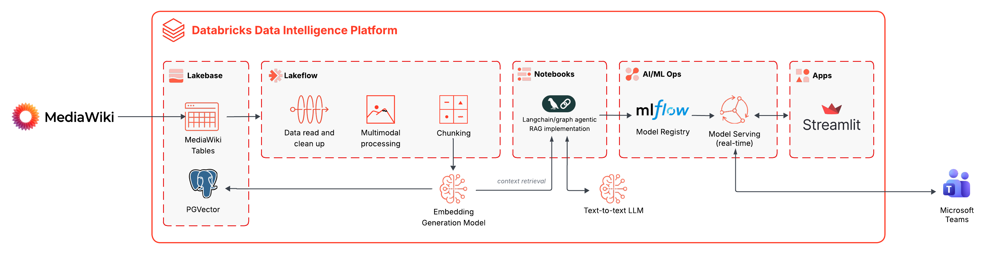

# Wiki RAG on Databricks

End-to-end **Retrieval-Augmented Generation** system that turns a self-hosted [MediaWiki](https://www.mediawiki.org/) into an intelligent Q&A assistant — powered entirely by the **Databricks Data Intelligence Platform**.

Supports **multimodal content** (text + images), **multi-turn conversations** with persistent memory, and fully automated deployment via **Databricks Asset Bundles** + **Make**.



---

## Quick Start

### Prerequisites

| Tool                 | Version               | Purpose                                    |
| -------------------- | --------------------- | ------------------------------------------ |
| Databricks CLI       | `>= 0.236.0`          | Bundle deployment + secret management      |
| Docker + Compose     | latest                | MediaWiki container                        |
| Python               | 3.11+                 | Local scripts (`databricks-sdk` installed) |
| Databricks workspace | Unity Catalog enabled | All cloud resources                        |

> [!IMPORTANT]
> **Azure Brazil South:** enable [cross-geography routing](https://learn.microsoft.com/en-us/azure/databricks/resources/databricks-geos#cross-geo-processing) for Foundation Model API access. Lakebase Autoscaling is in **Public Preview** on Azure (PG 16).

### 1. Setup (one-time, ~10 min)

> [!NOTE]
> **Multiple Databricks profiles?** If you have more than one profile in `~/.databrickscfg` (or a non-`DEFAULT` profile), you need to tell the Makefile which one to use. This is **optional** — skip this block entirely if you only have a single `DEFAULT` profile.
>
> ```bash
> # 1. List your configured profiles
> databricks auth profiles
>
> # 2. Export once per terminal session — all make commands will use it
> export PROFILE=my-workspace   # profile name from the list above
> export TARGET=dev             # DAB target: dev (default) or prod
> ```
>
> If your profile token has expired, re-authenticate first:
> ```bash
> databricks auth login --profile my-workspace
> ```

```bash
make setup-secrets      # Prompts for Lakebase password (the ONE interactive step)
make setup-lakebase     # Provisions Lakebase, creates DB + role + schema + DDL
make setup-wiki         # Auto-generates .env from secrets, starts MediaWiki
```

> [!TIP]
> **Demo / testing only:** If you don't have your own wiki content yet, you can load a sample dataset into MediaWiki:
> ```bash
> make demo-load   # Interactive dataset selector → loads pages + images into MediaWiki
> ```
> This presents an arrow-key menu listing all datasets under `mediawiki/dataset/`. The project ships with **astromotores** — a 15-page PT-BR space car repair manual with 75 SVG technical diagrams. You can also add your own: create a folder in `mediawiki/dataset/` with `*.md` files and an `images/` subdirectory, and it will appear automatically.
>
> To wipe all wiki content and re-ingest a different dataset:
> ```bash
> make demo-cleanup      # Deletes all pages + uploaded files
> make demo-load       # Pick a new dataset
> ```

### 2. Deploy (~20 min)

```bash
make deploy-agent       # Logs model to MLflow, deploys serving endpoint
make ingest             # Runs ingestion pipeline (clean, caption images, chunk, embed)
```

Or run everything at once: `make deploy`

### 3. Verify

```bash
databricks apps get wiki-rag-app    # Get the Streamlit app URL
```

Open the URL and ask a question about your wiki content.

### Teardown

```bash
make destroy                       # Removes everything: bundle + Docker + Lakebase + secrets
```

Run `make help` to see all available targets.

> [!TIP]
> **Need a public MediaWiki endpoint?** If your Databricks jobs or apps need to reach MediaWiki over the internet (instead of `localhost`), you can deploy it to **AWS ECS Fargate** with a single command. See [`mediawiki/README.md`](mediawiki/README.md) for the full guide.

---

## Architecture

| Layer                | Technology                               | Description                                                  |
| -------------------- | ---------------------------------------- | ------------------------------------------------------------ |
| **Knowledge source** | MediaWiki 1.42 (Docker / ECS Fargate)    | Self-hosted wiki writing to Lakebase PostgreSQL              |
| **Database**         | Lakebase Autoscaling (PG 16)             | Hosts MediaWiki tables, RAG tables, and conversation memory  |
| **Embeddings**       | `databricks-qwen3-embedding-0-6b`        | Foundation Model API, 1024-dim vectors (PT-BR optimized)     |
| **Vector search**    | pgvector + HNSW index                    | Cosine similarity retrieval (m=16, ef=64)                    |
| **Multimodal**       | `databricks-claude-sonnet-4-6`           | Vision LLM captions images at pipeline time                  |
| **RAG agent**        | LangGraph + ResponsesAgent (MLflow 3)    | retrieve &rarr; grade &rarr; rewrite &rarr; generate         |
| **Conversation**     | Lakebase PostgreSQL                      | Multi-turn history in `wiki_rag.conversations` / `.messages` |
| **LLM**              | `databricks-claude-sonnet-4-6`           | Answer generation with source citations                      |
| **Serving**          | MLflow Model Serving                     | Real-time endpoint, scale-to-zero                            |
| **Chat UI**          | Streamlit (Databricks App)               | Web interface with streaming responses                       |

### Data Flow

```
MediaWiki (Docker or ECS)
    |  writes to
    v
Lakebase [mediawiki schema]
    |  read by ingestion pipeline
    v
Clean wikitext + Extract images --> Vision LLM (captions) --> Chunk --> Embed (Qwen3)
    |                                                                      |
    v                                                                      v
Lakebase [wiki_rag schema]  <--  pgvector embeddings (HNSW cosine)
    |
    |  context retrieval
    v
LangGraph RAG Agent (retrieve -> grade -> rewrite? -> generate)
    |                              |
    v                              v
Claude Sonnet 4.6 (LLM)   Conversation Memory (Lakebase)
    |
    v
MLflow Model Serving --> Streamlit Chat UI
```

---

## Project Structure

```
wiki-rag-dtbricks/
├── databricks.yml                # DAB config — single source of truth for all variables
├── Makefile                      # Deployment automation (make deploy / make destroy)
├── pyproject.toml                # Pytest + coverage configuration
│
├── resources/
│   ├── jobs.yml                  # DAB jobs: setup_lakebase, deploy_agent, ingestion
│   └── apps.yml                  # Databricks App (Streamlit) resource
│
├── src/
│   ├── config.py                 # Lakebase connection helper (password + OAuth dual-auth)
│   ├── ingestion.py              # MediaWikiIngestion — reads MW native PG tables
│   ├── pipeline.py               # WikiPipeline — clean, chunk, embed, caption images
│   └── rag.py                    # WikiRAGAgent (ResponsesAgent + LangGraph + memory)
│
├── notebooks/
│   ├── 00_setup_lakebase.py      # Provision Lakebase + DDL (DAB job: setup_lakebase)
│   ├── 01_ingest_mediawiki.py    # Multimodal ETL pipeline (DAB job: wiki_rag_ingestion)
│   ├── 02_rag_agent.py           # Interactive RAG testing + multi-turn memory demo
│   └── 03_deploy_serving.py      # Log model + deploy endpoint (DAB job: deploy_agent)
│
├── app/
│   ├── app.py                    # Streamlit chat UI (chat completions format)
│   ├── app.yaml                  # Databricks App runtime config
│   └── requirements.txt          # App-only dependencies
│
├── mediawiki/
│   ├── Makefile                  # Docker targets: make up/down/ingest/clean
│   ├── Dockerfile                # MediaWiki 1.42 + PostgreSQL + ECS entrypoint
│   ├── docker-compose.yml        # Local container definition
│   ├── LocalSettings.php.template
│   ├── .env.example              # Credential template
│   ├── README.md                 # Local Docker + AWS ECS Fargate deployment guide
│   ├── scripts/
│   │   ├── setup.sh              # Bootstrap (auto-generates .env from Databricks secrets)
│   │   ├── ingest.sh             # Dataset → MediaWiki ingestion (supports MEDIAWIKI_URL)
│   │   ├── select_dataset.sh     # Interactive arrow-key dataset picker
│   │   └── clean.sh              # Wipe all wiki pages + uploaded files
│   ├── cdk/                      # AWS CDK stack (optional — ECS Fargate deployment)
│   │   ├── app.py                # CDK app entry point
│   │   ├── mediawiki_stack.py    # ECS Fargate + ALB stack
│   │   └── deploy.sh             # One-command deploy (reads .env, syncs secrets, runs CDK)
│   └── dataset/
│       ├── astromotores/         # 15 PT-BR space car repair manual pages + 75 SVG diagrams
│       └── customer/             # Your own dataset (gitignored)
│
├── tests/                        # 55 tests, 82% coverage
│   ├── conftest.py               # Shared fixtures
│   ├── test_pipeline_cleaning.py
│   ├── test_pipeline_chunking.py
│   ├── test_pipeline_api.py
│   ├── test_config.py
│   ├── test_ingestion.py
│   └── test_rag.py
│
└── .github/workflows/test.yml    # CI: pytest + coverage gate (80%)
```

---

## Configuration

All deployment configuration is centralized in `databricks.yml`:

| Variable                 | Default                                  | Description                  |
| ------------------------ | ---------------------------------------- | ---------------------------- |
| `lakebase_instance_name` | `wiki-rag-lakebase`                      | Lakebase PostgreSQL instance |
| `endpoint_name`          | `wiki-rag-endpoint`                      | Model serving endpoint       |
| `app_name`               | `wiki-rag-app`                           | Databricks App name          |
| `model_name`             | `main.wiki_rag.wiki_rag_agent`           | Unity Catalog model path     |
| `secret_scope`           | `wiki-rag`                               | Databricks secret scope      |
| `catalog`                | `main`                                   | Unity Catalog name           |
| `schema`                 | `wiki_rag`                               | Schema for RAG tables        |
| `db_name`                | `wikidb`                                 | Lakebase database name       |
| `embedding_model`        | `databricks-qwen3-embedding-0-6b`        | Embedding model endpoint     |
| `llm_model`              | `databricks-claude-sonnet-4-6`           | LLM endpoint                 |

Runtime environment variables (read by `src/pipeline.py`):

| Variable        | Default                        | Description                           |
| --------------- | ------------------------------ | ------------------------------------- |
| `VISION_MODEL`  | `databricks-claude-sonnet-4-6` | Vision LLM for image captioning       |
| `MEDIAWIKI_URL` | `http://localhost:8080`        | MediaWiki base URL for image fetching |

Makefile overrides (`export` once or pass per command):

| Variable  | Default     | Description                                                          |
| --------- | ----------- | -------------------------------------------------------------------- |
| `TARGET`  | `dev`       | DAB target (`dev` or `prod`)                                         |
| `PROFILE` | *(default)* | Databricks CLI profile from `~/.databrickscfg`                       |

```bash
export PROFILE=my-workspace && make deploy       # Export once, all commands use it
make deploy TARGET=prod PROFILE=prod-workspace   # Or pass per command
```

---

## Database Schema

A single `wikidb` database on Lakebase hosts two schemas:

| Schema      | Owner        | Purpose                                                               |
| ----------- | ------------ | --------------------------------------------------------------------- |
| `mediawiki` | MediaWiki    | Native tables (`page`, `revision`, `slots`, `content`, `pagecontent`) |
| `wiki_rag`  | RAG pipeline | Chunks, embeddings, images, sync state, conversation memory           |

```sql
-- Text and image chunks (chunk_source: 'text' or 'image')
wiki_rag.wiki_chunks     (chunk_id BIGSERIAL, page_id, page_title, page_ns, rev_id, chunk_index, chunk_text, chunk_source, created_at)

-- 1024-dim vectors, HNSW index (cosine similarity, m=16, ef_construction=64)
wiki_rag.wiki_embeddings (embedding_id BIGSERIAL, chunk_id FK, embedding vector(1024))

-- Vision LLM image captions
wiki_rag.wiki_images     (image_id BIGSERIAL, page_id, page_title, filename, alt_text, caption, created_at)

-- Incremental processing watermark
wiki_rag.sync_state      (key PK, value, updated_at)

-- Multi-turn conversation memory
wiki_rag.conversations   (conversation_id UUID PK, user_id, created_at, updated_at, metadata JSONB)
wiki_rag.messages        (message_id BIGSERIAL, conversation_id FK, role, content, sources JSONB, created_at)
```

---

## Testing

```bash
# Run full test suite with coverage
pytest --cov=src --cov-report=term-missing -v

# Quick run
pytest -q
```

**55 tests** across 6 files, **82% coverage** (threshold: 80%). CI enforced via GitHub Actions on every push/PR to `main`.

| Module             | Coverage | Key tests                                                            |
| ------------------ | -------- | -------------------------------------------------------------------- |
| `src/ingestion.py` | 100%     | WikiPage dataclass, fetch_pages generator, bytea handling            |
| `src/pipeline.py`  | 92%      | Wikitext cleaning, image extraction, chunking, embedding, captioning |
| `src/config.py`    | 82%      | URI formatting, dual-auth, dbutils fallback, secret resolution       |
| `src/rag.py`       | 72%      | Retrieve, memory load/save, predict, stream, graph structure         |

---

## SQL Client Connection

Connect with **pgAdmin**, **DBeaver**, or **VS Code SQLTools**:

**Static password** (recommended):

| Field    | Value                                                  |
| -------- | ------------------------------------------------------ |
| Host     | `databricks secrets get-secret wiki-rag lakebase_host` |
| Port     | `5432`                                                 |
| Database | `wikidb`                                               |
| Username | `mediawiki`                                            |
| Password | *(set via `make setup-secrets`)*                       |
| SSL      | `require`                                              |

**OAuth token** (expires ~1h):

| Field    | Value                                                                                 |
| -------- | ------------------------------------------------------------------------------------- |
| Host     | *(same)*                                                                              |
| Username | *(your Databricks email)*                                                             |
| Password | `databricks database generate-database-credential --instance-names wiki-rag-lakebase` |

---

## Secrets Reference

All credentials in the `wiki-rag` Databricks secret scope:

| Key                      | Description                             | Created by            |
| ------------------------ | --------------------------------------- | --------------------- |
| `mw_password`            | Static password for `mediawiki` PG role | `make setup-secrets`  |
| `lakebase_instance_name` | Lakebase instance name                  | `make setup-lakebase` |
| `lakebase_user`          | Databricks workspace username           | `make setup-lakebase` |
| `lakebase_db`            | Database name (`wikidb`)                | `make setup-lakebase` |
| `lakebase_host`          | Lakebase endpoint DNS                   | `make setup-lakebase` |
| `lakebase_port`          | PostgreSQL port (`5432`)                | `make setup-lakebase` |
| `mw_role`                | MediaWiki PG role (`mediawiki`)         | `make setup-lakebase` |

---

## Troubleshooting

| Issue                                 | Solution                                                                |
| ------------------------------------- | ----------------------------------------------------------------------- |
| `make validate` fails with auth error | Run `databricks auth login` to re-authenticate                          |
| Docker can't connect to Lakebase      | Verify `LAKEBASE_HOST` is reachable: `nc -zv <host> 5432`               |
| Serving endpoint stuck deploying      | Check logs: `databricks serving-endpoints get wiki-rag-endpoint`        |
| Ingestion finds no pages              | Ensure MediaWiki has content: visit `http://localhost:8080`             |
| Coverage below 80%                    | Run `pytest --cov=src --cov-report=term-missing` to see uncovered lines |
