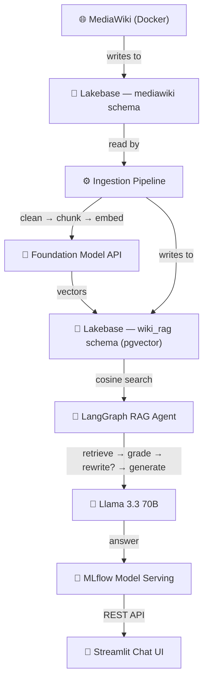

# 📖 Wiki RAG on Databricks

End-to-end Retrieval-Augmented Generation (RAG) system that turns a self-hosted **MediaWiki** into an intelligent Q&A assistant — powered entirely by **Databricks**.


## 🏗️ Architecture

| Component        | Technology                               | Description                             |
| ---------------- | ---------------------------------------- | --------------------------------------- |
| Knowledge source | MediaWiki 1.42 (Docker)                  | Self-hosted wiki backed by PostgreSQL   |
| Database         | Lakebase Provisioned (PG 16)             | Hosts both MediaWiki and RAG tables     |
| Embeddings       | `databricks-gte-large-en`                | Foundation Model API — 1024-dim vectors |
| Vector search    | pgvector + HNSW index                    | Cosine similarity retrieval             |
| RAG agent        | LangGraph StateGraph                     | retrieve → grade → rewrite → generate   |
| LLM              | `databricks-meta-llama-3-3-70b-instruct` | Answer generation                       |
| Model serving    | MLflow PyFunc + Model Serving            | Real-time endpoint with auto-scaling    |
| Chat UI          | Streamlit (Databricks App)               | Web interface for end users             |

**Data flow:**



## 📁 Project Structure

```
wiki-rag-dtbricks/
├── databricks.yml                # DAB bundle config
├── resources/
│   ├── jobs.yml                  # Ingestion workflow (hourly)
│   ├── serving.yml               # Serving endpoint reference
│   └── apps.yml                  # Databricks App reference
├── docker/
│   ├── docker-compose.yml        # MediaWiki container
│   ├── LocalSettings.php.template
│   ├── .env.example              # Credentials template
│   └── setup.sh                  # One-command bootstrap
├── src/
│   ├── config.py                 # Shared Lakebase connection helper
│   ├── ingestion/
│   │   └── mediawiki_reader.py   # Reads MW native PG tables
│   ├── pipeline/
│   │   ├── cleaner.py            # Strips wikitext → plain text
│   │   ├── chunker.py            # RecursiveCharacterTextSplitter
│   │   └── embedder.py           # Foundation Model API embeddings
│   ├── rag/
│   │   ├── retriever.py          # pgvector cosine search
│   │   └── agent.py              # LangGraph RAG agent
│   └── serving/
│       └── pyfunc_model.py       # MLflow PyFunc wrapper
├── notebooks/
│   ├── 00_setup_lakebase.py      # Provision Lakebase + DDL
│   ├── 01_ingest_mediawiki.py    # Ingest → clean → chunk → embed
│   ├── 02_rag_agent.py           # Interactive RAG testing
│   └── 03_deploy_serving.py      # Register model + deploy endpoint
└── app/
    ├── app.py                    # Streamlit chat UI
    ├── app.yaml                  # Databricks App config
    └── requirements.txt
```

## ✅ Prerequisites

- **Databricks workspace** with Unity Catalog enabled
- **Databricks CLI** `>= 0.236.0`, authenticated (`databricks auth login`)
- **Docker** and **Docker Compose**
- **Python** 3.11+

> [!IMPORTANT]
> **🇧🇷 Azure Brazil South:** all services are available. You **must enable [cross-geography routing](https://learn.microsoft.com/en-us/azure/databricks/resources/databricks-geos#cross-geo-processing)** in workspace settings for Foundation Model API calls.
> Lakebase Provisioned is in **Public Preview** on Azure (PG 16 only).

---

## 🚀 Setup

### Step 1 — Provision Lakebase

Run **`notebooks/00_setup_lakebase.py`** on your Databricks workspace.

> Set the **`mw_password`** widget before running — this becomes the static password
> for the `mediawiki` PostgreSQL role used by the Docker container.

What it does:

1. Provisions a Lakebase Provisioned instance (PG 16, 1 CU)
2. Creates the `wikidb` database
3. Enables **native PG login** + creates a `mediawiki` role (static password — no token expiry)
4. Stores credentials in the `wiki-rag` secret scope
5. Creates `wiki_rag` schema, tables, pgvector extension, and HNSW index

Verify:

```bash
databricks secrets get-secret wiki-rag lakebase_host
databricks secrets get-secret wiki-rag mw_role
```

---

### Step 2 - Start MediaWiki

```bash
cd docker
cp .env.example .env
```

Fill in `docker/.env`:

```env
# Lakebase connection (mediawiki role — static password)
LAKEBASE_HOST=<from: databricks secrets get-secret wiki-rag lakebase_host>
LAKEBASE_PORT=5432
LAKEBASE_DB=wikidb
LAKEBASE_USER=mediawiki
LAKEBASE_PASSWORD=<the password you set in mw_password widget>

# MediaWiki admin
MW_ADMIN_USER=Admin
MW_ADMIN_PASSWORD=<choose a strong password>

# MediaWiki secrets
MW_SECRET_KEY=<openssl rand -hex 32>
MW_UPGRADE_KEY=<openssl rand -hex 16>
```

> [!WARNING]
> Use strong passwords for `MW_ADMIN_PASSWORD` and `LAKEBASE_PASSWORD`, even in demo environments.

Bootstrap:

```bash
chmod +x setup.sh && ./setup.sh
```

This generates `LocalSettings.php`, starts the container, and runs the MediaWiki installer against Lakebase.

Access the wiki at **http://localhost:8080**, log in with your admin credentials, and add some pages — they'll be ingested next.

---

### Step 3 — Ingest, chunk, and embed

Run **`notebooks/01_ingest_mediawiki.py`** on your Databricks workspace.

Reads directly from MediaWiki's native PG tables → cleans wikitext → chunks → embeds via Foundation Model API → writes to `wiki_rag.wiki_chunks` + `wiki_rag.wiki_embeddings`.

**Incremental:** only processes pages with `rev_id` above the stored watermark. Safe to re-run.

---

### Step 4 — Test the RAG agent

Run **`notebooks/02_rag_agent.py`** interactively.

Tests retriever isolation and the full LangGraph agent. Edit `QUESTION` to try your own queries.

---

### Step 5 — Deploy the serving endpoint

Run **`notebooks/03_deploy_serving.py`** on your Databricks workspace.

Logs the `WikiRAGModel` PyFunc to MLflow, registers in Unity Catalog (`main.wiki_rag.wiki_rag_agent`), and creates a Model Serving endpoint with scale-to-zero. Secret scope wiring is automatic.

---

### Step 6 — Deploy the bundle

```bash
databricks bundle deploy
```

Deploys:
- **Ingestion workflow** (`wiki-rag-ingestion`) — hourly schedule, paused by default
- **Streamlit app** and **serving endpoint** references

To deploy the chat UI separately:

```bash
databricks apps create wiki-rag-app --source-code-path app/
```

---

### Step 7 — Enable the ingestion schedule

The workflow deploys **paused**. Unpause when ready:

```bash
databricks jobs list --name wiki-rag-ingestion
databricks jobs update <JOB_ID> --json '{"schedule": {"pause_status": "UNPAUSED"}}'
```

Or unpause from the **Workflows** UI. Runs hourly, incremental, exits gracefully when nothing is new.

---

## 🗄️ Database Schema

A single `wikidb` database on Lakebase hosts two schemas:

| Schema      | Owner        | Purpose                                                                    |
| ----------- | ------------ | -------------------------------------------------------------------------- |
| `mediawiki` | MediaWiki    | Native tables (`page`, `revision`, `slots`, `content`, `pagecontent`, ...) |
| `wiki_rag`  | RAG pipeline | Chunks, embeddings, and sync state                                         |

```sql
-- Cleaned and split wiki text
wiki_rag.wiki_chunks (chunk_id, page_id, page_title, page_ns, rev_id, chunk_index, chunk_text, created_at)

-- 1024-dim vectors with HNSW index (cosine similarity)
wiki_rag.wiki_embeddings (embedding_id, chunk_id, embedding vector(1024))

-- Watermark for incremental processing
wiki_rag.sync_state (key, value, updated_at)
```

---

## 🔌 SQL Client Connection

Use **pgAdmin**, **DBeaver**, or **VS Code SQLTools** to inspect the data.

**Option A — Static password (recommended for tooling):**

| Field    | Value                                                  |
| -------- | ------------------------------------------------------ |
| Host     | `databricks secrets get-secret wiki-rag lakebase_host` |
| Port     | `5432`                                                 |
| Database | `wikidb`                                               |
| Username | `mediawiki`                                            |
| Password | *(password from `mw_password` widget)*                 |
| SSL      | `require`                                              |

**Option B — OAuth token (expires ~1h):**

| Field    | Value                                                                                 |
| -------- | ------------------------------------------------------------------------------------- |
| Host     | *(same)*                                                                              |
| Port     | `5432`                                                                                |
| Database | `wikidb`                                                                              |
| Username | *(your Databricks email)*                                                             |
| Password | `databricks database generate-database-credential --instance-names wiki-rag-lakebase` |
| SSL      | `require`                                                                             |

---

## 🔐 Secrets Reference

All credentials live in the `wiki-rag` Databricks secret scope:

| Key                      | Description                              |
| ------------------------ | ---------------------------------------- |
| `lakebase_instance_name` | Lakebase instance name                   |
| `lakebase_user`          | Databricks username (email)              |
| `lakebase_db`            | Database name (`wikidb`)                 |
| `lakebase_host`          | Lakebase endpoint DNS                    |
| `mw_role`                | MediaWiki PG role (`mediawiki`)          |
| `mw_password`            | Static password for the `mediawiki` role |
