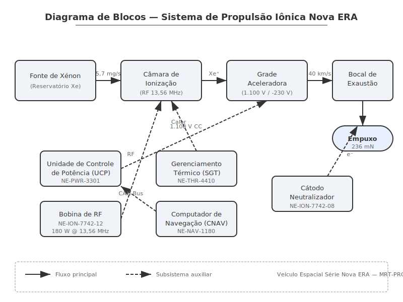
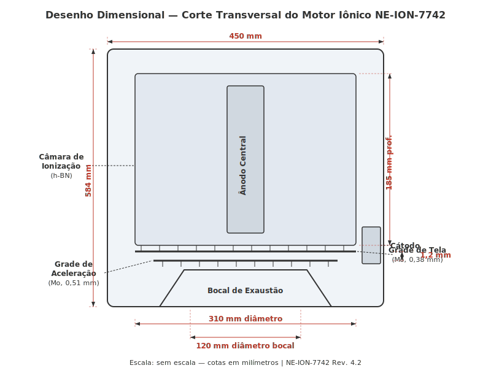
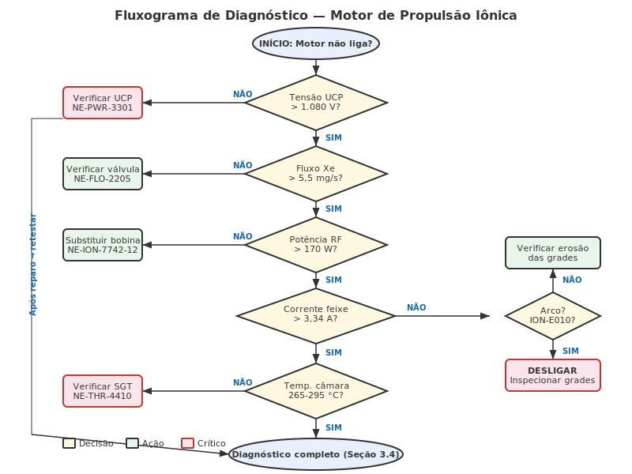
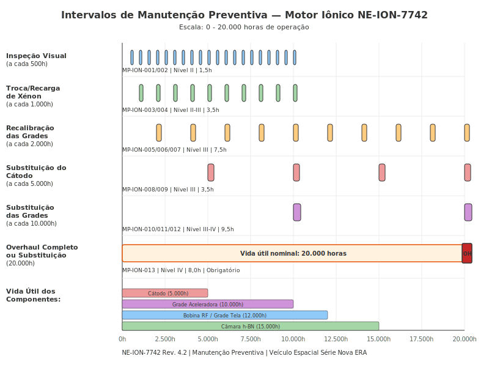

# Motor de Propulsão Iônica

**Manual de Reparo Técnico — Veículo Espacial Série Databricks Galáctica**
**Documento:** MRT-PROP-001 | **Revisão:** 4.2 | **Data:** 2187-03-15
**Classificação:** Uso Interno — Técnicos Certificados Nível III+

---

> **AVISO DE SEGURANÇA GERAL:** Antes de iniciar qualquer procedimento descrito neste manual, o técnico deve garantir que o sistema de propulsão esteja completamente desenergizado, que o reservatório de xénon esteja despressurizado e que todos os EPIs (Equipamentos de Proteção Individual) adequados estejam em uso, incluindo luvas antiestáticas classe IV e protetor facial contra radiação UV residual. O não cumprimento destas normas pode resultar em lesões graves ou fatais.

---

## 1. Visão Geral e Princípios de Funcionamento

O Motor de Propulsão Iônica do Veículo Espacial Série Databricks Galáctica (número de peça principal **NE-ION-7742**) é o sistema primário de empuxo para manobras orbitais, transferências interplanetárias e correções de trajetória. Este motor utiliza o princípio de aceleração eletrostática de íons de xénon para gerar empuxo contínuo de alta eficiência, com impulso específico (Isp) superior a 4.200 segundos.

### 1.1 Princípio Básico de Operação

O funcionamento do motor iônico baseia-se em três etapas fundamentais:

1. **Ionização do propelente:** O gás xénon (Xe) é introduzido na câmara de ionização, onde um campo eletromagnético de alta frequência (operando a 13,56 MHz) remove elétrons dos átomos de xénon, criando íons positivos (Xe⁺).
2. **Aceleração eletrostática:** Os íons positivos são atraídos e acelerados por um sistema de grades carregadas eletricamente (grade de tela e grade aceleradora), atingindo velocidades de exaustão de aproximadamente 40 km/s.
3. **Neutralização e exaustão:** Um cátodo neutralizador emite elétrons no feixe de íons exaurido, neutralizando a carga elétrica do plasma expelido e evitando o acúmulo de carga negativa na espaçonave.

### 1.2 Diagrama de Blocos do Sistema

O diagrama abaixo ilustra a arquitetura funcional completa do sistema de propulsão iônica do Databricks Galáctica:

### 1.3 Subsistemas Integrados

O motor de propulsão iônica não opera de forma isolada. Ele se integra com diversos subsistemas da espaçonave, conforme descrito na tabela a seguir:

| Subsistema | Função na Integração | Interface | Número da Peça da Interface |
|---|---|---|---|
| Unidade de Controle de Potência (UCP) | Fornece tensão regulada de 1.100 V CC para as grades aceleradoras | Conector MIL-DTL-38999 Série III | NE-PWR-3301 |
| Sistema de Alimentação de Xénon (SAX) | Regula o fluxo de xénon do tanque principal para a câmara de ionização | Válvula proporcional MOOG tipo 52 | NE-FLO-2205 |
| Computador de Navegação (CNAV) | Envia comandos de empuxo vetorial e duração de queima | Barramento CAN-Aerospace 2.0 | NE-NAV-1180 |
| Sistema de Gerenciamento Térmico (SGT) | Dissipa calor residual da câmara de ionização e da UCP | Loop de fluido bifásico (amônia) | NE-THR-4410 |
| Mecanismo de Articulação Gimbal (MAG) | Permite vetorização do empuxo em ±15° nos eixos X e Y | Atuador elétrico linear duplo | NE-GMB-5567 |

### 1.4 Parâmetros Nominais de Operação

Durante operação normal em regime estacionário, o motor deve apresentar os seguintes parâmetros:

- **Empuxo nominal:** 236 mN (mili-Newtons)
- **Impulso específico (Isp):** 4.220 s
- **Potência de entrada:** 6,9 kW
- **Vazão mássica de xénon:** 5,7 mg/s
- **Tensão da grade aceleradora:** -210 V a -250 V
- **Tensão da grade de tela:** +1.100 V ± 20 V
- **Corrente do feixe:** 3,52 A
- **Temperatura da câmara de ionização:** 280 °C ± 15 °C (regime estacionário)
- **Vida útil nominal:** 20.000 horas de operação contínua

> **NOTA TÉCNICA:** Qualquer desvio superior a 10% nos valores acima indica necessidade de diagnóstico imediato conforme Seção 3 deste manual.

---

## 2. Especificações Técnicas

Esta seção detalha as especificações dimensionais, materiais, tolerâncias de fabricação e números de peça de todos os componentes principais do Motor de Propulsão Iônica NE-ION-7742.

### 2.1 Desenho Dimensional

O diagrama abaixo apresenta uma vista em corte transversal simplificada do motor, com cotas dimensionais principais:

### 2.2 Dimensões Gerais do Conjunto

| Parâmetro | Valor | Tolerância |
|---|---|---|
| Comprimento total (incluindo bocal) | 584 mm | ± 0,5 mm |
| Diâmetro externo máximo | 450 mm | ± 0,3 mm |
| Diâmetro da câmara de ionização | 310 mm | ± 0,2 mm |
| Diâmetro da abertura do bocal de exaustão | 120 mm | ± 0,1 mm |
| Profundidade da câmara de ionização | 185 mm | ± 0,3 mm |
| Espaçamento entre grades (tela-aceleradora) | 1,2 mm | ± 0,05 mm |
| Espessura da grade de tela | 0,38 mm | ± 0,02 mm |
| Espessura da grade aceleradora | 0,51 mm | ± 0,02 mm |
| Diâmetro dos orifícios da grade | 1,91 mm | ± 0,03 mm |
| Massa total do conjunto (seco) | 12,7 kg | ± 0,2 kg |

### 2.3 Materiais dos Componentes

| Componente | Material | Especificação | Justificativa |
|---|---|---|---|
| Corpo externo / carcaça | Liga de titânio Ti-6Al-4V | AMS 4911 | Alta resistência mecânica, baixa massa, resistência a corrosão |
| Grades (tela e aceleradora) | Molibdênio puro (Mo 99,97%) | ASTM B386 Tipo 361 | Resistência à erosão por sputtering, alta temperatura de fusão |
| Câmara de ionização | Nitreto de boro hexagonal (h-BN) | Grau espacial MIL-PRF-60B | Isolante elétrico, resistência térmica, baixo sputtering |
| Ânodo central | Aço inoxidável 316L | ASTM A240 | Resistência à oxidação, compatibilidade eletroquímica |
| Cátodo neutralizador | Tungstênio toriatado (W-2%ThO₂) | AMS 7725 | Baixa função trabalho, alta emissividade termiônica |
| Isoladores de grade | Cerâmica de alumina (Al₂O₃ 99,8%) | MIL-I-10A | Isolamento elétrico de alta tensão, estabilidade dimensional |
| Selos e vedações | Fluoroelastômero FFKM (Kalrez 7090) | — | Resistência a xénon ionizado, faixa térmica ampla |

### 2.4 Lista de Peças Principais (BOM — Bill of Materials)

| Nº Item | Número da Peça | Descrição | Qtd. | Peso Unit. (g) | Substituível em Campo |
|---|---|---|---|---|---|
| 1 | NE-ION-7742 | Conjunto motor de propulsão iônica completo | 1 | 12.700 | Sim |
| 2 | NE-ION-7742-01 | Carcaça externa em titânio | 1 | 3.840 | Não* |
| 3 | NE-ION-7742-02 | Tampa superior com anel de vedação | 1 | 1.220 | Sim |
| 4 | NE-ION-7742-03 | Câmara de ionização (h-BN) | 1 | 2.150 | Sim |
| 5 | NE-ION-7742-04 | Ânodo central em aço 316L | 1 | 890 | Sim |
| 6 | NE-ION-7742-05 | Grade de tela (molibdênio) | 1 | 340 | Sim |
| 7 | NE-ION-7742-06 | Grade aceleradora (molibdênio) | 1 | 480 | Sim |
| 8 | NE-ION-7742-07 | Espaçadores isolantes de alumina (jogo c/ 6) | 1 | 180 | Sim |
| 9 | NE-ION-7742-08 | Cátodo neutralizador (tungstênio) | 1 | 95 | Sim |
| 10 | NE-ION-7742-09 | Base de montagem com interface gimbal | 1 | 2.100 | Não* |
| 11 | NE-ION-7742-10 | Kit de vedações FFKM (jogo completo) | 1 | 45 | Sim |
| 12 | NE-ION-7742-11 | Conector elétrico de alta tensão (par) | 2 | 120 | Sim |
| 13 | NE-ION-7742-12 | Bobina de RF para ionização | 1 | 640 | Sim |
| 14 | NE-ION-7742-13 | Sensor de temperatura (termopar tipo K) | 3 | 15 | Sim |
| 15 | NE-ION-7742-14 | Sensor de corrente do feixe | 1 | 55 | Sim |

> *\*Componentes marcados como "Não" para substituição em campo requerem retorno à base de manutenção nível IV para reparo ou substituição.*

### 2.5 Torques de Aperto

| Fixador | Especificação do Parafuso | Torque | Sequência |
|---|---|---|---|
| Parafusos da tampa superior (8x) | M6 x 20 mm, Ti Gr. 5, AN960-6 | 12 ± 0,5 N·m | Estrela cruzada |
| Parafusos da base de montagem (12x) | M8 x 25 mm, Ti Gr. 5, AN960-8 | 28 ± 1,0 N·m | Estrela cruzada |
| Porcas dos espaçadores de grade (6x) | M4, Ti Gr. 2 | 4,5 ± 0,3 N·m | Sequencial horário |
| Conector elétrico HV | Rosca especial NE-THD-01 | 3,0 ± 0,2 N·m | — |
| Fixação do cátodo neutralizador | M3 x 10 mm, Inconel 718 | 2,0 ± 0,1 N·m | — |
| Fixação da bobina de RF | M5 x 15 mm, Ti Gr. 5 | 8,0 ± 0,5 N·m | Diametralmente oposta |

---

## 3. Procedimento de Diagnóstico

Esta seção descreve os procedimentos de diagnóstico para identificação e resolução de falhas no Motor de Propulsão Iônica NE-ION-7742. O técnico deve seguir rigorosamente a árvore de decisão e os códigos de erro antes de iniciar qualquer reparo.

### 3.1 Equipamentos Necessários para Diagnóstico

Antes de iniciar o diagnóstico, certifique-se de ter os seguintes instrumentos disponíveis e calibrados:

- Multímetro digital de alta impedância (>10 GΩ), faixa 0-2000 V CC — **NE-TOOL-8801**
- Analisador de espectro de RF (10 MHz - 100 MHz) — **NE-TOOL-8802**
- Medidor de vazão mássica para xénon (0-10 mg/s) — **NE-TOOL-8803**
- Sonda de temperatura IR sem contato (faixa -40 °C a 800 °C) — **NE-TOOL-8804**
- Terminal de diagnóstico com software Databricks Galáctica DiagPro v3.7+ — **NE-TOOL-8810**
- Câmera térmica FLIR (resolução mínima 320x240) — **NE-TOOL-8805**

### 3.2 Fluxograma de Diagnóstico

O fluxograma abaixo apresenta a árvore de decisão principal para diagnóstico de falhas do motor iônico:

### 3.3 Códigos de Erro do Sistema

Quando uma falha é detectada pelo computador de bordo, um código alfanumérico é registrado no log de eventos. A tabela a seguir lista os códigos mais comuns e suas causas prováveis:

| Código de Erro | Descrição | Severidade | Causa Provável | Ação Recomendada |
|---|---|---|---|---|
| ION-E001 | Falha na ignição da câmara de ionização | Crítica | Bobina de RF danificada ou conector solto | Verificar continuidade da bobina NE-ION-7742-12; inspecionar conector |
| ION-E002 | Corrente do feixe abaixo do nominal (< 2,8 A) | Alta | Erosão nas grades; obstrução no fluxo de xénon | Inspecionar grades; verificar válvula de xénon NE-FLO-2205 |
| ION-E003 | Sobretemperatura na câmara (> 350 °C) | Crítica | Falha no sistema de arrefecimento; fluxo de Xe excessivo | Desligar motor imediatamente; verificar SGT e válvula Xe |
| ION-E004 | Tensão da grade aceleradora fora da faixa | Alta | Falha no regulador de tensão da UCP; curto nas grades | Medir tensão na saída da UCP; inspecionar isoladores de alumina |
| ION-E005 | Vazamento de xénon detectado | Média | Vedação FFKM degradada; trinca na câmara | Teste de estanqueidade com hélio; substituir kit de vedações |
| ION-E006 | Falha no cátodo neutralizador | Alta | Filamento desgastado; contaminação do cátodo | Medir resistência do filamento; substituir cátodo NE-ION-7742-08 |
| ION-E007 | Oscilação na corrente do feixe (> ±15%) | Média | Instabilidade do plasma; grades desalinhadas | Recalibrar RF; verificar alinhamento das grades |
| ION-E008 | Perda de comunicação com sensor de temperatura | Baixa | Termopar desconectado ou queimado | Verificar fiação; substituir termopar NE-ION-7742-13 |
| ION-E009 | Empuxo abaixo de 180 mN em potência nominal | Alta | Degradação geral do motor; múltiplas causas | Diagnóstico completo conforme procedimento 3.4 |
| ION-E010 | Arco elétrico detectado entre grades | Crítica | Espaçamento de grades fora de tolerância; detritos | **Desligar imediatamente**; inspeção visual obrigatória |

### 3.4 Procedimento de Diagnóstico Completo

Quando o código ION-E009 é registrado ou quando o desempenho do motor degrada gradualmente, execute o procedimento de diagnóstico completo:

1. **Conectar o terminal de diagnóstico** ao barramento CAN-Aerospace via porta J3 do painel de manutenção.
2. **Executar autoteste de sensores** (comando: `DIAG AUTO_SENSOR_CHECK`). Aguardar conclusão (~45 segundos).
3. **Registrar as leituras de referência:**
   - Tensão da grade de tela (esperado: 1.100 V ± 20 V)
   - Tensão da grade aceleradora (esperado: -210 V a -250 V)
   - Corrente do feixe (esperado: 3,52 A ± 5%)
   - Temperatura da câmara (esperado: 280 °C ± 15 °C)
   - Vazão de xénon (esperado: 5,7 mg/s ± 3%)
4. **Comparar valores medidos** com os nominais da tabela abaixo:

| Parâmetro | Valor Nominal | Faixa Aceitável | Fora de Faixa — Ação |
|---|---|---|---|
| Tensão grade tela | 1.100 V | 1.080 - 1.120 V | Verificar UCP (NE-PWR-3301) |
| Tensão grade aceleradora | -230 V | -210 a -250 V | Verificar regulador e isoladores |
| Corrente do feixe | 3,52 A | 3,34 - 3,70 A | Inspecionar grades e câmara |
| Temperatura câmara | 280 °C | 265 - 295 °C | Verificar SGT e vazão Xe |
| Vazão de xénon | 5,7 mg/s | 5,53 - 5,87 mg/s | Verificar válvula NE-FLO-2205 |
| Potência de RF | 180 W | 170 - 195 W | Verificar bobina e amplificador |

5. **Executar teste de potência escalonada** (comando: `DIAG POWER_SWEEP 20 100 5`), que varia a potência de 20% a 100% em incrementos de 5%, registrando todos os parâmetros em cada ponto.
6. **Analisar a curva de resposta** no software DiagPro. Desvios significativos da curva de referência (armazenada na memória do terminal) indicam degradação específica de componentes.
7. **Gerar relatório de diagnóstico** (comando: `DIAG REPORT_GENERATE`), que será salvo automaticamente no log de manutenção da espaçonave.

> **ATENÇÃO:** Durante o teste de potência escalonada, mantenha distância mínima de 2 metros do bocal de exaustão. Mesmo em bancada de teste, o feixe de íons pode causar danos a superfícies e equipamentos no caminho de exaustão.

### 3.5 Inspeção Visual com Boroscópio

Para complementar o diagnóstico eletrônico, uma inspeção visual interna pode ser realizada sem desmontagem completa:

1. Remover o cátodo neutralizador (4 parafusos M3, torque de remoção reverso).
2. Inserir o boroscópio (diâmetro máx. 4 mm) pela abertura do cátodo.
3. Inspecionar visualmente:
   - **Superfície das grades:** procurar erosão, pit marks, deformação ou detritos.
   - **Interior da câmara de ionização:** verificar descoloração anormal (marrom escuro indica contaminação), trincas ou lascas no h-BN.
   - **Ânodo central:** verificar depósitos, erosão ou descoloração irregular.
4. Documentar com fotografias para inclusão no relatório de manutenção.

---

## 4. Procedimento de Reparo / Substituição

Esta seção descreve os procedimentos detalhados para desmontagem, reparo e remontagem do Motor de Propulsão Iônica NE-ION-7742. Estes procedimentos devem ser executados exclusivamente por técnicos certificados Nível III ou superior, em ambiente limpo classe 10.000 (ISO 7) ou melhor.

### 4.1 Vista Explodida do Conjunto

O diagrama abaixo apresenta a vista explodida do motor com todos os componentes principais identificados:

### 4.2 Ferramentas Necessárias

| Ferramenta | Número da Peça | Especificação |
|---|---|---|
| Chave de torque digital (1-15 N·m) | NE-TOOL-9001 | Precisão ± 2%, certificado calibração válido |
| Chave de torque digital (10-50 N·m) | NE-TOOL-9002 | Precisão ± 2%, certificado calibração válido |
| Jogo de chaves Allen (métrico, 2-8 mm) | NE-TOOL-9003 | Aço cromo-vanádio, antiestático |
| Extrator de grades iônicas | NE-TOOL-9010 | Ferramenta especial — não substituir por improvisação |
| Gabarito de alinhamento de grades | NE-TOOL-9011 | Tolerância de posicionamento ± 0,02 mm |
| Suporte de desmontagem (berço) | NE-TOOL-9020 | Para fixação segura do motor durante trabalho |
| Medidor de espaçamento (feeler gauge) | NE-TOOL-9012 | Lâminas de 0,05 a 2,00 mm |
| Solvente de limpeza isopropanol (IPA 99,9%) | NE-CONS-6001 | Grau eletrônico |
| Lenços de limpeza sem fiapos (pacote) | NE-CONS-6002 | Classe 100 |
| Graxa de vácuo (Apiezon L) | NE-CONS-6003 | Para vedações FFKM |
| Kit de vedações FFKM de reposição | NE-ION-7742-10 | Obrigatório trocar a cada desmontagem |

### 4.3 Procedimento de Desmontagem

> **AVISO CRÍTICO:** Antes de iniciar a desmontagem, confirme que:
> - O sistema está completamente desenergizado (tensão residual < 5 V em todas as linhas).
> - O reservatório de xénon está isolado e a linha de alimentação despressurizada.
> - O motor atingiu temperatura ambiente (< 40 °C).
> - O capacitor da UCP foi descarregado (procedimento MRT-PWR-003, Seção 7).

**Etapas de Desmontagem:**

1. **Fixar o motor no berço de desmontagem** (NE-TOOL-9020). Orientar com o bocal de exaustão voltado para cima.
2. **Desconectar o conector elétrico de alta tensão** (NE-ION-7742-11). Girar o anel de travamento 45° no sentido anti-horário e puxar suavemente. **Não forçar.** Se houver resistência, verificar se o pino de segurança foi liberado.
3. **Desconectar o conector da bobina de RF.** Soltar o parafuso de retenção (Phillips #2) e desencaixar o conector tipo SMA.
4. **Desconectar os termopares** (3 unidades). Puxar pelos conectores miniatura tipo K, nunca pelos fios.
5. **Desconectar a linha de alimentação de xénon.** Utilizar chave de 10 mm na porca de compressão Swagelok. Tampar a linha com tampão NE-CAP-0010 imediatamente após desconexão.
6. **Remover os 8 parafusos da tampa superior** (M6 x 20 mm). Sequência de remoção: soltar todos em estrela cruzada a 50% primeiro, depois remover completamente.
7. **Levantar a tampa superior** com cuidado. A vedação O-ring ficará aderida — não usar ferramentas metálicas para separar. Utilizar espátula de PTFE se necessário.
8. **Extrair o cátodo neutralizador** (4 parafusos M3). Armazenar em recipiente antiestático.
9. **Remover a grade aceleradora** utilizando o extrator de grades (NE-TOOL-9010). Encaixar os três pinos do extrator nos furos guia da grade. Girar o punho central no sentido anti-horário para extrair a grade uniformemente. **Não inclinar — risco de deformação permanente.**
10. **Remover os espaçadores isolantes de alumina** (6 unidades). Numerar e registrar a posição de cada um (P1-P6, sentido horário a partir da marca de referência).
11. **Remover a grade de tela** utilizando o mesmo extrator (NE-TOOL-9010), reposicionando os pinos para os furos guia da grade de tela.
12. **Extrair a câmara de ionização (h-BN)** puxando-a para cima. O encaixe é por interferência suave — pode ser necessário leve rotação alternada.
13. **Remover o ânodo central** soltando os 3 parafusos de fixação (M5 x 15 mm, Allen 4 mm) na base. Desconectar o terminal elétrico do ânodo.

### 4.4 Inspeção dos Componentes Desmontados

Após desmontagem, inspecionar cada componente conforme os critérios abaixo:

| Componente | Critério de Aprovação | Critério de Rejeição | Instrumento de Medição |
|---|---|---|---|
| Grade de tela | Erosão < 15% da espessura original; sem deformação visível | Erosão ≥ 15%; qualquer furo obstruído; deformação > 0,1 mm | Micrômetro; microscópio 10x |
| Grade aceleradora | Erosão < 20% da espessura original; orifícios dentro da tolerância | Erosão ≥ 20%; diâmetro dos orifícios > 2,1 mm | Micrômetro; calibrador de furos |
| Câmara de ionização | Sem trincas; descoloração uniforme cinza claro | Trincas visíveis; descoloração marrom/preta; lascas | Inspeção visual; luz UV |
| Ânodo central | Superfície uniforme; sem depósitos espessos | Depósitos > 0,5 mm; erosão profunda; pitting severo | Inspeção visual; régua de profundidade |
| Cátodo neutralizador | Resistência do filamento 0,8-1,2 Ω | Resistência fora da faixa; filamento visualmente danificado | Multímetro |
| Isoladores de alumina | Sem trincas; superfície limpa | Trincas; depósitos condutivos; carbonização | Inspeção visual; megôhmetro (> 100 MΩ) |

### 4.5 Procedimento de Remontagem

A remontagem deve seguir a ordem inversa da desmontagem, com as seguintes observações críticas:

1. **Limpar todas as superfícies de contato** com IPA 99,9% e lenços sem fiapos. Aguardar secagem completa (mínimo 5 minutos em ambiente ventilado).
2. **Instalar novas vedações FFKM** (NE-ION-7742-10). **Nunca reutilizar vedações usadas.** Aplicar fina camada de graxa de vácuo Apiezon L em cada O-ring antes da instalação.
3. **Posicionar o ânodo central** na base. Aplicar torque de 8,0 ± 0,5 N·m nos 3 parafusos M5, em sequência diametralmente oposta. Reconectar o terminal elétrico.
4. **Inserir a câmara de ionização (h-BN)** alinhando a marca de referência com o pino guia na carcaça. Pressionar uniformemente até assentar.
5. **Posicionar a grade de tela** utilizando o gabarito de alinhamento (NE-TOOL-9011). Verificar centralização com o gabarito antes de prosseguir.
6. **Instalar os espaçadores isolantes de alumina** nas posições originais (P1-P6). Aplicar torque de 4,5 ± 0,3 N·m nas porcas, sequência horária.
7. **Posicionar a grade aceleradora** sobre os espaçadores. Verificar alinhamento com o gabarito.
8. **Medir o espaçamento entre grades** com o feeler gauge (NE-TOOL-9012) em 6 pontos igualmente distribuídos. Valor obrigatório: **1,20 mm ± 0,05 mm** em todos os pontos.

   > **CRÍTICO:** Se qualquer medição estiver fora da tolerância de 1,15 - 1,25 mm, **NÃO prosseguir**. Desmontar e investigar a causa (espaçador danificado, deformação de grade, detrito entre superfícies).

9. **Instalar o cátodo neutralizador** (4 parafusos M3, torque 2,0 ± 0,1 N·m).
10. **Posicionar a tampa superior** com novo O-ring. Apertar os 8 parafusos M6 em estrela cruzada, em três estágios:
    - Estágio 1: 4,0 N·m (todos os parafusos)
    - Estágio 2: 8,0 N·m (todos os parafusos)
    - Estágio 3: 12,0 ± 0,5 N·m (torque final, todos os parafusos)
11. **Reconectar todos os cabos e linhas** na ordem inversa da desconexão. Verificar cada conexão duas vezes.
12. **Executar teste de estanqueidade** com hélio (pressão de teste: 150 kPa, taxa de vazamento máxima aceitável: 1 × 10⁻⁶ std cm³/s).

### 4.6 Teste Funcional Pós-Remontagem

Após a remontagem completa, executar o teste funcional conforme o procedimento a seguir:

1. Energizar o sistema em modo de teste (comando: `SYS PWR_ON TEST_MODE`).
2. Executar verificação de isolamento elétrico (comando: `DIAG INSULATION_CHECK`). Resultado esperado: **> 500 MΩ** entre todas as linhas de alta tensão e o chassi.
3. Iniciar fluxo de xénon em taxa mínima (1,0 mg/s) e verificar ausência de vazamentos.
4. Executar ignição em potência mínima (20%) e monitorar todos os parâmetros por 60 segundos.
5. Rampa gradual até 100% de potência em incrementos de 10%, permanecendo 30 segundos em cada nível.
6. Em potência nominal, confirmar que todos os parâmetros estão dentro das faixas da Seção 3.4.
7. Desligar e registrar resultados no log de manutenção.

---

## 5. Manutenção Preventiva e Intervalos

A manutenção preventiva regular é essencial para garantir a confiabilidade e a vida útil do Motor de Propulsão Iônica NE-ION-7742. Esta seção define os intervalos de manutenção, as tarefas associadas e os critérios de vida útil dos componentes.

### 5.1 Diagrama de Intervalos de Manutenção

O diagrama abaixo apresenta uma visão temporal dos intervalos de manutenção programada:

### 5.2 Tabela de Manutenção Programada

| Intervalo (horas de operação) | Código da Tarefa | Descrição da Tarefa | Nível Técnico Mín. | Tempo Estimado |
|---|---|---|---|---|
| 500 h | MP-ION-001 | Inspeção visual externa; verificação de conexões; leitura de diagnóstico | Nível II | 1,0 h |
| 500 h | MP-ION-002 | Verificação de vazamento de xénon (detector portátil) | Nível II | 0,5 h |
| 1.000 h | MP-ION-003 | Substituição / recarga do reservatório de xénon (se < 30% da capacidade) | Nível II | 2,0 h |
| 1.000 h | MP-ION-004 | Diagnóstico completo conforme Seção 3.4; registro de curva de desempenho | Nível III | 1,5 h |
| 2.000 h | MP-ION-005 | Inspeção interna com boroscópio conforme Seção 3.5 | Nível III | 2,0 h |
| 2.000 h | MP-ION-006 | Recalibração das grades (ajuste de espaçamento) | Nível III | 3,0 h |
| 2.000 h | MP-ION-007 | Substituição do kit de vedações FFKM (NE-ION-7742-10) | Nível III | 2,5 h |
| 5.000 h | MP-ION-008 | Substituição do cátodo neutralizador (NE-ION-7742-08) | Nível III | 1,5 h |
| 5.000 h | MP-ION-009 | Inspeção metrológica das grades (espessura e diâmetro dos orifícios) | Nível III | 2,0 h |
| 10.000 h | MP-ION-010 | Substituição das grades de tela e aceleradora | Nível IV | 4,0 h |
| 10.000 h | MP-ION-011 | Substituição da câmara de ionização (h-BN) | Nível IV | 3,5 h |
| 10.000 h | MP-ION-012 | Substituição da bobina de RF (NE-ION-7742-12) | Nível III | 2,0 h |
| 20.000 h | MP-ION-013 | **Overhaul completo** ou **substituição do conjunto motor** | Nível IV | 8,0 h |

### 5.3 Vida Útil Estimada dos Componentes

| Componente | Número da Peça | Vida Útil Nominal | Fator Limitante | Indicador de Fim de Vida |
|---|---|---|---|---|
| Grade de tela (Mo) | NE-ION-7742-05 | 12.000 h | Erosão por sputtering | Espessura < 85% da original |
| Grade aceleradora (Mo) | NE-ION-7742-06 | 10.000 h | Erosão por sputtering (mais severa) | Diâmetro dos orifícios > 2,1 mm |
| Câmara de ionização (h-BN) | NE-ION-7742-03 | 15.000 h | Erosão superficial e contaminação | Descoloração marrom; perda de massa > 5% |
| Cátodo neutralizador (W) | NE-ION-7742-08 | 5.000 h | Evaporação do filamento | Resistência > 1,5 Ω |
| Bobina de RF | NE-ION-7742-12 | 12.000 h | Degradação do isolamento | Potência refletida > 10% |
| Vedações FFKM | NE-ION-7742-10 | 2.000 h (ou 1 desmontagem) | Endurecimento por radiação UV | Inspeção visual; perda de elasticidade |
| Ânodo central (316L) | NE-ION-7742-04 | 20.000 h | Erosão e depósitos | Profundidade de erosão > 1,0 mm |
| Sensores de temperatura | NE-ION-7742-13 | 10.000 h | Deriva do termopar | Desvio > 5 °C vs. referência |
| Sensor de corrente do feixe | NE-ION-7742-14 | 15.000 h | Degradação do elemento sensor | Desvio > 3% vs. referência |

### 5.4 Checklist de Manutenção Preventiva a Cada 500 Horas

Utilize o checklist abaixo para as inspeções regulares de 500 horas. Marque cada item e assine ao final.

- [ ] Inspeção visual da carcaça externa: sem deformações, trincas ou danos visíveis
- [ ] Verificação do aperto dos conectores elétricos (inspeção tátil, sem torquímetro)
- [ ] Verificação do aperto da conexão de xénon (inspeção tátil)
- [ ] Leitura de diagnóstico via terminal DiagPro: sem códigos de erro ativos
- [ ] Registro dos parâmetros operacionais atuais (corrente do feixe, temperaturas, tensões)
- [ ] Comparação dos parâmetros com os valores nominais (desvio < 5%: OK; 5-10%: monitorar; > 10%: investigar)
- [ ] Teste de vazamento de xénon com detector portátil (resultado: _____ ppm; aceitável < 10 ppm)
- [ ] Verificação do nível do reservatório de xénon (leitura: _____%; mínimo operacional: 15%)
- [ ] Inspeção visual do bocal de exaustão: sem depósitos ou obstruções
- [ ] Verificação do mecanismo gimbal: movimento suave em ambos os eixos, sem folga excessiva
- [ ] Registro da leitura do horímetro: _____ horas totais de operação
- [ ] Atualização do log de manutenção no sistema da espaçonave

> **NOTA:** Se qualquer item do checklist apresentar anomalia, documentar detalhadamente e escalar para o nível técnico apropriado conforme a natureza do problema.

### 5.5 Armazenamento de Peças de Reposição

As peças de reposição do motor iônico devem ser armazenadas conforme as seguintes condições:

| Categoria de Peça | Temperatura | Umidade Relativa | Embalagem | Validade Máxima |
|---|---|---|---|---|
| Grades de molibdênio | -10 °C a +50 °C | < 60% | Embalagem a vácuo com dessecante | 10 anos |
| Câmara h-BN | -10 °C a +50 °C | < 50% | Embalagem antiestática, caixa rígida | 15 anos |
| Cátodo neutralizador | +5 °C a +35 °C | < 40% | Embalagem a vácuo, recipiente selado | 5 anos |
| Kit de vedações FFKM | +5 °C a +25 °C | < 50% | Embalagem original selada, protegida de luz UV | 3 anos |
| Bobina de RF | -10 °C a +50 °C | < 60% | Embalagem antiestática | 8 anos |
| Sensores (termopares, corrente) | -10 °C a +50 °C | < 60% | Embalagem original | 5 anos |

### 5.6 Registro e Rastreabilidade

Todas as atividades de manutenção devem ser registradas no **Sistema de Gerenciamento de Manutenção da Frota Databricks Galáctica (SGMF-NE)**, incluindo:

1. **Identificação do motor:** Número de série (gravado na base de montagem, formato NE-ION-7742-SN-XXXXX).
2. **Horímetro:** Horas de operação no momento da manutenção.
3. **Tarefas executadas:** Código da tarefa (MP-ION-XXX) e resultado (aprovado/reprovado/substituído).
4. **Peças substituídas:** Número de peça, número de série (se aplicável) e lote de fabricação.
5. **Técnico responsável:** Nome, número de certificação e nível.
6. **Resultado do teste funcional pós-manutenção** (quando aplicável).
7. **Próxima manutenção programada:** Data ou horímetro previsto.

> **IMPORTANTE:** A rastreabilidade completa das peças instaladas é requisito regulatório da Agência Espacial de Regulação (AER). A ausência de registros pode resultar na suspensão da certificação de aeronavegabilidade do veículo.

---

*Fim do documento MRT-PROP-001 Rev. 4.2 — Motor de Propulsão Iônica NE-ION-7742*
*Próxima revisão programada: 2187-09-15*
*Documento controlado — reprodução não autorizada proibida.*
