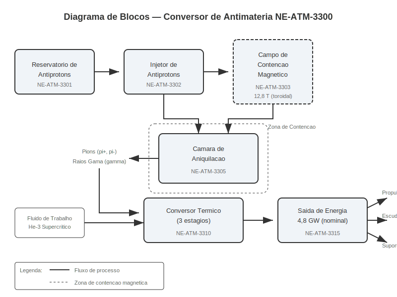
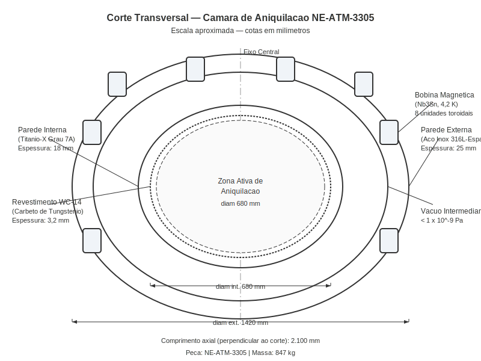
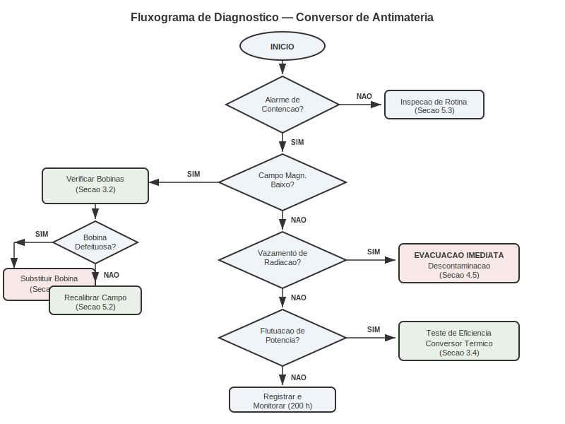
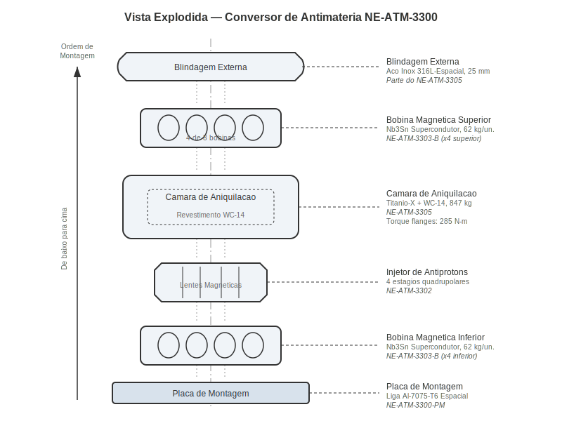
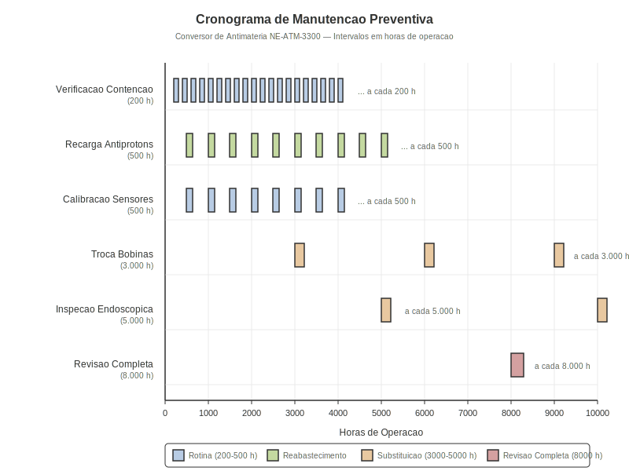

# Conversor de Antimatéria

**Manual de Reparo e Manutenção — Veículo Espacial Série Databricks Galáctica**
**Documento:** MR-NE-ATM-001 | **Revisão:** 7.2 | **Data de Emissão:** 2187-03-15
**Classificação de Segurança:** Nível Alfa — Pessoal Certificado em Antimatéria Apenas

---

> **AVISO DE SEGURANÇA:** Procedimentos deste manual devem ser executados **exclusivamente** por técnicos certificados PMA Nível III ou superior. Manipulação inadequada pode resultar em aniquilação descontrolada e destruição total do veículo em raio de 50 km. **Nunca opere sem o Traje de Contenção Classe Gama (NE-SEG-7700).**

---

## 1. Visão Geral e Princípios de Funcionamento

O **Conversor de Antimatéria Modelo NE-ATM-3300** é o sistema primário de geração de energia do Veículo Espacial Série Databricks Galáctica. Projetado pela *Divisão de Propulsão Avançada da NovaEra Aerospace*, este sistema converte a energia liberada pela aniquilação matéria-antimatéria em energia térmica e elétrica utilizável, alimentando todos os subsistemas do veículo, incluindo propulsão subluminal, escudos defletores e sistemas de suporte vital.

### 1.1 Princípio Fundamental de Aniquilação

Quando uma partícula de matéria encontra sua antipartícula correspondente, ambas são completamente convertidas em energia pura, conforme descrito pela equação de Einstein:

**E = mc²**

No caso do Conversor NE-ATM-3300, o processo utiliza **antiprótons** armazenados em armadilhas magnéticas de Penning modificadas. Os antiprótons são injetados de forma controlada na **Câmara de Aniquilação** (peça NE-ATM-3305), onde colidem com um alvo de hidrogênio molecular. O resultado é a produção de **píons carregados** e **raios gama**, que são capturados e convertidos em energia térmica pelo sistema de conversão.

### 1.2 Arquitetura do Sistema

O sistema completo é composto pelos seguintes módulos principais:

1. **Reservatório de Antiprótons** (NE-ATM-3301) — armazena até 2,5 mg de antiprótons em estado de confinamento eletromagnético ultra-alto vácuo.
2. **Injetor de Antiprótons** (NE-ATM-3302) — controla a taxa de liberação de antiprótons para a câmara de aniquilação com precisão de ±0,001 ng/ciclo.
3. **Campo de Contenção Magnético** (NE-ATM-3303) — gera um campo toroidal de 12,8 Tesla que confina o plasma de aniquilação.
4. **Câmara de Aniquilação** (NE-ATM-3305) — estrutura de titânio-X revestida internamente com carbeto de tungstênio de grau espacial.
5. **Conversor Térmico** (NE-ATM-3310) — transforma a energia cinética dos píons e a radiação gama em energia térmica utilizável.
6. **Módulo de Saída de Energia** (NE-ATM-3315) — distribui a energia convertida para os barramentos principais do veículo.

### 1.3 Ciclo Operacional

O ciclo operacional do conversor segue uma sequência precisa de eventos:

1. O **Sistema de Controle Central** (SCC) envia um comando de ignição ao módulo injetor.
2. O injetor libera uma quantidade dosada de antiprótons (entre 0,01 ng e 5,0 ng por ciclo, dependendo da demanda energética).
3. Os antiprótons são acelerados e focalizados por lentes magnéticas até o ponto focal da câmara de aniquilação.
4. No ponto focal, os antiprótons colidem com o alvo de hidrogênio, produzindo píons carregados (π⁺ e π⁻) e raios gama (γ).
5. Os píons carregados são desviados pelo campo magnético toroidal para as superfícies de conversão térmica.
6. Os raios gama são absorvidos pelas camadas de blindagem de tungstênio, gerando calor.
7. A energia térmica resultante é transferida para o circuito de fluido de trabalho (hélio-3 supercrítico).
8. O Módulo de Saída converte o calor em energia elétrica via geradores termoiônicos.

### 1.4 Parâmetros Nominais de Operação

| Parâmetro | Valor Nominal | Faixa Aceitável | Unidade |
|---|---|---|---|
| Taxa de aniquilação | 1,2 × 10¹⁵ | 0,8 – 1,6 × 10¹⁵ | eventos/s |
| Potência de saída | 4,8 | 3,0 – 6,2 | GW |
| Eficiência de conversão | 78,4 | ≥ 72,0 | % |
| Temperatura da câmara | 2.850 | 2.200 – 3.400 | K |
| Intensidade do campo de contenção | 12,8 | 11,5 – 14,0 | T |
| Pressão do fluido de trabalho | 22,4 | 18,0 – 28,0 | MPa |
| Nível de radiação (perímetro) | < 0,05 | < 0,10 | mSv/h |
| Consumo de antiprótons | 0,42 | 0,30 – 0,58 | ng/s |

### 1.5 Teoria do Campo de Contenção

O Campo de Contenção Magnético é gerado por **oito bobinas supercondutoras** de Nb₃Sn dispostas em configuração toroidal, refrigeradas a 4,2 K por hélio líquido. O campo toroidal com componente poloidal cria uma "garrafa magnética" que impede o contato do plasma com as paredes da câmara. O sistema possui **tripla redundância** com chaveamento automático em menos de 0,3 μs.

> **NOTA TÉCNICA:** A eficiência teórica é de 100%, porém perdas por neutrinos e espalhamento de píons neutros reduzem a eficiência prática para 72–82%. A meta de projeto é manter a eficiência acima de 75% durante toda a vida útil (25.000 horas).

---

## 2. Especificações Técnicas

Esta seção detalha as especificações de engenharia de cada componente principal do Conversor de Antimatéria NE-ATM-3300. Todos os valores foram validados durante os Testes de Qualificação de Voo (TQV) conforme o protocolo **NovaEra QA-7788-Rev.4**.

### 2.1 Câmara de Aniquilação (NE-ATM-3305)

A câmara de aniquilação é o componente central onde ocorre o processo de conversão matéria-antimatéria. Sua construção segue um projeto multicamadas para garantir contenção, resistência térmica e blindagem contra radiação.

| Especificação | Valor | Observação |
|---|---|---|
| Diâmetro externo | 1.420 mm | Tolerância: ±0,5 mm |
| Diâmetro interno | 680 mm | Zona ativa de aniquilação |
| Comprimento axial | 2.100 mm | Incluindo flanges de montagem |
| Massa total | 847 kg | Sem fluido de trabalho |
| Material parede interna | Titânio-X Grau 7A | Liga Ti-6Al-4V-2Nb aprimorada |
| Espessura parede interna | 18 mm | Mínimo: 15 mm (indicador de troca) |
| Revestimento interno | Carbeto de tungstênio WC-14 | Espessura: 3,2 mm ± 0,1 mm |
| Material parede externa | Aço inox 316L-Espacial | Especificação NE-MET-0022 |
| Espessura parede externa | 25 mm | Inclui camada de blindagem |
| Vácuo intermediário | < 1 × 10⁻⁹ | Pa (ultra-alto vácuo) |
| Pressão máxima de projeto | 45 | MPa |
| Temperatura máxima de operação | 3.800 | K (parede interna) |
| Vida útil projetada | 25.000 | horas de operação |
| Peça de reposição | NE-ATM-3305-R | Kit completo de câmara |
| Torque dos parafusos de flange | 285 | N·m (sequência cruzada) |

### 2.2 Bobinas Magnéticas de Contenção (NE-ATM-3303)

O conjunto de bobinas supercondutoras é responsável por gerar e manter o campo de contenção magnético que confina o plasma de aniquilação.

| Especificação | Valor | Observação |
|---|---|---|
| Quantidade de bobinas | 8 | Disposição toroidal simétrica |
| Material supercondutor | Nb₃Sn Grau Espacial-IV | Especificação NE-MAG-0108 |
| Diâmetro de cada bobina | 920 mm | Diâmetro médio do enrolamento |
| Número de espiras por bobina | 4.200 | Fio supercondutor Ø 1,2 mm |
| Corrente operacional | 14.500 | A |
| Intensidade do campo (centro) | 12,8 | T |
| Homogeneidade do campo | ±0,3% | Na zona ativa central |
| Temperatura de operação | 4,2 | K (hélio líquido) |
| Temperatura crítica (Tc) | 18,3 | K |
| Tempo de rampa (0 → nominal) | 45 | s |
| Força de Lorentz máxima | 1,8 × 10⁶ | N por bobina |
| Massa por bobina | 62 | kg |
| Peça de reposição (bobina) | NE-ATM-3303-B | Unidade individual |
| Peça de reposição (conjunto) | NE-ATM-3303-KIT | Kit 8 bobinas + cabeamento |
| Torque de fixação (suportes) | 165 | N·m |
| Resistência de isolação | > 500 | MΩ a 500 V CC |

### 2.3 Injetor de Antiprótons (NE-ATM-3302)

O injetor é responsável pela dosagem precisa de antiprótons liberados do reservatório para a câmara de aniquilação.

| Especificação | Valor | Observação |
|---|---|---|
| Taxa mínima de injeção | 0,01 | ng/ciclo |
| Taxa máxima de injeção | 5,00 | ng/ciclo |
| Precisão de dosagem | ±0,001 | ng/ciclo |
| Frequência de ciclo | 1.000 – 50.000 | Hz |
| Tipo de focalização | Lente magnética quadrupolar | 4 estágios |
| Tensão de aceleração | 50 – 500 | kV |
| Alinhamento do feixe | ±0,02 | mm em relação ao eixo |
| Peça de reposição | NE-ATM-3302-R | Módulo injetor completo |

### 2.4 Conversor Térmico (NE-ATM-3310)

| Especificação | Valor | Observação |
|---|---|---|
| Tipo | Termoiônico de cascata | 3 estágios |
| Eficiência (estágio 1) | 34% | Radiação gama → calor |
| Eficiência (estágio 2) | 26% | Píons → calor |
| Eficiência (estágio 3) | 18,4% | Calor → eletricidade |
| Eficiência combinada | 78,4% | Nominal |
| Fluido de trabalho | He-3 supercrítico | Pressão: 22,4 MPa |
| Temperatura de entrada | 1.200 | K |
| Temperatura de saída | 3.100 | K |
| Vazão do fluido | 2,8 | kg/s |
| Peça de reposição | NE-ATM-3310-R | Kit conversor completo |

### 2.5 Ferramentas Especiais Requeridas

Para qualquer intervenção no Conversor de Antimatéria, as seguintes ferramentas especiais são obrigatórias:

- **Torquímetro de Precisão NE-FER-0501** — faixa de 10 a 350 N·m, calibração semestral.
- **Detector de Radiação Portátil NE-FER-0620** — sensibilidade mínima de 0,001 mSv/h.
- **Medidor de Campo Magnético NE-FER-0705** — faixa de 0 a 20 T, resolução 0,01 T.
- **Kit de Vedação Criogênica NE-FER-0833** — anéis de índio e selantes para 4,2 K.
- **Analisador de Vácuo NE-FER-0910** — faixa de 10⁻³ a 10⁻¹² Pa.
- **Traje de Contenção Classe Gama NE-SEG-7700** — proteção contra radiação e campo magnético.

> **ATENÇÃO:** Jamais utilize ferramentas ferromagnéticas comuns nas proximidades das bobinas magnéticas energizadas. A atração magnética pode projetar a ferramenta a velocidades letais. Utilize **exclusivamente** ferramentas do kit não magnético NE-FER-NM-100.

---

## 3. Procedimento de Diagnóstico

Esta seção descreve os procedimentos padronizados para diagnóstico de falhas e anomalias no Conversor de Antimatéria. Todos os diagnósticos devem ser realizados com o veículo em **modo de manutenção** (propulsão desativada) e com o conversor operando em **potência mínima** (≤ 10% da nominal) ou completamente desligado, conforme indicado em cada procedimento.

### 3.1 Códigos de Alarme

O Sistema de Controle Central (SCC) monitora continuamente todos os parâmetros do conversor e emite alarmes codificados quando valores saem da faixa aceitável. Os alarmes são classificados em três níveis de severidade:

| Código | Descrição | Severidade | Ação Imediata |
|---|---|---|---|
| ATM-A001 | Perda parcial de contenção magnética | **CRÍTICO** | Desligamento automático imediato (SCRAM) |
| ATM-A002 | Radiação acima do limite no perímetro | **CRÍTICO** | Evacuação da seção de engenharia |
| ATM-A003 | Temperatura da câmara acima de 3.400 K | **ALTO** | Redução automática de potência para 50% |
| ATM-A004 | Pressão do fluido de trabalho fora da faixa | **ALTO** | Verificação imediata do circuito térmico |
| ATM-A005 | Falha em bobina de contenção (redundância ativada) | **ALTO** | Substituição programada em até 48 h |
| ATM-A006 | Desvio na taxa de injeção > ±5% | **MÉDIO** | Recalibração do injetor |
| ATM-A007 | Eficiência de conversão abaixo de 72% | **MÉDIO** | Diagnóstico do conversor térmico |
| ATM-A008 | Nível do reservatório de antiprótons < 15% | **MÉDIO** | Programar reabastecimento |
| ATM-A009 | Degradação do vácuo intermediário | **BAIXO** | Verificação de vedações na próxima parada |
| ATM-A010 | Vibração anormal nas bobinas | **BAIXO** | Monitorar tendência; inspeção em 200 h |
| ATM-A011 | Desvio de alinhamento do feixe > ±0,05 mm | **MÉDIO** | Realinhamento das lentes magnéticas |
| ATM-A012 | Falha no sensor de temperatura (redundante) | **BAIXO** | Substituição do sensor na próxima parada |

### 3.2 Procedimento de Verificação da Integridade de Contenção

Este é o procedimento de diagnóstico mais importante e deve ser executado **antes** de qualquer outro teste quando houver suspeita de anomalia no campo de contenção.

**Pré-requisitos:**
- Conversor em potência mínima (≤ 10%) ou desligado
- Traje NE-SEG-7700 vestido e verificado
- Detector de radiação NE-FER-0620 calibrado e operacional
- Medidor de campo magnético NE-FER-0705 disponível

**Procedimento:**

1. Acesse o painel de controle do conversor no terminal de engenharia e navegue até **Menu > Diagnóstico > Contenção Magnética**.
2. Execute o comando `DIAG-CONT-FULL` para iniciar a verificação automática completa. O sistema levará aproximadamente **12 minutos** para concluir.
3. Enquanto o diagnóstico automático é executado, realize a **verificação manual de campo** nos 8 pontos de medição distribuídos ao redor da câmara (marcados com etiquetas amarelas NE-ATM-MP01 a NE-ATM-MP08).
4. Em cada ponto de medição, registre o valor do campo magnético usando o medidor NE-FER-0705:
   - Posicione a sonda a **50 mm** da superfície externa da câmara.
   - Aguarde a estabilização da leitura (aproximadamente 5 segundos).
   - Registre o valor no formulário **NE-FORM-ATM-101**.
5. Compare os valores medidos manualmente com os valores de referência da tabela abaixo.
6. Ao término do diagnóstico automático, compare os resultados com as leituras manuais.
7. Se houver discrepância superior a **5%** entre leitura automática e manual em qualquer ponto, registre uma **Ordem de Serviço Prioritária** e notifique o Engenheiro-Chefe de Propulsão.

**Valores de Referência — Pontos de Medição:**

| Ponto | Posição Angular | Campo Esperado (T) | Tolerância (%) | Alarme se < (T) |
|---|---|---|---|---|
| MP01 | 0° (topo) | 3,42 | ±3 | 3,22 |
| MP02 | 45° | 3,38 | ±3 | 3,18 |
| MP03 | 90° (lateral dir.) | 3,45 | ±3 | 3,25 |
| MP04 | 135° | 3,37 | ±3 | 3,17 |
| MP05 | 180° (base) | 3,40 | ±3 | 3,20 |
| MP06 | 225° | 3,39 | ±3 | 3,19 |
| MP07 | 270° (lateral esq.) | 3,44 | ±3 | 3,24 |
| MP08 | 315° | 3,36 | ±3 | 3,16 |

### 3.3 Procedimento de Verificação de Radiação

Realizar **antes e depois** de qualquer reparo, e a cada 200 horas de operação.

1. Com o detector NE-FER-0620, meça a taxa de dose nos **12 pontos de monitoração** (NE-ATM-RP01 a RP12) a 2 metros da câmara.
2. Registre as leituras no formulário **NE-FORM-ATM-102**.
3. Limite em operação normal: **0,10 mSv/h**. Investigar se qualquer ponto exceder **0,05 mSv/h**.
4. Com conversor desligado (< 350 K): limite de **0,005 mSv/h**. Acima indica **contaminação residual** (ver Seção 4.5).

### 3.4 Teste de Eficiência do Conversor Térmico

Quando o alarme ATM-A007 é acionado (eficiência abaixo de 72%), execute o seguinte procedimento:

1. Estabilize o conversor em **50% de potência nominal** durante pelo menos 30 minutos.
2. Acesse **Menu > Diagnóstico > Conversor Térmico > Teste de Eficiência**.
3. O sistema executará uma rampa controlada de 30% a 80% da potência nominal, medindo a eficiência em 10 pontos intermediários.
4. O teste dura aproximadamente **25 minutos**.
5. Analise a curva de eficiência resultante:
   - Se a queda é uniforme em toda a faixa de potência → provável **degradação do fluido de trabalho** (He-3). Programe troca do fluido.
   - Se a queda é mais acentuada em alta potência → provável **degradação das superfícies de conversão térmica**. Programe inspeção interna.
   - Se há oscilação na curva → provável **instabilidade no campo de contenção** que afeta a distribuição dos píons. Execute o procedimento 3.2.

> **IMPORTANTE:** Nunca tente diagnosticar problemas de contenção magnética com o conversor operando acima de 50% de potência. O risco de aniquilação descontrolada aumenta exponencialmente quando a contenção está comprometida e a taxa de aniquilação é elevada.

---

## 4. Procedimento de Reparo / Substituição

> **⚠ PERIGO EXTREMO:** Os procedimentos desta seção envolvem manipulação direta de componentes que contêm ou contiveram antimatéria. A execução incorreta pode resultar em **aniquilação descontrolada** com liberação de energia na ordem de gigajoules. **Somente técnicos PMA Nível III** com certificação vigente e pelo menos **500 horas de experiência prática documentada** estão autorizados a realizar estes procedimentos. É obrigatória a presença de um **segundo técnico certificado** como observador de segurança durante todo o procedimento.

### 4.1 Preparação e Requisitos de Segurança

Antes de iniciar **qualquer** procedimento de reparo no Conversor de Antimatéria, os seguintes requisitos devem ser atendidos integralmente:

**Requisitos de pessoal e equipamento:**

| Item | Requisito | Verificação |
|---|---|---|
| Técnico principal | PMA Nível III, ≥ 500 h experiência | Certificado e crachá NE |
| Observador de segurança | PMA Nível II mínimo | Certificado e crachá NE |
| Traje NE-SEG-7700 | 2 unidades, testados e carregados | Checklist NE-FORM-SEG-010 |
| Dosímetro pessoal | 2 unidades, zerados | Registro no log de radiação |
| Detector de radiação | NE-FER-0620, calibrado | Certificado válido < 6 meses |
| Kit de ferramentas não magnéticas | NE-FER-NM-100, completo | Inventário verificado |
| Torquímetro de precisão | NE-FER-0501, calibrado | Certificado válido < 6 meses |
| Estação de descontaminação | Montada e operacional | Checklist NE-FORM-SEG-020 |
| Comunicação de emergência | Canal dedicado aberto | Teste de comunicação realizado |
| Autorização de serviço | Ordem de serviço aprovada | Assinatura do Eng.-Chefe |

**Sequência de desligamento seguro (OBRIGATÓRIA antes de qualquer reparo):**

1. No terminal de engenharia, execute o comando `SHUTDOWN-ATM-SAFE` para iniciar a sequência de desligamento controlado.
2. O sistema reduzirá automaticamente a potência de forma gradual ao longo de **15 minutos** até atingir zero.
3. Aguarde a mensagem `ATM-SHUTDOWN-COMPLETE` no terminal. **Não prossiga antes desta confirmação.**
4. Verifique que o campo de contenção magnético foi reduzido a zero (todas as 8 bobinas desenergizadas).
5. Aguarde o resfriamento da câmara até temperatura abaixo de **350 K** (aproximadamente **4 a 6 horas** dependendo da potência anterior).
6. Confirme que o reservatório de antiprótons está em **modo de isolamento** (válvula de corte NE-ATM-3301-V fechada e travada).
7. Execute a verificação de radiação conforme Seção 3.3 com o conversor desligado.
8. Somente após **todas** as verificações acima, autorize o início do reparo assinando o formulário **NE-FORM-ATM-200**.

### 4.2 Substituição de Bobina Magnética de Contenção

Este procedimento descreve a substituição de uma bobina magnética individual (NE-ATM-3303-B). É o reparo mais frequente no sistema de contenção, geralmente necessário quando uma bobina apresenta degradação gradual do desempenho supercondutor (quench parcial recorrente).

**Tempo estimado:** 8 a 12 horas (incluindo testes pós-reparo)
**Peças necessárias:**

- 1× Bobina Magnética NE-ATM-3303-B
- 1× Kit de vedação criogênica NE-FER-0833
- 4× Parafusos de fixação NE-ATM-3303-PF (torque: 165 N·m)
- 1× Conector criogênico de He líquido NE-ATM-3303-CC
- 2× Conectores elétricos supercondutores NE-ATM-3303-CE

**Procedimento passo a passo:**

1. Complete toda a preparação da Seção 4.1, incluindo resfriamento e verificação de radiação.
2. Drene o hélio líquido do circuito criogênico da bobina a ser substituída usando a válvula de drenagem correspondente. **Colete o hélio em recipiente criogênico aprovado** — o hélio é um recurso valioso.
3. Aguarde a equalização de temperatura da bobina até a temperatura ambiente (aproximadamente **2 horas** após drenagem do hélio).
4. Desconecte os **dois conectores elétricos supercondutores** (NE-ATM-3303-CE) da bobina defeituosa. Utilize a ferramenta de desconexão NE-FER-NM-115.
   - *Importante:* Proteja os terminais dos conectores com capas anticontaminação imediatamente após a desconexão.
5. Desconecte o **conector criogênico** (NE-ATM-3303-CC) do circuito de hélio líquido.
6. Remova os **4 parafusos de fixação** (NE-ATM-3303-PF) utilizando a chave de impacto não magnética NE-FER-NM-120. Os parafusos estão localizados nos cantos do suporte da bobina.
7. Com o auxílio do observador de segurança, **remova cuidadosamente a bobina defeituosa** do suporte. A bobina pesa **62 kg** — utilize o dispositivo de elevação NE-FER-0950 para evitar esforço ergonômico excessivo e danos a componentes adjacentes.
8. Inspecione visualmente o suporte e a área adjacente. Verifique:
   - Ausência de trincas ou deformações no suporte metálico.
   - Integridade dos isoladores cerâmicos (ausência de lascas ou carbonização).
   - Limpeza das superfícies de contato (remova qualquer resíduo com pano de microfibra NE-LIM-001 e solvente NE-LIM-S05).
9. Posicione a **nova bobina** (NE-ATM-3303-B) no suporte, alinhando os furos de fixação.
10. Instale os 4 parafusos de fixação **novos** (nunca reutilize parafusos NE-ATM-3303-PF). Aplique torque de **165 N·m** em sequência cruzada (padrão estrela).
11. Conecte o **conector criogênico** com vedação nova do kit NE-FER-0833. Aplique torque de **85 N·m**.
12. Conecte os **dois conectores elétricos supercondutores**. Aplique torque de **45 N·m** e verifique continuidade elétrica com multímetro (resistência < 0,1 μΩ a temperatura ambiente).
13. Realize o **teste de isolação** com megôhmetro: resistência de isolação deve ser **> 500 MΩ a 500 V CC**.
14. Inicie o preenchimento do circuito criogênico com hélio líquido. Monitore a temperatura da bobina — deve atingir **4,2 K** em aproximadamente **45 minutos**.
15. Após estabilização da temperatura, inicie a **rampa de energização** gradual da bobina, monitorando a corrente e o campo magnético:
    - Rampa: 0 → 14.500 A em **45 segundos**.
    - Monitore continuamente para sinais de quench (aumento súbito de tensão ou temperatura).
16. Com a bobina energizada, execute o procedimento de verificação de contenção (Seção 3.2) para confirmar que o campo está dentro das especificações.

### 4.3 Substituição da Câmara de Aniquilação

Procedimento **maior** realizado a cada 25.000 horas ou quando a espessura da parede interna atinge 15 mm. Peça: NE-ATM-3305-R (847 kg). Tempo: 72–96 horas. Requer remoção de todas as bobinas, injetor e conversor térmico. Consulte **NE-MP-ATM-500**.

### 4.4 Realinhamento do Injetor de Antiprótons

Quando o alarme ATM-A011 é acionado (desvio de alinhamento > ±0,05 mm), o injetor deve ser realinhado.

1. Desligue o conversor conforme Seção 4.1.
2. Acesse o módulo injetor pela escotilha de manutenção NE-ATM-ESC-02.
3. Instale o **sistema de alinhamento a laser** NE-FER-1100 no ponto de referência da câmara.
4. Ajuste os **4 parafusos micrométricos** do suporte do injetor (NE-ATM-3302-PM) até que o feixe laser esteja centralizado no alvo de calibração (desvio < ±0,02 mm).
5. Trave os parafusos micrométricos com a contra-porca de segurança (torque: **12 N·m**).
6. Registre as novas posições dos parafusos no log de manutenção.

### 4.5 Procedimento de Descontaminação

Caso a verificação de radiação (Seção 3.3) indique contaminação residual (> 0,005 mSv/h com conversor desligado):

1. Isole a área em um raio de **5 metros**.
2. Solicite o **Kit de Descontaminação NE-SEG-8800**.
3. Identifique a fonte usando o detector NE-FER-0620 em modo de mapeamento.
4. Aplique o agente quelante NE-LIM-D10 conforme **NE-PROC-DESC-01**.
5. Colete materiais em contêineres blindados NE-SEG-8850.
6. Repita a verificação de radiação até conformidade.

> **LEMBRETE CRÍTICO:** Todo material removido do conversor que apresente nível de radiação acima de 0,001 mSv/h deve ser descartado como **resíduo radioativo** conforme o Regulamento Espacial de Resíduos Perigosos (RERP) — nunca descarte em lixo comum ou recicle componentes contaminados.

---

## 5. Manutenção Preventiva e Intervalos

A manutenção preventiva do Conversor de Antimatéria é essencial para garantir a segurança da tripulação e a confiabilidade do sistema de propulsão. O programa de manutenção segue um cronograma baseado em **horas de operação** do conversor, conforme registrado pelo Sistema de Controle Central.

### 5.1 Cronograma de Manutenção

A tabela abaixo apresenta todas as tarefas de manutenção preventiva, seus intervalos e os recursos necessários:

| Tarefa | Intervalo (horas) | Duração Estimada | Nível PMA Mínimo | Referência |
|---|---|---|---|---|
| Verificação de contenção magnética | 200 | 1 h | Nível I | Seção 3.2 |
| Verificação de radiação perimetral | 200 | 30 min | Nível I | Seção 3.3 |
| Inspeção visual do injetor | 200 | 45 min | Nível II | NE-INSP-VIS-01 |
| Calibração dos sensores de temperatura | 500 | 2 h | Nível I | NE-CAL-TEMP-03 |
| Recarga/reabastecimento de antiprótons | 500 | 4 h | Nível III | NE-PROC-RECG-01 |
| Teste de eficiência do conversor térmico | 500 | 1 h | Nível II | Seção 3.4 |
| Verificação de vácuo intermediário | 1.000 | 2 h | Nível II | NE-INSP-VAC-02 |
| Medição de espessura da parede interna (ultrassom) | 1.000 | 3 h | Nível II | NE-INSP-USS-03 |
| Análise do fluido de trabalho (He-3) | 1.000 | 1,5 h | Nível I | NE-LAB-HE3-01 |
| Inspeção das vedações criogênicas | 1.000 | 2 h | Nível II | NE-INSP-CRIO-04 |
| Realinhamento preventivo do injetor | 2.000 | 3 h | Nível II | Seção 4.4 |
| Recalibração do campo de contenção | 2.000 | 6 h | Nível III | NE-CAL-CONT-05 |
| Troca do fluido de trabalho (He-3) | 3.000 | 8 h | Nível II | NE-PROC-HE3-02 |
| Substituição das bobinas magnéticas | 3.000 | 12 h/bobina | Nível III | Seção 4.2 |
| Inspeção endoscópica da câmara | 5.000 | 4 h | Nível III | NE-INSP-END-06 |
| Troca do revestimento de carbeto de tungstênio | 8.000 | 48 h | Nível III | NE-PROC-REV-03 |
| Revisão completa do conversor | 8.000 | 96 h | Nível III | NE-MP-ATM-500 |
| Substituição da câmara de aniquilação | 25.000 | 96 h | Nível III | Seção 4.3 |

### 5.2 Procedimento de Recalibração do Campo de Contenção

A recalibração do campo de contenção é realizada a cada **2.000 horas** de operação e visa garantir que a geometria do campo magnético permaneça dentro das especificações, compensando qualquer degradação gradual das bobinas supercondutoras.

**Pré-requisitos:**
- Conversor em potência mínima (≤ 10%)
- Medidor de campo NE-FER-0705 com sonda de mapeamento tridimensional NE-FER-0705-3D
- Software de calibração NovaEra MagCal v4.2 ou superior instalado no terminal de engenharia

**Procedimento:**

1. Estabilize o conversor em **10% de potência nominal** durante pelo menos 15 minutos para garantir condições térmicas estáveis.
2. No terminal de engenharia, inicie o software **MagCal v4.2** e selecione o perfil do conversor NE-ATM-3300.
3. Instale a sonda de mapeamento 3D (NE-FER-0705-3D) no trilho de posicionamento ao redor da câmara.
4. Execute o comando `MAGCAL-SCAN-3D` para iniciar o mapeamento tridimensional do campo. O sistema moverá automaticamente a sonda por **216 pontos de medição** ao redor da câmara. Duração: aproximadamente **45 minutos**.
5. Ao término do mapeamento, o software exibirá o mapa de campo atual e o comparará com o perfil de referência (armazenado na memória do SCC desde a instalação original).
6. Se o desvio máximo em qualquer ponto for **< 2%**, o campo está dentro da especificação — registre o resultado e encerre.
7. Se o desvio máximo estiver entre **2% e 5%**, o software sugerirá ajustes nas correntes individuais das 8 bobinas. Aplique os ajustes recomendados e repita o mapeamento para confirmar.
8. Se o desvio máximo for **> 5%** em qualquer ponto, uma ou mais bobinas podem estar degradadas. Execute o diagnóstico individual de cada bobina (teste de quench controlado) e programe a substituição das bobinas defeituosas conforme Seção 4.2.

### 5.3 Checklist de Inspeção de 200 Horas

A inspeção de 200 horas é a verificação mais frequente e pode ser realizada com o conversor em operação (potência reduzida a ≤ 50%).

| Item | Verificação | Critério de Aprovação | Resultado |
|---|---|---|---|
| 1 | Leitura dos 8 pontos de campo magnético | Todos dentro de ±3% do nominal | ☐ OK / ☐ NOK |
| 2 | Leitura dos 12 pontos de radiação | Todos < 0,10 mSv/h | ☐ OK / ☐ NOK |
| 3 | Temperatura da câmara de aniquilação | 2.200 – 3.400 K | ☐ OK / ☐ NOK |
| 4 | Pressão do fluido de trabalho | 18,0 – 28,0 MPa | ☐ OK / ☐ NOK |
| 5 | Eficiência de conversão (leitura instantânea) | ≥ 72% | ☐ OK / ☐ NOK |
| 6 | Nível do reservatório de antiprótons | > 15% | ☐ OK / ☐ NOK |
| 7 | Vibração das bobinas (acelerômetros) | < 2,5 mm/s RMS | ☐ OK / ☐ NOK |
| 8 | Status dos alarmes ativos | Nenhum alarme CRÍTICO ou ALTO | ☐ OK / ☐ NOK |
| 9 | Inspeção visual do injetor (câmera interna) | Sem depósitos ou desalinhamento visível | ☐ OK / ☐ NOK |
| 10 | Temperatura do circuito criogênico | 4,0 – 4,5 K em todas as bobinas | ☐ OK / ☐ NOK |
| 11 | Pressão do vácuo intermediário | < 1 × 10⁻⁸ Pa | ☐ OK / ☐ NOK |
| 12 | Registro de consumo de antiprótons | Consistente com potência média | ☐ OK / ☐ NOK |

### 5.4 Registro e Documentação

Toda manutenção preventiva deve ser registrada em:

- **Log Eletrônico do SCC** — registro automático, armazenado por toda a vida útil do veículo.
- **Formulário NE-FORM-ATM-300** — relatório assinado, arquivado no dossiê do veículo.
- **Livro de Bordo do Conversor** — registro manuscrito sumário (backup analógico).
- **NovaEra Fleet Manager** — upload para análise de tendências da frota.

### 5.5 Indicadores de Vida Útil Restante

Monitore os seguintes indicadores para planejar substituições antes de falhas:

| Componente | Indicador de Desgaste | Limite de Troca | Método de Medição |
|---|---|---|---|
| Parede interna da câmara | Espessura da parede | < 15 mm | Ultrassom (NE-INSP-USS-03) |
| Revestimento WC-14 | Espessura do revestimento | < 1,5 mm | Ultrassom (NE-INSP-USS-04) |
| Bobinas magnéticas | Frequência de quench parcial | > 2 por 100 h | Registro automático SCC |
| Fluido de trabalho (He-3) | Pureza isotópica | < 99,5% | Análise lab (NE-LAB-HE3-01) |
| Injetor (lentes magnéticas) | Desvio de alinhamento crônico | > ±0,08 mm após realinhamento | Laser (NE-FER-1100) |
| Vedações criogênicas | Taxa de vazamento de He | > 1 × 10⁻⁶ Pa·L/s | Detector de vazamento |
| Reservatório de antiprótons | Taxa de perda por aniquilação residual | > 0,5% por 100 h | Registro automático SCC |

---

**Fim do Capítulo 02 — Conversor de Antimatéria**

*Consulte também: Cap. 01 (Visão Geral), Cap. 03 (Propulsão Subluminal), Cap. 04 (Escudos Defletores), NE-MP-ATM-500.*

*NovaEra Aerospace — Documento controlado.*
