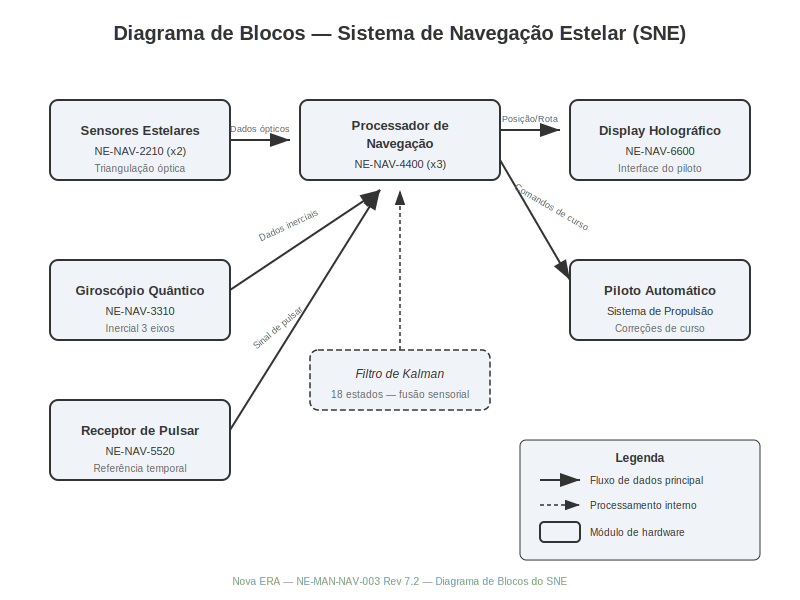
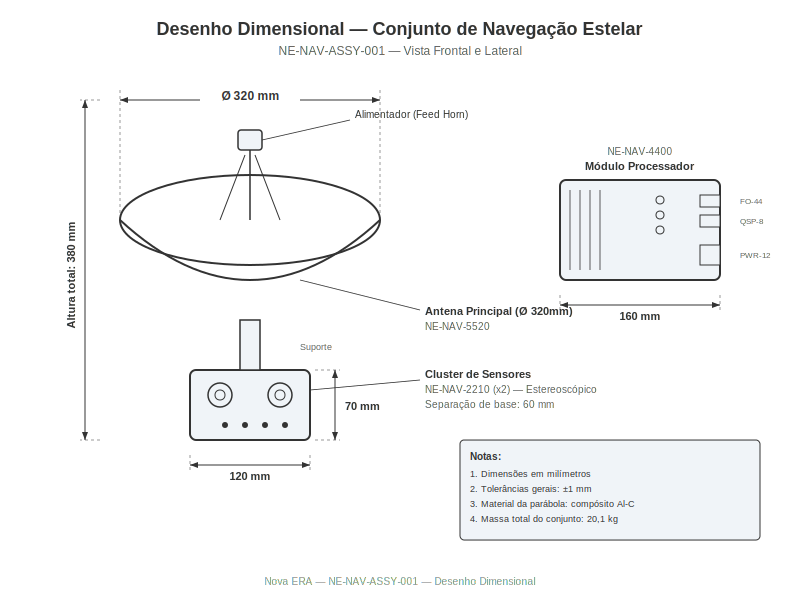
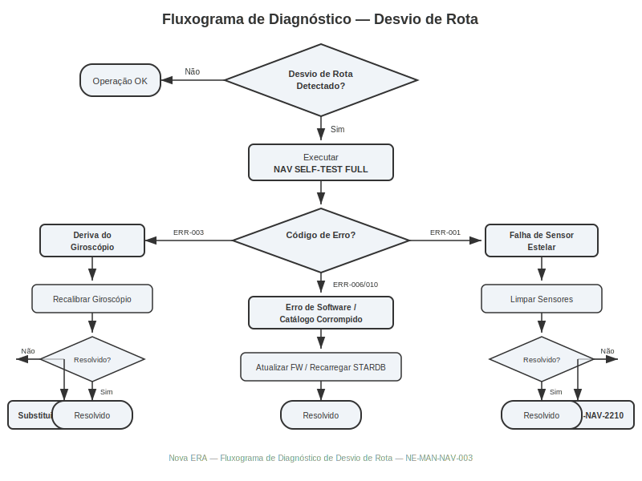
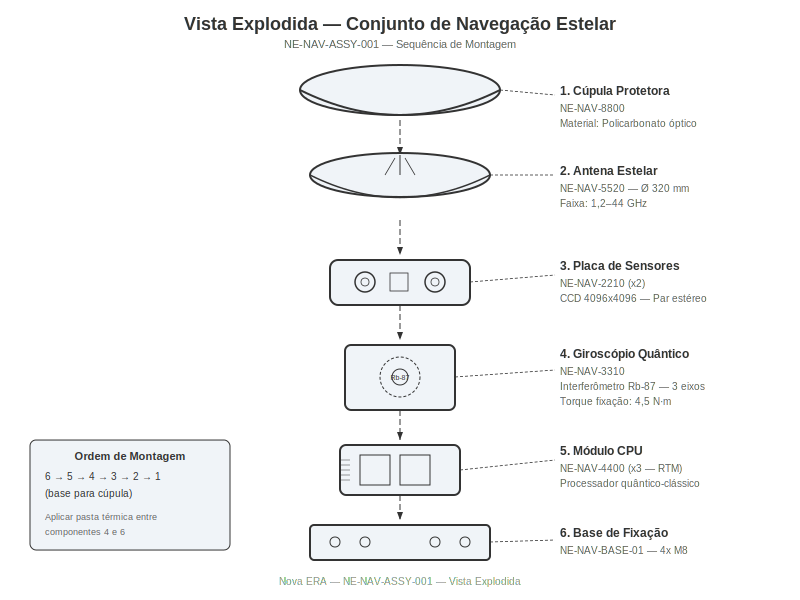
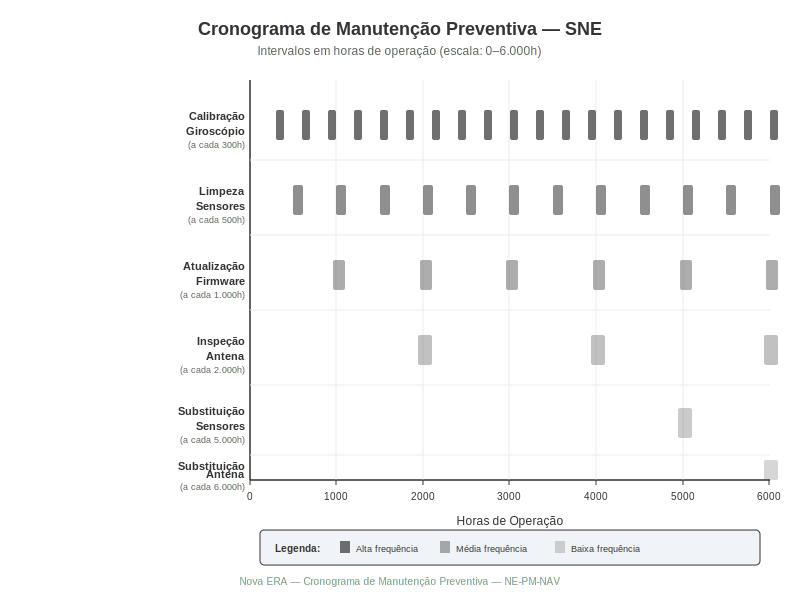

# Sistema de Navegação Estelar

**Manual Técnico de Reparo — Veículo Espacial Série Databricks Galáctica**
**Documento:** NE-MAN-NAV-003 | **Revisão:** 7.2 | **Data:** 2487.03.15
**Classificação:** Manutenção Nível II — Técnicos Certificados

---

> **AVISO DE SEGURANÇA GERAL:** Antes de qualquer procedimento descrito neste manual, certifique-se de que o veículo esteja em modo de estacionamento orbital estável (MOE) e que todos os sistemas de propulsão estejam desligados. O Sistema de Navegação Estelar opera com feixes de rastreamento de alta energia que podem causar danos oculares permanentes. Utilize sempre os óculos de proteção NE-PPE-0045 com filtro espectral classe IV durante qualquer manipulação dos sensores estelares.

---

## 1. Visão Geral e Princípios de Funcionamento

O Sistema de Navegação Estelar (SNE) do Veículo Espacial Série Databricks Galáctica é o módulo central responsável por determinar a posição tridimensional da nave em relação ao referencial galáctico padrão (RGP), calcular rotas de viagem interestelar e fornecer orientação em tempo real ao piloto automático e aos sistemas de propulsão. O SNE combina dados de múltiplos sensores — incluindo sensores de estrelas fixas, giroscópios quânticos, acelerômetros de plasma e receptores de pulsar — para produzir uma estimativa de posição com precisão de até 0,003 segundos de arco em condições nominais de operação.

### 1.1 Teoria da Navegação Estelar

A navegação estelar baseia-se no princípio de **triangulação estelar multi-banda**, em que a posição do veículo é determinada pela medição simultânea dos ângulos entre no mínimo seis estrelas de referência catalogadas no banco de dados estelar NE-STARDB-v12. Cada estrela de referência possui coordenadas absolutas conhecidas no sistema de coordenadas galácticas (SCG), permitindo que o processador de navegação resolva um sistema de equações não lineares para obter a posição e a atitude do veículo.

O processador de navegação utiliza um **filtro de Kalman estendido de 18 estados** que funde os seguintes dados sensoriais:

- **Sensores estelares primários** (par estereoscópico): fornecem medições angulares de alta precisão
- **Giroscópio quântico de três eixos**: fornece taxas de rotação inerciais
- **Acelerômetro de plasma triaxial**: fornece acelerações lineares
- **Receptor de pulsar de milissegundo**: fornece correção temporal absoluta
- **Magnetômetro de fluxo quântico**: fornece referência de campo magnético galáctico

### 1.2 Sistemas de Coordenadas

O SNE opera simultaneamente em três sistemas de coordenadas, realizando transformações contínuas entre eles:

| Sistema de Coordenadas | Sigla | Referência | Precisão | Uso Principal |
|---|---|---|---|---|
| Galáctico Padrão | SCG | Centro da Via Láctea | 0,001 ua | Navegação de longo alcance |
| Estelar Local | SCE | Estrela mais próxima | 0,0001 ua | Aproximação de sistemas |
| Veicular | SCV | Centro de massa da nave | 0,01 mm | Atitude e orientação |

A transformação entre SCG e SCE é realizada pela **Matriz de Rotação Estelar** (MRE), atualizada a cada 50 milissegundos pelo processador de navegação. A transformação entre SCE e SCV utiliza os **quaternions de atitude** fornecidos pelo giroscópio quântico, com correção de deriva aplicada pelo filtro de Kalman.

### 1.3 Fusão Sensorial e Redundância

O sistema emprega arquitetura de **redundância tripla modular** (RTM): três conjuntos independentes de sensores alimentam três processadores de navegação que votam entre si para produzir a saída final. Caso um processador apresente divergência superior a 0,01 segundo de arco em relação aos demais, ele é automaticamente isolado e o sistema emite o código de alerta **NAV-WARN-101**.



### 1.4 Fluxo de Dados

O fluxo de dados no SNE segue a seguinte sequência operacional:

1. Os sensores estelares capturam imagens do campo estelar a uma taxa de 20 Hz
2. O processador de imagem identifica estrelas e calcula centróides com precisão sub-pixel
3. O módulo de identificação estelar correlaciona centróides com o catálogo NE-STARDB-v12
4. O filtro de Kalman funde medições estelares com dados inerciais do giroscópio
5. A posição e atitude estimadas são transmitidas ao display holográfico e ao piloto automático
6. O módulo de previsão de rota calcula correções de curso e as envia ao sistema de propulsão

> **NOTA TÉCNICA:** O tempo de convergência do filtro de Kalman após uma reinicialização a frio é de aproximadamente 45 segundos. Durante este período, o veículo deve manter voo inercial puro. Nunca tente manobras de alta aceleração durante a fase de convergência.

---

## 2. Especificações Técnicas

Esta seção detalha as especificações completas de todos os componentes do Sistema de Navegação Estelar. Todas as peças de reposição devem ser originais Databricks Galáctica ou equivalentes certificados conforme norma NE-QA-7700.

### 2.1 Conjunto de Sensores Estelares Primários

O conjunto de sensores estelares consiste em dois sensores ópticos de alta resolução montados em configuração estereoscópica, com separação de base de 1,2 metros. Cada sensor contém um detector CCD de arseneto de gálio quântico com as seguintes especificações:

| Parâmetro | Especificação | Tolerância |
|---|---|---|
| Número da peça | **NE-NAV-2210** | — |
| Resolução do detector | 4096 x 4096 pixels | — |
| Tamanho do pixel | 12 μm x 12 μm | ±0,1 μm |
| Campo de visão | 8,5° x 8,5° | ±0,05° |
| Sensibilidade espectral | 350 nm — 1100 nm | — |
| Magnitude limite | 7,5 Mv | — |
| Taxa de aquisição | 20 Hz | ±0,5 Hz |
| Precisão angular | 0,3 segundos de arco (1σ) | — |
| Temperatura operacional | -40°C a +85°C | — |
| Consumo de energia | 28 W por unidade | ±2 W |
| Massa | 2,8 kg por unidade | ±0,05 kg |
| Vida útil estimada | 25.000 horas | — |
| Conector de dados | NE-CONN-FO-44 (fibra óptica) | — |
| Conector de alimentação | NE-CONN-PWR-12 | — |

### 2.2 Giroscópio Quântico de Três Eixos

O giroscópio quântico é o componente inercial primário do SNE, baseado em tecnologia de interferometria atômica de rubídio frio.

| Parâmetro | Especificação | Tolerância |
|---|---|---|
| Número da peça | **NE-NAV-3310** | — |
| Tipo | Interferômetro atômico de Rb-87 | — |
| Faixa de medição | ±500°/s por eixo | — |
| Bias de estabilidade | 0,0001°/h (1σ) | — |
| Ruído angular aleatório | 0,00005°/√h | — |
| Largura de banda | 500 Hz | — |
| Temperatura operacional | -20°C a +65°C | — |
| Consumo de energia | 45 W | ±3 W |
| Massa | 5,2 kg | ±0,1 kg |
| Dimensões (C x L x A) | 180 mm x 180 mm x 220 mm | ±1 mm |
| Tempo de aquecimento | 120 s | — |
| Interface de dados | NE-BUS-QSP-8 (serial quântica) | — |
| Torque de fixação dos parafusos | 4,5 N·m | ±0,2 N·m |

### 2.3 Processador de Navegação

| Parâmetro | Especificação | Tolerância |
|---|---|---|
| Número da peça | **NE-NAV-4400** | — |
| Arquitetura | Processador quântico-clássico híbrido | — |
| Clock clássico | 12 GHz (8 núcleos) | — |
| Qubits lógicos | 128 | — |
| Memória RAM | 256 GB DDR7-ECC | — |
| Armazenamento | 2 TB NVMe (catálogo estelar) | — |
| Consumo de energia | 85 W | ±5 W |
| Massa | 3,4 kg | ±0,05 kg |
| Sistema operacional | NE-NAVOS v12.4.7 | — |

### 2.4 Antena de Comunicação e Recepção de Pulsar

A antena principal é uma parabólica de alta ganância utilizada tanto para recepção de sinais de pulsar quanto para comunicação com estações de referência orbital.

| Parâmetro | Especificação | Tolerância |
|---|---|---|
| Número da peça | **NE-NAV-5520** | — |
| Diâmetro da parábola | 320 mm | ±1 mm |
| Faixa de frequência | 1,2 GHz — 44 GHz | — |
| Ganho máximo | 38 dBi | ±0,5 dBi |
| Largura de feixe (a 22 GHz) | 1,8° | ±0,1° |
| Polarização | Circular dupla (LHCP/RHCP) | — |
| Faixa de apontamento | ±180° azimute, ±90° elevação | — |
| Velocidade de apontamento | 30°/s | ±2°/s |
| Precisão de apontamento | 0,02° | — |
| Massa total (com atuadores) | 8,7 kg | ±0,2 kg |
| Torque de fixação da base | 12 N·m | ±0,5 N·m |



### 2.5 Lista Consolidada de Peças

| Código da Peça | Descrição | Quantidade | Estoque Mínimo |
|---|---|---|---|
| NE-NAV-2210 | Sensor estelar primário | 2 | 1 |
| NE-NAV-2211 | Suporte de montagem do sensor | 2 | 1 |
| NE-NAV-3310 | Giroscópio quântico triaxial | 1 | 1 |
| NE-NAV-3311 | Amortecedor vibracional do giroscópio | 4 | 2 |
| NE-NAV-4400 | Processador de navegação | 3 | 1 |
| NE-NAV-4401 | Módulo de memória STARDB | 3 | 1 |
| NE-NAV-5520 | Antena principal com atuadores | 1 | 0 |
| NE-NAV-5521 | Motor de apontamento (azimute) | 1 | 1 |
| NE-NAV-5522 | Motor de apontamento (elevação) | 1 | 1 |
| NE-NAV-6600 | Display holográfico de navegação | 1 | 0 |
| NE-NAV-7700 | Chicote de cabos principal | 1 | 0 |
| NE-NAV-7701 | Cabo de fibra óptica (par, 2m) | 2 | 1 |
| NE-NAV-8800 | Kit de vedação para cúpula | 1 | 1 |

---

## 3. Procedimento de Diagnóstico

Esta seção descreve os procedimentos de diagnóstico para identificar e isolar falhas no Sistema de Navegação Estelar. Todos os diagnósticos devem ser realizados com o veículo em modo de estacionamento orbital estável (MOE) e com a ferramenta de diagnóstico **NE-DIAG-TOOL v5.3** ou superior conectada à porta de serviço NE-SVC-PORT-1.

### 3.1 Códigos de Erro do Sistema

O SNE gera códigos de erro padronizados que são exibidos no display holográfico e registrados no log de bordo. A tabela a seguir lista os códigos mais comuns e suas causas prováveis:

| Código de Erro | Descrição | Severidade | Causa Provável | Ação Imediata |
|---|---|---|---|---|
| NAV-ERR-001 | Falha de identificação estelar | Alta | Sensor obstruído ou degradado | Verificar campo de visão dos sensores |
| NAV-ERR-002 | Divergência de posição > 0,1 ua | Crítica | Falha de processador ou dados corrompidos | Reiniciar processador afetado |
| NAV-ERR-003 | Deriva do giroscópio > limite | Alta | Degradação do meio atômico | Recalibrar giroscópio (Seção 5) |
| NAV-ERR-004 | Perda de sinal de pulsar | Média | Antena desalinhada ou obstruída | Verificar apontamento da antena |
| NAV-ERR-005 | Falha de votação RTM | Crítica | Dois ou mais processadores divergentes | Diagnóstico completo obrigatório |
| NAV-ERR-006 | Catálogo estelar corrompido | Alta | Erro de memória NVMe | Recarregar catálogo STARDB |
| NAV-ERR-007 | Temperatura do giroscópio fora da faixa | Média | Falha de refrigeração | Verificar sistema de resfriamento |
| NAV-ERR-008 | Erro de comunicação com piloto automático | Alta | Falha de barramento QSP | Verificar cabos e conexões |
| NAV-ERR-009 | Calibração GPS-estelar expirada | Média | Intervalo de calibração excedido | Executar calibração (Seção 3.3) |
| NAV-ERR-010 | Firmware desatualizado | Baixa | Versão abaixo da mínima requerida | Atualizar firmware (Seção 4.4) |

### 3.2 Detecção de Deriva de Sensores

A deriva dos sensores é uma degradação gradual que pode não gerar códigos de erro imediatos, mas compromete a precisão de navegação ao longo do tempo. O procedimento a seguir permite detectar e quantificar a deriva:

1. Conecte a ferramenta de diagnóstico **NE-DIAG-TOOL** à porta de serviço NE-SVC-PORT-1
2. No menu principal, selecione **Diagnóstico > Sensores > Teste de Deriva**
3. Certifique-se de que o veículo esteja em repouso inercial (aceleração < 0,001 m/s²)
4. Inicie o teste — duração mínima recomendada: **300 segundos**
5. A ferramenta coletará dados brutos de todos os sensores e calculará:
   - **Bias residual** de cada eixo do giroscópio (esperado: < 0,0003°/h)
   - **Desvio do centróide** de cada sensor estelar (esperado: < 0,5 pixel)
   - **Jitter da antena** de pulsar (esperado: < 0,05°)
6. Compare os resultados com os limites da tabela abaixo:

| Sensor | Parâmetro de Deriva | Limite Aceitável | Limite de Alerta | Limite Crítico |
|---|---|---|---|---|
| Giroscópio (eixo X) | Bias residual | < 0,0003°/h | 0,0003 — 0,001°/h | > 0,001°/h |
| Giroscópio (eixo Y) | Bias residual | < 0,0003°/h | 0,0003 — 0,001°/h | > 0,001°/h |
| Giroscópio (eixo Z) | Bias residual | < 0,0003°/h | 0,0003 — 0,001°/h | > 0,001°/h |
| Sensor estelar A | Desvio de centróide | < 0,5 pixel | 0,5 — 1,2 pixel | > 1,2 pixel |
| Sensor estelar B | Desvio de centróide | < 0,5 pixel | 0,5 — 1,2 pixel | > 1,2 pixel |
| Antena pulsar | Jitter de apontamento | < 0,05° | 0,05 — 0,15° | > 0,15° |

7. Se qualquer parâmetro estiver na faixa de **alerta**, agende manutenção preventiva
8. Se qualquer parâmetro estiver na faixa **crítica**, o componente deve ser reparado ou substituído imediatamente

### 3.3 Calibração GPS-Estelar

A calibração GPS-estelar sincroniza o referencial do SNE com o sistema de posicionamento galáctico (GPS-G). Este procedimento deve ser realizado a cada 1.000 horas de voo ou quando o código NAV-ERR-009 for emitido.

**Pré-requisitos:**
- Veículo em MOE dentro de um sistema estelar mapeado
- Pelo menos 4 satélites GPS-G visíveis (verificar no display com comando `NAV GPS-STATUS`)
- Ferramenta de diagnóstico NE-DIAG-TOOL conectada

**Procedimento:**

1. No console de navegação, execute o comando: `NAV CALIBRATE GPS-STELLAR START`
2. O sistema iniciará a coleta simultânea de dados GPS-G e estelares — aguarde 120 segundos
3. O processador calculará a matriz de transformação GPS-Estelar (MTGE)
4. Verifique o **resíduo de calibração** exibido:
   - Resíduo < 0,005 segundos de arco: **CALIBRAÇÃO APROVADA**
   - Resíduo entre 0,005 e 0,02: **CALIBRAÇÃO MARGINAL** — repetir o procedimento
   - Resíduo > 0,02: **CALIBRAÇÃO REJEITADA** — investigar falha de sensor
5. Confirme a gravação com o comando: `NAV CALIBRATE GPS-STELLAR COMMIT`
6. Registre a data e o resíduo no log de manutenção

> **ATENÇÃO:** Nunca interrompa o procedimento de calibração após o início. Uma calibração parcialmente gravada pode causar erros de posicionamento graves. Caso seja necessário abortar, execute `NAV CALIBRATE GPS-STELLAR ABORT` e reinicie o processador de navegação.



### 3.4 Verificação de Integridade do Catálogo Estelar

O catálogo estelar NE-STARDB-v12 contém dados de 2,3 milhões de estrelas de referência. A corrupção de dados pode levar a erros de identificação estelar (NAV-ERR-001). Para verificar a integridade:

1. Execute: `NAV STARDB VERIFY CHECKSUM`
2. Aguarde a verificação completa (aproximadamente 90 segundos)
3. O sistema reportará:
   - **PASS**: catálogo íntegro
   - **FAIL (setor X)**: setor corrompido — executar `NAV STARDB REPAIR SECTOR X`
   - **FAIL (global)**: corrupção generalizada — recarregar catálogo completo via porta NE-SVC-PORT-2

---

## 4. Procedimento de Reparo / Substituição

> **AVISO DE SEGURANÇA:** Desligue completamente o sistema de navegação antes de qualquer procedimento de reparo físico. Execute o comando `NAV SHUTDOWN SAFE` e aguarde a confirmação "NAV POWER OFF CONFIRMED" no display. Desconecte o disjuntor **CB-NAV-01** no painel elétrico principal. Tempo mínimo de espera após desligamento do giroscópio quântico: **60 segundos** (dissipação do campo atômico).

### 4.1 Substituição do Giroscópio Quântico (NE-NAV-3310)

**Ferramentas necessárias:**

| Ferramenta | Código | Especificação |
|---|---|---|
| Chave de torque digital | NE-TOOL-0100 | Faixa: 0,5 — 25 N·m |
| Extrator de conectores QSP | NE-TOOL-0215 | Para conectores NE-BUS-QSP-8 |
| Suporte anti-vibração temporário | NE-TOOL-0330 | Capacidade: 15 kg |
| Nível de bolha laser | NE-TOOL-0445 | Precisão: 0,001° |
| Pasta térmica quântica | NE-MAT-0050 | Condutividade: 25 W/m·K |

**Procedimento de remoção:**

1. Desligue o SNE conforme descrito acima e desconecte o disjuntor CB-NAV-01
2. Remova o painel de acesso inferior do compartimento de navegação (4 parafusos M6, torque de remoção: sentido anti-horário)
3. Identifique o giroscópio quântico NE-NAV-3310 — módulo cúbico prateado no centro do compartimento
4. Desconecte o conector de dados QSP-8 utilizando o extrator NE-TOOL-0215:
   - Insira o extrator nas guias laterais do conector
   - Gire 15° no sentido anti-horário para destravar
   - Puxe suavemente e em linha reta — **nunca** aplique força lateral
5. Desconecte o conector de alimentação NE-CONN-PWR-12 (trava por pressão)
6. Desconecte o conector térmico do sistema de resfriamento (trava de quarto de volta)
7. Posicione o suporte anti-vibração NE-TOOL-0330 sob o giroscópio
8. Solte os 4 parafusos de fixação (M8 x 25, torque de instalação original: **4,5 N·m**) em sequência cruzada (1-3-2-4)
9. Levante o giroscópio verticalmente e coloque-o na embalagem antiestática original

**Procedimento de instalação:**

1. Inspecione a nova unidade NE-NAV-3310 — verifique o número de série e a data de calibração de fábrica (máximo 90 dias)
2. Aplique pasta térmica quântica NE-MAT-0050 na superfície de contato (camada de 0,3 mm ±0,05 mm)
3. Posicione o giroscópio no compartimento, alinhando os pinos-guia com os furos da base
4. Instale os 4 parafusos de fixação M8 x 25 em sequência cruzada:
   - **Primeiro passe:** 2,0 N·m (todos os parafusos)
   - **Segundo passe:** 3,5 N·m (todos os parafusos)
   - **Terceiro passe:** **4,5 N·m** ±0,2 N·m (torque final)
5. Verifique o nivelamento com o nível de bolha laser NE-TOOL-0445 — desvio máximo: 0,002°
6. Conecte o conector térmico (quarto de volta até sentir o clique)
7. Conecte o conector de alimentação NE-CONN-PWR-12 (pressionar até ouvir o clique)
8. Conecte o conector de dados QSP-8:
   - Alinhe a chave do conector com o slot
   - Insira em linha reta até o batente
   - Gire 15° no sentido horário para travar
9. Feche o painel de acesso (4 parafusos M6, torque: **3,0 N·m**)
10. Reconecte o disjuntor CB-NAV-01
11. Ligue o SNE e execute a calibração inicial: `NAV GYRO CALIBRATE FULL`
12. Aguarde 300 segundos para aquecimento e estabilização do meio atômico
13. Verifique os parâmetros de deriva conforme Seção 3.2

### 4.2 Realinhamento da Antena Principal (NE-NAV-5520)

O realinhamento é necessário quando o código NAV-ERR-004 persiste após verificação visual de obstrução. O procedimento corrige desvios mecânicos nos atuadores de apontamento.

1. Acesse o compartimento da antena pelo painel superior externo (6 parafusos M5, torque de remoção: sentido anti-horário)
2. Conecte a ferramenta de diagnóstico à porta de serviço da antena (NE-SVC-PORT-3)
3. Execute: `ANT ALIGN START AUTO`
4. O sistema moverá a antena por toda a faixa de apontamento, medindo a resposta de sinal
5. Ao final, o sistema exibirá os offsets de correção:
   - **Offset de azimute**: valor em graus (esperado: < 0,1° após alinhamento)
   - **Offset de elevação**: valor em graus (esperado: < 0,1° após alinhamento)
6. Se os offsets forem > 0,1° após o alinhamento automático, ajuste manual é necessário:
   - Solte os 3 parafusos de ajuste fino do suporte da antena (M4, *não remova completamente*)
   - Utilize os parafusos micrométricos de azimute e elevação para zerar os offsets
   - Torqueie os parafusos de ajuste fino a **1,5 N·m** ±0,1 N·m
7. Repita `ANT ALIGN START AUTO` para confirmar
8. Feche o painel e execute `NAV SELF-TEST FULL`

| Etapa | Componente Afetado | Torque Especificado | Ferramenta |
|---|---|---|---|
| Remoção do painel | Painel superior | — | Chave allen 4mm |
| Ajuste fino azimute | Parafuso micrométrico AZ | 1,5 N·m | NE-TOOL-0100 |
| Ajuste fino elevação | Parafuso micrométrico EL | 1,5 N·m | NE-TOOL-0100 |
| Fixação do painel | Painel superior | 2,5 N·m | Chave allen 4mm |

### 4.3 Substituição de Sensor Estelar (NE-NAV-2210)

A substituição de um sensor estelar individual segue procedimento similar ao do giroscópio, com a particularidade de que o alinhamento óptico deve ser verificado após a instalação.

1. Desligue o SNE e desconecte o disjuntor CB-NAV-01
2. Remova a cúpula protetora do sensor afetado (8 parafusos M4, torque: **1,8 N·m**)
3. Desconecte o cabo de fibra óptica NE-NAV-7701 (trava por pressão com anel de retenção)
4. Desconecte o conector de alimentação
5. Solte os 3 parafusos de fixação do sensor (M6 x 20, torque: **3,2 N·m**)
6. Remova o sensor e instale o novo, seguindo a sequência inversa
7. Após a instalação, execute: `NAV SENSOR ALIGN STAR-A` (ou `STAR-B` conforme o sensor)
8. O sistema apontará para 3 estrelas de referência e calculará o erro de alinhamento
9. Erro aceitável: < 1,0 segundo de arco. Caso contrário, ajuste os calços de alinhamento (NE-NAV-2211)

### 4.4 Atualização de Firmware

O firmware do processador de navegação (NE-NAVOS) deve ser mantido atualizado para garantir compatibilidade com o catálogo estelar e correções de segurança.

1. Obtenha o pacote de atualização mais recente do portal Databricks Galáctica (arquivo `.nefw`)
2. Copie o arquivo para o dispositivo de atualização NE-USB-SEC-01
3. Conecte o dispositivo à porta NE-SVC-PORT-2
4. Execute: `NAV FIRMWARE UPDATE START`
5. O sistema verificará a assinatura digital e a compatibilidade
6. Confirme a instalação quando solicitado — **o processo leva aproximadamente 8 minutos**
7. O processador reiniciará automaticamente
8. Verifique a versão com: `NAV FIRMWARE VERSION`
9. Execute `NAV SELF-TEST FULL` para validar

> **ATENÇÃO CRÍTICA:** Nunca desligue o veículo durante uma atualização de firmware. Perda de energia durante a gravação pode inutilizar permanentemente o processador de navegação, requerendo substituição completa da unidade NE-NAV-4400.



---

## 5. Manutenção Preventiva e Intervalos

A manutenção preventiva do Sistema de Navegação Estelar é essencial para garantir a precisão de navegação e a segurança do voo. O programa de manutenção é baseado em intervalos de horas de operação do SNE, registradas automaticamente pelo processador de navegação.

### 5.1 Programa de Manutenção Periódica

| Intervalo (horas) | Procedimento | Código do Procedimento | Tempo Estimado | Nível Técnico |
|---|---|---|---|---|
| 300 | Calibração completa do giroscópio | NE-PM-NAV-001 | 45 min | Nível II |
| 500 | Limpeza dos sensores estelares | NE-PM-NAV-002 | 30 min | Nível I |
| 500 | Verificação de integridade do catálogo estelar | NE-PM-NAV-003 | 15 min | Nível I |
| 1.000 | Calibração GPS-estelar | NE-PM-NAV-004 | 20 min | Nível II |
| 1.000 | Atualização de firmware (se disponível) | NE-PM-NAV-005 | 30 min | Nível II |
| 2.000 | Inspeção mecânica da antena e atuadores | NE-PM-NAV-006 | 60 min | Nível II |
| 2.000 | Teste de redundância RTM completo | NE-PM-NAV-007 | 45 min | Nível III |
| 3.000 | Recarga do meio atômico do giroscópio | NE-PM-NAV-008 | 120 min | Nível III |
| 5.000 | Substituição preventiva dos sensores estelares | NE-PM-NAV-009 | 90 min | Nível II |
| 6.000 | Substituição preventiva da antena completa | NE-PM-NAV-010 | 180 min | Nível III |

### 5.2 Calibração do Giroscópio (a cada 300 horas)

A calibração periódica do giroscópio compensa a deriva acumulada do meio atômico e dos circuitos de leitura. Este é o procedimento de manutenção mais frequente e mais importante do SNE.

**Procedimento:**

1. Coloque o veículo em MOE com aceleração residual < 0,0005 m/s²
2. Execute: `NAV GYRO CALIBRATE STANDARD`
3. O sistema realizará as seguintes etapas automaticamente:
   - Medição de bias estático (60 segundos por eixo)
   - Medição de fator de escala (rotação controlada de referência)
   - Medição de desalinhamento entre eixos
   - Atualização da matriz de compensação
4. Ao final, o sistema exibirá o relatório de calibração
5. Verifique se todos os parâmetros estão dentro dos limites:

| Parâmetro | Limite Pós-Calibração | Ação se Fora do Limite |
|---|---|---|
| Bias residual (cada eixo) | < 0,0002°/h | Repetir calibração. Se persistir, substituir giroscópio |
| Erro de fator de escala | < 5 ppm | Repetir calibração com modo de alta precisão |
| Desalinhamento entre eixos | < 0,001° | Verificar fixação mecânica do giroscópio |

6. Registre os resultados no log de manutenção com o comando: `NAV MAINT LOG GYRO-CAL`

### 5.3 Limpeza dos Sensores Estelares (a cada 500 horas)

A contaminação das superfícies ópticas dos sensores estelares é a causa mais comum de degradação gradual de desempenho. Partículas de poeira cósmica, micro-meteoritos e condensação de gases do sistema de suporte de vida podem depositar-se nas lentes.

**Materiais necessários:**

- Kit de limpeza óptica NE-CLEAN-OPT-01
- Gás nitrogênio ultra-puro (99,9999%) com bico regulador
- Lenços de microfibra classe 100 (incluídos no kit)
- Solução de limpeza NE-CLEAN-SOL-05 (isopropanol ultra-puro)

**Procedimento:**

1. Desligue o SNE e desconecte o disjuntor CB-NAV-01
2. Remova a cúpula protetora do sensor (8 parafusos M4, torque: 1,8 N·m)
3. Inspecione visualmente a superfície da lente com lupa iluminada (aumento 10x)
4. Sopre a superfície com nitrogênio ultra-puro a uma distância de 15 cm e ângulo de 30°
5. Se houver contaminação residual:
   - Aplique 2-3 gotas de NE-CLEAN-SOL-05 no lenço de microfibra (*nunca diretamente na lente*)
   - Limpe com movimentos circulares do centro para a borda, sem pressão excessiva
   - Seque com um lenço seco, repetindo o movimento circular
6. Reinstale a cúpula protetora (torque: **1,8 N·m**)
7. Repita para o segundo sensor
8. Ligue o SNE e execute teste de deriva (Seção 3.2) para confirmar a melhoria

### 5.4 Atualização do Catálogo Estelar

O catálogo estelar NE-STARDB é atualizado periodicamente pela Databricks Galáctica para incorporar novas medições astrométricas e correções de movimento próprio estelar. A atualização é distribuída como um arquivo `.nestardb`.

1. Verifique a versão atual: `NAV STARDB VERSION`
2. Compare com a versão mais recente disponível no portal Databricks Galáctica
3. Se houver atualização disponível:
   - Baixe o arquivo `.nestardb` para o dispositivo NE-USB-SEC-01
   - Conecte à porta NE-SVC-PORT-2
   - Execute: `NAV STARDB UPDATE START`
   - Aguarde a conclusão (aproximadamente 5 minutos para catálogo completo)
   - Verifique integridade: `NAV STARDB VERIFY CHECKSUM`
4. Execute uma calibração GPS-estelar (Seção 3.3) após a atualização

### 5.5 Inspeção da Antena e Atuadores (a cada 2.000 horas)

A inspeção mecânica da antena verifica o desgaste dos atuadores de apontamento, a integridade da superfície refletora e a condição dos cabos de sinal.

| Item de Inspeção | Critério de Aprovação | Ação Corretiva |
|---|---|---|
| Superfície da parábola | Sem deformações > 0,1 mm | Substituir antena (NE-NAV-5520) |
| Folga do atuador de azimute | < 0,02° de backlash | Substituir motor (NE-NAV-5521) |
| Folga do atuador de elevação | < 0,02° de backlash | Substituir motor (NE-NAV-5522) |
| Cabos de sinal RF | Sem danos visíveis, conectores firmes | Substituir cabo afetado |
| Vedação da cúpula da antena | Sem rachaduras ou deformações | Substituir kit de vedação (NE-NAV-8800) |
| Lubrificação dos rolamentos | Rotação suave, sem ruídos | Reaplicar lubrificante NE-LUB-0020 |

### 5.6 Registro de Manutenção

Todas as atividades de manutenção preventiva devem ser registradas no sistema de bordo utilizando o formato padronizado. O comando `NAV MAINT LOG` aceita os seguintes parâmetros:

```
NAV MAINT LOG <TIPO> <RESULTADO> <OBSERVAÇÕES>
```

**Tipos válidos:** GYRO-CAL, SENSOR-CLEAN, STARDB-UPD, GPS-CAL, FW-UPD, ANT-INSP, RTM-TEST, ATOM-REFILL, SENSOR-REPL, ANT-REPL

O histórico completo de manutenção pode ser consultado com: `NAV MAINT HISTORY`



### 5.7 Dicas de Longevidade

- **Evite desligamentos bruscos** do giroscópio quântico — sempre utilize o comando `NAV SHUTDOWN SAFE` para permitir a despressurização controlada do meio atômico
- **Mantenha o ambiente limpo** ao redor dos sensores estelares — a poeira é o principal inimigo da precisão óptica
- **Atualize o firmware regularmente** — muitas melhorias de precisão são implementadas via software
- **Monitore as tendências de deriva** — um aumento gradual no bias do giroscópio indica que a recarga do meio atômico se aproxima
- **Registre todas as manutenções** — o histórico completo é essencial para diagnósticos futuros e para determinar padrões de desgaste

---

**Fim do Capítulo 3 — Sistema de Navegação Estelar**

*Próximo capítulo: [04 — Sistema de Comunicações Subespaciais]*

*Este documento é propriedade da Databricks Galáctica Veículos Espaciais Ltda. Reprodução proibida sem autorização expressa. Documento controlado — verificar validade no portal técnico antes de utilizar.*
