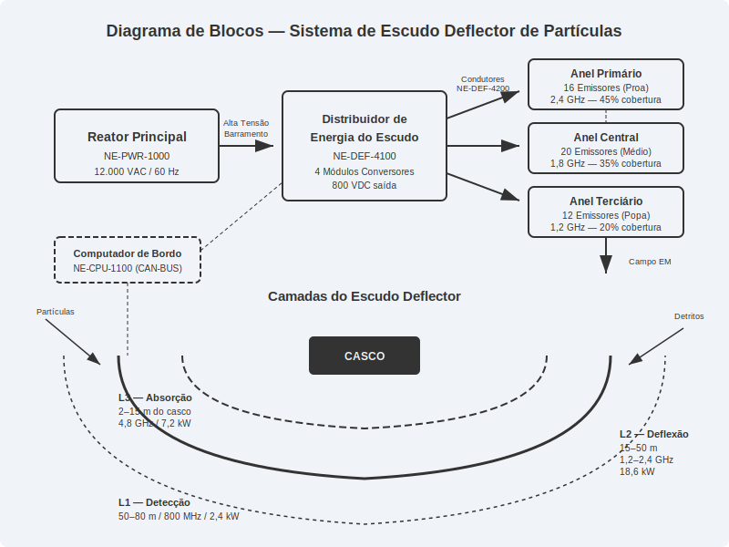
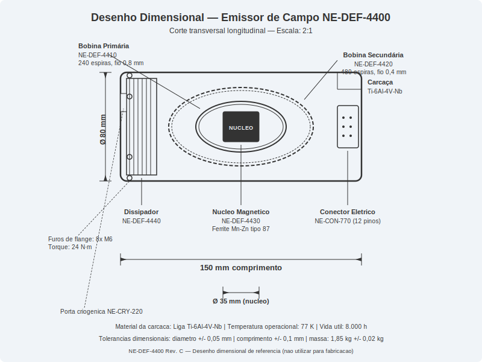
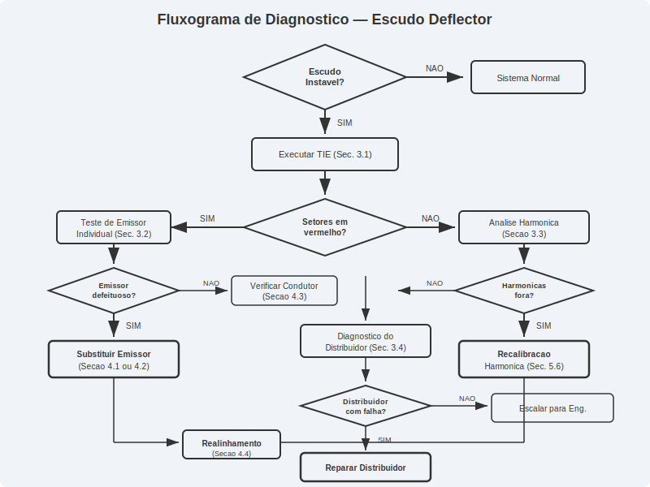
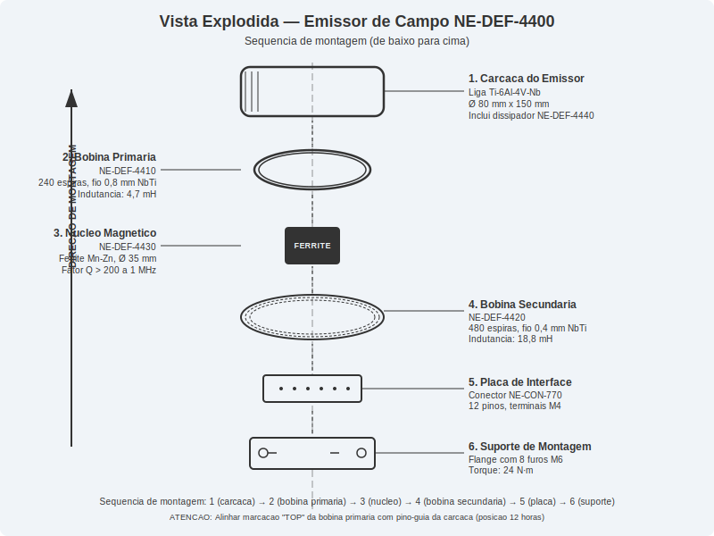
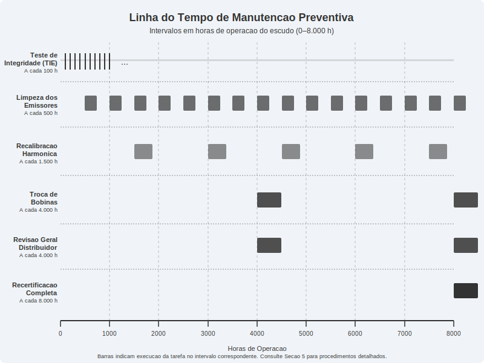

# Escudo Deflector de Partículas

**Veículo Espacial Série Databricks Galáctica — Manual de Reparo Técnico**
**Documento:** MRT-DEF-2076-04 | **Revisão:** 3.2 | **Data:** 2076-08-15
**Aplicável a:** Modelos Databricks Galáctica 3000, 3500 e 4000 (anos-modelo 2074–2077)

---

> **AVISO DE SEGURANÇA GERAL:** O sistema de escudo deflector opera com tensões superiores a 12.000 V em corrente alternada de alta frequência. Antes de qualquer procedimento de manutenção ou reparo, o técnico DEVE desenergizar completamente o circuito de escudo, aguardar o período mínimo de descarga de 180 segundos e confirmar tensão zero em todos os barramentos utilizando o multímetro aprovado (Modelo NE-MET-7700 ou equivalente). O não cumprimento deste protocolo pode resultar em lesões graves, morte ou danos irreversíveis ao veículo.

---

## 1. Visão Geral e Princípios de Funcionamento

O Escudo Deflector de Partículas (EDP) é o sistema primário de proteção do Veículo Espacial Série Databricks Galáctica contra impactos de micropartículas, radiação cósmica de alta energia e detritos espaciais em velocidades de até 0,3c (30% da velocidade da luz). O sistema gera um campo eletromagnético multicamada que envolve toda a estrutura do veículo, deflectindo partículas carregadas e absorvendo a energia cinética de objetos neutros através de conversão termodinâmica controlada.

### 1.1 Teoria do Campo Eletromagnético Deflector

O princípio fundamental do EDP baseia-se na geração de um campo de Lorentz modificado, onde cargas elétricas e magnéticas são combinadas em configuração toroidal para criar uma barreira omnidirecional. O campo é gerado por uma matriz de 48 emissores (Peça NE-DEF-4400) distribuídos em três anéis ao redor do casco do veículo:

- **Anel Primário (Proa):** 16 emissores posicionados em configuração hexagonal, responsáveis por 45% da cobertura frontal. Estes emissores operam em frequência de ressonância de 2,4 GHz e geram o campo de maior intensidade, pois a proa é a região de maior exposição durante navegação em velocidade de cruzeiro.
- **Anel Central (Médio):** 20 emissores distribuídos em banda equatorial, cobrindo 35% da área lateral do veículo. Operam em frequência de 1,8 GHz com modulação adaptativa baseada em sensores de proximidade.
- **Anel Terciário (Popa):** 12 emissores em configuração cônica, protegendo a região traseira e os bocais de propulsão. Frequência operacional de 1,2 GHz, com potência reduzida devido à menor exposição estatística.

### 1.2 Camadas do Escudo

O EDP opera em três camadas concêntricas, cada uma com função específica:

| Camada | Designação | Distância do Casco | Função Principal | Frequência | Consumo |
|--------|-----------|-------------------|-----------------|------------|---------|
| L1 | Camada de Detecção | 50–80 m | Sensoriamento e alerta antecipado | 800 MHz | 2,4 kW |
| L2 | Camada de Deflexão | 15–50 m | Desvio de partículas carregadas | 1,2–2,4 GHz | 18,6 kW |
| L3 | Camada de Absorção | 2–15 m | Absorção de energia cinética residual | 4,8 GHz | 7,2 kW |

A Camada L1 funciona como sistema de alerta, detectando objetos que se aproximam e comunicando ao computador de bordo (Módulo NE-CPU-1100) para ajuste dinâmico das Camadas L2 e L3. A Camada L2 é a barreira principal, utilizando campos magnéticos de alta intensidade (até 4,7 Tesla na configuração máxima) para deflectir partículas carregadas. A Camada L3 é a última linha de defesa, empregando um campo de absorção que converte energia cinética em calor, dissipado através do sistema de refrigeração (Peça NE-THR-3300).

### 1.3 Distribuição de Energia

O sistema de escudo é alimentado diretamente pelo Reator Principal de Fusão (Peça NE-PWR-1000) através de um circuito dedicado de alta prioridade. A energia percorre o seguinte caminho:

1. **Reator Principal** → Barramento de alta tensão (12.000 VAC, 60 Hz trifásico)
2. **Distribuidor de Energia do Escudo** (Peça NE-DEF-4100) → Converte e regula para cada anel de emissores
3. **Condutores de Campo** (Peça NE-DEF-4200) → Cabos supercondutores resfriados a 77 K
4. **Emissores de Campo** (Peça NE-DEF-4400) → Conversão final em campo eletromagnético
5. **Escudo Deflector** → Campo toroidal multicamada ao redor do veículo

O Distribuidor de Energia (NE-DEF-4100) é o componente central do subsistema elétrico. Ele contém três módulos conversores independentes, um para cada anel de emissores, além de um módulo de reserva que pode assumir a carga de qualquer anel em caso de falha. A comutação para o módulo reserva é automática e ocorre em menos de 50 milissegundos, garantindo que o escudo nunca fique completamente inoperante.

| Parâmetro de Energia | Valor Nominal | Valor Máximo | Unidade |
|---------------------|---------------|--------------|---------|
| Tensão de entrada | 12.000 | 13.200 | VAC |
| Corrente total do sistema | 2,35 | 4,10 | A |
| Potência contínua | 28,2 | 45,0 | kW |
| Potência de pico (deflexão ativa) | 45,0 | 72,0 | kW |
| Fator de potência | 0,92 | — | — |
| Eficiência do distribuidor | 96,8 | — | % |
| Tempo de energização completa | — | 4,2 | s |
| Tempo de desenergização segura | — | 180 | s |

### 1.4 Modos de Operação

O EDP possui quatro modos de operação selecionáveis pelo piloto ou automaticamente pelo computador de bordo:

- **Modo Cruzeiro (NE-DEF-MODE-1):** Operação padrão em espaço aberto. Camada L2 a 60% de potência, L1 ativa, L3 em standby. Consumo: 18 kW.
- **Modo Cinturão de Asteroides (NE-DEF-MODE-2):** Potência total em todas as camadas. Consumo: 45 kW. Ativação automática quando sensores detectam densidade de partículas acima de 10³/m³.
- **Modo Economia (NE-DEF-MODE-3):** Apenas Camada L1 ativa com L2 a 25%. Consumo: 8 kW. Utilizado em órbita estacionária ou docagem.
- **Modo Emergência (NE-DEF-MODE-4):** Potência máxima com redistribuição dinâmica para o vetor de ameaça. Consumo: até 72 kW. Ativação automática ou manual.

---

## 2. Especificações Técnicas

Esta seção detalha as especificações completas de todos os componentes do sistema de Escudo Deflector de Partículas, incluindo tolerâncias de fabricação, valores de torque para fixação e compatibilidade entre peças.

### 2.1 Matriz de Emissores

Cada emissor de campo (Peça NE-DEF-4400) é uma unidade selada contendo bobina primária, bobina secundária, núcleo magnético de ferrite composto e dissipador térmico integrado. Os emissores são montados no casco externo através de flanges padronizadas com vedação hermética classe IP69K-S (padrão espacial).

| Especificação do Emissor | Valor | Tolerância |
|--------------------------|-------|------------|
| Número da peça | NE-DEF-4400 Rev. C | — |
| Diâmetro externo da carcaça | 80 mm | +/- 0,05 mm |
| Comprimento total | 150 mm | +/- 0,1 mm |
| Massa unitária | 1,85 kg | +/- 0,02 kg |
| Material da carcaça | Liga Ti-6Al-4V-Nb | — |
| Bobina primária (NE-DEF-4410) | 240 espiras, fio 0,8 mm NbTi | +/- 2 espiras |
| Bobina secundária (NE-DEF-4420) | 480 espiras, fio 0,4 mm NbTi | +/- 3 espiras |
| Núcleo magnético (NE-DEF-4430) | Ferrite Mn-Zn tipo 87, Ø 35 mm | +/- 0,02 mm |
| Indutância da bobina primária | 4,7 mH | +/- 5% |
| Indutância da bobina secundária | 18,8 mH | +/- 5% |
| Resistência CC da bobina primária (77 K) | < 0,001 Ω | — |
| Intensidade máxima de campo | 4,7 T | — |
| Temperatura operacional | 77 K (refrigeração LN2) | +/- 2 K |
| Temperatura máxima de sobrevivência | 350 K | — |
| Vida útil nominal | 8.000 horas de operação | — |
| Torque de montagem dos parafusos de flange | 24 N·m | +/- 1 N·m |
| Número de parafusos de flange | 8 (M6 x 20, classe 12.9) | — |
| Conector elétrico | NE-CON-770 (12 pinos, selado) | — |
| Conector de refrigeração | NE-CRY-220 (acoplamento rápido, 6 mm) | — |

### 2.2 Distribuidor de Energia

O Distribuidor de Energia do Escudo (Peça NE-DEF-4100) é montado no compartimento de equipamentos central, fixado em rack padrão 19U com amortecedores anti-vibração.

| Especificação do Distribuidor | Valor |
|------------------------------|-------|
| Número da peça | NE-DEF-4100 Rev. D |
| Dimensões (L x A x P) | 482 x 355 x 450 mm |
| Massa | 38,5 kg |
| Módulos conversores | 4 (3 ativos + 1 reserva) |
| Tensão de entrada | 12.000 VAC trifásico |
| Tensão de saída (por módulo) | 800 VDC regulado |
| Corrente máxima por módulo | 18 A |
| Proteção contra surto | Varistores MOV + fusíveis HRC |
| Interface de controle | CAN-BUS 2.0B, 1 Mbit/s |
| Conector de dados | NE-CON-330 (D-Sub 25 pinos, blindado) |
| Torque de montagem no rack | 8 N·m (+/- 0,5 N·m) |
| Parafusos de montagem | 4x M8 x 30, classe 10.9 |

### 2.3 Condutores de Campo

Os condutores supercondutores (Peça NE-DEF-4200) conectam o distribuidor aos emissores. Cada condutor é envolvido por uma camisa criogênica que mantém a temperatura abaixo da temperatura crítica do material supercondutor.

| Especificação do Condutor | Valor |
|---------------------------|-------|
| Número da peça | NE-DEF-4200 Rev. B |
| Material condutor | NbTi (Nióbio-Titânio) |
| Diâmetro do condutor | 4,2 mm |
| Diâmetro externo (com isolamento criogênico) | 22 mm |
| Temperatura crítica | 9,2 K |
| Corrente crítica (4,2 K, 5 T) | 450 A |
| Raio mínimo de curvatura | 150 mm |
| Comprimento máximo por segmento | 8.000 mm |
| Conector tipo A (lado distribuidor) | NE-CON-440A |
| Conector tipo B (lado emissor) | NE-CON-440B |
| Torque do conector | 12 N·m (+/- 0,5 N·m) |

### 2.4 Classificação de Intensidade do Escudo

A intensidade do escudo é medida em unidades de Deflexão Padrão (DP), escala proprietária Databricks Galáctica:

| Classe de Proteção | DP | Aplicação Típica | Energia Cinética Máxima Deflectida |
|--------------------|----|-------------------|------------------------------------|
| Classe I | 1–100 DP | Poeira cósmica em espaço profundo | 10 J |
| Classe II | 101–500 DP | Micrometeoritos (< 1 mm) | 500 J |
| Classe III | 501–2000 DP | Detritos orbitais (1–10 mm) | 5.000 J |
| Classe IV | 2001–5000 DP | Fragmentos de asteroides (10–50 mm) | 50.000 J |
| Classe V | 5001–8000 DP | Impactos severos (> 50 mm) | 200.000 J |

O sistema Databricks Galáctica Série 3000 opera nominalmente em Classe III (1.200 DP) e pode atingir Classe IV (3.500 DP) em Modo Emergência. O modelo 4000, com sua matriz estendida de 64 emissores, atinge Classe V (6.200 DP).

### 2.5 Tabela de Peças Sobressalentes Recomendadas

| Peça | Número | Qtd. Recomendada em Estoque | Criticidade |
|------|--------|-----------------------------|-------------|
| Emissor de campo completo | NE-DEF-4400 | 4 | Alta |
| Bobina primária (avulsa) | NE-DEF-4410 | 8 | Alta |
| Bobina secundária (avulsa) | NE-DEF-4420 | 8 | Alta |
| Núcleo magnético | NE-DEF-4430 | 4 | Alta |
| Dissipador térmico | NE-DEF-4440 | 4 | Média |
| Módulo conversor do distribuidor | NE-DEF-4110 | 1 | Alta |
| Condutor superconduto (2 m) | NE-DEF-4200-2M | 4 | Média |
| Condutor superconduto (4 m) | NE-DEF-4200-4M | 2 | Média |
| Junta de vedação do emissor | NE-DEF-4450 | 16 | Média |
| Parafuso de flange M6 x 20 | NE-FAS-0620 | 48 | Baixa |
| Conector elétrico NE-CON-770 | NE-CON-770 | 4 | Média |
| Fusível HRC do distribuidor | NE-DEF-4120 | 8 | Alta |

---

## 3. Procedimento de Diagnóstico

Esta seção descreve os procedimentos sistemáticos para identificação e diagnóstico de falhas no sistema de Escudo Deflector de Partículas. Todos os testes devem ser realizados com o equipamento de diagnóstico aprovado Databricks Galáctica (Kit NE-DIAG-5000) e seguindo rigorosamente os protocolos de segurança.

> **ATENÇÃO:** Alguns testes requerem que o escudo esteja parcialmente energizado. Utilize SEMPRE o equipamento de proteção individual (EPI) completo: luvas isolantes classe 4, óculos de proteção contra radiação EM, e dosímetro pessoal. Mantenha distância mínima de 3 metros dos emissores energizados.

### 3.1 Teste de Integridade do Escudo (TIE)

O Teste de Integridade do Escudo é o procedimento primário de diagnóstico e deve ser realizado antes de qualquer investigação mais detalhada. Este teste verifica a cobertura angular completa do escudo e identifica setores com falha ou degradação.

**Equipamento necessário:**

| Item | Número da Peça | Quantidade |
|------|---------------|------------|
| Analisador de campo EM portátil | NE-DIAG-5100 | 1 |
| Sonda de campo omnidirecional | NE-DIAG-5110 | 1 |
| Cabo de dados CAN-BUS (10 m) | NE-CAB-3310 | 1 |
| Terminal de diagnóstico portátil | NE-DIAG-5000 | 1 |
| Gerador de partículas de teste | NE-DIAG-5200 | 1 |

**Procedimento:**

1. Conecte o Terminal de Diagnóstico (NE-DIAG-5000) à porta de diagnóstico do Distribuidor de Energia (NE-DEF-4100) usando o cabo CAN-BUS (NE-CAB-3310).
2. No terminal, acesse o menu **Diagnóstico > Escudo Deflector > Teste de Integridade**.
3. O sistema solicitará que o escudo seja energizado em **Modo de Teste** (potência reduzida a 15%). Confirme a energização.
4. Aguarde a estabilização do campo (indicador verde no terminal, tempo típico: 8 segundos).
5. O analisador realizará uma varredura automática de 360° em três planos (horizontal, vertical e oblíquo a 45°), medindo a intensidade do campo em incrementos de 5°.
6. A varredura leva aproximadamente 120 segundos. Não interrompa o processo.
7. Ao finalizar, o terminal exibirá o mapa de cobertura do escudo com indicação colorida:
   - **Verde:** Campo dentro da especificação (> 85% da intensidade nominal)
   - **Amarelo:** Campo degradado (50–85% da intensidade nominal)
   - **Vermelho:** Campo abaixo do mínimo aceitável (< 50%) ou ausente
8. Registre o código de diagnóstico gerado (formato: TIE-AAAA-MM-DD-XXXX).
9. Desenergize o sistema em Modo de Teste antes de prosseguir.

### 3.2 Diagnóstico de Falha em Emissor Individual

Quando o TIE identifica setores com falha, é necessário determinar qual emissor específico está defeituoso.

**Procedimento:**

1. No terminal de diagnóstico, acesse **Diagnóstico > Escudo Deflector > Teste de Emissor Individual**.
2. Selecione o anel e a posição do emissor suspeito com base no mapa do TIE.
3. O sistema realizará os seguintes testes automatizados no emissor selecionado:

| Teste | Parâmetro Medido | Valor Aceitável | Código de Falha |
|-------|-----------------|-----------------|-----------------|
| Continuidade da bobina primária | Resistência CC | < 0,005 Ω (a 77 K) | ERR-DEF-P01 |
| Continuidade da bobina secundária | Resistência CC | < 0,010 Ω (a 77 K) | ERR-DEF-P02 |
| Isolamento bobina-carcaça | Resistência de isolamento | > 100 MΩ (a 500 VDC) | ERR-DEF-P03 |
| Indutância da bobina primária | Indutância | 4,7 mH +/- 10% | ERR-DEF-P04 |
| Indutância da bobina secundária | Indutância | 18,8 mH +/- 10% | ERR-DEF-P05 |
| Permeabilidade do núcleo | Fator Q a 1 MHz | > 200 | ERR-DEF-P06 |
| Temperatura do emissor | Temperatura | 77 K +/- 5 K | ERR-DEF-P07 |
| Integridade do conector | Resistência de contato | < 0,1 mΩ por pino | ERR-DEF-P08 |
| Fluxo de refrigerante | Vazão criogênica | > 0,5 L/min | ERR-DEF-P09 |
| Geração de campo | Intensidade de campo a 1 m | > 0,8 T | ERR-DEF-P10 |

4. Anote todos os códigos de falha retornados.
5. Se múltiplos códigos forem reportados para o mesmo emissor, priorize na ordem listada (P01 sendo a mais crítica).

### 3.3 Análise Harmônica do Campo

A análise harmônica verifica se o campo deflector está sendo gerado com o perfil de frequência correto. Distorções harmônicas podem reduzir drasticamente a eficácia do escudo sem que isso seja detectado pelo TIE padrão.

**Procedimento:**

1. Conecte a sonda de campo omnidirecional (NE-DIAG-5110) ao analisador de espectro do kit de diagnóstico.
2. Posicione a sonda a exatamente 2,0 metros do emissor sob teste.
3. Energize o emissor em Modo de Teste Individual.
4. No analisador, selecione **Análise > Espectro de Harmônicas > Varredura Completa**.
5. O analisador medirá as harmônicas da fundamental até a 16ª ordem.
6. Compare os resultados com os valores de referência:

| Harmônica | Amplitude Relativa à Fundamental | Tolerância | Indicação de Falha |
|-----------|----------------------------------|------------|-------------------|
| 1ª (fundamental) | 0 dB (referência) | — | — |
| 2ª | -40 dB | +/- 3 dB | Assimetria do núcleo magnético |
| 3ª | -35 dB | +/- 3 dB | Saturação do núcleo |
| 4ª | -50 dB | +/- 5 dB | Desbalanceamento de bobina |
| 5ª a 8ª | < -55 dB | — | Degradação do material supercondutor |
| 9ª a 16ª | < -65 dB | — | Interferência externa ou ressonância parasita |

7. Se qualquer harmônica estiver fora da tolerância, registre e correlacione com a indicação de falha correspondente.
8. Repita para cada emissor suspeito.
9. Desenergize o emissor e desconecte a sonda após completar todos os testes.

### 3.4 Diagnóstico do Distribuidor de Energia

Quando os emissores estão em boas condições mas o escudo apresenta falha, o problema pode estar no Distribuidor de Energia (NE-DEF-4100).

**Procedimento:**

1. Desenergize completamente o sistema de escudo.
2. Remova o painel frontal do distribuidor (4 parafusos M4 x 12, torque: 3 N·m).
3. Verifique visualmente os fusíveis HRC (NE-DEF-4120). Fusíveis queimados apresentam indicador vermelho visível na janela de inspeção.
4. Conecte o terminal de diagnóstico à porta interna de teste (conector J3 na placa-mãe do distribuidor).
5. Execute o autoteste do distribuidor: **Diagnóstico > Distribuidor > Autoteste Completo**.

| Módulo Testado | Teste | Critério de Aprovação | Código de Falha |
|---------------|-------|----------------------|-----------------|
| Módulo A (Anel Primário) | Tensão de saída | 800 VDC +/- 2% | ERR-DIST-A01 |
| Módulo A | Regulação de carga | < 1% variação (0–100% carga) | ERR-DIST-A02 |
| Módulo A | Ripple | < 50 mV pico-a-pico | ERR-DIST-A03 |
| Módulo B (Anel Central) | Tensão de saída | 800 VDC +/- 2% | ERR-DIST-B01 |
| Módulo B | Regulação de carga | < 1% variação | ERR-DIST-B02 |
| Módulo B | Ripple | < 50 mV pico-a-pico | ERR-DIST-B03 |
| Módulo C (Anel Terciário) | Tensão de saída | 800 VDC +/- 2% | ERR-DIST-C01 |
| Módulo C | Regulação de carga | < 1% variação | ERR-DIST-C02 |
| Módulo C | Ripple | < 50 mV pico-a-pico | ERR-DIST-C03 |
| Módulo R (Reserva) | Tensão de saída | 800 VDC +/- 2% | ERR-DIST-R01 |
| Módulo R | Comutação automática | < 50 ms | ERR-DIST-R02 |
| Barramento CAN | Comunicação | Sem erros em 1000 frames | ERR-DIST-COM |

6. Documente todos os códigos de falha encontrados e encaminhe para reparo conforme Seção 4.

---

## 4. Procedimento de Reparo / Substituição

Esta seção detalha os procedimentos de reparo e substituição dos componentes do sistema de Escudo Deflector de Partículas. Cada procedimento inclui a lista de ferramentas necessárias, peças de reposição, passos detalhados e critérios de verificação pós-reparo.

> **AVISO CRÍTICO:** Todos os reparos no sistema de escudo devem ser realizados com o veículo em ambiente pressurizado (hangar ou doca espacial). Reparos em ambiente de vácuo (EVA) requerem autorização especial Nível 3 e equipe mínima de dois técnicos certificados NE-CERT-DEF.

### 4.1 Substituição de Emissor de Campo Completo

Este é o procedimento mais comum de reparo e é indicado quando o diagnóstico revela falhas múltiplas no mesmo emissor (dois ou mais códigos de erro da série ERR-DEF-Pxx).

**Ferramentas necessárias:**

| Ferramenta | Número da Peça | Especificação |
|-----------|---------------|---------------|
| Chave de torque digital | NE-TOOL-1010 | Faixa: 5–50 N·m, resolução 0,1 N·m |
| Chave Allen 5 mm (longa) | NE-TOOL-1020 | Comprimento mínimo 200 mm |
| Extrator de conectores | NE-TOOL-1030 | Para conectores NE-CON-770 |
| Ferramenta de desconexão criogênica | NE-TOOL-1040 | Para acoplamento NE-CRY-220 |
| Pasta térmica criogênica | NE-CHEM-2010 | Condutividade > 15 W/m·K |
| Vedante de flange espacial | NE-CHEM-2020 | Resistente a vácuo e temperatura |
| Multímetro de precisão | NE-MET-7700 | Resolução: 0,001 Ω |

**Procedimento de remoção:**

1. Desenergize completamente o sistema de escudo e confirme tensão zero no barramento.
2. Feche a válvula de suprimento de refrigerante criogênico do circuito correspondente ao emissor. Aguarde equalização de pressão (manômetro deve indicar 0 bar manométrico).
3. Desconecte o acoplamento criogênico (NE-CRY-220) utilizando a ferramenta NE-TOOL-1040. Gire 90° no sentido anti-horário e puxe axialmente. **Cuidado:** pode haver resíduo de nitrogênio líquido no acoplamento — use luvas criogênicas.
4. Desconecte o conector elétrico (NE-CON-770) utilizando o extrator NE-TOOL-1030. Pressione a trava de liberação e puxe reto, sem angular.
5. Utilizando a chave Allen 5 mm (NE-TOOL-1020), remova os 8 parafusos de flange (M6 x 20) em padrão cruzado (sequência: 1-5-3-7-2-6-4-8).
6. Puxe o emissor axialmente para fora da abertura no casco. O emissor pesa 1,85 kg — apoie adequadamente.
7. Inspecione a superfície de vedação na abertura do casco. Limpe com solvente aprovado (NE-CHEM-2030) se houver resíduos de vedante antigo.
8. Descarte a junta de vedação (NE-DEF-4450) — **nunca reutilize juntas.**

**Procedimento de instalação:**

1. Verifique o emissor novo: confirme que o número de peça (NE-DEF-4400 Rev. C ou superior) está correto e que o lacre de fábrica está intacto.
2. Aplique vedante de flange (NE-CHEM-2020) em cordão contínuo de 2 mm na canaleta de vedação do casco.
3. Insira a junta de vedação nova (NE-DEF-4450) sobre o vedante.
4. Aplique pasta térmica criogênica (NE-CHEM-2010) na superfície de contato térmico do emissor (anel na base da carcaça).
5. Insira o emissor na abertura, alinhando o pino-guia (posição 12 horas) com o entalhe correspondente no casco.
6. Instale os 8 parafusos de flange com torque inicial de 12 N·m em padrão cruzado.
7. Realize o torque final de 24 N·m (+/- 1 N·m) em padrão cruzado, utilizando a chave de torque digital (NE-TOOL-1010).
8. Conecte o acoplamento criogênico (NE-CRY-220): insira axialmente e gire 90° no sentido horário até ouvir o clique de travamento.
9. Conecte o conector elétrico (NE-CON-770): alinhe a chaveta e insira até a trava engatar (clique audível).
10. Abra lentamente a válvula de suprimento de refrigerante criogênico. Verifique ausência de vazamento nas conexões (use detector de vazamento NE-TOOL-1050 ou observação visual de formação de gelo anormal).
11. Aguarde estabilização térmica do emissor (tempo típico: 300 segundos para atingir 77 K).

**Verificação pós-instalação:**

| Verificação | Método | Critério de Aprovação |
|-------------|--------|----------------------|
| Vazamento criogênico | Detector NE-TOOL-1050 | Zero vazamento detectável |
| Resistência CC da bobina primária | Multímetro NE-MET-7700 | < 0,005 Ω |
| Resistência CC da bobina secundária | Multímetro NE-MET-7700 | < 0,010 Ω |
| Isolamento bobina-carcaça | Megôhmetro a 500 VDC | > 100 MΩ |
| Temperatura do emissor | Sensor integrado (via terminal) | 77 K +/- 5 K |
| Teste de campo individual | NE-DIAG-5000 | Intensidade > 0,8 T a 1 m |
| Teste de integridade do setor | NE-DIAG-5000 (TIE parcial) | Campo > 85% do nominal |

### 4.2 Substituição de Bobina Primária (Reparo em Campo)

Quando o diagnóstico indica apenas falha na bobina primária (código ERR-DEF-P01 ou ERR-DEF-P04) e o emissor está mecanicamente íntegro, é possível substituir apenas a bobina primária sem trocar o emissor completo.

**Procedimento:**

1. Remova o emissor do casco conforme passos 1–8 da Seção 4.1 (procedimento de remoção).
2. Posicione o emissor em bancada limpa com suporte de fixação (NE-TOOL-1060).
3. Remova o anel de retenção traseiro (4 parafusos M3 x 8, torque original: 2 N·m).
4. Extraia o conjunto interno do emissor deslizando-o para fora da carcaça.
5. Desconecte os terminais da bobina primária (NE-DEF-4410) da placa de interface — 2 terminais de parafuso M4, torque: 3 N·m.
6. Remova a bobina primária, deslizando-a axialmente sobre o núcleo magnético.
7. Inspecione o núcleo magnético (NE-DEF-4430) visualmente. Se houver trincas, lascas ou descoloração, substitua também o núcleo.
8. Deslize a bobina primária nova (NE-DEF-4410) sobre o núcleo magnético. Confirme que a marcação "TOP" está alinhada com o pino-guia.
9. Reconecte os terminais na placa de interface. Torque: 3 N·m (+/- 0,2 N·m).
10. Reinsira o conjunto interno na carcaça, alinhando o pino-guia.
11. Reinstale o anel de retenção traseiro. Torque: 2 N·m (+/- 0,2 N·m).
12. Reinstale o emissor no casco conforme passos 1–11 da Seção 4.1 (procedimento de instalação).

### 4.3 Reparo do Condutor de Campo

Condutores supercondutores danificados (por impacto mecânico, degradação térmica ou falha no isolamento criogênico) devem ser substituídos integralmente — **emendas não são permitidas** em condutores supercondutores.

**Procedimento:**

1. Identifique o condutor defeituoso utilizando o teste de continuidade do terminal de diagnóstico.
2. Desenergize e despressurize o circuito criogênico correspondente.
3. Desconecte o conector tipo A (lado do distribuidor) e o conector tipo B (lado do emissor). Torque de remoção: aplicar força contrária ao torque de instalação original de 12 N·m.
4. Retire o condutor dos clips de fixação ao longo do percurso (espaçamento típico: 300 mm).
5. Instale o condutor novo respeitando o raio mínimo de curvatura de 150 mm em todas as curvas.
6. Fixe nos clips de suporte existentes. Não force o condutor para encaixar — se necessário, adicione clips intermediários.
7. Conecte os conectores tipo A e tipo B. Torque: 12 N·m (+/- 0,5 N·m).
8. Pressurize o circuito criogênico lentamente e verifique vazamentos.
9. Execute teste de continuidade e isolamento antes de energizar.

### 4.4 Realinhamento de Campo Pós-Reparo

Após qualquer substituição de emissor, bobina ou condutor, é obrigatório realizar o procedimento de realinhamento de campo para garantir que os 48 emissores operem em fase e formem um escudo coerente.

**Procedimento:**

1. Certifique-se de que todos os emissores estão instalados, conectados e na temperatura operacional (77 K).
2. No terminal de diagnóstico, acesse **Manutenção > Escudo Deflector > Realinhamento de Campo**.
3. O sistema energizará os emissores sequencialmente, um por vez, medindo a fase e amplitude de cada um.
4. Após a varredura individual, o sistema calculará os offsets de fase necessários e os aplicará automaticamente aos controladores dos emissores.
5. O sistema realizará um teste de coerência com todos os emissores operando simultaneamente.
6. O resultado deve mostrar coerência de fase > 98% e variação de amplitude < 5% entre emissores do mesmo anel.

| Critério de Realinhamento | Valor Mínimo | Ação se Fora da Especificação |
|--------------------------|--------------|-------------------------------|
| Coerência de fase intra-anel | > 98% | Repetir calibração; se persistir, verificar emissor outlier |
| Coerência de fase inter-anel | > 95% | Verificar sincronização dos módulos do distribuidor |
| Variação de amplitude intra-anel | < 5% | Verificar emissores com desvio > 3% individualmente |
| Tempo de resposta de comutação | < 50 ms | Verificar firmware do controlador do distribuidor |
| Estabilidade em 60 minutos | Variação < 0,5% | Verificar estabilidade térmica do circuito criogênico |

7. Registre os resultados do realinhamento no log de manutenção do veículo.
8. Execute um TIE completo (Seção 3.1) para confirmar a integridade do escudo após o reparo.

---

## 5. Manutenção Preventiva e Intervalos

A manutenção preventiva do sistema de Escudo Deflector de Partículas é essencial para garantir disponibilidade e confiabilidade contínuas. O não cumprimento dos intervalos de manutenção pode resultar em degradação gradual do escudo, levando a falhas catastróficas em situações críticas.

> **NOTA IMPORTANTE:** Os intervalos de manutenção são expressos em horas de operação do escudo (horas em que o escudo está energizado, independentemente do modo de operação). O contador de horas é mantido automaticamente pelo computador de bordo e pode ser consultado em **Sistema > Escudo Deflector > Horas de Operação**.

### 5.1 Cronograma de Manutenção

O cronograma a seguir define todas as tarefas de manutenção preventiva, seus intervalos e a qualificação mínima do técnico responsável.

| Tarefa | Intervalo (horas) | Duração Estimada | Qualificação Mínima | Referência |
|--------|-------------------|------------------|---------------------|------------|
| Teste de Integridade do Escudo (TIE) | 100 | 30 min | Técnico Nível 1 | Seção 3.1 |
| Inspeção visual dos emissores | 250 | 60 min | Técnico Nível 1 | Seção 5.2 |
| Limpeza dos emissores | 500 | 120 min | Técnico Nível 2 | Seção 5.3 |
| Análise harmônica completa | 500 | 90 min | Técnico Nível 2 | Seção 3.3 |
| Verificação do circuito criogênico | 750 | 60 min | Técnico Nível 2 | Seção 5.4 |
| Teste de comutação do módulo reserva | 1.000 | 45 min | Técnico Nível 2 | Seção 5.5 |
| Recalibração harmônica | 1.500 | 180 min | Técnico Nível 3 | Seção 5.6 |
| Inspeção dos condutores supercondutores | 2.000 | 120 min | Técnico Nível 2 | Seção 5.7 |
| Teste de estresse em potência máxima | 2.500 | 60 min | Técnico Nível 3 | Seção 5.8 |
| Troca preventiva de bobinas (primárias) | 4.000 | 480 min por emissor | Técnico Nível 3 | Seção 4.2 |
| Revisão geral do distribuidor | 4.000 | 360 min | Técnico Nível 3 | Seção 5.9 |
| Substituição de juntas de vedação | 4.000 | 60 min por emissor | Técnico Nível 2 | Seção 5.10 |
| Troca de fluido criogênico | 6.000 | 240 min | Técnico Nível 2 | Manual NE-CRY-001 |
| Recertificação completa do sistema | 8.000 | 1 dia completo | Engenheiro Certificado | Manual NE-CERT-DEF |

### 5.2 Inspeção Visual dos Emissores (Intervalo: 250 h)

A inspeção visual permite identificar precocemente sinais de degradação antes que evoluam para falhas operacionais.

**Lista de verificação:**

| Item de Inspeção | Condição Aceitável | Ação Corretiva |
|-----------------|-------------------|----------------|
| Superfície externa da carcaça | Sem trincas, deformações ou corrosão | Substituir emissor (Seção 4.1) |
| Junta de vedação visível | Sem extrusão, ressecamento ou rachaduras | Substituir junta (NE-DEF-4450) |
| Conector elétrico (NE-CON-770) | Pinos limpos, sem oxidação, trava funcional | Limpar ou substituir conector |
| Acoplamento criogênico (NE-CRY-220) | Sem gelo anormal, sem vazamento visível | Reapertar ou substituir acoplamento |
| Parafusos de flange | Sem sinais de afrouxamento ou corrosão | Reapertar ao torque de 24 N·m |
| Área ao redor do emissor no casco | Sem descoloração, bolhas ou danos térmicos | Investigar causa e reparar casco |

### 5.3 Limpeza dos Emissores (Intervalo: 500 h)

A operação contínua causa acúmulo de depósitos sublimados e micro-detritos na superfície dos emissores, o que pode reduzir a eficiência de geração de campo.

**Procedimento:**

1. Desenergize o escudo e aguarde o período de descarga de 180 segundos.
2. Não é necessário desmontar os emissores do casco para este procedimento.
3. Limpe a superfície externa de cada emissor com pano de microfibra classe 100 (NE-CHEM-2040) embebido em solvente isopropílico de grau espacial (NE-CHEM-2050).
4. Remova depósitos persistentes com escova antiestática de cerdas macias (NE-TOOL-1070).
5. Inspecione a superfície limpa com lupa de 10x. A superfície deve estar uniformemente brilhante sem marcas ou arranhões.
6. Aplique revestimento protetor (NE-CHEM-2060) em camada fina e uniforme. Aguarde 30 minutos para cura.
7. Repita para todos os 48 emissores.

| Material de Limpeza | Número da Peça | Quantidade por Manutenção |
|--------------------|---------------|--------------------------|
| Pano de microfibra classe 100 | NE-CHEM-2040 | 12 unidades |
| Solvente isopropílico grau espacial (500 mL) | NE-CHEM-2050 | 1 frasco |
| Escova antiestática | NE-TOOL-1070 | 2 unidades |
| Revestimento protetor (aerossol 200 mL) | NE-CHEM-2060 | 1 lata |

### 5.4 Verificação do Circuito Criogênico (Intervalo: 750 h)

**Procedimento:**

1. Verifique o nível do reservatório de nitrogênio líquido no painel de instrumentos. Nível mínimo aceitável: 40%.
2. Inspecione todas as linhas de suprimento criogênico visualmente, procurando formação de gelo anormal (indicativo de perda de isolamento a vácuo).
3. Meça a temperatura em cada ponto de verificação ao longo da linha (6 pontos por anel).

| Ponto de Verificação | Temperatura Aceitável | Ação se Fora da Faixa |
|---------------------|----------------------|----------------------|
| Saída do reservatório | 77 K +/- 2 K | Verificar válvula de suprimento |
| Entrada do anel primário | 77 K +/- 3 K | Verificar isolamento da linha |
| Saída do anel primário | 80 K +/- 3 K | Normal (aquecimento por absorção) |
| Entrada do anel central | 77 K +/- 3 K | Verificar isolamento da linha |
| Entrada do anel terciário | 77 K +/- 3 K | Verificar isolamento da linha |
| Retorno ao reservatório | 82 K +/- 5 K | Normal (retorno aquecido) |

4. Verifique a pressão do circuito: deve estar entre 1,2 e 1,8 bar manométrico em operação.
5. Registre todas as medições no log de manutenção.

### 5.5 Teste de Comutação do Módulo Reserva (Intervalo: 1.000 h)

Este teste verifica se o módulo conversor reserva (4º módulo do distribuidor NE-DEF-4100) assume corretamente em caso de falha de qualquer um dos três módulos ativos.

**Procedimento:**

1. No terminal de diagnóstico, acesse **Manutenção > Distribuidor > Teste de Comutação**.
2. O sistema simulará falha sequencial em cada módulo ativo (A, B, C) e medirá:
   - Tempo de comutação para o módulo reserva
   - Estabilidade da tensão de saída durante a transição
   - Tempo de retorno ao módulo original

| Métrica | Valor Aceitável | Código de Falha |
|---------|-----------------|-----------------|
| Tempo de comutação A→R | < 50 ms | ERR-DIST-SW-A |
| Tempo de comutação B→R | < 50 ms | ERR-DIST-SW-B |
| Tempo de comutação C→R | < 50 ms | ERR-DIST-SW-C |
| Queda de tensão durante transição | < 5% | ERR-DIST-SW-V |
| Tempo de retorno R→A/B/C | < 100 ms | ERR-DIST-SW-RET |

3. Se qualquer tempo de comutação exceder 50 ms, o módulo reserva deve ser substituído (Peça NE-DEF-4110).

### 5.6 Recalibração Harmônica (Intervalo: 1.500 h)

Com o uso contínuo, o perfil harmônico do campo pode se desviar gradualmente das especificações originais. A recalibração restaura o perfil ideal.

**Procedimento:**

1. Execute uma análise harmônica completa (Seção 3.3) em todos os 48 emissores. Esta etapa leva aproximadamente 90 minutos.
2. No terminal de diagnóstico, acesse **Manutenção > Escudo Deflector > Recalibração Harmônica**.
3. O sistema utilizará os dados da análise harmônica para calcular os novos parâmetros de compensação.
4. Os parâmetros serão enviados automaticamente aos controladores dos emissores via CAN-BUS.
5. O sistema realizará uma segunda análise harmônica para verificar a eficácia da recalibração.
6. Todas as harmônicas devem estar dentro das tolerâncias especificadas na tabela da Seção 3.3.
7. Se a recalibração não conseguir trazer todas as harmônicas para dentro da especificação, o emissor em questão deve ser marcado para substituição preventiva na próxima oportunidade de manutenção.

### 5.7 Inspeção dos Condutores Supercondutores (Intervalo: 2.000 h)

**Procedimento:**

1. Desenergize o sistema e despressurize o circuito criogênico.
2. Inspecione visualmente cada condutor ao longo de todo o percurso, procurando:
   - Danos mecânicos (amassamentos, cortes, dobras abaixo do raio mínimo)
   - Degradação do isolamento criogênico (descoloração, inchaço, rachaduras)
   - Clips de fixação soltos ou ausentes
3. Meça a resistência CC de cada condutor a temperatura ambiente:

| Condutor | Resistência Máxima Aceitável (293 K) | Ação Corretiva |
|----------|--------------------------------------|----------------|
| Anel Primário (16 condutores) | 0,5 Ω por condutor | Substituir se > 0,5 Ω |
| Anel Central (20 condutores) | 0,7 Ω por condutor | Substituir se > 0,7 Ω |
| Anel Terciário (12 condutores) | 0,4 Ω por condutor | Substituir se > 0,4 Ω |

4. Realize teste de isolamento a 1.000 VDC entre condutor e blindagem criogênica. Resistência de isolamento mínima: 50 MΩ.

### 5.8 Teste de Estresse em Potência Máxima (Intervalo: 2.500 h)

Este teste verifica a capacidade do sistema de operar em Modo Emergência (potência máxima) por um período sustentado.

**Procedimento:**

1. Certifique-se de que o veículo está em ambiente seguro (hangar ou espaço aberto sem outros veículos próximos).
2. Energize o escudo em Modo Emergência (NE-DEF-MODE-4) por 15 minutos contínuos.
3. Monitore os seguintes parâmetros durante todo o teste:

| Parâmetro | Limite de Alarme | Limite de Abortar Teste |
|-----------|-----------------|------------------------|
| Temperatura máxima de qualquer emissor | 120 K | 150 K |
| Corrente total do sistema | 4,5 A | 5,0 A |
| Tensão de saída do distribuidor | < 780 VDC | < 760 VDC |
| Nível de refrigerante | < 30% | < 20% |
| Coerência de fase | < 95% | < 90% |
| Intensidade do campo (média) | < 3.000 DP | < 2.500 DP |

4. Ao final dos 15 minutos, retorne ao Modo Cruzeiro e monitore a recuperação do sistema.
5. Todos os parâmetros devem retornar aos valores nominais em até 300 segundos.
6. Registre os dados completos do teste no log de manutenção.

### 5.9 Revisão Geral do Distribuidor (Intervalo: 4.000 h)

A cada 4.000 horas, o Distribuidor de Energia (NE-DEF-4100) deve ser removido do rack, aberto e inspecionado internamente.

**Itens de inspeção interna:**

| Componente | Verificação | Critério | Ação |
|-----------|-------------|----------|------|
| Capacitores eletrolíticos | Inspeção visual (inchaço, vazamento) | Sem deformação visível | Substituir todos os capacitores preventivamente |
| Conectores internos | Resistência de contato | < 0,5 mΩ | Limpar ou substituir |
| Dissipadores de calor | Acúmulo de poeira/detritos | Limpo | Limpar com ar comprimido seco |
| Varistores MOV | Teste de clamping | Dentro de 10% do valor nominal | Substituir se degradado |
| Fusíveis HRC (NE-DEF-4120) | Substituir preventivamente | — | Instalar novos fusíveis |
| Firmware do controlador | Versão | Última versão disponível | Atualizar se necessário |
| Ventiladores internos | Funcionamento e ruído | Rotação nominal, sem ruído anormal | Substituir se degradado |

### 5.10 Substituição de Juntas de Vedação (Intervalo: 4.000 h)

As juntas de vedação dos emissores (NE-DEF-4450) têm vida útil limitada e devem ser substituídas preventivamente a cada 4.000 horas, mesmo que aparentem bom estado na inspeção visual.

**Procedimento (por emissor):**

1. Remova o emissor conforme Seção 4.1 (procedimento de remoção).
2. Descarte a junta antiga.
3. Limpe a canaleta de vedação no casco com solvente (NE-CHEM-2030).
4. Aplique vedante novo (NE-CHEM-2020).
5. Instale junta nova (NE-DEF-4450).
6. Reinstale o emissor conforme Seção 4.1 (procedimento de instalação).
7. Repita para todos os 48 emissores.

> **NOTA:** A substituição de todas as 48 juntas é um procedimento extenso (estimativa: 48 horas de trabalho total para equipe de 2 técnicos). Planeje esta manutenção com antecedência e coordene com outras tarefas de 4.000 horas para minimizar o tempo de indisponibilidade do veículo.

### 5.11 Registro de Manutenção

Toda manutenção realizada deve ser registrada no sistema de bordo do veículo e no log físico (Formulário NE-LOG-DEF-001). Os seguintes dados devem ser documentados:

| Campo | Descrição |
|-------|-----------|
| Data e hora (UTC) | Momento da execução da manutenção |
| Horas de operação do escudo | Leitura do contador no momento da manutenção |
| Tarefa realizada | Referência à seção deste manual |
| Peças substituídas | Números de peça e números de série |
| Técnico responsável | Nome, número de certificação NE-CERT |
| Resultados dos testes | Valores medidos e comparação com critérios |
| Código de diagnóstico | Se aplicável, códigos de TIE ou falha |
| Observações | Anomalias encontradas, recomendações |
| Assinatura do supervisor | Obrigatória para tarefas de Nível 3 |

---

**FIM DO CAPÍTULO 04 — ESCUDO DEFLECTOR DE PARTÍCULAS**

*Documento controlado. Reprodução não autorizada é proibida. Para atualizações, consulte o portal técnico Databricks Galáctica em nova-era.space/manuais ou contate o suporte técnico em suporte@nova-era.space.*

*Próximo capítulo: 05 — Sistema de Navegação Quântica*
*Capítulo anterior: 03 — Propulsor de Íons*
