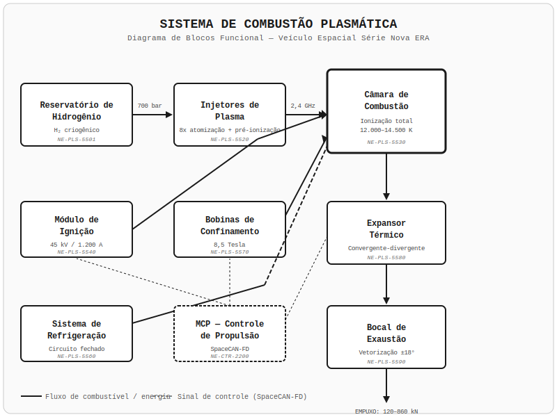
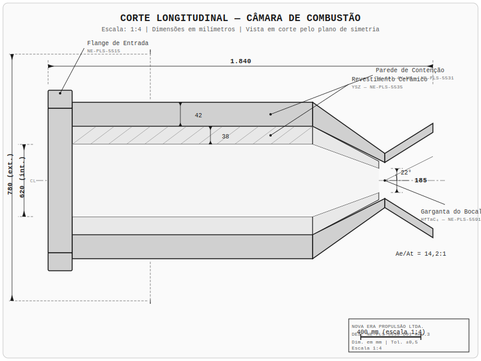
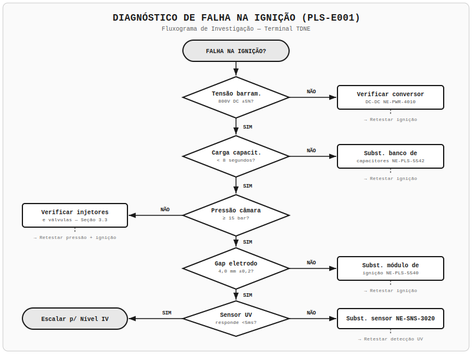
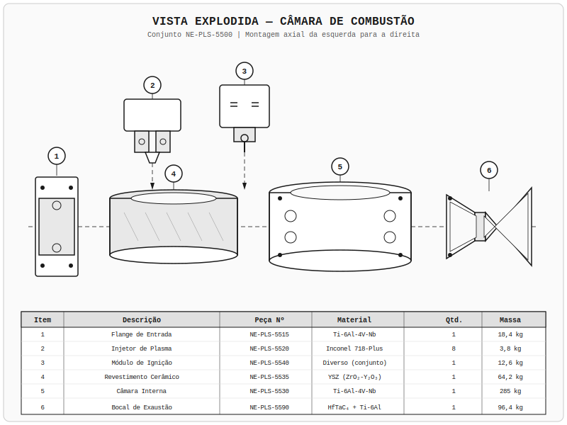
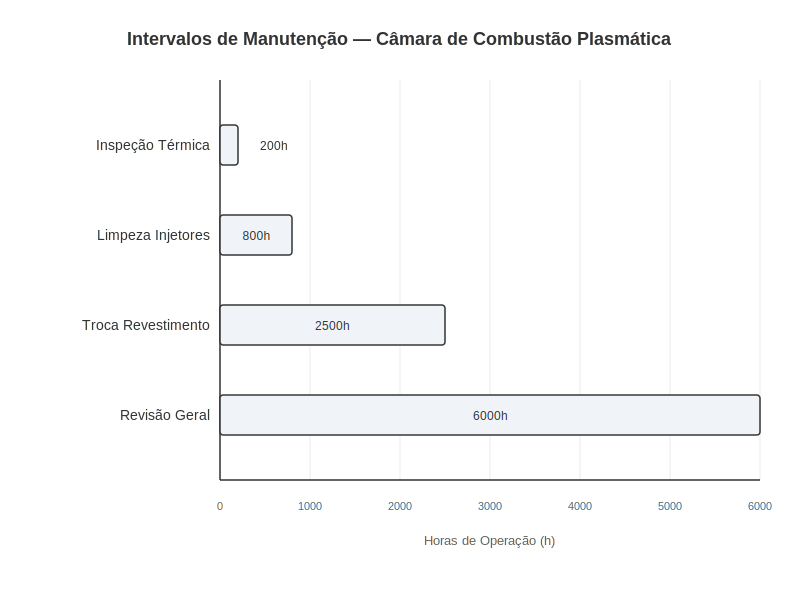

# Câmara de Combustão Plasmática

**Manual Técnico de Reparo — Veículo Espacial Série Databricks Galáctica**
**Documento:** MR-PLS-005 | **Revisão:** 3.2 | **Classificação:** Restrito — Técnicos Certificados Nível III+

> **AVISO DE SEGURANÇA CRÍTICO:** A câmara de combustão plasmática opera a temperaturas superiores a 14.000 K e pressões de até 385 bar. Qualquer procedimento descrito neste manual deve ser executado exclusivamente com o sistema completamente desligado, despressurizado e resfriado abaixo de 45 °C. O não cumprimento dessas condições pode resultar em lesões fatais, destruição do veículo e contaminação radioativa do ambiente circundante. Utilize sempre equipamento de proteção classe Gamma-4 (luvas de nióbio-titânio, visor de filtragem plasmática e traje pressurizado anti-radiação).

---

## 1. Visão Geral e Princípios de Funcionamento

A câmara de combustão plasmática é o coração do sistema propulsivo do Veículo Espacial Série Databricks Galáctica. Este componente é responsável por converter hidrogênio molecular (H₂) em plasma de alta energia através de um processo de ionização controlada, gerando o empuxo necessário para manobras orbitais, transferências interplanetárias e operações de pouso/decolagem em corpos celestes com gravidade de até 2,4 g.

### 1.1 Geração de Plasma

O processo de geração de plasma inicia-se no Reservatório Criogênico de Hidrogênio (peça NE-PLS-5501), onde o H₂ é armazenado a -253 °C e 700 bar. O hidrogênio líquido é bombeado pelo Conjunto de Bombas Criogênicas (NE-PLS-5503) através de dutos supercondutores até os Injetores de Plasma (NE-PLS-5520), que atomizam o combustível em gotículas de diâmetro inferior a 0,8 micrômetros.

Os injetores utilizam um campo eletromagnético pulsante de 2,4 GHz para pré-ionizar o hidrogênio atomizado antes da entrada na câmara principal. Este estágio de pré-ionização é fundamental para garantir a eficiência da combustão, reduzindo o tempo de ignição de 340 ms para menos de 12 ms.

A ionização completa ocorre dentro da câmara de combustão propriamente dita, onde o Módulo de Ignição por Arco Voltaico (NE-PLS-5540) gera uma descarga elétrica de 45.000 V a 1.200 A, convertendo o gás pré-ionizado em plasma totalmente ionizado (estado de ionização IV). A temperatura do plasma resultante atinge entre 12.000 K e 14.500 K, dependendo da taxa de injeção e da configuração de potência selecionada.

### 1.2 Sequência de Ignição

A sequência de ignição é controlada pelo Módulo de Controle de Propulsão (MCP, peça NE-CTR-2200) e segue uma ordem precisa de 14 etapas. A falha em qualquer etapa aciona o protocolo de aborto automático (código de segurança ABORT-PLS-7).

| Etapa | Tempo (ms) | Ação | Componente Responsável | Código de Verificação |
|-------|-----------|------|------------------------|-----------------------|
| 1 | T+0 | Ativação do sistema de refrigeração da câmara | NE-PLS-5560 | CHK-COOL-01 |
| 2 | T+50 | Pressurização do reservatório de hidrogênio | NE-PLS-5501 | CHK-PRES-01 |
| 3 | T+120 | Abertura das válvulas de isolamento primárias | NE-PLS-5510 | CHK-VALV-01 |
| 4 | T+180 | Início da bomba criogênica — rampa a 30% | NE-PLS-5503 | CHK-PUMP-01 |
| 5 | T+250 | Ativação do campo eletromagnético de pré-ionização | NE-PLS-5522 | CHK-EMAG-01 |
| 6 | T+340 | Injeção de hidrogênio — vazão mínima (2,4 kg/s) | NE-PLS-5520 | CHK-INJT-01 |
| 7 | T+400 | Verificação de pressão na câmara (≥ 15 bar) | NE-SNS-3010 | CHK-PCAM-01 |
| 8 | T+420 | Disparo do arco voltaico primário | NE-PLS-5540 | CHK-IGNT-01 |
| 9 | T+432 | Confirmação de ignição — sensor óptico UV | NE-SNS-3020 | CHK-IGNC-01 |
| 10 | T+500 | Rampa de injeção para 60% | NE-PLS-5520 | CHK-RAMP-01 |
| 11 | T+700 | Estabilização térmica da câmara | NE-PLS-5560 | CHK-TSTB-01 |
| 12 | T+900 | Rampa de injeção para 100% (regime nominal) | NE-PLS-5520 | CHK-RAMP-02 |
| 13 | T+1200 | Verificação de estabilidade de empuxo (±2%) | NE-SNS-3040 | CHK-THST-01 |
| 14 | T+1500 | Confirmação de operação nominal — sistema "GO" | NE-CTR-2200 | CHK-NOMI-01 |

A sequência completa leva 1.500 ms (1,5 segundo) do comando de ignição até a confirmação de operação nominal. Em modo de emergência, as etapas 11 e 13 podem ser suprimidas, reduzindo o tempo para 950 ms, porém com risco de estresse térmico na câmara.

### 1.3 Dinâmica de Combustão

Uma vez estabelecida a combustão estável, o plasma é confinado magneticamente por bobinas supercondutoras de nióbio-estanho (NE-PLS-5570) dispostas em configuração toroidal ao redor da câmara. O campo magnético de confinamento opera a 8,5 Tesla e impede o contato direto do plasma com as paredes da câmara, prolongando drasticamente a vida útil do revestimento cerâmico interno.

O plasma confinado é acelerado através do Expansor Térmico (NE-PLS-5580), uma seção convergente-divergente revestida de carbeto de háfnio-tântalo (HfTaC₄), que converte a energia térmica do plasma em energia cinética direcionada. A velocidade de exaustão resultante varia entre 28.000 m/s e 42.000 m/s, produzindo um impulso específico (Isp) de 2.850 s a 4.280 s, dependendo do regime de operação.

O Bocal de Exaustão (NE-PLS-5590) direciona o fluxo plasmático e incorpora um sistema de vetorização de empuxo com amplitude de ±18° em dois eixos, permitindo controle direcional fino durante manobras orbitais de precisão.

| Parâmetro | Regime Econômico | Regime Nominal | Regime Máximo |
|-----------|-----------------|----------------|---------------|
| Vazão de H₂ (kg/s) | 1,2 | 4,8 | 8,6 |
| Temperatura do plasma (K) | 8.500 | 12.000 | 14.500 |
| Pressão na câmara (bar) | 85 | 240 | 385 |
| Empuxo (kN) | 120 | 480 | 860 |
| Isp (s) | 4.280 | 3.400 | 2.850 |
| Consumo elétrico (MW) | 2,8 | 8,4 | 15,2 |

> **NOTA TÉCNICA:** O regime máximo deve ser utilizado somente para manobras de emergência (evasão de detritos, aborto de pouso) e não deve exceder 180 segundos contínuos. O uso prolongado em regime máximo acelera a degradação do revestimento cerâmico e pode causar desalinhamento das bobinas de confinamento magnético.

---

## 2. Especificações Técnicas

Esta seção detalha as especificações dimensionais, térmicas, mecânicas e elétricas de todos os componentes principais da câmara de combustão plasmática. Todas as medidas seguem o padrão metrológico interplanetário (PMI-2187) e devem ser verificadas com instrumentos calibrados segundo a norma NE-CAL-0012.

### 2.1 Dimensões da Câmara Principal

A câmara de combustão possui geometria cilíndrica com seção convergente na extremidade de exaustão. O projeto segue a configuração "toroidal confinada" patenteada pela Databricks Galáctica Propulsão Ltda., que maximiza o tempo de residência do plasma na zona de combustão.

| Dimensão | Valor | Tolerância |
|----------|-------|------------|
| Comprimento total da câmara | 1.840 mm | ±0,5 mm |
| Diâmetro interno (seção cilíndrica) | 620 mm | ±0,2 mm |
| Diâmetro externo (com revestimento) | 780 mm | ±0,3 mm |
| Espessura da parede de contenção (liga Ti-6Al-4V-Nb) | 42 mm | ±0,1 mm |
| Espessura do revestimento cerâmico interno | 38 mm | ±0,15 mm |
| Diâmetro da garganta do bocal | 185 mm | ±0,08 mm |
| Razão de expansão do bocal (Ae/At) | 14,2:1 | ±0,3 |
| Comprimento do expansor térmico | 920 mm | ±0,4 mm |
| Ângulo do cone divergente | 22° | ±0,5° |
| Massa total do conjunto (seco) | 487 kg | ±2 kg |

### 2.2 Classificações de Temperatura e Pressão

| Componente | Peça Nº | Temp. Operacional | Temp. Máxima | Pressão Operacional | Pressão Máxima |
|------------|---------|-------------------|--------------|---------------------|----------------|
| Câmara interna | NE-PLS-5530 | 1.200 °C | 1.650 °C | 240 bar | 425 bar |
| Revestimento cerâmico | NE-PLS-5535 | 2.800 °C | 3.200 °C | N/A | N/A |
| Parede de contenção | NE-PLS-5531 | 450 °C | 680 °C | 240 bar | 425 bar |
| Garganta do bocal | NE-PLS-5591 | 1.800 °C | 2.100 °C | 385 bar | 450 bar |
| Expansor térmico | NE-PLS-5580 | 1.400 °C | 1.900 °C | 160 bar | 280 bar |
| Flange de entrada | NE-PLS-5515 | 120 °C | 200 °C | 385 bar | 450 bar |
| Junta de vedação primária | NE-PLS-5516 | 180 °C | 250 °C | 385 bar | 450 bar |
| Bobinas de confinamento | NE-PLS-5570 | -269 °C (4 K) | -250 °C (23 K) | N/A | N/A |

### 2.3 Especificações dos Injetores de Plasma

O sistema conta com 8 injetores de plasma dispostos radialmente com espaçamento de 45° ao redor da câmara. Cada injetor é uma unidade independente com válvula solenoide, atomizador ultrassônico e bobina de pré-ionização.

| Especificação | Valor |
|---------------|-------|
| Número de peça do conjunto injetor | NE-PLS-5520 |
| Quantidade por câmara | 8 unidades |
| Vazão nominal por injetor | 0,6 kg/s |
| Vazão máxima por injetor | 1,075 kg/s |
| Pressão de operação do atomizador | 420 bar |
| Frequência do atomizador ultrassônico | 48 kHz |
| Diâmetro do orifício de injeção | 1,2 mm ±0,01 mm |
| Frequência do campo de pré-ionização | 2,4 GHz |
| Potência do campo de pré-ionização | 4,8 kW por injetor |
| Torque de montagem do injetor na câmara | 185 N·m ±5 N·m |
| Torque da conexão de alimentação de H₂ | 95 N·m ±3 N·m |
| Torque do conector elétrico blindado | 12 N·m ±0,5 N·m |
| Vida útil nominal | 2.500 horas de operação |
| Material do corpo | Liga Inconel 718-Plus |
| Material do orifício | Carbeto de tungstênio (WC) |
| Massa por unidade | 3,8 kg |

### 2.4 Sistema Elétrico e de Controle

| Componente | Peça Nº | Tensão | Corrente | Potência | Protocolo de Comunicação |
|------------|---------|--------|----------|----------|--------------------------|
| Módulo de ignição | NE-PLS-5540 | 45.000 V (pico) | 1.200 A (pico) | 54 MW (pulsado) | SpaceCAN-FD |
| Bobinas de confinamento | NE-PLS-5570 | 12 V DC | 8.400 A | 100,8 kW | SpaceCAN-FD |
| Controlador de injetores | NE-CTR-2210 | 48 V DC | 120 A | 5,76 kW | SpaceCAN-FD |
| Bombas criogênicas | NE-PLS-5503 | 400 V AC (trifásico) | 85 A | 58,9 kW | SpaceCAN-FD |
| Sistema de refrigeração | NE-PLS-5560 | 400 V AC (trifásico) | 42 A | 29,1 kW | SpaceCAN-FD |
| Sensores térmicos (x16) | NE-SNS-3010 | 5 V DC | 20 mA | 0,1 W | SPI-Rad |
| Sensor óptico UV | NE-SNS-3020 | 12 V DC | 150 mA | 1,8 W | SPI-Rad |
| Sensor de pressão (x8) | NE-SNS-3030 | 5 V DC | 25 mA | 0,125 W | SPI-Rad |

> **AVISO:** O módulo de ignição NE-PLS-5540 armazena energia residual nos capacitores de descarga por até 45 minutos após o desligamento. Antes de qualquer manutenção, execute o procedimento de descarga controlada (PD-PLS-540) e verifique com multímetro de alta tensão certificado que a tensão residual é inferior a 50 V.

---

## 3. Procedimento de Diagnóstico

O diagnóstico de falhas na câmara de combustão plasmática requer o uso do Terminal de Diagnóstico Databricks Galáctica (TDNE, peça NE-DGN-8000) conectado à porta de serviço SpaceCAN-FD localizada no painel lateral esquerdo do compartimento de propulsão. O TDNE executa rotinas automatizadas de teste e reporta códigos de falha padronizados.

### 3.1 Códigos de Falha — Referência Rápida

| Código | Descrição | Severidade | Ação Imediata |
|--------|-----------|------------|---------------|
| PLS-E001 | Falha de ignição — sem detecção UV após disparo | Crítica | Verificar módulo NE-PLS-5540 e sensor NE-SNS-3020 |
| PLS-E002 | Subpressão na câmara (<10 bar no regime nominal) | Crítica | Verificar injetores e válvulas de isolamento |
| PLS-E003 | Sobrepressão na câmara (>400 bar) | Emergência | Desligamento imediato — possível obstrução do bocal |
| PLS-E004 | Temperatura de parede acima do limite (>700 °C) | Crítica | Verificar sistema de refrigeração NE-PLS-5560 |
| PLS-E005 | Instabilidade de combustão (oscilação >±8%) | Alta | Verificar balanceamento dos injetores |
| PLS-E006 | Perda de confinamento magnético | Emergência | Desligamento imediato — risco de dano à câmara |
| PLS-E007 | Falha no sensor térmico (leitura fora de faixa) | Média | Substituir sensor específico NE-SNS-3010 |
| PLS-E008 | Degradação do revestimento cerâmico detectada | Alta | Agendar substituição — máximo 50 horas adicionais |
| PLS-E009 | Vazamento de H₂ detectado no circuito de alimentação | Crítica | Despressurizar e localizar vazamento |
| PLS-E010 | Desalinhamento do bocal de exaustão | Média | Recalibrar atuadores de vetorização |
| PLS-W001 | Desgaste do orifício de injetor acima de 70% | Aviso | Programar substituição do injetor |
| PLS-W002 | Vida útil do revestimento abaixo de 20% | Aviso | Programar substituição do revestimento |
| PLS-W003 | Eficiência de combustão abaixo de 92% | Aviso | Executar rotina de limpeza dos injetores |
| PLS-W004 | Vibração excessiva no conjunto propulsor | Aviso | Verificar torques de montagem e alinhamento |

### 3.2 Leituras de Sensores Térmicos

O sistema possui 16 sensores térmicos (NE-SNS-3010) distribuídos em 4 anéis de 4 sensores ao longo do comprimento da câmara. Cada sensor fornece leituras em tempo real para o MCP.

**Procedimento de verificação dos sensores térmicos:**

1. Conecte o TDNE à porta SpaceCAN-FD (conector tipo D-38, torque 4 N·m ± 0,2 N·m).
2. No menu principal, selecione **Diagnóstico > Propulsão > Câmara Plasmática > Sensores Térmicos**.
3. Execute o teste **THERM-SELF-TEST** (duração: 45 segundos).
4. Verifique os resultados conforme a tabela abaixo.

| Anel | Posição | ID do Sensor | Faixa Normal (câmara fria) | Faixa Normal (regime nominal) | Desvio Máximo Permitido |
|------|---------|--------------|---------------------------|-------------------------------|------------------------|
| A (entrada) | 0° | T-A0 | 18–30 °C | 280–340 °C | ±15 °C |
| A (entrada) | 90° | T-A1 | 18–30 °C | 285–345 °C | ±15 °C |
| A (entrada) | 180° | T-A2 | 18–30 °C | 280–340 °C | ±15 °C |
| A (entrada) | 270° | T-A3 | 18–30 °C | 285–345 °C | ±15 °C |
| B (média-anterior) | 0° | T-B0 | 18–30 °C | 380–440 °C | ±18 °C |
| B (média-anterior) | 90° | T-B1 | 18–30 °C | 385–445 °C | ±18 °C |
| B (média-anterior) | 180° | T-B2 | 18–30 °C | 380–440 °C | ±18 °C |
| B (média-anterior) | 270° | T-B3 | 18–30 °C | 385–445 °C | ±18 °C |
| C (média-posterior) | 0° | T-C0 | 18–30 °C | 420–480 °C | ±20 °C |
| C (média-posterior) | 90° | T-C1 | 18–30 °C | 425–485 °C | ±20 °C |
| C (média-posterior) | 180° | T-C2 | 18–30 °C | 420–480 °C | ±20 °C |
| C (média-posterior) | 270° | T-C3 | 18–30 °C | 425–485 °C | ±20 °C |
| D (garganta) | 0° | T-D0 | 18–30 °C | 520–600 °C | ±25 °C |
| D (garganta) | 90° | T-D1 | 18–30 °C | 525–610 °C | ±25 °C |
| D (garganta) | 180° | T-D2 | 18–30 °C | 520–600 °C | ±25 °C |
| D (garganta) | 270° | T-D3 | 18–30 °C | 525–610 °C | ±25 °C |

5. Se qualquer sensor apresentar desvio superior ao permitido em relação aos demais sensores do mesmo anel, registre o código de falha PLS-E007 e substitua o sensor conforme a Seção 4.
6. Se todos os sensores de um anel apresentarem leituras uniformemente elevadas (acima da faixa normal), investigue possível degradação localizada do revestimento cerâmico.

### 3.3 Anomalias de Pressão

O diagnóstico de anomalias de pressão utiliza os 8 sensores de pressão (NE-SNS-3030) instalados na câmara e no circuito de alimentação.

**Procedimento de teste de pressão estática:**

1. Certifique-se de que a câmara está fria (temperatura de parede < 45 °C) e os injetores estão fechados.
2. No TDNE, selecione **Diagnóstico > Propulsão > Câmara Plasmática > Teste de Pressão**.
3. O sistema pressurizará a câmara com nitrogênio inerte (N₂) até 300 bar.
4. Monitore a queda de pressão ao longo de 600 segundos (10 minutos).
5. Avalie o resultado conforme os critérios:

| Queda de Pressão em 10 min | Diagnóstico | Ação |
|----------------------------|-------------|------|
| < 0,5 bar | Sistema estanque — aprovado | Nenhuma |
| 0,5 – 2,0 bar | Vazamento menor detectado | Aplicar líquido revelador nas juntas e flanges |
| 2,0 – 8,0 bar | Vazamento significativo | Substituir juntas de vedação (NE-PLS-5516) |
| > 8,0 bar | Vazamento grave | Desmontar e inspecionar câmara — possível trinca |

### 3.4 Diagnóstico de Falha de Ignição (PLS-E001)

A falha de ignição é uma das ocorrências mais comuns e pode ter múltiplas causas raiz. Siga o fluxograma de diagnóstico abaixo:

1. **Verificar alimentação elétrica do módulo de ignição NE-PLS-5540:**
   - Medir tensão no barramento de alimentação: deve ser 800 V DC ±5%.
   - Se a tensão estiver fora da faixa, verificar o conversor DC-DC (NE-PWR-4010).

2. **Verificar carga dos capacitores de descarga:**
   - No TDNE, executar **IGN-CAP-TEST**.
   - Tensão dos capacitores deve atingir 45.000 V em menos de 8 segundos.
   - Se o tempo de carga for superior a 12 segundos, substituir o banco de capacitores (NE-PLS-5542).

3. **Verificar o eletrodo de ignição:**
   - Remover o módulo de ignição conforme procedimento da Seção 4.
   - Inspecionar visualmente o eletrodo: desgaste máximo permitido de 2,5 mm no comprimento da ponta.
   - Medir a distância entre eletrodos (gap): deve ser 4,0 mm ±0,2 mm.
   - Se o gap estiver fora da especificação, substituir o módulo de ignição completo.

4. **Verificar pressão mínima na câmara:**
   - A ignição requer pressão mínima de 15 bar na câmara.
   - Se a pressão não atingir 15 bar durante a sequência de ignição, verificar os injetores e válvulas conforme Seção 3.3.

5. **Verificar sensor óptico UV (NE-SNS-3020):**
   - Executar **UV-SELF-TEST** no TDNE.
   - O sensor deve responder a uma fonte UV de teste interna em menos de 5 ms.
   - Se não responder, substituir o sensor (procedimento na Seção 4).

| Etapa do Diagnóstico | Ferramenta Requerida | Tempo Estimado |
|----------------------|---------------------|----------------|
| Verificação elétrica | TDNE + multímetro HV | 15 min |
| Teste de capacitores | TDNE | 5 min |
| Inspeção do eletrodo | Chave de remoção NE-FER-7540, calibrador de gap | 30 min |
| Teste de pressão | TDNE + suprimento N₂ | 20 min |
| Teste do sensor UV | TDNE | 5 min |

---

## 4. Procedimento de Reparo / Substituição

> **PRÉ-REQUISITOS DE SEGURANÇA:** Antes de iniciar qualquer procedimento de reparo, certifique-se de que:
> - O sistema propulsivo está completamente desligado há pelo menos 4 horas.
> - A temperatura de todas as superfícies da câmara está abaixo de 45 °C (verificar com pirômetro NE-FER-7100).
> - O circuito de hidrogênio está despressurizado e purgado com N₂ inerte.
> - Os capacitores do módulo de ignição foram descarregados (procedimento PD-PLS-540).
> - O compartimento de propulsão está ventilado e a concentração de H₂ é inferior a 0,1% (verificar com detector NE-FER-7200).
> - Todo o pessoal presente utiliza EPI classe Gamma-4.

### 4.1 Substituição de Injetor de Plasma (NE-PLS-5520)

**Ferramentas necessárias:**

| Ferramenta | Peça Nº | Especificação |
|------------|---------|---------------|
| Chave de torque digital | NE-FER-7300 | Faixa 10–200 N·m, resolução 0,1 N·m |
| Chave de torque micro | NE-FER-7310 | Faixa 1–15 N·m, resolução 0,05 N·m |
| Extrator de injetor | NE-FER-7520 | Específico para NE-PLS-5520 |
| Pasta anti-engripamento espacial | NE-CHM-9010 | Base de dissulfeto de molibdênio (MoS₂) |
| Anel O-ring de selagem | NE-PLS-5521 | Viton-GF (um por injetor) |
| Junta metálica tipo C | NE-PLS-5523 | Inconel 718, revestimento prata |

**Procedimento passo a passo:**

1. Identifique o injetor a ser substituído pela posição angular (0°, 45°, 90°, 135°, 180°, 225°, 270° ou 315°) e confirme o número de série no registro de manutenção.

2. Desconecte o conector elétrico blindado do injetor. Utilize a chave de torque micro NE-FER-7310 para soltar os 4 parafusos do conector (torque de remoção reverso: máximo 15 N·m). Proteja o conector com a capa antipoeira NE-PLS-5524.

3. Desconecte a linha de alimentação de H₂. Solte a porca sextavada de 22 mm com a chave de torque NE-FER-7300 (torque de remoção reverso: máximo 120 N·m). Tampe imediatamente a linha com o plugue NE-PLS-5525.

4. Remova os 6 parafusos de fixação do injetor na câmara (M10x1,5, liga A-286). Utilize a chave de torque NE-FER-7300 em sequência cruzada (1-4-2-5-3-6). Torque de remoção: máximo 220 N·m.

5. Instale o extrator NE-FER-7520 nos dois furos de extração do flange do injetor. Gire o parafuso do extrator uniformemente até que o injetor se solte da câmara. Não utilize alavanca ou impacto.

6. Inspecione a sede do injetor na câmara:
   - Verifique a superfície de vedação quanto a riscos, corrosão ou depósitos.
   - Limpe com solvente NE-CHM-9020 e pano de microfibra classe 100.
   - Se houver dano na sede, consulte o procedimento de reusinagem NE-RPR-5520-S.

7. Prepare o novo injetor:
   - Remova a proteção de transporte e verifique o número de peça e lote.
   - Instale o novo anel O-ring NE-PLS-5521 (lubrificar com NE-CHM-9010).
   - Instale a nova junta metálica tipo C (NE-PLS-5523) na face do flange.

8. Posicione o novo injetor na sede, alinhando o pino de referência (posição 12 horas).

9. Instale os 6 parafusos de fixação com pasta anti-engripamento NE-CHM-9010 nas roscas. Aperte em sequência cruzada (1-4-2-5-3-6) em três estágios:
   - 1º estágio: 60 N·m
   - 2º estágio: 130 N·m
   - 3º estágio: 185 N·m ±5 N·m (torque final)

10. Reconecte a linha de alimentação de H₂. Torque: 95 N·m ±3 N·m.

11. Reconecte o conector elétrico blindado. Torque dos 4 parafusos: 12 N·m ±0,5 N·m.

12. Execute o teste de estanqueidade com N₂ a 300 bar conforme Seção 3.3.

13. Registre a substituição no log de manutenção do TDNE, incluindo número de série do injetor novo e antigo.

### 4.2 Recondicionamento do Revestimento Cerâmico (NE-PLS-5535)

O revestimento cerâmico interno é composto de zircônia estabilizada com ítria (YSZ) aplicada por projeção a plasma sobre a parede interna da câmara. A vida útil nominal é de 2.500 horas, mas pode ser reduzida por operação frequente em regime máximo.

**Critérios de substituição:**

| Condição | Medição | Limite |
|----------|---------|--------|
| Espessura mínima do revestimento | Ultrassom NE-FER-7600 | ≥ 22 mm (de 38 mm original) |
| Profundidade máxima de cratera/erosão | Perfilômetro NE-FER-7610 | ≤ 5 mm |
| Rugosidade superficial (Ra) | Rugosímetro NE-FER-7620 | ≤ 12,5 μm |
| Número de trincas passantes | Inspeção visual + líquido penetrante | Zero (qualquer trinca = substituição) |

**Procedimento de substituição:**

1. Remova todos os 8 injetores conforme Seção 4.1.
2. Remova o módulo de ignição conforme Seção 4.3.
3. Desconecte o expansor térmico da câmara (12 parafusos M16x2, torque de remoção: máximo 380 N·m).
4. Desconecte a flange de entrada (8 parafusos M12x1,75, torque de remoção: máximo 250 N·m).
5. Remova as bobinas de confinamento magnético (procedimento NE-RPR-5570).
6. Extraia a câmara interna do chassi do compartimento de propulsão utilizando o trilho guia NE-FER-7700.
7. Instale a câmara na bancada de jateamento (NE-FER-7710) e remova o revestimento antigo por jateamento abrasivo com microesferas de alumina (granulometria 120 mesh).
8. Inspecione a parede metálica subjacente:
   - Verificar espessura por ultrassom: mínimo 40 mm (de 42 mm nominal).
   - Verificar ausência de trincas por partículas magnéticas.
9. Aplique o novo revestimento cerâmico por projeção a plasma (equipamento NE-FER-7720):
   - Pó de YSZ: NE-CHM-9050, granulometria 15–45 μm.
   - Espessura alvo: 38 mm ±0,5 mm.
   - Temperatura do substrato durante aplicação: 200–300 °C.
   - Número de passes: 12–16 (conforme espessura por passe).
10. Após resfriamento (mínimo 8 horas), usine a superfície interna para acabamento final (Ra ≤ 6,3 μm).
11. Execute inspeção dimensional completa e registre todas as medidas.
12. Remonte a câmara seguindo a ordem inversa dos passos 1–6. Utilize juntas e O-rings novos em todas as conexões.

### 4.3 Substituição do Módulo de Ignição (NE-PLS-5540)

| Etapa | Ação | Torque / Especificação |
|-------|------|----------------------|
| 1 | Descarregar capacitores (PD-PLS-540) | Verificar V < 50 V |
| 2 | Desconectar cabo de alta tensão | Torque do conector: 25 N·m |
| 3 | Desconectar cabo de controle SpaceCAN-FD | Torque do conector: 8 N·m |
| 4 | Remover os 4 parafusos de fixação (M8x1,25) | Torque de remoção: máx. 85 N·m |
| 5 | Extrair o módulo pela guia axial | Puxar axialmente sem rotação |
| 6 | Inspecionar a sede e o isolador cerâmico | Sem trincas, sem depósitos carbonizados |
| 7 | Instalar o novo módulo com isoladores novos | NE-PLS-5541 (kit de isoladores) |
| 8 | Fixar com 4 parafusos novos (A-286) | 75 N·m ±3 N·m, sequência cruzada |
| 9 | Conectar cabo de alta tensão | 25 N·m ±1 N·m |
| 10 | Conectar cabo SpaceCAN-FD | 8 N·m ±0,3 N·m |
| 11 | Executar IGN-CAP-TEST no TDNE | Tempo de carga < 8 s |
| 12 | Executar teste de faísca (câmara em N₂) | Arco visível no visor de inspeção |

> **PERIGO:** Nunca toque nos terminais do módulo de ignição sem antes executar o procedimento de descarga PD-PLS-540. A energia armazenada nos capacitores (até 12 kJ) é suficiente para causar eletrocussão fatal.

---

## 5. Manutenção Preventiva e Intervalos

A manutenção preventiva da câmara de combustão plasmática segue um cronograma baseado em horas de operação acumuladas, registradas automaticamente pelo MCP (Módulo de Controle de Propulsão). A adesão rigorosa a este cronograma é fundamental para garantir a segurança, confiabilidade e desempenho do sistema propulsivo.

### 5.1 Cronograma de Inspeções e Serviços

| Intervalo (horas) | Serviço | Peças de Reposição | Tempo Estimado | Nível Técnico |
|--------------------|---------|-------------------|----------------|---------------|
| 200 | Inspeção térmica não-invasiva | Nenhuma | 2 horas | Nível II |
| 200 | Leitura e registro dos sensores de pressão | Nenhuma | 1 hora | Nível II |
| 400 | Teste de estanqueidade com N₂ | N₂ industrial (50 L) | 3 horas | Nível II |
| 400 | Verificação do gap do eletrodo de ignição | NE-PLS-5541 (se necessário) | 2 horas | Nível III |
| 800 | Limpeza dos injetores de plasma | Kit de limpeza NE-CHM-9030 | 6 horas | Nível III |
| 800 | Inspeção ultrassônica do revestimento cerâmico | Nenhuma | 4 horas | Nível III |
| 800 | Verificação do alinhamento do bocal | Nenhuma | 2 horas | Nível III |
| 1.200 | Substituição das juntas de vedação | Kit NE-PLS-5516-K (8 juntas) | 8 horas | Nível III |
| 1.200 | Calibração dos sensores térmicos | Nenhuma | 3 horas | Nível III |
| 1.600 | Substituição dos O-rings dos injetores | NE-PLS-5521 (x8) | 10 horas | Nível III |
| 2.500 | Substituição do revestimento cerâmico | NE-CHM-9050 (pó YSZ, 45 kg) | 48 horas | Nível IV |
| 2.500 | Substituição dos injetores (todos) | NE-PLS-5520 (x8) | 16 horas | Nível III |
| 2.500 | Substituição do módulo de ignição | NE-PLS-5540 + NE-PLS-5541 | 4 horas | Nível III |
| 5.000 | Inspeção da parede de contenção | Nenhuma | 12 horas | Nível IV |
| 5.000 | Recertificação das bobinas de confinamento | Nenhuma | 8 horas | Nível IV |
| 6.000 | Revisão geral (overhaul) do conjunto completo | Kit NE-PLS-5500-OH | 120 horas | Nível IV |

### 5.2 Procedimento de Limpeza dos Injetores (Intervalo 800h)

A limpeza dos injetores é crítica para manter a eficiência de combustão acima de 95%. Depósitos carbonizados no orifício de injeção alteram o padrão de atomização e podem causar instabilidade de combustão (PLS-E005).

1. Remova cada injetor conforme o procedimento da Seção 4.1 (passos 1–5).
2. Instale o injetor na bancada de limpeza ultrassônica NE-FER-7800.
3. Preencha o tanque com solução de limpeza NE-CHM-9030 (concentração: 15% em água deionizada, temperatura: 60 °C ±5 °C).
4. Execute ciclo ultrassônico: frequência 40 kHz, potência 300 W, duração 30 minutos.
5. Enxágue com água deionizada a alta pressão (150 bar) por 2 minutos.
6. Seque com nitrogênio filtrado (classe 0,1 μm) a 80 °C por 15 minutos.
7. Inspecione o orifício de injeção com microscópio estereoscópico (aumento 40x):
   - Diâmetro do orifício: 1,2 mm ±0,03 mm (tolerância de desgaste).
   - Se o diâmetro exceder 1,23 mm, substituir o injetor.
8. Execute teste de vazão no banco de teste NE-FER-7810:
   - Vazão com água a 200 bar: 0,42 L/min ±5%.
   - Padrão de spray: cônico, ângulo 28° ±2°.
9. Reinstale o injetor conforme Seção 4.1 (passos 7–13).

| Critério de Aceitação | Método de Medição | Valor Mínimo | Valor Máximo |
|-----------------------|-------------------|--------------|--------------|
| Diâmetro do orifício | Microscópio 40x + micrômetro | 1,17 mm | 1,23 mm |
| Vazão a 200 bar | Banco de teste NE-FER-7810 | 0,399 L/min | 0,441 L/min |
| Ângulo de spray | Banco de teste + câmera | 26° | 30° |
| Rugosidade interna do orifício | Perfilômetro óptico | — | Ra 0,8 μm |

### 5.3 Substituição de Selos e Juntas (Intervalo 1.200h)

As juntas e selos da câmara de combustão operam em condições extremas de temperatura e pressão. A substituição preventiva no intervalo de 1.200 horas evita vazamentos que podem escalar para falhas catastróficas.

**Inventário de juntas e selos para substituição a cada 1.200h:**

| Item | Peça Nº | Quantidade | Material | Localização |
|------|---------|------------|----------|-------------|
| Junta do flange de entrada | NE-PLS-5516-A | 1 | Inconel 718, revestimento prata | Flange de entrada da câmara |
| Junta do expansor térmico | NE-PLS-5516-B | 1 | Inconel 718, revestimento prata | Junção câmara-expansor |
| O-ring dos injetores | NE-PLS-5521 | 8 | Viton-GF | Sede de cada injetor |
| Junta do módulo de ignição | NE-PLS-5516-C | 1 | Grafite expandido, anel metálico | Porta do módulo de ignição |
| Selos dos sensores térmicos | NE-SNS-3010-S | 16 | Viton-GF | Base de cada sensor |
| Selos dos sensores de pressão | NE-SNS-3030-S | 8 | Viton-GF | Base de cada sensor |

**Procedimento geral:**

1. Para cada componente, remova os fixadores de montagem seguindo os torques de remoção especificados na Seção 4.
2. Remova a junta ou selo antigo. Limpe as superfícies de vedação com solvente NE-CHM-9020.
3. Inspecione as superfícies de vedação quanto a riscos, corrosão ou deformação. A rugosidade máxima admissível para superfícies de vedação metálica é Ra 1,6 μm.
4. Instale a junta ou selo novo. Para O-rings, aplique uma película fina de lubrificante NE-CHM-9010.
5. Reinstale os fixadores conforme os torques especificados na Seção 4.
6. Execute teste de estanqueidade com N₂ a 300 bar (Seção 3.3) após a substituição de todas as juntas.

### 5.4 Registro e Rastreabilidade

Toda manutenção preventiva deve ser registrada eletronicamente no TDNE e fisicamente no Livro de Registro do Veículo (LRV). Os seguintes dados devem ser documentados:

| Campo | Descrição | Exemplo |
|-------|-----------|---------|
| Data/hora UTC | Data e hora de início do serviço | 2287-03-15T14:30:00Z |
| Horas acumuladas | Leitura do horímetro no MCP | 1.204,7 h |
| Código do serviço | Código padronizado do serviço realizado | MP-PLS-800 |
| Técnico responsável | Nome e número de certificação | J. Silva — CERT-NE-III-4892 |
| Peças substituídas | Número de peça, lote e número de série | NE-PLS-5520, Lote 2287-Q1, S/N 48291 |
| Resultado dos testes | Aprovado/Reprovado com valores medidos | Estanqueidade: 0,3 bar/10min — APROVADO |
| Observações | Quaisquer anomalias ou recomendações | Leve escurecimento no injetor pos. 180° — monitorar |

> **NOTA REGULATÓRIA:** Conforme a Regulamentação Interplanetária de Segurança de Propulsão (RISP-2285, Artigo 47), a operação de um veículo espacial com manutenção preventiva vencida ou registros incompletos constitui infração grave, sujeita a multa de até 500.000 créditos interplanetários e suspensão da licença de operação. Em caso de acidente com manutenção vencida, a responsabilidade civil e criminal recai integralmente sobre o operador do veículo.

---

**Fim do documento MR-PLS-005 — Câmara de Combustão Plasmática**

*Veículo Espacial Série Databricks Galáctica — Manual Técnico de Reparo*
*Databricks Galáctica Propulsão Ltda. — Todos os direitos reservados — 2287*
*Proibida a reprodução sem autorização expressa.*
