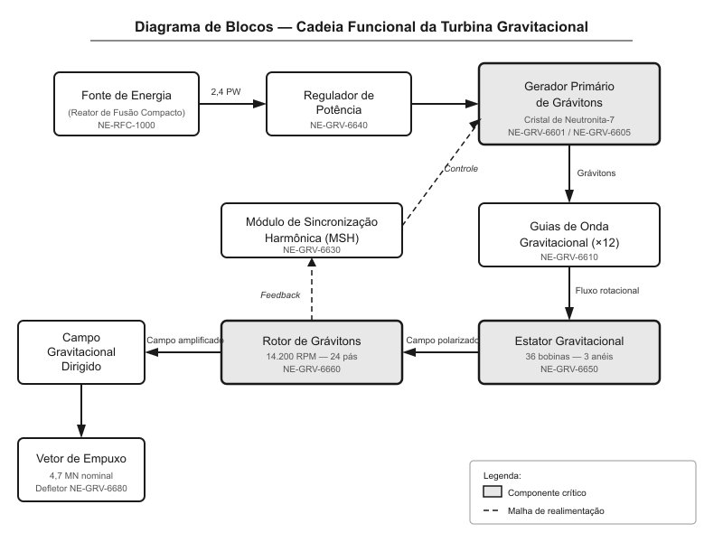
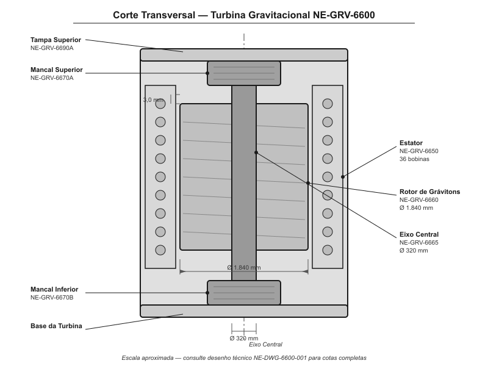
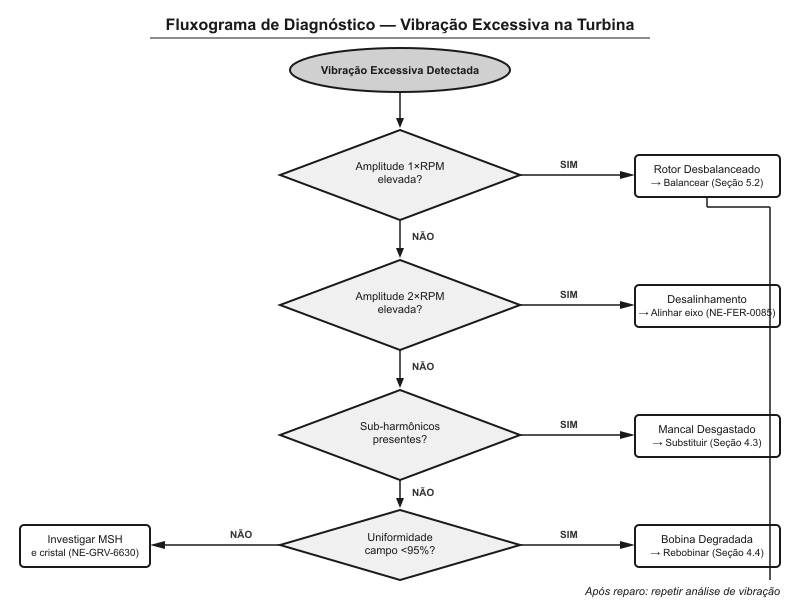
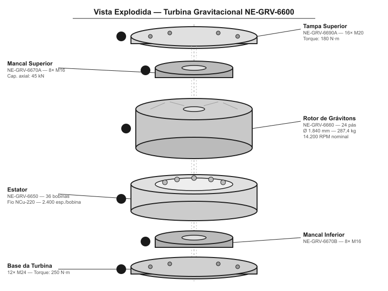
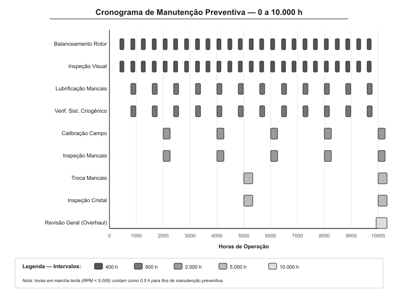

# Turbina Gravitacional

> **Veículo Espacial Série Databricks Galáctica** — Manual de Reparo e Manutenção
> Documento Técnico NE-MAN-0600 | Revisão 4.2 | Classificação: Restrito à Manutenção Nível III
> Aplicável aos modelos: Databricks Galáctica 3500, Databricks Galáctica 4200, Databricks Galáctica 5000 Touring

---

**AVISO DE SEGURANÇA GERAL**

A Turbina Gravitacional opera com campos gravitacionais artificiais de alta intensidade. A exposição desprotegida ao campo ativo pode causar deformação tecidual irreversível, colapso ósseo localizado e distorções espaço-temporais em escala molecular. **Nunca** opere ou realize manutenção na turbina sem o Traje de Proteção Gravitacional Classe IV (peça NE-SAF-9910) e sem que o sistema de contenção de campo esteja verificado e ativo. O descumprimento destas normas invalida a garantia do fabricante e pode resultar em responsabilidade criminal conforme o Código Espacial Unificado, Seção 47-B.

---

## 1. Visão Geral e Princípios de Funcionamento

A Turbina Gravitacional é o coração propulsivo do Veículo Espacial Série Databricks Galáctica. Diferente dos sistemas de propulsão convencionais baseados em reação de massa, a turbina gera um campo gravitacional direcionado que curva o tecido espaço-temporal ao redor do veículo, produzindo empuxo sem a necessidade de ejeção de propelente. Este princípio, denominado **Propulsão por Distorção Gravitacional Controlada (PDGC)**, permite ao veículo atingir acelerações sustentadas de até 12g equivalentes sem que os ocupantes experimentem qualquer força inercial interna.

### 1.1 Manipulação de Grávitons

O princípio fundamental da turbina baseia-se na geração e direcionamento de grávitons sintéticos. O **Gerador Primário de Grávitons** (peça NE-GRV-6601) utiliza um cristal de Neutronita-7 (peça NE-GRV-6605) submetido a oscilações piezo-gravitacionais de frequência ultra-alta (entre 2,4 e 3,8 TGHz — TeraGraviHertz). Quando excitado pela corrente de alimentação do reator principal, o cristal emite um fluxo coerente de grávitons que é direcionado para o estator da turbina.

O fluxo de grávitons gerado é canalizado através de **Guias de Onda Gravitacional** (peça NE-GRV-6610, conjunto com 12 unidades) fabricados em liga de Gravitânio-Titânio (GrTi-440). Estes guias possuem geometria helicoidal interna que induz rotação no fluxo gravitônico, preparando-o para a interação com o rotor.

### 1.2 Harmônicos de Campo

A estabilidade do campo gravitacional produzido depende criticamente do equilíbrio entre os harmônicos fundamentais e seus sobretons. A turbina opera com uma frequência fundamental de campo de **847,3 GHz** (GigaGraviHertz), com tolerância de ±0,05 GHz. Desvios além desta faixa resultam em batimento gravitacional, percebido como vibração estrutural e, em casos extremos, em micro-rupturas no tecido espaço-temporal local.

Os harmônicos são controlados pelo **Módulo de Sincronização Harmônica** (peça NE-GRV-6630), um processador quântico dedicado que monitora em tempo real o espectro de frequências do campo e ajusta a excitação do cristal de Neutronita-7 para manter a pureza espectral acima de 99,97%.

| Parâmetro | Valor Nominal | Tolerância | Consequência do Desvio |
|---|---|---|---|
| Frequência fundamental | 847,3 GHz | ±0,05 GHz | Batimento gravitacional, vibração estrutural |
| Pureza espectral | 99,97% | Mínimo 99,90% | Distorção de campo, consumo energético elevado |
| Amplitude do 2º harmônico | ≤0,02% da fundamental | Máximo 0,05% | Ressonância parasitária no rotor |
| Amplitude do 3º harmônico | ≤0,008% da fundamental | Máximo 0,015% | Interferência com sistemas de navegação |
| Fase entre estator e rotor | 0° (sincronizado) | ±0,3° | Perda de eficiência, aquecimento de mancais |
| Taxa de atualização do MSH | 4,7 milhões de ciclos/s | Mínimo 4,0 milhões | Resposta lenta a transientes de carga |

### 1.3 Acoplamento Energético

A energia para a turbina gravitacional é fornecida pelo Reator de Fusão Compacto (RFC) do veículo através do **Barramento de Potência Gravitacional** (peça NE-PWR-3300). O acoplamento é feito por indução quântica, eliminando conexões físicas que seriam sujeitas a desgaste mecânico. A potência nominal de operação é de **2,4 PW** (PetaWatts) com picos de até **3,1 PW** durante manobras de alta demanda.

O **Regulador de Potência de Acoplamento** (peça NE-GRV-6640) garante que a transferência de energia para o cristal de Neutronita-7 ocorra de forma suave e sem transientes. Este componente possui um circuito de proteção contra sobrecarga que desliga automaticamente a turbina caso a potência exceda 3,5 PW, prevenindo danos ao cristal.

### 1.4 Cadeia Funcional Completa

O funcionamento completo da turbina segue a seguinte cadeia:

1. O RFC fornece energia ao Barramento de Potência Gravitacional
2. O Regulador de Potência condiciona a energia e alimenta o Gerador Primário de Grávitons
3. O cristal de Neutronita-7 emite grávitons sintéticos coerentes
4. Os Guias de Onda Gravitacional canalizam e rotacionam o fluxo de grávitons
5. O fluxo interage com o **Estator Gravitacional**, que impõe polarização direcional
6. O **Rotor de Grávitons** amplifica o campo por efeito de ressonância rotacional
7. O campo gravitacional amplificado é dirigido pelo **Defletor de Saída** (peça NE-GRV-6680)
8. O vetor de empuxo resultante é aplicado à estrutura do veículo

| Etapa | Componente Principal | Peça | Função |
|---|---|---|---|
| 1 | Reator de Fusão Compacto | NE-RFC-1000 | Geração de energia primária |
| 2 | Regulador de Potência | NE-GRV-6640 | Condicionamento e proteção |
| 3 | Gerador Primário de Grávitons | NE-GRV-6601 | Emissão de grávitons sintéticos |
| 4 | Guias de Onda (x12) | NE-GRV-6610 | Canalização e rotação do fluxo |
| 5 | Estator Gravitacional | NE-GRV-6650 | Polarização direcional do campo |
| 6 | Rotor de Grávitons | NE-GRV-6660 | Amplificação por ressonância |
| 7 | Defletor de Saída | NE-GRV-6680 | Direcionamento do vetor de empuxo |
| 8 | Estrutura do Veículo | — | Recepção do empuxo |

---

## 2. Especificações Técnicas

Esta seção detalha as especificações dimensionais, operacionais e de desempenho de todos os componentes principais da Turbina Gravitacional. Todos os valores são referentes à configuração padrão para o modelo Databricks Galáctica 4200. Os modelos 3500 e 5000 Touring possuem variações indicadas em notas de rodapé quando aplicável.

### 2.1 Rotor de Grávitons

O Rotor de Grávitons (peça NE-GRV-6660) é o componente rotativo central da turbina. Fabricado em liga monolítica de Gravitânio-Cromo-Vanádio (GrCrV-880), o rotor possui geometria toroidal com 24 pás gravitônicas integrais dispostas em ângulo helicoidal de 37,5° em relação ao plano equatorial.

| Especificação | Valor | Observações |
|---|---|---|
| Diâmetro externo | 1.840 mm | ±0,02 mm (tolerância de fabricação) |
| Diâmetro interno (furo do eixo) | 320 mm | Ajuste H7/g6 com o eixo central |
| Largura axial | 460 mm | Incluindo ressaltos de fixação |
| Massa total | 287,4 kg | Liga GrCrV-880 (densidade 8,42 g/cm³) |
| Número de pás gravitônicas | 24 | Ângulo helicoidal 37,5° |
| Rotação nominal | 14.200 RPM | ±50 RPM sob carga nominal |
| Rotação máxima (emergência) | 18.700 RPM | Limitado a 30 segundos contínuos |
| Desbalanceamento máximo permitido | 0,003 g·mm | Medido em planos de correção A e B |
| Material das pás | GrCrV-880 com revestimento NeutroCarb-3 | Espessura do revestimento: 0,15 mm |
| Vida útil nominal | 12.000 horas | Sob condições normais de operação |

### 2.2 Estator Gravitacional

O Estator Gravitacional (peça NE-GRV-6650) envolve o rotor e é composto por 36 bobinas de campo gravitacional dispostas em três anéis concêntricos de 12 bobinas cada. Cada bobina é enrolada com fio supercondutor de Neutronita-Cu (NCu-220) de 0,8 mm de diâmetro.

| Especificação | Valor | Observações |
|---|---|---|
| Diâmetro interno | 1.846 mm | Folga rotor-estator: 3,0 mm radial |
| Diâmetro externo | 2.340 mm | Incluindo carcaça de contenção |
| Número de bobinas | 36 (3 anéis × 12) | Espaçamento angular: 30° por anel |
| Fio supercondutor | NCu-220, Ø 0,8 mm | Temperatura crítica: 412 K |
| Espiras por bobina | 2.400 | Resistência DC a 300 K: < 0,001 Ω |
| Corrente nominal por bobina | 847 A | Corrente máxima: 1.100 A |
| Folga rotor-estator | 3,0 mm ±0,1 mm | Verificar com calibrador NE-FER-0034 |
| Tensão de isolamento | > 15 kV | Teste com megôhmetro gravitônico |

### 2.3 Mancais e Eixo Central

O rotor é suportado por dois mancais magneto-gravitacionais (superior e inferior) que proporcionam levitação sem contato físico durante a operação normal. Em caso de falha do sistema de levitação, mancais mecânicos de emergência de cerâmica de Nitreto de Gráviton (GrN-440) entram em ação automaticamente.

| Componente | Peça | Especificação Principal |
|---|---|---|
| Mancal Superior (magneto-gravitacional) | NE-GRV-6670A | Capacidade de carga axial: 45 kN, radial: 30 kN |
| Mancal Inferior (magneto-gravitacional) | NE-GRV-6670B | Capacidade de carga axial: 45 kN, radial: 30 kN |
| Mancal Superior (emergência, mecânico) | NE-GRV-6671A | Cerâmica GrN-440, vida útil: 200 h em uso contínuo |
| Mancal Inferior (emergência, mecânico) | NE-GRV-6671B | Cerâmica GrN-440, vida útil: 200 h em uso contínuo |
| Eixo Central | NE-GRV-6665 | Liga GrTi-440, Ø 320 mm, comprimento 1.120 mm |
| Sensor de posição do rotor (x4) | NE-SEN-4410 | Resolução: 0,001 mm, taxa: 50 kHz |
| Controlador de levitação | NE-GRV-6675 | Processador quântico dedicado, latência < 2 μs |

### 2.4 Saída de Campo e Desempenho

| Parâmetro de Desempenho | Valor | Condição |
|---|---|---|
| Empuxo gravitacional nominal | 4,7 MN (MegaNewtons) | Rotação nominal, campo estável |
| Empuxo máximo (modo emergência) | 7,2 MN | Rotação máxima, limitado a 30 s |
| Eficiência de conversão energética | 94,3% | Condições nominais |
| Tempo de partida (cold start) | 12,4 s | Até empuxo nominal estável |
| Tempo de resposta a comandos | < 45 ms | De 10% a 90% do empuxo comandado |
| Consumo energético nominal | 2,4 PW | Fornecido pelo RFC |
| Consumo em marcha lenta | 0,18 PW | Rotor a 3.200 RPM, campo mínimo |
| Intensidade do campo no bocal | 2,8 × 10⁴ g | Medida no centro do defletor de saída |
| Temperatura operacional do estator | 287 K ±5 K | Mantida pelo sistema criogênico |

---

## 3. Procedimento de Diagnóstico

Esta seção descreve os procedimentos de diagnóstico para identificar falhas e degradação de desempenho na Turbina Gravitacional. Todos os procedimentos requerem o **Kit de Diagnóstico Gravitacional NE-DIAG-6000**, que inclui os instrumentos listados abaixo.

**AVISO:** Antes de iniciar qualquer procedimento de diagnóstico, verifique que o sistema de contenção de campo está ativo e que todos os técnicos presentes utilizam Traje de Proteção Gravitacional Classe IV.

### 3.1 Instrumentos Necessários

| Instrumento | Peça | Função |
|---|---|---|
| Analisador de Espectro Gravitacional | NE-DIAG-6010 | Análise de frequência e harmônicos do campo |
| Vibrômetro Quântico | NE-DIAG-6020 | Medição de vibração em três eixos |
| Medidor de Uniformidade de Campo | NE-DIAG-6030 | Mapeamento 3D da intensidade de campo |
| Scanner de Desgaste de Mancais | NE-DIAG-6040 | Inspeção ultrassônica gravitônica dos mancais |
| Multímetro Gravitônico | NE-DIAG-6050 | Medições elétricas e gravitônicas combinadas |
| Calibrador de Folga Rotor-Estator | NE-FER-0034 | Verificação da folga com precisão de 0,01 mm |

### 3.2 Análise de Vibração

A análise de vibração é o primeiro passo diagnóstico para qualquer anomalia reportada na turbina. O procedimento utiliza o Vibrômetro Quântico (NE-DIAG-6020) conectado aos quatro pontos de medição padronizados.

**Procedimento:**

1. Conectar o Vibrômetro Quântico aos pontos de medição P1 (mancal superior, radial), P2 (mancal superior, axial), P3 (mancal inferior, radial) e P4 (mancal inferior, axial)
2. Colocar a turbina em rotação nominal (14.200 RPM) com carga zero (campo desabilitado)
3. Aguardar estabilização térmica por 180 segundos
4. Registrar leituras de amplitude de vibração nos quatro pontos durante 60 segundos
5. Ativar o campo gravitacional a 25%, 50%, 75% e 100% da potência nominal, registrando cada patamar por 30 segundos
6. Analisar o espectro de frequências para cada condição
7. Comparar os valores obtidos com os limites da tabela abaixo

| Ponto de Medição | Limite Aceitável (sem carga) | Limite de Alerta | Limite Crítico (parada obrigatória) |
|---|---|---|---|
| P1 — Mancal superior, radial | ≤ 0,8 μm pico-a-pico | 0,8 – 1,5 μm | > 1,5 μm |
| P2 — Mancal superior, axial | ≤ 1,2 μm pico-a-pico | 1,2 – 2,0 μm | > 2,0 μm |
| P3 — Mancal inferior, radial | ≤ 0,8 μm pico-a-pico | 0,8 – 1,5 μm | > 1,5 μm |
| P4 — Mancal inferior, axial | ≤ 1,2 μm pico-a-pico | 1,2 – 2,0 μm | > 2,0 μm |
| Amplitude na frequência 1× RPM | ≤ 0,5 μm | 0,5 – 1,0 μm | > 1,0 μm (desbalanceamento) |
| Amplitude na frequência 2× RPM | ≤ 0,3 μm | 0,3 – 0,6 μm | > 0,6 μm (desalinhamento) |
| Amplitude em sub-harmônicos | ≤ 0,1 μm | 0,1 – 0,3 μm | > 0,3 μm (instabilidade de mancal) |

### 3.3 Verificação de Uniformidade de Campo

A uniformidade do campo gravitacional é essencial para a eficiência propulsiva e a segurança estrutural do veículo. Campos não uniformes geram tensões mecânicas assimétricas que podem causar fadiga prematura da estrutura.

**Procedimento:**

1. Instalar o Medidor de Uniformidade de Campo (NE-DIAG-6030) na posição de teste padronizada (suporte NE-FIX-0088, montado na saída do defletor)
2. Ativar a turbina em modo de teste de campo (rotação nominal, empuxo a 50%)
3. Iniciar a varredura automática do medidor — o instrumento realiza 1.440 medições em uma grade esférica de 30° × 30°
4. Aguardar a conclusão da varredura (aproximadamente 120 segundos)
5. Analisar o mapa de campo gerado pelo instrumento
6. Verificar se o desvio máximo em relação ao valor médio é inferior a 2,5%
7. Identificar regiões de concentração ou rarefação de campo

| Parâmetro de Uniformidade | Limite Aceitável | Causa Provável do Desvio |
|---|---|---|
| Desvio máximo do campo médio | ≤ 2,5% | — |
| Desvio entre 2,5% e 5,0% | Alerta — investigar | Bobina com desempenho degradado |
| Desvio entre 5,0% e 8,0% | Manutenção necessária | Bobina aberta ou em curto-circuito parcial |
| Desvio > 8,0% | Parada obrigatória | Falha grave no estator ou rotor danificado |
| Assimetria axial > 3,0% | Alerta | Desalinhamento do rotor ou desgaste irregular de mancais |
| Flutuação temporal > 1,0% | Alerta | Instabilidade no MSH ou cristal degradado |

### 3.4 Indicadores de Desgaste de Mancais

Os mancais magneto-gravitacionais possuem vida útil virtualmente ilimitada em condições normais, mas os mancais mecânicos de emergência e os componentes do sistema de levitação podem degradar. O Scanner de Desgaste de Mancais (NE-DIAG-6040) utiliza ultrassom gravitônico para avaliar a condição interna sem desmontagem.

**Procedimento:**

1. Desligar a turbina completamente e aguardar resfriamento até temperatura ambiente
2. Posicionar o scanner no acoplamento de inspeção superior (marcado "INSP-A" na carcaça)
3. Executar a varredura do mancal superior — duração aproximada: 45 segundos
4. Reposicionar o scanner no acoplamento inferior (marcado "INSP-B")
5. Executar a varredura do mancal inferior — duração aproximada: 45 segundos
6. Analisar os resultados segundo a tabela de classificação

| Classificação | Condição | Ação Requerida |
|---|---|---|
| Classe A | Sem desgaste detectável | Nenhuma — mancal em condição de fábrica |
| Classe B | Desgaste leve (< 5% da superfície) | Monitorar — re-inspecionar em 2.000 horas |
| Classe C | Desgaste moderado (5–15% da superfície) | Programar substituição na próxima parada |
| Classe D | Desgaste severo (15–30% da superfície) | Substituir em até 500 horas de operação |
| Classe E | Desgaste crítico (> 30%) ou trincas | **Substituição imediata obrigatória** |

### 3.5 Diagnóstico Integrado via Sistema de Bordo

O sistema de bordo do Databricks Galáctica registra continuamente os parâmetros de operação da turbina no **Registrador de Dados de Voo** (peça NE-AVN-2200). Os códigos de falha específicos da turbina gravitacional são listados abaixo:

| Código de Falha | Descrição | Severidade | Ação Imediata |
|---|---|---|---|
| GRV-001 | Vibração acima do limite de alerta | Amarelo | Reduzir empuxo a 50%, agendar diagnóstico |
| GRV-002 | Vibração acima do limite crítico | Vermelho | Desligar turbina, mancais de emergência ativos |
| GRV-003 | Desvio de frequência fundamental > ±0,05 GHz | Amarelo | MSH tentando compensação automática |
| GRV-004 | Pureza espectral < 99,90% | Amarelo | Verificar cristal de Neutronita-7 |
| GRV-005 | Uniformidade de campo < 95% | Amarelo | Diagnóstico de estator necessário |
| GRV-006 | Uniformidade de campo < 92% | Vermelho | Desligar turbina imediatamente |
| GRV-007 | Temperatura do estator fora da faixa | Amarelo | Verificar sistema criogênico |
| GRV-008 | Falha no sistema de levitação | Vermelho | Mancais mecânicos ativados automaticamente |
| GRV-009 | Sobrecorrente em bobina do estator | Vermelho | Desligamento automático da bobina afetada |
| GRV-010 | Perda de comunicação com MSH | Vermelho | Desligar turbina, reiniciar MSH |

---

## 4. Procedimento de Reparo / Substituição

Esta seção descreve os procedimentos detalhados para reparo e substituição dos componentes principais da Turbina Gravitacional. Todos os procedimentos devem ser realizados por técnicos certificados Nível III em Sistemas de Propulsão Gravitacional, em ambiente controlado com gravidade artificial estabilizada.

**AVISO CRÍTICO:** O torque de fixação dos parafusos estruturais da turbina é especificado com precisão. A utilização de valores incorretos pode resultar em falha catastrófica do conjunto rotativo em alta rotação. Utilize exclusivamente a chave dinamométrica gravitônica calibrada NE-FER-0072.

### 4.1 Ferramentas Especiais Necessárias

| Ferramenta | Peça | Utilização |
|---|---|---|
| Chave dinamométrica gravitônica | NE-FER-0072 | Torques de 10 a 500 N·m, precisão ±1% |
| Extrator de rotor hidráulico-gravitacional | NE-FER-0075 | Extração segura do rotor sem dano ao eixo |
| Bobinador de campo automático | NE-FER-0078 | Rebobinagem das bobinas do estator |
| Prensa de mancais criogênica | NE-FER-0080 | Instalação de mancais com interferência controlada |
| Balanceador dinâmico de campo | NE-FER-0082 | Balanceamento final do rotor em dois planos |
| Gabarito de alinhamento laser-gravitônico | NE-FER-0085 | Alinhamento do eixo com precisão de 0,002 mm |
| Suporte de montagem rotativo | NE-FER-0090 | Fixação da carcaça durante desmontagem |

### 4.2 Procedimento de Extração do Rotor

Este procedimento é necessário para substituição do rotor, dos mancais, do eixo central ou para inspeção interna do estator.

**Tempo estimado:** 4,5 horas (técnicos experientes)

**Pré-requisitos:**
- Turbina completamente desligada e resfriada (temperatura < 310 K)
- Sistema de contenção de campo verificado e ativo
- Fluido criogênico drenado do circuito do estator
- Registrar leitura do horímetro da turbina antes de iniciar

**Passos:**

1. Remover os 16 parafusos da tampa superior (peça NE-GRV-6690A) utilizando chave sextavada gravitônica de 18 mm. Torque de remoção esperado: 180 N·m. **Atenção:** sequência de remoção em estrela, conforme diagrama na tampa (números estampados de 1 a 16)
2. Levantar a tampa superior utilizando o dispositivo de içamento NE-FER-0092 (massa da tampa: 34,7 kg). Inspecionar a junta de vedação de campo (peça NE-GRV-6691A) — substituir se apresentar marcas de compressão irregular ou ressecamento
3. Desconectar os conectores elétricos do mancal superior (3 conectores tipo GrCON-M24): alimentação de levitação (azul), sensor de posição (verde) e sensor de temperatura (amarelo)
4. Remover os 8 parafusos de fixação do mancal superior (M16 × 1,5 em liga GrTi-440). Torque de remoção esperado: 120 N·m. Sequência de remoção: alternada em cruz
5. Extrair o conjunto do mancal superior utilizando o extrator NE-FER-0075 acoplado nos 4 furos roscados de extração (M12). Aplicar força de extração gradualmente — máximo 25 kN
6. Desconectar os 36 terminais de alimentação das bobinas do estator (utilizar extrator de terminais NE-FER-0033, tipo: pressão com trava de segurança)
7. Instalar o extrator de rotor hidráulico-gravitacional (NE-FER-0075) no topo do eixo central, acoplando na rosca M48 × 2
8. Ativar o campo de levitação auxiliar do extrator (contrapeso gravitacional para os 287,4 kg do rotor)
9. Aplicar força de extração axial gradual: iniciar com 5 kN, incrementar 2 kN a cada 30 segundos até o rotor se desprender. Força máxima permitida: 40 kN
10. Elevar o rotor lentamente (velocidade máxima: 10 mm/s) até a completa extração. Depositar sobre o suporte acolchoado NE-FER-0095

| Etapa | Torque / Força | Ferramenta | Observação |
|---|---|---|---|
| Remoção tampa superior (16× M20) | 180 N·m | Chave sextavada 18 mm | Sequência em estrela |
| Remoção mancal superior (8× M16) | 120 N·m | Chave sextavada 14 mm | Sequência em cruz |
| Extração do rotor | 5–40 kN axial | Extrator NE-FER-0075 | Incrementos de 2 kN/30 s |
| Remoção mancal inferior (8× M16) | 120 N·m | Chave sextavada 14 mm | Após extração do rotor |
| Remoção da base (12× M24) | 250 N·m | Chave sextavada 19 mm | Apenas se necessário |

### 4.3 Substituição de Mancais

Os mancais magneto-gravitacionais devem ser substituídos quando classificados como Classe D ou E na inspeção (conforme Seção 3.4). A substituição inclui tanto o mancal magneto-gravitacional quanto o mancal mecânico de emergência correspondente.

**Passos para instalação do mancal novo:**

1. Limpar o alojamento do mancal na carcaça com solvente gravitônico NE-LUB-0044 e pano sem fiapos
2. Inspecionar o alojamento — não deve apresentar marcas de desgaste, riscos ou corrosão. Se necessário, polir com lixa gravitônica grão 2000 (NE-ABR-0012)
3. Resfriar o novo mancal na prensa criogênica NE-FER-0080 a -120 °C (153 K) por 30 minutos
4. Com o mancal resfriado, inseri-lo no alojamento pré-aquecido a +80 °C (353 K). A diferença de temperatura garante ajuste com interferência correta
5. Aguardar equalização térmica (aproximadamente 45 minutos) antes de verificar o assentamento
6. Verificar o torque de resistência rotacional do mancal: deve ser inferior a 0,05 N·m a 20 °C
7. Reconectar os conectores elétricos (alimentação, posição e temperatura) e verificar continuidade com o Multímetro Gravitônico NE-DIAG-6050
8. Realizar teste de levitação estática: energizar o sistema de levitação sem rotação e verificar que o rotor flutua centralmente com desvio < 0,01 mm nos 4 sensores de posição

### 4.4 Rebobinagem de Bobinas do Estator

Se o diagnóstico indicar bobinas degradadas (desvio de uniformidade de campo > 5% associado a uma região específica), a bobina individual pode ser rebobinada sem substituição do estator completo.

**Procedimento:**

1. Identificar a(s) bobina(s) afetada(s) pelo mapa de uniformidade de campo (Seção 3.3)
2. Com o rotor extraído (Seção 4.2), acessar o estator internamente
3. Marcar a bobina identificada e fotografar a configuração original dos terminais
4. Cortar e remover o enrolamento antigo cuidadosamente, sem danificar o núcleo do estator
5. Inspecionar o núcleo — verificar ausência de trincas ou descoloração (indicativo de superaquecimento)
6. Instalar o Bobinador Automático NE-FER-0078, calibrando para 2.400 espiras de fio NCu-220 Ø 0,8 mm
7. Iniciar o bobinamento automático — tempo aproximado: 25 minutos por bobina
8. Após a conclusão, verificar resistência DC (< 0,001 Ω a 300 K) e teste de isolamento (> 15 kV)
9. Conectar os terminais na configuração original e aplicar verniz de proteção gravitônica NE-CHM-0066

| Parâmetro | Valor de Aceitação | Instrumento de Medição |
|---|---|---|
| Espiras por bobina | 2.400 ±2 | Contador automático do bobinador |
| Resistência DC (300 K) | < 0,001 Ω | Multímetro Gravitônico NE-DIAG-6050 |
| Teste de isolamento | > 15 kV sem descarga | Megôhmetro gravitônico (incluso no NE-DIAG-6050) |
| Indutância da bobina | 4,72 mH ±2% | Medidor LCR gravitônico NE-DIAG-6055 |
| Teste de uniformidade pós-reparo | Desvio < 2,5% | Medidor de Uniformidade NE-DIAG-6030 |

---

## 5. Manutenção Preventiva e Intervalos

O programa de manutenção preventiva da Turbina Gravitacional é estruturado em intervalos baseados em horas de operação. O cumprimento rigoroso deste programa é obrigatório para manutenção da certificação de aeronavegabilidade espacial e da cobertura de garantia.

**NOTA IMPORTANTE:** As horas de operação referem-se ao tempo acumulado com a turbina em rotação (horímetro da turbina, acessível via painel de manutenção, código de acesso: MAINT-GRV-4200). Horas em marcha lenta (rotação < 5.000 RPM) contam como 0,5 hora para fins de manutenção preventiva.

### 5.1 Programa de Manutenção por Intervalos

| Intervalo (horas) | Serviço | Procedimento | Peças Consumíveis | Tempo Estimado |
|---|---|---|---|---|
| 400 | Balanceamento do rotor | Verificação e correção em dois planos | Massas de correção NE-GRV-6662 | 2,0 h |
| 400 | Inspeção visual geral | Verificação de vazamentos, conexões, estado da carcaça | — | 0,5 h |
| 800 | Lubrificação dos mancais mecânicos de emergência | Aplicação de graxa gravitônica NE-LUB-6610 | Graxa NE-LUB-6610 (tubo 250 g) | 1,0 h |
| 800 | Verificação do sistema criogênico do estator | Teste de pressão e fluxo do circuito | Fluido criogênico NE-CRY-3300 (se nível baixo) | 1,5 h |
| 2.000 | Calibração do campo gravitacional | Procedimento completo de uniformidade (Seção 3.3) | — | 3,0 h |
| 2.000 | Inspeção de mancais por ultrassom | Scanner de desgaste (Seção 3.4) | — | 1,5 h |
| 2.000 | Teste de isolamento das bobinas | Megôhmetro em todas as 36 bobinas | — | 2,0 h |
| 5.000 | Substituição dos mancais mecânicos de emergência | Troca preventiva (Seção 4.3, apenas mancais mecânicos) | NE-GRV-6671A + NE-GRV-6671B | 4,0 h |
| 5.000 | Substituição da junta de vedação de campo | Tampa superior e base | NE-GRV-6691A + NE-GRV-6691B | 1,5 h |
| 5.000 | Inspeção do cristal de Neutronita-7 | Análise espectroscópica do cristal | — | 2,0 h |
| 10.000 | Revisão geral (overhaul) | Desmontagem completa, inspeção e substituição de itens desgastados | Kit de revisão NE-GRV-6600-OH | 24,0 h |
| 12.000 | Substituição do rotor | Vida útil atingida — troca obrigatória | Rotor NE-GRV-6660 | 6,0 h |

### 5.2 Procedimento de Balanceamento do Rotor (a cada 400 h)

O balanceamento dinâmico do rotor é o serviço preventivo mais frequente e um dos mais críticos. Um rotor desbalanceado acelera o desgaste dos mancais, reduz a eficiência e pode causar falha catastrófica.

**Procedimento:**

1. Instalar o Balanceador Dinâmico de Campo NE-FER-0082 nos acoplamentos de teste da carcaça (4 pontos, marcados "BAL-1" a "BAL-4")
2. Executar a rotina de medição do balanceador: o instrumento acelerará o rotor de 1.000 a 14.200 RPM em rampa controlada, medindo amplitude e fase do desbalanceamento em dois planos (A — próximo ao mancal superior, B — próximo ao mancal inferior)
3. O balanceador calculará automaticamente a massa e posição angular de correção para cada plano
4. Caso a correção necessária exceda 0,5 g em qualquer plano, investigar a causa raiz (acúmulo de depósitos, perda de massa de pá, erosão do revestimento NeutroCarb-3)
5. Aplicar massas de correção (peça NE-GRV-6662, disponíveis em incrementos de 0,01 g) nas posições indicadas pelo balanceador, utilizando adesivo gravitônico NE-ADH-0022
6. Repetir a medição para confirmar que o desbalanceamento residual é inferior a 0,003 g·mm em ambos os planos
7. Registrar os valores de desbalanceamento antes e depois no Livro de Registro da Turbina

| Plano de Correção | Desbalanceamento Máximo Residual | Massa de Correção Disponível | Posição Angular |
|---|---|---|---|
| Plano A (superior) | 0,003 g·mm | 0,01 g a 2,00 g (NE-GRV-6662) | 0° a 360° em incrementos de 1° |
| Plano B (inferior) | 0,003 g·mm | 0,01 g a 2,00 g (NE-GRV-6662) | 0° a 360° em incrementos de 1° |

### 5.3 Lubrificação dos Mancais Mecânicos de Emergência (a cada 800 h)

Embora os mancais mecânicos de emergência operem apenas em caso de falha do sistema de levitação, eles devem ser mantidos permanentemente lubrificados e prontos para uso instantâneo.

**Procedimento:**

1. Localizar os 2 bicos graxeiros na carcaça, marcados "LUB-SUP" (superior) e "LUB-INF" (inferior)
2. Limpar os bicos graxeiros com solvente NE-LUB-0044 para remover resíduos
3. Acoplar o aplicador de graxa gravitônica ao bico "LUB-SUP"
4. Aplicar 15 g (±2 g) de graxa gravitônica NE-LUB-6610 com bombeamento lento e contínuo
5. Repetir no bico "LUB-INF" com a mesma quantidade
6. Acionar a rotação do rotor a 500 RPM por 60 segundos para distribuir a graxa
7. Verificar se não há vazamento de graxa pelas vedações
8. Registrar a lubrificação no Livro de Registro

| Especificação da Graxa NE-LUB-6610 | Valor |
|---|---|
| Base | Gravitânio-Lítio sintético |
| Consistência NLGI | Grau 2 |
| Faixa de temperatura | -80 °C a +350 °C |
| Resistência ao campo gravitacional | Até 5 × 10⁴ g |
| Cor | Azul translúcido |
| Validade após abertura | 24 meses (armazenar entre 5 °C e 30 °C) |

### 5.4 Calibração do Campo Gravitacional (a cada 2.000 h)

A calibração do campo é realizada utilizando o procedimento de Verificação de Uniformidade de Campo descrito na Seção 3.3, acrescido de etapas de ajuste fino caso os resultados estejam fora da especificação.

**Procedimento de ajuste:**

1. Executar o procedimento de verificação de uniformidade (Seção 3.3)
2. Se o desvio estiver entre 2,5% e 5,0%, prosseguir com o ajuste de corrente individual das bobinas
3. Acessar o Módulo de Sincronização Harmônica (MSH, peça NE-GRV-6630) via interface de manutenção (conector MAINT-J4 na parte traseira da carcaça)
4. Conectar o terminal de programação NE-DIAG-6060 ao conector MAINT-J4
5. Navegar ao menu "Calibração de Bobinas" → "Ajuste Individual"
6. O sistema identificará automaticamente as bobinas que necessitam de ajuste, com base no mapa de campo
7. Confirmar os ajustes propostos e executar a recalibração (tempo aproximado: 10 minutos)
8. Repetir a verificação de uniformidade para confirmar que o desvio retornou a < 2,5%
9. Se o desvio persistir acima de 2,5% após ajuste, a bobina afetada necessita de rebobinagem (Seção 4.4)

### 5.5 Cronograma Visual de Manutenção

O cronograma abaixo apresenta a distribuição dos serviços preventivos ao longo da vida operacional da turbina, desde a instalação até a primeira revisão geral (overhaul) às 10.000 horas.

### 5.6 Registros Obrigatórios

Todos os serviços de manutenção preventiva devem ser registrados no **Livro de Registro da Turbina Gravitacional** (documento físico NE-DOC-6600, mantido a bordo) e no **Sistema Eletrônico de Rastreabilidade** (SER, acessível via terminal de manutenção). Os seguintes dados devem ser registrados para cada intervenção:

| Campo | Descrição | Exemplo |
|---|---|---|
| Data estelar | Data e hora no formato estelar padrão | 2451.7.2284 |
| Horímetro | Leitura do horímetro da turbina | 4.832,7 h |
| Tipo de serviço | Código do serviço conforme tabela 5.1 | MP-400 (Balanceamento) |
| Técnico responsável | Nome e número de certificação Nível III | J. Silva — CERT-GRV-III-08847 |
| Peças substituídas | Número de peça e número de série | NE-GRV-6671A S/N 2284-04-0033 |
| Valores medidos | Leituras antes e depois do serviço | Desbal. antes: 0,18 g·mm → depois: 0,002 g·mm |
| Resultado | Aprovado / Reprovado / Pendente | Aprovado |
| Assinatura digital | Hash criptográfico do técnico | Verificado via SER |

---

**FIM DO DOCUMENTO NE-MAN-0600 — Turbina Gravitacional**

*Este documento é propriedade da Databricks Galáctica Propulsão Espacial Ltda. A reprodução parcial ou total sem autorização expressa é proibida conforme Regulamento Espacial de Propriedade Intelectual, Artigo 12.*
