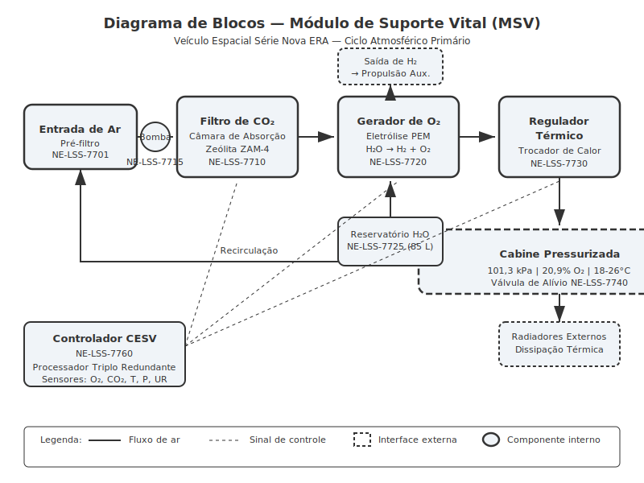
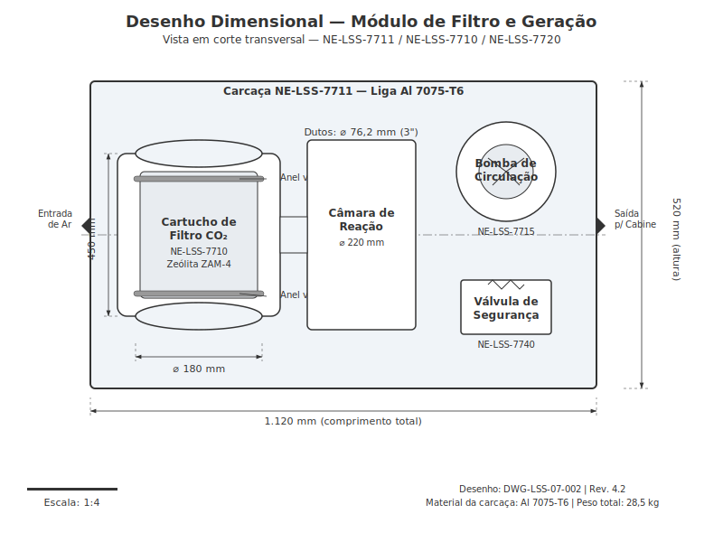
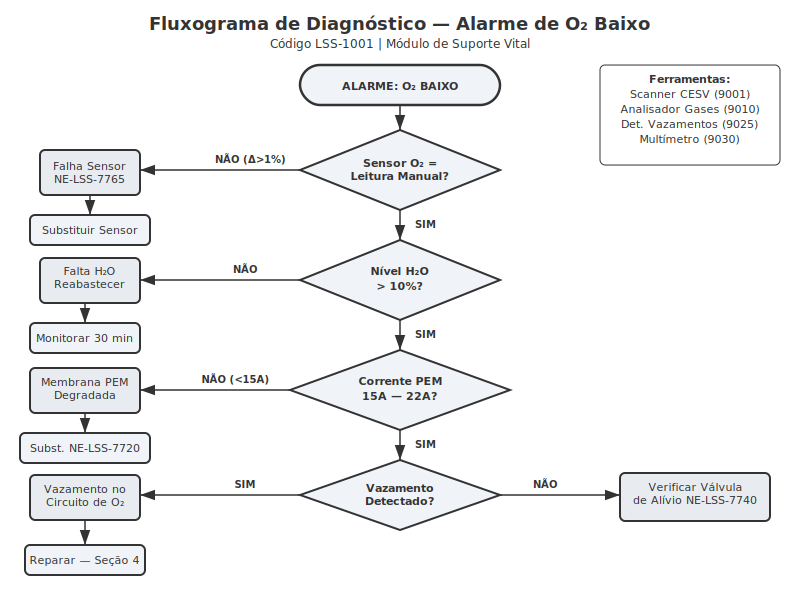
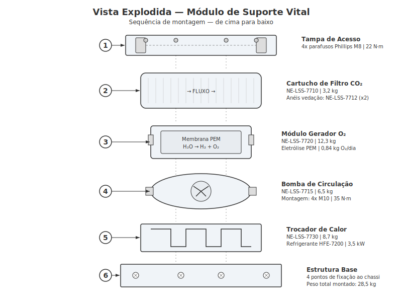
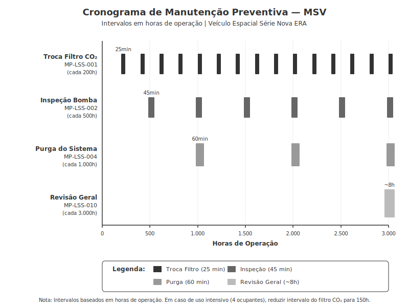

# Módulo de Suporte Vital

**Veículo Espacial Série Databricks Galáctica — Manual de Reparo Técnico**
**Documento:** MR-LSS-07 | **Revisão:** 4.2 | **Data:** 2189-03-15
**Classificação:** Manutenção Nível II — Técnico Certificado em Sistemas de Vida

> **AVISO CRÍTICO DE SEGURANÇA:** O Módulo de Suporte Vital (MSV) é um sistema classificado como Categoria A — Crítico para a Vida. Qualquer procedimento de manutenção ou reparo deve ser executado com o veículo em modo de ancoragem estável, com suprimento de O₂ de emergência conectado e com pelo menos dois técnicos presentes. A desativação do MSV sem backup ativo é **estritamente proibida** e constitui infração ao Código Espacial de Segurança, Artigo 47-B.

---

## 1. Visão Geral e Princípios de Funcionamento

O Módulo de Suporte Vital do Veículo Espacial Série Databricks Galáctica é responsável por manter condições atmosféricas habitáveis dentro da cabine pressurizada durante operações em vácuo espacial, atmosferas hostis e trânsito interplanetário. O sistema opera em ciclo fechado com capacidade de regeneração parcial, processando continuamente o ar da cabine através de quatro subsistemas integrados: filtragem de CO₂, geração de O₂, regulação térmica e controle de pressão.

### 1.1 Ciclo Atmosférico Primário

O ar da cabine é captado por duas entradas de admissão localizadas na seção traseira do compartimento de passageiros (posições P7-E e P7-D, conforme diagrama estrutural do chassi). Cada entrada é equipada com um pré-filtro de partículas de malha metálica sinterizada (peça **NE-LSS-7701**) que retém detritos sólidos com diâmetro superior a 15 micrômetros antes que o ar entre no circuito principal.

O fluxo de ar pré-filtrado é direcionado pela Bomba de Circulação Primária (peça **NE-LSS-7715**) através do seguinte percurso:

1. **Câmara de Absorção de CO₂** — Utiliza cartuchos de zeólita modificada com amina (tecnologia ZAM-4) que adsorvem seletivamente moléculas de dióxido de carbono do fluxo de ar. Cada cartucho possui capacidade de absorção de 2,4 kg de CO₂ antes de requerer regeneração ou substituição. O sistema opera com dois cartuchos em paralelo: enquanto um está em modo de absorção ativa, o outro passa por ciclo de regeneração térmica a 180°C, liberando o CO₂ acumulado para o reservatório de descarte ou para o subsistema de eletrólise.

2. **Gerador Eletrolítico de O₂** — O módulo gerador (peça **NE-LSS-7720**) utiliza eletrólise de membrana de polímero sólido (PEM) para dissociar moléculas de H₂O em hidrogênio e oxigênio. A água de alimentação é fornecida pelo Reservatório de Água Técnica (capacidade 85 litros, peça **NE-LSS-7725**). O oxigênio produzido é injetado no fluxo de ar pós-filtragem de CO₂, enquanto o hidrogênio é canalizado para o sistema de propulsão auxiliar como combustível suplementar ou ventilado em emergências.

3. **Regulador Térmico** — Um trocador de calor de placas paralelas (peça **NE-LSS-7730**) em conjunto com uma bomba de circulação de refrigerante (peça **NE-LSS-7735**) mantém a temperatura do ar em faixa operacional entre 18°C e 26°C. O circuito de refrigerante utiliza fluido HFE-7200 em circuito fechado, com radiadores externos montados na carenagem inferior do veículo para dissipação térmica no espaço.

4. **Câmara de Equalização e Pressurização** — O ar processado é reinjetado na cabine pressurizada através de difusores de fluxo laminar, mantendo pressão interna nominal de 101,3 kPa (±2,5 kPa). Uma válvula de alívio de segurança (peça **NE-LSS-7740**) atua automaticamente caso a pressão interna exceda 106 kPa.

### 1.2 Subsistema de Controle e Monitoramento

O MSV é gerenciado pelo Controlador Eletrônico de Suporte Vital (CESV), unidade dedicada baseada em processador triplo redundante com votação majoritária. O CESV monitora continuamente:

- Concentração de O₂ (faixa normal: 20,5% — 21,5%)
- Concentração de CO₂ (limite máximo: 0,5% / 5.000 ppm)
- Temperatura da cabine (faixa: 18°C — 26°C)
- Umidade relativa (faixa: 40% — 60%)
- Pressão interna da cabine (faixa: 98,8 kPa — 103,8 kPa)
- Fluxo de ar nos dutos (mínimo: 0,12 m³/s por ocupante)

| Parâmetro | Faixa Normal | Alerta Nível 1 | Alerta Nível 2 (Crítico) | Ação Automática |
|---|---|---|---|---|
| O₂ (%) | 20,5 — 21,5 | 19,5 — 20,5 ou 21,5 — 22,5 | < 19,5 ou > 22,5 | Liberação de O₂ de reserva |
| CO₂ (ppm) | 0 — 2.500 | 2.500 — 4.000 | > 5.000 | Troca forçada de cartucho |
| Temperatura (°C) | 18 — 26 | 15 — 18 ou 26 — 30 | < 15 ou > 30 | Aquecimento/resfriamento emergencial |
| Pressão (kPa) | 98,8 — 103,8 | 95 — 98,8 ou 103,8 — 106 | < 95 ou > 106 | Vedação emergencial / alívio |
| Umidade (%) | 40 — 60 | 30 — 40 ou 60 — 70 | < 30 ou > 70 | Umidificador/desumidificador |

### 1.3 Protocolos de Emergência Integrados

O MSV possui três modos de emergência ativados automaticamente pelo CESV ou manualmente pelo piloto:

- **Modo Emergência Alpha (Despressurização):** Ativado quando a pressão cai abaixo de 90 kPa em taxa superior a 2 kPa/min. O sistema sela todas as aberturas via atuadores pirotécnicos, ativa o suprimento de O₂ de emergência (cilindro de 12 litros a 200 bar, peça **NE-LSS-7750**) e envia sinal de socorro automático.

- **Modo Emergência Beta (Contaminação Atmosférica):** Ativado quando sensores químicos detectam compostos tóxicos acima dos limites estabelecidos. O sistema isola o circuito de ar e recircula exclusivamente através dos filtros HEPA/carvão ativado de emergência (peça **NE-LSS-7755**).

- **Modo Emergência Gamma (Falha Térmica):** Ativado quando a temperatura interna excede 35°C ou cai abaixo de 10°C. O sistema redireciona todo o fluxo de refrigerante para o modo de máxima capacidade e ativa coberturas térmicas refletivas nos visores.

---

## 2. Especificações Técnicas

Esta seção detalha todas as especificações técnicas dos componentes do Módulo de Suporte Vital, incluindo dimensões, capacidades, materiais e números de peça para referência em pedidos de reposição.

### 2.1 Componentes Principais e Números de Peça

| Componente | Número de Peça | Material | Peso (kg) | Vida Útil (horas) | Preço Ref. (CR) |
|---|---|---|---|---|---|
| Pré-filtro de Partículas | NE-LSS-7701 | Aço sinterizado 316L | 0,45 | 1.000 | 85 |
| Cartucho de CO₂ (ZAM-4) | NE-LSS-7710 | Zeólita/amina composta | 3,20 | 200 | 420 |
| Carcaça do Filtro de CO₂ | NE-LSS-7711 | Liga de alumínio 7075-T6 | 4,80 | 15.000 | 1.250 |
| Anel de vedação do cartucho | NE-LSS-7712 | Viton fluoroelastômero | 0,08 | 400 | 35 |
| Bomba de Circulação Primária | NE-LSS-7715 | Aço inox / cerâmica | 6,50 | 5.000 | 3.800 |
| Gerador Eletrolítico O₂ | NE-LSS-7720 | Titânio / membrana PEM | 12,30 | 8.000 | 12.500 |
| Reservatório de Água Técnica | NE-LSS-7725 | HDPE aeroespacial | 2,10 | 20.000 | 680 |
| Trocador de Calor | NE-LSS-7730 | Liga de alumínio brasada | 8,70 | 10.000 | 5.200 |
| Bomba de Refrigerante | NE-LSS-7735 | Aço inox 304 / cerâmica | 4,20 | 5.000 | 2.900 |
| Válvula de Alívio | NE-LSS-7740 | Latão aeroespacial | 1,10 | 10.000 | 890 |
| Cilindro O₂ Emergência | NE-LSS-7750 | Fibra de carbono/Kevlar | 8,50 | N/A (recarga) | 2.100 |
| Filtro HEPA Emergência | NE-LSS-7755 | Fibra de vidro ULPA | 1,80 | 100 (uso) | 320 |
| Controlador CESV | NE-LSS-7760 | PCB multicamada / Al | 2,40 | 25.000 | 18.700 |
| Sensor de O₂ (zircônia) | NE-LSS-7765 | Óxido de zircônio | 0,15 | 3.000 | 540 |
| Sensor de CO₂ (NDIR) | NE-LSS-7766 | Óptico infravermelho | 0,22 | 5.000 | 780 |
| Sensor de temperatura | NE-LSS-7767 | Pt100 classe A | 0,05 | 15.000 | 120 |
| Sensor de pressão | NE-LSS-7768 | Piezoelétrico | 0,12 | 10.000 | 350 |

### 2.2 Especificações de Desempenho

| Parâmetro | Especificação | Tolerância |
|---|---|---|
| Capacidade de processamento de ar | 0,85 m³/min | ±0,05 m³/min |
| Taxa de remoção de CO₂ | 98,7% por passagem | ±0,5% |
| Taxa de geração de O₂ | 0,84 kg/dia (por ocupante) | ±0,04 kg/dia |
| Consumo de água (eletrólise) | 1,05 litros/dia (por ocupante) | ±0,05 L/dia |
| Capacidade térmica (resfriamento) | 3,5 kW | ±0,2 kW |
| Capacidade térmica (aquecimento) | 2,8 kW | ±0,2 kW |
| Fluxo de refrigerante | 4,2 L/min | ±0,3 L/min |
| Temperatura do refrigerante (saída) | 5°C — 15°C | ±1°C |
| Consumo elétrico (operação normal) | 1.850 W | ±100 W |
| Consumo elétrico (modo emergência) | 2.400 W | ±150 W |
| Nível de ruído | ≤ 42 dB(A) a 1 m | — |
| Número máximo de ocupantes | 4 pessoas | — |

### 2.3 Dimensões do Módulo

| Dimensão | Valor |
|---|---|
| Comprimento total do módulo | 1.120 mm |
| Largura total | 680 mm |
| Altura total | 520 mm |
| Diâmetro do cartucho de CO₂ | 180 mm |
| Comprimento do cartucho de CO₂ | 450 mm |
| Diâmetro da câmara de reação | 220 mm |
| Diâmetro dos dutos principais | 76,2 mm (3") |
| Diâmetro dos dutos secundários | 50,8 mm (2") |
| Volume interno da câmara de equalização | 45 litros |

### 2.4 Torques de Aperto

> **IMPORTANTE:** Todos os torques devem ser aplicados com torquímetro calibrado (certificação válida < 6 meses). Utilizar sequência de aperto cruzado quando especificado.

| Fixação | Torque (N·m) | Sequência | Lubrificante |
|---|---|---|---|
| Parafusos da tampa de acesso (M8) | 22 ±2 | Cruzado, 3 estágios | Anti-seize cobre NE-LUB-003 |
| Porcas de retenção do cartucho CO₂ | 15 ±1 | Sequencial horário | Nenhum (seco) |
| Flanges de duto (M6, 8 parafusos) | 12 ±1 | Estrela, 2 estágios | Anti-seize prata NE-LUB-005 |
| Montagem da bomba (M10) | 35 ±3 | Cruzado, 2 estágios | Anti-seize cobre NE-LUB-003 |
| Conexões de refrigerante (AN-6) | 18 ±2 | N/A | Graxa de silicone NE-LUB-010 |
| Suporte do trocador de calor (M8) | 25 ±2 | Cruzado, 2 estágios | Anti-seize cobre NE-LUB-003 |
| Parafusos do CESV (M4) | 3 ±0,5 | Sequencial | Nenhum (seco) |
| Braçadeiras dos sensores | 5 ±0,5 | N/A | Nenhum (seco) |

### 2.5 Fluidos e Consumíveis

| Item | Especificação | Capacidade | Intervalo de Troca |
|---|---|---|---|
| Refrigerante HFE-7200 | NE-FLD-7730 (grau aeroespacial) | 3,8 litros | 5.000 horas |
| Água técnica (eletrólise) | Deionizada, resistividade > 10 MΩ·cm | 85 litros (reservatório) | Reabastecimento contínuo |
| Graxa de vedação (anéis O-ring) | NE-LUB-010 (silicone, -60°C a +200°C) | Conforme necessário | A cada desmontagem |
| Pasta anti-seize cobre | NE-LUB-003 | Conforme necessário | A cada desmontagem |
| Pasta anti-seize prata | NE-LUB-005 | Conforme necessário | A cada desmontagem |

---

## 3. Procedimento de Diagnóstico

Esta seção descreve os procedimentos de diagnóstico para as falhas mais comuns do Módulo de Suporte Vital. Todos os diagnósticos devem ser realizados com o sistema energizado e em modo de operação normal, salvo indicação contrária.

### 3.1 Ferramentas Necessárias para Diagnóstico

| Ferramenta | Número de Peça | Descrição |
|---|---|---|
| Scanner CESV | NE-TOOL-9001 | Interface de diagnóstico para o controlador CESV |
| Analisador de gases portátil | NE-TOOL-9010 | Medição independente de O₂, CO₂, CO, VOC |
| Manômetro diferencial | NE-TOOL-9015 | Faixa 0-200 kPa, resolução 0,1 kPa |
| Termômetro infravermelho | NE-TOOL-9020 | Faixa -50°C a +300°C |
| Detector de vazamentos ultrassônico | NE-TOOL-9025 | Frequência 40 kHz |
| Multímetro digital | NE-TOOL-9030 | CAT III, True RMS |
| Medidor de vazão | NE-TOOL-9035 | Faixa 0-2 m³/min |

### 3.2 Códigos de Falha do CESV

O Controlador CESV registra códigos de falha no formato `LSS-XXXX`. Os códigos mais frequentes são listados abaixo:

| Código | Descrição | Severidade | Subsistema |
|---|---|---|---|
| LSS-1001 | Nível de O₂ abaixo do limite inferior | Crítica | Geração de O₂ |
| LSS-1002 | Nível de O₂ acima do limite superior | Alta | Geração de O₂ |
| LSS-1010 | Nível de CO₂ acima de 2.500 ppm | Média | Filtragem de CO₂ |
| LSS-1011 | Nível de CO₂ acima de 5.000 ppm | Crítica | Filtragem de CO₂ |
| LSS-2001 | Temperatura da cabine fora da faixa | Média | Regulação Térmica |
| LSS-2002 | Temperatura do refrigerante elevada | Alta | Regulação Térmica |
| LSS-2003 | Fluxo de refrigerante insuficiente | Alta | Regulação Térmica |
| LSS-3001 | Pressão da cabine abaixo de 98 kPa | Alta | Pressurização |
| LSS-3002 | Taxa de despressurização anormal | Crítica | Pressurização |
| LSS-4001 | Falha na bomba de circulação | Alta | Circulação de Ar |
| LSS-4002 | Fluxo de ar abaixo do mínimo | Alta | Circulação de Ar |
| LSS-5001 | Falha de comunicação sensor O₂ | Média | Sensores |
| LSS-5002 | Falha de comunicação sensor CO₂ | Média | Sensores |
| LSS-5003 | Leitura de sensor fora do intervalo | Alta | Sensores |
| LSS-9001 | Erro interno do CESV | Crítica | Controlador |

### 3.3 Procedimento: Anomalia de Nível de O₂ (LSS-1001 / LSS-1002)

**Sintomas:** Alarme sonoro intermitente ou contínuo, LED de status O₂ vermelho no painel do CESV, possível mal-estar dos ocupantes (dor de cabeça, tontura).

**Passos de diagnóstico:**

1. Conecte o Scanner CESV (NE-TOOL-9001) à porta de diagnóstico J14 localizada no painel inferior do módulo.
2. Leia os códigos de falha ativos e o histórico das últimas 100 horas. Registre os valores.
3. Utilize o Analisador de Gases Portátil (NE-TOOL-9010) para verificação independente do nível de O₂. Compare com a leitura do CESV.
   - Se a discrepância for > 1%: **Falha do sensor** — prossiga para substituição do sensor de O₂ (NE-LSS-7765).
   - Se as leituras coincidirem: prossiga para o passo 4.
4. Verifique o nível de água no Reservatório de Água Técnica (NE-LSS-7725) pelo visor de nível lateral.
   - Se nível < 10%: **Falta de água para eletrólise** — reabasteça e monitore por 30 minutos.
   - Se nível adequado: prossiga para o passo 5.
5. No Scanner CESV, acesse o menu `Diagnóstico > Gerador O₂ > Teste de Corrente`. Execute o teste automático.
   - Corrente da célula PEM deve estar entre 15A e 22A.
   - Se corrente < 15A: **Membrana PEM degradada** — substitua o Gerador Eletrolítico (NE-LSS-7720).
   - Se corrente normal: prossiga para o passo 6.
6. Verifique integridade dos dutos entre o gerador e a câmara de equalização utilizando o Detector de Vazamentos (NE-TOOL-9025).
   - Se vazamento detectado: **Vazamento no circuito de O₂** — localize e repare conforme Seção 4.
   - Se sem vazamento: verifique a válvula de alívio (NE-LSS-7740) para possível travamento na posição aberta.

### 3.4 Procedimento: Alarme de CO₂ Elevado (LSS-1010 / LSS-1011)

**Sintomas:** Alarme sonoro, LED de status CO₂ amarelo (Nível 1) ou vermelho (Nível 2), sonolência e cefaleia nos ocupantes.

1. Conecte o Scanner CESV e leia os dados do subsistema de CO₂.
2. Verifique o horímetro do cartucho de CO₂ ativo. Se horas > 180, o cartucho provavelmente está saturado.
3. Tente forçar a troca de cartucho pelo Scanner CESV: `Controle > CO₂ > Trocar Cartucho Ativo`.
   - Se o nível de CO₂ normalizar em 10 minutos: **Cartucho saturado** — substitua o cartucho vencido (NE-LSS-7710).
   - Se não normalizar: prossiga para o passo 4.
4. Verifique o fluxo de ar com o Medidor de Vazão (NE-TOOL-9035) na entrada da câmara de absorção.
   - Fluxo esperado: > 0,70 m³/min.
   - Se fluxo baixo: **Problema na bomba de circulação** — prossiga para diagnóstico da bomba (Seção 3.6).
5. Inspecione visualmente os anéis de vedação do cartucho (NE-LSS-7712) para sinais de deformação, ressecamento ou danos.
   - Se vedação comprometida: ar pode estar desviando do cartucho — substitua os anéis e o cartucho.

### 3.5 Procedimento: Erro de Sensor Térmico (LSS-2001 / LSS-2002)

**Sintomas:** Temperatura da cabine desconfortável, leituras inconsistentes no painel, ciclos frequentes do compressor.

1. Conecte o Scanner CESV e leia as temperaturas reportadas pelos 4 sensores térmicos instalados (posições T1-T4).
2. Meça a temperatura ambiente real com o Termômetro Infravermelho (NE-TOOL-9020) em cada posição de sensor.
3. Compare as leituras:

| Sensor | Posição | Leitura CESV | Leitura Manual | Diagnóstico |
|---|---|---|---|---|
| T1 | Entrada do módulo | ___ °C | ___ °C | Δ > 3°C = falha |
| T2 | Saída do trocador | ___ °C | ___ °C | Δ > 2°C = falha |
| T3 | Cabine anterior | ___ °C | ___ °C | Δ > 3°C = falha |
| T4 | Cabine posterior | ___ °C | ___ °C | Δ > 3°C = falha |

4. Se um sensor específico apresentar discrepância: substitua o Sensor de Temperatura (NE-LSS-7767) na posição afetada.
5. Se todos os sensores estiverem corretos mas a temperatura estiver fora da faixa: verifique o nível e a condição do refrigerante HFE-7200, o funcionamento da bomba de refrigerante (NE-LSS-7735) e a integridade do trocador de calor (NE-LSS-7730).

### 3.6 Procedimento: Diagnóstico da Bomba de Circulação (LSS-4001)

1. Desconecte o conector elétrico da bomba (conector C7, 4 pinos).
2. Meça a resistência do motor com o Multímetro (NE-TOOL-9030):
   - Fase A-B: 2,8 Ω ±0,3 Ω
   - Fase B-C: 2,8 Ω ±0,3 Ω
   - Fase A-C: 2,8 Ω ±0,3 Ω
   - Qualquer fase para carcaça: > 10 MΩ
3. Se resistência fora da faixa: **Motor danificado** — substitua a bomba completa (NE-LSS-7715).
4. Se resistência normal, reconecte e verifique o sinal de comando do CESV no conector C7 pino 1 (PWM 25 kHz, duty cycle 40-100%).
5. Se sinal ausente: **Falha no driver do CESV** — substitua o módulo CESV (NE-LSS-7760).

---

## 4. Procedimento de Reparo / Substituição

Esta seção contém os procedimentos detalhados para os reparos e substituições mais comuns no Módulo de Suporte Vital. Cada procedimento inclui tempo estimado, nível de qualificação requerido e lista de peças e ferramentas.

> **AVISO DE SEGURANÇA:** Antes de iniciar qualquer procedimento de reparo, certifique-se de que:
> - O suprimento de O₂ de emergência (NE-LSS-7750) está conectado e funcional
> - Pelo menos dois técnicos estão presentes
> - O veículo está em modo de ancoragem estável
> - O sistema de comunicação está operacional
> - EPIs adequados estão disponíveis (luvas isolantes, óculos, protetor respiratório)

### 4.1 Substituição do Cartucho de Filtro de CO₂

**Tempo estimado:** 25 minutos | **Nível:** Técnico I | **Peças:** NE-LSS-7710, NE-LSS-7712 (x2)

**Ferramentas necessárias:**

| Ferramenta | Especificação |
|---|---|
| Chave de fenda Phillips #2 | Comprimento mínimo 200 mm |
| Chave de boca 19 mm | Para porcas de retenção |
| Torquímetro 5-25 N·m | Calibrado |
| Bandeja coletora | Para resíduos de zeólita |
| Luvas de proteção química | Nitrilo, espessura mínima 0,3 mm |

**Procedimento:**

1. No Scanner CESV, execute `Controle > CO₂ > Modo Manutenção`. O sistema transferirá toda a carga para o cartucho secundário. Aguarde a confirmação "CARTUCHO PRIMÁRIO ISOLADO" no display.
2. Remova os 4 parafusos Phillips da tampa de acesso do compartimento de CO₂ (torque de remoção: gire no sentido anti-horário). Guarde os parafusos em local seguro.
3. Posicione a bandeja coletora sob o cartucho a ser removido.
4. Solte as 2 porcas de retenção do cartucho (19 mm) girando no sentido anti-horário. **Atenção:** o cartucho pesa 3,2 kg — apoie com a mão livre durante a remoção.
5. Puxe o cartucho na direção axial (para fora do módulo). Descarte conforme procedimento ambiental RE-002 (material classe B — resíduo químico não perigoso).
6. Inspecione a sede de vedação na carcaça (NE-LSS-7711). Remova qualquer resíduo de zeólita com pano limpo e seco.
7. Remova os anéis de vedação antigos (NE-LSS-7712) das extremidades da sede. Descarte.
8. Instale novos anéis de vedação (NE-LSS-7712). Aplique uma fina camada de graxa de silicone (NE-LUB-010) em cada anel antes da instalação.
9. Insira o cartucho novo (NE-LSS-7710) na carcaça, observando a seta de fluxo impressa no cartucho — deve apontar na direção do fluxo de ar (da entrada para a saída).
10. Instale e aperte as porcas de retenção com torque de **15 ±1 N·m** (sequência horária, sem lubrificante).
11. Reinstale a tampa de acesso com os 4 parafusos Phillips. Torque: **22 ±2 N·m** (sequência cruzada, 3 estágios).
12. No Scanner CESV, execute `Controle > CO₂ > Sair Modo Manutenção`. O sistema executará um autoteste de 5 minutos.
13. Monitore o nível de CO₂ por 15 minutos. O valor deve cair para abaixo de 1.000 ppm dentro de 10 minutos após o retorno à operação normal.
14. Registre a substituição no log de manutenção do CESV: `Manutenção > Registrar > Troca Cartucho CO₂`.

### 4.2 Substituição da Bomba de Circulação Primária

**Tempo estimado:** 90 minutos | **Nível:** Técnico II | **Peças:** NE-LSS-7715, juntas de flange (NE-LSS-7716, x2)

**Ferramentas necessárias:**

| Ferramenta | Especificação |
|---|---|
| Jogo de chaves Allen 3-10 mm | Aço cromo-vanádio |
| Chave de boca 13 mm e 17 mm | Para conexões de duto |
| Torquímetro 10-50 N·m | Calibrado |
| Chave de fenda Phillips #2 | Para conector elétrico |
| Anti-seize cobre NE-LUB-003 | Para parafusos de montagem |
| Fita veda-rosca PTFE | Para conexões auxiliares |

> **AVISO:** A bomba de circulação não pode ser reparada em campo. Qualquer falha requer substituição completa da unidade. A bomba antiga deve ser retornada ao fabricante para recondicionamento.

**Procedimento:**

1. **ATIVE O SUPRIMENTO DE O₂ DE EMERGÊNCIA** (NE-LSS-7750) antes de prosseguir. O sistema ficará sem circulação de ar durante este procedimento.
2. No Scanner CESV, execute `Controle > Sistema > Desligar MSV`. Confirme o desligamento. O alarme de MSV inativo será ativado — isso é esperado.
3. Desconecte o cabo de alimentação da bomba no conector C7 (solte a trava de segurança, puxe reto).
4. Remova os 8 parafusos de flange de entrada do duto (M6, chave Allen 5 mm). Retire a flange e a junta.
5. Remova os 8 parafusos de flange de saída do duto (M6, chave Allen 5 mm). Retire a flange e a junta.
6. Remova os 4 parafusos de montagem da bomba na estrutura (M10, chave Allen 8 mm).
7. Retire a bomba antiga do módulo. **Peso: 6,5 kg** — manuseie com cuidado em microgravidade.
8. Limpe as superfícies de montagem e as faces das flanges com pano limpo.
9. Posicione a bomba nova (NE-LSS-7715) na estrutura, alinhando os furos de montagem.
10. Aplique anti-seize cobre (NE-LUB-003) nas roscas dos parafusos de montagem.
11. Instale os 4 parafusos de montagem (M10). Aperte em sequência cruzada, 2 estágios: primeiro a 20 N·m, depois ao torque final de **35 ±3 N·m**.
12. Instale juntas de flange novas (NE-LSS-7716) nas conexões de entrada e saída.
13. Reconecte as flanges de duto (M6, 8 parafusos cada). Torque: **12 ±1 N·m**, sequência estrela, 2 estágios. Aplique anti-seize prata (NE-LUB-005) nas roscas.
14. Reconecte o conector elétrico C7. Verifique o travamento da trava de segurança.
15. No Scanner CESV, execute `Controle > Sistema > Ligar MSV`. Aguarde a inicialização completa (aproximadamente 2 minutos).
16. Execute o teste automático: `Diagnóstico > Bomba > Teste Completo`. O sistema verificará rotação, fluxo e consumo de corrente.
17. Verifique a ausência de vazamentos nas flanges utilizando o Detector de Vazamentos (NE-TOOL-9025).
18. Monitore a operação por 30 minutos antes de desativar o suprimento de O₂ de emergência.
19. Registre no log: `Manutenção > Registrar > Troca Bomba Circulação`.

### 4.3 Reparo de Serpentina do Trocador de Calor

**Tempo estimado:** 120 minutos | **Nível:** Técnico II | **Peças:** Kit de reparo NE-LSS-7731 (inclui seção de serpentina, conectores e vedações)

> **NOTA:** Este procedimento aplica-se apenas a vazamentos menores na serpentina. Para danos extensos ou corrosão generalizada, substitua o trocador de calor completo (NE-LSS-7730) — consulte o procedimento 4.4 no Suplemento de Manutenção Avançada (doc. MR-LSS-07A).

**Procedimento:**

1. Desligue o MSV conforme passo 4.2, item 2. Ative O₂ de emergência.
2. Drene o refrigerante HFE-7200 do circuito para um recipiente aprovado. Volume esperado: 3,5 — 3,8 litros. **Utilize luvas e óculos — o HFE-7200 pode causar irritação ocular.**
3. Remova o trocador de calor (NE-LSS-7730) do módulo: 4 parafusos de suporte (M8, chave Allen 6 mm) e 2 conexões de refrigerante (AN-6).
4. Localize o ponto de vazamento utilizando pressurização com nitrogênio seco a 150 kPa e solução de detecção de bolhas.
5. Marque a área do vazamento. Se o vazamento estiver em uma junção brasada, o trocador deve ser substituído integralmente.
6. Se o vazamento estiver em uma seção reta da serpentina, corte a seção danificada utilizando o cortador de tubo incluído no kit NE-LSS-7731.
7. Instale a seção de substituição utilizando os conectores de compressão do kit. Aperte conforme especificado no kit (tipicamente 12-15 N·m).
8. Pressurize novamente a 150 kPa com nitrogênio e verifique a ausência de vazamentos por 10 minutos.
9. Reinstale o trocador no módulo. Torque dos suportes: **25 ±2 N·m**. Torque das conexões AN-6: **18 ±2 N·m** com graxa de silicone.
10. Recarregue o circuito com refrigerante HFE-7200 novo (NE-FLD-7730). Volume: 3,8 litros.
11. Purgue o ar do circuito através da válvula de purga localizada no ponto mais alto do circuito.
12. Ligue o MSV e execute o teste térmico: `Diagnóstico > Térmico > Teste Completo`.
13. Monitore temperaturas e fluxo de refrigerante por 60 minutos.

---

## 5. Manutenção Preventiva e Intervalos

A manutenção preventiva adequada do Módulo de Suporte Vital é essencial para garantir a confiabilidade e a segurança do sistema ao longo de toda a vida útil do veículo. Os intervalos especificados nesta seção são baseados em horas de operação e devem ser seguidos rigorosamente.

### 5.1 Cronograma de Manutenção por Intervalo

| Intervalo (horas) | Atividade | Código do Procedimento | Peças Necessárias | Tempo Est. |
|---|---|---|---|---|
| 200 | Substituição do cartucho de CO₂ | MP-LSS-001 | NE-LSS-7710, NE-LSS-7712 (x2) | 25 min |
| 500 | Inspeção da bomba de circulação | MP-LSS-002 | Nenhuma (inspeção) | 45 min |
| 500 | Verificação dos sensores | MP-LSS-003 | Nenhuma (calibração) | 30 min |
| 1.000 | Purga do sistema de refrigerante | MP-LSS-004 | NE-FLD-7730 (3,8 L) | 60 min |
| 1.000 | Substituição do pré-filtro | MP-LSS-005 | NE-LSS-7701 | 15 min |
| 1.000 | Teste de pressão dos dutos | MP-LSS-006 | Nenhuma (teste) | 45 min |
| 3.000 | Revisão geral do MSV | MP-LSS-010 | Kit de revisão NE-LSS-7700K | 8 horas |
| 3.000 | Substituição do sensor de O₂ | MP-LSS-011 | NE-LSS-7765 | 20 min |
| 5.000 | Substituição da bomba de circulação | MP-LSS-012 | NE-LSS-7715, NE-LSS-7716 (x2) | 90 min |
| 5.000 | Substituição da bomba de refrigerante | MP-LSS-013 | NE-LSS-7735 | 75 min |
| 5.000 | Troca do refrigerante (completa) | MP-LSS-014 | NE-FLD-7730 (3,8 L) | 60 min |
| 5.000 | Substituição do sensor de CO₂ | MP-LSS-015 | NE-LSS-7766 | 20 min |
| 8.000 | Substituição do gerador de O₂ | MP-LSS-016 | NE-LSS-7720 | 120 min |
| 10.000 | Substituição do trocador de calor | MP-LSS-017 | NE-LSS-7730 | 180 min |

### 5.2 Procedimento MP-LSS-001: Substituição Periódica do Cartucho de CO₂

Este é o procedimento de manutenção mais frequente e deve ser realizado a cada 200 horas de operação, independentemente da condição aparente do cartucho. O procedimento completo está detalhado na Seção 4.1.

**Critérios de substituição antecipada:**
- Nível de CO₂ sustentado acima de 2.000 ppm com cartucho ativo
- Alarme LSS-1010 registrado mais de 3 vezes em 24 horas
- Coloração visual do indicador do cartucho na zona vermelha (visível pelo visor de inspeção)
- Operação com 4 ocupantes por período prolongado (> 12 horas contínuas) — reduzir intervalo para 150 horas

**Registro de manutenção:**

| Campo | Valor |
|---|---|
| Data/Hora (UTC) | _____________ |
| Horímetro do sistema | _______ h |
| Horímetro do cartucho removido | _______ h |
| Nº de série do cartucho removido | _____________ |
| Nº de série do cartucho instalado | _____________ |
| Nível de CO₂ pré-troca | _______ ppm |
| Nível de CO₂ pós-troca (15 min) | _______ ppm |
| Técnico responsável | _____________ |
| Técnico testemunha | _____________ |

### 5.3 Procedimento MP-LSS-002: Inspeção da Bomba de Circulação (500 horas)

A inspeção da bomba de circulação é um procedimento não invasivo que visa identificar sinais precoces de desgaste antes que ocorra falha completa.

**Lista de verificação:**

1. Com o sistema em operação normal, meça o nível de ruído da bomba com decibelímetro a 50 cm de distância.
   - Aceitável: ≤ 48 dB(A)
   - Atenção: 48-55 dB(A) — agendar substituição para a próxima parada
   - Crítico: > 55 dB(A) — substituir imediatamente
2. Verifique a corrente de operação da bomba no Scanner CESV: `Diagnóstico > Bomba > Corrente Atual`.
   - Normal: 3,2 — 4,8 A
   - Elevada (> 5,5 A): rolamento em desgaste — programar substituição
3. Verifique a presença de vibração excessiva tocando a carcaça da bomba.
   - Vibração perceptível ao toque indica desbalanceamento do rotor.
4. Inspecione visualmente as conexões elétricas (conector C7) para sinais de aquecimento, descoloração ou corrosão.
5. Verifique o fluxo de ar na saída da bomba com o Medidor de Vazão (NE-TOOL-9035).
   - Normal: ≥ 0,80 m³/min
   - Abaixo de 0,70 m³/min com corrente normal: possível obstrução no circuito — inspecionar dutos e filtros.

| Parâmetro | Valor Medido | Limite Aceitável | Status |
|---|---|---|---|
| Ruído (dB(A) a 50 cm) | _______ | ≤ 48 | OK / ATENÇÃO / CRÍTICO |
| Corrente (A) | _______ | 3,2 — 4,8 | OK / ELEVADA |
| Vibração | _______ | Imperceptível | OK / ANORMAL |
| Conector C7 | _______ | Sem danos | OK / DANIFICADO |
| Fluxo de ar (m³/min) | _______ | ≥ 0,80 | OK / BAIXO |

### 5.4 Procedimento MP-LSS-004: Purga do Sistema de Refrigerante (1.000 horas)

A purga do sistema de refrigerante remove bolhas de ar, produtos de degradação e contaminantes acumulados no circuito térmico.

1. Conecte uma mangueira de drenagem à válvula de purga inferior do circuito de refrigerante (localizada na base do trocador de calor, identificada pela etiqueta amarela).
2. Conecte a outra extremidade da mangueira a um recipiente de coleta aprovado (capacidade mínima 5 litros).
3. Abra a válvula de purga lentamente (1/4 de volta por vez) e drene completamente o refrigerante.
4. Após drenagem completa, feche a válvula de purga.
5. Instale o adaptador de pressurização (incluído no kit de manutenção NE-TOOL-9050) na porta de serviço superior.
6. Pressurize o circuito vazio com nitrogênio seco a 100 kPa por 5 minutos para expulsar resíduos.
7. Despressurize e repita a etapa 6 mais uma vez.
8. Recarregue o circuito com refrigerante novo NE-FLD-7730. Volume: 3,8 litros. Utilize funil com filtro de 25 micrômetros.
9. Abra a válvula de purga de ar (ponto alto do circuito) até que refrigerante sem bolhas flua pela válvula. Feche a válvula.
10. Ligue a bomba de refrigerante e circule por 10 minutos.
11. Verifique novamente a válvula de purga de ar. Se houver bolhas, repita a purga de ar (passo 9).
12. Verifique o nível de refrigerante no visor e complete se necessário.
13. Execute o teste térmico: `Diagnóstico > Térmico > Teste Completo`. Todas as temperaturas devem estabilizar em ±2°C dos valores nominais dentro de 15 minutos.

### 5.5 Procedimento MP-LSS-010: Revisão Geral do MSV (3.000 horas)

A revisão geral é o procedimento mais abrangente e requer a desmontagem parcial do módulo. Deve ser realizada em instalação certificada ou com o veículo em doca de manutenção equipada.

**Kit de revisão NE-LSS-7700K inclui:**
- 2x Cartuchos de CO₂ (NE-LSS-7710)
- 4x Anéis de vedação de cartucho (NE-LSS-7712)
- 2x Pré-filtros (NE-LSS-7701)
- 1x Sensor de O₂ (NE-LSS-7765)
- 1x Kit completo de juntas e vedações
- 1x Refrigerante HFE-7200 (NE-FLD-7730, 4 litros)
- 1x Filtro HEPA de emergência (NE-LSS-7755)
- Consumíveis (anti-seize, graxa, fita PTFE)

**Sequência de atividades da revisão geral:**

| Etapa | Atividade | Referência | Tempo |
|---|---|---|---|
| 1 | Backup dos dados do CESV | — | 15 min |
| 2 | Desligamento completo do MSV | Seção 4.2, passo 2 | 5 min |
| 3 | Drenagem do refrigerante | Seção 5.4, passos 1-4 | 20 min |
| 4 | Remoção e inspeção da bomba de circulação | Seção 4.2, passos 3-7 | 30 min |
| 5 | Remoção e inspeção do trocador de calor | Seção 4.3, passos 2-4 | 30 min |
| 6 | Substituição de ambos os cartuchos de CO₂ | Seção 4.1 (x2) | 50 min |
| 7 | Substituição do pré-filtro | MP-LSS-005 | 15 min |
| 8 | Substituição do sensor de O₂ | MP-LSS-011 | 20 min |
| 9 | Inspeção e teste do gerador de O₂ | Seção 3.3, passo 5 | 30 min |
| 10 | Substituição de todas as juntas e vedações | — | 45 min |
| 11 | Substituição do filtro HEPA de emergência | — | 10 min |
| 12 | Remontagem do módulo completo | — | 60 min |
| 13 | Recarregamento do refrigerante | Seção 5.4, passos 8-12 | 30 min |
| 14 | Teste completo de todos os subsistemas | — | 60 min |
| 15 | Atualização do firmware do CESV (se disponível) | — | 15 min |
| 16 | Registro e certificação | — | 30 min |
| **Total** | | | **~8 horas** |

### 5.6 Tabela de Referência Rápida: Consumíveis e Intervalos

| Consumível | Nº de Peça | Intervalo | Qtd. por Troca | Custo (CR) |
|---|---|---|---|---|
| Cartucho de CO₂ | NE-LSS-7710 | 200 h | 1 | 420 |
| Anel de vedação cartucho | NE-LSS-7712 | 200 h | 2 | 70 |
| Pré-filtro de partículas | NE-LSS-7701 | 1.000 h | 1 | 85 |
| Refrigerante HFE-7200 | NE-FLD-7730 | 1.000 h (purga) / 5.000 h (troca) | 3,8 L | 290 |
| Sensor de O₂ | NE-LSS-7765 | 3.000 h | 1 | 540 |
| Sensor de CO₂ | NE-LSS-7766 | 5.000 h | 1 | 780 |
| Filtro HEPA emergência | NE-LSS-7755 | 3.000 h (ou após uso) | 1 | 320 |
| Kit de revisão geral | NE-LSS-7700K | 3.000 h | 1 | 2.850 |

### 5.7 Registro de Manutenção Preventiva

Mantenha este registro atualizado e disponível para inspeção pelas autoridades de segurança espacial.

| Data | Horímetro | Procedimento | Peças Utilizadas | Técnico | Observações |
|---|---|---|---|---|---|
| ______ | _______ h | MP-LSS-___ | _____________ | _______ | _____________ |
| ______ | _______ h | MP-LSS-___ | _____________ | _______ | _____________ |
| ______ | _______ h | MP-LSS-___ | _____________ | _______ | _____________ |
| ______ | _______ h | MP-LSS-___ | _____________ | _______ | _____________ |
| ______ | _______ h | MP-LSS-___ | _____________ | _______ | _____________ |

> **LEMBRETE FINAL:** O não cumprimento dos intervalos de manutenção preventiva invalida a garantia do fabricante e pode resultar em perda da certificação de navegabilidade do veículo. Em caso de dúvida, consulte a Central de Suporte Técnico Databricks Galáctica: frequência de comunicação 147,3 MHz ou canal digital NESAT-7.

---

**Fim do Documento MR-LSS-07 — Módulo de Suporte Vital**
**Próximo capítulo:** [08 — Sistema de Navegação Estelar](08_navegacao_estelar.md)
