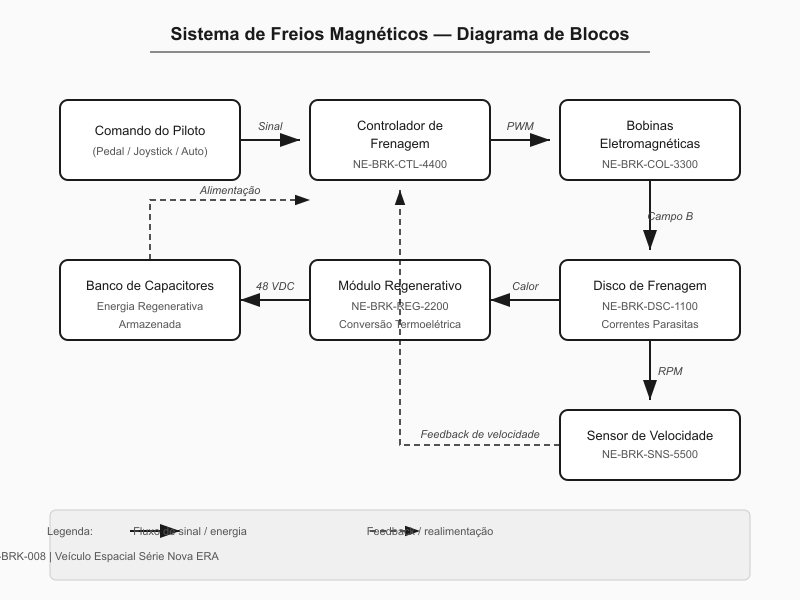
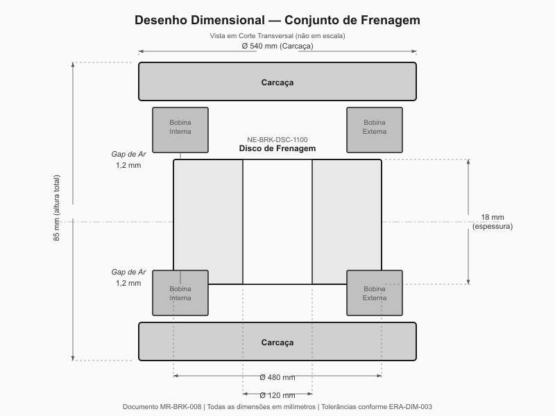
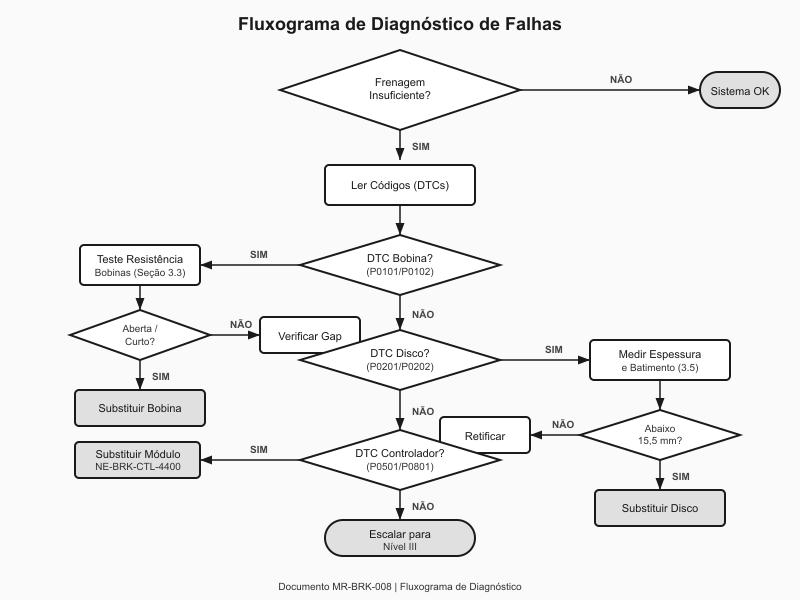
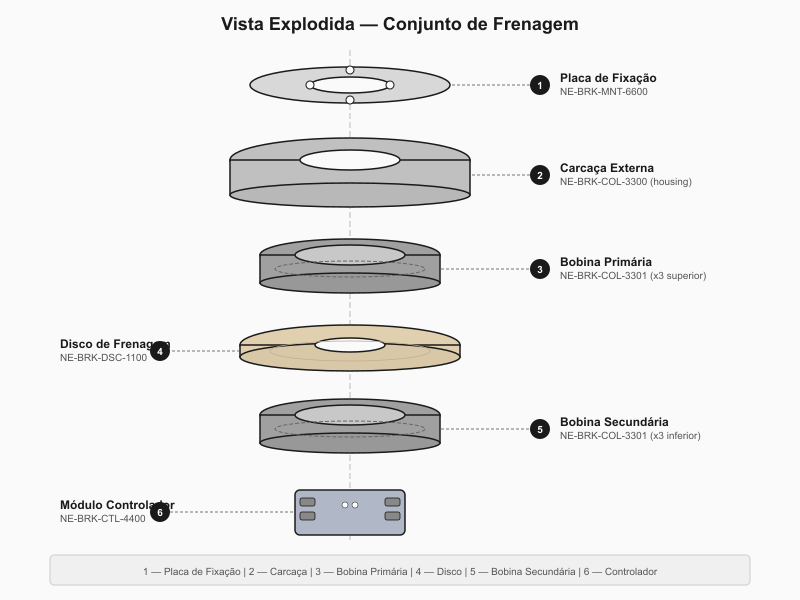
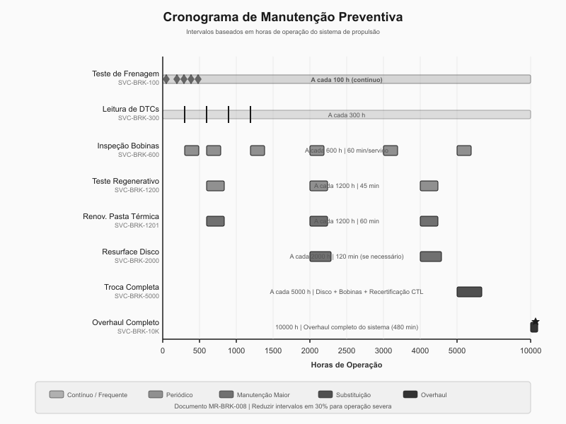

# Sistema de Freios Magnéticos

**Veículo Espacial Série Databricks Galáctica — Manual Técnico de Reparo**
**Documento:** MR-BRK-008 | **Revisão:** 4.2 | **Data:** 2187-03-15
**Classificação:** Manutenção Nível II — Técnicos Certificados ERA-MF

---

> **AVISO DE SEGURANÇA GERAL:** O sistema de freios magnéticos opera com correntes superiores a 200 A e campos eletromagnéticos de alta intensidade. Antes de qualquer procedimento de manutenção, desative o circuito principal de potência no painel de controle (disjuntor CB-MAG-01), aguarde no mínimo 120 segundos para descarga dos capacitores de armazenamento e confirme tensão zero no barramento de frenagem utilizando multímetro certificado ERA classe III. O não cumprimento deste protocolo pode resultar em lesões graves, danos ao veículo ou perda catastrófica do sistema de frenagem em operação.

---

## 1. Visão Geral e Princípios de Funcionamento

O sistema de freios magnéticos do Veículo Espacial Série Databricks Galáctica representa a evolução mais recente da tecnologia de desaceleração eletromagnética para operações orbitais e suborbitais. Diferentemente dos sistemas de frenagem convencionais que dependem de atrito mecânico entre superfícies sólidas, o sistema NE-BRK utiliza arranjos de bobinas eletromagnéticas para gerar campos magnéticos variáveis que induzem correntes parasitas (correntes de Foucault) em discos condutores de alta permeabilidade, convertendo energia cinética em energia térmica e, subsequentemente, capturando parte dessa energia por meio do subsistema de regeneração.

### 1.1 Teoria da Frenagem Eletromagnética

O princípio fundamental baseia-se na Lei de Lenz: quando um disco condutor se move através de um campo magnético variável, correntes elétricas são induzidas no disco em uma direção que se opõe à variação do fluxo magnético. Essas correntes parasitas geram seu próprio campo magnético, criando uma força de arrasto que desacelera o disco. A intensidade da força de frenagem é diretamente proporcional à velocidade de rotação do disco, à intensidade do campo magnético aplicado e à condutividade elétrica do material do disco.

No sistema Databricks Galáctica, a geração de correntes parasitas é otimizada por meio de um arranjo de bobinas em configuração hexapolar, onde seis bobinas são distribuídas simetricamente ao redor do disco de frenagem. Cada bobina pode ser energizada independentemente, permitindo controle granular da força de frenagem e distribuição uniforme do calor gerado. O controlador digital de frenagem (módulo NE-BRK-CTL-4400) gerencia a corrente em cada bobina individualmente, ajustando a intensidade do campo magnético em ciclos de 10 milissegundos para manter a curva de desaceleração programada.

### 1.2 Curvas de Desaceleração

O sistema opera em três modos distintos de desaceleração, selecionáveis pelo piloto ou automaticamente pelo computador de bordo:

| Modo de Frenagem | Código | Desaceleração Máx. | Corrente de Pico | Aplicação Típica |
|---|---|---|---|---|
| Suave (Cruise) | BRK-M1 | 0,5 G | 85 A | Ajustes orbitais, aproximação de estação |
| Normal (Standard) | BRK-M2 | 2,0 G | 160 A | Frenagem de rotina, manobras de atracação |
| Emergência (Emergency) | BRK-M3 | 4,5 G | 240 A | Parada de emergência, evasão de colisão |
| Pulso Reverso | BRK-M4 | 6,0 G (pulsado) | 280 A (pico) | Apenas contramanobra automática |

### 1.3 Captura de Energia Regenerativa

Uma das características mais avançadas do sistema NE-BRK é o subsistema de captura regenerativa. Durante a frenagem, as correntes parasitas induzidas no disco geram calor. Sensores termoelétricos de alta eficiência (módulo NE-BRK-REG-2200) posicionados na periferia do disco convertem parte dessa energia térmica em energia elétrica, que é direcionada de volta ao banco de capacitores de potência do veículo. A eficiência de recuperação varia conforme o modo de frenagem:

| Parâmetro | BRK-M1 | BRK-M2 | BRK-M3 | BRK-M4 |
|---|---|---|---|---|
| Energia dissipada por ciclo | 12 kJ | 48 kJ | 108 kJ | 145 kJ |
| Eficiência de recuperação | 38% | 31% | 22% | 15% |
| Energia recuperada por ciclo | 4,6 kJ | 14,9 kJ | 23,8 kJ | 21,8 kJ |
| Temperatura máxima do disco | 280 °C | 520 °C | 810 °C | 950 °C |

O diagrama a seguir ilustra o fluxo funcional completo do sistema, desde o comando do piloto até a recuperação de energia:

### 1.4 Componentes Principais do Sistema

O sistema de freios magnéticos é composto pelos seguintes conjuntos principais:

- **Disco de Frenagem (NE-BRK-DSC-1100):** Disco de liga de cobre-berílio com 480 mm de diâmetro e 18 mm de espessura, tratado termicamente para resistência a ciclos térmicos repetidos. Cada eixo de propulsão possui dois discos.
- **Arranjo de Bobinas Hexapolar (NE-BRK-COL-3300):** Seis bobinas eletromagnéticas de fio de cobre esmaltado classe H, montadas em carcaça de alumínio aeroespacial com dissipação térmica ativa.
- **Controlador Digital de Frenagem (NE-BRK-CTL-4400):** Módulo eletrônico com processador dual-core redundante, responsável pelo controle de corrente, diagnóstico e comunicação com o computador de bordo.
- **Módulo de Recuperação Regenerativa (NE-BRK-REG-2200):** Conjunto de elementos termoelétricos Peltier de alta eficiência com circuito conversor DC-DC integrado.
- **Sensores de Posição e Velocidade (NE-BRK-SNS-5500):** Encoders ópticos de alta resolução (4096 pulsos/revolução) para medição precisa da velocidade de rotação do disco.

> **NOTA TÉCNICA:** O sistema de freios magnéticos é classificado como sistema crítico de segurança de voo (Classe A, conforme norma ERA-SAF-001). Qualquer manutenção, reparo ou substituição de componentes deve ser registrada no log de manutenção do veículo e verificada por inspetor certificado antes da liberação para voo.

---

## 2. Especificações Técnicas

Esta seção detalha todas as especificações dimensionais, elétricas e de desempenho dos componentes do sistema de freios magnéticos. Todas as tolerâncias seguem a norma ERA-DIM-003 Classe Precisão, salvo indicação contrária.

### 2.1 Disco de Frenagem — NE-BRK-DSC-1100

O disco de frenagem é o componente passivo central do sistema. Fabricado em liga Cu-Be (97,5% Cu / 2,5% Be) por processo de forjamento a quente seguido de usinagem CNC de precisão, o disco é projetado para suportar mais de 50.000 ciclos de frenagem em modo normal antes de atingir o limite de desgaste.

| Especificação | Valor | Tolerância |
|---|---|---|
| Diâmetro externo | 480 mm | +0,00 / -0,05 mm |
| Diâmetro interno (furo central) | 120 mm | +0,02 / -0,00 mm |
| Espessura nominal | 18 mm | +/- 0,03 mm |
| Espessura mínima (limite de desgaste) | 15,5 mm | — |
| Batimento axial máximo | — | 0,015 mm |
| Rugosidade superficial (Ra) | 0,8 μm | máximo |
| Dureza superficial | 280 HV | +/- 15 HV |
| Massa | 8,74 kg | +/- 0,05 kg |
| Número de série do fabricante | Gravado na borda interna | — |
| Temperatura máxima de operação contínua | 600 °C | — |
| Temperatura máxima de pico (10 s) | 950 °C | — |

### 2.2 Arranjo de Bobinas — NE-BRK-COL-3300

O arranjo hexapolar consiste em seis bobinas idênticas montadas em uma carcaça circular de alumínio 7075-T6. Cada bobina possui núcleo de ferrita macia de alta permeabilidade para concentração do fluxo magnético.

| Especificação da Bobina Individual | Valor |
|---|---|
| Número de peça (bobina individual) | NE-BRK-COL-3301 |
| Número de espiras | 420 |
| Diâmetro do fio | 1,8 mm (AWG 13 equivalente) |
| Resistência DC (a 20 °C) | 0,82 Ω +/- 5% |
| Indutância | 12,4 mH +/- 8% |
| Corrente nominal contínua | 160 A |
| Corrente máxima (pulsada, < 5 s) | 280 A |
| Classe de isolamento | Classe H (180 °C) |
| Torque de aperto dos terminais | 4,5 Nm |
| Dimensões do núcleo de ferrita | 65 mm x 45 mm x 30 mm |
| Permeabilidade relativa do núcleo | μr = 2500 |

| Especificação do Arranjo Completo | Valor |
|---|---|
| Número de peça (arranjo montado) | NE-BRK-COL-3300 |
| Diâmetro externo da carcaça | 540 mm |
| Altura total | 85 mm |
| Gap de ar (bobina-disco) | 1,2 mm +/- 0,1 mm |
| Massa total (arranjo montado) | 14,6 kg |
| Torque de montagem (parafusos M8 da carcaça) | 25 Nm |
| Quantidade de parafusos de fixação | 12x M8 x 30, Classe 10.9 |

### 2.3 Controlador Digital — NE-BRK-CTL-4400

| Especificação | Valor |
|---|---|
| Número de peça | NE-BRK-CTL-4400 |
| Tensão de alimentação | 48 VDC +/- 10% |
| Consumo em standby | 2,8 W |
| Consumo máximo (modo emergência) | 85 W |
| Frequência de chaveamento PWM | 20 kHz |
| Resolução do controlador de corrente | 12 bits |
| Taxa de atualização do loop de controle | 10 ms |
| Interface de comunicação | CAN-FD 5 Mbit/s |
| Endereço CAN padrão | 0x3A (freio dianteiro) / 0x3B (freio traseiro) |
| Temperatura operacional | -40 °C a +85 °C |
| Proteção ambiental | IP67 |
| Conectores | MIL-DTL-38999 Série III |
| Firmware | v8.2.1 (mínimo compatível: v7.0.0) |
| Torque de montagem | 6,0 Nm (4x M6 x 20) |
| Massa | 1,85 kg |

### 2.4 Módulo de Recuperação Regenerativa — NE-BRK-REG-2200

| Especificação | Valor |
|---|---|
| Número de peça | NE-BRK-REG-2200 |
| Tipo de elemento | Termoelétrico Bi2Te3 de alta temperatura |
| Quantidade de elementos | 24 |
| Potência máxima de saída | 3,8 kW |
| Eficiência de conversão (ΔT = 300 °C) | 12,5% |
| Tensão de saída | 48 VDC (regulada) |
| Temperatura máxima lado quente | 650 °C |
| Pasta térmica recomendada | NE-THR-PASTE-770 (condutividade: 14 W/m·K) |
| Torque de montagem dos elementos | 2,0 Nm |
| Massa total | 3,2 kg |

### 2.5 Sensores de Posição — NE-BRK-SNS-5500

| Especificação | Valor |
|---|---|
| Número de peça | NE-BRK-SNS-5500 |
| Tipo | Encoder óptico incremental |
| Resolução | 4096 pulsos/revolução |
| Velocidade máxima | 12.000 RPM |
| Saída | Diferencial RS-422 |
| Alimentação | 5 VDC +/- 5% |
| Gap de leitura | 0,3 mm +/- 0,05 mm |
| Torque de montagem | 3,0 Nm (2x M4 x 12) |

A ilustração a seguir apresenta o desenho dimensional do conjunto de frenagem com todas as cotas principais:

> **AVISO:** Todas as dimensões críticas marcadas com asterisco (*) na ilustração acima devem ser verificadas com instrumentos calibrados (certificado válido dentro de 12 meses) durante qualquer procedimento de montagem ou inspeção. O não atendimento das tolerâncias especificadas compromete a segurança do sistema e invalida a garantia do fabricante.

---

## 3. Procedimento de Diagnóstico

Esta seção descreve os procedimentos padronizados de diagnóstico para identificação de falhas no sistema de freios magnéticos. Os procedimentos devem ser executados na sequência apresentada, a menos que o código de falha registrado no controlador direcione para um teste específico.

### 3.1 Equipamentos Necessários

Antes de iniciar qualquer procedimento de diagnóstico, certifique-se de ter os seguintes equipamentos disponíveis e calibrados:

| Item | Descrição | Número de Peça (Ferramenta) |
|---|---|---|
| Multímetro digital | Classe III, faixa 0-500 V / 0-300 A | ERA-TOOL-DMM-100 |
| Megôhmetro | Teste de isolamento até 1000 V | ERA-TOOL-MEG-200 |
| Medidor de espessura ultrassônico | Resolução 0,01 mm | ERA-TOOL-UTG-300 |
| Termômetro infravermelho | Faixa -50 °C a 1200 °C | ERA-TOOL-IRT-400 |
| Scanner de diagnóstico CAN | Compatível CAN-FD 5 Mbit/s | ERA-TOOL-CAN-500 |
| Calibrador de gap | Lâminas 0,05 mm a 2,00 mm | ERA-TOOL-GAP-600 |
| Gabarito de batimento | Comparador com base magnética | ERA-TOOL-RUN-700 |

### 3.2 Leitura de Códigos de Falha

1. Conecte o scanner de diagnóstico CAN (ERA-TOOL-CAN-500) ao conector de diagnóstico J14 localizado no painel lateral esquerdo do compartimento de propulsão.
2. Ligue a alimentação auxiliar do veículo (não é necessário energizar o circuito de potência de frenagem).
3. No scanner, selecione **Módulo → Freios Magnéticos → Leitura de DTCs**.
4. Registre todos os códigos de falha ativos e armazenados.
5. Consulte a tabela de códigos abaixo para direcionamento do diagnóstico:

| Código DTC | Descrição | Severidade | Ação Recomendada |
|---|---|---|---|
| BRK-P0101 | Resistência de bobina fora da faixa | Média | Teste de resistência individual (Seção 3.3) |
| BRK-P0102 | Falha de isolamento de bobina | Alta | Teste de isolamento (Seção 3.4) |
| BRK-P0201 | Disco abaixo da espessura mínima | Alta | Medição de espessura (Seção 3.5) |
| BRK-P0202 | Batimento axial excessivo | Média | Verificação de batimento (Seção 3.5) |
| BRK-P0301 | Sensor de velocidade sem sinal | Alta | Teste do sensor (Seção 3.6) |
| BRK-P0302 | Sinal de velocidade intermitente | Média | Verificação de gap e conexões |
| BRK-P0401 | Sobretemperatura do disco | Crítica | Inspeção visual + teste completo |
| BRK-P0402 | Sobretemperatura da bobina | Crítica | Inspeção visual + teste de isolamento |
| BRK-P0501 | Falha de comunicação CAN | Alta | Verificação de fiação e conectores |
| BRK-P0601 | Eficiência regenerativa abaixo do limiar | Baixa | Teste do módulo regenerativo (Seção 3.7) |
| BRK-P0701 | Corrente de frenagem assimétrica | Média | Teste de resistência individual |
| BRK-P0801 | Firmware incompatível | Média | Atualização de firmware |

### 3.3 Teste de Resistência das Bobinas

Este teste verifica a integridade elétrica de cada bobina individual do arranjo hexapolar.

1. Desative o circuito de potência de frenagem (disjuntor CB-MAG-01).
2. Aguarde 120 segundos para descarga completa dos capacitores.
3. Desconecte o conector principal do arranjo de bobinas (conector J7, tipo MIL-DTL-38999).
4. Configure o multímetro para medição de resistência (faixa 0-10 Ω).
5. Meça a resistência entre os terminais de cada bobina conforme a tabela de pinagem:

| Bobina | Terminal (+) | Terminal (-) | Resistência Esperada (20 °C) | Limite Inferior | Limite Superior |
|---|---|---|---|---|---|
| B1 | Pino 1 | Pino 2 | 0,82 Ω | 0,78 Ω | 0,86 Ω |
| B2 | Pino 3 | Pino 4 | 0,82 Ω | 0,78 Ω | 0,86 Ω |
| B3 | Pino 5 | Pino 6 | 0,82 Ω | 0,78 Ω | 0,86 Ω |
| B4 | Pino 7 | Pino 8 | 0,82 Ω | 0,78 Ω | 0,86 Ω |
| B5 | Pino 9 | Pino 10 | 0,82 Ω | 0,78 Ω | 0,86 Ω |
| B6 | Pino 11 | Pino 12 | 0,82 Ω | 0,78 Ω | 0,86 Ω |

6. Se qualquer bobina apresentar resistência **infinita** (circuito aberto), a bobina está rompida e deve ser substituída (Seção 4.2).
7. Se qualquer bobina apresentar resistência **abaixo de 0,50 Ω**, há provável curto-circuito entre espiras. Substituir a bobina.
8. Se a diferença de resistência entre qualquer par de bobinas exceder **10%**, investigue a causa (conexão frouxa, corrosão de terminal, degradação térmica).

### 3.4 Teste de Isolamento das Bobinas

1. Com o conector J7 desconectado, configure o megôhmetro para 500 VDC.
2. Meça a resistência de isolamento entre cada bobina e a carcaça (terra):
   - **Valor aceitável:** > 100 MΩ
   - **Valor marginal (monitorar):** 10 MΩ a 100 MΩ
   - **Valor reprovado:** < 10 MΩ — substituir a bobina
3. Meça a resistência de isolamento entre bobinas adjacentes:
   - **Valor aceitável:** > 50 MΩ
   - **Valor reprovado:** < 50 MΩ — investigar contaminação ou dano ao isolamento
4. Registre todos os valores no formulário de inspeção ERA-FORM-BRK-003.

### 3.5 Inspeção do Disco de Frenagem

1. Remova a tampa de inspeção do conjunto de frenagem (4 parafusos M6 x 16, torque de remoção reverso: não exceder 8 Nm).
2. Realize inspeção visual do disco:
   - Verificar trincas superficiais ou radiais.
   - Verificar descoloração excessiva (indicativo de superaquecimento crônico).
   - Verificar depósitos ou contaminação na superfície.
3. Meça a espessura do disco em 8 pontos equidistantes utilizando o medidor ultrassônico:

| Ponto de Medição | Posição Angular | Espessura Mínima Aceitável |
|---|---|---|
| P1 | 0° | 15,50 mm |
| P2 | 45° | 15,50 mm |
| P3 | 90° | 15,50 mm |
| P4 | 135° | 15,50 mm |
| P5 | 180° | 15,50 mm |
| P6 | 225° | 15,50 mm |
| P7 | 270° | 15,50 mm |
| P8 | 315° | 15,50 mm |

4. Se qualquer ponto apresentar espessura abaixo de 15,50 mm, o disco deve ser substituído (Seção 4.3).
5. Meça o batimento axial com o gabarito de batimento:
   - Posicione o comparador a 10 mm da borda externa do disco.
   - Gire o disco manualmente uma revolução completa.
   - **Batimento máximo aceitável:** 0,015 mm.
   - Se o batimento exceder 0,015 mm mas for inferior a 0,030 mm, o disco pode ser retificado (Seção 4.4).
   - Se o batimento exceder 0,030 mm, o disco deve ser substituído.

### 3.6 Teste do Sensor de Velocidade

1. Verifique o gap de leitura do sensor com o calibrador de lâminas: deve ser 0,30 mm +/- 0,05 mm.
2. Conecte o osciloscópio aos terminais de saída do sensor (conector J9).
3. Gire o disco manualmente e verifique a presença de pulsos na saída.
4. A amplitude do sinal deve ser > 3,0 Vpp em rotação manual.
5. Se não houver sinal, verifique a alimentação de 5 VDC no conector. Se a alimentação estiver presente e não houver sinal, substitua o sensor.

### 3.7 Teste do Módulo Regenerativo

1. Desconecte o módulo regenerativo do circuito de carga (conector J11).
2. Aqueça o lado quente do módulo a 300 °C utilizando soprador térmico calibrado.
3. Meça a tensão de saída em circuito aberto: deve ser > 52 VDC.
4. Conecte carga de teste (resistor de 10 Ω / 500 W) e meça a tensão sob carga: deve ser > 44 VDC.
5. Se os valores estiverem abaixo dos limites, substitua o módulo NE-BRK-REG-2200.

O fluxograma a seguir resume o processo de diagnóstico e triagem de falhas:

> **ATENÇÃO:** Nunca energize o circuito de potência de frenagem com o conector J7 desconectado. O controlador detectará circuito aberto e registrará falha permanente que requer reset de fábrica (procedimento ERA-RST-CTL-001, somente com autorização do fabricante).

---

## 4. Procedimento de Reparo / Substituição

Esta seção detalha os procedimentos passo a passo para reparo e substituição dos principais componentes do sistema de freios magnéticos. Todos os procedimentos requerem certificação ERA-MF Nível II ou superior.

### 4.1 Ferramentas e Materiais Necessários

| Item | Descrição | Número de Peça |
|---|---|---|
| Chave de torque | Faixa 1-30 Nm, encaixe 1/4" e 3/8" | ERA-TOOL-TRQ-100 |
| Soquetes | M4, M6, M8 (12 pontas, cromo-vanádio) | ERA-TOOL-SKT-SET |
| Sacador de rolamentos | Tipo hidráulico, capacidade 50 mm-200 mm | ERA-TOOL-BPL-150 |
| Pasta térmica | NE-THR-PASTE-770 (seringa 30 g) | NE-THR-PASTE-770 |
| Trava-rosca | Média resistência (azul), aprovação aeroespacial | ERA-CHEM-LCK-220 |
| Limpa-contatos | Spray dielétrico, 400 mL | ERA-CHEM-CLN-330 |
| Anti-seize | Pasta antigripante para alta temperatura | ERA-CHEM-ASZ-440 |
| Kit de vedação | O-rings e gaxetas para NE-BRK | NE-BRK-SEAL-KIT |

### 4.2 Substituição de Bobina Individual

**Tempo estimado:** 90 minutos por bobina
**Pessoal:** 1 técnico certificado ERA-MF Nível II

1. Desative o circuito de potência (CB-MAG-01). Aguarde 120 s. Confirme tensão zero.
2. Desconecte o conector principal J7 e o conector do sensor J9.
3. Remova os 12 parafusos M8 x 30 de fixação da carcaça do arranjo de bobinas. Utilize sequência cruzada (estrela) para evitar empenamento. Torque de remoção: não exceder 30 Nm.
4. Retire cuidadosamente o arranjo de bobinas, mantendo-o nivelado. O arranjo pesa 14,6 kg — utilize suporte adequado.
5. Posicione o arranjo em bancada limpa com a face das bobinas voltada para cima.
6. Identifique a bobina defeituosa conforme o resultado do diagnóstico (Seção 3.3 ou 3.4).
7. Remova os 4 parafusos M5 x 16 de fixação da bobina à carcaça. Torque de remoção: não exceder 8 Nm.
8. Desconecte os terminais da bobina (2 parafusos M4 com arruela de pressão). Torque de remoção: não exceder 5 Nm.
9. Retire a bobina defeituosa e o núcleo de ferrita.
10. Inspecione o alojamento na carcaça: verificar corrosão, danos na superfície de assentamento, resíduos.
11. Limpe o alojamento com limpa-contatos (ERA-CHEM-CLN-330).
12. Instale a nova bobina (NE-BRK-COL-3301) com o núcleo de ferrita, observando a polaridade indicada pela seta gravada na bobina.
13. Aplique trava-rosca (ERA-CHEM-LCK-220) nos parafusos M5 x 16.
14. Aperte os parafusos de fixação da bobina em sequência cruzada:
    - **Pré-torque:** 3,0 Nm
    - **Torque final:** 6,0 Nm
15. Conecte os terminais da bobina:
    - **Torque dos terminais:** 4,5 Nm
16. Meça a resistência da bobina nova conforme Seção 3.3 para confirmação.
17. Reinstale o arranjo de bobinas no veículo, aplicando anti-seize nos parafusos M8 x 30:
    - **Pré-torque:** 12 Nm (sequência estrela)
    - **Torque final:** 25 Nm (sequência estrela)
18. Reconecte os conectores J7 e J9.
19. Verifique o gap de ar entre bobinas e disco: 1,2 mm +/- 0,1 mm em todos os 6 pontos.
20. Realize teste funcional completo (Seção 3.2) e limpe os códigos de falha.

### 4.3 Substituição do Disco de Frenagem

**Tempo estimado:** 120 minutos
**Pessoal:** 2 técnicos certificados ERA-MF Nível II

1. Execute os passos 1 a 4 da Seção 4.2 para remover o arranjo de bobinas.
2. Remova o anel de retenção do disco utilizando alicate específico para anéis elásticos internos.
3. Remova o disco de frenagem do eixo. Se o disco estiver aderido, utilize o sacador hidráulico (ERA-TOOL-BPL-150) posicionado no diâmetro interno do disco. **Nunca utilize alavancas ou impacto direto.**
4. Inspecione a superfície de assentamento do eixo: verificar marcas de desgaste, corrosão, ovalização.
5. Limpe a superfície de assentamento com solvente aprovado.
6. Verifique as dimensões do novo disco (NE-BRK-DSC-1100) conforme tabela da Seção 2.1.
7. Aplique camada fina de anti-seize na superfície de contato eixo-disco.
8. Monte o novo disco no eixo, garantindo assentamento uniforme.
9. Instale o anel de retenção (novo, peça NE-BRK-CLIP-1101).
10. Verifique o batimento axial: máximo 0,015 mm.
11. Reinstale o arranjo de bobinas conforme passos 17-20 da Seção 4.2.

### 4.4 Retificação do Disco de Frenagem

Se o batimento axial estiver entre 0,015 mm e 0,030 mm e a espessura for superior a 16,0 mm (margem suficiente para usinagem), o disco pode ser retificado:

| Parâmetro de Retificação | Valor |
|---|---|
| Remoção máxima de material por face | 0,5 mm |
| Rugosidade final (Ra) | ≤ 0,8 μm |
| Batimento pós-retificação | ≤ 0,010 mm |
| Espessura mínima pós-retificação | 15,5 mm |
| Velocidade de corte recomendada | 120 m/min |
| Avanço recomendado | 0,05 mm/rev |
| Ferramenta de corte | Pastilha CBN (nitreto cúbico de boro) |

> **IMPORTANTE:** A retificação deve ser realizada em torno com capacidade para fixação do disco pelo diâmetro interno. Nunca retifique o disco montado no veículo. Após a retificação, realize desmagnetização do disco com equipamento adequado.

### 4.5 Substituição do Módulo Controlador

**Tempo estimado:** 45 minutos
**Pessoal:** 1 técnico certificado ERA-MF Nível II

1. Desative todos os circuitos de potência e aguarde período de descarga.
2. Desconecte todos os conectores do módulo controlador: J7 (bobinas), J9 (sensor), J11 (regenerativo), J14 (diagnóstico), J15 (CAN bus), J16 (alimentação).
3. Remova os 4 parafusos M6 x 20 de fixação do módulo ao suporte.
4. Retire o módulo antigo. **Mantenha o módulo para envio ao fabricante para análise de falha (procedimento ERA-RMA-001).**
5. Verifique se o firmware do módulo novo é v8.2.1 ou superior (etiqueta na lateral do módulo).
6. Monte o módulo novo no suporte:
   - **Torque:** 6,0 Nm com trava-rosca média
7. Reconecte todos os conectores na ordem inversa da remoção.
8. Energize o circuito auxiliar e verifique comunicação CAN com o scanner de diagnóstico.
9. Execute o procedimento de calibração inicial: **Scanner → Módulo → Freios Magnéticos → Calibração Inicial**.
10. O processo de calibração dura aproximadamente 5 minutos e requer que o disco esteja livre para girar.
11. Após calibração bem-sucedida, realize teste funcional completo.

A ilustração a seguir apresenta a vista explodida do conjunto de frenagem para referência durante os procedimentos de montagem e desmontagem:

> **AVISO CRÍTICO:** Durante a reinstalação do arranjo de bobinas, é imperativo respeitar o gap de ar de 1,2 mm entre as bobinas e o disco. Um gap insuficiente pode resultar em contato físico durante operação (vibração), causando danos catastróficos ao disco e às bobinas. Um gap excessivo reduz drasticamente a eficiência de frenagem. Utilize os espaçadores calibrados fornecidos no kit NE-BRK-SPACER-SET para garantir o gap correto.

---

## 5. Manutenção Preventiva e Intervalos

A manutenção preventiva adequada do sistema de freios magnéticos é essencial para garantir a segurança operacional e maximizar a vida útil dos componentes. Esta seção define os intervalos de manutenção, procedimentos de inspeção programada e critérios de substituição preventiva.

### 5.1 Programa de Manutenção Programada

O programa de manutenção segue intervalos baseados em horas de operação do sistema de propulsão (registradas pelo computador de bordo). Em ambientes de operação severa (poeira espacial densa, ciclos térmicos frequentes, operação predominantemente em modo BRK-M3), os intervalos devem ser reduzidos em 30%.

| Intervalo (horas) | Tipo de Serviço | Código de Serviço | Duração Estimada | Nível Técnico |
|---|---|---|---|---|
| 100 | Teste funcional de frenagem | SVC-BRK-100 | 30 min | Nível I |
| 300 | Leitura e limpeza de DTCs | SVC-BRK-300 | 15 min | Nível I |
| 600 | Inspeção das bobinas (resistência + isolamento) | SVC-BRK-600 | 60 min | Nível II |
| 600 | Verificação do gap de ar | SVC-BRK-601 | 30 min | Nível II |
| 1200 | Teste completo do módulo regenerativo | SVC-BRK-1200 | 45 min | Nível II |
| 1200 | Renovação da pasta térmica (módulo regenerativo) | SVC-BRK-1201 | 60 min | Nível II |
| 2000 | Medição de espessura e batimento do disco | SVC-BRK-2000 | 45 min | Nível II |
| 2000 | Retificação do disco (se necessário) | SVC-BRK-2001 | 120 min | Nível II |
| 5000 | Substituição preventiva do disco de frenagem | SVC-BRK-5000 | 120 min | Nível II |
| 5000 | Substituição preventiva do arranjo de bobinas | SVC-BRK-5001 | 180 min | Nível II |
| 5000 | Recertificação do controlador (envio ao fabricante) | SVC-BRK-5002 | N/A (externo) | Fabricante |
| 10000 | Overhaul completo do sistema de frenagem | SVC-BRK-10K | 480 min | Nível III |

### 5.2 Procedimento SVC-BRK-100 — Teste Funcional de Frenagem

Este é o teste mais frequente e pode ser realizado por técnicos Nível I como parte da inspeção pré-voo:

1. Com o veículo em solo e rodas calçadas, energize o sistema de propulsão e frenagem.
2. No painel de controle, selecione **Diagnóstico → Freios → Teste Funcional Automático**.
3. O sistema executará automaticamente uma sequência de testes:
   - Teste de resposta: aciona cada bobina individualmente e verifica resposta do sensor.
   - Teste de simetria: verifica se a corrente de frenagem é uniforme em todas as bobinas.
   - Teste de modo de emergência: verifica a capacidade de atingir corrente de pico.
   - Teste regenerativo: verifica tensão de saída do módulo regenerativo.
4. Aguarde a conclusão (aproximadamente 2 minutos).
5. O resultado será exibido no painel:

| Resultado | Significado | Ação |
|---|---|---|
| PASS (verde) | Todos os parâmetros dentro dos limites | Veículo liberado para voo |
| WARN (amarelo) | Parâmetros marginais detectados | Verificar DTCs, monitorar, voo permitido para missões não críticas |
| FAIL (vermelho) | Parâmetro fora do limite | Veículo NÃO liberado. Diagnóstico detalhado obrigatório (Seção 3) |

6. Registre o resultado no log de manutenção do veículo (campo "Freios Magnéticos — Teste Pré-Voo").

### 5.3 Procedimento SVC-BRK-1201 — Renovação da Pasta Térmica

A pasta térmica entre os elementos termoelétricos do módulo regenerativo e a superfície de contato com o disco degrada com o tempo e ciclos térmicos, reduzindo a eficiência de recuperação de energia.

1. Remova o módulo regenerativo NE-BRK-REG-2200 (4 parafusos M5 x 20, torque de remoção: não exceder 6 Nm).
2. Remova a pasta térmica antiga de ambas as superfícies utilizando espátula plástica (nunca metálica) e solvente isopropílico.
3. Inspecione as superfícies de contato:
   - Sem trincas nos elementos termoelétricos.
   - Sem corrosão ou oxidação na superfície metálica.
   - Planicidade: < 0,05 mm (verificar com régua de precisão e calibrador de lâminas).
4. Aplique nova pasta térmica NE-THR-PASTE-770:
   - Quantidade: camada uniforme de 0,1 mm a 0,2 mm de espessura.
   - Método: aplique um "X" no centro de cada elemento e espalhe uniformemente com espátula plástica.
   - **Não aplique pasta em excesso** — o excesso pode escorrer para áreas elétricas durante operação em temperatura.
5. Reinstale o módulo regenerativo:
   - **Torque:** 2,0 Nm em sequência cruzada
6. Realize teste do módulo regenerativo conforme Seção 3.7.

### 5.4 Critérios de Substituição Preventiva

Os seguintes critérios determinam quando um componente deve ser substituído preventivamente, mesmo que esteja funcionando dentro das especificações:

| Componente | Critério de Substituição Preventiva | Vida Útil Máxima |
|---|---|---|
| Disco de frenagem NE-BRK-DSC-1100 | Espessura < 16,0 mm OU 5000 h (o que ocorrer primeiro) | 5000 h |
| Bobina individual NE-BRK-COL-3301 | Resistência de isolamento < 50 MΩ OU 5000 h | 5000 h |
| Arranjo de bobinas NE-BRK-COL-3300 | Qualquer bobina substituída 2x OU 10000 h | 10000 h |
| Módulo controlador NE-BRK-CTL-4400 | Firmware sem suporte OU 10000 h | 10000 h |
| Módulo regenerativo NE-BRK-REG-2200 | Eficiência < 20% do nominal OU 8000 h | 8000 h |
| Sensor de velocidade NE-BRK-SNS-5500 | Amplitude < 2,5 Vpp OU 10000 h | 10000 h |
| Pasta térmica NE-THR-PASTE-770 | A cada 1200 h (obrigatório) | 1200 h |
| Kit de vedação NE-BRK-SEAL-KIT | A cada desmontagem (obrigatório) | Uso único |

### 5.5 Diagnóstico Periódico do Controlador

A cada intervalo SVC-BRK-600, além do teste de bobinas, execute a verificação interna do controlador:

1. Conecte o scanner CAN ao conector J14.
2. Selecione **Módulo → Freios Magnéticos → Diagnóstico Interno do Controlador**.
3. O controlador executará autoteste de:
   - Memória RAM e flash (checksums internos).
   - Conversores A/D (calibração interna).
   - Estágios de potência (teste de corrente reduzida em cada canal).
   - Comunicação CAN (loopback interno).
   - Watchdog timer (verificação de tempo de resposta).
4. Resultados são registrados internamente e podem ser exportados via scanner.
5. Verifique a versão do firmware e compare com o boletim de serviço mais recente do fabricante (disponível no portal ERA-SERVICE). Atualize se necessário seguindo o procedimento ERA-FW-UPD-001.

### 5.6 Registro e Rastreabilidade

Todos os serviços de manutenção preventiva devem ser registrados no sistema de rastreabilidade do veículo:

| Campo do Registro | Descrição |
|---|---|
| Data / Hora UTC | Data e hora da execução do serviço |
| Código de serviço | Conforme tabela da Seção 5.1 |
| Horas de operação | Leitura do horímetro no momento do serviço |
| Técnico responsável | Nome, número de certificação ERA-MF |
| Inspetor (se aplicável) | Nome, número de certificação ERA-MF Nível III |
| Componentes substituídos | Número de peça, número de série, lote |
| Valores medidos | Resistências, espessuras, gaps, tensões — conforme aplicável |
| Resultado | PASS / FAIL / CONDICIONAL |
| Observações | Anomalias observadas, recomendações para próxima inspeção |

O cronograma visual de manutenção a seguir apresenta os intervalos de serviço em formato de linha do tempo:

> **LEMBRETE FINAL:** O sistema de freios magnéticos é a última linha de defesa contra colisão em operações espaciais. A manutenção rigorosa e o cumprimento dos intervalos especificados neste manual não são apenas recomendações — são requisitos obrigatórios de segurança de voo conforme regulamentação ERA-SAF-001. Qualquer desvio dos procedimentos aqui descritos deve ser documentado, justificado e aprovado pelo engenheiro-chefe de manutenção antes da liberação do veículo para operação.

---

**FIM DO DOCUMENTO MR-BRK-008 — Sistema de Freios Magnéticos**
**Próxima revisão programada:** 2188-03-15
**Proprietário do documento:** Divisão de Engenharia de Frenagem, Databricks Galáctica Aerospace
**Contato técnico:** suporte.tecnico@novaera-aerospace.com.br
