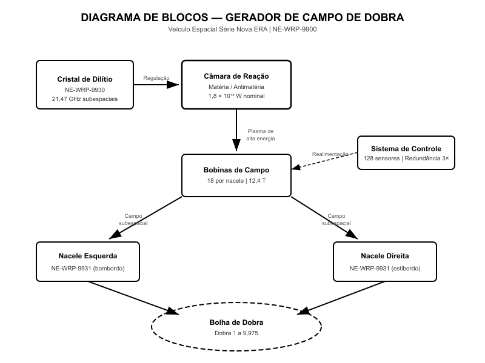
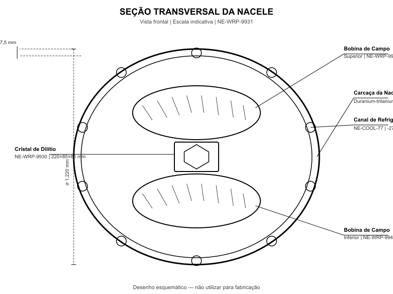
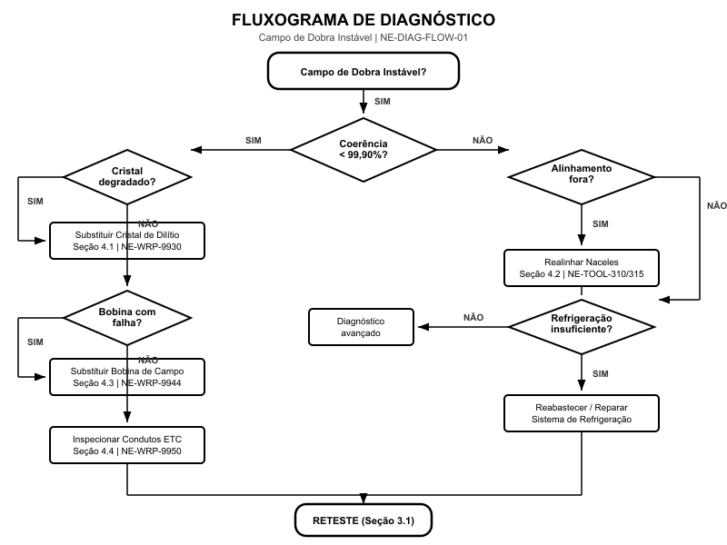
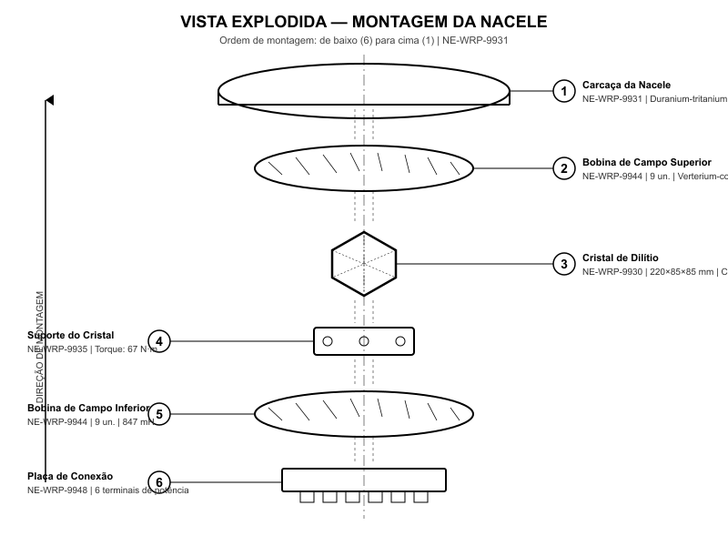
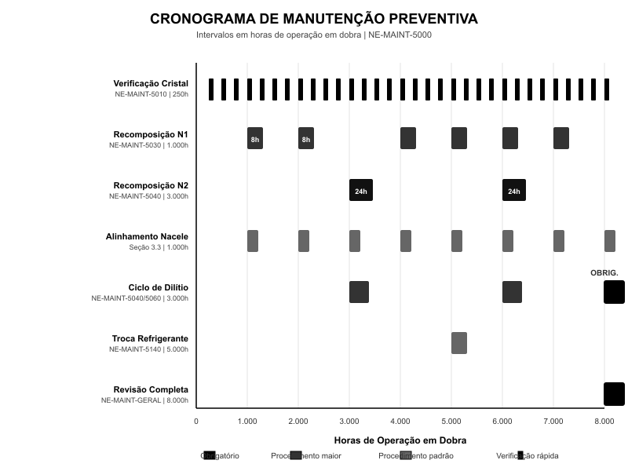

# Gerador de Campo de Dobra

**Manual Técnico de Reparo — Veículo Espacial Série Databricks Galáctica**
**Código do Sistema:** NE-WRP-9900
**Revisão:** 7.3 | Data de Publicação: 2312.04.15 | Classificação: Uso Técnico Autorizado

> **AVISO DE SEGURANÇA CRÍTICO:** O sistema gerador de campo de dobra opera com energias na ordem de 1,21 × 10¹⁵ watts. A manipulação inadequada de qualquer componente pode resultar em colapso do campo subespacial, desintegração molecular ou formação de singularidades temporais. Somente técnicos certificados Nível 4 ou superior estão autorizados a realizar procedimentos neste sistema. Utilize SEMPRE equipamento de proteção subespacial (EPS) Classe Delta durante qualquer intervenção.

---

## 1. Visão Geral e Princípios de Funcionamento

O Gerador de Campo de Dobra do Veículo Espacial Série Databricks Galáctica é o sistema responsável por criar e manter uma bolha de distorção espaço-temporal controlada ao redor da nave, permitindo deslocamento a velocidades superiores à da luz sem violar as leis da relatividade local. O sistema opera com base no princípio de Alcubierre-Yamamoto modificado, onde o espaço-tempo à frente da nave é comprimido enquanto o espaço-tempo atrás é expandido, criando uma "onda" que transporta a nave sem que ela se mova localmente.

### 1.1 Teoria da Curvatura Espaço-Temporal

O campo de dobra fundamenta-se na manipulação controlada da métrica do espaço-tempo através de campos subespaciais de alta energia. O tensor de energia-momento necessário para sustentar a bolha de dobra é gerado pela reação matéria-antimatéria no interior da câmara de reação principal, onde cristais de dilítio atuam como reguladores da aniquilação controlada. A energia resultante é canalizada para as bobinas de campo nas naceles, que convertem plasma de alta energia em campos subespaciais orientados.

A geometria da bolha de dobra é definida por três parâmetros fundamentais:

1. **Raio da bolha (Rb):** Determinado pela potência total aplicada às bobinas de campo. Para o Databricks Galáctica, o raio padrão é de 42,7 metros a partir do centro geométrico do veículo, envolvendo completamente a estrutura e criando uma margem de segurança de 8,3 metros em todas as direções.
2. **Espessura da parede da bolha (δw):** Controlada pela frequência de oscilação das bobinas. Paredes mais finas permitem maior eficiência energética, porém aumentam o risco de colapso. O valor nominal é de 2,14 × 10⁻³ metros subespaciais.
3. **Fator de assimetria (Fa):** A razão entre a compressão frontal e a expansão traseira. Um fator de 1,0 indica simetria perfeita (velocidade zero de dobra). Fatores maiores que 1,0 indicam deslocamento para frente. O Databricks Galáctica opera com Fa entre 1,0 e 9,975 (Dobra 9,975 — velocidade máxima sustentada).

### 1.2 Formação da Bolha de Dobra

O processo de formação da bolha de dobra segue uma sequência precisa de eventos que deve ser respeitada rigorosamente para evitar instabilidades catastróficas:

1. Os cristais de dilítio são energizados e atingem ressonância harmônica na frequência de 21,47 GHz subespaciais.
2. A câmara de reação inicia a aniquilação matéria-antimatéria em regime controlado, gerando plasma de alta energia.
3. O plasma é direcionado através dos condutos de transferência de energia (ETC) para as naceles esquerda e direita simultaneamente.
4. As bobinas de campo nas naceles convertem o plasma em campos subespaciais com geometria toroidal assimétrica.
5. Os campos das duas naceles se encontram e se fundem, formando a bolha de dobra ao redor do veículo.
6. O sistema de controle ajusta continuamente os parâmetros de campo para manter estabilidade e a velocidade desejada.

O tempo total de formação da bolha, do início da energização dos cristais até a estabilização completa do campo, é de aproximadamente 3,7 segundos em condições normais de operação.

### 1.3 Dinâmica de Campo Subespacial

Os campos subespaciais gerados pelas bobinas de campo possuem características únicas que os diferenciam de campos eletromagnéticos convencionais. Eles interagem diretamente com a estrutura do espaço-tempo, podendo ser descritos matematicamente como perturbações no tensor métrico de Minkowski generalizado.

| Parâmetro de Campo | Valor Nominal | Tolerância | Unidade |
|---|---|---|---|
| Frequência base de operação | 21,47 | ± 0,03 | GHz subespaciais |
| Intensidade de campo máxima | 3.240 | ± 15 | milicochranes |
| Taxa de oscilação das bobinas | 47.500 | ± 200 | ciclos/s |
| Coerência de campo mínima | 99,97 | — | % |
| Simetria bilateral | 99,99 | ± 0,005 | % |
| Tempo de resposta do campo | 0,0043 | ± 0,0002 | s |
| Gradiente de campo máximo | 1.875 | ± 10 | cochranes/m |
| Decaimento de campo sem potência | 0,47 | ± 0,05 | s |

A coerência de campo é monitorada continuamente por 128 sensores subespaciais distribuídos ao longo do casco do veículo. Qualquer queda abaixo de 99,90% aciona o protocolo automático de redução de velocidade de dobra, e quedas abaixo de 97,50% disparam o desligamento de emergência do campo de dobra.

### 1.4 Papel dos Cristais de Dilítio

Os cristais de dilítio são elementos naturais raros com uma estrutura cristalina que permite a regulação controlada da reação matéria-antimatéria. No contexto do gerador de campo de dobra, eles desempenham três funções críticas:

- **Regulação da taxa de aniquilação:** Os cristais controlam a taxa na qual matéria e antimatéria se aniquilam, prevenindo reações descontroladas que destruiriam a câmara de reação.
- **Conversão energética:** A estrutura cristalina converte uma porção da energia de aniquilação diretamente em plasma subespacial, aumentando a eficiência do sistema em aproximadamente 23% em comparação com conversores de plasma convencionais.
- **Ressonância harmônica:** Quando energizados na frequência correta, os cristais entram em ressonância com o campo subespacial, permitindo o acoplamento eficiente entre a fonte de energia e as bobinas de campo.

A vida útil dos cristais de dilítio é limitada pela degradação progressiva de sua estrutura cristalina interna, causada pela exposição contínua a radiação de aniquilação. O ciclo de recomposição cristalina (descrito na Seção 5) é essencial para maximizar a longevidade dos cristais.

---

## 2. Especificações Técnicas

Esta seção detalha as especificações técnicas completas de todos os componentes principais do sistema gerador de campo de dobra do Veículo Espacial Série Databricks Galáctica. Todas as medidas seguem o Sistema Internacional de Unidades (SI), com extensões para unidades subespaciais onde aplicável.

### 2.1 Especificações das Naceles

O veículo Databricks Galáctica utiliza um par de naceles simétricas montadas em pilones estruturais acima e atrás da seção principal. Cada nacele é uma unidade autônoma contendo câmara de cristal, bobinas de campo, sistema de refrigeração e diagnósticos integrados.

| Componente / Parâmetro | Especificação | Peça de Reposição |
|---|---|---|
| Comprimento total da nacele | 4.870 mm | — |
| Diâmetro externo da carcaça | 1.220 mm | NE-WRP-9931 |
| Espessura da carcaça (duranium-tritanium) | 47,5 mm | NE-WRP-9931 |
| Massa total da nacele (seca) | 2.340 kg | — |
| Número de bobinas de campo por nacele | 18 (9 superiores + 9 inferiores) | NE-WRP-9944 |
| Diâmetro interno da câmara de cristal | 380 mm | NE-WRP-9935 |
| Pressão interna de operação | 4.750 kPa | — |
| Temperatura interna máxima | 1.247 °C | — |
| Material do revestimento interno | Cerâmica subespacial tipo IV | NE-WRP-9932 |
| Torque de fixação do pilone | 847 N·m ± 12 N·m | — |
| Torque de fixação da carcaça (parafusos M24) | 385 N·m ± 8 N·m | NE-WRP-9933 |
| Torque dos conectores de plasma | 125 N·m ± 3 N·m | NE-WRP-9948 |

### 2.2 Classificação dos Cristais de Dilítio

Os cristais de dilítio utilizados no Databricks Galáctica devem atender a especificações rigorosas de pureza e geometria para garantir desempenho e segurança adequados.

| Parâmetro do Cristal | Especificação Mínima | Especificação Ideal | Peça de Reposição |
|---|---|---|---|
| Classificação de pureza | Classe 7 (99,9997%) | Classe 9 (99,99999%) | NE-WRP-9930 |
| Dimensões (C × L × A) | 220 × 85 × 85 mm | 220 × 85 × 85 mm | NE-WRP-9930 |
| Tolerância dimensional | ± 0,05 mm | ± 0,01 mm | — |
| Massa | 1.847 ± 5 g | 1.847 ± 1 g | — |
| Frequência de ressonância natural | 21,47 ± 0,10 GHz | 21,47 ± 0,01 GHz | — |
| Fator Q de ressonância | > 2,5 × 10⁶ | > 8,0 × 10⁶ | — |
| Resistência à fadiga cristalina | > 3.000 h operação | > 8.000 h operação | — |
| Transmitância subespacial | > 99,85% | > 99,97% | — |
| Temperatura máxima de operação | 1.247 °C | — | — |
| Pressão máxima de operação | 5.500 kPa | — | — |
| Índice de refração subespacial | 1,00047 ± 0,00003 | 1,00047 ± 0,00001 | — |

> **NOTA:** Cristais com pureza inferior a Classe 7 NÃO devem ser utilizados sob nenhuma circunstância. O uso de cristais de classificação inferior pode resultar em ressonância descontrolada e falha catastrófica da câmara de reação. Peça de reposição oficial: NE-WRP-9930.

### 2.3 Bobinas de Campo

Cada nacele contém 18 bobinas de campo dispostas em dois anéis concêntricos (superior e inferior) ao redor da câmara de cristal.

| Parâmetro da Bobina | Especificação | Peça de Reposição |
|---|---|---|
| Tipo do condutor | Verterium-cortenide Grau A | NE-WRP-9944-A |
| Diâmetro do condutor | 4,7 mm | — |
| Número de espiras por bobina | 2.470 | — |
| Resistência CC (a 20 °C) | < 0,0012 Ω | — |
| Indutância por bobina | 847 mH ± 5 mH | — |
| Corrente máxima de operação | 1.245 A | — |
| Campo magnético máximo | 12,4 T | — |
| Temperatura máxima do condutor | 287 °C | — |
| Isolamento entre espiras | Cerâmica subespacial tipo II | NE-WRP-9945 |
| Rigidez dielétrica do isolamento | > 45 kV/mm | — |
| Torque de fixação da bobina ao suporte | 67 N·m ± 2 N·m | NE-WRP-9946 |
| Massa por bobina | 34,7 kg | — |

### 2.4 Requisitos de Potência e Refrigeração

| Sistema | Potência Nominal | Potência Máxima | Observação |
|---|---|---|---|
| Câmara de reação (ignição) | 4,7 × 10¹² W | 8,2 × 10¹² W | Pico de 0,3 s na ignição |
| Câmara de reação (sustentação) | 1,8 × 10¹² W | 3,6 × 10¹² W | Dobra 5 / Dobra 9,975 |
| Bobinas de campo (por nacele) | 2,1 × 10¹¹ W | 5,7 × 10¹¹ W | Dobra 1 / Dobra 9,975 |
| Sistema de refrigeração criogênica | 340 kW | 890 kW | Líquido de refrigeração NE-COOL-77 |
| Controle e sensores | 12 kW | 18 kW | Redundância tripla |
| Sistema de emergência (baterias) | — | 47 kW por 120 s | Desligamento seguro apenas |

O sistema de refrigeração criogênica utiliza líquido de refrigeração NE-COOL-77 (peça de reposição: NE-WRP-9960) circulando a uma pressão de 850 kPa e temperatura de -271,3 °C (1,85 K) através de 24 canais de refrigeração em cada nacele. A vazão nominal é de 47,5 litros por minuto por nacele. O reservatório principal comporta 380 litros de NE-COOL-77 e deve ser reabastecido quando o nível cair abaixo de 60%.

### 2.5 Condutos de Transferência de Energia (ETC)

Os condutos de transferência de energia conectam a câmara de reação central às naceles, transportando plasma de alta energia.

| Parâmetro do Conduto | Especificação | Peça de Reposição |
|---|---|---|
| Diâmetro interno | 180 mm | NE-WRP-9950 |
| Espessura da parede | 22,5 mm | — |
| Material | Liga de duranium-tritanium Grau 7 | NE-WRP-9950 |
| Temperatura máxima do plasma | 2.500.000 K | — |
| Pressão máxima do plasma | 12.500 kPa | — |
| Vazão máxima de plasma | 1.200 m³/s | — |
| Campo de contenção magnética | 8,7 T | — |
| Comprimento (cada lado) | 3.420 mm ± 2 mm | — |
| Torque dos flanges de conexão | 475 N·m ± 10 N·m | NE-WRP-9951 |
| Inspeção por ultrassom | A cada 500 h de operação | — |

---

## 3. Procedimento de Diagnóstico

Esta seção descreve os procedimentos de diagnóstico para identificar e caracterizar falhas no sistema gerador de campo de dobra. Todos os diagnósticos devem ser realizados com o veículo em repouso total (velocidade de dobra zero) e com o sistema de campo desligado, salvo indicação explícita em contrário.

> **AVISO DE SEGURANÇA:** Antes de iniciar qualquer procedimento de diagnóstico, verifique que o campo de dobra foi completamente desativado há pelo menos 120 segundos. Campos residuais podem causar interferência nos instrumentos de medição e representar risco à integridade física do técnico.

### 3.1 Irregularidades no Campo Subespacial

Irregularidades no campo subespacial são a categoria mais comum de falhas e podem se manifestar como oscilações na velocidade de dobra, vibrações estruturais anormais ou alarmes de coerência de campo.

**Procedimento de diagnóstico — Análise de coerência de campo:**

1. Conecte o analisador de campo subespacial modelo NE-DIAG-400 (ou equivalente certificado) à porta de diagnóstico principal (conector J47, painel lateral direito da nacele esquerda).
2. Selecione o modo "Análise de Coerência Estática" no analisador.
3. Energize o sistema de campo em modo de teste (potência limitada a 5% da nominal) conforme procedimento NE-PROC-7710.
4. Aguarde estabilização do campo (indicador verde no painel de controle principal) — tempo típico: 45 segundos.
5. Registre as leituras de coerência nos 128 sensores subespaciais durante um período mínimo de 60 segundos.
6. Compare os valores obtidos com a tabela de referência abaixo.
7. Identifique quaisquer sensores com leituras fora da tolerância e registre suas posições.
8. Desative o sistema de campo em modo de teste seguindo o procedimento NE-PROC-7711.

| Leitura de Coerência | Classificação | Ação Requerida |
|---|---|---|
| 99,97% – 100,00% | Normal | Nenhuma ação necessária |
| 99,90% – 99,96% | Atenção | Monitorar; agendar diagnóstico completo em 100 h |
| 99,50% – 99,89% | Alerta | Diagnóstico completo imediato; limitar velocidade a Dobra 5 |
| 97,50% – 99,49% | Crítico | Proibido operar em dobra; reparo imediato obrigatório |
| < 97,50% | Emergência | Sistema inoperante; investigar causa raiz antes de qualquer energização |

### 3.2 Testes de Degradação de Cristal

A degradação dos cristais de dilítio é uma causa frequente de perda de desempenho do campo de dobra. O diagnóstico de degradação envolve medições ópticas, de ressonância e de transmitância.

**Procedimento — Teste de ressonância cristalina:**

1. Remova a tampa de acesso da câmara de cristal (4 parafusos M16, torque de remoção: não aplicar torque reverso superior a 95 N·m).
2. Conecte o ressonâmetro cristalino NE-DIAG-500 aos terminais de teste do suporte do cristal (conectores vermelhos aos terminais R1/R2, conectores azuis aos terminais B1/B2).
3. Execute a varredura de frequência entre 20,00 GHz e 23,00 GHz subespaciais com resolução de 0,01 GHz.
4. Registre a frequência de pico de ressonância e o fator Q.
5. Compare com os valores de referência na tabela abaixo.

| Parâmetro | Cristal Novo | Degradação Leve | Degradação Moderada | Degradação Severa | Substituir |
|---|---|---|---|---|---|
| Frequência de ressonância | 21,47 ± 0,01 GHz | 21,47 ± 0,05 GHz | 21,47 ± 0,15 GHz | 21,47 ± 0,30 GHz | > ± 0,30 GHz |
| Fator Q | > 8,0 × 10⁶ | > 5,0 × 10⁶ | > 2,5 × 10⁶ | > 1,0 × 10⁶ | < 1,0 × 10⁶ |
| Transmitância subespacial | > 99,97% | > 99,90% | > 99,75% | > 99,50% | < 99,50% |
| Ação recomendada | — | Monitorar | Ciclo de recomposição | Planejar substituição | Substituição imediata |

**Procedimento — Inspeção visual do cristal:**

1. Com a câmara de cristal aberta, utilize a lâmpada de inspeção subespacial NE-DIAG-510 para iluminar o cristal.
2. Examine a superfície do cristal em busca de:
   - Microfissuras (linhas escuras visíveis sob luz subespacial)
   - Descoloração (tom amarelado indica contaminação por subprodutos de aniquilação)
   - Opacidade localizada (indica degradação cristalina interna avançada)
3. Documente qualquer anomalia com registro fotográfico e coordenadas de localização na superfície do cristal.
4. Cristais com microfissuras visíveis devem ser substituídos imediatamente, independentemente dos resultados dos testes de ressonância.

### 3.3 Verificação de Alinhamento das Naceles

O alinhamento preciso entre as duas naceles é fundamental para a formação simétrica da bolha de dobra. Desalinhamentos superiores a 0,003° em qualquer eixo podem causar instabilidade de campo.

**Procedimento — Verificação de alinhamento:**

1. Monte os alvos de alinhamento laser NE-ALIGN-200 nas placas de referência de cada nacele (4 pontos de montagem por nacele, torque: 22 N·m ± 1 N·m).
2. Posicione o interferômetro subespacial NE-DIAG-600 no ponto central entre as naceles, utilizando o tripé magnético na marca de referência do casco (identificada pelo símbolo △ gravado).
3. Execute a sequência de medição automática (programa P-ALIGN-03 no interferômetro).
4. O interferômetro fornecerá leituras de desvio em três eixos (X, Y, Z) e três rotações (pitch, yaw, roll).
5. Compare os valores obtidos com as tolerâncias na tabela abaixo.

| Eixo / Rotação | Tolerância Nominal | Tolerância Máxima | Ferramenta de Ajuste |
|---|---|---|---|
| Deslocamento X (longitudinal) | ± 0,5 mm | ± 2,0 mm | NE-TOOL-310 |
| Deslocamento Y (lateral) | ± 0,3 mm | ± 1,0 mm | NE-TOOL-310 |
| Deslocamento Z (vertical) | ± 0,3 mm | ± 1,0 mm | NE-TOOL-310 |
| Pitch (inclinação longitudinal) | ± 0,001° | ± 0,003° | NE-TOOL-315 |
| Yaw (guinada) | ± 0,001° | ± 0,003° | NE-TOOL-315 |
| Roll (rolamento) | ± 0,002° | ± 0,005° | NE-TOOL-315 |

> **NOTA TÉCNICA:** Se qualquer valor exceder a tolerância máxima, NÃO tente ajustar sem primeiro verificar a integridade estrutural dos pilones de montagem. Desalinhamentos excessivos podem indicar deformação dos pilones causada por estresse térmico ou impacto.

### 3.4 Diagnóstico do Sistema de Refrigeração

Problemas no sistema de refrigeração criogênica afetam diretamente o desempenho das bobinas de campo e podem causar degradação acelerada dos cristais de dilítio.

1. Verifique o nível do líquido de refrigeração NE-COOL-77 no visor do reservatório principal. Nível mínimo aceitável: 60% (228 litros).
2. Conecte o manômetro criogênico NE-DIAG-700 à válvula de teste do circuito de refrigeração (válvula V-12, painel inferior da nacele).
3. Ligue a bomba de circulação em modo de teste (50% da vazão nominal).
4. Registre a pressão nos pontos de entrada e saída de cada nacele.
5. Calcule a perda de carga e compare com o valor de referência.

| Ponto de Medição | Pressão Nominal | Tolerância | Indicação de Falha |
|---|---|---|---|
| Entrada da nacele esquerda | 850 kPa | ± 25 kPa | Obstrução no conduto de alimentação |
| Saída da nacele esquerda | 780 kPa | ± 25 kPa | Obstrução interna nos canais |
| Entrada da nacele direita | 850 kPa | ± 25 kPa | Obstrução no conduto de alimentação |
| Saída da nacele direita | 780 kPa | ± 25 kPa | Obstrução interna nos canais |
| Perda de carga por nacele | 70 kPa | ± 15 kPa | > 100 kPa indica obstrução parcial |
| Diferença entre naceles | 0 kPa | ± 10 kPa | > 20 kPa indica desbalanceamento |

---

## 4. Procedimento de Reparo / Substituição

Esta seção fornece instruções detalhadas para os procedimentos de reparo e substituição dos componentes principais do sistema gerador de campo de dobra. Todos os procedimentos devem ser realizados por técnicos certificados Nível 4 ou superior, com o veículo em repouso total e todos os sistemas de campo completamente desativados.

> **AVISO DE SEGURANÇA:** Antes de iniciar qualquer procedimento de reparo, execute o protocolo completo de desenergização NE-PROC-8800. Verifique a ausência de campos residuais com o detector portátil NE-SAFE-100. Aguarde a liberação do oficial de segurança subespacial antes de abrir qualquer carcaça ou desconectar qualquer componente.

### 4.1 Substituição do Cristal de Dilítio

**Ferramentas necessárias:**
- Chave de torque calibrada NE-TOOL-100 (faixa: 10–500 N·m)
- Extrator de cristal NE-TOOL-200 com ventosas de vácuo subespacial
- Suporte de transporte de cristal NE-TOOL-210 (com amortecimento inercial)
- Kit de vedação da câmara NE-KIT-9935
- Ressonâmetro cristalino NE-DIAG-500

**Peças de reposição:**
| Peça | Código | Quantidade |
|---|---|---|
| Cristal de dilítio Classe 7+ | NE-WRP-9930 | 1 |
| Anel de vedação da câmara | NE-WRP-9936 | 2 |
| Junta de isolamento térmico | NE-WRP-9937 | 2 |
| Pasta condutora subespacial | NE-WRP-9938 | 1 tubo (50 ml) |
| Parafusos de fixação M16 classe 12.9 | NE-WRP-9939 | 4 |

**Procedimento de remoção do cristal degradado:**

1. Execute o protocolo de desenergização NE-PROC-8800 e obtenha liberação do oficial de segurança.
2. Drene o líquido de refrigeração da nacele afetada fechando as válvulas V-10 e V-11 e abrindo a válvula de dreno V-15. Colete o refrigerante em recipiente aprovado. Tempo estimado de drenagem: 12 minutos.
3. Remova a tampa de acesso da câmara de cristal (4 parafusos M16). Torque de remoção máximo: 95 N·m. Utilize sequência cruzada (1-3-2-4).
4. Desconecte os cabos de energização do cristal dos terminais R1, R2, B1 e B2. Marque cada cabo antes da desconexão.
5. Desconecte os sensores de monitoramento do cristal (conector multipino J-12).
6. Remova os 2 anéis de vedação superiores e descarte-os (NÃO reutilizar).
7. Aplique as ventosas de vácuo subespacial do extrator NE-TOOL-200 nas faces laterais do cristal.
8. Ative o vácuo e aguarde a indicação de aderência segura (LED verde no extrator).
9. Desparafuse os 4 parafusos de fixação do suporte inferior do cristal (torque de remoção: não exceder 70 N·m).
10. Extraia lentamente o cristal, mantendo-o nivelado. Velocidade máxima de extração: 5 mm/s.
11. Transfira imediatamente o cristal para o suporte de transporte NE-TOOL-210.

**Procedimento de instalação do cristal novo:**

1. Inspecione visualmente o cristal novo (NE-WRP-9930) para verificar ausência de danos de transporte.
2. Execute o teste de ressonância no cristal novo conforme Seção 3.2. O cristal deve atender às especificações mínimas antes da instalação.
3. Limpe a câmara de cristal com solvente subespacial NE-CLEAN-50. Aguarde evaporação completa (mínimo 5 minutos).
4. Instale as novas juntas de isolamento térmico (NE-WRP-9937) nas superfícies superior e inferior da câmara.
5. Aplique pasta condutora subespacial (NE-WRP-9938) em camada uniforme de 0,5 mm nas superfícies de contato do suporte do cristal.
6. Posicione o cristal novo na câmara utilizando o extrator NE-TOOL-200. Alinhe as marcas de orientação do cristal (gravação "△" no cristal com a marca "△" na câmara).
7. Instale os parafusos de fixação do suporte inferior. Aplique torque em sequência cruzada: primeiro passe a 35 N·m, segundo passe a 67 N·m ± 2 N·m.
8. Instale os novos anéis de vedação (NE-WRP-9936).
9. Reconecte os cabos de energização e o conector de sensores conforme as marcações feitas durante a remoção.
10. Instale a tampa de acesso. Torque dos parafusos M16: 90 N·m ± 3 N·m em sequência cruzada.
11. Recarregue o líquido de refrigeração e purgue o ar do circuito conforme NE-PROC-8820.
12. Execute o procedimento de calibração inicial do cristal conforme NE-PROC-8830.

### 4.2 Realinhamento das Naceles

Quando o diagnóstico de alinhamento (Seção 3.3) indica desvios além da tolerância nominal mas dentro da tolerância máxima, o realinhamento pode ser realizado sem desmontagem dos pilones.

1. Monte o sistema de alinhamento laser NE-ALIGN-200 conforme descrito na Seção 3.3.
2. Identifique os eixos e direções de correção necessários.
3. Solte os 8 parafusos de fixação da nacele ao pilone em 1/4 de volta (NÃO remover completamente). Torque de afrouxamento controlado: reduzir de 847 N·m para aproximadamente 400 N·m.
4. Utilizando a ferramenta de ajuste micrométrico NE-TOOL-310 (para deslocamentos lineares) ou NE-TOOL-315 (para ajustes angulares), realize os ajustes necessários.
5. Monitore o interferômetro em tempo real durante o ajuste.
6. Quando todos os valores estiverem dentro da tolerância nominal, reaplique o torque dos parafusos de fixação: 847 N·m ± 12 N·m em sequência de estrela.
7. Realize nova medição de verificação com o interferômetro para confirmar que o torqueamento não alterou o alinhamento.
8. Registre todos os valores finais no livro de manutenção do veículo.

| Etapa do Ajuste | Ferramenta | Resolução do Ajuste | Peça Associada |
|---|---|---|---|
| Deslocamento linear X, Y, Z | NE-TOOL-310 | 0,01 mm | NE-WRP-9970 (calços) |
| Ajuste angular pitch/yaw | NE-TOOL-315 | 0,0001° | NE-WRP-9971 (excêntricos) |
| Ajuste angular roll | NE-TOOL-315 | 0,0002° | NE-WRP-9971 (excêntricos) |
| Verificação final | NE-DIAG-600 | 0,001 mm / 0,0001° | — |

### 4.3 Rebobinagem de Bobina de Campo

A rebobinagem de uma bobina de campo é um procedimento complexo que requer bancada limpa Classe 100 e deve ser realizado em oficina certificada. Em campo, a substituição completa da bobina (NE-WRP-9944) é o procedimento recomendado.

**Procedimento de substituição da bobina:**

1. Remova a carcaça da nacele conforme descrito no manual de desmontagem NE-MAN-9900, Capítulo 12.
2. Identifique a bobina defeituosa pelo número de série gravado na etiqueta lateral.
3. Desconecte os terminais de alimentação da bobina (2 conectores de alta corrente, tipo bayoneta).
4. Desconecte o sensor de temperatura da bobina (conector J-30 series).
5. Remova os 6 parafusos de fixação da bobina ao suporte (torque de remoção: não exceder 70 N·m). Utilize chave sextavada NE-TOOL-120.
6. Retire a bobina com cuidado, observando o peso de 34,7 kg. Utilize dispositivo de elevação auxiliar.
7. Limpe a superfície de montagem no suporte. Remova qualquer resíduo de pasta térmica antiga.
8. Aplique nova pasta térmica subespacial (NE-WRP-9947, 30 ml) na superfície de montagem.
9. Posicione a bobina nova, alinhando os pinos-guia com os furos correspondentes no suporte.
10. Instale os parafusos de fixação: primeiro passe a 30 N·m, segundo passe a 67 N·m ± 2 N·m.
11. Reconecte os terminais de alimentação e o sensor de temperatura.
12. Realize o teste de isolamento com megôhmetro NE-DIAG-800: resistência mínima de 500 MΩ a 1.000 V CC.
13. Execute o teste de indutância: valor esperado 847 mH ± 5 mH.
14. Reinstale a carcaça da nacele e execute o procedimento de verificação completa.

### 4.4 Reparo de Conduto de Plasma

Danos nos condutos de transferência de energia (ETC) podem ser reparados em campo desde que a integridade estrutural do conduto não esteja comprometida. Danos que ultrapassem 15% da espessura da parede requerem substituição completa do segmento afetado (NE-WRP-9950).

| Tipo de Dano | Profundidade Máxima Reparável | Método de Reparo | Material |
|---|---|---|---|
| Erosão superficial | 3,0 mm (13,3% da parede) | Deposição a plasma | NE-WRP-9952 |
| Microfissura (< 50 mm) | 2,0 mm | Solda subespacial | NE-WRP-9953 |
| Corrosão localizada | 3,0 mm | Deposição + revestimento | NE-WRP-9952 + NE-WRP-9954 |
| Deformação mecânica | N/A — substituir segmento | Substituição | NE-WRP-9950 |

> **AVISO:** Nunca tente reparar um conduto de plasma com o sistema pressurizado. A falha de um conduto sob pressão resultará em vazamento de plasma a 2.500.000 K, causando destruição imediata de todos os componentes adjacentes e risco fatal ao pessoal nas proximidades.

---

## 5. Manutenção Preventiva e Intervalos

A manutenção preventiva do sistema gerador de campo de dobra é essencial para garantir a confiabilidade, segurança e longevidade de todos os componentes. O cumprimento rigoroso dos intervalos de manutenção especificados nesta seção é obrigatório e deve ser documentado no livro de manutenção do veículo.

### 5.1 Cronograma de Ciclo de Cristal de Dilítio

O ciclo de recomposição cristalina é o procedimento mais importante da manutenção preventiva do gerador de campo de dobra. Ele restaura parcialmente a estrutura cristalina interna do dilítio, prolongando significativamente sua vida útil.

| Intervalo (horas de operação em dobra) | Procedimento | Código do Procedimento | Duração Estimada | Peças Necessárias |
|---|---|---|---|---|
| 250 h | Verificação de ressonância e transmitância | NE-MAINT-5010 | 1,5 h | Nenhuma |
| 500 h | Verificação completa + inspeção visual | NE-MAINT-5020 | 3,0 h | Nenhuma |
| 1.000 h | Ciclo de recomposição nível 1 (in situ) | NE-MAINT-5030 | 8,0 h | NE-WRP-9961 (kit de recomposição) |
| 3.000 h | Ciclo de recomposição nível 2 (remoção necessária) | NE-MAINT-5040 | 24,0 h | NE-WRP-9962 (kit avançado) |
| 5.000 h | Avaliação de vida remanescente | NE-MAINT-5050 | 4,0 h | Nenhuma |
| 8.000 h | Substituição obrigatória do cristal | NE-MAINT-5060 | 6,0 h | NE-WRP-9930 |

**Procedimento de ciclo de recomposição nível 1 (NE-MAINT-5030):**

1. Desative o campo de dobra e aguarde o resfriamento completo da câmara de cristal (temperatura abaixo de 50 °C — tempo típico: 45 minutos).
2. Conecte a unidade de recomposição cristalina NE-RECOMP-300 à porta de serviço da câmara de cristal (porta S-5).
3. Execute o programa de recomposição automático (duração: aproximadamente 6 horas).
4. A unidade de recomposição aplicará pulsos de energia subespacial em frequências variáveis (19,00 GHz a 24,00 GHz) para restaurar a estrutura cristalina.
5. Ao término, o equipamento fornecerá um relatório de eficácia da recomposição.
6. Execute o teste de ressonância (Seção 3.2) e compare os valores pré e pós-recomposição.
7. Registre os resultados no livro de manutenção.

> **NOTA:** A eficácia do ciclo de recomposição diminui progressivamente ao longo da vida do cristal. Se o fator Q após a recomposição não atingir pelo menos 80% do valor original, considere a substituição antecipada do cristal.

### 5.2 Verificação de Alinhamento das Naceles

| Intervalo | Procedimento | Condição Especial |
|---|---|---|
| 1.000 h | Verificação de alinhamento padrão (Seção 3.3) | — |
| 3.000 h | Verificação de alinhamento + inspeção dos pilones | — |
| Após qualquer colisão | Verificação de alinhamento de emergência | Obrigatório antes de operar em dobra |
| Após manutenção estrutural | Verificação de alinhamento pós-manutenção | Obrigatório antes de operar em dobra |
| Após substituição de nacele | Alinhamento completo com calibração | Procedimento NE-MAINT-5070 |

### 5.3 Manutenção do Sistema de Refrigeração

O sistema de refrigeração criogênica requer manutenção regular para garantir a remoção eficiente de calor das bobinas de campo e da câmara de cristal.

| Intervalo | Procedimento | Código | Peças |
|---|---|---|---|
| 500 h | Verificar nível e pressão do refrigerante | NE-MAINT-5110 | — |
| 1.000 h | Análise da qualidade do refrigerante | NE-MAINT-5120 | Kit de teste NE-WRP-9963 |
| 2.000 h | Limpeza dos filtros do circuito de refrigeração | NE-MAINT-5130 | Filtro NE-WRP-9964 |
| 5.000 h | Troca completa do refrigerante | NE-MAINT-5140 | 380 L de NE-COOL-77 (NE-WRP-9960) |
| 8.000 h | Revisão completa do sistema (bomba, válvulas, vedações) | NE-MAINT-5150 | Kit de revisão NE-WRP-9965 |

**Procedimento de troca de refrigerante (NE-MAINT-5140):**

1. Certifique-se de que o sistema de campo está completamente desativado e a temperatura da nacele está abaixo de 30 °C.
2. Conecte a bomba de drenagem ao ponto de dreno V-15 e a um recipiente de coleta aprovado para líquidos criogênicos.
3. Abra a válvula V-15 e acione a bomba. Drene completamente o sistema. Volume esperado: 350–380 litros.
4. Feche a válvula V-15 e desconecte a bomba de drenagem.
5. Conecte o equipamento de lavagem NE-FLUSH-400 e circule solvente de limpeza NE-CLEAN-70 por 30 minutos.
6. Drene o solvente de limpeza. Repita a lavagem se o solvente drenado apresentar contaminação visível.
7. Conecte o reservatório de NE-COOL-77 novo ao ponto de enchimento V-16.
8. Preencha o sistema lentamente (vazão máxima de enchimento: 10 litros/min) para evitar formação de bolsas de ar.
9. Quando o visor indicar nível 100%, feche a válvula V-16.
10. Execute o ciclo de purga automático através do painel de controle da refrigeração (programa PURGE-01).
11. Verifique o nível final e complete se necessário.
12. Acione a bomba de circulação e verifique pressões conforme Seção 3.4.

### 5.4 Resumo dos Intervalos de Manutenção

A tabela abaixo consolida todos os intervalos de manutenção preventiva para referência rápida:

| Intervalo (h) | Cristal de Dilítio | Alinhamento | Refrigeração | Bobinas | Condutos ETC | Sistemas Gerais |
|---|---|---|---|---|---|---|
| 250 | Verificação básica | — | — | — | — | — |
| 500 | Verificação completa | — | Nível e pressão | — | Inspeção ultrassom | Teste de sensores |
| 1.000 | Recomposição N1 | Verificação padrão | Qualidade do refrigerante | Resistência de isolamento | — | Calibração dos instrumentos |
| 2.000 | — | — | Limpeza de filtros | — | — | — |
| 3.000 | Recomposição N2 | Verificação + pilones | — | Teste de indutância | Inspeção ultrassom detalhada | Revisão de software |
| 5.000 | Avaliação de vida | — | Troca do refrigerante | Inspeção visual dos condutores | Teste de pressão completo | — |
| 8.000 | Substituição obrigatória | Alinhamento completo | Revisão completa | Rebobinagem preventiva | Substituição preventiva | Revisão geral do sistema |

### 5.5 Registro de Manutenção

Todos os procedimentos de manutenção devem ser registrados no Sistema Eletrônico de Manutenção de Frota (SEMF) com os seguintes dados obrigatórios:

1. Data estelar e data terrestre do procedimento.
2. Identificação do veículo (número de série e matrícula de registro).
3. Identificação do técnico responsável (nome, certificação, nível).
4. Código do procedimento executado.
5. Números de série de todas as peças substituídas.
6. Valores medidos antes e depois do procedimento.
7. Status final do sistema (aprovado / reprovado / com restrições).
8. Assinatura digital do técnico e do supervisor.

> **NOTA LEGAL:** A operação de um Veículo Espacial Série Databricks Galáctica com manutenção preventiva atrasada constitui infração grave ao Código Espacial de Segurança de Voo, sujeita a suspensão da licença de operação e multa de até 500.000 créditos estelares por ocorrência. A responsabilidade é solidária entre o operador do veículo e a organização de manutenção certificada.

---

**Fim do Manual Técnico — Gerador de Campo de Dobra**
**Documento NE-MAN-WRP-9900 | Revisão 7.3**
**© 2312 Databricks Galáctica Veículos Espaciais Ltda. Todos os direitos reservados.**
