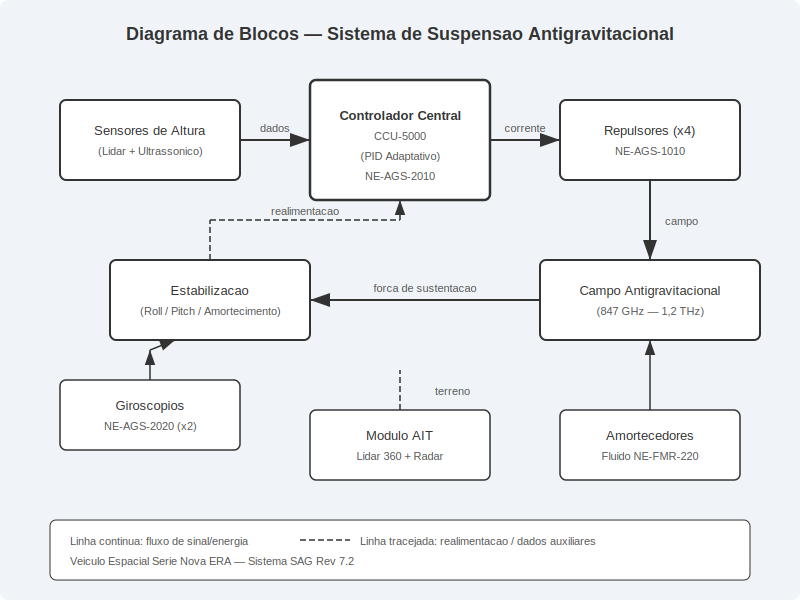
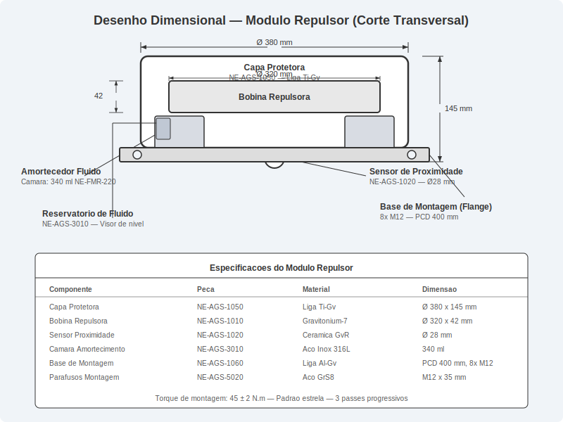
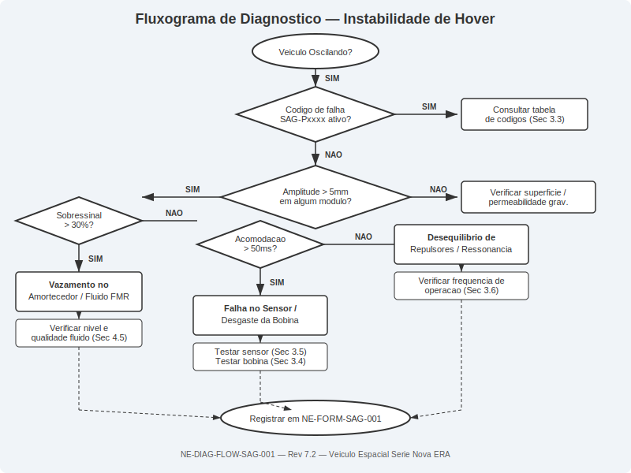
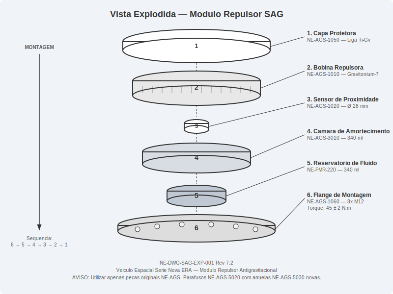
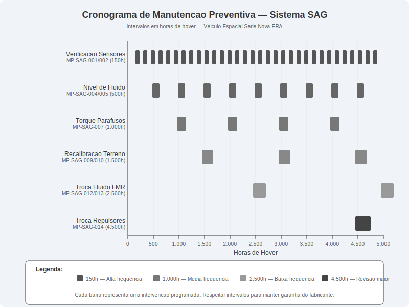

# Suspensao Antigravitacional

> **Manual Tecnico — Veiculo Espacial Serie Databricks Galáctica**
> Revisao 7.2 | Data de Publicacao: Ciclo Estelar 2487.3
> Documento: NE-MAN-AGS-0010
> Classificacao: Manutencao Nivel II — Tecnico Certificado

---

## 1. Visao Geral e Principios de Funcionamento

### 1.1 Introducao ao Sistema de Suspensao Antigravitacional

O sistema de Suspensao Antigravitacional (SAG) do Veiculo Espacial Serie Databricks Galáctica representa a mais avancada tecnologia de levitacao controlada disponivel para veiculos de transporte interplanetario classe civil. Este sistema substitui integralmente os mecanismos convencionais de suspensao mecanica, eliminando o contato fisico entre o chassi do veiculo e a superficie de deslocamento.

O SAG opera por meio da geracao de um campo repulsivo polarizado que interage com o campo gravitacional local, criando uma zona de sustentacao estavel a uma altura programavel entre 15 cm e 250 cm da superficie. O sistema e composto por quatro modulos repulsores independentes (um em cada vertice do chassi), um controlador central de estabilizacao, sensores de altura distribuidos e amortecedores de campo fluido.

### 1.2 Teoria de Campo Antigravitacional

O principio fundamental do SAG baseia-se na Teoria de Campos Repulsivos de Polaridade Inversa (TCRPI), onde uma corrente eletromagnetica de alta frequencia (operando na faixa de 847 GHz a 1.2 THz) e aplicada a uma bobina repulsora fabricada em liga de Gravitonium-7 (Gv7). Quando energizada, a bobina gera um campo vetorial que se opoe ao gradiente gravitacional local, resultando em uma forca de sustentacao proporcional a intensidade do campo aplicado.

A equacao fundamental de sustentacao e expressa como:

**F_sustentacao = k_rep x I^2 x N x (mu_grav / d^2)**

Onde:
- **k_rep**: Constante repulsiva do meio (variavel conforme composicao do solo)
- **I**: Corrente aplicada a bobina (em Amperes)
- **N**: Numero de espiras da bobina repulsora
- **mu_grav**: Permeabilidade gravitacional local
- **d**: Distancia entre a bobina e a superficie

### 1.3 Controle de Altura de Levitacao

O controle de altura e realizado por um laco de realimentacao fechado operando a 10 kHz. Sensores de proximidade ultrassonicos e lidar de estado solido medem continuamente a distancia entre cada modulo repulsor e a superficie. O controlador central (unidade NE-AGS-CCU-5000) processa essas leituras e ajusta individualmente a corrente de cada bobina para manter a altura programada.

| Parametro | Valor Nominal | Tolerancia | Unidade |
|-----------|--------------|------------|---------|
| Altura minima de hover | 15 | +/- 2 | cm |
| Altura maxima de hover | 250 | +/- 5 | cm |
| Altura padrao de cruzeiro | 45 | +/- 1 | cm |
| Taxa de atualizacao do laco | 10.000 | +/- 100 | Hz |
| Tempo de resposta do sistema | 0,8 | +/- 0,1 | ms |
| Resolucao do sensor de altura | 0,5 | — | mm |
| Frequencia de amostragem do sensor | 20.000 | +/- 500 | Hz |

### 1.4 Lacos de Estabilizacao

O sistema SAG utiliza tres lacos de estabilizacao sobrepostos para garantir a suavidade e seguranca da levitacao:

1. **Laco Primario (Altitude)**: Mantém a altura programada em relacao a superficie. Opera com ganho proporcional-integral-derivativo (PID) com coeficientes adaptativos baseados na velocidade do veiculo e rugosidade do terreno.

2. **Laco Secundario (Atitude)**: Controla a inclinacao do veiculo nos eixos de rolagem (roll) e arfagem (pitch), mantendo o chassi nivelado independentemente do perfil do terreno. Utiliza giroscopios de fibra optica com precisao de 0,001 graus.

3. **Laco Terciario (Amortecimento)**: Atenua oscilacoes residuais e vibracoes de alta frequencia atraves dos amortecedores de campo fluido. O fluido magneto-reologico (NE-FMR-220) altera sua viscosidade em resposta a campos magneticos controlados, proporcionando amortecimento variavel em tempo real.

### 1.5 Adaptacao ao Terreno

O modulo de Adaptacao Inteligente ao Terreno (AIT) utiliza um array de sensores frontais (lidar de varredura 360 graus e radar de penetracao) para mapear a superficie ate 50 metros a frente do veiculo. Com base nesse mapeamento, o controlador central pre-ajusta os parametros de cada repulsor, antecipando variações no terreno antes que o veiculo as alcance. Este recurso e essencial para operacao em superficies planetarias irregulares, como regolito lunar, terreno marciano rochoso ou campos de gelo de Europa.

**AVISO DE SEGURANCA**: O sistema SAG nao deve ser operado sobre superficies com permeabilidade gravitacional inferior a 0,3 mu_std. Superficies compostas predominantemente por materiais ferromagneticos densos podem causar ressonancia de campo, resultando em oscilacoes descontroladas. Consulte a tabela de compatibilidade de terrenos no Apendice T-7 antes de operar em superficies desconhecidas.

---

## 2. Especificacoes Tecnicas

### 2.1 Modulo Repulsor — Especificacoes Gerais

Cada modulo repulsor e uma unidade selada, substituivel em campo, que contem a bobina repulsora, sensor de proximidade integrado, amortecedor de campo fluido e eletronica de potencia local. O veiculo Serie Databricks Galáctica utiliza quatro modulos identicos, designados por posicao: Dianteiro Esquerdo (DE), Dianteiro Direito (DD), Traseiro Esquerdo (TE) e Traseiro Direito (TD).

### 2.2 Dimensoes e Peso do Modulo Repulsor

| Parametro | Valor | Unidade |
|-----------|-------|---------|
| Diametro externo | 380 | mm |
| Altura total (incluindo flange) | 145 | mm |
| Diametro da bobina repulsora | 320 | mm |
| Espessura da bobina | 42 | mm |
| Numero de espiras | 1.247 | — |
| Peso do modulo completo | 8,7 | kg |
| Peso da bobina isolada | 3,2 | kg |
| Diametro do sensor de proximidade | 28 | mm |
| Volume da camara de amortecimento | 340 | ml |
| Diametro dos furos de montagem | 12 | mm |
| Circulo de furacao (PCD) | 400 | mm |
| Numero de parafusos de fixacao | 8 | — |

### 2.3 Especificacoes Eletricas e de Campo

| Parametro | Valor | Unidade | Numero da Peca |
|-----------|-------|---------|----------------|
| Tensao de operacao | 48 | VDC | — |
| Corrente nominal por repulsor | 35 | A | — |
| Corrente maxima (pico) | 72 | A | — |
| Potencia nominal (por modulo) | 1.680 | W | — |
| Frequencia do campo repulsivo | 847 - 1.200 | GHz | — |
| Intensidade do campo (nominal) | 4,7 | kGv | — |
| Intensidade do campo (maximo) | 9,2 | kGv | — |
| Bobina repulsora Gv7 | — | — | NE-AGS-1010 |
| Sensor de proximidade integrado | — | — | NE-AGS-1020 |
| Modulo de potencia local | — | — | NE-AGS-1030 |
| Conector de potencia (macho) | — | — | NE-AGS-1041 |
| Conector de dados (macho) | — | — | NE-AGS-1042 |

### 2.4 Coeficientes de Amortecimento

O sistema de amortecimento utiliza fluido magneto-reologico NE-FMR-220, cuja viscosidade e controlada eletronicamente para fornecer coeficientes de amortecimento variaveis.

| Modo de Operacao | Coef. Amortecimento (c) | Viscosidade do Fluido | Corrente de Controle |
|------------------|------------------------|-----------------------|---------------------|
| Conforto | 1.200 N.s/m | 12 cP | 0,5 A |
| Normal | 2.800 N.s/m | 28 cP | 1,2 A |
| Esportivo | 4.500 N.s/m | 45 cP | 2,0 A |
| Terreno Acidentado | 6.200 N.s/m | 62 cP | 2,8 A |
| Emergencia (travamento) | 12.000 N.s/m | 120 cP | 4,5 A |

### 2.5 Limites de Peso e Capacidade de Sustentacao

| Condicao | Peso Maximo Sustentado | Altura Maxima Disponivel |
|----------|----------------------|-------------------------|
| Operacao normal (4 repulsores) | 3.200 kg | 250 cm |
| Operacao degradada (3 repulsores) | 2.100 kg | 120 cm |
| Operacao de emergencia (2 repulsores) | 1.400 kg | 45 cm |
| Peso do veiculo (vazio) | 1.850 kg | — |
| Carga util maxima | 1.350 kg | — |
| Peso maximo de decolagem | 3.200 kg | — |

### 2.6 Lista de Pecas Principais

| Numero da Peca | Descricao | Quantidade | Vida Util |
|----------------|-----------|------------|-----------|
| NE-AGS-1010 | Bobina Repulsora Gv7 | 4 | 4.500 h |
| NE-AGS-1020 | Sensor de Proximidade Ultrassonico | 4 | 6.000 h |
| NE-AGS-1030 | Modulo de Potencia Local | 4 | 8.000 h |
| NE-AGS-1041 | Conector de Potencia (macho) | 4 | 10.000 h |
| NE-AGS-1042 | Conector de Dados (macho) | 4 | 10.000 h |
| NE-AGS-2010 | Controlador Central CCU-5000 | 1 | 12.000 h |
| NE-AGS-2020 | Giroscopio de Fibra Optica | 2 | 10.000 h |
| NE-AGS-3010 | Reservatorio de Fluido FMR-220 | 4 | 2.500 h (fluido) |
| NE-AGS-3020 | Selo do Reservatorio (kit) | 4 | 1.500 h |
| NE-AGS-4010 | Conjunto Lidar Frontal AIT | 1 | 8.000 h |
| NE-AGS-4020 | Radar de Penetracao AIT | 1 | 8.000 h |
| NE-AGS-5010 | Chicote Eletrico Principal SAG | 1 | 15.000 h |
| NE-AGS-5020 | Parafuso de Montagem M12x35 GrS8 | 32 | Reutilizavel (max 3x) |
| NE-AGS-5030 | Arruela de Pressao M12 Gv-coat | 32 | Uso unico |

**NOTA TECNICA**: Todas as pecas com prefixo NE-AGS sao exclusivas do sistema SAG do Veiculo Serie Databricks Galáctica e nao sao intercambiaveis com sistemas de outros fabricantes. O uso de pecas nao homologadas anula a garantia e pode comprometer a seguranca estrutural do campo antigravitacional.

---

## 3. Procedimento de Diagnostico

### 3.1 Introducao ao Diagnostico do SAG

O diagnostico do sistema SAG deve ser realizado sempre que o veiculo apresentar qualquer anomalia de levitacao, incluindo oscilacoes perceptiveis, inclinacao involuntaria, variacao de altura nao comandada ou alarmes no painel de instrumentos. O procedimento a seguir cobre os cenarios mais comuns de falha e deve ser executado por tecnicos com certificacao Nivel II ou superior.

### 3.2 Equipamentos Necessarios para Diagnostico

| Equipamento | Numero da Peca / Modelo | Funcao |
|-------------|------------------------|--------|
| Scanner de Diagnostico SAG | NE-DIAG-7000 | Leitura de codigos de falha e parametros em tempo real |
| Medidor de Campo Gravitacional | Gv-Meter Pro 3.0 | Medicao da intensidade do campo repulsivo |
| Osciloscopio de Campo | NE-DIAG-7010 | Visualizacao de forma de onda do campo |
| Sensor de Altura de Referencia | NE-DIAG-7020 | Calibracao e verificacao dos sensores de bordo |
| Multimetro de Precisao | Classe 0,05% | Medicao de correntes e tensoes do circuito de potencia |
| Nivel Digital de Precisao | Res. 0,001 grau | Verificacao do nivelamento do chassi |
| Kit de Teste de Fluido FMR | NE-DIAG-7030 | Analise de viscosidade e contaminacao do fluido |

### 3.3 Codigos de Falha do SAG

| Codigo | Descricao | Severidade | Acao Imediata |
|--------|-----------|------------|---------------|
| SAG-P0101 | Sensor de altura DE — sinal ausente | Alta | Verificar conexao / substituir sensor |
| SAG-P0102 | Sensor de altura DD — sinal ausente | Alta | Verificar conexao / substituir sensor |
| SAG-P0103 | Sensor de altura TE — sinal ausente | Alta | Verificar conexao / substituir sensor |
| SAG-P0104 | Sensor de altura TD — sinal ausente | Alta | Verificar conexao / substituir sensor |
| SAG-P0201 | Repulsor DE — sobrecorrente | Critica | Desativar modulo / inspecionar bobina |
| SAG-P0202 | Repulsor DD — sobrecorrente | Critica | Desativar modulo / inspecionar bobina |
| SAG-P0301 | Nivel de fluido FMR baixo — DE | Media | Reabastecer fluido / verificar vazamento |
| SAG-P0401 | Desequilibrio de sustentacao > 15% | Alta | Diagnostico completo dos 4 modulos |
| SAG-P0501 | Falha na comunicacao CCU | Critica | Reiniciar controlador / verificar chicote |
| SAG-P0601 | Temperatura da bobina acima do limite | Alta | Reduzir carga / resfriar / inspecionar |
| SAG-P0701 | Lidar AIT — obstrucao detectada | Media | Limpar lente / verificar alinhamento |
| SAG-P0801 | Giroscopio — desvio excessivo | Alta | Recalibrar / substituir giroscopio |

### 3.4 Procedimento de Diagnostico — Instabilidade de Hover

Quando o veiculo apresenta oscilacoes durante a levitacao (sintoma comumente descrito como "balanco" ou "tremor"), siga o procedimento abaixo:

1. Conecte o Scanner de Diagnostico NE-DIAG-7000 a porta OBD-SAG localizada sob o painel inferior esquerdo do cockpit.
2. Acesse o menu **SAG > Diagnostico em Tempo Real > Monitor de Estabilidade**.
3. Observe os valores de amplitude de oscilacao para cada repulsor. O valor normal deve ser inferior a 2,0 mm pico-a-pico.
4. Se a amplitude de qualquer repulsor exceder 5,0 mm, registre o modulo afetado e prossiga para o passo 5.
5. Acesse **SAG > Diagnostico > Teste de Componente Individual** e selecione o modulo com oscilacao elevada.
6. Execute o teste de resposta ao degrau: o sistema aplicara um pulso de corrente e medira a resposta.
7. Analise o grafico de resposta:
   - **Sobressinal > 30%**: Indica amortecimento insuficiente — verifique nivel e qualidade do fluido FMR.
   - **Tempo de acomodacao > 50 ms**: Indica desgaste da bobina ou degradacao do sensor.
   - **Oscilacao sustentada**: Indica possivel ressonancia — verifique frequencia natural vs. frequencia de operacao.
8. Registre todos os valores no formulario de diagnostico NE-FORM-SAG-001.

### 3.5 Procedimento de Diagnostico — Falha de Sensor de Altura

1. Verifique se o codigo de falha SAG-P01xx esta ativo no scanner.
2. Desconecte o conector de dados NE-AGS-1042 do modulo afetado.
3. Meca a resistencia entre os pinos 1 e 3 do conector. Valor esperado: 120 +/- 10 ohms.
4. Meca a tensao de alimentacao nos pinos 2 (+) e 4 (-). Valor esperado: 5,0 +/- 0,1 VDC.
5. Se as medicoes estiverem dentro da especificacao, o sensor interno esta defeituoso — substitua o modulo sensor NE-AGS-1020.
6. Se a tensao de alimentacao estiver ausente, verifique o chicote NE-AGS-5010 em busca de interrupcoes.
7. Reconecte e execute o teste de calibracao via scanner: **SAG > Calibracao > Sensor de Altura > Modulo [XX]**.

### 3.6 Procedimento de Diagnostico — Deteccao de Sustentacao Assimetrica

A sustentacao assimetrica ocorre quando a forca de levitacao gerada por um ou mais repulsores difere significativamente dos demais, causando inclinacao do veiculo.

1. Posicione o veiculo sobre uma superficie plana e nivelada (tolerancia: 0,1 grau).
2. Ative o modo de hover estacionario a altura padrao (45 cm).
3. Utilizando o nivel digital, meca a inclinacao do chassi nos eixos longitudinal e transversal.
4. Uma inclinacao superior a 0,5 graus indica sustentacao assimetrica.
5. No scanner, acesse **SAG > Diagnostico > Mapa de Sustentacao** para visualizar a contribuicao de cada repulsor.
6. Identifique o modulo com desvio e prossiga conforme a tabela:

| Desvio de Sustentacao | Causa Provavel | Acao Recomendada |
|----------------------|----------------|------------------|
| 5% a 15% | Desgaste parcial da bobina | Monitorar / agendar troca |
| 15% a 30% | Sensor descalibrado ou bobina degradada | Recalibrar sensor / testar bobina |
| > 30% | Falha critica do modulo repulsor | Substituicao imediata do modulo |
| Variavel / intermitente | Conexao eletrica intermitente | Inspecionar conectores e chicote |

**AVISO DE SEGURANCA**: Um desvio de sustentacao superior a 30% configura condicao de voo insegura. O veiculo NAO deve ser operado ate que a causa raiz seja identificada e corrigida. Em caso de deteccao durante o voo, o sistema ativara automaticamente o modo de pouso de emergencia (codigo SAG-E001).

---

## 4. Procedimento de Reparo / Substituicao

### 4.1 Informacoes Gerais de Reparo

Todos os procedimentos de reparo do sistema SAG devem ser realizados com o veiculo apoiado em cavaletes antigravitacionais certificados (NE-TOOL-8000, capacidade minima 4.000 kg) e com o sistema de propulsao completamente desligado. O capacitor de campo principal deve ser descarregado antes de qualquer intervencao — aguarde no minimo 120 segundos apos o desligamento e confirme tensao zero no terminal de monitoramento.

### 4.2 Ferramentas Necessarias para Reparo

| Ferramenta | Especificacao | Numero da Peca |
|------------|--------------|----------------|
| Chave de torque digital | 10-80 N.m, precisao 2% | NE-TOOL-8010 |
| Soquete sextavado | 19 mm, perfil baixo | NE-TOOL-8011 |
| Extrator de modulo repulsor | Especifico Serie Databricks Galáctica | NE-TOOL-8020 |
| Seringa de fluido FMR | 500 ml, com valvula anti-retorno | NE-TOOL-8030 |
| Bomba de vacuo para fluido | Capacidade 1 litro | NE-TOOL-8031 |
| Dispositivo de calibracao de sensor | Interface Scanner NE-DIAG-7000 | NE-TOOL-8040 |
| Luva anti-estatica certificada | Classe ESD-SAG | NE-TOOL-8050 |
| Pasta termica para repulsores | Condutividade 12 W/m.K | NE-AGS-6010 |

### 4.3 Procedimento de Substituicao do Modulo Repulsor

**Tempo estimado**: 90 minutos por modulo
**Torque dos parafusos de montagem**: 45 +/- 2 N.m

Siga rigorosamente a sequencia abaixo:

1. Desligue completamente o sistema SAG pelo painel de controle. Aguarde a confirmacao de desligamento (LED indicador apagado no painel central).
2. Aguarde 120 segundos para descarga completa dos capacitores de campo.
3. Verifique a tensao residual no terminal de monitoramento (pinos TP1 e TP2 do modulo afetado). Confirme leitura inferior a 0,5 VDC.
4. Desconecte o conector de potencia NE-AGS-1041 girando o anel de travamento 90 graus no sentido anti-horario e puxando suavemente.
5. Desconecte o conector de dados NE-AGS-1042 pressionando a trava lateral e puxando.
6. Desconecte a linha de fluido FMR fechando a valvula de isolamento (gire no sentido horario ate o batente) e removendo o engate rapido.
7. Posicione uma bandeja coletora sob o modulo para capturar fluido residual (aproximadamente 30 ml).
8. Remova os 8 parafusos de montagem NE-AGS-5020 utilizando o soquete de 19 mm na chave de torque. Siga o padrao de remocao em estrela (sequencia: 1-5-3-7-2-6-4-8) para evitar distorcao da flange.
9. Instale o extrator NE-TOOL-8020 nos furos de guia e acione para separar o modulo da base de montagem.
10. Remova o modulo e inspecione a superficie de montagem no chassi. Limpe residuos de pasta termica antiga com solvente NE-CLN-100.
11. Inspecione os 8 furos roscados da base. Se algum apresentar danos na rosca, utilize o kit de reparo de rosca NE-TOOL-8060.
12. Aplique uma camada uniforme de pasta termica NE-AGS-6010 (espessura aproximada: 0,3 mm) na face de contato do novo modulo repulsor.
13. Posicione o novo modulo alinhando o pino de referencia com o sulco na base de montagem.
14. Instale os 8 parafusos NE-AGS-5020 **novos** com arruelas de pressao NE-AGS-5030 **novas**. Aperte manualmente (finger-tight) todos os parafusos antes de torquear.
15. Aplique o torque final de **45 N.m** seguindo o padrao em estrela (sequencia: 1-5-3-7-2-6-4-8). Execute tres passes progressivos: 15 N.m, 30 N.m e 45 N.m.
16. Reconecte a linha de fluido FMR: insira o engate rapido e abra a valvula de isolamento (sentido anti-horario).
17. Reconecte o conector de dados NE-AGS-1042 ate ouvir o click da trava.
18. Reconecte o conector de potencia NE-AGS-1041 e gire o anel de travamento 90 graus no sentido horario.
19. Preencha a camara de amortecimento com fluido FMR-220 fresco utilizando a seringa NE-TOOL-8030. Volume: 340 ml. Purge o ar conforme Secao 4.5.

### 4.4 Procedimento de Recalibracao de Sensores

Apos a substituicao de qualquer modulo repulsor ou sensor, a recalibracao e OBRIGATORIA. A operacao do veiculo sem recalibracao pode resultar em instabilidade severa.

1. Conecte o scanner NE-DIAG-7000 e acesse **SAG > Calibracao > Modo Completo**.
2. Certifique-se de que o veiculo esta sobre superficie plana (tolerancia 0,1 grau) e sem carga.
3. Selecione **Iniciar Calibracao de Sensores de Altura**.
4. O sistema realizara automaticamente uma sequencia de medicoes em tres alturas de referencia (15 cm, 45 cm e 120 cm).
5. Aguarde a conclusao (aproximadamente 5 minutos). O scanner exibira os resultados:

| Parametro de Calibracao | Criterio de Aprovacao | Acao se Reprovado |
|------------------------|-----------------------|-------------------|
| Linearidade do sensor | Desvio < 1% | Substituir sensor NE-AGS-1020 |
| Repetibilidade | Desvio < 0,5 mm | Verificar fixacao mecanica |
| Tempo de resposta | < 2 ms | Verificar conexao eletrica |
| Zero do sensor | Offset < 1 mm | Recalibrar zero manualmente |
| Concordancia entre modulos | Delta < 3 mm | Recalibrar todos os modulos |

6. Se todos os parametros estiverem aprovados, selecione **Salvar Calibracao** e anote o codigo de verificacao gerado.
7. Execute o teste funcional: ative o hover estacionario a 45 cm por 60 segundos e verifique estabilidade.

### 4.5 Procedimento de Reabastecimento de Fluido FMR-220

O fluido magneto-reologico NE-FMR-220 e essencial para o amortecimento do sistema. Seu reabastecimento deve ser feito com tecnica adequada para evitar a entrada de ar na camara de amortecimento.

1. Com o sistema SAG desligado, feche a valvula de isolamento do modulo a ser reabastecido.
2. Conecte a bomba de vacuo NE-TOOL-8031 a porta de purga (localizacao: face superior do reservatorio, tampa vermelha).
3. Aplique vacuo de -0,8 bar por 30 segundos para extrair ar residual.
4. Sem retirar o vacuo, conecte a seringa NE-TOOL-8030 carregada com fluido NE-FMR-220 fresco a porta de preenchimento (tampa azul).
5. Injete lentamente o fluido ate que o nivel atinja a marca "MAX" no visor do reservatorio (340 ml total).
6. Feche a porta de preenchimento e libere o vacuo gradualmente.
7. Abra a valvula de isolamento.
8. Ative o sistema SAG em modo de teste (hover a 45 cm) por 2 minutos para circular o fluido.
9. Desligue e verifique o nivel novamente. Complete se necessario.

| Especificacao do Fluido NE-FMR-220 | Valor |
|-------------------------------------|-------|
| Viscosidade base (sem campo) | 8 cP a 25 graus C |
| Viscosidade maxima (campo total) | 120 cP |
| Densidade | 2,47 g/cm3 |
| Temperatura de operacao | -40 a +180 graus C |
| Intervalo de troca | 2.500 horas |
| Volume por modulo | 340 ml |
| Cor (novo) | Cinza escuro metalico |
| Cor (degradado — substituir) | Marrom escuro / preto |

**AVISO DE SEGURANCA**: O fluido NE-FMR-220 contem particulas ferromagneticas em suspensao. Utilize luvas e oculos de protecao durante o manuseio. Em caso de contato com a pele, lave imediatamente com agua e sabao. Em caso de ingestao, procure atendimento medico. Consulte a Ficha de Seguranca NE-MSDS-FMR-220 para informacoes completas.

---

## 5. Manutencao Preventiva e Intervalos

### 5.1 Filosofia de Manutencao

A manutencao preventiva do sistema SAG e organizada em intervalos baseados em horas de operacao de hover (horas em que o sistema esta efetivamente gerando campo repulsivo). O horímetro do SAG e independente do hodometro do veiculo e pode ser consultado no painel de instrumentos em **Configuracoes > SAG > Informacoes do Sistema** ou via scanner NE-DIAG-7000.

### 5.2 Tabela de Intervalos de Manutencao

| Servico | Intervalo (horas) | Nivel Tecnico | Tempo Estimado | Referencia |
|---------|-------------------|---------------|----------------|------------|
| Inspecao visual dos modulos repulsores | 150 | Nivel I | 20 min | MP-SAG-001 |
| Verificacao dos sensores de altura | 150 | Nivel I | 30 min | MP-SAG-002 |
| Leitura de codigos de falha | 150 | Nivel I | 10 min | MP-SAG-003 |
| Verificacao do nivel de fluido FMR-220 | 500 | Nivel I | 15 min | MP-SAG-004 |
| Teste de viscosidade do fluido FMR-220 | 500 | Nivel II | 30 min | MP-SAG-005 |
| Teste funcional de estabilidade | 500 | Nivel II | 45 min | MP-SAG-006 |
| Verificacao de torque dos parafusos de montagem | 1.000 | Nivel II | 40 min | MP-SAG-007 |
| Inspecao dos conectores eletricos | 1.000 | Nivel I | 20 min | MP-SAG-008 |
| Recalibracao dos sensores de altura | 1.500 | Nivel II | 60 min | MP-SAG-009 |
| Recalibracao do sistema AIT (terreno) | 1.500 | Nivel II | 90 min | MP-SAG-010 |
| Calibracao dos giroscopios | 1.500 | Nivel II | 45 min | MP-SAG-011 |
| Troca do fluido FMR-220 (todos os modulos) | 2.500 | Nivel II | 120 min | MP-SAG-012 |
| Troca dos selos do reservatorio | 2.500 | Nivel II | 60 min | MP-SAG-013 |
| Substituicao das bobinas repulsoras | 4.500 | Nivel III | 360 min | MP-SAG-014 |
| Substituicao dos sensores de proximidade | 6.000 | Nivel II | 180 min | MP-SAG-015 |
| Revisao geral do sistema SAG | 6.000 | Nivel III | 480 min | MP-SAG-016 |

### 5.3 Procedimento de Inspecao de Repulsores (150 horas)

Este procedimento deve ser executado a cada 150 horas de hover ou a cada 30 dias, o que ocorrer primeiro.

1. Com o sistema SAG desligado, inspecione visualmente cada modulo repulsor em busca de:
   - Rachaduras ou trincas na capa protetora
   - Sinais de vazamento de fluido FMR (manchas escuras na regiao do reservatorio)
   - Danos nos conectores eletricos (pinos tortos, corrosao, acumulo de poeira)
   - Corrosao ou desgaste na flange de montagem
   - Acumulo de detritos na face inferior do repulsor (que deve estar limpa para operacao eficiente)

2. Registre as condicoes encontradas no formulario de inspecao NE-FORM-SAG-002.

3. Se alguma anomalia for detectada, prossiga para o diagnostico completo conforme Secao 3.

| Item de Inspecao | Condicao Aceitavel | Condicao de Rejeicao |
|-----------------|--------------------|-----------------------|
| Capa protetora | Sem trincas, sem deformacao | Qualquer trinca ou deformacao > 2 mm |
| Superficie do repulsor | Limpa, sem depositos | Depositos aderidos ou corrosao |
| Conectores | Pinos retos, sem corrosao | Pinos tortos, corrosao visivel |
| Flange de montagem | Sem corrosao, parafusos presentes | Corrosao, parafusos faltantes/soltos |
| Linhas de fluido | Sem vazamento, engates firmes | Qualquer vazamento ou engate frouxo |
| Chicote eletrico | Sem abrasao, sem dobras agudas | Isolamento danificado, fios expostos |

### 5.4 Verificacao do Nivel de Fluido (500 horas)

1. Posicione o veiculo sobre superficie nivelada com o sistema SAG desligado.
2. Localize o visor de nivel em cada reservatorio de fluido (face lateral do modulo repulsor).
3. O nivel deve estar entre as marcas "MIN" e "MAX" gravadas no visor.
4. Se o nivel estiver abaixo de "MIN", reabasteca conforme Secao 4.5.
5. Se o nivel cai repetidamente entre inspecoes, investigue possivel vazamento nos selos NE-AGS-3020.

| Modulo | Nivel Aceitavel | Volume de Reposicao Tipico |
|--------|-----------------|---------------------------|
| Dianteiro Esquerdo (DE) | Entre MIN e MAX | 0 a 50 ml |
| Dianteiro Direito (DD) | Entre MIN e MAX | 0 a 50 ml |
| Traseiro Esquerdo (TE) | Entre MIN e MAX | 0 a 50 ml |
| Traseiro Direito (TD) | Entre MIN e MAX | 0 a 50 ml |

### 5.5 Recalibracao de Adaptacao ao Terreno (1.500 horas)

O sistema de Adaptacao Inteligente ao Terreno (AIT) deve ser recalibrado a cada 1.500 horas para compensar o desvio (drift) acumulado nos sensores lidar e radar. A recalibracao requer acesso a uma pista de calibracao certificada ou a utilizacao de alvos de referencia portateis NE-CAL-AIT-100.

1. Posicione o veiculo na pista de calibracao ou posicione os 5 alvos de referencia nas distancias especificadas (2 m, 5 m, 10 m, 25 m e 50 m a frente do veiculo).
2. Conecte o scanner NE-DIAG-7000 e acesse **SAG > Calibracao > AIT > Recalibracao Completa**.
3. Siga as instrucoes na tela do scanner. O sistema executara:
   - Calibracao de alcance do lidar (5 pontos de referencia)
   - Calibracao de angulo do lidar (varredura 360 graus)
   - Calibracao do radar de penetracao (3 frequencias)
   - Teste de fusao de dados lidar/radar
4. Duracao total: aproximadamente 90 minutos.
5. Criterios de aprovacao:

| Parametro AIT | Tolerancia |
|---------------|------------|
| Erro de alcance lidar | < 5 mm a 50 m |
| Erro angular lidar | < 0,05 graus |
| Erro de profundidade radar | < 10 mm a 2 m |
| Latencia de fusao de dados | < 5 ms |
| Tempo de antecipacao de terreno a 100 km/h | > 1,5 s |

6. Se algum parametro estiver fora da tolerancia, tente a recalibracao uma segunda vez. Se persistir, substitua o componente afetado (NE-AGS-4010 para lidar, NE-AGS-4020 para radar).

### 5.6 Registro de Manutencao

Todos os servicos de manutencao preventiva devem ser registrados no Livro de Manutencao do Veiculo (fisico) e no sistema eletronico NE-MMS (Maintenance Management System), acessivel via rede da concessionaria autorizada. O registro deve incluir:

- Data e horimetro do SAG
- Servico executado (codigo MP-SAG-xxx)
- Tecnicos responsaveis (nome e numero de certificacao)
- Pecas substituidas (numero de peca e numero de serie)
- Resultados de testes e calibracoes
- Proxima manutencao programada

| Ciclo de Manutencao | Servicos Incluidos | Custo Estimado (creditos NE) |
|---------------------|--------------------|------------------------------|
| A (150 h) | MP-SAG-001 a 003 | 80 |
| B (500 h) | A + MP-SAG-004 a 006 | 250 |
| C (1.000 h) | B + MP-SAG-007, 008 | 400 |
| D (1.500 h) | C + MP-SAG-009 a 011 | 850 |
| E (2.500 h) | D + MP-SAG-012, 013 | 1.600 |
| F (4.500 h) | E + MP-SAG-014 | 4.200 |
| G (6.000 h) | F + MP-SAG-015, 016 | 7.500 |

**NOTA IMPORTANTE**: A operacao do veiculo com manutencao preventiva em atraso (acima de 10% do intervalo especificado) pode resultar na anulacao da garantia do fabricante e, em jurisdicoes regulamentadas, na suspensao da licenca de operacao do veiculo. O sistema SAG emitira um alerta no painel de instrumentos quando a manutencao estiver proxima do vencimento (codigo SAG-M001) e um alarme quando estiver vencida (codigo SAG-M002).

---

> **Fim do Documento NE-MAN-AGS-0010**
> Proxima revisao programada: Ciclo Estelar 2488.1
> Para suporte tecnico: Rede Autorizada Databricks Galáctica — Canal SAG Prioritario
