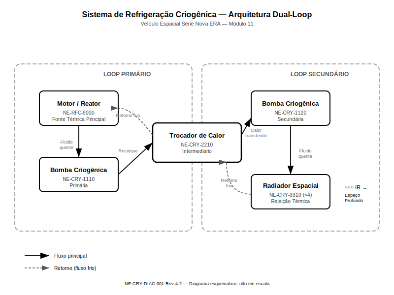
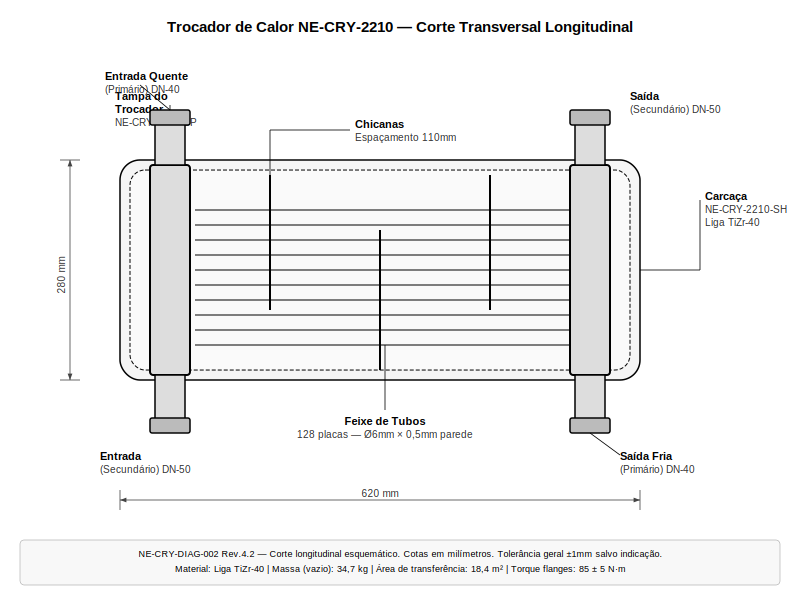
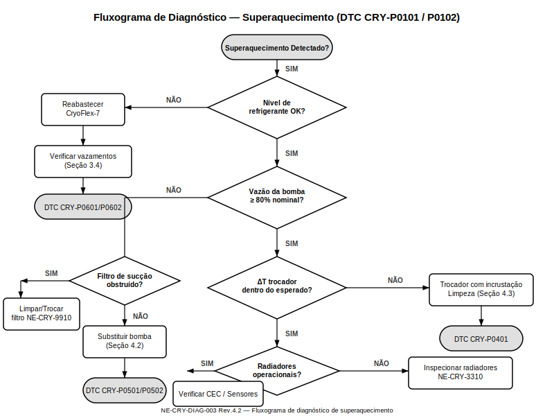
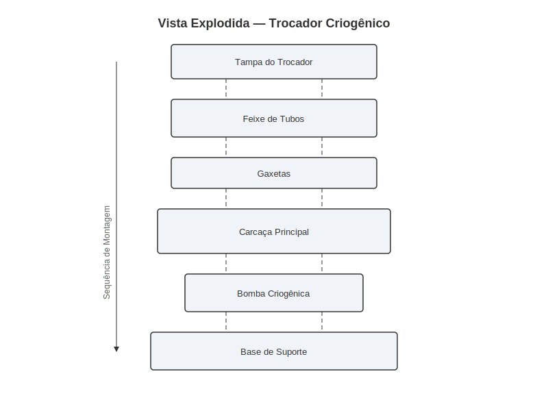
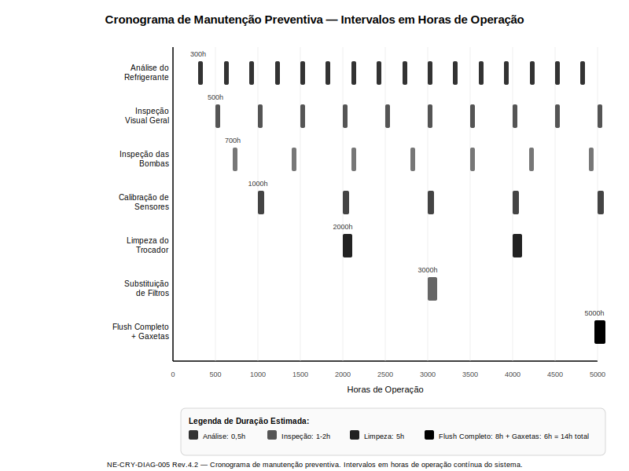

# Sistema de Refrigeração Criogênica

**Veículo Espacial Série Databricks Galáctica — Manual de Reparo Técnico**
**Módulo 11 — Refrigeração Criogênica**
**Revisão 4.2 — Ano-Padrão 2487**

> **AVISO DE SEGURANÇA GERAL:** Os procedimentos descritos neste módulo envolvem fluidos criogênicos com temperaturas operacionais abaixo de -180°C. O contato direto com refrigerante criogênico causa queimaduras térmicas instantâneas e danos permanentes aos tecidos. Utilize SEMPRE os Equipamentos de Proteção Individual (EPI) classe CR-3 ou superior, incluindo luvas criogênicas certificadas NE-PPE-0044, viseira térmica e traje pressurizado com isolamento térmico ativo. Nunca execute procedimentos de manutenção com o sistema pressurizado acima de 0,5 bar residual.

---

## 1. Visão Geral e Princípios de Funcionamento

O Sistema de Refrigeração Criogênica do Veículo Espacial Série Databricks Galáctica é responsável pela dissipação térmica de todos os componentes geradores de calor da espaçonave, incluindo o reator de fusão compacta modelo NE-RFC-9000, os módulos de propulsão iônica, os bancos de supercapacitores e os sistemas de computação quântica embarcados. O sistema opera em arquitetura de laço duplo (dual-loop), isolando o circuito primário de alta temperatura do circuito secundário de rejeição térmica ao espaço profundo.

### 1.1 Teoria de Refrigeração Criogênica Aplicada

A refrigeração criogênica no ambiente espacial apresenta desafios únicos que diferem substancialmente dos sistemas terrestres. No vácuo do espaço, a convecção é inexistente, tornando a radiação térmica o único mecanismo viável de rejeição de calor para o ambiente externo. O sistema Databricks Galáctica contorna esta limitação utilizando um fluido refrigerante criogênico proprietário — o CryoFlex-7 (designação técnica NE-CRF-0007) — que opera em faixa de temperatura entre -196°C e +120°C sem mudança de fase, mantendo propriedades de transferência térmica excepcionais ao longo de todo o espectro operacional.

O princípio fundamental baseia-se no ciclo de Brayton invertido modificado, onde o refrigerante circula em circuito fechado absorvendo calor dos componentes críticos no loop primário e transferindo essa energia térmica ao loop secundário através de trocadores de calor de placas brasadas de alta eficiência. O loop secundário, por sua vez, transporta o calor até os radiadores espaciais montados nas superfícies externas do veículo, onde a energia é rejeitada por radiação infravermelha.

### 1.2 Arquitetura de Laço Duplo

A arquitetura dual-loop foi selecionada para o Databricks Galáctica por três razões fundamentais: isolamento de contaminantes entre circuitos, redundância operacional parcial e otimização independente dos parâmetros de cada laço. O loop primário opera com CryoFlex-7 a pressões entre 8 e 15 bar, enquanto o loop secundário utiliza o mesmo refrigerante porém a pressões reduzidas de 3 a 6 bar, minimizando o risco de vazamento para o exterior.

O fluxo térmico segue o caminho descrito no diagrama abaixo, passando sequencialmente pelo reator, bomba criogênica primária, trocador de calor intermediário, bomba criogênica secundária e finalmente o radiador espacial.

### 1.3 Componentes Principais do Sistema

| Componente | Número de Peça | Quantidade | Função Principal |
|---|---|---|---|
| Bomba Criogênica Primária | NE-CRY-1110 | 2 (1 reserva) | Circulação do loop primário |
| Bomba Criogênica Secundária | NE-CRY-1120 | 2 (1 reserva) | Circulação do loop secundário |
| Trocador de Calor Intermediário | NE-CRY-2210 | 1 | Transferência entre loops |
| Radiador Espacial Composto | NE-CRY-3310 | 4 painéis | Rejeição térmica ao espaço |
| Reservatório de CryoFlex-7 (Primário) | NE-CRY-4410 | 1 | Armazenamento e expansão — loop primário |
| Reservatório de CryoFlex-7 (Secundário) | NE-CRY-4420 | 1 | Armazenamento e expansão — loop secundário |
| Válvula Termostática Proporcional | NE-CRY-5510 | 6 | Regulação de fluxo por zona |
| Sensor de Temperatura Criogênico | NE-CRY-6610 | 24 | Monitoramento distribuído |
| Sensor de Vazão Ultrassônico | NE-CRY-6620 | 8 | Medição de fluxo volumétrico |
| Controlador Eletrônico Central (CEC) | NE-CRY-7710 | 1 | Gerenciamento e automação |

### 1.4 Capacidade de Dissipação Térmica

O sistema foi projetado para dissipar uma carga térmica total de até 450 kW em operação nominal e picos de até 680 kW durante manobras de alta potência com duração máxima de 12 minutos. A temperatura do refrigerante na saída do reator não deve exceder +85°C em regime contínuo, e a temperatura na entrada dos radiadores deve permanecer abaixo de +60°C para garantir eficiência radiativa adequada.

| Parâmetro | Valor Nominal | Valor Máximo | Unidade |
|---|---|---|---|
| Carga térmica contínua | 320 | 450 | kW |
| Carga térmica de pico | — | 680 | kW |
| Duração máx. em pico | — | 12 | min |
| Temp. saída reator (loop primário) | +62 | +85 | °C |
| Temp. entrada radiador (loop secundário) | +38 | +60 | °C |
| Temp. saída radiador (loop secundário) | -45 | -20 | °C |

---

## 2. Especificações Técnicas

Esta seção detalha todas as especificações técnicas dos componentes do Sistema de Refrigeração Criogênica, incluindo propriedades dos fluidos refrigerantes, parâmetros de operação dos trocadores de calor, características das bombas criogênicas e tolerâncias dimensionais críticas.

### 2.1 Fluido Refrigerante CryoFlex-7

O CryoFlex-7 é um fluido refrigerante sintético de base perfluorocarbônica modificada com nanopartículas de grafeno em suspensão estável. Esta formulação proprietária confere ao fluido uma condutividade térmica 340% superior aos refrigerantes convencionais, mantendo viscosidade extremamente baixa mesmo em temperaturas criogênicas.

| Propriedade | Valor | Unidade | Condição de Teste |
|---|---|---|---|
| Faixa de temperatura operacional | -196 a +120 | °C | Pressão ≥ 3 bar |
| Ponto de solidificação | -211 | °C | 1 bar |
| Ponto de ebulição | +187 | °C | 1 bar |
| Densidade a 20°C | 1.842 | kg/L | — |
| Viscosidade cinemática a -50°C | 2,8 | cSt | — |
| Viscosidade cinemática a +80°C | 0,4 | cSt | — |
| Condutividade térmica a 20°C | 0,89 | W/(m·K) | — |
| Calor específico a 20°C | 1.680 | J/(kg·K) | — |
| Número de peça (galão de 20L) | NE-CRF-0007-20 | — | — |
| Número de peça (tambor de 200L) | NE-CRF-0007-200 | — | — |
| Vida útil em serviço | 8.000 | horas | Antes da análise obrigatória |

> **ATENÇÃO:** O CryoFlex-7 é incompatível com elastômeros de base EPDM e silicone convencional. Utilize EXCLUSIVAMENTE gaxetas e vedações certificadas NE-SEAL com sufixo "-CF7". A utilização de vedações incompatíveis resultará em degradação acelerada e vazamento em menos de 200 horas de operação.

### 2.2 Trocador de Calor Intermediário NE-CRY-2210

O trocador de calor intermediário é do tipo placas brasadas em liga de titânio-zircônio (TiZr-40), com configuração de contrafluxo para maximizar a eficiência de transferência térmica. A unidade é projetada para operação contínua sem manutenção por períodos de até 2.000 horas.

| Especificação | Valor | Unidade |
|---|---|---|
| Tipo | Placas brasadas — contrafluxo | — |
| Material das placas | Liga TiZr-40 | — |
| Número de placas | 128 | — |
| Área de transferência total | 18,4 | m² |
| Capacidade térmica nominal | 450 | kW |
| Capacidade térmica máxima | 720 | kW |
| Perda de carga — lado primário | 0,35 | bar |
| Perda de carga — lado secundário | 0,28 | bar |
| Conexões — entrada/saída primário | DN-40 (Ø42,4 mm) | — |
| Conexões — entrada/saída secundário | DN-50 (Ø60,3 mm) | — |
| Massa total (vazio) | 34,7 | kg |
| Massa total (cheio) | 52,1 | kg |
| Torque de fixação — flanges de entrada | 85 ± 5 | N·m |
| Torque de fixação — flanges de saída | 85 ± 5 | N·m |
| Torque — parafusos de montagem (M12) | 45 ± 3 | N·m |

### 2.3 Bombas Criogênicas

As bombas criogênicas NE-CRY-1110 (primária) e NE-CRY-1120 (secundária) são do tipo centrífugo com mancais magnéticos, eliminando completamente o atrito mecânico e a necessidade de selos dinâmicos rotativos. Os mancais magnéticos ativos são controlados pelo CEC com frequência de atualização de 10 kHz.

| Parâmetro | NE-CRY-1110 (Primária) | NE-CRY-1120 (Secundária) | Unidade |
|---|---|---|---|
| Tipo | Centrífuga — mancais magnéticos | Centrífuga — mancais magnéticos | — |
| Vazão nominal | 180 | 240 | L/min |
| Vazão máxima | 260 | 340 | L/min |
| Pressão diferencial nominal | 8,5 | 4,2 | bar |
| Potência elétrica nominal | 3,8 | 4,1 | kW |
| Rotação nominal | 12.400 | 9.800 | RPM |
| Rotação máxima | 16.000 | 13.000 | RPM |
| Massa | 18,2 | 22,6 | kg |
| Torque — porcas de fixação (M10) | 38 ± 2 | 38 ± 2 | N·m |
| Torque — conexões hidráulicas | 65 ± 4 | 75 ± 4 | N·m |
| MTBF estimado | 15.000 | 15.000 | horas |

### 2.4 Radiadores Espaciais NE-CRY-3310

Os quatro painéis de radiadores espaciais utilizam tecnologia de tubo de calor (heat pipe) integrada a superfícies emissoras de alta emissividade (ε > 0,95). Cada painel possui dimensões de 3,2 m × 1,8 m e é articulado para otimização angular em relação às fontes de radiação solar.

| Especificação | Valor por Painel | Total (4 painéis) | Unidade |
|---|---|---|---|
| Dimensões | 3,2 × 1,8 | — | m |
| Área emissora (face única) | 5,76 | 23,04 | m² |
| Emissividade superficial | 0,96 | — | — |
| Absortividade solar | 0,12 | — | — |
| Capacidade de rejeição (sombra) | 140 | 560 | kW |
| Capacidade de rejeição (sol direto) | 85 | 340 | kW |
| Massa por painel | 28,4 | 113,6 | kg |
| Número de heat pipes por painel | 42 | 168 | — |

---

## 3. Procedimento de Diagnóstico

O diagnóstico do Sistema de Refrigeração Criogênica deve ser realizado de forma sistemática, seguindo a árvore de decisão descrita nesta seção. O Controlador Eletrônico Central (CEC) monitora continuamente todos os sensores do sistema e registra códigos de falha (DTC — Diagnostic Trouble Codes) quando parâmetros excedem os limites programados. A leitura dos DTCs deve ser o primeiro passo em qualquer procedimento diagnóstico.

### 3.1 Códigos de Falha (DTC)

| Código DTC | Descrição | Severidade | Ação Imediata |
|---|---|---|---|
| CRY-P0101 | Temperatura loop primário acima do limite | Crítica | Reduzir carga do reator para 60% |
| CRY-P0102 | Temperatura loop secundário acima do limite | Alta | Verificar radiadores e bomba secundária |
| CRY-P0201 | Vazão loop primário abaixo do mínimo | Crítica | Verificar bomba primária e nível de refrigerante |
| CRY-P0202 | Vazão loop secundário abaixo do mínimo | Alta | Verificar bomba secundária e nível de refrigerante |
| CRY-P0301 | Pressão loop primário fora da faixa | Média | Verificar reservatório de expansão |
| CRY-P0302 | Pressão loop secundário fora da faixa | Média | Verificar reservatório de expansão |
| CRY-P0401 | Diferencial de temperatura no trocador anormal | Alta | Verificar incrustação no trocador |
| CRY-P0501 | Vibração excessiva — bomba primária | Alta | Inspecionar mancais magnéticos |
| CRY-P0502 | Vibração excessiva — bomba secundária | Alta | Inspecionar mancais magnéticos |
| CRY-P0601 | Vazamento detectado — circuito primário | Crítica | Despressurizar e localizar vazamento |
| CRY-P0602 | Vazamento detectado — circuito secundário | Alta | Despressurizar e localizar vazamento |
| CRY-P0701 | Falha de comunicação com CEC | Crítica | Verificar cabeamento e alimentação |
| CRY-P0801 | Nível de refrigerante baixo — primário | Alta | Reabastecer e verificar vazamentos |
| CRY-P0802 | Nível de refrigerante baixo — secundário | Alta | Reabastecer e verificar vazamentos |

### 3.2 Fluxograma de Diagnóstico de Superaquecimento

O superaquecimento é a anomalia mais frequente e potencialmente mais danosa ao sistema. O fluxograma abaixo deve ser seguido sempre que o DTC CRY-P0101 ou CRY-P0102 for registrado, ou quando a temperatura do loop primário exceder +70°C em regime contínuo.

### 3.3 Procedimento de Verificação de Temperaturas

1. Conectar o terminal de diagnóstico NE-DIAG-100 à porta CEC-J1 localizada no painel de acesso lateral (compartimento C-7).
2. Acessar o menu **Refrigeração > Monitoramento em Tempo Real**.
3. Registrar as temperaturas de todos os 24 sensores distribuídos pelo sistema.
4. Comparar os valores obtidos com a tabela de referência abaixo.
5. Identificar sensores com desvio superior a ±5°C em relação ao valor esperado.
6. Para sensores com desvio, verificar integridade da fiação e do conector antes de substituir o sensor.

| Ponto de Medição | Sensor ID | Temp. Esperada (Nominal) | Faixa Aceitável | Unidade |
|---|---|---|---|---|
| Saída do reator | T-PRI-01 | +62 | +55 a +75 | °C |
| Entrada da bomba primária | T-PRI-02 | +58 | +50 a +70 | °C |
| Saída da bomba primária | T-PRI-03 | +58 | +50 a +70 | °C |
| Entrada trocador (lado primário) | T-PRI-04 | +60 | +52 a +72 | °C |
| Saída trocador (lado primário) | T-PRI-05 | +15 | +8 a +25 | °C |
| Retorno ao reator | T-PRI-06 | +14 | +6 a +24 | °C |
| Saída trocador (lado secundário) | T-SEC-01 | +45 | +35 a +55 | °C |
| Entrada radiador painel 1 | T-SEC-02 | +42 | +32 a +52 | °C |
| Saída radiador painel 1 | T-SEC-03 | -42 | -55 a -30 | °C |
| Retorno ao trocador (secundário) | T-SEC-04 | -38 | -50 a -25 | °C |

### 3.4 Procedimento de Detecção de Vazamentos

A detecção de vazamentos no sistema criogênico requer técnicas especializadas devido à natureza do CryoFlex-7, que evapora rapidamente ao entrar em contato com superfícies à temperatura ambiente, tornando a detecção visual difícil.

1. Despressurizar completamente o circuito suspeito, abrindo a válvula de alívio NE-CRY-8810 até o manômetro indicar 0 bar.
2. Fechar a válvula de alívio e todas as válvulas de isolamento do circuito.
3. Conectar o kit de pressurização com gás traçador (hélio grau 5.0) NE-LEAK-0055 à porta de teste localizada no reservatório de expansão.
4. Pressurizar o circuito com hélio a 12 bar (primário) ou 5 bar (secundário).
5. Aguardar estabilização por 10 minutos.
6. Utilizar o detector de hélio portátil NE-LEAK-0060 para varrer todas as conexões, soldas e gaxetas do circuito.
7. Marcar os pontos de vazamento detectados com fita indicadora NE-MARK-0012 (laranja).
8. Despressurizar o circuito de teste antes de iniciar qualquer reparo.

| Equipamento de Detecção | Número de Peça | Sensibilidade | Aplicação |
|---|---|---|---|
| Kit de gás traçador He 5.0 | NE-LEAK-0055 | — | Pressurização para teste |
| Detector de hélio portátil | NE-LEAK-0060 | 1 × 10⁻⁶ mbar·L/s | Varredura de conexões |
| Detector ultrassônico | NE-LEAK-0070 | Vazão > 0,5 mL/min | Vazamentos grosseiros |
| Corante UV para CryoFlex-7 | NE-LEAK-0080 | Visual sob UV 365nm | Complemento à detecção |
| Lanterna UV 365nm | NE-LEAK-0085 | — | Uso com corante UV |

### 3.5 Teste de Vazão das Bombas

Quando o DTC CRY-P0201 ou CRY-P0202 for registrado, é necessário verificar a vazão real da bomba suspeita:

1. Conectar o medidor de vazão portátil NE-FLOW-0090 em série com a saída da bomba, utilizando os adaptadores DN-40 (primária) ou DN-50 (secundária).
2. Operar a bomba em rotação nominal por 5 minutos para estabilização.
3. Registrar a vazão média durante 60 segundos.
4. Comparar com os valores nominais da Seção 2.3.
5. Se a vazão estiver abaixo de 80% do nominal, a bomba deve ser substituída conforme Seção 4.2.
6. Se a vazão estiver entre 80% e 90% do nominal, verificar filtros de sucção (NE-CRY-9910) e repetir o teste após limpeza.

---

## 4. Procedimento de Reparo / Substituição

> **AVISO CRÍTICO:** Antes de iniciar QUALQUER procedimento de reparo no sistema criogênico, execute obrigatoriamente os seguintes passos de segurança:
> - Desligar o reator de fusão e aguardar redução da temperatura do loop primário para abaixo de +30°C.
> - Despressurizar ambos os circuitos para 0 bar utilizando as válvulas de alívio NE-CRY-8810 (primário) e NE-CRY-8820 (secundário).
> - Drenar o refrigerante do circuito afetado para os recipientes de coleta certificados NE-DRAIN-0020 (capacidade 50L cada).
> - Sinalizar o painel de controle com etiqueta de bloqueio NE-LOCK-0001 (vermelha) indicando "SISTEMA EM MANUTENÇÃO — NÃO ENERGIZAR".
> - Vestir EPI classe CR-3 completo durante todo o procedimento.

### 4.1 Ferramentas Necessárias

| Ferramenta | Número de Peça | Especificação |
|---|---|---|
| Torquímetro digital 10-100 N·m | NE-TOOL-0100 | Precisão ±2% |
| Torquímetro digital 50-250 N·m | NE-TOOL-0105 | Precisão ±2% |
| Chave de boca DN-40 | NE-TOOL-0110 | Para conexões do loop primário |
| Chave de boca DN-50 | NE-TOOL-0115 | Para conexões do loop secundário |
| Extrator de gaxetas criogênicas | NE-TOOL-0120 | Aço inox 316L |
| Kit de sangria/purga | NE-TOOL-0130 | Inclui válvulas e mangueiras |
| Bomba de vácuo portátil | NE-TOOL-0140 | Vácuo até 0,1 mbar |
| Equipamento de recarga de CryoFlex-7 | NE-TOOL-0150 | Com medidor volumétrico |
| Pasta vedante criogênica CF7-SEAL | NE-TOOL-0160 | Compatível com CryoFlex-7 |
| Jogo de chaves Allen criogênicas | NE-TOOL-0170 | 3 a 12 mm |

### 4.2 Substituição da Bomba Criogênica

**Tempo estimado:** 3,5 horas (técnico nível III)
**Peça de reposição:** NE-CRY-1110 (primária) ou NE-CRY-1120 (secundária)

1. Executar todos os procedimentos de segurança descritos no aviso acima.
2. Desconectar o conector elétrico principal da bomba (conector tipo MIL-C-38999 de 19 pinos). Utilizar a ferramenta de extração NE-TOOL-0180. Não puxar pelo cabeamento.
3. Desconectar o conector de sinal dos sensores integrados da bomba (conector de 7 pinos, localizado na face superior).
4. Posicionar recipiente de coleta sob as conexões hidráulicas para capturar refrigerante residual.
5. Soltar a conexão hidráulica de entrada (sucção) utilizando chave de boca apropriada (DN-40 ou DN-50). Torque de remoção esperado: 65-75 N·m.
6. Soltar a conexão hidráulica de saída (recalque) utilizando chave de boca apropriada. Torque de remoção esperado: 65-75 N·m.
7. Tampar imediatamente todas as conexões abertas com tampões NE-CAP-0010 para evitar entrada de contaminantes.
8. Remover os 4 parafusos de fixação M10 × 35 da base da bomba utilizando chave Allen de 8 mm.
9. Retirar a bomba com cuidado, observando o peso (18,2 kg para NE-CRY-1110 ou 22,6 kg para NE-CRY-1120). Utilizar dois técnicos se necessário.
10. Inspecionar a base de montagem quanto a danos, corrosão ou deformação. Limpar a superfície com solvente aprovado NE-CLEAN-0030.
11. Verificar se a nova bomba é do modelo correto comparando o número de peça na plaqueta de identificação.
12. Instalar novas gaxetas de vedação NE-SEAL-1110-CF7 (primária) ou NE-SEAL-1120-CF7 (secundária) nas conexões hidráulicas. **Nunca reutilize gaxetas.**
13. Posicionar a nova bomba na base de montagem, alinhando os furos de fixação.
14. Instalar os 4 parafusos M10 × 35 e apertar em sequência cruzada (padrão estrela) ao torque especificado de **38 ± 2 N·m**.
15. Conectar a tubulação de entrada (sucção) e apertar ao torque de **65 ± 4 N·m** (primária) ou **75 ± 4 N·m** (secundária).
16. Conectar a tubulação de saída (recalque) e apertar ao mesmo torque da entrada.
17. Reconectar o conector elétrico principal (19 pinos) até ouvir o clique de travamento. Verificar travamento visual.
18. Reconectar o conector de sinal (7 pinos).
19. Prosseguir para o procedimento de recarga e purga (Seção 4.4).

### 4.3 Limpeza e Manutenção do Trocador de Calor

**Tempo estimado:** 5 horas (técnico nível III)
**Intervalo recomendado:** A cada 2.000 horas ou quando DTC CRY-P0401 for registrado

A incrustação progressiva nas placas do trocador de calor reduz a eficiência de transferência térmica e aumenta a perda de carga. A limpeza química in-situ é o procedimento padrão, reservando-se a remoção física para casos de incrustação severa.

**Limpeza Química In-Situ:**

1. Drenar completamente o refrigerante de ambos os lados do trocador.
2. Conectar o sistema de circulação de limpeza NE-CLEAN-0050 às portas de entrada e saída do lado a ser limpo.
3. Preparar a solução de limpeza: 5 litros de CryoClean-A (NE-CLEAN-0055) diluídos em 45 litros de água deionizada a 40°C.
4. Circular a solução de limpeza por 120 minutos a uma vazão de 30 L/min.
5. Drenar a solução de limpeza e coletar em recipiente para descarte adequado (NE-WASTE-0010).
6. Enxaguar com água deionizada (3 ciclos de 15 minutos cada, 50 L por ciclo).
7. Circular ar seco filtrado por 60 minutos para secagem completa.
8. Repetir o procedimento para o outro lado do trocador.
9. Reconectar ao sistema e prosseguir com recarga (Seção 4.4).

| Produto de Limpeza | Número de Peça | Concentração | Tempo de Circulação | Temperatura |
|---|---|---|---|---|
| CryoClean-A (incrustação leve) | NE-CLEAN-0055 | 10% v/v | 120 min | 40°C |
| CryoClean-B (incrustação severa) | NE-CLEAN-0056 | 15% v/v | 180 min | 50°C |
| CryoClean-C (depósitos minerais) | NE-CLEAN-0057 | 8% v/v | 90 min | 35°C |
| Água deionizada (enxágue) | NE-CLEAN-0060 | pura | 15 min × 3 | ambiente |

### 4.4 Procedimento de Recarga e Purga do Sistema

Após qualquer intervenção que envolva abertura do circuito, é obrigatória a recarga completa de refrigerante e purga de ar/gases do sistema. A presença de ar no circuito causa cavitação nas bombas e reduz drasticamente a eficiência de transferência térmica.

1. Verificar que todas as conexões estão apertadas nos torques especificados (consultar Seção 2).
2. Fechar todas as válvulas de alívio e dreno.
3. Conectar a bomba de vácuo NE-TOOL-0140 à porta de vácuo do reservatório de expansão.
4. Evacuar o circuito até atingir pressão inferior a 0,5 mbar. Manter vácuo por 30 minutos para verificação de estanqueidade (a pressão não deve subir acima de 1,0 mbar neste período).
5. Se a pressão subir acima de 1,0 mbar durante o teste de vácuo, há vazamento. Retornar à Seção 3.4 para detecção.
6. Desconectar a bomba de vácuo e conectar o equipamento de recarga NE-TOOL-0150.
7. Abastecer o circuito com CryoFlex-7 novo (NE-CRF-0007) nas quantidades especificadas abaixo.
8. Abrir as válvulas de purga nos pontos altos do circuito (3 pontos no loop primário, 4 pontos no loop secundário) e permitir que refrigerante flua até eliminar bolhas.
9. Fechar as válvulas de purga.
10. Pressurizar o circuito à pressão nominal utilizando o equipamento de recarga.
11. Ligar a bomba em rotação mínima (30% da nominal) por 15 minutos.
12. Repetir a purga nos pontos altos (passo 8) para eliminar bolhas residuais.
13. Aumentar gradualmente a rotação da bomba até a nominal ao longo de 10 minutos.
14. Verificar ausência de vazamentos em todas as conexões intervencionadas.
15. Monitorar temperaturas e vazões por 30 minutos antes de restaurar carga térmica.

| Circuito | Volume Total de CryoFlex-7 | Pressão Nominal | Pressão Máxima |
|---|---|---|---|
| Loop Primário | 85 litros | 12 bar | 15 bar |
| Loop Secundário | 120 litros | 4,5 bar | 6 bar |
| Total sistema | 205 litros | — | — |

### 4.5 Substituição de Gaxetas e Vedações

As gaxetas e vedações do sistema criogênico são componentes de desgaste que devem ser substituídas sempre que uma conexão for aberta, independentemente de sua aparência visual. Todas as vedações devem ser do tipo compatível com CryoFlex-7 (sufixo "-CF7").

| Localização | Número da Gaxeta | Quantidade | Material | Torque de Aperto |
|---|---|---|---|---|
| Flanges do trocador — lado primário | NE-SEAL-2210-CF7-P | 2 | PTFE/Grafeno composto | 85 ± 5 N·m |
| Flanges do trocador — lado secundário | NE-SEAL-2210-CF7-S | 2 | PTFE/Grafeno composto | 85 ± 5 N·m |
| Conexões da bomba primária | NE-SEAL-1110-CF7 | 2 | PTFE/Grafeno composto | 65 ± 4 N·m |
| Conexões da bomba secundária | NE-SEAL-1120-CF7 | 2 | PTFE/Grafeno composto | 75 ± 4 N·m |
| Válvulas termostáticas | NE-SEAL-5510-CF7 | 12 (2 por válvula) | PTFE modificado | 35 ± 2 N·m |
| Tampa do reservatório primário | NE-SEAL-4410-CF7 | 1 | Anel O — Viton-CF7 | 25 ± 2 N·m |
| Tampa do reservatório secundário | NE-SEAL-4420-CF7 | 1 | Anel O — Viton-CF7 | 25 ± 2 N·m |

---

## 5. Manutenção Preventiva e Intervalos

A manutenção preventiva do Sistema de Refrigeração Criogênica é essencial para garantir a confiabilidade operacional e evitar falhas catastróficas em missão. Os intervalos descritos nesta seção são baseados em horas de operação do sistema e devem ser rigorosamente cumpridos. O CEC mantém um contador de horas dedicado e emite alertas automáticos quando cada intervalo de manutenção se aproxima.

### 5.1 Cronograma de Manutenção

| Intervalo (horas) | Serviço | Procedimento | Duração Estimada | Nível do Técnico |
|---|---|---|---|---|
| 300 | Análise do refrigerante | Coletar amostra e enviar para análise laboratorial | 0,5 h | Nível II |
| 500 | Inspeção visual geral | Verificar conexões, suportes e integridade dos radiadores | 1,0 h | Nível II |
| 700 | Inspeção das bombas criogênicas | Verificar vibração, ruídos, consumo elétrico e mancais | 2,0 h | Nível III |
| 1.000 | Calibração de sensores | Verificar e recalibrar todos os 24 sensores de temperatura e 8 de vazão | 4,0 h | Nível III |
| 2.000 | Limpeza do trocador de calor | Limpeza química in-situ conforme Seção 4.3 | 5,0 h | Nível III |
| 3.000 | Substituição de filtros de sucção | Trocar filtros NE-CRY-9910 de ambos os circuitos | 1,5 h | Nível II |
| 5.000 | Flush completo do sistema | Drenar, limpar e recarregar todo o refrigerante | 8,0 h | Nível III |
| 5.000 | Substituição preventiva de gaxetas | Trocar todas as gaxetas e vedações conforme Seção 4.5 | 6,0 h | Nível III |
| 10.000 | Revisão geral (overhaul) | Desmontagem, inspeção e substituição de componentes desgastados | 24,0 h | Nível IV |

### 5.2 Análise do Refrigerante CryoFlex-7

A análise periódica do refrigerante é o indicador mais confiável da saúde geral do sistema. A degradação do CryoFlex-7 manifesta-se por alterações mensuráveis em suas propriedades físico-químicas, indicando contaminação, degradação térmica ou incompatibilidade de materiais.

**Procedimento de Coleta de Amostra:**

1. Com o sistema em operação normal e temperatura estabilizada, localizar a porta de amostragem no reservatório de expansão (identificada com etiqueta amarela "SAMPLE").
2. Limpar a área ao redor da porta com lenço descontaminante NE-CLEAN-0070.
3. Conectar o frasco de coleta certificado NE-SAMPLE-0010 (capacidade 250 mL) à porta de amostragem.
4. Abrir a válvula da porta de amostragem e coletar 200 mL de refrigerante.
5. Fechar a válvula e desconectar o frasco.
6. Rotular o frasco com: data, hora, horas de operação do sistema, circuito (primário ou secundário) e identificação do veículo.
7. Enviar ao laboratório certificado dentro de 48 horas. Armazenar a amostra entre -20°C e +5°C até o envio.

**Parâmetros de Análise e Limites:**

| Parâmetro | Método de Análise | Limite — Novo | Limite — Aceitável | Limite — Condenação |
|---|---|---|---|---|
| Viscosidade a 20°C | ASTM D445 mod. | 1,2 cSt | 1,0 – 1,5 cSt | < 0,8 ou > 2,0 cSt |
| Condutividade térmica | Fio quente transiente | 0,89 W/(m·K) | > 0,75 W/(m·K) | < 0,70 W/(m·K) |
| Teor de partículas > 5μm | Contagem óptica | < 100 /mL | < 500 /mL | > 1.000 /mL |
| Teor de água | Karl Fischer | < 50 ppm | < 200 ppm | > 500 ppm |
| Acidez (TAN) | ASTM D974 mod. | < 0,01 mgKOH/g | < 0,05 mgKOH/g | > 0,10 mgKOH/g |
| Concentração de grafeno | Espectroscopia UV-Vis | 0,8% m/m | 0,6 – 1,0% m/m | < 0,4% m/m |
| Cor/aparência | Visual | Azul translúcido | Azul a azul-esverdeado | Turvo, escuro ou com sedimentos |

> **NOTA:** Se QUALQUER parâmetro atingir o limite de condenação, o refrigerante deve ser substituído integralmente conforme procedimento de flush completo (Seção 5.4). Não é permitido misturar refrigerante novo com refrigerante condenado.

### 5.3 Inspeção das Bombas Criogênicas

A inspeção periódica das bombas criogênicas a cada 700 horas visa detectar precocemente degradação dos mancais magnéticos, desequilíbrio do rotor e desgaste hidráulico.

**Procedimento de Inspeção:**

1. Com o sistema em operação normal, conectar o analisador de vibrações NE-VIBR-0100 ao ponto de medição localizado na carcaça da bomba (marcado com "V" em relevo).
2. Registrar o espectro de vibração em três eixos (axial, radial horizontal, radial vertical) na rotação nominal.
3. Comparar o espectro com a assinatura de referência armazenada no CEC (menu Refrigeração > Bombas > Assinatura Vibratória).
4. Medir o consumo elétrico da bomba com o alicate amperímetro NE-ELEC-0050 e comparar com o valor nominal (Seção 2.3).
5. Verificar a temperatura externa da carcaça com termômetro infravermelho. A carcaça não deve exceder a temperatura do refrigerante em mais de 15°C.
6. Registrar todos os valores no formulário de inspeção NE-FORM-CRY-007.

| Parâmetro | Limite Aceitável | Limite de Alerta | Limite de Substituição |
|---|---|---|---|
| Vibração global (RMS) | < 2,8 mm/s | 2,8 – 4,5 mm/s | > 4,5 mm/s |
| Consumo elétrico | ±10% do nominal | ±10% a ±20% do nominal | > ±20% do nominal |
| Temperatura da carcaça | Trefrigerante + 10°C | Trefrigerante + 15°C | Trefrigerante + 20°C |
| Ruído audível | Zumbido suave uniforme | Cliques ou batidas leves | Rangidos ou batidas fortes |

### 5.4 Flush Completo do Sistema

O flush completo deve ser realizado a cada 5.000 horas de operação ou sempre que a análise do refrigerante indicar condenação. Este procedimento substitui integralmente o CryoFlex-7 e remove depósitos acumulados nas tubulações.

1. Desligar o reator e aguardar estabilização térmica abaixo de +30°C.
2. Despressurizar ambos os circuitos conforme procedimento de segurança (Seção 4, aviso crítico).
3. Drenar completamente o refrigerante antigo de ambos os circuitos para os recipientes NE-DRAIN-0020. Registrar o volume drenado para comparação com o volume nominal (Seção 4.4).
4. Se o volume drenado for inferior a 90% do nominal, há indicação de vazamento crônico — investigar conforme Seção 3.4.
5. Conectar o sistema de flush NE-FLUSH-0100 às portas de entrada e saída de cada circuito.
6. Circular solução de limpeza CryoClean-A (NE-CLEAN-0055) a 10% por 180 minutos em cada circuito, a uma vazão de 50 L/min.
7. Drenar a solução de limpeza.
8. Circular CryoFlex-7 novo por 30 minutos em cada circuito para enxágue final. Drenar e descartar este lote de enxágue.
9. Executar o procedimento completo de recarga e purga conforme Seção 4.4.
10. Ligar o sistema e monitorar por 60 minutos antes de restaurar carga térmica.
11. Coletar amostra do refrigerante após 24 horas de operação para análise de referência (baseline).

| Etapa do Flush | Produto | Volume Necessário | Tempo de Circulação | Destino Pós-Uso |
|---|---|---|---|---|
| Drenagem inicial | CryoFlex-7 usado | 205 L (total) | — | Descarte certificado NE-WASTE-0010 |
| Limpeza química | CryoClean-A 10% | 60 L por circuito | 180 min | Descarte certificado NE-WASTE-0010 |
| Enxágue com CryoFlex-7 | CryoFlex-7 novo | 40 L por circuito | 30 min | Descarte certificado NE-WASTE-0010 |
| Recarga final | CryoFlex-7 novo | 205 L (total) | — | Permanece no sistema |
| **Total de CryoFlex-7 novo necessário** | — | **285 L** | — | — |

### 5.5 Registro e Rastreabilidade

Todos os serviços de manutenção preventiva devem ser registrados no sistema de gestão de manutenção do veículo através do CEC. Os seguintes dados devem ser registrados para cada intervenção:

- Data e hora do serviço
- Horas de operação do sistema no momento do serviço
- Identificação do técnico responsável (matrícula e nível de certificação)
- Procedimento executado (referência a este manual)
- Peças substituídas (número de peça e número de série/lote)
- Resultados de medições e testes realizados
- Volume de refrigerante adicionado ou substituído (número de lote)
- Observações e anomalias encontradas

> **NOTA FINAL:** O não cumprimento dos intervalos de manutenção preventiva especificados neste manual poderá resultar em perda de cobertura da garantia do fabricante e, mais criticamente, em falhas operacionais que comprometam a segurança da missão e da tripulação. O Sistema de Refrigeração Criogênica é classificado como **Sistema Crítico de Segurança Nível 1** (SCS-1) conforme a Norma Espacial NE-STD-0001, exigindo conformidade total com os procedimentos aqui descritos.

---

**Fim do Módulo 11 — Sistema de Refrigeração Criogênica**
**Revisão 4.2 — Aprovado por: Eng. Chefe de Sistemas Térmicos, Divisão Databricks Galáctica**
