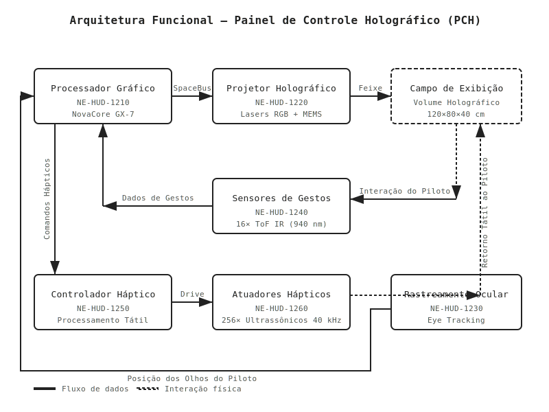
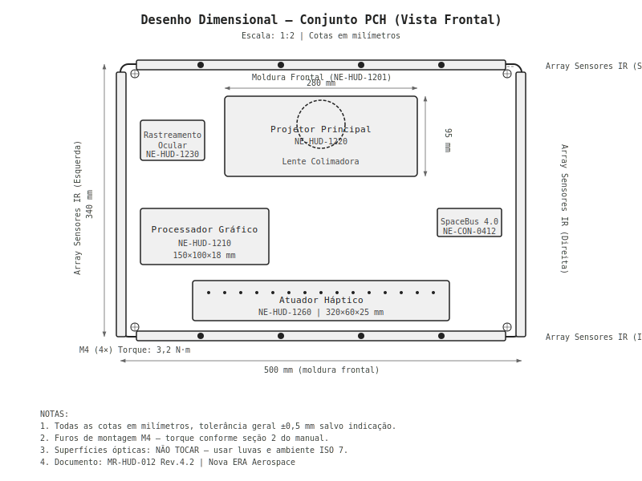
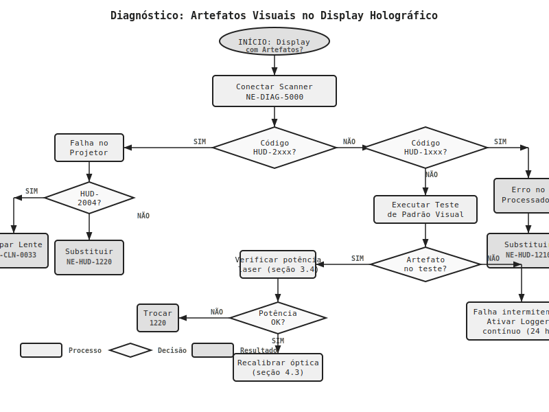
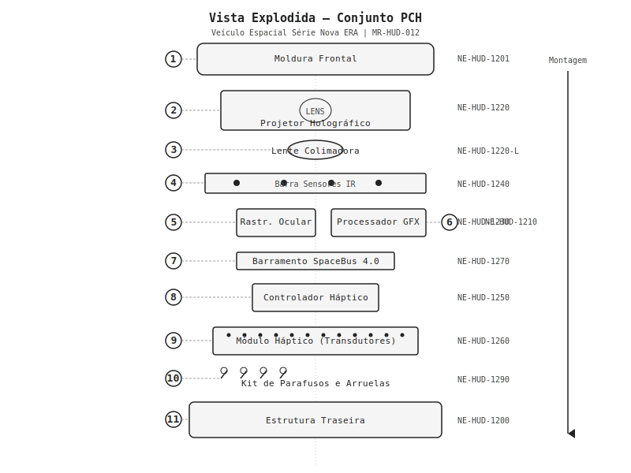
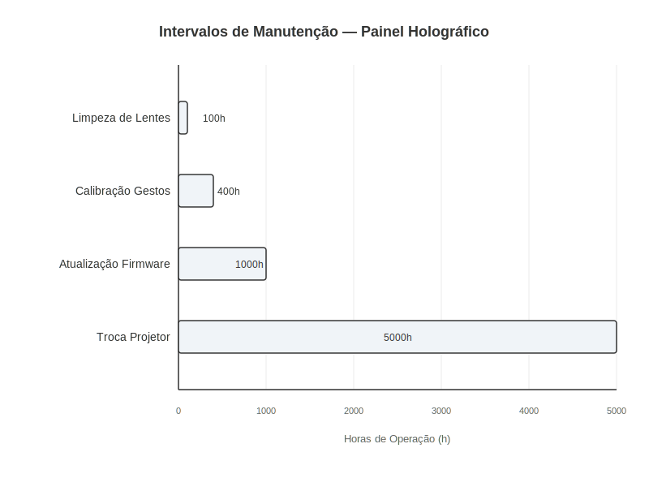

# Painel de Controle Holográfico

**Veículo Espacial Série Databricks Galáctica — Manual de Reparo Técnico**
**Documento:** MR-HUD-012 | **Revisão:** 4.2 | **Data:** 2187-03-15
**Classificação:** Nível 3 — Técnico Certificado em Sistemas de Interface

> **AVISO DE SEGURANÇA GERAL:** O Painel de Controle Holográfico opera com lasers de Classe 3B e campos eletromagnéticos de alta frequência. A exposição direta ao feixe do projetor sem proteção ocular adequada (óculos NE-PPE-0045 ou superior) pode causar danos permanentes à retina. Sempre desenergize o sistema e aguarde o ciclo completo de descarga (mínimo 90 segundos) antes de abrir qualquer módulo interno.

---

## 1. Visão Geral e Princípios de Funcionamento

O Painel de Controle Holográfico (PCH) do Veículo Espacial Série Databricks Galáctica representa a interface primária entre o piloto e todos os subsistemas da nave. Diferentemente dos painéis convencionais de tela plana utilizados em gerações anteriores, o PCH projeta informações tridimensionais em um volume de exibição de 120 cm x 80 cm x 40 cm diretamente à frente do piloto, permitindo interação por gestos, comandos de voz e retorno háptico simulado.

### 1.1 Teoria de Projeção Holográfica

O sistema de projeção holográfica do PCH utiliza a tecnologia de **Interferência Laser Multifocal Dinâmica (ILMD)**, desenvolvida pela Databricks Galáctica Aerospace. O princípio baseia-se na interseção controlada de múltiplos feixes laser coerentes no espaço livre, criando pontos de plasma luminescente em coordenadas tridimensionais precisas.

O processador gráfico dedicado (**NE-HUD-1210**) calcula em tempo real as posições de cada voxel, convertendo-os em sinais para o array de 2.048 micro-espelhos MEMS do projetor (**NE-HUD-1220**), que direcionam os feixes laser RGB (638 nm, 520 nm, 450 nm) para as coordenadas calculadas. A taxa de atualização é de 240 Hz, estável até 8G sustentados, com compensação automática de vibrações via rastreamento ocular (**NE-HUD-1240**).

### 1.2 Sistema de Reconhecimento de Gestos

O reconhecimento de gestos é realizado por 16 sensores infravermelhos de profundidade (ToF — Time of Flight), distribuídos ao redor do campo de exibição. Resolução espacial de 0,5 mm, latência inferior a 8 ms. O firmware GestOS v7.4.2 identifica 128 gestos pré-programados:

- **Gestos de navegação:** deslizar, girar, aproximar/afastar (pinch-zoom)
- **Gestos de comando:** tocar, pressionar longo, duplo toque
- **Gestos de segurança:** punho fechado (parada de emergência), palma aberta (confirmação crítica)
- **Gestos customizados:** até 32 gestos definidos pelo piloto

O sistema utiliza aprendizado de máquina embarcado para adaptar-se ao estilo gestual de cada piloto, reduzindo falsos positivos após ~40 horas de uso.

### 1.3 Sistema de Retorno Háptico

O retorno háptico é gerado por **transdutores ultrassônicos focalizados** (**NE-HUD-1260**), operando a 40 kHz. Ao convergirem em pontos no espaço, criam zonas de pressão acústica perceptíveis ao toque — botões oferecem "clique", sliders oferecem "arrasto", superfícies oferecem "textura". Intensidade ajustável de 0,1 Pa a 3,2 Pa.

### 1.4 Arquitetura do Sistema

O diagrama abaixo ilustra a arquitetura funcional completa do Painel de Controle Holográfico e o fluxo de dados entre seus componentes principais.

| Componente | Número de Peça | Função Principal | Tensão de Operação | Consumo Máximo |
|---|---|---|---|---|
| Processador Gráfico Holográfico | NE-HUD-1210 | Renderização 3D em tempo real | 3,3 V DC | 85 W |
| Projetor Holográfico Principal | NE-HUD-1220 | Geração de feixes laser e projeção | 12 V DC | 120 W |
| Módulo de Rastreamento Ocular | NE-HUD-1230 | Tracking da posição dos olhos do piloto | 5 V DC | 8 W |
| Array de Sensores de Gestos | NE-HUD-1240 | Captura de movimentos das mãos | 5 V DC | 12 W |
| Controlador Háptico Central | NE-HUD-1250 | Processamento de sinais hápticos | 5 V DC | 15 W |
| Módulo de Transdutores Hápticos | NE-HUD-1260 | Geração de campos ultrassônicos | 24 V DC | 45 W |
| Barramento de Dados PCH | NE-HUD-1270 | Comunicação inter-módulos (SpaceBus 4.0) | 3,3 V DC | 5 W |

> **NOTA TÉCNICA:** O consumo total do sistema PCH em operação plena é de aproximadamente 290 W. O circuito de proteção térmica (integrado ao NE-HUD-1270) reduz automaticamente a luminosidade e a taxa de atualização se a temperatura interna ultrapassar 65°C, entrando em modo de proteção total a 80°C.

---

## 2. Especificações Técnicas

Especificações completas de cada módulo, incluindo dimensões, parâmetros elétricos e tolerâncias.

### 2.1 Módulo Projetor Holográfico (NE-HUD-1220)

| Parâmetro | Especificação | Tolerância |
|---|---|---|
| Resolução volumétrica | 1.920 x 1.080 x 512 voxels | ± 0,5% |
| Taxa de atualização | 240 Hz | ± 2 Hz |
| Profundidade de cor | 36 bits (12 bits por canal RGB) | — |
| Ângulo de projeção horizontal | 120° | ± 1° |
| Ângulo de projeção vertical | 80° | ± 1° |
| Profundidade do campo holográfico | 40 cm | ± 0,5 cm |
| Luminosidade máxima | 12.000 nits | ± 500 nits |
| Contraste | 100.000:1 | Mínimo 80.000:1 |
| Vida útil do laser | 25.000 horas | — |
| Dimensões (C x L x A) | 280 mm x 180 mm x 95 mm | ± 0,2 mm |
| Massa | 2,4 kg | ± 50 g |
| Temperatura de operação | -20°C a +55°C | — |
| Torque de montagem (parafusos M4) | 2,8 N·m | ± 0,2 N·m |

### 2.2 Array de Sensores de Gestos (NE-HUD-1240)

| Parâmetro | Especificação | Tolerância |
|---|---|---|
| Número de sensores ToF | 16 unidades | — |
| Resolução espacial | 0,5 mm | ± 0,1 mm |
| Alcance máximo de detecção | 80 cm | ± 2 cm |
| Latência de detecção | < 8 ms | Máximo 12 ms |
| Campo de visão por sensor | 70° x 55° | ± 2° |
| Frequência de amostragem | 500 Hz | ± 10 Hz |
| Comprimento de onda IR | 940 nm | ± 5 nm |
| Potência IR por emissor | 150 mW | ± 10 mW |
| Distribuição no painel | 4 superior, 4 inferior, 4 esquerda, 4 direita | — |
| Conector | SpaceBus 4.0 Tipo C (NE-CON-0412) | — |
| Torque de montagem (parafusos M3) | 1,5 N·m | ± 0,1 N·m |

### 2.3 Módulo de Transdutores Hápticos (NE-HUD-1260)

| Parâmetro | Especificação | Tolerância |
|---|---|---|
| Número de transdutores | 256 (matriz 16 x 16) | — |
| Frequência ultrassônica | 40 kHz | ± 0,5 kHz |
| Pressão acústica máxima | 3,2 Pa (a 30 cm) | ± 0,3 Pa |
| Resolução do ponto focal | 8,5 mm | ± 0,5 mm |
| Número de pontos focais simultâneos | 8 | — |
| Latência | < 5 ms | Máximo 8 ms |
| Dimensões da placa | 320 mm x 60 mm x 25 mm | ± 0,3 mm |
| Massa | 680 g | ± 20 g |
| Conector de alimentação | NE-PWR-0024 (24V / 3A) | — |
| Torque de montagem (parafusos M3) | 1,2 N·m | ± 0,1 N·m |

### 2.4 Processador Gráfico Holográfico (NE-HUD-1210)

| Parâmetro | Especificação | Tolerância |
|---|---|---|
| Arquitetura | NovaCore GX-7 (64 núcleos gráficos) | — |
| Clock base | 2,4 GHz | ± 50 MHz |
| Clock turbo | 3,8 GHz | — |
| Memória integrada | 16 GB HBM3e | — |
| Largura de banda de memória | 1,2 TB/s | Mínimo 1,0 TB/s |
| Interface de dados | SpaceBus 4.0 (40 Gbps) | — |
| Firmware atual | HoloRender v12.1.8 | — |
| Dissipação térmica | Heatpipe + dissipador passivo | — |
| Dimensões da placa | 150 mm x 100 mm x 18 mm | ± 0,2 mm |
| Massa | 320 g | ± 15 g |
| Torque de montagem (parafusos M2.5) | 0,8 N·m | ± 0,05 N·m |

### 2.5 Desenho Dimensional do Conjunto

Dimensões do conjunto montado e posições dos componentes.

### 2.6 Peças de Reposição e Consumíveis

| Número de Peça | Descrição | Categoria | Intervalo de Troca | Preço Ref. (Créditos) |
|---|---|---|---|---|
| NE-HUD-1220 | Projetor Holográfico Principal | Módulo | 25.000 h ou conforme diagnóstico | 8.500 |
| NE-HUD-1220-L | Kit de Lentes (3 unidades) | Consumível | 5.000 h | 1.200 |
| NE-HUD-1240 | Array de Sensores de Gestos | Módulo | Conforme diagnóstico | 3.800 |
| NE-HUD-1240-F | Filtro IR para Sensor (pacote c/ 16) | Consumível | 2.000 h | 240 |
| NE-HUD-1260 | Módulo de Transdutores Hápticos | Módulo | 15.000 h ou conforme diagnóstico | 4.200 |
| NE-HUD-1260-M | Membrana do Transdutor (pacote c/ 32) | Consumível | 8.000 h | 580 |
| NE-HUD-1210 | Processador Gráfico Holográfico | Módulo | Conforme diagnóstico | 12.400 |
| NE-HUD-1270 | Barramento de Dados PCH | Módulo | Conforme diagnóstico | 2.100 |
| NE-HUD-1230 | Módulo de Rastreamento Ocular | Módulo | 20.000 h ou conforme diagnóstico | 2.900 |
| NE-CAL-0087 | Kit de Calibração de Campo (ferramenta) | Ferramenta | — | 6.700 |
| NE-CLN-0033 | Kit de Limpeza Óptica (10 sessões) | Consumível | Conforme necessidade | 85 |
| NE-THM-0019 | Pasta Térmica HoloGrade (5 g) | Consumível | A cada desmontagem | 45 |

---

## 3. Procedimento de Diagnóstico

Procedimentos para identificação e isolamento de falhas. Realizar com o veículo em modo de manutenção (ignição "MAINT").

> **AVISO DE SEGURANÇA:** Utilize OBRIGATORIAMENTE óculos de proteção laser NE-PPE-0045 durante diagnósticos com projetor ativo.

### 3.1 Ferramentas de Diagnóstico Necessárias

| Ferramenta | Número de Peça | Função |
|---|---|---|
| Scanner de Diagnóstico Universal Databricks Galáctica | NE-DIAG-5000 | Leitura de códigos de falha e telemetria |
| Kit de Calibração de Campo Holográfico | NE-CAL-0087 | Alvos de referência para calibração óptica |
| Medidor de Potência Laser | NE-MET-0122 | Verificação da potência de saída dos lasers |
| Analisador de Espectro Ultrassônico | NE-MET-0198 | Diagnóstico do módulo háptico |
| Cartão de Teste de Sensores IR | NE-TST-0045 | Verificação individual dos sensores ToF |
| Multímetro SpaceBus 4.0 | NE-MET-0301 | Verificação de integridade do barramento |

### 3.2 Códigos de Falha do Sistema PCH

Códigos no formato **HUD-XXXX** (primeiros 2 dígitos = subsistema, últimos 2 = falha).

| Código | Descrição | Subsistema | Severidade |
|---|---|---|---|
| HUD-1001 | Falha de inicialização do processador gráfico | NE-HUD-1210 | Crítica |
| HUD-1002 | Temperatura do processador acima do limite | NE-HUD-1210 | Alta |
| HUD-1003 | Erro de checksum de firmware | NE-HUD-1210 | Crítica |
| HUD-2001 | Potência do laser abaixo do limiar | NE-HUD-1220 | Média |
| HUD-2002 | Falha no array de micro-espelhos | NE-HUD-1220 | Crítica |
| HUD-2003 | Desalinhamento óptico detectado | NE-HUD-1220 | Alta |
| HUD-2004 | Contaminação da lente colimadora | NE-HUD-1220 | Média |
| HUD-3001 | Sensor ToF sem resposta (identificar número) | NE-HUD-1240 | Média |
| HUD-3002 | Calibração de gestos fora da tolerância | NE-HUD-1240 | Baixa |
| HUD-3003 | Interferência IR externa detectada | NE-HUD-1240 | Baixa |
| HUD-4001 | Transdutor háptico em curto | NE-HUD-1260 | Média |
| HUD-4002 | Pressão acústica abaixo do limiar | NE-HUD-1260 | Baixa |
| HUD-4003 | Falha no controlador háptico | NE-HUD-1250 | Alta |
| HUD-5001 | Erro de comunicação SpaceBus | NE-HUD-1270 | Alta |
| HUD-5002 | Timeout de barramento | NE-HUD-1270 | Média |

### 3.3 Procedimento de Diagnóstico: Artefatos Visuais no Display

Artefatos visuais (cintilação, pixels fantasma, distorção, perda de cor) são a queixa mais comum. Siga o fluxograma abaixo.

**Passos detalhados:**

1. Conecte o Scanner NE-DIAG-5000 à porta de diagnóstico SpaceBus localizada no painel lateral esquerdo (conector NE-CON-0412-D).
2. Acesse o menu **Diagnóstico > PCH > Leitura de Falhas** e registre todos os códigos ativos e pendentes.
3. Execute o teste integrado de projeção acessando **Diagnóstico > PCH > Teste de Padrão**. O sistema exibirá uma sequência de padrões de teste (grade, gradiente de cor, escala de cinza).
4. Avalie visualmente o padrão de teste e classifique o artefato conforme a tabela abaixo:

| Sintoma Observado | Causa Provável | Código Esperado | Ação Recomendada |
|---|---|---|---|
| Cintilação uniforme em todo o campo | Frequência do laser instável | HUD-2001 | Verificar potência laser (seção 3.4) |
| Pontos brilhantes fixos ("pixels mortos") | Micro-espelhos MEMS travados | HUD-2002 | Substituir projetor NE-HUD-1220 |
| Distorção geométrica (linhas curvas) | Desalinhamento óptico | HUD-2003 | Recalibrar óptica (seção 4.3) |
| Mancha difusa ou halo | Contaminação da lente | HUD-2004 | Limpar ou substituir lente |
| Perda de uma cor (R, G ou B ausente) | Falha em laser individual | HUD-2001 | Substituir projetor NE-HUD-1220 |
| Imagem "congelada" ou corrompida | Falha no processador gráfico | HUD-1001 | Verificar NE-HUD-1210 (seção 3.5) |

5. Se sem código de falha e padrão OK, ative o logger contínuo (**Diagnóstico > PCH > Logger > Iniciar**) por 24 horas.
6. Recupere e analise os logs no NovaERA Diagnostics Suite (v8.2+).

### 3.4 Verificação da Potência Laser

1. Desenergize o sistema PCH e aguarde 90 segundos para descarga completa.
2. Remova a tampa de acesso ao projetor (4 parafusos M4 Torx T20, torque de remoção máximo: 3,0 N·m).
3. Conecte o Medidor de Potência Laser NE-MET-0122 à porta de teste óptica do projetor (indicada com etiqueta amarela "TEST PORT").
4. Reenergize o sistema em modo de diagnóstico (**Diagnóstico > PCH > Modo Laser Teste**).
5. O sistema ativará cada laser individualmente. Registre as leituras conforme a tabela:

| Laser | Comprimento de Onda | Potência Nominal | Potência Mínima Aceitável |
|---|---|---|---|
| Vermelho (R) | 638 nm | 450 mW | 380 mW |
| Verde (G) | 520 nm | 520 mW | 440 mW |
| Azul (B) | 450 nm | 480 mW | 400 mW |

6. Se qualquer laser estiver abaixo da potência mínima aceitável, o módulo projetor NE-HUD-1220 deve ser substituído integralmente (os lasers não são substituíveis individualmente).
7. Desenergize e reconecte o medidor. Reinstale a tampa de acesso com torque de 2,8 N·m (± 0,2 N·m).

### 3.5 Diagnóstico do Processador Gráfico

1. Acesse **Diagnóstico > PCH > Processador > Autodiagnóstico Completo** (~3 minutos).
2. Testes executados: memória HBM3e, integridade firmware (SHA-256), rendering pipeline, comunicação SpaceBus (loopback).
3. Qualquer falha indica substituição do NE-HUD-1210 (sem componentes reparáveis em campo).

### 3.6 Diagnóstico do Sistema de Gestos

1. Acesse **Diagnóstico > PCH > Sensores > Teste Individual**.
2. O sistema verificará cada um dos 16 sensores ToF sequencialmente, exibindo status "OK", "DEGRADADO" ou "FALHA" para cada unidade.
3. Utilize o Cartão de Teste NE-TST-0045 para verificação manual: posicione o cartão a 40 cm do sensor indicado e confirme a leitura de distância no scanner (tolerância: ± 2 mm).
4. Sensores com status "DEGRADADO" podem ser recuperados com limpeza do filtro IR. Sensores com status "FALHA" requerem substituição do array completo NE-HUD-1240.

### 3.7 Diagnóstico do Sistema Háptico

1. Conecte o Analisador de Espectro Ultrassônico NE-MET-0198 ao ponto de medição háptico (etiqueta azul "HAPTIC TEST" na borda inferior do painel).
2. Acesse **Diagnóstico > PCH > Háptico > Varredura de Transdutores**.
3. O sistema ativará cada transdutor individualmente. O analisador deve registrar:
   - Frequência: 40 kHz (± 0,5 kHz)
   - Amplitude: mínimo 70% da nominal
4. Transdutores que falharem podem indicar falha individual (até 10% de falha é aceitável sem impacto perceptível) ou falha no controlador NE-HUD-1250 (se mais de 25% falharem simultaneamente).

---

## 4. Procedimento de Reparo / Substituição

Procedimentos de substituição dos módulos principais. Requer técnico Nível 3 e ambiente ISO 7.

> **AVISO DE SEGURANÇA:** Antes de qualquer reparo: (1) desenergizar completamente, (2) aguardar descarga de 90s (LED "SAFE" verde), (3) conectar pulseira antiestática ao ponto ESD, (4) ter óculos NE-PPE-0045 disponíveis.

### 4.1 Substituição do Módulo Projetor Holográfico (NE-HUD-1220)

**Tempo estimado:** 45 minutos
**Peças necessárias:** NE-HUD-1220 (projetor novo), NE-THM-0019 (pasta térmica)
**Ferramentas:** Chave Torx T20, Chave Torx T10, Chave Allen 2,5 mm, Kit de Calibração NE-CAL-0087

**Procedimento de remoção:**

1. Desenergize o sistema e aguarde o ciclo de descarga (90 segundos, LED "SAFE" verde).
2. Remova a moldura frontal do painel: 8 parafusos Torx T20 ao longo da borda (torque de remoção máximo: 3,5 N·m). Puxe a moldura para frente com cuidado, desconectando o cabo flat de iluminação ambiente (conector NE-CON-0089).
3. Localize o módulo projetor na posição central superior da estrutura interna.
4. Desconecte os seguintes cabos do projetor:
   - Cabo de dados SpaceBus (conector azul, lado esquerdo)
   - Cabo de alimentação 12 V (conector vermelho, lado direito)
   - Cabo de sincronização óptica (conector verde, parte inferior)
5. Remova os 4 parafusos de montagem do projetor (Torx T10, torque de remoção máximo: 3,0 N·m). Os parafusos possuem arruelas de pressão cativas — não as perca.
6. Deslize o projetor para frente e retire-o da estrutura. Tome cuidado para não tocar na superfície da lente colimadora.

**Procedimento de instalação:**

7. Limpe a superfície de montagem com álcool isopropílico 99% e um pano livre de fiapos.
8. Aplique uma camada fina de pasta térmica NE-THM-0019 na interface térmica do novo projetor (superfície inferior, área marcada com "TIM").
9. Posicione o novo projetor nos pinos guia da estrutura e deslize-o para trás até encaixar completamente.
10. Instale os 4 parafusos de montagem em sequência cruzada (diagonal), aplicando torque de **2,8 N·m** (± 0,2 N·m).
11. Reconecte os 3 cabos na ordem inversa da remoção: sincronização óptica, alimentação, dados.
12. Reinstale a moldura frontal: reconecte o cabo flat de iluminação e instale os 8 parafusos Torx T20 com torque de **3,2 N·m** (± 0,2 N·m).
13. Prossiga para o procedimento de calibração (seção 4.3).

### 4.2 Substituição do Array de Sensores de Gestos (NE-HUD-1240)

**Tempo estimado:** 30 minutos
**Peças necessárias:** NE-HUD-1240 (array de sensores novo)
**Ferramentas:** Chave Torx T10, Chave Torx T8, Kit de Calibração NE-CAL-0087

1. Desenergize o sistema e aguarde o ciclo de descarga.
2. Remova a moldura frontal conforme descrito no passo 2 da seção 4.1.
3. Os sensores estão distribuídos em 4 barras ao redor do campo de exibição. Cada barra contém 4 sensores e é fixada por 3 parafusos Torx T8.
4. Desconecte o cabo flat de dados de cada barra (conectores tipo ZIF — levante a trava antes de puxar o cabo).
5. Remova os parafusos (torque máximo de remoção: 1,8 N·m) e retire cada barra.
6. Instale as novas barras de sensores na mesma orientação (seta indicativa "UP" deve apontar para cima na barra superior e para fora nas barras laterais).
7. Fixe com torque de **1,5 N·m** (± 0,1 N·m) nos parafusos M3.
8. Reconecte os cabos flat (inserir até o fim e abaixar a trava ZIF).
9. Reinstale a moldura frontal.
10. Prossiga para calibração de gestos (seção 4.4).

### 4.3 Calibração do Projetor Holográfico

> **NOTA:** Este procedimento é obrigatório após qualquer substituição ou remontagem do módulo projetor.

1. Posicione os 3 alvos de referência do Kit NE-CAL-0087 nas posições marcadas no cockpit:
   - Alvo A: suporte central do parabrisas (distância: 60 cm do projetor)
   - Alvo B: console lateral esquerdo (distância: 55 cm, ângulo 45°)
   - Alvo C: console lateral direito (distância: 55 cm, ângulo -45°)
2. Energize o sistema em modo de calibração: **Configurações > PCH > Calibração > Projetor > Iniciar**.
3. O sistema projetará pontos de referência sobre cada alvo. Confirme o alinhamento visual de cada ponto.
4. Se houver desvio, utilize os comandos de ajuste fino no scanner:
   - Ajuste horizontal: passos de 0,1°
   - Ajuste vertical: passos de 0,1°
   - Ajuste de foco: passos de 0,5 mm
5. Após alinhar todos os 3 alvos, confirme a calibração. O sistema executará uma verificação automática e reportará "CALIBRAÇÃO OK" ou indicará qual alvo necessita reajuste.
6. Registre os parâmetros de calibração no log de manutenção da nave.

### 4.4 Calibração dos Sensores de Gestos

1. Energize o sistema em modo de calibração: **Configurações > PCH > Calibração > Gestos > Iniciar**.
2. Posicione a mão aberta no centro do campo de exibição quando solicitado.
3. Siga as instruções na tela do scanner, realizando os 5 gestos de calibração:
   - Palma aberta estática (5 segundos)
   - Punho fechado (5 segundos)
   - Movimento lateral esquerda-direita (3 repetições)
   - Movimento vertical cima-baixo (3 repetições)
   - Gesto de pinça (aproximar e afastar dedos, 3 repetições)
4. O sistema reportará a precisão da calibração. Valores aceitáveis: > 98% de acerto.
5. Se a precisão estiver abaixo de 98%, repita a calibração. Se após 3 tentativas a precisão permanecer insuficiente, verifique se há obstruções ou contaminação nos sensores.

### 4.5 Substituição do Módulo Háptico (NE-HUD-1260)

**Tempo estimado:** 25 minutos
**Peças necessárias:** NE-HUD-1260 (módulo háptico novo)
**Ferramentas:** Chave Torx T10, Chave Allen 2,0 mm

1. Desenergize o sistema e aguarde o ciclo de descarga.
2. O módulo háptico é acessível pela parte inferior do painel. Remova a tampa inferior (6 parafusos Allen 2,0 mm, torque máximo de remoção: 1,5 N·m).
3. Desconecte o cabo de alimentação 24 V (conector laranja) e o cabo de dados (conector azul).
4. Remova os 4 parafusos de montagem Torx T10 (torque máximo de remoção: 1,5 N·m).
5. Deslize o módulo para baixo e retire-o.
6. Instale o novo módulo, alinhando com os pinos guia. Fixe com torque de **1,2 N·m** (± 0,1 N·m).
7. Reconecte os cabos de dados e alimentação.
8. Reinstale a tampa inferior com torque de **1,0 N·m** (± 0,1 N·m) nos parafusos Allen.
9. Energize o sistema e execute **Diagnóstico > PCH > Háptico > Verificação Rápida** para confirmar operação.

### 4.6 Vista Explodida do Conjunto PCH

Vista explodida do conjunto completo.

| Posição na Vista Explodida | Componente | Número de Peça | Quantidade |
|---|---|---|---|
| 1 | Moldura Frontal | NE-HUD-1201 | 1 |
| 2 | Projetor Holográfico | NE-HUD-1220 | 1 |
| 3 | Lente Colimadora | NE-HUD-1220-L | 1 (incluída no kit) |
| 4 | Barra de Sensores Superior | NE-HUD-1240-T | 1 |
| 5 | Barra de Sensores Inferior | NE-HUD-1240-B | 1 |
| 6 | Barras de Sensores Laterais | NE-HUD-1240-S | 2 |
| 7 | Módulo Háptico | NE-HUD-1260 | 1 |
| 8 | Processador Gráfico | NE-HUD-1210 | 1 |
| 9 | Barramento de Dados | NE-HUD-1270 | 1 |
| 10 | Módulo de Rastreamento Ocular | NE-HUD-1230 | 1 |
| 11 | Estrutura Traseira | NE-HUD-1200 | 1 |
| 12 | Kit de Parafusos e Arruelas | NE-HUD-1290 | 1 (conjunto) |

---

## 5. Manutenção Preventiva e Intervalos

Manutenção preventiva essencial para confiabilidade do sistema. Intervalos em horas de operação (horímetro em **Configurações > PCH > Informações > Horímetro**). Em ambientes com alta concentração de partículas, reduzir intervalos em 30%.

### 5.1 Cronograma de Manutenção

Cronograma visual dos intervalos recomendados.

### 5.2 Tabela de Intervalos de Manutenção

| Tarefa | Intervalo (Horas) | Nível do Técnico | Tempo Estimado | Peças/Consumíveis |
|---|---|---|---|---|
| Limpeza das lentes do projetor | 100 h | Nível 1 (Operador) | 10 min | NE-CLN-0033 |
| Inspeção visual dos sensores IR | 100 h | Nível 1 (Operador) | 5 min | — |
| Limpeza dos filtros IR dos sensores | 200 h | Nível 2 (Técnico Básico) | 15 min | NE-CLN-0033 |
| Verificação de calibração de gestos | 400 h | Nível 2 (Técnico Básico) | 20 min | NE-CAL-0087 |
| Teste funcional do sistema háptico | 400 h | Nível 2 (Técnico Básico) | 15 min | NE-MET-0198 |
| Verificação da potência laser | 500 h | Nível 3 (Técnico Certificado) | 30 min | NE-MET-0122 |
| Recalibração completa do projetor | 1.000 h | Nível 3 (Técnico Certificado) | 45 min | NE-CAL-0087 |
| Atualização de firmware (quando disponível) | 1.000 h ou conforme boletim | Nível 2 (Técnico Básico) | 20 min | — |
| Substituição dos filtros IR | 2.000 h | Nível 2 (Técnico Básico) | 30 min | NE-HUD-1240-F |
| Substituição do kit de lentes | 5.000 h | Nível 3 (Técnico Certificado) | 45 min | NE-HUD-1220-L |
| Substituição das membranas hápticas | 8.000 h | Nível 3 (Técnico Certificado) | 60 min | NE-HUD-1260-M |
| Revisão geral do sistema PCH | 10.000 h | Nível 3 (Técnico Certificado) | 4 h | Diversos (ver checklist) |

### 5.3 Procedimento: Limpeza das Lentes do Projetor

Procedimento mais frequente, realizável pelo operador sem técnico especializado.

1. Coloque o veículo em modo de manutenção (ignição em "MAINT").
2. Aguarde o desligamento automático do PCH (5 segundos) e confirme que o LED "SAFE" está verde.
3. Abra o kit de limpeza NE-CLN-0033 e retire um lenço de microfibra e uma ampola de solução de limpeza óptica.
4. Localize a janela de acesso rápido à lente (tampa articulada na borda superior do painel, identificada com o símbolo de lente).
5. Abra a tampa articulada pressionando a trava de mola.
6. Aplique 2-3 gotas de solução de limpeza no lenço de microfibra (NUNCA diretamente na lente).
7. Limpe a superfície da lente com movimentos circulares suaves, do centro para as bordas.
8. Utilize a extremidade seca do lenço para remover qualquer resíduo de solução.
9. Feche a tampa articulada até ouvir o clique de travamento.
10. Retorne a ignição à posição normal e verifique a qualidade da projeção.

> **CUIDADO:** Nunca utilize solventes comuns, álcool ou materiais abrasivos na lente colimadora. A superfície possui revestimento anti-reflexo multicamada que pode ser danificado irreversivelmente por produtos químicos inadequados. Utilize EXCLUSIVAMENTE o kit NE-CLN-0033 ou equivalente aprovado pela Databricks Galáctica.

### 5.4 Procedimento: Atualização de Firmware

Atualizações distribuídas via NovaLink ou mídia física (NE-MED-0001).

1. Verifique a versão atual: **Configurações > PCH > Informações > Versão de Firmware**.
2. Compare com a versão disponível no catálogo NovaLink ou boletim técnico.
3. Faça o download ou insira a mídia na porta de dados do painel lateral.
4. Coloque o veículo em modo de manutenção.
5. Acesse **Configurações > PCH > Firmware > Atualização**.
6. Selecione a fonte (NovaLink ou Mídia Externa) e confirme.
7. **NÃO DESLIGUE O VEÍCULO OU INTERROMPA O PROCESSO** — a atualização leva entre 3 e 8 minutos dependendo do tamanho do pacote.
8. Após a conclusão, o sistema reiniciará automaticamente e exibirá a nova versão.
9. Execute um diagnóstico rápido (**Diagnóstico > PCH > Verificação Pós-Atualização**) para confirmar a integridade do firmware.
10. Registre a atualização no log de manutenção com: versão anterior, versão nova, data e hora, técnico responsável.

| Módulo | Firmware Atual (Rev. 4.2 do manual) | Método de Atualização |
|---|---|---|
| Processador Gráfico (NE-HUD-1210) | HoloRender v12.1.8 | NovaLink ou mídia |
| Sensores de Gestos (NE-HUD-1240) | GestOS v7.4.2 | Via processador gráfico |
| Controlador Háptico (NE-HUD-1250) | HapticCore v4.0.9 | Via processador gráfico |
| Rastreamento Ocular (NE-HUD-1230) | EyeTrack v3.2.1 | Via processador gráfico |
| Barramento de Dados (NE-HUD-1270) | BusCtrl v2.1.0 | Mídia física apenas |

### 5.5 Registro de Manutenção

Registrar todas as atividades no Log Eletrônico de Manutenção (LEM):

| Campo | Descrição | Exemplo |
|---|---|---|
| Data Estelar | Data e hora no formato estelar padrão | 2187.074.1430 |
| Horímetro PCH | Leitura atual do horímetro | 4.287 h |
| Código da Tarefa | Código conforme tabela de intervalos | MP-PCH-001 (Limpeza Lentes) |
| Técnico | Identificação e nível de certificação | TEC-4492 / Nível 3 |
| Peças Utilizadas | Números de peça e lotes | NE-CLN-0033 Lote 2187-A |
| Observações | Notas relevantes sobre condição encontrada | Lente com leve embaçamento, limpa com sucesso |
| Status Final | Resultado do teste pós-manutenção | APROVADO / REPROVADO |

### 5.6 Lista de Verificação de Revisão Geral (10.000 h)

Lista completa de verificações da revisão geral (10.000 h):

| Item | Verificação | Critério de Aprovação | Ação se Reprovado |
|---|---|---|---|
| 1 | Potência laser R/G/B | Acima de 85% da nominal | Substituir NE-HUD-1220 |
| 2 | Uniformidade do campo holográfico | Variação < 10% centro-borda | Recalibrar ou substituir projetor |
| 3 | Estado da lente colimadora | Sem arranhões visíveis, transmissão > 95% | Substituir kit de lentes NE-HUD-1220-L |
| 4 | Resposta dos 16 sensores ToF | Todos com status "OK" | Substituir NE-HUD-1240 |
| 5 | Precisão de gestos | > 98% de acerto | Recalibrar ou substituir sensores |
| 6 | Pressão acústica háptica | > 70% da nominal em todos os transdutores | Substituir membranas ou módulo |
| 7 | Temperatura do processador em carga | < 75°C após 30 min em carga máxima | Substituir pasta térmica, verificar dissipador |
| 8 | Integridade do barramento SpaceBus | Zero erros em teste de loopback de 10 min | Substituir NE-HUD-1270 |
| 9 | Versão de firmware de todos os módulos | Versão mais recente instalada | Atualizar |
| 10 | Estado dos conectores e cabos | Sem corrosão, dano mecânico ou folga | Substituir cabo/conector afetado |
| 11 | Fixação mecânica de todos os módulos | Torque dentro da especificação | Retorquear conforme valores da seção 2 |
| 12 | Calibração completa (projetor + gestos) | Dentro das tolerâncias | Recalibrar |

---

**Fim do documento MR-HUD-012 — Painel de Controle Holográfico**
**Próxima revisão programada:** 2188-01-15 | **Responsável:** Engenharia de Sistemas de Interface, Databricks Galáctica Aerospace
