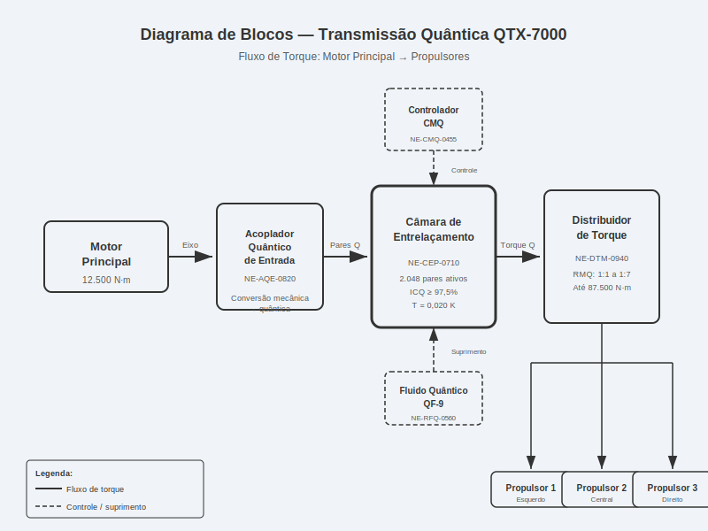
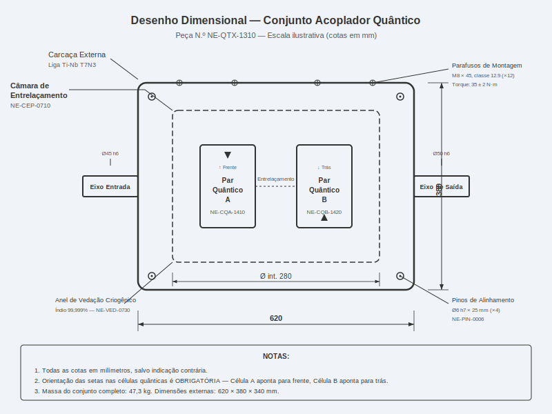
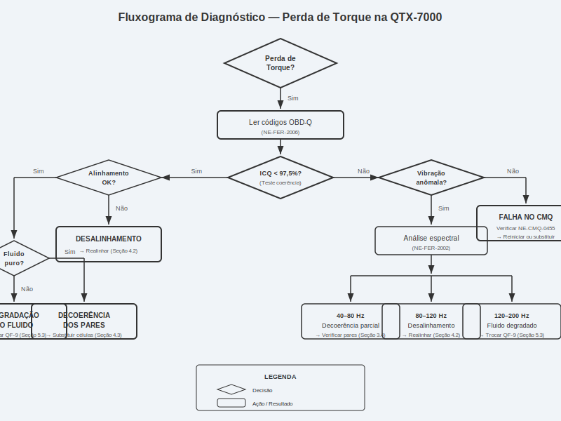
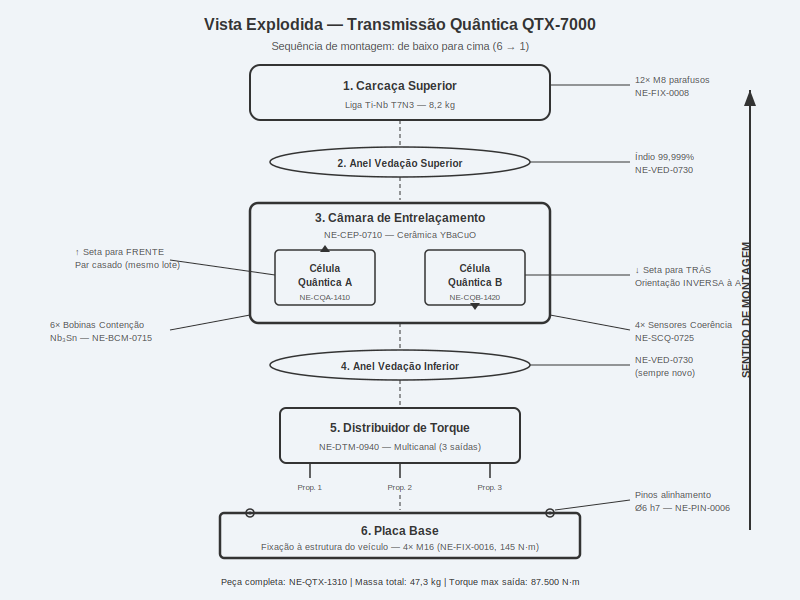
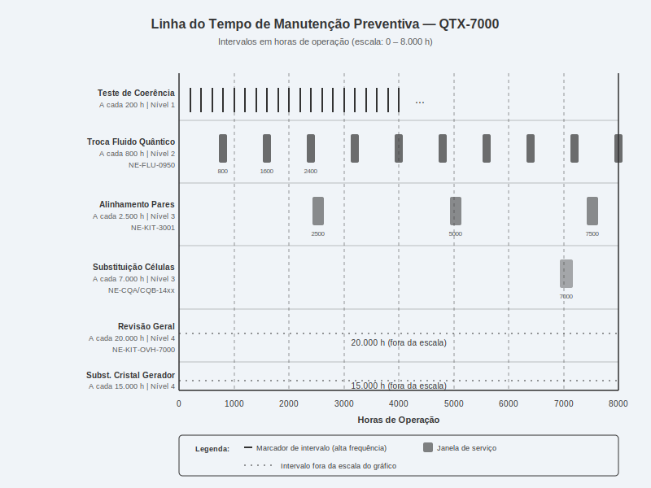

# Transmissão Quântica

**Manual de Serviço — Veículo Espacial Série Databricks Galáctica**
**Documento:** NE-MAN-QTX-2076-R3
**Classificação:** Nível 2 — Técnico Certificado
**Aplicação:** Modelos Databricks Galáctica 2074–2077 (todas as variantes de propulsão)

---

> **AVISO DE SEGURANÇA GERAL:** A transmissão quântica opera com pares de partículas entrelaçadas em estado de superposição. Qualquer intervenção sem o desligamento prévio do campo de contenção (procedimento NE-SFP-001) pode resultar em colapso de função de onda descontrolado, danos irreversíveis ao sistema de propulsão e risco à integridade física do técnico. Utilize sempre o Equipamento de Proteção Quântica (EPQ) classe III ou superior.

---

## 1. Visão Geral e Princípios de Funcionamento

### 1.1 Introdução ao Sistema de Transmissão Quântica

O sistema de Transmissão Quântica (designação interna **QTX-7000**) representa o coração da cadeia cinemática do Veículo Espacial Série Databricks Galáctica. Diferentemente das transmissões convencionais que dependem de engrenagens mecânicas, correntes ou acoplamentos hidráulicos, a QTX-7000 utiliza o princípio do **entrelaçamento quântico** para transferir torque do motor principal aos propulsores sem qualquer conexão física direta entre os componentes rotativos.

O conceito fundamental baseia-se na criação de **pares de partículas entrelaçadas** (denominados "pares quânticos de torque") que são confinados em câmaras magnéticas especializadas. Quando uma partícula do par é submetida a uma rotação angular em uma extremidade do sistema (lado do motor), sua partícula parceira instantaneamente replica essa rotação na outra extremidade (lado dos propulsores), independentemente da distância entre elas. Este fenômeno, conhecido como **acoplamento entrelaçado sem perdas**, elimina completamente o atrito mecânico, o desgaste de componentes móveis e as perdas térmicas associadas às transmissões tradicionais.

### 1.2 Teoria das Relações de Transmissão Quântica

As relações de transmissão na QTX-7000 não são definidas por diâmetros de engrenagens, mas sim pela **razão de multiplicidade quântica** (RMQ). A RMQ é determinada pelo número de pares entrelaçados alocados a cada canal de saída em relação ao canal de entrada. Por exemplo:

- **RMQ 1:1** — um par entrelaçado por canal; transferência direta de torque sem multiplicação.
- **RMQ 1:3** — três pares entrelaçados no canal de saída para cada par no canal de entrada; o torque é triplicado, porém a velocidade angular é reduzida proporcionalmente.
- **RMQ 1:7** — configuração de máximo torque para manobras de baixa velocidade em ambientes de alta gravidade.

A transição entre relações de transmissão é realizada pelo **Controlador de Multiplexação Quântica (CMQ)**, peça NE-CMQ-0455, que redistribui os pares entrelaçados entre os canais em tempo real, sem qualquer interrupção no fluxo de torque. Este processo leva aproximadamente 0,003 milissegundos, tornando as trocas de marcha imperceptíveis ao operador.

### 1.3 Componentes Principais do Sistema

O sistema de transmissão quântica é composto pelos seguintes módulos principais, interligados pelo barramento de entrelaçamento:

| Componente | Peça N.º | Função | Localização |
|---|---|---|---|
| Câmara de Entrelaçamento Primária | NE-CEP-0710 | Geração e manutenção dos pares quânticos | Compartimento central, baía 3 |
| Acoplador Quântico de Entrada | NE-AQE-0820 | Interface com o eixo do motor principal | Flange traseira do motor |
| Acoplador Quântico de Saída | NE-AQS-0830 | Interface com o distribuidor de torque | Flange dianteira do distribuidor |
| Distribuidor de Torque Multicanal | NE-DTM-0940 | Distribuição do torque entre os propulsores | Módulo inferior, baía 4 |
| Controlador de Multiplexação Quântica | NE-CMQ-0455 | Gestão eletrônica das relações de transmissão | Painel de controle, rack 2 |
| Reservatório de Fluido Quântico | NE-RFQ-0560 | Armazenamento do meio de contenção magnética | Lateral esquerda, baía 3 |

### 1.4 Diagrama de Blocos do Sistema

O diagrama abaixo ilustra o fluxo de torque desde o motor principal até os propulsores, passando pelos componentes críticos da transmissão quântica:

### 1.5 Princípio do Acoplamento sem Perdas

O acoplamento entrelaçado sem perdas é garantido pela manutenção de um **índice de coerência quântica (ICQ)** superior a 97,5%. O ICQ é uma medida da correlação entre os estados rotacionais das partículas entrelaçadas. Quando o ICQ cai abaixo deste limiar, ocorre o fenômeno de **decoerência parcial**, que se manifesta como perda de torque, vibrações anômalas e, em casos extremos, desacoplamento total do sistema.

Os fatores que influenciam o ICQ incluem:

- **Temperatura da câmara de entrelaçamento:** deve ser mantida entre 0,015 K e 0,025 K.
- **Pureza do fluido quântico:** contaminação superior a 0,3 ppm degrada o entrelaçamento.
- **Alinhamento dos pares quânticos:** desalinhamento angular superior a 0,002° causa decoerência progressiva.
- **Interferência eletromagnética externa:** campos acima de 0,5 mT no perímetro da câmara são inaceitáveis.

| Parâmetro | Valor Nominal | Tolerância | Unidade |
|---|---|---|---|
| Índice de Coerência Quântica (ICQ) | 99,2 | ≥ 97,5 | % |
| Temperatura da Câmara | 0,020 | ± 0,005 | K |
| Pureza do Fluido | 99,9997 | ≥ 99,9970 | % |
| Alinhamento Angular | 0,000 | ± 0,002 | graus |
| Campo EM no Perímetro | < 0,1 | ≤ 0,5 | mT |

---

## 2. Especificações Técnicas

### 2.1 Especificações Gerais da Transmissão

A transmissão quântica QTX-7000 foi projetada para atender aos requisitos de torque e potência dos modelos Databricks Galáctica em todas as condições operacionais, desde cruzeiro em espaço profundo até manobras atmosféricas em planetas de alta gravidade (até 3,2 g).

| Especificação | Valor | Unidade |
|---|---|---|
| Modelo | QTX-7000 | — |
| Peça N.º (conjunto completo) | NE-QTX-1310 | — |
| Torque máximo de entrada | 12.500 | N·m |
| Torque máximo de saída (RMQ 1:7) | 87.500 | N·m |
| Rotação máxima de entrada | 28.000 | rpm |
| Eficiência de acoplamento | 99,87 | % |
| Relações de transmissão disponíveis | 1:1, 1:2, 1:3, 1:5, 1:7 | — |
| Tempo de troca de relação | 0,003 | ms |
| Número de pares quânticos ativos | 2.048 | pares |
| Vida útil dos pares quânticos | 7.000 | horas |
| Massa total do conjunto | 47,3 | kg |
| Dimensões (C × L × A) | 620 × 380 × 340 | mm |
| Temperatura operacional da câmara | 0,015 – 0,025 | K |
| Pressão interna da câmara | 1,2 × 10⁻⁸ | Pa |

### 2.2 Especificações da Câmara de Entrelaçamento

A câmara de entrelaçamento (NE-CEP-0710) é o componente mais crítico do sistema. Ela contém o ambiente de ultra-vácuo e ultra-baixa temperatura necessário para a geração e manutenção dos pares quânticos.

| Característica | Especificação | Peça N.º |
|---|---|---|
| Material da carcaça externa | Liga de titânio-nióbio T7N3 | NE-CEP-0710-A |
| Revestimento interno | Cerâmica supercondutora YBaCuO | NE-CEP-0710-B |
| Bobinas de contenção magnética (×6) | Nb₃Sn, 4,7 T cada | NE-BCM-0715 |
| Gerador de pares quânticos | Cristal de GaAs dopado com Er³⁺ | NE-GPQ-0720 |
| Sensor de coerência (×4) | Interferômetro de estado sólido | NE-SCQ-0725 |
| Parafusos de montagem (×12) | M8 × 45, classe 12.9, torque 35 N·m | NE-FIX-0008 |
| Pinos de alinhamento (×4) | Ø6 h7, comprimento 25 mm | NE-PIN-0006 |
| Anel de vedação criogênico | Índio puro 99,999%, Ø interno 280 mm | NE-VED-0730 |

### 2.3 Especificações do Fluido Quântico

O fluido quântico (designação comercial **QuantaLub QF-9**) é o meio que preenche o espaço entre as bobinas de contenção e a câmara interna, servindo como amortecedor de vibrações quânticas e regulador térmico auxiliar.

| Propriedade | Valor | Condição |
|---|---|---|
| Designação | QuantaLub QF-9 | — |
| Peça N.º (1 litro) | NE-FLU-0950 | — |
| Composição base | He-3 superfluido com nanopartículas de grafeno quântico | — |
| Viscosidade cinemática | 0,0 (superfluido) | Abaixo de 2,17 K |
| Condutividade térmica | 8.500 | W/(m·K) a 0,02 K |
| Capacidade do sistema | 1,8 | litros |
| Intervalo de troca | 800 | horas de operação |
| Pureza mínima requerida | 99,9970 | % |
| Cor (indicador de pureza) | Incolor (puro) / Amarelado (contaminado) | Visual |

### 2.4 Desenho Dimensional do Acoplador Quântico

O desenho abaixo apresenta as dimensões principais do conjunto acoplador quântico, incluindo a câmara de entrelaçamento, pares quânticos e eixo de saída:

### 2.5 Torques de Aperto

Todos os torques de aperto devem ser aplicados com torquímetro calibrado (certificação válida por no máximo 6 meses). Utilize sempre o padrão de aperto cruzado.

| Fixador | Localização | Torque (N·m) | Sequência |
|---|---|---|---|
| NE-FIX-0008 (M8 × 45) | Câmara → Placa Base | 35 ± 2 | Cruzado, 3 estágios |
| NE-FIX-0012 (M12 × 60) | Distribuidor → Estrutura | 85 ± 5 | Cruzado, 3 estágios |
| NE-FIX-0006 (M6 × 30) | Tampa da Câmara | 18 ± 1 | Sequencial horário |
| NE-FIX-0016 (M16 × 80) | Acoplador → Flange Motor | 145 ± 8 | Cruzado, 4 estágios |
| NE-FIX-0010 (M10 × 50) | Acoplador → Distribuidor | 55 ± 3 | Cruzado, 3 estágios |
| NE-FIX-0004 (M4 × 16) | Sensores de Coerência | 4 ± 0,5 | Sequencial |

> **NOTA:** Nunca utilize chaves de impacto nos fixadores da câmara de entrelaçamento. O choque mecânico pode causar decoerência instantânea dos pares quânticos e danos ao cristal gerador.

---

## 3. Procedimento de Diagnóstico

### 3.1 Introdução ao Diagnóstico

O diagnóstico do sistema de transmissão quântica deve ser realizado sempre que o operador relatar algum dos seguintes sintomas:

- Perda perceptível de torque nos propulsores
- Vibrações anômalas na faixa de 40–200 Hz originadas do compartimento central
- Alertas no painel: **QTX-WARN** (amarelo) ou **QTX-FAIL** (vermelho)
- Ruído de "zumbido quântico" (frequência variável, normalmente entre 80 e 120 Hz)
- Falha na troca de relação de transmissão (engasgos ou atrasos perceptíveis)
- Consumo anormal de fluido quântico (queda de nível superior a 0,1 L / 100 horas)

### 3.2 Ferramentas Necessárias para Diagnóstico

| Ferramenta | Peça N.º | Função |
|---|---|---|
| Analisador de Coerência Quântica (ACQ-200) | NE-FER-2001 | Medição do ICQ em tempo real |
| Espectrômetro de Vibração Quântica | NE-FER-2002 | Análise espectral de vibrações |
| Multímetro de Campo Magnético | NE-FER-2003 | Verificação dos campos das bobinas |
| Kit de Teste de Pureza do Fluido | NE-FER-2004 | Análise química rápida do QuantaLub QF-9 |
| Scanner de Alinhamento Laser | NE-FER-2005 | Verificação do alinhamento dos pares quânticos |
| Interface de Diagnóstico OBD-Q | NE-FER-2006 | Leitura de códigos de falha e parâmetros |
| Termômetro Criogênico de Precisão | NE-FER-2007 | Medição de temperatura na câmara |

### 3.3 Procedimento de Diagnóstico Nível 1 — Leitura de Códigos

Antes de qualquer inspeção física, conecte a interface OBD-Q (NE-FER-2006) à porta de diagnóstico localizada no painel lateral esquerdo da baía 3.

1. Ligue a ignição do veículo no modo **DIAG** (chave na posição 2 sem partida do motor).
2. Conecte o cabo OBD-Q à porta de diagnóstico (conector circular de 12 pinos).
3. No menu do scanner, selecione **Módulo QTX → Leitura de Códigos**.
4. Registre todos os códigos de falha ativos e históricos.
5. Selecione **Módulo QTX → Dados em Tempo Real** e registre os seguintes parâmetros:
   - ICQ atual (deve ser ≥ 97,5%)
   - Temperatura da câmara (deve ser 0,015–0,025 K)
   - Pressão da câmara (deve ser ≤ 1,5 × 10⁻⁸ Pa)
   - Nível do fluido quântico (deve ser ≥ 85%)
   - Status das bobinas de contenção (todas "OK")
6. Compare os valores com as especificações da Seção 2. Desvios indicam a área do problema.

| Código de Falha | Descrição | Causa Provável | Ação |
|---|---|---|---|
| QTX-P0101 | ICQ abaixo do limiar | Decoerência dos pares | Verificar alinhamento e fluido |
| QTX-P0205 | Temperatura da câmara elevada | Falha no criostato | Inspecionar sistema de refrigeração |
| QTX-P0310 | Pressão da câmara elevada | Vazamento de vedação | Substituir anel de vedação NE-VED-0730 |
| QTX-P0415 | Falha na bobina de contenção | Bobina em curto ou aberta | Testar bobinas individualmente |
| QTX-P0520 | Nível de fluido baixo | Vazamento ou degradação | Reabastecer ou trocar fluido |
| QTX-P0625 | Falha no CMQ | Erro eletrônico | Reiniciar ou substituir NE-CMQ-0455 |
| QTX-P0730 | Vibração excessiva | Desbalanceamento/desalinhamento | Análise espectral de vibração |
| QTX-P0835 | Cristal gerador degradado | Vida útil excedida | Substituir NE-GPQ-0720 |

### 3.4 Procedimento de Diagnóstico Nível 2 — Teste de Coerência

Este procedimento requer o Analisador de Coerência Quântica (ACQ-200).

1. Desligue o motor principal e aguarde 5 minutos para estabilização térmica.
2. Conecte o ACQ-200 às portas de teste (conectores ópticos) nos quatro sensores de coerência (NE-SCQ-0725), localizados nos quadrantes da câmara.
3. No ACQ-200, selecione **Teste Completo de Coerência → Modo Estático**.
4. Aguarde a conclusão do teste (aproximadamente 90 segundos).
5. O relatório exibirá o ICQ por quadrante e o ICQ global. Anote os valores.
6. Selecione **Teste Completo de Coerência → Modo Dinâmico** (requer motor ligado em marcha lenta quântica — 500 rpm).
7. Ligue o motor em marcha lenta e aguarde estabilização (30 segundos).
8. Inicie o teste dinâmico. Duração: aproximadamente 120 segundos.
9. Compare os resultados estáticos e dinâmicos conforme a tabela abaixo.

| Quadrante | ICQ Estático Mínimo | ICQ Dinâmico Mínimo | Diferença Máxima |
|---|---|---|---|
| Q1 (Superior Esquerdo) | 98,0% | 97,5% | 1,5% |
| Q2 (Superior Direito) | 98,0% | 97,5% | 1,5% |
| Q3 (Inferior Esquerdo) | 98,0% | 97,5% | 1,5% |
| Q4 (Inferior Direito) | 98,0% | 97,5% | 1,5% |
| Global | 98,5% | 97,5% | 1,5% |

Se qualquer quadrante apresentar ICQ abaixo do mínimo, o problema está localizado naquela região da câmara. Proceda com a inspeção dos pares quânticos e bobinas daquele quadrante.

### 3.5 Fluxograma de Diagnóstico

O fluxograma abaixo orienta o técnico na investigação sistemática de problemas de perda de torque:

### 3.6 Procedimento de Diagnóstico Nível 3 — Análise de Vibração

Utilize o Espectrômetro de Vibração Quântica (NE-FER-2002) para identificar a fonte de vibrações anômalas.

1. Instale os quatro acelerômetros quânticos nos pontos de medição marcados na carcaça da câmara (pontos VM1 a VM4, identificados por etiquetas laranja).
2. Conecte os acelerômetros ao espectrômetro via cabos blindados.
3. Ligue o motor em marcha lenta quântica (500 rpm) e aguarde 30 segundos.
4. Inicie a aquisição de dados por 60 segundos.
5. Acelere gradualmente até 5.000 rpm ao longo de 30 segundos, mantendo a aquisição.
6. Retorne à marcha lenta e encerre a aquisição.
7. Analise o espectro de frequência conforme a tabela de referência:

| Faixa de Frequência (Hz) | Amplitude Máxima (mm/s) | Causa se Excedido |
|---|---|---|
| 0 – 40 | 0,5 | Desbalanceamento mecânico da carcaça |
| 40 – 80 | 0,3 | Decoerência parcial dos pares quânticos |
| 80 – 120 | 0,2 | Desalinhamento dos pares quânticos |
| 120 – 200 | 0,15 | Degradação do fluido quântico |
| 200 – 500 | 0,1 | Falha parcial nas bobinas de contenção |
| > 500 | 0,05 | Ressonância estrutural — verificar montagem |

> **ATENÇÃO:** Amplitudes superiores a 2,0 mm/s em qualquer faixa exigem **desligamento imediato** do sistema e inspeção visual completa antes de religar.

---

## 4. Procedimento de Reparo / Substituição

### 4.1 Precauções de Segurança

> **PERIGO:** Antes de qualquer procedimento de reparo na transmissão quântica, execute OBRIGATORIAMENTE os seguintes passos de segurança:
>
> 1. Desligue o motor principal e aguarde parada completa.
> 2. Desative o campo de contenção magnética pelo painel CMQ (sequência: MENU → CONTENÇÃO → DESATIVAR → CONFIRMAR).
> 3. Aguarde o indicador **"CAMPO NULO"** acender em verde sólido (mínimo 120 segundos).
> 4. Verifique a ausência de campo residual com o multímetro de campo magnético (< 0,01 mT).
> 5. Ative o bloqueio mecânico de segurança (trava vermelha, posição LOCK).
> 6. Coloque a placa de aviso **"SISTEMA EM MANUTENÇÃO — NÃO ENERGIZAR"**.
>
> O descumprimento destes passos pode resultar em **exposição a campos magnéticos de alta intensidade** e **colapso quântico descontrolado**.

### 4.2 Realinhamento do Acoplador Quântico

**Quando realizar:** ICQ entre 95,0% e 97,5% com desalinhamento confirmado pelo scanner laser.

**Ferramentas necessárias:** Scanner de Alinhamento Laser (NE-FER-2005), chave dinamométrica, calços de alinhamento (kit NE-KIT-3001).

**Procedimento:**

1. Execute os passos de segurança da Seção 4.1.
2. Remova a tampa de acesso superior (4 parafusos NE-FIX-0006, M6 × 30, 18 N·m).
3. Instale o scanner de alinhamento laser nos pontos de referência A e B (marcados na carcaça).
4. Leia o desalinhamento angular nos eixos X e Y. Registre os valores.
5. Solte os 4 parafusos de fixação do acoplador (NE-FIX-0010, M10 × 50) em 1/4 de volta.
6. Insira os calços de alinhamento conforme a tabela de correção:

| Desalinhamento X (graus) | Desalinhamento Y (graus) | Calço(s) Necessário(s) | Posição |
|---|---|---|---|
| +0,002 a +0,005 | 0,000 | 1× calço 0,05 mm | Lado esquerdo |
| -0,002 a -0,005 | 0,000 | 1× calço 0,05 mm | Lado direito |
| 0,000 | +0,002 a +0,005 | 1× calço 0,05 mm | Lado superior |
| 0,000 | -0,002 a -0,005 | 1× calço 0,05 mm | Lado inferior |
| +0,005 a +0,010 | ±0,005 | 2× calços combinados | Conforme vetor resultante |
| > 0,010 | > 0,010 | — | Substituir pinos de alinhamento |

7. Após inserção dos calços, reaperte os parafusos em cruzado a 55 ± 3 N·m (3 estágios: 20, 40, 55).
8. Repita a leitura do scanner laser. O desalinhamento deve ser ≤ 0,002° em ambos os eixos.
9. Reinstale a tampa de acesso e aperte a 18 ± 1 N·m.
10. Reative o campo de contenção e execute o teste de coerência (Seção 3.4) para confirmar ICQ ≥ 97,5%.

### 4.3 Substituição das Células Quânticas

**Quando realizar:** ICQ consistentemente abaixo de 95,0% mesmo após realinhamento, ou quando o tempo de operação das células exceder 7.000 horas.

**Peças necessárias:**

| Peça | N.º | Qtd. | Observação |
|---|---|---|---|
| Célula Quântica A (entrada) | NE-CQA-1410 | 1 | Par casado — sempre substituir A e B juntas |
| Célula Quântica B (saída) | NE-CQB-1420 | 1 | Par casado — mesmo lote de fabricação |
| Anel de vedação criogênico | NE-VED-0730 | 2 | Sempre novos na remontagem |
| Fluido quântico QuantaLub QF-9 | NE-FLU-0950 | 2 L | Substituição obrigatória |
| Pasta térmica criogênica | NE-PTC-0960 | 1 tubo | Para interface célula-câmara |

**Procedimento:**

1. Execute os passos de segurança da Seção 4.1.
2. Drene o fluido quântico pelo registro inferior (válvula NE-VAL-0735). Colete em recipiente aprovado para He-3. **Tempo estimado:** 15 minutos.
3. Remova a tampa de acesso superior (4× M6, 18 N·m).
4. Desconecte os 4 sensores de coerência (conectores ópticos — puxe reto, não gire).
5. Remova os 12 parafusos da carcaça superior (NE-FIX-0008, M8 × 45). Utilize a sequência inversa de aperto.
6. Levante a carcaça superior com o auxílio de dois técnicos (massa: 8,2 kg). Utilize as alças integradas.
7. Remova cuidadosamente a Célula Quântica A (NE-CQA-1410) do alojamento esquerdo. **Manuseie com luvas antiestáticas classe 1000.**
8. Remova a Célula Quântica B (NE-CQB-1420) do alojamento direito.
9. Inspecione os alojamentos. Limpe resíduos com pano de microfibra embebido em álcool isopropílico ultrapuro (99,999%).
10. Aplique pasta térmica criogênica (NE-PTC-0960) nos alojamentos — camada fina e uniforme de 0,1 mm.
11. Instale a nova Célula Quântica A no alojamento esquerdo. Observe a seta de orientação — deve apontar para a frente do veículo.
12. Instale a nova Célula Quântica B no alojamento direito. A seta de orientação deve apontar para a traseira do veículo (orientação oposta à Célula A).
13. Substitua os anéis de vedação criogênicos (NE-VED-0730) — superior e inferior.
14. Reposicione a carcaça superior. Alinhe os 4 pinos-guia antes de baixar.
15. Instale os 12 parafusos M8 × 45 e aperte em cruzado, 3 estágios (12, 25, 35 N·m).
16. Reconecte os sensores de coerência.
17. Reabasteca com fluido quântico novo (QuantaLub QF-9) — 1,8 L. Utilize o funil de preenchimento criogênico (NE-FER-3005) para evitar contaminação.
18. Reinstale a tampa de acesso (4× M6, 18 N·m).
19. Execute o procedimento de calibração (Seção 4.4).

### 4.4 Sequência de Calibração Pós-Reparo

Após qualquer substituição de componentes internos, é obrigatória a execução da sequência de calibração:

1. Reative o campo de contenção magnética (MENU → CONTENÇÃO → ATIVAR).
2. Aguarde estabilização do campo (indicador "CAMPO ESTÁVEL" em azul — mínimo 300 segundos).
3. Conecte a interface OBD-Q à porta de diagnóstico.
4. Selecione **Módulo QTX → Calibração → Calibração Completa**.
5. O sistema executará automaticamente:
   - Purga do fluido quântico (ciclo de 3 passagens)
   - Verificação de vácuo da câmara
   - Geração inicial dos pares quânticos
   - Teste de coerência nos 4 quadrantes
   - Calibração das relações de transmissão (1:1 a 1:7)
   - Balanceamento dinâmico
6. **Tempo estimado:** 45 minutos. Não interrompa o processo.
7. Ao término, o scanner exibirá "CALIBRAÇÃO CONCLUÍDA — STATUS: OK" ou indicará os parâmetros fora de especificação.
8. Registre o resultado no formulário de serviço NE-FORM-QTX-001.

### 4.5 Vista Explodida do Conjunto

A ilustração abaixo apresenta a vista explodida do conjunto da transmissão quântica, mostrando a ordem de montagem dos componentes:

> **IMPORTANTE:** Na remontagem, respeite rigorosamente a sequência de empilhamento conforme a vista explodida. A inversão da orientação das células quânticas (setas) resulta em **torque reverso**, podendo causar danos catastróficos aos propulsores.

---

## 5. Manutenção Preventiva e Intervalos

### 5.1 Filosofia de Manutenção

O sistema de transmissão quântica QTX-7000 foi projetado para operação confiável com manutenção preventiva mínima, porém rigorosa. A falha em cumprir os intervalos de manutenção pode resultar em decoerência prematura dos pares quânticos, danos à câmara de entrelaçamento e, em casos extremos, perda total da capacidade de propulsão em condições críticas de voo.

A manutenção preventiva segue um sistema de intervalos baseado em **horas de operação acumuladas**, registradas automaticamente pelo módulo CMQ (NE-CMQ-0455). O técnico deve consultar o horímetro quântico no painel de diagnóstico antes de qualquer intervenção.

### 5.2 Tabela de Intervalos de Manutenção

| Tarefa de Manutenção | Intervalo (horas) | Peça(s) N.º | Tempo Estimado | Nível Técnico |
|---|---|---|---|---|
| Teste de coerência quântica (ICQ) | 200 | — (apenas ferramenta NE-FER-2001) | 15 min | Nível 1 |
| Verificação nível do fluido quântico | 200 | — | 5 min | Nível 1 |
| Inspeção visual de vazamentos | 200 | — | 10 min | Nível 1 |
| Análise de pureza do fluido quântico | 400 | — (kit NE-FER-2004) | 20 min | Nível 1 |
| Leitura e limpeza de códigos de falha | 400 | — (interface NE-FER-2006) | 10 min | Nível 1 |
| Troca do fluido quântico (QuantaLub QF-9) | 800 | NE-FLU-0950 (×2) | 45 min | Nível 2 |
| Verificação do alinhamento dos pares | 800 | — (scanner NE-FER-2005) | 30 min | Nível 2 |
| Teste das bobinas de contenção | 1.500 | — (multímetro NE-FER-2003) | 25 min | Nível 2 |
| Recalibração completa do CMQ | 2.500 | — | 45 min | Nível 2 |
| Realinhamento completo dos pares quânticos | 2.500 | Kit NE-KIT-3001 (se necessário) | 90 min | Nível 3 |
| Substituição dos anéis de vedação | 2.500 | NE-VED-0730 (×2) | 60 min | Nível 3 |
| Inspeção do cristal gerador | 5.000 | — (inspeção visual + ICQ) | 30 min | Nível 3 |
| Substituição das células quânticas (A e B) | 7.000 | NE-CQA-1410, NE-CQB-1420 | 180 min | Nível 3 |
| Substituição do cristal gerador | 15.000 | NE-GPQ-0720 | 240 min | Nível 4 |
| Revisão geral completa (overhaul) | 20.000 | Kit NE-KIT-OVH-7000 | 16 horas | Nível 4 |

### 5.3 Procedimento de Troca do Fluido Quântico

A troca do fluido quântico é a tarefa de manutenção mais frequente que envolve manipulação de componentes. O procedimento deve ser executado a cada 800 horas de operação ou sempre que a análise de pureza indicar contaminação acima de 0,3 ppm.

1. Execute os passos de segurança da Seção 4.1.
2. Posicione o recipiente de coleta aprovado para He-3 (capacidade mínima 3 L) sob a válvula de dreno (NE-VAL-0735), localizada na parte inferior da câmara.
3. Abra a válvula de dreno lentamente (1/4 de volta por vez). **Cuidado:** o fluido está a temperatura criogênica — use luvas criogênicas classe II.
4. Aguarde a drenagem completa (aproximadamente 15 minutos). O indicador de nível deve marcar 0%.
5. Feche a válvula de dreno.
6. Conecte o funil de preenchimento criogênico (NE-FER-3005) à porta de abastecimento superior.
7. Despeje 0,5 L de QuantaLub QF-9 novo como solução de lavagem. Aguarde 5 minutos.
8. Drene a solução de lavagem. Descarte conforme procedimento ambiental NE-ENV-002.
9. Feche a válvula de dreno.
10. Abasteça com 1,8 L de QuantaLub QF-9 novo pelo funil de preenchimento.
11. Verifique o indicador de nível — deve marcar entre 95% e 100%.
12. Remova o funil de preenchimento e reinstale a tampa da porta de abastecimento.
13. Reative o campo de contenção e aguarde estabilização (300 segundos).
14. Execute um teste de coerência rápido (modo estático) para confirmar ICQ ≥ 98,0%.
15. Registre a troca no registro de manutenção eletrônico via OBD-Q.

### 5.4 Monitoramento Contínuo de Coerência

O módulo CMQ (NE-CMQ-0455) realiza monitoramento contínuo do ICQ durante a operação. Os limiares de alerta são configuráveis pelo técnico de Nível 2 através da interface OBD-Q:

| Parâmetro | Valor Padrão | Faixa Configurável | Ação do Sistema |
|---|---|---|---|
| Alerta amarelo (QTX-WARN) | ICQ < 97,5% | 95,0% – 99,0% | Notificação ao operador |
| Alerta vermelho (QTX-FAIL) | ICQ < 94,0% | 90,0% – 97,0% | Redução automática de torque (50%) |
| Desligamento de emergência | ICQ < 90,0% | 85,0% – 94,0% | Desacoplamento imediato |
| Registro de tendência | Queda > 0,5%/hora | 0,1% – 2,0%/hora | Registro em log + alerta |

> **NOTA:** A alteração dos limiares de alerta para valores fora da faixa recomendada pelo fabricante **anula a garantia** do sistema QTX-7000 e pode colocar em risco a segurança da tripulação.

### 5.5 Linha do Tempo de Manutenção

O diagrama abaixo apresenta a linha do tempo consolidada das principais tarefas de manutenção preventiva e seus intervalos em horas de operação:

### 5.6 Registro de Manutenção e Rastreabilidade

Toda intervenção no sistema QTX-7000, preventiva ou corretiva, deve ser registrada no sistema eletrônico de manutenção através da interface OBD-Q. Os seguintes dados são obrigatórios:

| Campo | Descrição | Exemplo |
|---|---|---|
| ID do Veículo | Número de série do Databricks Galáctica | NE-2076-00342 |
| Horímetro | Horas de operação no momento da intervenção | 4.523 h |
| Tipo de Serviço | Preventivo / Corretivo / Emergencial | Preventivo |
| Tarefa Executada | Descrição conforme tabela de intervalos | Troca de fluido quântico |
| Peças Substituídas | N.º da peça e lote de fabricação | NE-FLU-0950, Lote 2076-Q3-887 |
| ICQ Antes | ICQ global antes da intervenção | 97,8% |
| ICQ Depois | ICQ global após a intervenção | 99,4% |
| Técnico Responsável | Nome e certificação | J. Silva — Cert. NE-TEC-L3-0456 |
| Data Estelar | Data e hora da conclusão | 2076.247.1430 |

### 5.7 Lista de Peças de Reposição Recomendadas em Estoque

Para minimizar o tempo de indisponibilidade do veículo, recomenda-se manter em estoque as seguintes peças de reposição:

| Peça | N.º | Qtd. Mínima | Vida de Prateleira | Condição de Armazenamento |
|---|---|---|---|---|
| Fluido quântico QF-9 (1 L) | NE-FLU-0950 | 4 unidades | 24 meses | Temperatura ambiente, ao abrigo da luz |
| Anel de vedação criogênico | NE-VED-0730 | 4 unidades | 36 meses | Embalagem selada original |
| Kit de calços de alinhamento | NE-KIT-3001 | 1 kit | Indeterminada | Local seco |
| Célula Quântica A | NE-CQA-1410 | 1 unidade | 12 meses | Contentor antiestático, 15–25 °C |
| Célula Quântica B | NE-CQB-1420 | 1 unidade | 12 meses | Contentor antiestático, 15–25 °C |
| Sensor de coerência | NE-SCQ-0725 | 2 unidades | 36 meses | Embalagem original |
| Pasta térmica criogênica | NE-PTC-0960 | 2 tubos | 18 meses | Temperatura ambiente |

> **NOTA FINAL:** Este manual deve ser utilizado em conjunto com o Manual Geral de Serviço do Veículo Espacial Série Databricks Galáctica (documento NE-MAN-GEN-2076) e com as Normas de Segurança para Sistemas Quânticos (documento NE-SEG-QTX-001). Em caso de divergência entre documentos, prevalece sempre o documento de segurança. Para assistência técnica, contate o Centro de Suporte Databricks Galáctica pelo canal quântico seguro: QComm ID NE-SUP-7000.

---

*Documento NE-MAN-QTX-2076-R3 — Revisão 3 — Data Estelar 2076.180 — Aprovado por: Eng. Chefe de Propulsão Quântica, Divisão Databricks Galáctica*
