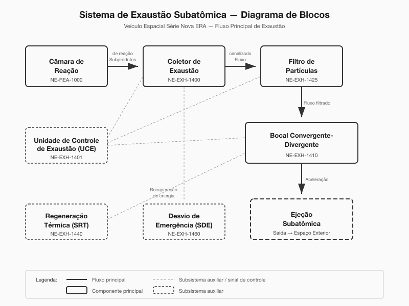
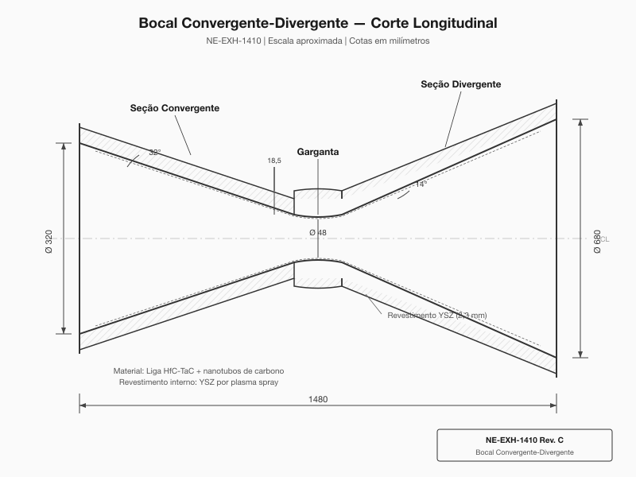
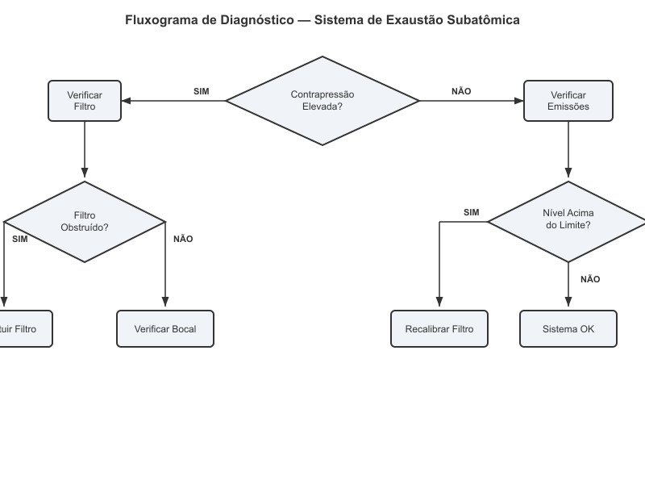
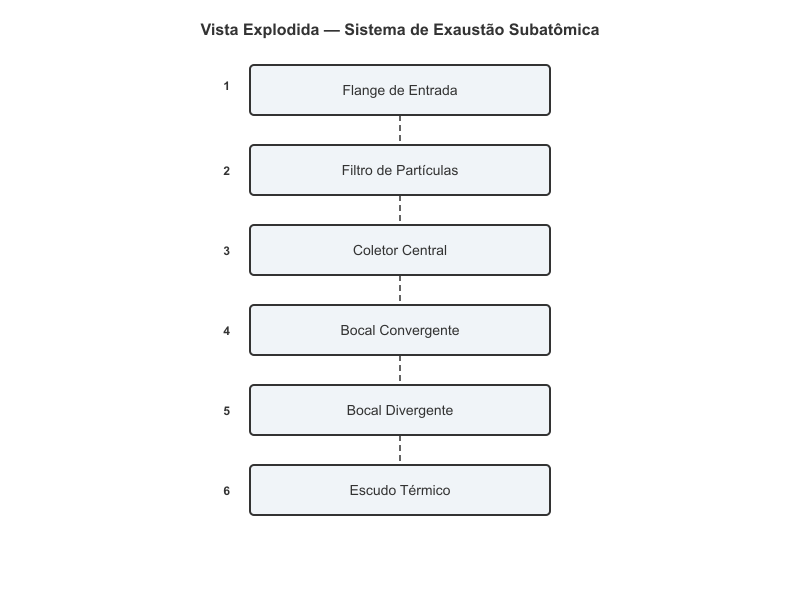
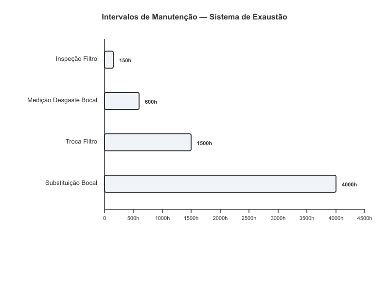

# Sistema de Exaustão Subatômica

**Manual de Reparo — Veículo Espacial Série Databricks Galáctica**
**Documento Técnico NE-MR-014 | Revisão 7.2**
**Classificação: Uso Interno — Técnicos Certificados Nível III+**

---

O Sistema de Exaustão Subatômica (SEA) é responsável pela canalização, filtragem e ejeção controlada dos subprodutos de reação do propulsor quântico principal. Diferentemente dos sistemas de exaustão convencionais baseados em combustão química, o SEA opera com fluxos de partículas subatômicas geradas durante a aniquilação controlada de pares matéria-antimatéria na câmara de reação primária. Este manual cobre todos os procedimentos de diagnóstico, reparo e manutenção preventiva do sistema, incluindo especificações de torque, intervalos de substituição e protocolos de segurança radiológica.

> **AVISO DE SEGURANÇA CRÍTICO:** Todos os procedimentos descritos neste manual devem ser realizados com o reator principal desligado e o sistema de contenção de antimatéria em modo de bloqueio total (lockout). A exposição a partículas subatômicas não filtradas pode causar danos celulares irreversíveis. Utilize sempre o Equipamento de Proteção Individual (EPI) classe Sigma-7 ou superior.

---

## 1. Visão Geral e Princípios de Funcionamento

O Sistema de Exaustão Subatômica do Veículo Espacial Série Databricks Galáctica representa a quarta geração de tecnologia de ventilação de partículas desenvolvida pelo Consórcio de Propulsão Avançada (CPA). O sistema foi projetado para lidar com fluxos de partículas que variam de múons residuais a fragmentos de quarks desconfinados, operando em regimes de temperatura equivalente entre 10⁸ e 10¹² Kelvin.

### 1.1 Teoria da Exaustão Subatômica

O princípio fundamental que governa o SEA baseia-se na Dinâmica de Ventilação de Partículas (DVP), onde os subprodutos da reação quântica são canalizados por meio de campos magnéticos toroidais confinantes antes de passarem pelo sistema de filtragem multicamada. A energia cinética das partículas é parcialmente recuperada pelo sistema de regeneração térmica antes da ejeção final pelo bocal convergente-divergente.

O fluxo de partículas segue o caminho principal descrito no diagrama abaixo, passando por cinco estágios críticos de processamento antes da ejeção ao espaço exterior. Cada estágio possui sensores de monitoramento dedicados que alimentam a Unidade de Controle de Exaustão (UCE), módulo NE-EXH-1401.

### 1.2 Controle de Emissões Subatômicas

O controle de emissões é regulado pelo Protocolo Interestelar de Emissões (PIE), classe III, que estabelece limites máximos de liberação de partículas carregadas e radiação gama residual. O sistema de filtragem do Databricks Galáctica opera com três camadas de contenção:

- **Camada Primária (Filtro de Quarks):** Rede de confinamento cromático que captura fragmentos de quarks livres e glúons residuais. Número de peça NE-EXH-1420.
- **Camada Secundária (Filtro de Léptons):** Malha eletromagnética de alta densidade que retém múons, táuons e neutrinos pesados. Número de peça NE-EXH-1421.
- **Camada Terciária (Filtro de Radiação):** Blindagem de absorção gama com núcleo de háfnio-tungstênio para atenuação de fótons de alta energia. Número de peça NE-EXH-1422.

### 1.3 Dinâmica do Bocal Convergente-Divergente

O bocal de ejeção utiliza geometria convergente-divergente (tipo de Laval modificado) adaptada para fluxos de partículas subatômicas. A seção convergente acelera o fluxo de partículas até velocidades relativísticas na região da garganta, enquanto a seção divergente direciona e colima o feixe de ejeção. O perfil geométrico do bocal é otimizado pela equação de Kessler-Tanaka para fluxos de plasma de quark-glúon.

A pressão de estagnação na entrada do bocal deve ser mantida entre 4,7 e 5,3 TPa (terapascais) durante operação nominal. Desvios superiores a 8% indicam obstrução parcial do sistema de filtragem ou erosão da garganta do bocal.

| Parâmetro | Valor Nominal | Faixa Aceitável | Unidade |
|---|---|---|---|
| Pressão de Estagnação (entrada) | 5,0 | 4,7 – 5,3 | TPa |
| Temperatura Equivalente (câmara) | 2,4 × 10¹⁰ | 1,8 – 3,0 × 10¹⁰ | K |
| Velocidade de Ejeção | 0,87c | 0,82c – 0,91c | fração de c |
| Taxa de Fluxo Mássico | 1,2 × 10⁻⁶ | 0,9 – 1,5 × 10⁻⁶ | kg/s |
| Razão de Expansão do Bocal | 42:1 | 40:1 – 44:1 | — |
| Eficiência de Filtragem (quarks) | 99,9997 | ≥ 99,9990 | % |
| Nível de Emissão Gama Residual | 0,003 | ≤ 0,010 | Sv/h a 10 m |

### 1.4 Subsistemas Auxiliares

O SEA integra-se com os seguintes subsistemas auxiliares do veículo:

- **Sistema de Regeneração Térmica (SRT):** Captura até 23% da energia térmica residual do fluxo de exaustão para alimentar sistemas secundários. Módulo NE-EXH-1440.
- **Sistema de Monitoramento de Emissões (SME):** Conjunto de 14 sensores distribuídos ao longo do duto de exaustão que medem contagem de partículas, espectro de energia e dose de radiação em tempo real. Módulo NE-EXH-1450.
- **Sistema de Desvio de Emergência (SDE):** Válvula de alívio que redireciona o fluxo de exaustão para o tanque de contenção de emergência em caso de falha catastrófica do bocal. Módulo NE-EXH-1460.

> **NOTA:** O SDE deve ser testado a cada 300 horas de operação conforme Procedimento de Teste NE-PT-014-SDE. A falha em manter o SDE operacional é uma violação de classe A do regulamento de segurança.

---

## 2. Especificações Técnicas

Esta seção apresenta as especificações técnicas detalhadas de todos os componentes do Sistema de Exaustão Subatômica, incluindo dimensões críticas, tolerâncias de fabricação e números de peça para reposição.

### 2.1 Bocal Convergente-Divergente — Geometria e Dimensões

O bocal é fabricado em liga de carbeto de háfnio-tântalo (HfC-TaC) reforçada com fibras de nanotubos de carbono entrelaçados, proporcionando resistência térmica superior a 4.200 K e resistência à erosão por partículas de alta energia. O revestimento interno é composto por uma camada de 2,3 mm de óxido de zircônio estabilizado com ítrio (YSZ) depositada por plasma spray.

| Dimensão | Valor | Tolerância | Unidade |
|---|---|---|---|
| Comprimento total do bocal | 1.480 | ±2,0 | mm |
| Diâmetro de entrada (seção convergente) | 320 | ±0,5 | mm |
| Diâmetro da garganta | 48 | ±0,05 | mm |
| Diâmetro de saída (seção divergente) | 680 | ±1,0 | mm |
| Ângulo do cone convergente | 32 | ±0,5 | graus |
| Ângulo do cone divergente | 14 | ±0,3 | graus |
| Espessura da parede na garganta | 18,5 | ±0,2 | mm |
| Espessura do revestimento YSZ | 2,3 | ±0,1 | mm |
| Raio de curvatura da garganta | 24 | ±0,1 | mm |
| Rugosidade superficial interna (Ra) | ≤ 0,4 | — | μm |

### 2.2 Filtros de Partículas — Especificações

Os filtros de partículas são montados em cartucho modular para facilitar a substituição em campo. Cada cartucho contém as três camadas de filtragem em uma única unidade selada, com conectores de alinhamento magnético para instalação sem ferramentas especiais.

| Componente | Número de Peça | Material | Vida Útil | Peso |
|---|---|---|---|---|
| Cartucho de Filtro Completo | NE-EXH-1425 | Compósito multicamada | 1.500 h | 12,4 kg |
| Camada Primária (Quarks) | NE-EXH-1420 | Rede cromática classe V | 2.000 h | 3,8 kg |
| Camada Secundária (Léptons) | NE-EXH-1421 | Malha EM alta densidade | 1.800 h | 4,1 kg |
| Camada Terciária (Radiação) | NE-EXH-1422 | Hf-W blindagem gama | 3.000 h | 4,5 kg |
| Junta do cartucho (O-ring quântico) | NE-EXH-1426 | Polímero de confinamento | 1.500 h | 0,08 kg |
| Anel de retenção do cartucho | NE-EXH-1427 | Liga Ti-6Al-4V | 10.000 h | 0,45 kg |

### 2.3 Coletor de Exaustão e Manifold

O coletor central recebe os subprodutos de reação por meio de quatro dutos de transferência conectados à câmara de reação principal. A junção dos dutos no manifold utiliza juntas de vedação tipo "face ring" com aperto controlado por torquímetro.

| Componente | Número de Peça | Torque de Aperto | Sequência |
|---|---|---|---|
| Parafuso do flange de entrada (M16) | NE-EXH-1411 | 185 ± 5 N·m | Estrela, 3 passes |
| Porca do coletor central (M20) | NE-EXH-1412 | 240 ± 8 N·m | Cruzado, 3 passes |
| Parafuso do bocal (M14) | NE-EXH-1413 | 155 ± 4 N·m | Estrela, 4 passes |
| Parafuso do escudo térmico (M10) | NE-EXH-1414 | 72 ± 3 N·m | Sequencial horário |
| Braçadeira do duto de transferência | NE-EXH-1415 | 95 ± 3 N·m | Alternado |
| Junta do manifold (face ring) | NE-EXH-1416 | — | Substituir sempre |
| Junta do bocal (espirotalada) | NE-EXH-1417 | — | Substituir sempre |

### 2.4 Velocidades de Exaustão e Desempenho

O desempenho do sistema é medido em três regimes operacionais:

| Regime | Velocidade de Ejeção | Empuxo Específico | Temperatura Bocal | Pressão Garganta |
|---|---|---|---|---|
| Cruzeiro | 0,87c | 1,2 × 10⁷ s | 3.800 K | 5,0 TPa |
| Manobra (70%) | 0,61c | 8,4 × 10⁶ s | 2.900 K | 3,5 TPa |
| Marcha Lenta (15%) | 0,13c | 1,8 × 10⁶ s | 1.200 K | 0,75 TPa |
| Emergência (110%) | 0,94c | 1,4 × 10⁷ s | 4.100 K | 5,8 TPa |

> **AVISO:** O regime de emergência (110%) não deve ser sustentado por mais de 45 segundos. O uso prolongado causa erosão acelerada da garganta do bocal e pode comprometer a integridade estrutural do revestimento YSZ.

### 2.5 Sensores e Instrumentação

| Sensor | Número de Peça | Localização | Faixa de Medição | Precisão |
|---|---|---|---|---|
| Sensor de contrapressão | NE-EXH-1451 | Entrada do coletor | 0 – 8 TPa | ±0,5% |
| Sensor de temperatura do bocal | NE-EXH-1452 | Garganta (externo) | 0 – 5.000 K | ±10 K |
| Contador de partículas (quarks) | NE-EXH-1453 | Pós-filtro primário | 0 – 10¹⁸ /s | ±0,1% |
| Dosímetro de radiação gama | NE-EXH-1454 | Saída do bocal | 0 – 100 Sv/h | ±2% |
| Sensor de erosão (ultrassônico) | NE-EXH-1455 | Garganta (parede) | 0 – 25 mm | ±0,02 mm |
| Sensor de fluxo mássico | NE-EXH-1456 | Duto de transferência | 0 – 5 × 10⁻⁶ kg/s | ±0,3% |

---

## 3. Procedimento de Diagnóstico

Esta seção descreve os procedimentos de diagnóstico para as falhas mais comuns do Sistema de Exaustão Subatômica. Todos os diagnósticos devem ser realizados com o reator em modo de espera frio (standby cold) e o sistema de exaustão despressurizado.

### 3.1 Equipamentos Necessários para Diagnóstico

Antes de iniciar qualquer procedimento de diagnóstico, certifique-se de dispor dos seguintes equipamentos:

| Equipamento | Número de Peça | Finalidade |
|---|---|---|
| Scanner UCE portátil | NE-TOOL-9001 | Leitura de códigos de falha e dados ao vivo |
| Medidor de contrapressão calibrado | NE-TOOL-9002 | Verificação independente da pressão |
| Endoscópio de partículas | NE-TOOL-9003 | Inspeção visual interna do bocal |
| Kit de teste de vedação (hélio) | NE-TOOL-9004 | Detecção de vazamentos no manifold |
| Medidor de espessura ultrassônico | NE-TOOL-9005 | Medição de erosão da garganta |
| Dosímetro pessoal classe Sigma | NE-TOOL-9006 | Monitoramento de exposição do técnico |

### 3.2 Anomalias de Contrapressão

A contrapressão elevada é a anomalia mais frequente do SEA, responsável por aproximadamente 47% de todas as ordens de serviço relacionadas ao sistema de exaustão. O fluxograma de diagnóstico abaixo deve ser seguido sistematicamente.

**Procedimento de diagnóstico — Contrapressão Elevada:**

1. Conecte o Scanner UCE portátil (NE-TOOL-9001) à porta de diagnóstico J7 localizada no painel lateral esquerdo do coletor de exaustão.
2. Acesse o menu **Diagnóstico > Exaustão > Contrapressão** e registre a leitura atual.
3. Compare o valor lido com a especificação nominal de 5,0 TPa (±6%). Valores acima de 5,3 TPa indicam restrição no fluxo.
4. Verifique o diferencial de pressão entre os sensores NE-EXH-1451 (entrada do coletor) e NE-EXH-1456 (pós-filtro). Um diferencial superior a 0,8 TPa indica obstrução no filtro de partículas.
5. Se o diferencial do filtro estiver dentro do limite, prossiga com a inspeção do bocal usando o endoscópio de partículas (NE-TOOL-9003).
6. Insira o endoscópio pela porta de inspeção P3 no flange de entrada do bocal e examine a superfície interna da garganta.
7. Erosão visível com profundidade superior a 1,5 mm ou rugosidade superficial Ra > 1,2 μm requer substituição do bocal.
8. Se o bocal e o filtro estiverem dentro dos limites, execute o teste de vedação do manifold conforme item 3.3.

### 3.3 Vazamentos no Manifold

Vazamentos no manifold podem causar perda de pressão e contaminação do compartimento de engenharia com partículas subatômicas. O teste de vedação é realizado com hélio traçador.

**Procedimento de teste de vedação:**

1. Certifique-se de que o sistema de exaustão está completamente despressurizado (pressão residual < 0,001 TPa).
2. Conecte o kit de teste de vedação (NE-TOOL-9004) à porta de pressurização T2 do coletor.
3. Pressurize o sistema com hélio a 0,5 TPa.
4. Utilize o detector de hélio portátil para varrer todas as juntas do manifold, começando pelos flanges de entrada (NE-EXH-1411) e prosseguindo para o coletor central (NE-EXH-1412).
5. Uma taxa de vazamento superior a 1 × 10⁻⁸ Pa·m³/s em qualquer junta indica necessidade de substituição da junta correspondente.
6. Registre todas as leituras no formulário NE-FM-014-VZ.

| Código de Falha UCE | Descrição | Causa Provável | Ação Recomendada |
|---|---|---|---|
| EXH-P01 | Contrapressão alta (>5,3 TPa) | Filtro obstruído | Substituir cartucho NE-EXH-1425 |
| EXH-P02 | Contrapressão alta com filtro OK | Erosão do bocal | Inspecionar/substituir bocal |
| EXH-T01 | Temperatura do bocal elevada (>4.200 K) | Degradação do revestimento YSZ | Substituir bocal NE-EXH-1410 |
| EXH-T02 | Temperatura do bocal irregular | Depósito assimétrico | Limpeza do bocal |
| EXH-L01 | Vazamento detectado no manifold | Junta degradada | Substituir junta NE-EXH-1416 |
| EXH-R01 | Emissão gama acima do limite | Filtro terciário saturado | Substituir camada NE-EXH-1422 |
| EXH-F01 | Fluxo mássico irregular | Obstrução parcial no duto | Inspecionar duto de transferência |
| EXH-E01 | Erosão da garganta >1,5 mm | Desgaste normal/acelerado | Substituir bocal NE-EXH-1410 |

### 3.4 Contaminação por Partículas

Quando o contador de partículas pós-filtro (NE-EXH-1453) indica contagem acima de 10¹² partículas/s no modo cruzeiro, o sistema de filtragem requer atenção imediata.

**Procedimento de diagnóstico — Contaminação:**

1. Ative o modo de diagnóstico ampliado no Scanner UCE: **Diagnóstico > Exaustão > Análise Espectral**.
2. O scanner exibirá o espectro de energia das partículas detectadas após a filtragem.
3. Picos de energia na faixa de 200–500 MeV indicam passagem de quarks residuais (falha na camada primária NE-EXH-1420).
4. Picos na faixa de 50–150 MeV indicam passagem de múons (falha na camada secundária NE-EXH-1421).
5. Elevação geral do ruído de fundo gama indica saturação da camada terciária (NE-EXH-1422).
6. Substitua a camada ou cartucho correspondente conforme procedimento da Seção 4.

> **ATENÇÃO:** Se a contagem de partículas pós-filtro exceder 10¹⁵ /s, o sistema de proteção automática deve ter desligado o reator. Caso isso não tenha ocorrido, execute o desligamento manual de emergência imediatamente (Procedimento NE-EM-001) e evacue o compartimento de engenharia.

---

## 4. Procedimento de Reparo / Substituição

Esta seção descreve os procedimentos detalhados de reparo e substituição dos componentes principais do Sistema de Exaustão Subatômica. Todos os procedimentos requerem certificação de Técnico de Propulsão Nível III ou superior.

### 4.1 Preparação Geral

Antes de iniciar qualquer reparo no SEA, execute os seguintes passos preparatórios:

1. Desligue o reator principal e aguarde o período de resfriamento de 4 horas até que a temperatura do bocal esteja abaixo de 320 K.
2. Ative o sistema de bloqueio/etiquetagem (lockout/tagout) nos painéis de controle C1 e C2 conforme procedimento NE-LT-001.
3. Despressurize completamente o sistema de exaustão pela válvula de alívio V7.
4. Verifique com o dosímetro pessoal (NE-TOOL-9006) que o nível de radiação no compartimento está abaixo de 0,001 Sv/h.
5. Instale as blindagens de trabalho temporárias nos pontos de acesso A1, A2 e A3.
6. Documente o estado inicial do sistema com fotografias e leituras do Scanner UCE.

### 4.2 Substituição do Bocal Convergente-Divergente (NE-EXH-1410)

**Tempo estimado:** 6 horas
**Técnicos necessários:** 2
**Ferramentas especiais:** Extrator de bocal NE-TOOL-8010, torquímetro digital 50-300 N·m

| Passo | Ação | Torque / Especificação | Observação |
|---|---|---|---|
| 1 | Remover o escudo térmico (8 parafusos M10) | — | Armazenar parafusos em ordem |
| 2 | Desconectar sensores NE-EXH-1452 e NE-EXH-1455 | — | Marcar conectores |
| 3 | Afrouxar parafusos do bocal (12× M14) em sequência estrela | — | 3 passes de afrouxamento |
| 4 | Instalar extrator NE-TOOL-8010 no flange do bocal | — | Alinhar pinos-guia |
| 5 | Extrair o bocal lentamente (máx. 2 mm/s) | — | Monitorar com dosímetro |
| 6 | Inspecionar a superfície de vedação do coletor | Ra ≤ 0,8 μm | Polir se necessário |
| 7 | Instalar nova junta espirotalada NE-EXH-1417 | — | Nunca reutilizar |
| 8 | Posicionar o bocal novo com pinos de alinhamento | — | Verificar centralização |
| 9 | Aplicar torque nos parafusos M14 — passe 1 | 50 N·m | Sequência estrela |
| 10 | Aplicar torque nos parafusos M14 — passe 2 | 100 N·m | Sequência estrela |
| 11 | Aplicar torque nos parafusos M14 — passe 3 | 140 N·m | Sequência estrela |
| 12 | Aplicar torque final nos parafusos M14 — passe 4 | 155 ± 4 N·m | Sequência estrela |
| 13 | Reconectar sensores NE-EXH-1452 e NE-EXH-1455 | — | Testar continuidade |
| 14 | Reinstalar escudo térmico (8 parafusos M10) | 72 ± 3 N·m | Sequência horária |
| 15 | Executar teste de vedação com hélio | Vazamento < 1 × 10⁻⁸ Pa·m³/s | Conforme item 3.3 |
| 16 | Executar teste funcional em marcha lenta (15%) | Verificar todos os sensores | Duração mínima: 10 min |

### 4.3 Substituição do Cartucho de Filtro (NE-EXH-1425)

**Tempo estimado:** 1,5 horas
**Técnicos necessários:** 1
**Ferramentas especiais:** Chave de extração de cartucho NE-TOOL-8020

A substituição do cartucho de filtro é o procedimento de manutenção mais frequente do SEA. O cartucho é projetado para troca rápida com conectores de alinhamento magnético.

**Procedimento passo a passo:**

1. Após completar a preparação geral (item 4.1), localize a porta de acesso ao filtro no lado superior do coletor de exaustão, identificada pela etiqueta amarela "FILTRO — NE-EXH-1425".
2. Remova os 4 parafusos de retenção da tampa de acesso (M8, torque de remoção: manual).
3. Desconecte o conector elétrico do sensor de diferencial de pressão do filtro (conector tipo J3, trava de quarto de volta).
4. Gire o anel de retenção do cartucho (NE-EXH-1427) 90° no sentido anti-horário usando a chave NE-TOOL-8020.
5. Puxe o cartucho usado para fora utilizando a alça de extração integrada. **ATENÇÃO:** O cartucho usado é radioativo. Coloque-o imediatamente no contêiner de descarte blindado classe R3.
6. Inspecione a cavidade do filtro quanto a depósitos ou danos na superfície de vedação. Limpe com solvente NE-CLN-3001 se necessário.
7. Instale o novo cartucho NE-EXH-1425, garantindo que os pinos de alinhamento magnético se encaixem corretamente (clique audível).
8. Gire o anel de retenção 90° no sentido horário até o travamento.
9. Reconecte o conector J3 do sensor de diferencial.
10. Reinstale a tampa de acesso (4 parafusos M8, torque: 12 ± 1 N·m).
11. Execute o procedimento de auto-verificação no Scanner UCE: **Manutenção > Exaustão > Verificação Pós-Troca de Filtro**.
12. Registre a troca no log de manutenção com o número de série do cartucho novo.

| Item | Especificação |
|---|---|
| Torque do anel de retenção | Manual (sem torquímetro) |
| Torque dos parafusos da tampa (M8) | 12 ± 1 N·m |
| Verificação de alinhamento | Clique magnético audível |
| Teste pós-troca | Auto-verificação via UCE |
| Descarte do cartucho usado | Contêiner blindado classe R3 |
| Registro obrigatório | Número de série no log digital |

### 4.4 Reparo de Junta do Manifold (NE-EXH-1416)

Quando o teste de vedação identifica um vazamento em uma ou mais juntas do manifold, a substituição é obrigatória. As juntas tipo "face ring" não podem ser reparadas e devem sempre ser substituídas por peças novas.

**Procedimento:**

1. Identifique a junta com vazamento conforme resultados do teste de vedação (item 3.3).
2. Remova os parafusos do flange correspondente em sequência estrela reversa (3 passes de afrouxamento).
3. Separe os flanges com cuidado utilizando os furos de extração (nunca use alavanca na face de vedação).
4. Remova a junta usada e descarte-a.
5. Limpe ambas as faces de vedação com solvente NE-CLN-3001 e pano sem fiapos.
6. Inspecione as faces de vedação quanto a riscos, marcas ou corrosão. Rugosidade Ra deve ser ≤ 0,8 μm.
7. Se a rugosidade exceder o limite, faça o recondicionamento da face com ferramenta de lapidação NE-TOOL-8030.
8. Instale a junta nova NE-EXH-1416, verificando o alinhamento com os pinos-guia.
9. Aplique torque nos parafusos do flange conforme especificações da tabela na Seção 2.3 (3 passes, sequência estrela).
10. Execute teste de vedação com hélio para confirmar a estanqueidade.

> **NOTA IMPORTANTE:** Nunca aplique selante ou fita vedante em juntas do sistema de exaustão. As temperaturas de operação degradariam qualquer selante, criando risco de contaminação e falha catastrófica.

---

## 5. Manutenção Preventiva e Intervalos

A manutenção preventiva do Sistema de Exaustão Subatômica é essencial para garantir a segurança da tripulação, a conformidade com o Protocolo Interestelar de Emissões e a vida útil máxima dos componentes. O programa de manutenção é baseado em horas de operação do reator e deve ser rigorosamente seguido.

### 5.1 Cronograma de Manutenção

O cronograma abaixo apresenta todos os intervalos de manutenção preventiva do SEA. As atividades são classificadas em inspeções, medições, trocas programadas e substituições maiores.

| Atividade | Intervalo (horas) | Tipo | Técnico Mín. | Tempo Est. | Referência |
|---|---|---|---|---|---|
| Inspeção visual do filtro | 150 | Inspeção | Nível II | 30 min | NE-PM-014-01 |
| Leitura dos sensores de exaustão | 150 | Inspeção | Nível II | 15 min | NE-PM-014-02 |
| Teste funcional do SDE | 300 | Teste | Nível III | 1 h | NE-PT-014-SDE |
| Medição de desgaste do bocal | 600 | Medição | Nível III | 2 h | NE-PM-014-03 |
| Teste de vedação do manifold | 600 | Teste | Nível III | 1,5 h | NE-PM-014-04 |
| Calibração dos sensores | 1.000 | Calibração | Nível III | 3 h | NE-PM-014-05 |
| Troca do cartucho de filtro | 1.500 | Substituição | Nível III | 1,5 h | NE-PM-014-06 |
| Inspeção do revestimento YSZ | 2.000 | Inspeção | Nível IV | 4 h | NE-PM-014-07 |
| Troca das juntas do manifold | 3.000 | Substituição | Nível III | 3 h | NE-PM-014-08 |
| Substituição do bocal completo | 4.000 | Substituição | Nível IV | 6 h | NE-PM-014-09 |
| Revisão geral do SEA | 8.000 | Overhaul | Nível IV | 24 h | NE-PM-014-10 |

### 5.2 Inspeção do Filtro de Partículas (A cada 150 horas)

A inspeção do filtro de partículas é a atividade de manutenção mais frequente e deve ser realizada por um técnico de Nível II ou superior.

**Procedimento de inspeção:**

1. Com o reator em modo de espera frio, acesse o Scanner UCE e navegue até **Manutenção > Exaustão > Status do Filtro**.
2. Registre os seguintes parâmetros:
   - Diferencial de pressão do filtro (nominal: < 0,5 TPa)
   - Contagem de partículas pós-filtro (nominal: < 10⁸ /s em espera)
   - Horas de operação acumuladas do cartucho atual
3. Se o diferencial de pressão exceder 0,6 TPa, programe a substituição do cartucho para a próxima parada programada.
4. Se o diferencial exceder 0,75 TPa, substitua o cartucho imediatamente conforme Seção 4.3.
5. Registre todas as leituras no log de manutenção digital.

| Parâmetro do Filtro | Valor Normal | Atenção | Crítico (Troca Imediata) |
|---|---|---|---|
| Diferencial de pressão | < 0,5 TPa | 0,5 – 0,6 TPa | > 0,75 TPa |
| Contagem pós-filtro (espera) | < 10⁸ /s | 10⁸ – 10¹⁰ /s | > 10¹² /s |
| Contagem pós-filtro (cruzeiro) | < 10¹⁰ /s | 10¹⁰ – 10¹² /s | > 10¹⁴ /s |
| Dose gama residual (a 10 m) | < 0,003 Sv/h | 0,003 – 0,008 Sv/h | > 0,010 Sv/h |

### 5.3 Medição de Desgaste do Bocal (A cada 600 horas)

O desgaste da garganta do bocal é medido com o medidor de espessura ultrassônico (NE-TOOL-9005) em oito pontos circunferenciais igualmente espaçados (a cada 45°).

**Procedimento de medição:**

1. Após a preparação geral (item 4.1), remova o escudo térmico conforme passo 1 da Seção 4.2.
2. Posicione o medidor ultrassônico (NE-TOOL-9005) no primeiro ponto de medição (posição 12 horas, marcada "P1" no bocal).
3. Registre a espessura da parede. O valor nominal para um bocal novo é 18,5 mm.
4. Repita a medição nos pontos P2 a P8 (sentido horário, a cada 45°).
5. Calcule a espessura mínima e a variação máxima entre pontos.
6. Critérios de decisão conforme tabela abaixo.
7. Reinstale o escudo térmico e registre todas as medições no log.

| Resultado da Medição | Ação |
|---|---|
| Espessura mínima ≥ 16,5 mm e variação ≤ 0,5 mm | Aprovado — continuar operação |
| Espessura mínima entre 15,0 e 16,5 mm | Monitoramento intensivo — reduzir intervalo para 300 h |
| Espessura mínima < 15,0 mm | Substituição obrigatória do bocal |
| Variação entre pontos > 1,0 mm | Erosão assimétrica — investigar causa e substituir |

### 5.4 Teste de Emissões (A cada 600 horas)

O teste de emissões verifica a conformidade do veículo com o Protocolo Interestelar de Emissões (PIE) classe III. O teste deve ser realizado com o reator em regime de cruzeiro estabilizado por no mínimo 5 minutos.

**Procedimento:**

1. Estabilize o reator em regime de cruzeiro (100%) por 5 minutos.
2. No Scanner UCE, acesse **Diagnóstico > Exaustão > Teste de Emissões PIE-III**.
3. O sistema executará automaticamente a sequência de medições durante 120 segundos.
4. O relatório incluirá: contagem de partículas por tipo, dose de radiação gama, espectro de energia e índice de conformidade PIE-III.
5. O índice de conformidade deve ser ≥ 95% para aprovação.
6. Valores entre 90% e 95% requerem investigação e manutenção corretiva dentro de 200 horas.
7. Valores abaixo de 90% requerem suspensão da operação até a correção do problema.

| Faixa do Índice PIE-III | Classificação | Ação Requerida |
|---|---|---|
| ≥ 95% | Conforme | Nenhuma — registrar resultado |
| 90% – 95% | Atenção | Manutenção corretiva em até 200 h |
| 80% – 90% | Não conforme | Suspender operação de cruzeiro |
| < 80% | Crítico | Desligamento e reparo obrigatório |

### 5.5 Registro e Documentação

Todos os procedimentos de manutenção preventiva devem ser registrados no Sistema de Gestão de Manutenção Digital (SGMD) do veículo. Os seguintes documentos devem ser mantidos:

- **Log de Manutenção Digital:** Atualizado após cada atividade com data, hora, técnico responsável, leituras e peças substituídas.
- **Certificado de Conformidade PIE-III:** Emitido após cada teste de emissões aprovado. Validade de 600 horas.
- **Relatório de Espessura do Bocal:** Gráfico de tendência com todas as medições históricas para análise de taxa de desgaste.
- **Registro de Descarte de Materiais Radioativos:** Número de rastreamento para cada cartucho de filtro descartado conforme regulamento NE-RD-001.

> **LEMBRETE FINAL:** O cumprimento rigoroso do programa de manutenção preventiva é a melhor garantia de segurança e desempenho do Sistema de Exaustão Subatômica. Desvios do programa devem ser autorizados pelo Engenheiro Chefe de Propulsão e documentados com justificativa técnica.

---

**Fim do Documento NE-MR-014 — Sistema de Exaustão Subatômica**
**Veículo Espacial Série Databricks Galáctica — Manual de Reparo**
**© Consórcio de Propulsão Avançada — Todos os direitos reservados**
