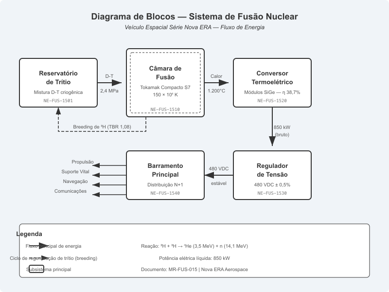
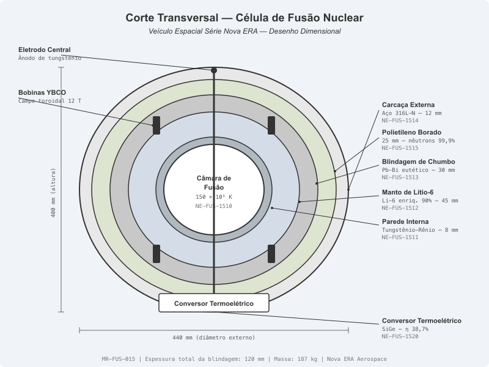
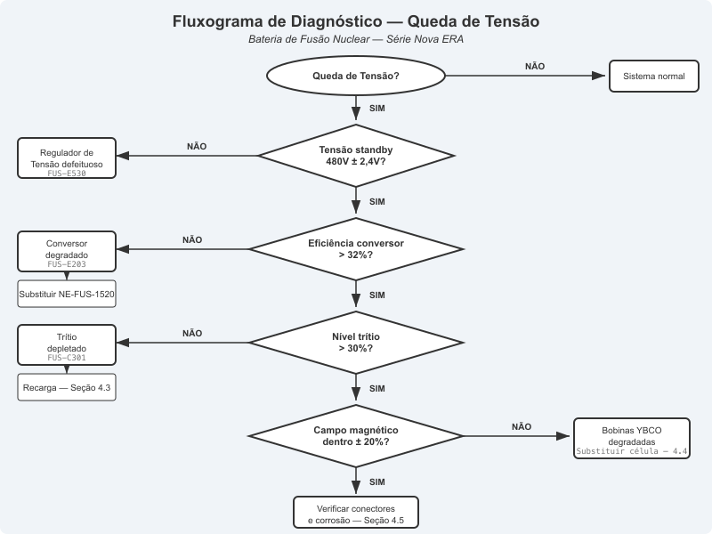
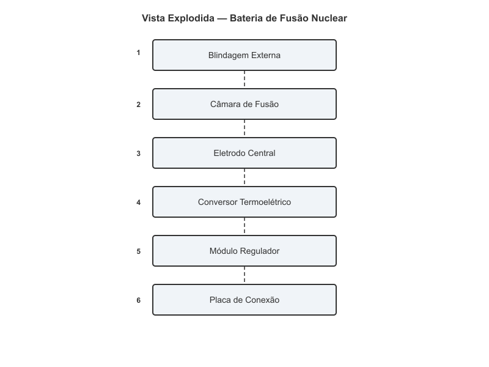
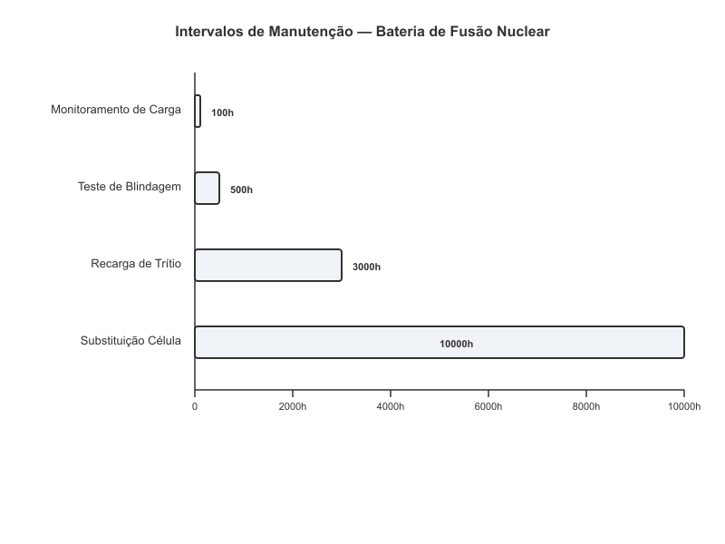

# Bateria de Fusão Nuclear

> **Veículo Espacial Série Databricks Galáctica — Manual de Reparo Técnico**
> Documento: MR-FUS-015 | Revisão: 7.2 | Data de Vigência: Ciclo Estelar 2487.3
> Classificação: Restrito — Somente Técnicos Certificados Nível 3+

---

A Bateria de Fusão Nuclear é o coração energético do Veículo Espacial Série Databricks Galáctica. Responsável por alimentar todos os sistemas primários — desde propulsão subluz até suporte vital —, esta unidade converte a energia liberada pela fusão de deutério-trítio em corrente elétrica estável de alta densidade. Este manual cobre os princípios fundamentais de funcionamento, especificações técnicas detalhadas, procedimentos de diagnóstico, reparo e substituição, além dos intervalos de manutenção preventiva recomendados pela Databricks Galáctica Aerospace.

**AVISO DE SEGURANÇA GERAL:** A manipulação de trítio e componentes de fusão nuclear exige certificação Nível 3 ou superior em Sistemas de Energia Nuclear Veicular (SENV). O não cumprimento dos protocolos de segurança radiológica pode resultar em exposição a radiação ionizante, contaminação por trítio e falha catastrófica do sistema de contenção. Utilize SEMPRE equipamento de proteção individual (EPI) Classe R-4, incluindo dosímetro pessoal, luvas de manipulação de trítio (PN: NE-SEG-0042) e escudo facial com filtro de nêutrons.

---

## 1. Visão Geral e Princípios de Funcionamento

### 1.1 Fundamentos da Fusão Deutério-Trítio

A Bateria de Fusão Nuclear do Série Databricks Galáctica utiliza a reação de fusão nuclear entre deutério (²H) e trítio (³H) como fonte primária de energia. Esta reação é considerada a mais eficiente para aplicações veiculares compactas, pois apresenta a menor temperatura de ignição dentre as reações de fusão conhecidas e a maior seção de choque de reação em regimes de confinamento inercial assistido por campo magnético.

A reação fundamental pode ser descrita como:

**²H + ³H → ⁴He (3,5 MeV) + n (14,1 MeV)**

Cada evento de fusão libera aproximadamente 17,6 MeV de energia cinética, distribuída entre a partícula alfa (núcleo de hélio-4) e um nêutron rápido. No projeto Databricks Galáctica, a energia cinética da partícula alfa é capturada diretamente pelo campo magnético de contenção e convertida em calor no manto interno da câmara, enquanto os nêutrons rápidos são moderados pela blindagem de lítio enriquecido, gerando trítio adicional por transmutação nuclear e calor recuperável pelo conversor termoelétrico.

### 1.2 Arquitetura do Sistema de Energia

O sistema de energia por fusão do Série Databricks Galáctica é composto por cinco subsistemas principais interconectados em série, conforme ilustrado no diagrama de blocos abaixo:

**Fluxo de Energia:**

1. **Reservatório de Trítio (NE-FUS-1501):** Armazena o combustível de fusão (mistura D-T) em estado criogênico a -248°C, sob pressão controlada de 2,4 MPa. O reservatório utiliza contenção magnética passiva para evitar contato do combustível com as paredes internas, minimizando contaminação e perda por permeação.

2. **Câmara de Fusão (NE-FUS-1510):** Núcleo do sistema, onde ocorre a reação de fusão propriamente dita. Utiliza confinamento inercial assistido por campo magnético toroidal (Tokamak Compacto Série 7). A temperatura do plasma atinge aproximadamente 150 milhões de Kelvin durante operação nominal. O campo magnético de contenção é gerado por bobinas supercondutoras de YBCO (Óxido de Ítrio-Bário-Cobre) refrigeradas a 77 K por nitrogênio líquido recirculante.

3. **Conversor Termoelétrico (NE-FUS-1520):** Converte o gradiente térmico entre a câmara de fusão (face quente, ~1.200°C) e o dissipador radiativo (face fria, ~80°C) em corrente elétrica contínua. Utiliza módulos termopares de SiGe (Silício-Germânio) de alta eficiência, com coeficiente de conversão nominal de 38,7%.

4. **Regulador de Tensão (NE-FUS-1530):** Estabiliza a saída do conversor termoelétrico em tensão nominal de 480 VDC ± 0,5%, com capacidade de resposta transitória inferior a 2 ms para variações de carga de 0-100%. Incorpora banco de supercapacitores de grafeno para absorção de picos de demanda.

5. **Barramento Principal (NE-FUS-1540):** Distribui energia estabilizada para todos os subsistemas do veículo através de condutores supercondutores encapsulados. Opera em configuração redundante N+1, com chaveamento automático em caso de falha de qualquer ramo.

### 1.3 Sistema de Contenção e Segurança

O sistema de contenção é projetado com filosofia de defesa em profundidade, incorporando cinco barreiras independentes contra liberação de material radioativo:

| Barreira | Componente | Material | Função | PN |
|----------|-----------|----------|--------|-----|
| 1ª | Confinamento magnético | Campo toroidal 12 T | Contenção primária do plasma | — |
| 2ª | Parede interna da câmara | Tungstênio-Rênio | Barreira física primária | NE-FUS-1511 |
| 3ª | Manto de lítio | Li-6 enriquecido | Moderação de nêutrons + breeding de trítio | NE-FUS-1512 |
| 4ª | Blindagem de chumbo | Pb-Bi eutético | Atenuação de radiação gama | NE-FUS-1513 |
| 5ª | Carcaça externa | Aço inoxidável 316L-N | Contenção estrutural final | NE-FUS-1514 |

O sistema de segurança inclui desligamento automático (SCRAM) por tripla redundância, ativado por qualquer uma das seguintes condições: temperatura do plasma acima de 200 milhões de Kelvin, pressão da câmara acima de 8,5 MPa, detecção de trítio no compartimento externo acima de 0,1 Bq/cm³, ou perda de campo magnético de contenção superior a 3% do valor nominal.

### 1.4 Ciclo de Combustível

O ciclo de combustível da Bateria de Fusão Nuclear opera em regime semi-fechado. O trítio consumido na reação é parcialmente regenerado por transmutação do lítio-6 presente no manto:

**⁶Li + n → ³H + ⁴He + 4,8 MeV**

Esta reação de breeding permite uma taxa de regeneração de trítio de aproximadamente 1,08 átomos de trítio produzidos por nêutron absorvido (Taxa de Breeding de Trítio — TBR). Isso significa que, em condições normais, o sistema é ligeiramente auto-suficiente em trítio, com um excedente de 8% que compensa perdas por decaimento radioativo (meia-vida do trítio: 12,32 anos) e permeação através de materiais estruturais.

O deutério é armazenado em reservatório separado (NE-FUS-1502) e reabastecido durante manutenções programadas a cada 10.000 horas de operação. O consumo nominal de deutério é de 0,42 mg/hora em potência máxima.

---

## 2. Especificações Técnicas

### 2.1 Parâmetros de Desempenho

A Bateria de Fusão Nuclear do Série Databricks Galáctica é projetada para fornecer energia confiável durante toda a vida útil do veículo, com intervalos de manutenção previsíveis e desempenho consistente dentro dos parâmetros especificados.

| Parâmetro | Valor Nominal | Tolerância | Unidade |
|-----------|--------------|------------|---------|
| Potência térmica máxima | 2,4 | ± 0,1 | MW |
| Potência elétrica líquida | 850 | ± 25 | kW |
| Tensão de saída DC | 480 | ± 2,4 | V |
| Corrente máxima contínua | 1.770 | ± 50 | A |
| Eficiência de conversão global | 35,4 | ± 1,2 | % |
| Temperatura de operação do plasma | 150 × 10⁶ | ± 10 × 10⁶ | K |
| Campo magnético toroidal | 12,0 | ± 0,3 | T |
| Pressão da câmara de fusão | 6,2 | ± 0,5 | MPa |
| Vida útil nominal da célula | 10.000 | — | horas |
| Tempo de ignição (cold start) | 45 | ± 5 | s |
| Tempo de resposta 10-90% carga | 1,8 | ± 0,3 | s |
| Massa total do conjunto | 187 | ± 3 | kg |

### 2.2 Especificações do Combustível

| Parâmetro | Especificação | Observações |
|-----------|--------------|-------------|
| Combustível primário | Mistura D-T (50:50 molar) | Pureza mínima 99,97% |
| Carga inicial de trítio | 4,2 g | PN: NE-COMB-0301 |
| Carga inicial de deutério | 2,8 g | PN: NE-COMB-0302 |
| Temperatura de armazenamento | -248 °C (25 K) | Criostato de hélio líquido |
| Pressão de armazenamento | 2,4 MPa | Reservatório criogênico |
| Taxa de consumo de D (potência máx.) | 0,42 mg/h | — |
| Taxa de consumo de T (potência máx.) | 0,63 mg/h | Bruto, antes do breeding |
| Taxa de breeding de trítio (TBR) | 1,08 | Regeneração no manto de Li-6 |
| Consumo líquido de T | 0,058 mg/h | Após breeding e compensações |
| Autonomia nominal (carga completa) | 10.000 h | Em potência média (60%) |

### 2.3 Blindagem e Proteção Radiológica

| Camada | Espessura | Material | Atenuação | PN |
|--------|-----------|----------|-----------|-----|
| Parede interna | 8 mm | W-Re (tungstênio-rênio) | Nêutrons primários: 15% | NE-FUS-1511 |
| Manto de breeding | 45 mm | Li-6 enriquecido (90%) | Nêutrons térmicos: 92% | NE-FUS-1512 |
| Blindagem gama | 30 mm | Pb-Bi eutético | Gama: 99,7% (>1 MeV) | NE-FUS-1513 |
| Blindagem de nêutrons | 25 mm | Polietileno borado | Nêutrons residuais: 99,9% | NE-FUS-1515 |
| Carcaça estrutural | 12 mm | Aço 316L-N | Contenção mecânica | NE-FUS-1514 |
| **Total** | **120 mm** | — | **Dose externa: < 0,5 µSv/h** | — |

### 2.4 Conectores e Interfaces

| Conector | Tipo | Especificação | Torque de Aperto | PN |
|----------|------|--------------|-----------------|-----|
| Saída de potência principal | Barra condutora Cu-Ag | 480 VDC / 2.000 A | 85 N·m ± 5 N·m | NE-CON-1601 |
| Saída de potência auxiliar | Conector circular MIL-C | 48 VDC / 200 A | 12 N·m ± 1 N·m | NE-CON-1602 |
| Interface de dados CAN-FD | Conector D-Sub blindado | 5 Mbps, barramento duplo | 0,8 N·m ± 0,1 N·m | NE-CON-1603 |
| Linha de combustível D-T | VCR 1/4" aço inox | 3,0 MPa, criogênico | 18 N·m ± 2 N·m | NE-CON-1604 |
| Linha de refrigeração He | Swagelok 3/8" | 1,5 MPa, -269°C | 22 N·m ± 2 N·m | NE-CON-1605 |
| Linha de exaustão He-4 | VCR 1/4" aço inox | 0,5 MPa, 200°C máx. | 18 N·m ± 2 N·m | NE-CON-1606 |
| Sensor de trítio (saída) | Conector LEMO 1B | 4-20 mA, 24 VDC | 0,5 N·m (manual) | NE-CON-1607 |
| Montagem estrutural (×6) | Parafuso M16 Gr. 12.9 | Classe 12.9, aço liga | 280 N·m ± 15 N·m | NE-FIX-1650 |

### 2.5 Condições Ambientais de Operação

| Parâmetro | Faixa Operacional | Faixa de Sobrevivência |
|-----------|-------------------|----------------------|
| Temperatura ambiente | -40 °C a +85 °C | -60 °C a +120 °C |
| Pressão externa | 0 (vácuo) a 200 kPa | 0 a 400 kPa |
| Vibração | 5 g RMS (20-2000 Hz) | 15 g RMS (pico) |
| Choque mecânico | 20 g, 11 ms, meia-seno | 50 g, 6 ms |
| Radiação cósmica | Até 100 mSv/ano | 500 mSv/ano (com degradação) |
| Campo magnético externo | Até 0,5 T | 2,0 T (com recalibração) |

---

## 3. Procedimento de Diagnóstico

### 3.1 Visão Geral do Diagnóstico

O diagnóstico da Bateria de Fusão Nuclear deve ser realizado sempre que houver indicação de anomalia nos parâmetros de operação, alertas do sistema de monitoramento embarcado ou como parte do programa de inspeção periódica. O fluxograma abaixo apresenta a árvore de decisão principal para identificação de falhas.

**AVISO:** Antes de iniciar qualquer procedimento de diagnóstico, verifique que a bateria está em modo de espera (standby) ou desligada. NUNCA realize medições intrusivas com o sistema em operação de fusão ativa. O campo magnético de 12 T e a temperatura do plasma podem causar danos fatais instantâneos.

### 3.2 Ferramentas e Equipamentos Necessários

| Ferramenta | Especificação | PN |
|-----------|--------------|-----|
| Multímetro de alta tensão DC | 0-1.000 VDC, precisão 0,1% | NE-TOOL-2001 |
| Pinça amperimétrica DC | 0-3.000 A, efeito Hall | NE-TOOL-2002 |
| Detector de trítio portátil | 0,01-1.000 Bq/cm³, cintilação | NE-TOOL-2003 |
| Gaussímetro | 0-20 T, sonda Hall | NE-TOOL-2004 |
| Analisador de espectro de nêutrons | Resolução energética 2% | NE-TOOL-2005 |
| Scanner ultrassônico de parede | Frequência 5-15 MHz, resolução 0,1 mm | NE-TOOL-2006 |
| Interface de diagnóstico CAN-FD | Compatível com protocolo NE-DIAG v4.2 | NE-TOOL-2007 |
| Câmera termográfica | -40°C a +2.000°C, NETD < 30 mK | NE-TOOL-2008 |
| Dosímetro pessoal eletrônico | 0,01 µSv a 10 Sv, alarme configurável | NE-SEG-0041 |

### 3.3 Procedimento de Diagnóstico — Queda de Tensão de Saída

Este é o sintoma mais comum e pode ter múltiplas causas raiz. Siga o procedimento abaixo sistematicamente:

**Passo 1: Verificação da tensão de saída no barramento**

1. Conecte o multímetro NE-TOOL-2001 aos terminais de saída principal (NE-CON-1601).
2. Registre a tensão em modo standby (esperado: 480 VDC ± 2,4 V).
3. Solicite ao sistema de controle um teste de carga escalonada: 0%, 25%, 50%, 75%, 100%.
4. Registre a tensão em cada patamar. A queda máxima permitida é de 5% (456 VDC) em carga plena.

| Carga (%) | Tensão Esperada (V) | Tolerância (V) | Ação se Fora |
|-----------|-------------------|----------------|--------------|
| 0 (standby) | 480 | ± 2,4 | Ir ao Passo 4 |
| 25 | 478 | ± 3,0 | Ir ao Passo 2 |
| 50 | 475 | ± 4,0 | Ir ao Passo 2 |
| 75 | 470 | ± 5,0 | Ir ao Passo 3 |
| 100 | 465 | ± 7,0 | Ir ao Passo 3 |

**Passo 2: Verificação do conversor termoelétrico**

1. Acesse o módulo de diagnóstico via interface CAN-FD (NE-TOOL-2007).
2. Leia os parâmetros do conversor: temperatura face quente, temperatura face fria, eficiência instantânea.
3. Compare com os valores de referência da tabela abaixo.

| Parâmetro | Valor Nominal | Limite Inferior | Limite Superior | Código de Falha |
|-----------|--------------|----------------|-----------------|----------------|
| Temp. face quente | 1.200 °C | 1.050 °C | 1.350 °C | FUS-E201 |
| Temp. face fria | 80 °C | 40 °C | 120 °C | FUS-E202 |
| Eficiência | 38,7% | 32,0% | 42,0% | FUS-E203 |
| Resistência interna | 0,12 Ω | 0,08 Ω | 0,18 Ω | FUS-E204 |

4. Se a eficiência estiver abaixo de 32%, o conversor termoelétrico necessita substituição (ver Seção 4).
5. Se a temperatura da face quente estiver baixa com eficiência normal, prossiga para o Passo 3.

**Passo 3: Verificação do nível de combustível e reação de fusão**

1. Via interface CAN-FD, acesse o módulo de monitoramento do reservatório de combustível.
2. Verifique os seguintes parâmetros:

| Parâmetro | Valor Nominal | Alerta Baixo | Alerta Crítico | Código |
|-----------|--------------|-------------|----------------|--------|
| Nível de trítio | 100-80% | 30% | 10% | FUS-C301 |
| Nível de deutério | 100-80% | 25% | 8% | FUS-C302 |
| Taxa de fusão | 3,2 × 10¹⁸ reações/s | 2,0 × 10¹⁸ | 1,0 × 10¹⁸ | FUS-C303 |
| Pressão do plasma | 6,2 MPa | 4,0 MPa | 2,5 MPa | FUS-C304 |
| Emissão de nêutrons | 3,2 × 10¹⁸ n/s | 2,0 × 10¹⁸ | 1,0 × 10¹⁸ | FUS-C305 |

3. Se o nível de trítio estiver abaixo de 30%, programe recarga de trítio (ver Seção 4.3).
4. Se a taxa de fusão estiver baixa com combustível adequado, verifique o campo magnético de contenção (Passo 4).

**Passo 4: Verificação do campo magnético de contenção**

1. Com a fusão em modo standby, utilize o gaussímetro NE-TOOL-2004 nos 8 pontos de medição marcados na carcaça externa (etiquetas MP-01 a MP-08).
2. Registre os valores e compare com a tabela de referência da calibração original (documento NE-CAL-1510-XXX, onde XXX é o número de série da unidade).

| Ponto | Campo Nominal (T) | Desvio Máximo | Ação Corretiva |
|-------|-------------------|--------------|----------------|
| MP-01 (topo) | 0,045 | ± 0,005 | Verificar bobina superior |
| MP-02 (base) | 0,043 | ± 0,005 | Verificar bobina inferior |
| MP-03 (lateral N) | 0,038 | ± 0,004 | Verificar bobina toroidal 1 |
| MP-04 (lateral S) | 0,038 | ± 0,004 | Verificar bobina toroidal 3 |
| MP-05 (lateral L) | 0,041 | ± 0,004 | Verificar bobina toroidal 2 |
| MP-06 (lateral O) | 0,041 | ± 0,004 | Verificar bobina toroidal 4 |
| MP-07 (frontal) | 0,035 | ± 0,003 | Verificar bobina poloidal |
| MP-08 (posterior) | 0,036 | ± 0,003 | Verificar bobina poloidal |

3. Desvios superiores a ± 20% do valor nominal indicam degradação das bobinas supercondutoras e requerem substituição da célula completa (ver Seção 4.4).

### 3.4 Diagnóstico de Vazamento de Trítio

1. Com o detector de trítio NE-TOOL-2003, realize varredura em todos os pontos de conexão, juntas e soldas da carcaça externa.
2. O nível de fundo (background) normal é inferior a 0,05 Bq/cm³.
3. Qualquer leitura acima de 0,1 Bq/cm³ constitui vazamento confirmado.
4. Identifique o ponto exato do vazamento e marque com fita indicadora vermelha (PN: NE-SEG-0055).
5. Classifique o vazamento conforme a tabela abaixo e tome a ação correspondente:

| Nível de Trítio (Bq/cm³) | Classificação | Ação Requerida | Prazo |
|--------------------------|--------------|----------------|-------|
| 0,1 - 1,0 | Vazamento menor | Reapertar conexão / substituir junta | 72 horas |
| 1,0 - 10,0 | Vazamento moderado | Isolar linha + substituir componente | 24 horas |
| 10,0 - 100,0 | Vazamento severo | SCRAM imediato + evacuação zona 1 | Imediato |
| > 100,0 | Vazamento crítico | SCRAM + evacuação geral + equipe HAZMAT | Imediato |

**AVISO CRÍTICO:** Em caso de vazamento classificado como severo ou crítico, NÃO tente realizar reparo no local. Ative o protocolo de emergência NE-EMG-003 e aguarde a equipe especializada de contenção radiológica. A exposição a trítio em altas concentrações pode causar contaminação interna por inalação e absorção cutânea.

### 3.5 Diagnóstico de Integridade da Blindagem

1. Utilizando o scanner ultrassônico NE-TOOL-2006, meça a espessura da blindagem nos 16 pontos de inspeção padronizados (etiquetas SP-01 a SP-16).
2. Compare com os valores nominais de espessura para cada camada (ver Seção 2.3).
3. Registre qualquer redução de espessura superior a 5% do valor nominal.

| Camada | Espessura Nominal | Redução Máxima Permitida | Ação se Excedida |
|--------|-------------------|--------------------------|-----------------|
| Parede interna W-Re | 8,0 mm | 0,4 mm (5%) | Substituir célula |
| Manto Li-6 | 45,0 mm | 2,25 mm (5%) | Substituir manto |
| Blindagem Pb-Bi | 30,0 mm | 1,5 mm (5%) | Substituir blindagem |
| Polietileno borado | 25,0 mm | 1,25 mm (5%) | Substituir camada |
| Carcaça 316L-N | 12,0 mm | 0,6 mm (5%) | Substituir carcaça |

---

## 4. Procedimento de Reparo / Substituição

### 4.1 Preparação e Requisitos de Segurança

Antes de iniciar qualquer procedimento de reparo ou substituição na Bateria de Fusão Nuclear, os seguintes requisitos DEVEM ser atendidos sem exceção:

**Pré-requisitos obrigatórios:**

1. A célula de fusão deve estar em estado de desligamento completo (shutdown) há no mínimo 4 horas para decaimento de ativação de nêutrons nos materiais estruturais.
2. Confirme dose residual inferior a 10 µSv/h na superfície externa com dosímetro NE-SEG-0041.
3. O sistema de refrigeração criogênica deve estar despressurizado e em temperatura ambiente.
4. Todas as linhas de combustível D-T devem estar purgadas com hélio-4 de alta pureza e isoladas por válvulas manuais de bloqueio duplo.
5. O sistema de controle deve exibir status "SAFE — MAINTENANCE PERMITTED" no painel principal.
6. Dois técnicos certificados Nível 3+ devem estar presentes durante toda a operação.
7. A zona de trabalho deve estar demarcada com barreiras de radiação e sinalização conforme NE-SEG-001.

| Item de EPI | Especificação | PN | Verificação |
|------------|--------------|-----|-------------|
| Macacão de proteção radiológica | Classe R-4, corpo inteiro | NE-SEG-0040 | Integridade visual |
| Dosímetro pessoal | Eletrônico, alarme a 20 µSv | NE-SEG-0041 | Calibração < 6 meses |
| Luvas de trítio (par) | Neopreno + camada de EVOH | NE-SEG-0042 | Teste de integridade |
| Escudo facial c/ filtro | Filtro de nêutrons + gama | NE-SEG-0043 | Filtro < 1 ano |
| Botas de segurança | Biqueira de aço, antiestática | NE-SEG-0044 | Sem danos visíveis |
| Respirador com filtro HEPA-T | Filtro para trítio particulado | NE-SEG-0045 | Filtro selado, < 3 meses |

### 4.2 Extração da Célula de Fusão (Substituição Completa)

Este procedimento é necessário quando a célula atingiu o fim de vida útil (10.000 horas), apresenta degradação irreversível das bobinas supercondutoras ou danos estruturais à câmara de fusão.

**Ferramentas necessárias:**

| Ferramenta | Especificação | PN |
|-----------|--------------|-----|
| Torquímetro digital | 50-350 N·m, precisão ± 2% | NE-TOOL-3001 |
| Chave soquete M16 (12 pontos) | Cromo-vanádio, isolada | NE-TOOL-3002 |
| Extrator de conectores VCR | Kit 1/4" e 3/8" | NE-TOOL-3003 |
| Talha elétrica com berço | Capacidade 250 kg, anti-centelha | NE-TOOL-3004 |
| Recipiente blindado de transporte | Classe B, 250 kg, certificado | NE-TOOL-3005 |
| Kit de vedação de emergência | Juntas, pasta vedante nuclear | NE-TOOL-3006 |

**Procedimento passo a passo:**

1. Confirme todos os pré-requisitos da Seção 4.1. Registre no formulário NE-MNT-015-A.
2. Desconecte o conector de dados CAN-FD (NE-CON-1603). Torque de remoção: soltar com 0,8 N·m no sentido anti-horário. Proteja os pinos com capa plástica antiestática.
3. Desconecte o sensor de trítio (NE-CON-1607). Torque de remoção: manual, com leve rotação anti-horária.
4. Desconecte a linha de exaustão de He-4 (NE-CON-1606). Utilize extrator VCR NE-TOOL-3003. Verifique ausência de pressão residual antes da desconexão.
5. Desconecte a linha de refrigeração de He (NE-CON-1605). **ATENÇÃO:** Mesmo despressurizada, pode conter hélio líquido residual. Use luvas criogênicas.
6. Desconecte a linha de combustível D-T (NE-CON-1604). **ATENÇÃO:** Utilize detector de trítio NE-TOOL-2003 para confirmar ausência de trítio residual na linha antes de abrir a conexão. Instale tampões cegos em ambas as extremidades.
7. Desconecte o conector de potência auxiliar (NE-CON-1602). Torque de remoção: 12 N·m anti-horário.
8. Desconecte a barra condutora de potência principal (NE-CON-1601). **ATENÇÃO:** Mesmo com o sistema desligado, os supercapacitores do regulador podem manter carga residual. Verifique tensão com multímetro antes de desconectar. Descarga segura: conecte resistor de descarga NE-TOOL-3010 por 60 segundos.
9. Remova os 6 parafusos de montagem estrutural (NE-FIX-1650) utilizando torquímetro NE-TOOL-3001 e soquete NE-TOOL-3002. Sequência de remoção: 1-4-2-5-3-6 (padrão cruzado). Torque de remoção: soltar progressivamente em 3 etapas de 1/4 de volta cada.
10. Posicione a talha elétrica NE-TOOL-3004 com o berço de suporte alinhado sob a célula. Certifique-se de que os 4 pontos de engate do berço estão travados nas alças de içamento da célula (marcadas em amarelo).
11. Eleve a célula lentamente (velocidade máxima: 5 cm/s) até liberar completamente o compartimento. Monitore a dose com dosímetro durante toda a movimentação.
12. Deposite a célula removida no recipiente blindado de transporte NE-TOOL-3005. Feche e trave o recipiente. Etiquete com data, hora, número de série e dose na superfície.

### 4.3 Recarga de Trítio

Quando o diagnóstico indica nível de trítio abaixo de 30% sem outros defeitos, a recarga pode ser realizada sem substituição da célula completa.

**AVISO DE SEGURANÇA:** O trítio é um emissor beta de baixa energia (18,6 keV máx.) que apresenta risco primário por inalação e absorção cutânea. A manipulação de trítio requer sistema de ventilação com pressão negativa e filtros HEPA-T ativados. O limite de dose ocupacional para trítio é de 20 mSv/ano (corpo inteiro).

**Procedimento:**

1. Conecte o módulo de recarga de trítio (NE-COMB-0310) à porta de combustível D-T (NE-CON-1604) utilizando a mangueira de transferência criogênica NE-COMB-0311.
2. Verifique estanqueidade da conexão com detector de trítio NE-TOOL-2003. Leitura máxima permitida: 0,05 Bq/cm³.
3. Conecte a interface de controle CAN-FD do módulo de recarga ao sistema de controle da bateria.
4. No painel de controle, selecione: Menu → Manutenção → Recarga de Combustível → Trítio.
5. O sistema realizará automaticamente: purga de linha (He-4), verificação de pressão, transferência criogênica e verificação de nível.
6. Monitore os parâmetros durante a transferência:

| Parâmetro | Valor Normal | Alarme | Ação de Emergência |
|-----------|-------------|--------|-------------------|
| Pressão de transferência | 2,0-2,8 MPa | > 3,0 MPa | Fechar válvula de bloqueio |
| Temperatura de transferência | -245 a -250 °C | > -240 °C | Interromper transferência |
| Fluxo de trítio | 0,1-0,3 g/min | > 0,5 g/min | Fechar válvula de bloqueio |
| Trítio ambiente | < 0,05 Bq/cm³ | > 0,1 Bq/cm³ | Evacuar zona, ativar ventilação |
| Nível do reservatório | Crescente até 100% | Estável < 95% | Verificar válvulas internas |

7. Ao atingir 100% de carga (4,2 g de trítio), o sistema fechará automaticamente a válvula de transferência.
8. Desconecte o módulo de recarga. Instale tampão cego na porta de combustível.
9. Realize teste de estanqueidade final com detector de trítio em todos os pontos de conexão.
10. Registre a recarga no log de manutenção: data, quantidade transferida, número de série do módulo de recarga e leituras de trítio ambiente pré e pós-operação.

### 4.4 Instalação de Célula Nova

Para a instalação da célula de fusão nova (ou recondicionada), siga o procedimento reverso da extração (Seção 4.2), observando os seguintes pontos críticos:

1. Inspecione visualmente a célula nova antes da instalação. Verifique: ausência de danos na carcaça, etiquetas de calibração dentro da validade, certificado de teste (documento NE-QC-1510-XXX).
2. Posicione a célula no compartimento utilizando a talha elétrica NE-TOOL-3004. Alinhe os furos de montagem com os insertos roscados do chassi.
3. Instale os 6 parafusos de montagem NE-FIX-1650 na sequência de aperto cruzado: 1-4-2-5-3-6. Aplique torque em 3 estágios progressivos:

| Estágio | Torque | Observação |
|---------|--------|------------|
| 1º passe | 90 N·m | Pré-carga inicial, sequência cruzada |
| 2º passe | 190 N·m | Aperto intermediário, sequência cruzada |
| 3º passe | 280 N·m ± 15 N·m | Torque final, sequência cruzada |
| Verificação | 280 N·m | Confirmar todos os 6 parafusos em sequência 1-2-3-4-5-6 |

4. Reconecte todos os conectores na ordem reversa da desconexão (potência principal primeiro, dados por último). Aplique os torques especificados na Seção 2.4.
5. Após reconexão completa, execute o procedimento de comissionamento:
   - Teste de estanqueidade com He-4 a 3,0 MPa (manter por 30 minutos, queda máxima permitida: 0,01 MPa).
   - Teste de isolamento elétrico: > 100 MΩ entre condutores de potência e carcaça a 1.000 VDC.
   - Teste de comunicação CAN-FD: verificar leitura de todos os 47 parâmetros monitorados.
   - Teste de SCRAM: verificar desligamento automático em < 50 ms para cada uma das 4 condições de trip.
   - Ignição de teste: iniciar fusão em potência mínima (10%), monitorar por 15 minutos, verificar estabilidade de todos os parâmetros.
6. Registre o comissionamento no formulário NE-MNT-015-B e no sistema eletrônico de manutenção.

### 4.5 Substituição de Conectores Individuais

Conectores individuais podem ser substituídos sem remoção da célula completa, desde que o sistema esteja em shutdown completo e os pré-requisitos da Seção 4.1 sejam atendidos.

| Conector | Procedimento Resumido | Tempo Estimado |
|----------|----------------------|----------------|
| NE-CON-1601 (potência principal) | Descarregar supercapacitores → remover 4 parafusos M10 → extrair barra → instalar nova → torque 85 N·m | 45 min |
| NE-CON-1602 (potência auxiliar) | Desconectar cabo → soltar conector → instalar novo → torque 12 N·m → teste de continuidade | 20 min |
| NE-CON-1603 (dados CAN-FD) | Soltar conector → extrair → instalar novo → torque 0,8 N·m → teste de comunicação | 15 min |
| NE-CON-1604 (combustível D-T) | Purgar linha → isolar com válvula dupla → extrair VCR → instalar novo → torque 18 N·m → teste estanqueidade | 60 min |
| NE-CON-1605 (refrigeração He) | Despressurizar → aquecer a ambiente → extrair → instalar → torque 22 N·m → teste estanqueidade | 45 min |
| NE-CON-1606 (exaustão He-4) | Despressurizar → extrair VCR → instalar → torque 18 N·m → teste estanqueidade | 30 min |
| NE-CON-1607 (sensor trítio) | Desconectar → extrair → instalar → calibrar sensor → teste funcional | 25 min |

---

## 5. Manutenção Preventiva e Intervalos

### 5.1 Filosofia de Manutenção

A estratégia de manutenção da Bateria de Fusão Nuclear segue o conceito de Manutenção Centrada em Confiabilidade (RCM — Reliability Centered Maintenance), combinando inspeções periódicas baseadas em tempo (horas de operação) com monitoramento contínuo de condição (condition-based monitoring). O objetivo é maximizar a disponibilidade do sistema enquanto se mantém o risco radiológico ALARP (As Low As Reasonably Practicable).

### 5.2 Intervalos de Manutenção Programada

| Intervalo (horas) | Atividade | Tipo | Técnico Requerido | Tempo Est. | Referência |
|-------------------|----------|------|-------------------|-----------|------------|
| 100 | Monitoramento de carga e parâmetros operacionais | Inspeção | Nível 2 | 30 min | MP-100-A |
| 100 | Verificação de alertas do sistema de controle | Inspeção | Nível 2 | 15 min | MP-100-B |
| 100 | Registro de dose acumulada no dosímetro ambiental | Inspeção | Nível 1 | 10 min | MP-100-C |
| 500 | Teste de integridade da blindagem (ultrassom) | Inspeção | Nível 3 | 2 h | MP-500-A |
| 500 | Medição de campo magnético (8 pontos) | Inspeção | Nível 3 | 1 h | MP-500-B |
| 500 | Verificação de trítio ambiente (varredura completa) | Inspeção | Nível 3 | 1,5 h | MP-500-C |
| 500 | Inspeção visual e termográfica da carcaça | Inspeção | Nível 2 | 45 min | MP-500-D |
| 1.000 | Teste funcional do sistema de SCRAM | Teste | Nível 3 | 3 h | MP-1000-A |
| 1.000 | Calibração dos sensores de monitoramento | Calibração | Nível 3 | 4 h | MP-1000-B |
| 1.000 | Inspeção de conectores (torque e condição) | Inspeção | Nível 2 | 2 h | MP-1000-C |
| 1.000 | Análise de óleo/fluido do sistema de refrigeração | Análise | Nível 2 | 1 h | MP-1000-D |
| 3.000 | Recarga de trítio (se nível < 50%) | Manutenção | Nível 3 | 4 h | MP-3000-A |
| 3.000 | Substituição de filtros HEPA do sistema de ventilação | Manutenção | Nível 2 | 1 h | MP-3000-B |
| 3.000 | Recondicionamento de supercapacitores do regulador | Manutenção | Nível 3 | 6 h | MP-3000-C |
| 5.000 | Inspeção detalhada do conversor termoelétrico | Inspeção | Nível 3 | 8 h | MP-5000-A |
| 5.000 | Teste de pressão estática do circuito criogênico | Teste | Nível 3 | 4 h | MP-5000-B |
| 10.000 | Substituição da célula de fusão completa | Overhaul | Nível 3 | 16 h | MP-10000-A |
| 10.000 | Substituição do conversor termoelétrico | Overhaul | Nível 3 | 12 h | MP-10000-B |
| 10.000 | Substituição de todas as juntas e vedações | Overhaul | Nível 3 | 8 h | MP-10000-C |

### 5.3 Monitoramento Contínuo de Condição

O sistema de controle embarcado monitora continuamente 47 parâmetros operacionais e gera alertas automáticos quando qualquer parâmetro excede seus limites predefinidos. Os parâmetros mais críticos para manutenção preditiva são:

| Parâmetro | Sensor | Frequência de Amostragem | Tendência de Alerta | Ação |
|-----------|--------|--------------------------|---------------------|------|
| Tensão de saída | Shunt + ADC | 1 kHz | Queda > 2%/100 h | Diagnóstico Seção 3 |
| Eficiência do conversor | Cálculo derivado | 1 Hz | Queda > 1%/500 h | Inspeção conversor |
| Nível de trítio | Cintilador interno | 0,1 Hz | Consumo > 150% nominal | Verificar TBR |
| Campo magnético | Sondas Hall (×8) | 10 Hz | Desvio > 5% nominal | Verificar bobinas |
| Trítio ambiente | Detector externo | 0,01 Hz | Aumento > 3× fundo | Inspeção vazamento |
| Temperatura da carcaça | Termopar (×12) | 1 Hz | Aumento > 10°C/100 h | Inspeção blindagem |
| Vibração | Acelerômetro (×3) | 10 kHz | Aumento > 50% nominal | Inspeção mecânica |

### 5.4 Ciclo de Vida da Célula e Planejamento de Substituição

A vida útil nominal de 10.000 horas é baseada em degradação progressiva dos seguintes componentes limitantes:

| Componente | Mecanismo de Degradação | Taxa Nominal | Limite de Vida | Extensão Possível |
|-----------|------------------------|-------------|----------------|-------------------|
| Parede de W-Re | Erosão por plasma + sputtering | 0,8 µm/h | 8 mm → 4 mm (50%) | Não |
| Manto de Li-6 | Depleção por transmutação | 0,0045 g/h | 45 mm → 38 mm (85%) | Recarga de Li-6 |
| Bobinas YBCO | Degradação de Jc por irradiação | 0,005%/h | Jc < 70% nominal | Não |
| Módulos SiGe | Degradação termoelétrica | 0,0003%/h | Eficiência < 30% | Substituição parcial |
| Juntas criogênicas | Fadiga térmica | — | 10.000 ciclos térmicos | Substituição de juntas |

**Planejamento de estoque recomendado:**

Para uma frota de veículos Série Databricks Galáctica, recomenda-se manter em estoque os seguintes itens de reposição:

| Item | PN | Quantidade por Veículo | Estoque por 10 Veículos | Prazo de Validade |
|------|-----|----------------------|------------------------|--------------------|
| Célula de fusão completa | NE-FUS-1510 | 1 | 2 | 5 anos (armazenamento seco) |
| Módulo de recarga de trítio | NE-COMB-0310 | 1 | 3 | 2 anos (decaimento) |
| Conversor termoelétrico | NE-FUS-1520 | 1 | 3 | 10 anos |
| Kit de juntas criogênicas | NE-FUS-1560 | 1 | 5 | 3 anos |
| Conector potência principal | NE-CON-1601 | 1 | 2 | 10 anos |
| Kit de conectores secundários | NE-CON-1600K | 1 | 3 | 10 anos |
| Filtro HEPA-T | NE-SEG-0045F | 4 | 20 | 3 anos (embalagem selada) |
| Luvas de trítio (par) | NE-SEG-0042 | 2 | 10 | 2 anos |

### 5.5 Registro e Rastreabilidade

Todas as atividades de manutenção devem ser registradas no Sistema Eletrônico de Gestão de Manutenção (SEGM) da Databricks Galáctica Aerospace, incluindo:

1. Data e hora da intervenção (hora universal estelar).
2. Número de série da célula de fusão e do veículo.
3. Horas de operação acumuladas no momento da intervenção.
4. Tipo de manutenção realizada (inspeção, teste, manutenção preventiva, corretiva).
5. Técnico(s) responsável(is) — nome, certificação e número de registro.
6. Peças substituídas — PN, número de série da peça removida e da peça instalada.
7. Leituras de dose radiológica — dose do técnico antes e depois, dose ambiental.
8. Leituras de trítio ambiente — pré e pós-intervenção.
9. Resultados de testes funcionais pós-manutenção.
10. Assinatura digital do técnico e do supervisor.

| Documento | Código | Retenção | Formato |
|----------|--------|----------|---------|
| Registro de manutenção preventiva | NE-MNT-015-A | Vida útil do veículo + 10 anos | SEGM digital |
| Registro de comissionamento | NE-MNT-015-B | Vida útil do veículo + 10 anos | SEGM digital |
| Certificado de recarga de trítio | NE-MNT-015-C | 50 anos (requisito regulatório) | SEGM digital + papel |
| Registro de dose ocupacional | NE-DOS-001 | 75 anos (requisito regulatório) | SEGM digital + papel |
| Relatório de vazamento de trítio | NE-INC-003 | Permanente | SEGM digital + papel |

---

> **Fim do documento MR-FUS-015 — Bateria de Fusão Nuclear**
> Databricks Galáctica Aerospace — Divisão de Engenharia de Manutenção
> Qualquer reprodução não autorizada deste documento é proibida.
> Em caso de divergência entre este documento e um boletim de serviço vigente, o boletim de serviço prevalece.
