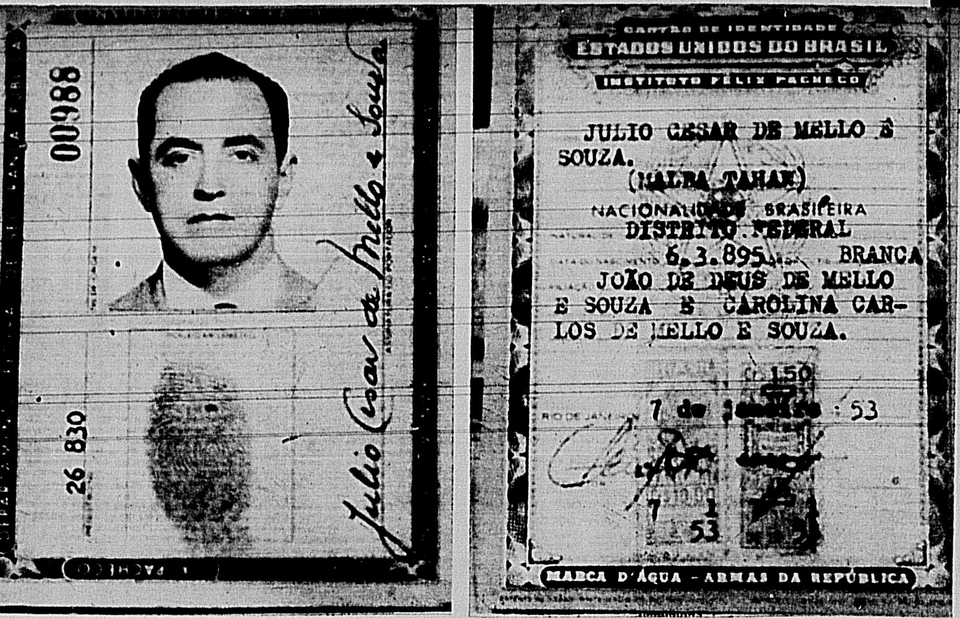
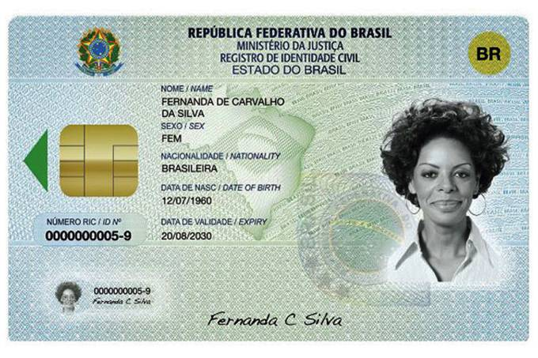

# Carteira de Identidade Nacional (CIN)

A **Carteira de Identidade Nacional (CIN)** representa a maior transformacao no sistema de identificacao civil do Brasil desde a criacao do Registro Geral (RG) na decada de 1900. Instituida pelo **Decreto 10.977, de 23 de fevereiro de 2022**, a CIN unifica a identificacao de todos os cidadaos brasileiros sob um unico numero: o **CPF (Cadastro de Pessoas Fisicas)**. Este artigo apresenta a historia dos documentos de identidade no Brasil, as razoes que motivaram a criacao da CIN, o arcabouco legal que a sustenta e o cronograma de transicao do antigo RG para o novo documento.

## Historia dos Documentos de Identidade no Brasil

A trajetoria dos documentos de identidade no Brasil e marcada por fragmentacao, descentralizacao e tentativas sucessivas de padronizacao. Compreender essa historia e essencial para entender por que a CIN se tornou uma necessidade.

### Periodo Imperial e Primeiros Registros (1808-1889)

Durante o periodo colonial e imperial, nao existia um documento de identidade civil padronizado. A identificacao das pessoas se dava por meio de registros paroquiais — batismo, casamento e obito — mantidos pela Igreja Catolica. Com a vinda da familia real portuguesa em 1808, houve os primeiros esforcos de organizacao burocratica, mas a identificacao civil permaneceu descentralizada e vinculada a registros eclesiasticos.

A Lei 1.829 de 1870 criou a Diretoria Geral de Estatistica, que comecou a estruturar censos populacionais, mas sem estabelecer um documento individual de identificacao.

### Republica Velha e a Criacao do RG (1889-1930)

Com a Proclamacao da Republica e a separacao entre Igreja e Estado, surgiu a necessidade de um registro civil laico. A **Lei dos Registros Publicos** estabeleceu as bases para o registro civil de nascimento, casamento e obito em cartorios.

O **Registro Geral (RG)** comecou a ser emitido no inicio do seculo XX, inicialmente no Rio de Janeiro e em Sao Paulo. Cada estado criou seu proprio Instituto de Identificacao, gerando um sistema descentralizado desde o principio. O documento incluia dados basicos: nome, filiacao, data de nascimento, fotografia e impressao digital.

### Consolidacao e Fragmentacao (1930-2000)

Ao longo do seculo XX, cada unidade da federacao desenvolveu seu proprio formato de RG, com layouts, numeracoes e padroes de seguranca distintos. Essa fragmentacao resultou em um cenario em que o Brasil possuia **27 sistemas de identificacao diferentes**, um para cada estado e o Distrito Federal, sem interoperabilidade entre eles.

A Lei 7.116 de 1983 tentou estabelecer normas gerais para a emissao de carteiras de identidade, definindo campos obrigatorios e buscando alguma padronizacao visual. No entanto, a implementacao ficou a cargo de cada estado, e as diferencas persistiram. Essa lei representou um avanco importante ao determinar que o RG emitido em qualquer estado teria validade nacional, mas nao resolveu o problema fundamental da multiplicidade de numeros e formatos.

### Tentativas de Unificacao (2000-2020)

A ideia de um documento unico de identidade nao e recente. O **Registro de Identidade Civil (RIC)**, criado pela Lei 9.454 de 1997, foi a primeira tentativa concreta de estabelecer um numero unico de identificacao nacional. O projeto previa a criacao de um cadastro biometrico centralizado e a emissao de um cartao com chip. No entanto, o RIC nunca foi implementado em larga escala devido a dificuldades tecnicas, orcamentarias e de coordenacao entre os estados.

O **Documento Nacional de Identificacao (DNI)**, proposto em 2017, tambem buscava unificar CPF, titulo de eleitor e carteira de identidade em um unico documento. Embora tenha havido avancos na versao digital via aplicativo, o documento fisico do DNI nao chegou a ser amplamente distribuido.

## Por Que a Unificacao Era Necessaria

O sistema anterior de identificacao civil brasileiro apresentava problemas graves e bem documentados que justificaram a criacao da CIN.

### O Problema dos 27 Formatos Diferentes

O fato de cada estado emitir seu proprio RG, com numeracao independente, gerava uma serie de consequencias negativas. Um cidadao poderia, em tese, possuir ate 27 numeros de RG diferentes, um em cada unidade da federacao. Essa multiplicidade facilitava fraudes documentais, pois era dificil cruzar informacoes entre os sistemas estaduais.

Alem disso, a falta de padronizacao visual dificultava a verificacao da autenticidade do documento por parte de agentes publicos e privados. Um policial no Amazonas poderia nao estar familiarizado com o formato do RG emitido no Rio Grande do Sul, por exemplo, criando situacoes de inseguranca juridica.

### Fraudes e Duplicidades

Estimativas do Tribunal de Contas da Uniao (TCU) indicavam que milhoes de CPFs estavam vinculados a mais de um RG, evidenciando um cenario de duplicidades e possiveis fraudes. Beneficios sociais, abertura de contas bancarias e outras operacoes que dependiam da identificacao civil estavam vulneraveis a esse tipo de irregularidade.

### Incompatibilidade com Padroes Internacionais

O antigo RG brasileiro nao atendia aos padroes internacionais de documentos de identidade estabelecidos pela **ICAO (Organizacao da Aviacao Civil Internacional)**, especificamente o **Doc 9303**, que define especificacoes para documentos de viagem legiveis por maquina. Essa incompatibilidade dificultava a utilizacao do RG como documento de viagem em paises do Mercosul, onde a carteira de identidade pode substituir o passaporte.

### Exclusao Digital e Social

A falta de um identificador unico dificultava a integracao de bases de dados governamentais e o acesso a servicos digitais. Cidadaos que mudavam de estado frequentemente enfrentavam problemas para comprovar sua identidade, acessar beneficios ou realizar procedimentos burocraticos.

## O Decreto 10.977/2022 e a Criacao da CIN

O **Decreto 10.977, de 23 de fevereiro de 2022**, regulamentou a **Lei 14.534/2023** (originalmente tramitou como projeto de lei em 2021) e estabeleceu as diretrizes para a nova Carteira de Identidade Nacional. Os principais pontos do decreto sao:

### CPF como Identificador Unico

A mudanca mais significativa e a adocao do **CPF (Cadastro de Pessoas Fisicas)** como numero unico de identificacao do cidadao brasileiro. Diferentemente do RG, o CPF e um numero federal, unico e intransferivel, ja amplamente utilizado em operacoes financeiras, fiscais e cadastrais. Ao vincular a identidade civil ao CPF, o decreto eliminou a possibilidade de multiplos numeros de identificacao para um mesmo cidadao.

### Padronizacao Nacional

O decreto estabeleceu um formato unico para a CIN, valido em todo o territorio nacional, com especificacoes tecnicas detalhadas para a versao fisica (cartao de policarbonato e papel) e digital. Todos os Institutos de Identificacao estaduais passaram a emitir o documento no mesmo padrao, sob coordenacao do **Ministerio da Justica e Seguranca Publica** e do **Tribunal Superior Eleitoral (TSE)**.

### Dados Biometricos

A CIN incorpora dados biometricos do cidadao, incluindo impressoes digitais e fotografia em alta resolucao. Esses dados sao armazenados de forma segura e podem ser utilizados para validacao biometrica, aumentando significativamente a seguranca do documento.

### Compatibilidade Internacional

O novo documento segue os padroes da ICAO para documentos de identificacao, incluindo a **Zona de Leitura Mecanica (MRZ — Machine Readable Zone)**, o que permite sua utilizacao como documento de viagem em paises do Mercosul e facilita a verificacao automatizada em pontos de controle migratario.

## Cronograma de Transicao: RG para CIN

O processo de transicao do antigo RG para a CIN foi planejado para ocorrer de forma gradual, respeitando a capacidade operacional dos Institutos de Identificacao estaduais e minimizando o impacto para a populacao.

### Fases da Implementacao

**Fase 1 — Lancamento Piloto (2022):** Os primeiros estados comecaram a emitir a CIN em carater piloto, testando os sistemas e ajustando processos. Goias, Acre, Minas Gerais, Parana, Alagoas e Rio Grande do Sul foram algumas das unidades federativas pioneiras.

**Fase 2 — Expansao Nacional (2023):** Ao longo de 2023, todos os 26 estados e o Distrito Federal passaram a emitir a CIN. A emissao do antigo RG foi gradualmente descontinuada, embora os documentos ja emitidos permanecessem validos durante o periodo de transicao.

**Fase 3 — Adocao Massiva (2024-2028):** Neste periodo, espera-se que a maioria da populacao brasileira ja tenha solicitado a CIN, impulsionada pela gratuidade da primeira emissao e pela necessidade de atualizacao documental para acesso a servicos publicos e privados.

**Fase 4 — Encerramento da Validade do RG (2032):** O decreto estabelece que os antigos RGs perderao sua validade em **28 de fevereiro de 2032**. Apos essa data, apenas a CIN sera aceita como documento de identidade civil no Brasil. Cidadaos com mais de 60 anos na data de publicacao do decreto possuem prazo estendido, com seus RGs permanecendo validos por tempo indeterminado, desde que estejam em bom estado de conservacao.

### Prazos de Validade da CIN

A CIN possui prazos de validade diferenciados conforme a faixa etaria do titular:

- **0 a 12 anos incompletos:** validade de 5 anos
- **12 a 60 anos incompletos:** validade de 10 anos
- **60 anos ou mais:** validade indeterminada

Esses prazos levam em conta as mudancas fisionomicas mais acentuadas em criancas e adolescentes, que exigem atualizacao mais frequente da fotografia.

## Impactos da CIN na Sociedade Brasileira

A implementacao da CIN traz impactos profundos em diversas areas da vida social, economica e administrativa do pais.

### Combate a Fraudes

A unificacao da identificacao sob o CPF, combinada com a validacao biometrica e os recursos de seguranca do novo documento, representa um avanco significativo no combate a fraudes documentais. A possibilidade de verificacao instantanea por meio do QR code e da versao digital reduz drasticamente as oportunidades para uso de documentos falsos ou adulterados.

### Simplificacao Burocratica

Com um unico documento que concentra as informacoes essenciais do cidadao — incluindo, opcionalmente, numeros de outros documentos como titulo de eleitor, carteira de trabalho, cartao do SUS e certificado militar — a CIN simplifica a vida burocratica dos brasileiros. Procedimentos que antes exigiam a apresentacao de multiplos documentos podem agora ser realizados com a CIN.

### Inclusao Digital

A versao digital da CIN, acessivel pelo aplicativo Gov.br, amplia o acesso a servicos publicos digitais e contribui para a inclusao digital da populacao. A validacao biometrica pelo celular permite que cidadaos comprovem sua identidade de forma remota, sem necessidade de deslocamento fisico.

### Integracao de Bases de Dados

A adocao do CPF como chave primaria de identificacao facilita a integracao entre diferentes bases de dados governamentais — federais, estaduais e municipais. Isso melhora a eficiencia na prestacao de servicos publicos, no cruzamento de informacoes para combate a fraudes e na formulacao de politicas publicas baseadas em dados.

## Consideracoes Finais

A Carteira de Identidade Nacional representa um marco historico na identificacao civil brasileira. Apos mais de um seculo de fragmentacao e tentativas frustradas de unificacao, o pais finalmente caminha para um sistema unico, seguro e compativel com padroes internacionais. O prazo ate 2032 para a completa substituicao do RG da ao Brasil uma janela de dez anos para concluir essa transicao, que promete transformar a relacao entre o cidadao e o Estado, simplificando processos, combatendo fraudes e promovendo a inclusao digital.

A CIN nao e apenas um novo documento — e a expressao de uma politica publica de modernizacao do Estado brasileiro, que reconhece a identificacao civil como direito fundamental e instrumento de cidadania.
