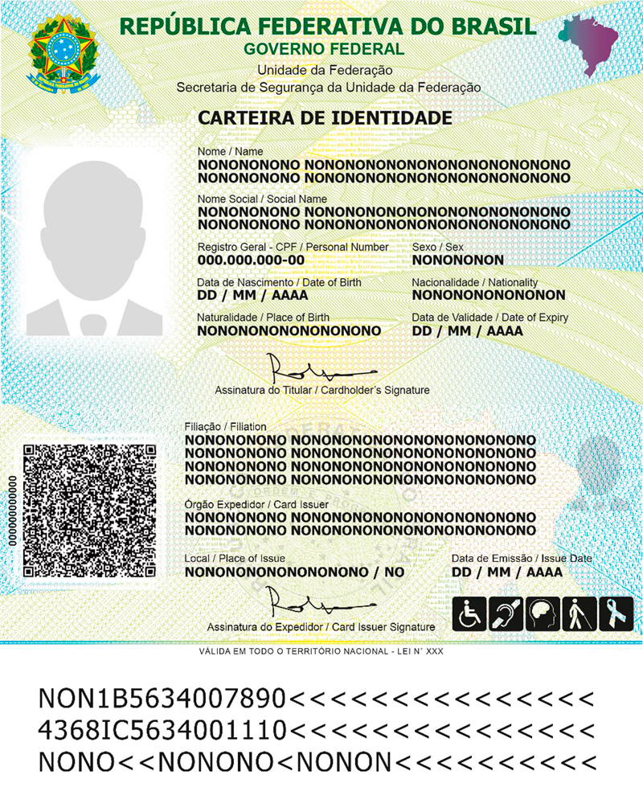
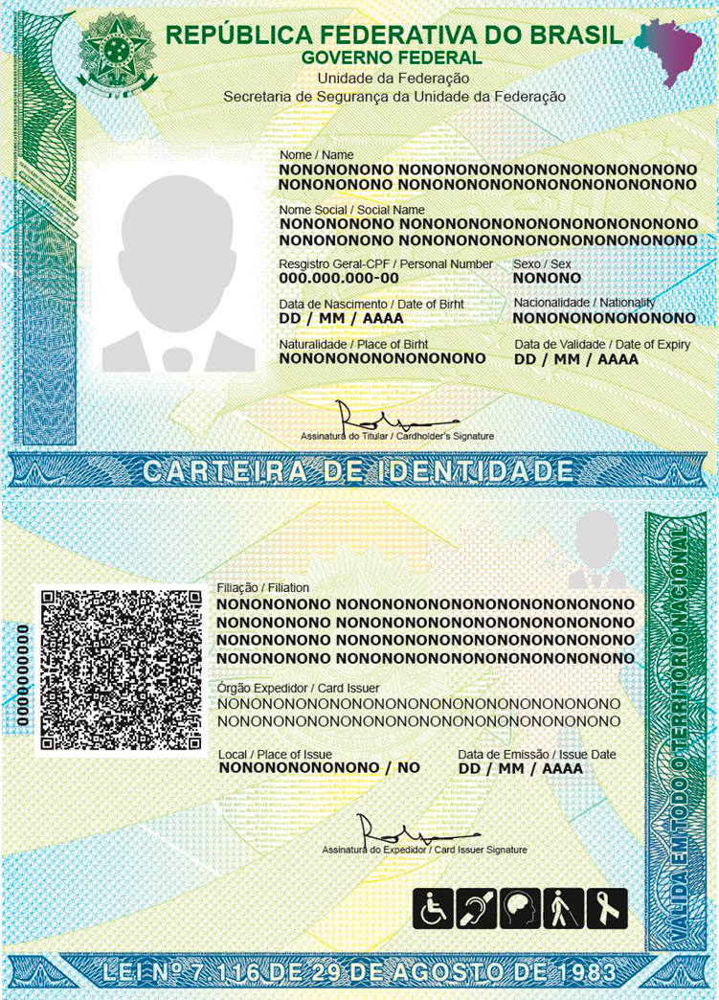

# Especificacoes Tecnicas da CIN

A **Carteira de Identidade Nacional (CIN)** foi projetada para atender aos mais elevados padroes de seguranca documental, combinando tecnologias de ponta com conformidade a normas internacionais. Este artigo detalha as especificacoes tecnicas do documento, abrangendo suas dimensoes fisicas, elementos de seguranca, diferencas entre as versoes em cartao e papel, dados biometricos armazenados e a conformidade com as normas da ICAO.

## Formato Fisico e Dimensoes

A CIN em formato de cartao segue o padrao **ID-1**, definido pela norma **ISO/IEC 7810**, que e o mesmo formato utilizado em cartoes de credito, cartoes bancarios e documentos de identidade em dezenas de paises ao redor do mundo. Esse padrao garante compatibilidade universal com leitores de documentos e facilita o porte pelo cidadao.

### Dimensoes do Cartao (Formato ID-1)

As dimensoes exatas do cartao sao:

- **Largura:** 85,60 mm (3,370 polegadas)
- **Altura:** 53,98 mm (2,125 polegadas)
- **Espessura:** 0,76 mm (0,030 polegadas)
- **Cantos arredondados:** raio de 3,18 mm

Essas dimensoes sao identicas as de um cartao de credito padrao, permitindo que a CIN seja armazenada em qualquer carteira convencional. O material utilizado e o **policarbonato**, um polimero termoplastico de alta resistencia mecanica, termica e quimica, que confere ao documento durabilidade superior e resistencia a tentativas de adulteracao.

### Material e Processo de Fabricacao

O cartao de policarbonato e produzido por meio de um processo de **laminacao a quente**, no qual multiplas camadas de policarbonato sao fundidas sob pressao e temperatura controladas. A personalizacao dos dados do titular — nome, fotografia, numero do CPF e demais informacoes — e realizada por **gravacao a laser**, que altera permanentemente a estrutura interna do material. Esse metodo torna praticamente impossivel a remocao ou alteracao dos dados sem destruir o cartao.

A fotografia do titular e gravada internamente nas camadas do policarbonato, e nao impressa na superficie, o que impede a substituicao da foto por metodos convencionais de falsificacao.

## Elementos de Seguranca

A CIN incorpora uma combinacao sofisticada de elementos de seguranca visiveis e ocultos, projetados para dificultar a falsificacao e permitir a verificacao rapida da autenticidade do documento.

### QR Code Dinamico

Na parte traseira do cartao, esta presente um **QR code** que contem informacoes criptografadas sobre o titular. Esse QR code permite a verificacao instantanea da autenticidade do documento por meio de aplicativos autorizados, como o Gov.br. Ao escanear o codigo, o verificador pode confirmar se os dados impressos no cartao correspondem aos dados registrados na base de dados oficial.

O QR code da CIN utiliza **criptografia assimetrica** e **assinatura digital**, garantindo que as informacoes nao possam ser adulteradas. Cada QR code e unico e vinculado exclusivamente ao documento para o qual foi gerado.

### Zona de Leitura Mecanica (MRZ)

A CIN possui uma **MRZ (Machine Readable Zone)** na parte inferior da frente do cartao, seguindo o padrao **ICAO Doc 9303 Parte 5** para cartoes de identificacao no formato ID-1. A MRZ e composta por tres linhas de 30 caracteres cada, codificadas em fonte OCR-B, contendo:

- **Linha 1:** Tipo de documento, codigo do pais emissor (BRA) e nome do titular
- **Linha 2:** Numero do documento, nacionalidade, data de nascimento, sexo e data de validade
- **Linha 3:** Informacoes complementares e digitos verificadores

A MRZ permite a leitura automatizada do documento por equipamentos de controle migratario, caixas eletronicos e outros sistemas de verificacao, agilizando processos que antes dependiam exclusivamente da digitacao manual dos dados.

### Microimpressao (Microprint)

Diversas areas do cartao contem textos em **microimpressao**, visiveis apenas com lupa ou equipamento de magnificacao. Esses microtextos reproduzem elementos como o nome do pais, "REPUBLICA FEDERATIVA DO BRASIL", e outros padroes que sao extremamente dificeis de reproduzir por meio de scanners ou impressoras convencionais.

A microimpressao esta presente tanto no fundo de seguranca do cartao quanto em areas especificas proximas a fotografia e aos dados pessoais. A tentativa de fotocopia ou digitalizacao do documento resulta na perda desses detalhes, facilitando a identificacao de copias fraudulentas.

### Tinta Reagente a Luz Ultravioleta (UV)

O cartao possui elementos impressos com **tinta fluorescente** que sao invisiveis sob iluminacao normal, mas se tornam visiveis quando expostos a **luz ultravioleta (UV)**. Esses elementos incluem:

- Bandeira do Brasil em cores fluorescentes
- Numero do CPF do titular
- Padroes graficos de seguranca
- Marcas de posicionamento para verificacao automatizada

A verificacao por luz UV e um procedimento padrao em postos de controle migratario, agencias bancarias e outros locais onde a autenticidade de documentos precisa ser confirmada rapidamente.

### Holograma e Elementos Oticamente Variaveis (OVD)

A CIN conta com um **dispositivo oticamente variavel (OVD — Optically Variable Device)**, comumente conhecido como holograma, aplicado na superficie do cartao. Esse elemento apresenta imagens que mudam de cor e aparencia conforme o angulo de observacao, sendo extremamente dificil de reproduzir.

O holograma da CIN incorpora:

- **Imagem do mapa do Brasil** com efeito de mudanca de cor (color-shifting)
- **Texto "CIN"** com efeito de movimento cinetico
- **Microestruturas** que produzem padroes difrativos unicos
- **Numero do documento** integrado ao holograma, vinculando o elemento de seguranca a um cartao especifico

### Imagem Fantasma (Ghost Image)

Na parte frontal do cartao, alem da fotografia principal do titular, ha uma **imagem fantasma** — uma versao reduzida e estilizada da fotografia, gravada a laser em outra area do documento. Essa segunda imagem serve como elemento adicional de seguranca, pois qualquer tentativa de substituir a foto principal sem alterar a imagem fantasma revelaria a adulteracao.

### Gravacao Tactil (Relevo)

Determinados elementos do cartao possuem **relevo tactil**, perceptivel ao toque. Isso permite uma verificacao rapida e simples da autenticidade, sem necessidade de equipamentos especiais. O relevo esta presente em areas como o brasao da Republica e em linhas de seguranca especificas.

### Chip Contactless (NFC)

Os modelos mais recentes da CIN incorporam um **chip NFC (Near Field Communication)** embutido no cartao de policarbonato. Esse chip armazena de forma criptografada:

- Dados biograficos do titular (nome, data de nascimento, filiacao)
- Fotografia digital em alta resolucao
- Impressoes digitais (minutias)
- Assinatura digital do emissor
- Certificados digitais para validacao

O chip segue o protocolo **ICAO 9303** e pode ser lido por equipamentos compativeis mediante apresentacao do documento, sem necessidade de contato fisico (leitura por aproximacao). A comunicacao entre o chip e o leitor e protegida por protocolos de seguranca como **BAC (Basic Access Control)** e **PACE (Password Authenticated Connection Establishment)**.

## Versao em Cartao vs. Versao em Papel

A CIN e emitida em duas versoes fisicas: o **cartao de policarbonato** e a **versao em papel**. Ambas possuem validade juridica identica, mas apresentam diferencas significativas em termos de durabilidade e elementos de seguranca.

### Versao em Cartao (Policarbonato)

A versao em cartao e o formato premium da CIN, oferecendo:

- **Durabilidade superior:** resistencia a agua, flexao, temperatura e abrasao
- **Maior numero de elementos de seguranca:** holograma, chip NFC, gravacao a laser
- **Formato compacto:** dimensoes ID-1, facilmente portavel
- **Leitura automatizada:** MRZ e chip NFC para verificacao rapida
- **Vida util:** compativel com os prazos de validade do documento (5 a 10 anos)

### Versao em Papel

A versao em papel e uma alternativa mais acessivel, emitida em formato de folha dobrada, similar ao antigo RG em papel. Ela inclui:

- **QR code** para validacao digital
- **MRZ** para leitura mecanica
- **Microimpressao** e **fundo de seguranca** com padroes antifalsificacao
- **Fotografia** impressa com tecnicas de seguranca
- **Marca d'agua** no papel de seguranca

Embora a versao em papel nao possua chip NFC ou holograma, ela mantem um nivel robusto de seguranca e e juridicamente equivalente a versao em cartao. A escolha entre uma e outra depende da disponibilidade no posto de atendimento e, em alguns estados, da preferencia do cidadao.

## Dados Biometricos Armazenados

A CIN armazena dados biometricos do titular, utilizados para validacao de identidade e prevencao de fraudes. Os dados biometricos coletados e armazenados incluem:

### Impressoes Digitais

Sao coletadas as impressoes digitais dos **dez dedos** do titular no momento do cadastro. As minutias (pontos caracteristicos das impressoes) sao extraidas e armazenadas:

- **No chip NFC** do cartao de policarbonato (formato compactado)
- **Na base de dados** do Instituto de Identificacao estadual
- **Na base de dados federal** do Ministerio da Justica (CANRIC — Cadastro Nacional de Registro de Identificacao Civil)

O padrao de armazenamento segue a norma **ISO/IEC 19794-2** para representacao de minutias de impressoes digitais, garantindo interoperabilidade entre diferentes sistemas.

### Fotografia Biometrica

A fotografia do titular segue padroes biometricos rigorosos, compativeis com a norma **ICAO 9303** e a **ISO/IEC 19794-5** para imagens faciais:

- **Fundo neutro** (branco ou cinza claro)
- **Expressao neutra**, boca fechada
- **Iluminacao uniforme**, sem sombras no rosto
- **Enquadramento padronizado:** rosto centralizado, ocupando entre 70% e 80% da altura da imagem
- **Resolucao minima:** 300 dpi para impressao no cartao; resolucao superior para armazenamento digital

### Assinatura

A assinatura manuscrita do titular e digitalizada e armazenada tanto no documento fisico quanto no chip NFC. Para menores de 12 anos ou pessoas que nao sabem ou nao podem assinar, a assinatura e substituida pela impressao digital do polegar direito.

## Conformidade com Normas ICAO

A CIN foi projetada em conformidade com as normas da **ICAO (International Civil Aviation Organization)**, especificamente o **Doc 9303** — o documento tecnico que define padroes para documentos de viagem legiveis por maquina (MRTD — Machine Readable Travel Documents).

### ICAO Doc 9303 — Parte 5

A Parte 5 do Doc 9303 trata especificamente de cartoes de identificacao no formato ID-1, que e o formato adotado pela CIN. Os requisitos incluem:

- **Formato fisico:** dimensoes ID-1 conforme ISO/IEC 7810
- **MRZ:** tres linhas de 30 caracteres no formato TD1
- **Zona de inspecao visual (VIZ):** layout padronizado com campos obrigatorios
- **Fotografia:** posicionamento e dimensoes especificos
- **Elementos de seguranca:** minimos obrigatorios para prevencao de falsificacao

### Implicacoes para Viagens Internacionais

A conformidade com a ICAO permite que a CIN seja utilizada como **documento de viagem** em paises do **Mercosul** e em nacoes com acordos bilaterais com o Brasil. Nos postos de controle migratario, a MRZ da CIN pode ser lida automaticamente pelos mesmos equipamentos utilizados para passaportes, agilizando o processo de entrada e saida.

Essa compatibilidade tambem abre caminho para futuros acordos de reconhecimento mutuo de documentos de identidade com outros blocos economicos e paises, ampliando as possibilidades de uso internacional da CIN.

## Layout e Distribuicao dos Campos

O layout da CIN segue uma organizacao padronizada, com campos distribuidos de forma a facilitar tanto a leitura humana quanto a leitura automatizada.

### Frente do Cartao

- **Canto superior esquerdo:** Brasao da Republica Federativa do Brasil
- **Centro superior:** Inscricao "REPUBLICA FEDERATIVA DO BRASIL" e "CARTEIRA DE IDENTIDADE"
- **Fotografia:** Lado esquerdo, dimensoes padronizadas
- **Dados pessoais:** Nome, data de nascimento, sexo, naturalidade, nacionalidade
- **Numero do CPF:** Destaque, como identificador principal
- **Data de emissao e validade**
- **Imagem fantasma:** Versao reduzida da fotografia
- **MRZ:** Parte inferior

### Verso do Cartao

- **Filiacao:** Nome do pai e da mae
- **Registro civil:** Dados da certidao de nascimento ou casamento
- **Outros documentos (opcionais):** PIS/PASEP, titulo de eleitor, carteira de trabalho, cartao do SUS, certificado militar, NIS
- **QR code:** Para validacao digital
- **Assinatura do titular**
- **Impressao digital:** Polegar direito (imagem reduzida)
- **Orgao emissor e numero do RG anterior** (quando aplicavel)

## Seguranca do Documento Digital

Alem do documento fisico, a CIN possui uma **versao digital** disponivel no aplicativo Gov.br, que incorpora seus proprios mecanismos de seguranca. A versao digital inclui todos os dados da versao fisica, protegidos por:

- **Certificado digital ICP-Brasil**
- **Carimbo de tempo** com validade juridica
- **QR code dinamico** com dados criptografados
- **Validacao biometrica** (reconhecimento facial via camera do smartphone)
- **Vinculacao ao dispositivo:** a versao digital e associada ao aparelho celular do titular

A combinacao de todos esses elementos — fisicos e digitais — faz da CIN um dos documentos de identidade mais seguros da America Latina, alinhado as melhores praticas internacionais de seguranca documental.

## Comparativo com Documentos de Outros Paises

Para contextualizar o nivel de sofisticacao da CIN, vale comparar com documentos de identidade de outros paises:

| Caracteristica | CIN (Brasil) | DNI (Argentina) | Cedula (Colombia) | ID Card (Alemanha) |
|---|---|---|---|---|
| Formato | ID-1 | ID-1 | ID-1 | ID-1 |
| MRZ | Sim (TD1) | Sim (TD1) | Sim (TD1) | Sim (TD1) |
| Chip NFC | Sim | Sim | Nao | Sim |
| Holograma | Sim | Sim | Sim | Sim |
| Versao Digital | Sim (Gov.br) | Sim (Mi Argentina) | Sim | Sim (AusweisApp) |
| Biometria | Impressao digital + facial | Impressao digital + facial | Impressao digital | Impressao digital + facial |

A CIN posiciona o Brasil em pe de igualdade com os documentos de identidade mais modernos do mundo, representando um salto qualitativo em relacao ao antigo RG.
