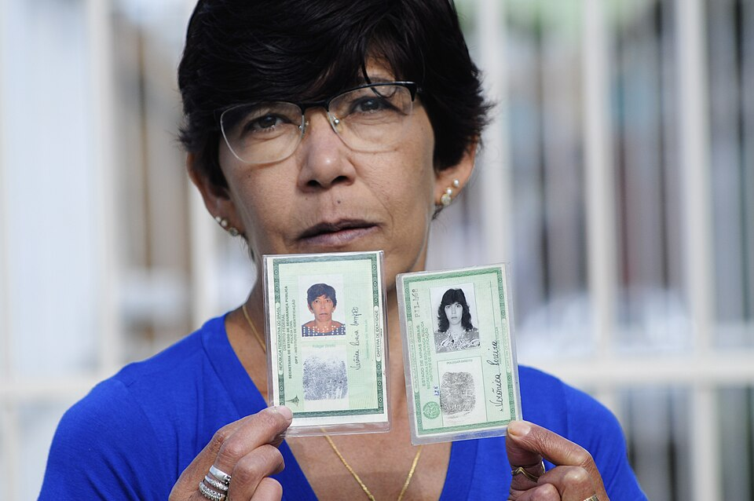
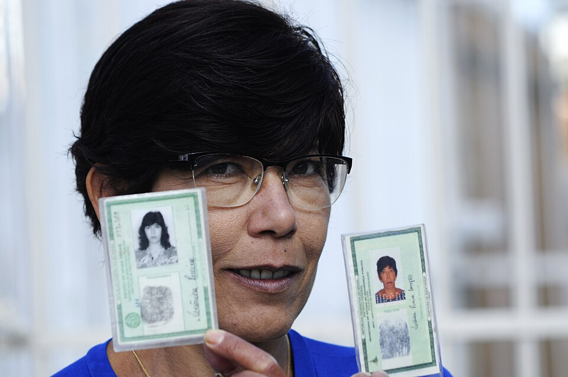

# Processo de Emissao da CIN

A emissao da **Carteira de Identidade Nacional (CIN)** e um processo estruturado que envolve diferentes orgaos governamentais, requisitos documentais e etapas de atendimento. Este artigo detalha todo o fluxo de emissao, desde o agendamento ate a retirada do documento, abordando locais de atendimento, documentos necessarios, custos, prazos e casos especiais.

## Locais de Atendimento

A CIN e emitida pelos **Institutos de Identificacao** de cada estado brasileiro e do Distrito Federal, que sao os orgaos tecnicamente responsaveis pela coleta biometrica, producao e entrega do documento. O atendimento ao cidadao ocorre em diferentes tipos de postos, conforme a organizacao de cada unidade da federacao.

### Institutos de Identificacao Estaduais

Cada estado possui seu Instituto de Identificacao (ou orgao equivalente), vinculado a Secretaria de Seguranca Publica ou a Policia Civil. Esses institutos sao os orgaos centrais responsaveis por:

- Coleta de dados biometricos (impressoes digitais e fotografia)
- Verificacao de antecedentes e duplicidades
- Producao do cartao de policarbonato ou do documento em papel
- Gerenciamento da base de dados estadual de identificacao
- Integracao com o **CANRIC (Cadastro Nacional de Registro de Identificacao Civil)**, a base federal mantida pelo Ministerio da Justica

Exemplos de Institutos de Identificacao por estado:

- **Sao Paulo:** Instituto de Identificacao Ricardo Gumbleton Daunt (IIRGD)
- **Rio de Janeiro:** Instituto de Identificacao Felix Pacheco (IIFP)
- **Minas Gerais:** Instituto de Identificacao da Policia Civil de Minas Gerais
- **Rio Grande do Sul:** Instituto-Geral de Pericias (IGP-RS)
- **Bahia:** Instituto de Identificacao Pedro Mello (IIPM)
- **Distrito Federal:** Instituto de Identificacao da Policia Civil do DF

### Postos de Atendimento

Alem das sedes dos Institutos de Identificacao, o atendimento ao cidadao e descentralizado por meio de:

**Postos em unidades do Poupatempo / Vapt Vupt / SAC:** Na maioria dos estados, os centros de atendimento integrado ao cidadao (como o Poupatempo em Sao Paulo, Vapt Vupt em Goias, SAC na Bahia, UAI em Minas Gerais e Rio Poupa Tempo no Rio de Janeiro) oferecem o servico de emissao da CIN. Esses postos costumam ter a infraestrutura mais moderna e os menores tempos de espera.

**Postos em Shopping Centers e locais publicos:** Alguns estados instalaram postos de atendimento em shopping centers, terminais rodoviarios, estacoes de metro e outros locais de grande circulacao, facilitando o acesso da populacao.

**Postos moveis (itinerantes):** Para atender comunidades em areas rurais, ribeirinhas ou de dificil acesso, muitos estados operam unidades moveis — veiculos equipados com toda a infraestrutura necessaria para coleta biometrica e emissao do documento. Essa iniciativa e particularmente importante para garantir que cidadaos em regioes remotas tenham acesso a CIN.

**Postos em municipios do interior:** Em estados de grande extensao territorial, postos de atendimento sao instalados em prefeituras, foruns ou delegacias de municipios do interior, frequentemente operando em dias e horarios especificos.

### Agendamento

Na maioria dos estados, o atendimento para emissao da CIN e realizado **mediante agendamento previo**, que pode ser feito por:

- **Internet:** Sites dos Institutos de Identificacao ou dos centros de atendimento integrado
- **Aplicativos:** Alguns estados disponibilizam aplicativos proprios para agendamento
- **Telefone:** Centrais de atendimento telefonico (156, 135, ou numeros especificos)
- **Presencial:** Em alguns postos, e possivel agendar diretamente no local

O agendamento previo reduz significativamente o tempo de espera e permite um melhor planejamento da capacidade de atendimento. Em periodos de alta demanda, como o inicio da emissao da CIN em cada estado, os agendamentos podem ter filas de espera de dias ou semanas.

## Documentos Necessarios

Os documentos exigidos para a emissao da CIN variam conforme a situacao do solicitante: primeira emissao, segunda via, atualizacao de dados ou casos especiais.

### Para Primeira Emissao (Brasileiros Natos)

**Documento obrigatorio principal:**
- **Certidao de Nascimento** (original ou certidao de inteiro teor) — para solteiros
- **Certidao de Casamento** (original ou certidao de inteiro teor) — para casados
- **Certidao de Casamento com averbacao de divorcio** — para divorciados
- **Certidao de Casamento com averbacao de obito do conjuge** — para viuvos

**Documento de identificacao com CPF:**
- **CPF** do solicitante (pode estar impresso na certidao de nascimento/casamento emitida apos 2010, no cartao do CPF, ou ser consultado no site da Receita Federal)

**Fotografia:**
- A fotografia e capturada no momento do atendimento, nos postos de emissao. O cidadao nao precisa levar fotografias impressas. E importante comparecer com aparencia atualizada, sem oculos escuros e sem acessorios que cubram o rosto (exceto por motivos religiosos).

### Para Segunda Via ou Renovacao

- **CIN ou RG anterior** (se disponivel)
- **Certidao de Nascimento ou Casamento** (original)
- **CPF**
- **Boletim de Ocorrencia** (em caso de perda, furto ou roubo do documento anterior)

### Para Atualizacao de Dados

Quando ha alteracao de nome (por casamento, divorcio ou retificacao judicial), e necessario apresentar:

- **CIN ou RG atual**
- **Certidao atualizada** com a averbacao correspondente
- **CPF**
- **Mandado judicial** (em caso de retificacao de registro civil por decisao judicial)

### Documentos Opcionais para Inclusao na CIN

O cidadao pode solicitar a inclusao dos seguintes documentos no verso da CIN:

- **Titulo de Eleitor** (numero e zona eleitoral)
- **Carteira de Trabalho e Previdencia Social (CTPS)** (numero e serie)
- **Certificado Militar** (numero)
- **Cartao Nacional de Saude (CNS/SUS)** (numero)
- **PIS/PASEP** (numero)
- **NIS (Numero de Identificacao Social)**

Para a inclusao desses dados, e necessario apresentar os documentos originais ou comprovantes de cadastro correspondentes.

## Taxas e Gratuidade

O custo para emissao da CIN varia conforme a situacao.

### Primeira Emissao: Gratuita

A **primeira emissao** da CIN e **inteiramente gratuita** para todos os cidadaos brasileiros, independentemente de idade, renda ou situacao social. Essa gratuidade foi estabelecida por lei federal e e garantida em todos os estados, com o objetivo de facilitar a adesao ao novo documento e garantir que o custo nao seja um impedimento para a obtencao da CIN.

### Segunda Via

A emissao de segunda via da CIN, motivada por perda, furto, roubo, danificacao ou necessidade de atualizacao de dados, **pode ter custos** que variam conforme o estado. Os valores tipicos variam entre R$ 0,00 (gratuito) e R$ 60,00, dependendo da legislacao estadual.

**Isencao de taxa para segunda via:** Diversos estados concedem isencao de taxa para cidadaos em situacao de vulnerabilidade social, incluindo:

- Pessoas inscritas no **CadUnico** com renda familiar per capita de ate meio salario minimo
- Pessoas em situacao de rua
- Indigenas
- Cidadaos com mais de 60 anos (em alguns estados)
- Vitimas de furto ou roubo (mediante apresentacao de Boletim de Ocorrencia, em alguns estados)
- Pessoas com deficiencia (em alguns estados)

### Versao Cartao vs. Papel

Em alguns estados, a versao em **cartao de policarbonato** pode ter um custo adicional em relacao a versao em **papel**, especialmente para segunda via. Essa diferenciacao ocorre porque o custo de producao do cartao de policarbonato e significativamente superior ao da versao em papel.

## Etapas do Processo de Emissao

O processo de emissao da CIN segue um fluxo padronizado em todo o territorio nacional, embora detalhes operacionais possam variar entre os estados.

### Etapa 1: Agendamento

O cidadao realiza o agendamento por um dos canais disponiveis (internet, telefone, aplicativo ou presencialmente). Ao agendar, e informado sobre os documentos necessarios e o local e horario do atendimento.

### Etapa 2: Comparecimento e Triagem

No dia agendado, o cidadao comparece ao posto de atendimento com os documentos necessarios. Um atendente realiza a triagem inicial, verificando se todos os documentos estao em ordem e se o cidadao esta apto a prosseguir.

### Etapa 3: Coleta de Dados Biograficos

O atendente registra os dados pessoais do cidadao no sistema, incluindo nome completo, data de nascimento, naturalidade, filiacao, estado civil e demais informacoes constantes da certidao de nascimento ou casamento.

### Etapa 4: Coleta Biometrica

A etapa de coleta biometrica inclui:

- **Impressoes digitais:** Sao coletadas as impressoes dos dez dedos do solicitante, utilizando um leitor biometrico eletronico. As imagens das impressoes sao capturadas em alta resolucao e as minutias sao extraidas automaticamente.

- **Fotografia:** A fotografia e capturada digitalmente no posto de atendimento, seguindo os padroes biometricos estabelecidos pela ICAO (fundo neutro, expressao neutra, iluminacao uniforme).

- **Assinatura:** O cidadao assina em um tablet ou pad de assinatura digital. Para menores de 12 anos ou pessoas que nao podem assinar, a assinatura e substituida pela impressao digital.

### Etapa 5: Conferencia e Validacao

Os dados coletados sao apresentados ao cidadao para conferencia. E fundamental que o solicitante verifique cuidadosamente todas as informacoes antes de confirmar, pois erros detectados apos a emissao do documento exigirao uma nova solicitacao.

### Etapa 6: Verificacao de Duplicidade e Antecedentes

O sistema realiza automaticamente uma verificacao de duplicidade, cruzando os dados biometricos e biograficos do solicitante com as bases de dados estadual e federal (CANRIC). Essa etapa visa impedir que uma mesma pessoa obtenha multiplas identidades e verificar eventuais restricoes.

### Etapa 7: Producao do Documento

Apos a aprovacao, o documento entra em fila de producao. O cartao de policarbonato e produzido em uma central grafica de seguranca, enquanto a versao em papel pode ser impressa diretamente no posto de atendimento, dependendo do estado.

### Etapa 8: Retirada

O cidadao retira o documento no local indicado, que pode ser o mesmo posto de atendimento ou um ponto de retirada especifico. Em alguns estados, ha opcao de entrega por correio (mediante taxa adicional).

## Prazos de Emissao

Os prazos para emissao da CIN variam significativamente entre os estados e dependem de fatores como demanda, capacidade operacional e formato do documento.

**Versao em papel:** Em muitos estados, a versao em papel pode ser emitida e entregue no mesmo dia do atendimento, ou em ate 5 dias uteis.

**Versao em cartao de policarbonato:** O prazo tipico varia de 10 a 30 dias uteis, pois o cartao precisa ser produzido em uma central grafica de seguranca e enviado ao posto de atendimento.

**Periodos de alta demanda:** Em momentos de grande procura, como o inicio da emissao em um novo estado ou em periodos proximos a datas-limite, os prazos podem ser significativamente maiores.

## Casos Especiais

### Menores de Idade

**Menores de 16 anos** devem comparecer ao posto de atendimento acompanhados de pelo menos um dos pais ou responsavel legal, que devera apresentar:

- Certidao de nascimento da crianca ou adolescente (original)
- Documento de identidade do pai, mae ou responsavel legal
- CPF da crianca ou adolescente (obrigatorio)
- Termo de guarda ou tutela (se o acompanhante nao for pai ou mae)

**Menores de 12 anos** nao assinam o documento; em seu lugar, e registrada a impressao digital.

**Adolescentes entre 16 e 17 anos** podem solicitar a CIN desacompanhados em alguns estados, desde que apresentem todos os documentos exigidos. Em outros estados, a presenca de um responsavel e obrigatoria ate os 18 anos.

A **validade da CIN para menores de 12 anos** e de **5 anos**, refletindo as mudancas fisionomicas mais rapidas nessa faixa etaria.

### Estrangeiros Naturalizados

Cidadaos estrangeiros que obtiveram a **naturalizacao brasileira** tem direito a CIN. Para a emissao, devem apresentar:

- **Portaria de naturalizacao** (publicada no Diario Oficial da Uniao)
- **Certidao de inteiro teor do registro de nascimento** traduzido por tradutor juramentado e registrado em cartorio de registro de titulos e documentos
- **CPF**
- **Registro Nacional Migratario (RNM)** ou protocolo

O processo de emissao segue as mesmas etapas dos cidadaos brasileiros natos, com a diferenca de que o campo "nacionalidade" indicara "brasileira" (naturalizado) e podera constar a naturalidade original.

### Pessoas com Deficiencia

O processo de emissao da CIN contempla acessibilidade para pessoas com deficiencia:

- **Deficiencia visual:** A fotografia e a coleta biometrica seguem procedimentos adaptados. Atendentes auxiliam na conferencia dos dados, que podem ser lidos em voz alta.
- **Deficiencia auditiva:** Postos de atendimento devem disponibilizar interpretes de Libras (Lingua Brasileira de Sinais) ou atendentes capacitados.
- **Deficiencia fisica:** Postos devem ser acessiveis (rampas, elevadores, balcoes adaptados). Para cidadaos que nao possuem um ou mais dedos, a coleta de impressoes digitais e realizada com os dedos disponiveis.
- **Deficiencia intelectual:** Responsaveis legais ou curadores podem acompanhar o cidadao e auxiliar no processo.

No campo de observacoes da CIN, pode ser incluida a indicacao de deficiencia, caso o titular deseje e apresente laudo medico.

### Populacao Indigena

Para cidadaos indigenas, o processo de emissao apresenta particularidades:

- O **nome indigena** pode ser registrado na CIN, conforme a Lei 6.001/1973 (Estatuto do Indio) e a Constituicao Federal
- A certidao de nascimento pode ser a **RANI (Registro Administrativo de Nascimento Indigena)**, emitida pela FUNAI
- Postos itinerantes da CIN frequentemente atendem terras indigenas
- A emissao e **gratuita** (primeira e segunda via)

### Pessoas em Situacao de Rua

Cidadaos em situacao de rua que nao possuem certidao de nascimento ou CPF podem buscar assistencia nos **Centros de Referencia de Assistencia Social (CRAS)** e **Centros de Referencia Especializados de Assistencia Social (CREAS)**, que auxiliam na obtencao dos documentos basicos necessarios para a emissao da CIN.

Diversos estados realizam mutiroes de emissao da CIN voltados especificamente para a populacao em situacao de rua, em parceria com entidades assistenciais.

### Brasileiros no Exterior

Brasileiros residentes no exterior podem solicitar a CIN nos **consulados** e **embaixadas** do Brasil, que atuam como postos de atendimento do Instituto de Identificacao. O processo segue as mesmas etapas, com prazos que podem ser maiores devido ao envio internacional do documento.

## Integracao com o Sistema Nacional

A emissao da CIN esta integrada ao **CANRIC (Cadastro Nacional de Registro de Identificacao Civil)**, gerenciado pelo **Ministerio da Justica e Seguranca Publica** em parceria com o **Tribunal Superior Eleitoral (TSE)**. Essa integracao permite:

- Verificacao nacional de duplicidades antes da emissao
- Cruzamento de dados biometricos entre todos os estados
- Emissao do documento em qualquer estado, independentemente da naturalidade do cidadao
- Consulta e validacao do documento por orgaos publicos em todo o territorio nacional

O CANRIC utiliza a base biometrica do TSE, que contem as impressoes digitais e fotografias de mais de 150 milhoes de eleitores brasileiros, como referencia para a validacao biometrica. Essa integracao foi fundamental para viabilizar a implementacao da CIN em escala nacional com seguranca e confiabilidade.
