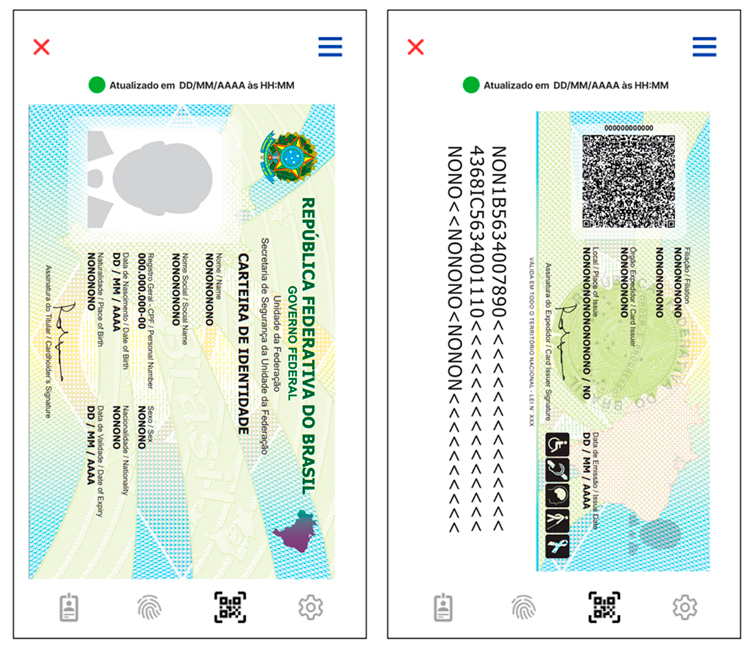
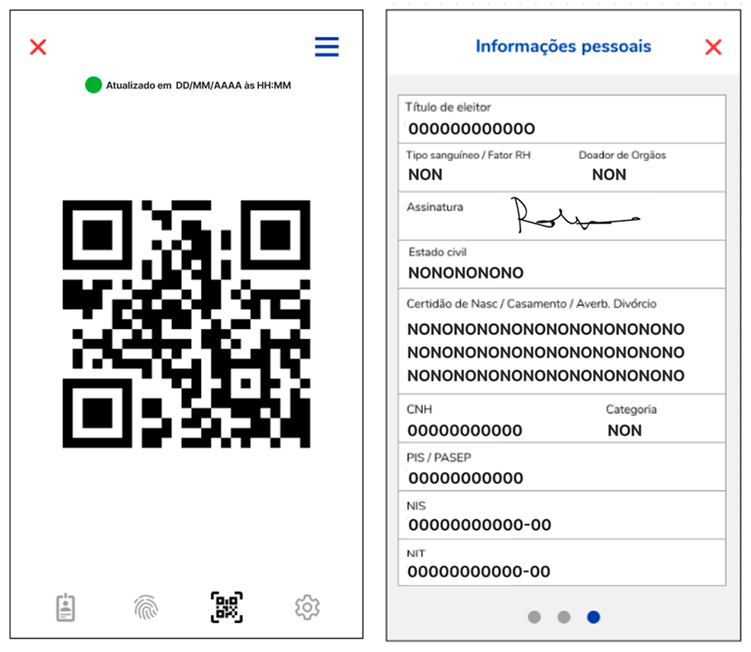

# CIN Digital e Validacao

A versao digital da **Carteira de Identidade Nacional (CIN)** representa um avanco significativo na forma como os cidadaos brasileiros comprovam sua identidade. Disponivel por meio do aplicativo **Gov.br**, a CIN digital possui **equivalencia juridica** ao documento fisico e incorpora mecanismos sofisticados de seguranca e validacao. Este artigo aborda em detalhes a versao digital da CIN, o processo de validacao por QR code, a verificacao biometrica b-CPF, a capacidade de validacao offline, a equivalencia legal e a integracao com o ecossistema de servicos digitais do governo federal.

## A CIN Digital no Aplicativo Gov.br

O **aplicativo Gov.br** e a plataforma oficial do governo federal brasileiro para acesso a servicos publicos digitais. Disponivel gratuitamente para dispositivos **Android** (Google Play Store) e **iOS** (Apple App Store), o aplicativo funciona como uma carteira digital de documentos, e a CIN e um dos documentos centrais dessa carteira.

### Requisitos para Acesso a CIN Digital

Para acessar a CIN digital no aplicativo Gov.br, o cidadao precisa:

1. **Ter a CIN fisica emitida:** A versao digital so esta disponivel para cidadaos que ja possuem a CIN fisica (cartao ou papel). O documento digital e gerado a partir dos dados cadastrados no momento da emissao fisica.

2. **Possuir conta Gov.br com nivel Prata ou Ouro:** O sistema Gov.br classifica as contas dos usuarios em tres niveis de confiabilidade:
   - **Bronze:** Cadastro basico com CPF e validacao de dados. Nao permite acesso a CIN digital.
   - **Prata:** Validacao por biometria facial, internet banking de instituicoes conveniadas ou certificado digital em nuvem. Permite acesso a CIN digital.
   - **Ouro:** Validacao por biometria facial comparada a base da Justica Eleitoral (TSE) ou certificado digital ICP-Brasil. Nivel maximo de seguranca. Permite acesso completo a todos os servicos.

3. **Realizar validacao biometrica facial:** O cidadao deve passar por um processo de reconhecimento facial no aplicativo, no qual a camera do smartphone captura imagens do rosto em diferentes angulos. Essas imagens sao comparadas com a fotografia cadastrada na base de dados do TSE ou do Instituto de Identificacao.

4. **Dispositivo compativel:** Smartphone com camera frontal, conexao a internet (para ativacao inicial e atualizacoes), sistema operacional Android 8.0 ou superior ou iOS 13 ou superior.

### Dados Exibidos na CIN Digital

A CIN digital exibe as mesmas informacoes presentes no documento fisico:

- Fotografia do titular
- Nome completo
- Data de nascimento
- Sexo
- Naturalidade e nacionalidade
- Filiacao (nome dos pais)
- Numero do CPF (identificador unico)
- Data de emissao e validade
- Orgao emissor
- Numero do RG anterior (quando aplicavel)
- Documentos opcionais (titulo de eleitor, CTPS, cartao do SUS, etc.)
- QR code de validacao

Alem disso, a versao digital apresenta elementos de seguranca exclusivos, como animacoes holograficas, selos digitais e marcas d'agua dinamicas que se movem ao inclinar o dispositivo, dificultando a captura de tela para uso fraudulento.

### Vinculacao ao Dispositivo

A CIN digital e vinculada ao dispositivo movel do titular por meio de um processo criptografico que associa o documento a um identificador unico do aparelho. Isso significa que:

- A CIN digital so pode ser acessada no dispositivo em que foi ativada
- Em caso de troca de aparelho, e necessario reativar o documento no novo dispositivo, passando novamente pela validacao biometrica
- A perda ou roubo do aparelho nao compromete a seguranca do documento, pois o acesso requer autenticacao biometrica (reconhecimento facial ou digital) no proprio dispositivo

## Processo de Validacao por QR Code

O **QR code** e um dos elementos centrais de seguranca da CIN, tanto na versao fisica quanto na digital. Ele permite que terceiros — como estabelecimentos comerciais, orgaos publicos, policiais e agentes de seguranca — verifiquem instantaneamente a autenticidade do documento e a identidade do portador.

### Como Funciona a Validacao

O processo de validacao por QR code segue os seguintes passos:

**Passo 1 — Apresentacao do QR Code:** O titular da CIN apresenta o QR code do seu documento (fisico ou digital) ao verificador. Na versao digital, o QR code e exibido na tela do aplicativo Gov.br. Na versao fisica, o QR code esta impresso no verso do cartao.

**Passo 2 — Escaneamento:** O verificador utiliza um aplicativo autorizado (como o proprio Gov.br, ou aplicativos especificos de verificacao disponibilizados para orgaos de seguranca) para escanear o QR code.

**Passo 3 — Decodificacao e Verificacao:** O aplicativo decodifica as informacoes contidas no QR code, que incluem dados criptografados e uma assinatura digital. O sistema verifica a integridade dos dados (se nao foram adulterados) e a validade da assinatura digital.

**Passo 4 — Exibicao dos Dados:** Se a verificacao for bem-sucedida, o aplicativo do verificador exibe os dados do titular (nome, fotografia, CPF, data de nascimento), permitindo a comparacao visual com a pessoa presente.

**Passo 5 — Confirmacao:** O verificador confirma a identidade comparando a fotografia exibida com a aparencia do portador.

### Tipos de QR Code

A CIN utiliza dois tipos de QR code:

**QR Code Estatico (Documento Fisico):** Impresso no cartao de policarbonato ou na versao em papel. Contem dados criptografados e uma assinatura digital fixa. Pode ser validado tanto online quanto offline.

**QR Code Dinamico (Documento Digital):** Gerado pelo aplicativo Gov.br a cada exibicao, com um **timestamp** e um **token de sessao** que expiram apos um curto periodo. Esse mecanismo impede que capturas de tela (screenshots) do QR code sejam reutilizadas, pois o codigo expira rapidamente.

### Seguranca Criptografica do QR Code

A infraestrutura de seguranca do QR code da CIN utiliza:

- **Criptografia assimetrica (RSA/ECDSA):** Os dados sao assinados com a chave privada do orgao emissor, e a verificacao e feita com a chave publica correspondente.
- **Certificados digitais ICP-Brasil:** A assinatura digital segue o padrao da Infraestrutura de Chaves Publicas Brasileira, garantindo validade juridica.
- **Hash SHA-256:** Um resumo criptografico dos dados e incluido no QR code para deteccao de adulteracoes.
- **Carimbo de tempo (timestamp):** Especialmente no QR code dinamico, o carimbo de tempo garante que o codigo e recente e nao foi reutilizado.

## Verificacao Biometrica b-CPF

O **b-CPF (biometria vinculada ao CPF)** e um conceito central no ecossistema de identidade digital brasileira. Trata-se da vinculacao dos dados biometricos do cidadao — impressoes digitais e fotografia facial — ao seu numero de CPF, criando uma ancora biometrica unica e verificavel.

### O Que e o b-CPF

O b-CPF nao e um documento separado, mas sim uma camada de seguranca biometrica associada ao CPF do cidadao. Quando um cidadao emite a CIN, suas impressoes digitais e fotografia facial sao coletadas e armazenadas na base de dados do **CANRIC** e do **TSE**, vinculadas ao seu CPF. Essa vinculacao permite que qualquer verificacao de identidade futura possa recorrer a biometria para confirmar que a pessoa e, de fato, quem alega ser.

### Como Funciona a Verificacao Biometrica

A verificacao biometrica pode ocorrer de diferentes formas:

**Reconhecimento Facial via Smartphone:**
O cidadao utiliza a camera frontal do smartphone para capturar uma imagem do rosto, que e comparada em tempo real com a fotografia biometrica armazenada na base de dados. Esse processo utiliza algoritmos de inteligencia artificial para:

- Deteccao de vivacidade (liveness detection): Verifica se a imagem capturada e de uma pessoa real (e nao uma fotografia, video ou mascara)
- Comparacao facial (face matching): Calcula a similaridade entre o rosto capturado e o armazenado
- Verificacao de qualidade: Avalia se a imagem capturada atende aos requisitos minimos de iluminacao, resolucao e enquadramento

**Verificacao por Impressao Digital:**
Em pontos de atendimento equipados com leitores biometricos, a identidade pode ser verificada por comparacao de impressoes digitais. O leitor captura a impressao do dedo do cidadao e compara com as minutias armazenadas no sistema.

### Niveis de Confiabilidade

A verificacao biometrica via b-CPF oferece diferentes niveis de confiabilidade:

- **Nivel basico:** Comparacao facial simples, com tolerancia maior para variacao (iluminacao, angulo, envelhecimento)
- **Nivel intermediario:** Comparacao facial com deteccao de vivacidade ativa (o usuario deve realizar movimentos, como piscar ou virar a cabeca)
- **Nivel avancado:** Comparacao facial + impressao digital, ou comparacao facial com prova de vida em video

### Aplicacoes do b-CPF

O b-CPF e utilizado em diversas situacoes alem da CIN digital:

- Autenticacao em servicos Gov.br (nivel Ouro)
- Assinatura digital de documentos oficiais
- Prova de vida para beneficiarios do INSS
- Autenticacao em servicos bancarios (Open Banking)
- Validacao de identidade em processos eleitorais
- Acesso a servicos de saude (SUS)

## Validacao Offline

Uma das caracteristicas mais importantes da CIN digital e sua capacidade de funcionar em cenarios sem conexao com a internet. Essa funcionalidade e essencial em um pais de dimensoes continentais como o Brasil, onde muitas regioes ainda enfrentam dificuldades de conectividade.

### Como Funciona a Validacao Offline

A CIN digital armazena localmente no dispositivo do titular um conjunto de dados criptografados e assinados digitalmente. Esses dados incluem:

- Informacoes biograficas do titular
- Fotografia
- Assinatura digital do orgao emissor
- Certificados digitais necessarios para verificacao
- QR code estatico com dados criptografados

Quando nao ha conexao com a internet, o processo de validacao funciona da seguinte forma:

**Para o titular:** O aplicativo Gov.br exibe a CIN digital com todas as informacoes, mesmo sem conexao. O documento foi previamente carregado e armazenado de forma segura no dispositivo.

**Para o verificador:** O QR code estatico pode ser lido e verificado offline, pois os certificados digitais necessarios para validar a assinatura podem ser armazenados previamente no aplicativo de verificacao. A verificacao confirma que os dados nao foram adulterados e que a assinatura digital e valida.

### Limitacoes do Modo Offline

Embora funcional, o modo offline possui algumas limitacoes:

- Nao e possivel gerar QR codes dinamicos (apenas o estatico e utilizado)
- Nao ha consulta em tempo real a base de dados para verificar se o documento foi revogado ou cancelado
- A deteccao de vivacidade biometrica pode ser limitada sem acesso aos servidores
- Atualizacoes de dados ou renovacoes nao podem ser processadas

Por isso, o sistema recomenda que a verificacao online seja utilizada sempre que possivel, reservando o modo offline para situacoes excepcionais.

### Sincronizacao

Quando a conexao com a internet e restabelecida, o aplicativo Gov.br sincroniza automaticamente os dados, atualizando informacoes, registrando validacoes realizadas offline e baixando eventuais atualizacoes de seguranca.

## Equivalencia Legal da Versao Digital

A equivalencia juridica entre a CIN digital e a CIN fisica e um principio fundamental estabelecido pela legislacao brasileira.

### Base Legal

A **Lei 14.534/2023** e o **Decreto 10.977/2022** estabelecem expressamente que a versao digital da CIN possui a mesma validade juridica da versao fisica. O artigo 8o do decreto determina que a CIN em meio digital, disponibilizada pelo aplicativo Gov.br, produz os mesmos efeitos legais que o documento fisico.

Alem disso, o **Decreto 10.543/2020**, que regulamenta o uso de assinaturas eletronicas em interacoes com entes publicos, reconhece a autenticacao via Gov.br (que inclui a CIN digital) como uma forma valida de identificacao para assinatura de documentos e acesso a servicos publicos.

### Situacoes de Aceitacao

A CIN digital deve ser aceita em todas as situacoes em que a CIN fisica e exigida, incluindo:

- **Identificacao civil geral:** Comprovacao de identidade perante orgaos publicos e privados
- **Votacao:** Identificacao do eleitor em secoes eleitorais (quando a CIN digital contenha o numero do titulo de eleitor)
- **Viagens domesticas:** Embarque em voos nacionais, viagens de onibus interestadual
- **Abertura de contas bancarias:** Identificacao para servicos financeiros
- **Matricula em instituicoes de ensino**
- **Atendimento em servicos de saude**
- **Procedimentos junto a orgaos publicos** (INSS, Receita Federal, etc.)

### Restricoes

Algumas situacoes podem exigir o documento fisico:

- **Viagens internacionais ao Mercosul:** Embora a CIN fisica seja aceita como documento de viagem em paises do Mercosul, a versao digital ainda nao possui reconhecimento internacional padronizado para controle migratario
- **Situacoes em que o dispositivo esteja sem bateria ou danificado:** Recomenda-se portar a versao fisica como alternativa
- **Verificacoes que exijam leitura do chip NFC:** O chip NFC esta presente apenas no cartao fisico de policarbonato

## Integracao com Servicos Gov.br

A CIN digital nao existe isoladamente; ela faz parte de um ecossistema mais amplo de servicos digitais do governo federal, acessiveis pela plataforma Gov.br.

### Carteira Digital de Documentos

O aplicativo Gov.br funciona como uma **carteira digital** que reune diversos documentos do cidadao em um unico local:

- **CIN** (Carteira de Identidade Nacional)
- **CNH Digital** (Carteira Nacional de Habilitacao)
- **Titulo de Eleitor Digital** (e-Titulo)
- **CTPS Digital** (Carteira de Trabalho e Previdencia Social)
- **Cartao do SUS** (Cartao Nacional de Saude)
- **CRLV Digital** (Certificado de Registro e Licenciamento de Veiculo)
- **Certificado de Vacinacao**

A integracao entre esses documentos permite que o cidadao tenha acesso a toda sua documentacao essencial em um unico aplicativo, eliminando a necessidade de portar multiplos documentos fisicos.

### Servicos Digitais Integrados

Com a CIN digital ativada no Gov.br, o cidadao pode acessar diretamente diversos servicos:

**Previdencia Social (INSS):**
- Consulta de extrato previdenciario
- Agendamento de pericias e atendimentos
- Prova de vida digital (utilizando a biometria vinculada a CIN)
- Solicitacao de aposentadoria e beneficios

**Receita Federal:**
- Consulta de situacao cadastral do CPF
- Declaracao de Imposto de Renda
- Emissao de certidoes
- Regularizacao de pendencias

**Saude (SUS):**
- Agendamento de consultas e exames
- Acesso ao historico de vacinacao
- Consulta de resultados de exames
- Carteira de vacinacao digital

**Educacao:**
- Inscricao em programas como PROUNI, FIES e SISU
- Acesso a diplomas digitais
- Matricula em instituicoes publicas de ensino

**Trabalho e Emprego:**
- Consulta a CTPS Digital
- Seguro-desemprego
- Abono salarial
- Consulta ao FGTS

### Assinatura Digital Gov.br

Com a conta Gov.br em nivel Ouro (validada biometricamente com a base do TSE), o cidadao pode utilizar a **assinatura digital Gov.br** para assinar documentos eletronicos com validade juridica, sem necessidade de certificado digital em token ou cartao. A CIN digital funciona como o pilar de identificacao para essa funcionalidade.

### Login Unico

A autenticacao via Gov.br, sustentada pela identidade validada da CIN, funciona como um **login unico (single sign-on)** para centenas de servicos publicos digitais federais, estaduais e municipais que aderiram a plataforma. O cidadao utiliza suas credenciais Gov.br para acessar:

- Portais de prefeituras e governos estaduais
- Sistemas do Judiciario (processo eletronico)
- Plataformas de universidades publicas
- Servicos de cartorios digitais

## Seguranca e Privacidade

A CIN digital foi desenvolvida com foco em privacidade e protecao de dados pessoais, em conformidade com a **LGPD (Lei Geral de Protecao de Dados — Lei 13.709/2018)**.

### Protecao de Dados

- Os dados biometricos sao armazenados de forma criptografada e acessados apenas para fins de verificacao de identidade
- O compartilhamento de dados entre orgaos governamentais segue o principio da finalidade e da necessidade
- O cidadao pode consultar quais orgaos acessaram seus dados por meio do aplicativo Gov.br
- A revogacao de consentimento e possivel para servicos nao essenciais

### Medidas Contra Fraude Digital

- **Deteccao de root/jailbreak:** O aplicativo detecta se o dispositivo foi modificado e pode restringir funcionalidades
- **Deteccao de captura de tela:** Em algumas versoes, o aplicativo impede a captura de tela quando a CIN esta sendo exibida
- **Elementos visuais dinamicos:** Animacoes e marcas d'agua que se movem com o giroscopio do dispositivo, impossiveis de reproduzir em uma imagem estatica
- **Expiracaoo de sessao:** O documento digital requer reautenticacao periodica

A CIN digital e o ecossistema Gov.br representam uma transformacao profunda na relacao entre o cidadao brasileiro e o Estado, tornando a comprovacao de identidade mais segura, acessivel e integrada. A combinacao de biometria, criptografia e validacao offline posiciona o Brasil entre os paises mais avancados em identidade digital governamental.
