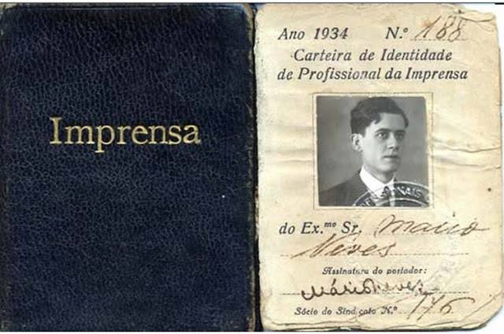

# Carteira Nacional de Habilitacao (CNH)

A **Carteira Nacional de Habilitacao (CNH)** e o documento que atesta a aptidao de um cidadao para conduzir veiculos automotores no territorio brasileiro. Regulamentada pelo **Codigo de Transito Brasileiro (CTB) — Lei 9.503, de 23 de setembro de 1997** — e pelos atos normativos do **CONTRAN (Conselho Nacional de Transito)**, a CNH e um dos documentos mais importantes na vida dos brasileiros, funcionando simultaneamente como habilitacao para dirigir e documento de identificacao civil. Este artigo apresenta a historia do licenciamento de condutores no Brasil, a evolucao do documento ao longo das decadas, o sistema DETRAN, as categorias de habilitacao e a Permissao Internacional para Dirigir (PID).

## Historia do Licenciamento de Condutores no Brasil

A historia da habilitacao para conduzir veiculos no Brasil acompanha a propria historia do automovel no pais, marcada por uma evolucao gradual desde os primeiros regulamentos municipais ate a consolidacao de um sistema nacional unificado.

### Os Primordios (1903-1940)

O primeiro automovel chegou ao Brasil em 1893, trazido por Henrique Santos Dumont (pai de Alberto Santos Dumont), mas foi somente no inicio do seculo XX que os primeiros regulamentos sobre conducao de veiculos comecaram a surgir.

Em **1903**, a cidade de Sao Paulo promulgou uma das primeiras legislacoes sobre transito no Brasil, exigindo que condutores de veiculos motorizados obtivessem uma "carta de habilitacao" junto a Prefeitura. O processo era rudimentar: o candidato demonstrava perante um fiscal municipal que sabia operar o veiculo, e a carta era emitida sem padronizacao.

No **Rio de Janeiro**, entao capital federal, regulamentos semelhantes foram adotados na decada de 1910. Cada municipio e estado desenvolvia suas proprias regras, criando um cenario fragmentado, sem reconhecimento reciproco entre jurisdicoes.

O **Decreto 18.323 de 1928** foi a primeira tentativa de regulamentacao federal do transito, estabelecendo normas gerais para a circulacao de veiculos em estradas de rodagem. Embora nao tenha criado um documento nacional de habilitacao, o decreto lancou as bases para uma legislacao de transito de abrangencia nacional.

### O Primeiro Codigo Nacional de Transito (1941)

O **Decreto-Lei 2.994 de 1941**, substituido pelo **Decreto-Lei 3.651 de 1941**, instituiu o primeiro **Codigo Nacional de Transito** do Brasil. Essa legislacao foi um marco historico, pois:

- Criou o **CONTRAN (Conselho Nacional de Transito)** como orgao normativo superior
- Estabeleceu os **DETRANs (Departamentos Estaduais de Transito)** como orgaos executivos estaduais
- Instituiu a **primeira carteira de habilitacao nacional**, valida em todo o territorio brasileiro
- Definiu categorias de habilitacao (amador e profissional)
- Estabeleceu requisitos minimos para obter habilitacao: idade minima de 18 anos, exame medico, exame de aptidao tecnica

O documento de habilitacao desse periodo era um certificado em papel, com poucos elementos de seguranca, contendo fotografia, dados pessoais, categoria de habilitacao e assinatura da autoridade de transito.

### Evolucao sob o Codigo de 1966

O **Codigo Nacional de Transito de 1966 (Lei 5.108/1966)** atualizou e modernizou a legislacao de transito brasileira, refletindo o crescimento acelerado da frota de veiculos e da malha rodoviaria do pais nas decadas de 1950 e 1960. As principais mudancas relacionadas a habilitacao incluiram:

- Ampliacao das categorias de habilitacao
- Requisitos mais rigorosos para exames medicos e psicologicos
- Padronizacao nacional do documento de habilitacao
- Criacao do sistema de pontuacao por infracoes

### O Modelo de 1987

Em **1984**, o CONTRAN aprovou uma nova padronizacao para a Carteira Nacional de Habilitacao, que entrou em vigor a partir de **1987**. Esse modelo representou um salto significativo em termos de padronizacao e seguranca:

**Caracteristicas do modelo de 1987:**

- **Formato:** Documento em papel plastificado, formato carteira (dimensoes maiores que um cartao de credito)
- **Cor:** Predominantemente verde e branco
- **Dados:** Nome, filiacao, data de nascimento, CPF, RG, fotografia (preto e branco), categoria de habilitacao, numero do registro
- **Seguranca:** Papel de seguranca com marca d'agua, plastificacao com filme holografico
- **Validade:** 5 anos (padrao da epoca)

O modelo de 1987 foi amplamente utilizado ate 2006 e ficou marcado na memoria dos brasileiros como a "carteira verde".

## O Codigo de Transito Brasileiro — CTB (Lei 9.503/1997)

A **Lei 9.503, de 23 de setembro de 1997**, instituiu o **Codigo de Transito Brasileiro (CTB)**, que entrou em vigor em **22 de janeiro de 1998**. O CTB e a legislacao vigente que rege todo o sistema de transito brasileiro, incluindo o processo de habilitacao, e representa a mais completa e abrangente lei de transito ja adotada no pais.

### Estrutura do CTB Relacionada a Habilitacao

O CTB dedica o **Capitulo XIV (artigos 140 a 160)** a habilitacao de condutores. Os principais pontos incluem:

**Requisitos para habilitacao (Art. 140):**
- Ser penalmente imputavel (18 anos completos)
- Saber ler e escrever
- Possuir documento de identidade
- Possuir CPF
- Ser aprovado em exame de aptidao fisica e mental
- Ser aprovado em exame de aptidao psicologica (exigido na obtencao, renovacao e em situacoes especificas)
- Ser aprovado em curso teorico-tecnico
- Ser aprovado em exame de legislacao de transito (prova teorica)
- Ser aprovado em exame de direcao veicular (prova pratica)

**Categorias de habilitacao (Art. 143):**

O CTB estabelece cinco categorias de habilitacao, cada uma autorizando a conducao de tipos especificos de veiculos:

| Categoria | Veiculos Autorizados | Requisitos Especificos |
|---|---|---|
| **A** | Motos, motonetas, ciclomotores e triciclos | Idade minima: 18 anos |
| **B** | Automoveis, caminhonetes e veiculos ate 3.500 kg | Idade minima: 18 anos |
| **C** | Veiculos de carga acima de 3.500 kg | Idade minima: 21 anos; exercer atividade de motorista ha pelo menos 1 ano na categoria B; nao ter cometido infracoes graves ou gravisimas nos ultimos 12 meses |
| **D** | Veiculos de transporte de passageiros (onibus, micro-onibus) | Idade minima: 21 anos; habilitado ha pelo menos 2 anos na categoria B ou 1 ano na categoria C; nao ter cometido infracoes graves ou gravisimas nos ultimos 12 meses |
| **E** | Veiculos com unidade articulada (carretas, treminhoes) e combinacoes | Idade minima: 21 anos; habilitado ha pelo menos 1 ano na categoria C; nao ter cometido infracoes graves ou gravisimas nos ultimos 12 meses |

As categorias sao cumulativas: um condutor habilitado na categoria D, por exemplo, esta autorizado a conduzir veiculos das categorias B e C. Um condutor com categoria E pode conduzir veiculos de todas as categorias.

A combinacao **AB** e a mais comum, habilitando o condutor a dirigir tanto motocicletas quanto automoveis.

**Permissao para Dirigir (PPD) e Primeiro ano (Art. 148, §3o):**

O condutor que obtem habilitacao pela primeira vez recebe uma **Permissao para Dirigir (PPD)**, valida por **um ano**. Durante esse periodo, se o condutor nao cometer infracoes de natureza grave ou gravissima, nem for reincidente em infracoes medias, a PPD e automaticamente convertida em CNH definitiva. Caso contrario, o condutor devera reiniciar todo o processo de habilitacao.

### Alteracoes Recentes no CTB

O CTB passou por diversas alteracoes ao longo dos anos, sendo as mais significativas para a habilitacao:

**Lei 14.071/2020 (vigencia a partir de abril de 2021):**
- Ampliacao da validade da CNH: de 5 para **10 anos** para condutores com menos de 50 anos; **5 anos** para condutores entre 50 e 69 anos; **3 anos** para condutores com 70 anos ou mais
- Aumento do limite de pontos para suspensao: de 20 para **20, 30 ou 40 pontos** em 12 meses, conforme a gravidade das infracoes e a atividade profissional do condutor
- Exigencia de curso de reciclagem antes da suspensao efetiva do direito de dirigir

## Evolucao do Documento: 2007 e o Novo Modelo

Em **2006**, o CONTRAN aprovou a **Resolucao 192**, que instituiu um novo modelo de CNH, implementado a partir de **2007**. Esse modelo trouxe avancos significativos em seguranca e padronizacao.

### Caracteristicas do Modelo de 2007

**Formato e material:**
- **Formato ID-1** (mesmas dimensoes de um cartao de credito: 85,60 x 53,98 mm)
- Impresso em **papel moeda de seguranca** com laminacao
- Substituicao do formato "carteira" pelo formato "cartao"

**Elementos visuais:**
- **Fundo de seguranca** com guilhoche (padroes geometricos complexos)
- **Fotografia colorida** do condutor
- **Bandeira do Brasil** e simbolos nacionais
- **Categorias de habilitacao** representadas por pictogramas de veiculos

**Elementos de seguranca:**
- **Microimpressao** em diversas areas
- **Tinta reagente a UV** (elementos visiveis apenas sob luz ultravioleta)
- **Imagem fantasma** (segunda fotografia reduzida)
- **Codigo de barras bidimensional** (PDF417) contendo dados criptografados
- **Marca d'agua**
- **Fundo numismatico** (similar ao utilizado em cedulas)

**Dados registrados:**
- Nome completo, CPF, data de nascimento, filiacao
- Numero de registro da habilitacao
- Categorias de habilitacao (com pictogramas)
- Datas de primeira habilitacao, emissao e validade
- Observacoes (restricoes medicas, como uso obrigatorio de lentes corretivas)
- Orgao emissor (DETRAN do estado)
- Fotografia e assinatura do condutor
- Codigo de barras com dados digitais

### A CNH como Documento de Identidade

O **CTB (Art. 159, §1o)** estabelece que a CNH, quando expedida conforme o modelo aprovado pelo CONTRAN, equivale a documento de identidade em todo o territorio nacional. Na pratica, a CNH e amplamente aceita como documento de identificacao para:

- Embarque em voos domesticos
- Abertura de contas bancarias
- Identificacao em concursos publicos e vestibulares
- Comprovacao de identidade perante autoridades publicas e privadas

Essa dupla funcionalidade — habilitacao e identidade — torna a CNH um dos documentos mais utilizados no cotidiano dos brasileiros.

## O Modelo de 2022: A CNH Mais Recente

Em **2022**, entrou em vigor o modelo mais recente da CNH, aprovado pela **Resolucao CONTRAN 886/2021**. Este modelo incorpora tecnologias avancadas de seguranca e alinha o documento aos padroes internacionais mais atuais.

**Principais inovacoes:**
- **QR code** para validacao digital (semelhante ao da CIN)
- **Zona de leitura mecanica (MRZ)** no padrao ICAO, facilitando o uso internacional
- **Novos elementos de seguranca** com tecnologia de impressao de ultima geracao
- **Integracao com o aplicativo Gov.br** (CNH Digital)
- **Design atualizado** com novas cores e elementos visuais
- **Inclusao do tipo sanguineo e fator Rh**

## O Sistema DETRAN

O **DETRAN (Departamento Estadual de Transito)** e o orgao executivo de transito em cada unidade da federacao, responsavel pela operacionalizacao de todo o processo de habilitacao. Existem 27 DETRANs no Brasil (26 estados + Distrito Federal), cada um vinculado ao governo do respectivo estado.

### Atribuicoes dos DETRANs Relacionadas a Habilitacao

- **Processo de primeira habilitacao:** Abertura do processo, agendamento de exames, emissao da PPD
- **Exames medicos e psicologicos:** Credenciamento e fiscalizacao de clinicas e profissionais
- **Exames teoricos:** Aplicacao de provas de legislacao de transito
- **Exames praticos:** Aplicacao de provas de direcao veicular com examinadores credenciados
- **Emissao e renovacao da CNH:** Producao e entrega do documento
- **Registro de infracoes:** Controle do prontuario do condutor
- **Processos administrativos:** Suspensao e cassacao do direito de dirigir
- **Credenciamento de autoescolas (CFCs):** Autorizacao e fiscalizacao dos Centros de Formacao de Condutores

### RENACH — Registro Nacional de Condutores Habilitados

O **RENACH** e a base de dados nacional que reune as informacoes de todos os condutores habilitados no Brasil, mantida pelo **SENATRAN (Secretaria Nacional de Transito)**. O RENACH permite:

- Consulta nacional do historico de habilitacao de qualquer condutor
- Verificacao de pendencias, suspensoes e cassacoes
- Cruzamento de dados entre DETRANs
- Emissao de certidoes de prontuario
- Controle de pontuacao por infracoes

Cada condutor habilitado recebe um **numero de registro RENACH** unico, que permanece o mesmo ao longo da vida, independentemente de mudancas de endereco ou de estado.

### DENATRAN / SENATRAN

O antigo **DENATRAN (Departamento Nacional de Transito)** foi incorporado ao **SENATRAN (Secretaria Nacional de Transito)**, vinculado ao **Ministerio dos Transportes**. O SENATRAN e o orgao maximo executivo de transito no ambito federal, responsavel por coordenar o sistema nacional de transito e supervisionar os DETRANs estaduais.

## Permissao Internacional para Dirigir (PID)

A **Permissao Internacional para Dirigir (PID)**, tambem conhecida como **Carteira Internacional de Habilitacao**, e o documento que permite a brasileiros habilitados conduzir veiculos em paises signatarios das **Convencoes de Viena (1968)** e **Genebra (1949)** sobre transito viario.

### Base Legal

A PID e regulamentada pelo **Art. 162 do CTB** e pela **Resolucao CONTRAN 360/2010**. O Brasil e signatario da **Convencao de Viena sobre Transito Viario de 1968**, promulgada internamente pelo **Decreto 86.714/1981**, que estabelece o reconhecimento reciproco de habilitacoes entre os paises signatarios.

### Caracteristicas da PID

- **Formato:** Livreto com dimensoes de 148 x 105 mm (formato A6)
- **Idiomas:** Dados traduzidos para frances, ingles, espanhol, russo, arabe, chines e japones, alem do portugues
- **Conteudo:** Dados pessoais do condutor, fotografia, categorias de habilitacao, validade
- **Validade:** **3 anos**, nao podendo exceder a validade da CNH que lhe deu origem
- **Nao substitui a CNH:** A PID e um documento complementar; o condutor deve portar ambos (CNH + PID) no exterior

### Processo de Obtencao

A PID e emitida pelos DETRANs estaduais mediante requerimento do condutor habilitado. Os requisitos sao:

- Possuir CNH valida
- Nao estar com o direito de dirigir suspenso ou cassado
- Apresentar documento de identidade e CPF
- Pagar a taxa de emissao (valor varia entre os estados, tipicamente entre R$ 200 e R$ 350)
- Fotografias no padrao exigido

O prazo de emissao varia entre 5 e 15 dias uteis, dependendo do estado.

### Paises que Reconhecem a PID Brasileira

A PID brasileira e reconhecida em mais de **100 paises** signatarios das Convencoes de Viena e Genebra, incluindo todos os paises da Uniao Europeia, Estados Unidos (em muitos estados), Canada, Japao, Australia, Africa do Sul, entre outros.

Em paises do **Mercosul** (Argentina, Uruguai, Paraguai, Venezuela), a propria **CNH brasileira** e aceita como documento de habilitacao, sem necessidade da PID, conforme acordos bilaterais e regionais.

### Estrangeiros Dirigindo no Brasil

Reciprocamente, condutores estrangeiros podem dirigir no Brasil utilizando:

- **PID valida** emitida pelo pais de origem, acompanhada da habilitacao nacional do condutor
- **Habilitacao do pais de origem** (para cidadaos do Mercosul, sem necessidade de PID)
- A habilitacao estrangeira e valida no Brasil pelo periodo de permanencia do estrangeiro, ate o maximo de **180 dias**. Apos esse periodo, e necessario obter a CNH brasileira

## CNH Digital

Desde **2017**, a CNH possui uma **versao digital** disponivel no aplicativo Gov.br (anteriormente disponivel no aplicativo "Carteira Digital de Transito — CDT"). A CNH Digital possui a mesma validade juridica da versao fisica e permite:

- Apresentacao do documento em dispositivos moveis
- Validacao por QR code
- Compartilhamento digital com orgaos de fiscalizacao
- Acesso ao historico de infracoes e pontuacao
- Consulta de dados do veiculo (quando vinculado)

A CNH Digital foi um dos primeiros documentos a integrar o ecossistema de documentos digitais do governo brasileiro, antecedendo inclusive a CIN digital.

## Consideracoes Finais

A Carteira Nacional de Habilitacao e um documento que reflete mais de um seculo de evolucao na regulamentacao do transito brasileiro. Da "carta de habilitacao" municipal de 1903 ao moderno cartao com QR code e MRZ de 2022, a CNH acompanhou o crescimento vertiginoso da frota brasileira — de poucos milhares de veiculos no inicio do seculo XX para mais de 115 milhoes de veiculos registrados atualmente.

O **CTB (Lei 9.503/1997)** consolidou um arcabouco juridico robusto para o sistema de habilitacao, que continua sendo aperfeicoado por resolucoes do CONTRAN e alteracoes legislativas. O sistema DETRAN, apesar das criticas quanto a burocracia e disparidades regionais, constitui uma rede nacional capaz de gerenciar os processos de habilitacao para mais de 80 milhoes de condutores registrados no RENACH.

A evolucao do documento fisico — do papel plastificado ao cartao com elementos de seguranca avancados — e a introdução da versao digital refletem o compromisso com a modernizacao e a seguranca, posicionando a CNH brasileira entre os documentos de habilitacao mais avancados da America Latina.
