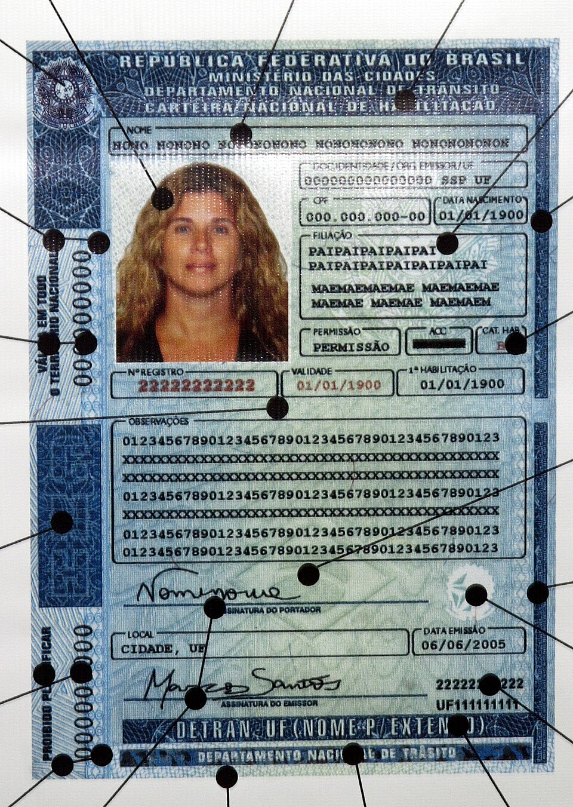
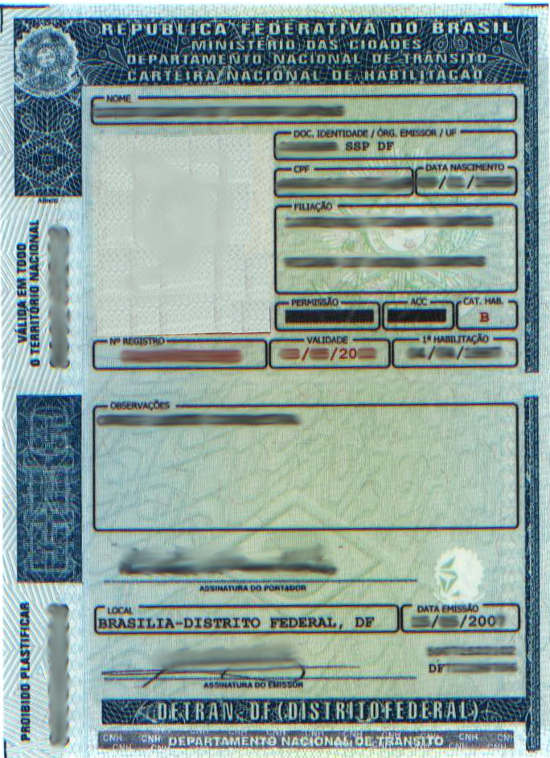

# Categorias da CNH

**Documentos de Identidade Brasileiros — Guia Tecnico e Legislativo**
**Documento:** DOC-CNH-006 | **Revisao:** 1.0 | **Data:** 2026-03-09
**Base Legal:** Lei 9.503/1997 (CTB), Resolucoes CONTRAN

---

> **NOTA IMPORTANTE:** As categorias da Carteira Nacional de Habilitacao (CNH) sao regulamentadas pelo Codigo de Transito Brasileiro (CTB), instituido pela Lei n. 9.503, de 23 de setembro de 1997, e pelas Resolucoes do Conselho Nacional de Transito (CONTRAN). As informacoes contidas neste documento refletem a legislacao vigente ate marco de 2026.

---

## 1. Visao Geral do Sistema de Categorias

O sistema brasileiro de habilitacao para conducao de veiculos automotores e estruturado em categorias progressivas, cada uma correspondendo a um tipo especifico de veiculo. Este sistema esta definido nos artigos 142 a 147 do Codigo de Transito Brasileiro e regulamentado por diversas Resolucoes do CONTRAN, com destaque para a Resolucao n. 168/2004 e suas atualizacoes posteriores.

A logica do sistema e progressiva: o condutor inicia com categorias mais simples (ciclomotores ou motocicletas/automoveis) e pode ascender a categorias superiores conforme acumula experiencia e realiza exames adicionais. Cada categoria autoriza a conducao de veiculos com caracteristicas especificas de peso, capacidade de passageiros e tipo de combinacao.

A CNH em seu formato atual, conforme ilustrado acima, traz o campo de categoria em destaque na face frontal do documento. Este campo indica precisamente quais tipos de veiculos o portador esta autorizado a conduzir. A informacao de categoria e replicada nos sistemas informatizados do DENATRAN (Departamento Nacional de Transito), garantindo que qualquer consulta eletronica retorne a mesma informacao constante no documento fisico.

### 1.1 Historico das Categorias

Antes da promulgacao do CTB em 1997, o sistema brasileiro de habilitacao era regido pelo antigo Codigo Nacional de Transito (Lei n. 5.108/1966) e utilizava um sistema de categorias diferente. A transicao para o sistema atual foi gradual, com prazos de adaptacao para condutores ja habilitados.

O modelo de CNH de 2006, ilustrado abaixo, ja trazia o sistema de categorias vigente, porem com visual e elementos de seguranca distintos dos modelos atuais.

---

## 2. Categoria A — Motocicletas, Motonetas, Triciclos e Quadriciclos

### 2.1 Veiculos Autorizados

A Categoria A autoriza o condutor a pilotar veiculos automotores de duas ou tres rodas, com ou sem carro lateral (sidecar). Especificamente:

- **Motocicletas:** Veiculos de duas rodas, com ou sem carro lateral, dotados de motor de propulsao com cilindrada superior a 50 cm3 ou velocidade maxima de fabricacao superior a 50 km/h.
- **Motonetas (scooters):** Veiculos de duas rodas com motor de cilindrada acima de 50 cm3 e estrutura de chassi com plataforma para os pes do condutor.
- **Triciclos motorizados:** Veiculos de tres rodas dotados de motor de combustao ou eletrico.
- **Quadriciclos:** Conforme regulamentacao especifica do CONTRAN, desde que nao ultrapassem os limites de peso e potencia estabelecidos.

### 2.2 Requisitos para Obtencao

| Requisito | Detalhamento |
| :--- | :--- |
| **Idade minima** | 18 anos completos |
| **Exame medico** | Aptidao fisica e mental atestada por medico credenciado |
| **Exame psicologico** | Avaliacao psicologica obrigatoria (Resolucao CONTRAN n. 425/2012) |
| **Curso teorico** | 45 horas/aula em Centro de Formacao de Condutores (CFC) |
| **Exame teorico** | Minimo de 70% de acertos (21 de 30 questoes) |
| **Aulas praticas** | Minimo de 20 horas/aula em motocicleta |
| **Simulador** | Obrigatorio conforme Resolucao CONTRAN (incluido nas horas praticas) |
| **Exame pratico** | Circuito fechado com exercicios de equilibrio, slalom, frenagem e manobras |

### 2.3 Observacoes Especificas

O condutor habilitado na Categoria A pode conduzir motocicletas de qualquer cilindrada, nao havendo subdivisao por potencia como ocorre em alguns paises europeus. No entanto, durante o periodo de Permissao Provisoria para Dirigir (PPD), aplica-se a restricao de nao poder exercer atividade remunerada (mototaxi, motoentrega) ate a conversao para CNH definitiva.

Para exercicio de atividade remunerada com motocicleta, o condutor deve portar a EAR (Exercicio de Atividade Remunerada) no campo de observacoes da CNH, conforme regulamentacao da Lei n. 12.009/2009. A obtencao da EAR para motociclistas exige curso especializado de 30 horas.

---

## 3. Categoria B — Automoveis e Utilitarios Leves

### 3.1 Veiculos Autorizados

A Categoria B autoriza a conducao de veiculos automotores e eletricos de quatro rodas cujo Peso Bruto Total (PBT) nao exceda 3.500 kg e cuja lotacao nao ultrapasse 8 (oito) lugares, excluido o do motorista. Inclui:

- **Automoveis de passeio** (sedas, hatches, peruas)
- **Utilitarios leves** (SUVs, picapes de PBT ate 3.500 kg)
- **Veiculos com reboque leve** (desde que a combinacao nao ultrapasse 6.000 kg de PBT total e o reboque nao exceda a capacidade de tracao do veiculo trator)
- **Motor-homes** (desde que respeitem os limites de PBT e lotacao)

### 3.2 Requisitos para Obtencao

| Requisito | Detalhamento |
| :--- | :--- |
| **Idade minima** | 18 anos completos |
| **Exame medico** | Aptidao fisica e mental |
| **Exame psicologico** | Avaliacao psicologica obrigatoria |
| **Curso teorico** | 45 horas/aula (mesmo conteudo para todas as categorias) |
| **Exame teorico** | Minimo de 70% de acertos |
| **Aulas praticas** | Minimo de 20 horas/aula em veiculo de quatro rodas |
| **Simulador** | Obrigatorio, incluido na carga horaria pratica |
| **Exame pratico** | Manobras em area fechada + percurso em via publica |

### 3.3 Categoria AB — Habilitacao Combinada

O candidato pode optar por realizar o processo de habilitacao nas categorias A e B simultaneamente, obtendo a chamada habilitacao AB. Neste caso, sao necessarias aulas praticas em ambos os tipos de veiculos (motocicleta e automovel) e dois exames praticos distintos. O curso teorico e unico, com 45 horas/aula.

---

## 4. Categoria C — Caminhoes e Veiculos de Carga

### 4.1 Veiculos Autorizados

A Categoria C autoriza a conducao de veiculos automotores e eletricos utilizados no transporte de carga cujo Peso Bruto Total (PBT) exceda 3.500 kg. Abrange:

- **Caminhoes** de qualquer porte (3/4, toco, truck)
- **Veiculos articulados** de carga com PBT acima de 3.500 kg (desde que nao configurem combinacao que exija Categoria E)
- **Tratores de esteira** e **tratores de roda** (quando transitam em vias publicas)
- **Maquinas agricolas** (quando transitam em vias publicas)

O condutor com Categoria C tambem esta autorizado a conduzir todos os veiculos autorizados pela Categoria B.

### 4.2 Requisitos para Obtencao

| Requisito | Detalhamento |
| :--- | :--- |
| **Idade minima** | 18 anos completos |
| **Habilitacao previa** | Ser habilitado na Categoria B ha no minimo 1 (um) ano |
| **Pontuacao** | Nao ter cometido nenhuma infracao gravissima nos ultimos 12 meses |
| **Exame medico** | Aptidao fisica e mental (com exigencias adicionais de acuidade visual) |
| **Exame psicologico** | Avaliacao psicologica obrigatoria |
| **Curso especifico** | 15 horas/aula praticas em veiculo da categoria |
| **Exame pratico** | Em veiculo com PBT acima de 3.500 kg |

---

## 5. Categoria D — Onibus e Micro-onibus

### 5.1 Veiculos Autorizados

A Categoria D autoriza a conducao de veiculos automotores e eletricos utilizados no transporte de passageiros cuja lotacao exceda 8 (oito) lugares, excluido o do motorista. Inclui:

- **Micro-onibus** (lotacao de 9 a 20 passageiros)
- **Onibus urbanos** e **rodoviarios**
- **Onibus articulados** (desde que nao configurem combinacao que exija Categoria E)
- **Vans de transporte coletivo** com mais de 8 lugares

O condutor com Categoria D esta automaticamente autorizado a conduzir todos os veiculos das Categorias B e C.

### 5.2 Requisitos para Obtencao

| Requisito | Detalhamento |
| :--- | :--- |
| **Idade minima** | 21 anos completos |
| **Habilitacao previa** | Ser habilitado na Categoria B ha no minimo 2 (dois) anos OU na Categoria C ha no minimo 1 (um) ano |
| **Pontuacao** | Nao ter cometido nenhuma infracao gravissima nos ultimos 12 meses |
| **Exame medico** | Aptidao fisica e mental com criterios rigorosos |
| **Exame psicologico** | Avaliacao psicologica obrigatoria com exigencias especificas para transporte de passageiros |
| **Curso especifico** | 15 horas/aula praticas em veiculo da categoria |
| **Exame pratico** | Em veiculo com lotacao superior a 8 lugares |

---

## 6. Categoria E — Combinacoes de Veiculos Articulados

### 6.1 Veiculos Autorizados

A Categoria E e a mais abrangente do sistema brasileiro e autoriza a conducao de combinacoes de veiculos em que a unidade tracionada (reboque, semirreboque ou articulada) possua Peso Bruto Total (PBT) superior a 6.000 kg, ou cuja lotacao exceda 8 lugares, ou ainda que se enquadrem como combinacao. Inclui:

- **Carretas** (cavalo mecanico + semirreboque)
- **Treminhoes** (caminhao + reboque + semirreboque, conhecidos como "rodotrens")
- **Bitrens** (cavalo mecanico + dois semirreboques)
- **Onibus articulados** (com modulo acoplado)
- **Veiculos com reboque** cujo PBT da combinacao exceda 6.000 kg
- **Motorhomes** articulados ou com reboques acima dos limites da Categoria B

O condutor com Categoria E esta autorizado a conduzir todos os veiculos das Categorias B, C e D.

### 6.2 Requisitos para Obtencao

| Requisito | Detalhamento |
| :--- | :--- |
| **Idade minima** | 21 anos completos |
| **Habilitacao previa** | Ser habilitado na Categoria C ha no minimo 1 (um) ano OU na Categoria D |
| **Pontuacao** | Nao ter cometido nenhuma infracao gravissima nos ultimos 12 meses |
| **Exame medico** | Aptidao fisica e mental com criterios especificos |
| **Exame psicologico** | Avaliacao psicologica obrigatoria |
| **Curso especifico** | 15 horas/aula praticas em combinacao de veiculos |
| **Exame pratico** | Em combinacao de veiculos articulados |

---

## 7. ACC — Autorizacao para Conduzir Ciclomotor

### 7.1 Veiculos Autorizados

A ACC nao e uma categoria da CNH, mas sim uma autorizacao especifica para conducao de ciclomotores — veiculos de duas ou tres rodas com motor de cilindrada nao superior a 50 cm3 (ou equivalente em potencia para motores eletricos) e velocidade maxima de fabricacao nao superior a 50 km/h.

### 7.2 Requisitos para Obtencao

| Requisito | Detalhamento |
| :--- | :--- |
| **Idade minima** | 18 anos completos |
| **Exame medico** | Aptidao fisica e mental |
| **Exame psicologico** | Avaliacao psicologica obrigatoria |
| **Curso teorico** | 45 horas/aula (mesmo conteudo do processo de habilitacao) |
| **Exame teorico** | Minimo de 70% de acertos |
| **Aulas praticas** | Minimo de 20 horas/aula em ciclomotor |
| **Exame pratico** | Em circuito fechado com ciclomotor |

### 7.3 Observacoes sobre a ACC

A ACC e vinculada ao RENACH (Registro Nacional de Carteiras de Habilitacao) e gera um documento proprio, diferente da CNH. O portador de ACC nao esta autorizado a conduzir motocicletas (Categoria A) nem veiculos de quatro rodas. Caso o portador de ACC deseje obter a CNH em qualquer categoria, devera realizar o processo completo de habilitacao, aproveitando apenas o curso teorico (se ainda estiver dentro do prazo de validade).

---

## 8. Tabela Consolidada de Categorias

A tabela abaixo resume todas as categorias e seus respectivos limites:

| Categoria | Tipo de Veiculo | PBT Maximo | Lotacao Maxima | Idade Minima | Habilitacao Previa |
| :---: | :--- | :---: | :---: | :---: | :--- |
| **ACC** | Ciclomotores (ate 50 cm3 / 50 km/h) | N/A | N/A | 18 anos | Nenhuma |
| **A** | Motocicletas, motonetas, triciclos | N/A | N/A | 18 anos | Nenhuma |
| **B** | Automoveis e utilitarios | 3.500 kg | 8 + motorista | 18 anos | Nenhuma |
| **AB** | Motos + automoveis (combinada) | 3.500 kg (auto) | 8 + motorista (auto) | 18 anos | Nenhuma |
| **C** | Caminhoes e veiculos de carga | Acima de 3.500 kg | — | 18 anos | Cat. B ha 1 ano |
| **D** | Onibus e micro-onibus | — | Acima de 8 + motorista | 21 anos | Cat. B ha 2 anos ou Cat. C ha 1 ano |
| **E** | Combinacoes articuladas | PBT combinacao > 6.000 kg | — | 21 anos | Cat. C ha 1 ano ou Cat. D |

---

## 9. Restricoes e Observacoes Especiais na CNH

### 9.1 EAR — Exercicio de Atividade Remunerada

O campo de observacoes da CNH pode conter a anotacao **EAR** (Exercicio de Atividade Remunerada), que e obrigatoria para condutores que exercem atividade profissional remunerada, tais como:

- **Motoristas de taxi** e **motoristas de aplicativo** (Categoria B com EAR)
- **Motoristas de caminhao** profissionais (Categoria C com EAR)
- **Motoristas de onibus** (Categoria D com EAR)
- **Motoentregadores** e **mototaxistas** (Categoria A com EAR)

Para obter a EAR, o condutor deve:

1. Estar habilitado ha no minimo 2 (dois) anos na respectiva categoria
2. Nao ter cometido infracoes gravissimas nos ultimos 12 meses
3. Realizar curso de especializacao conforme Resolucao CONTRAN
4. Ser aprovado em exame medico e psicologico especificos para EAR

### 9.2 Restricoes Medicas

O campo de observacoes da CNH tambem registra restricoes medicas que condicionam o exercicio da conducao, como:

- **A** — Obrigatorio uso de lentes corretivas
- **B** — Obrigatorio uso de protese auditiva
- **C** — Veiculo adaptado (deficiencia fisica)
- **D** — Obrigatorio uso de veiculo com cambio automatico
- **E** — Obrigatorio uso de veiculo com direcao hidraulica

### 9.3 Validade da CNH por Faixa Etaria

Conforme alteracao do CTB pela Lei n. 14.071/2020:

| Faixa Etaria | Validade da CNH |
| :--- | :--- |
| Ate 49 anos | 10 anos |
| De 50 a 69 anos | 5 anos |
| 70 anos ou mais | 3 anos |
| Condutores com EAR | 5 anos (independente da idade) |

---

## 10. Mudanca de Categoria — Processo de Adicao

O processo de adicao ou mudanca de categoria e regulamentado pela Resolucao CONTRAN n. 168/2004 e suas atualizacoes. O candidato a mudanca de categoria deve:

1. **Atender aos pre-requisitos de tempo de habilitacao** na categoria atual (conforme tabela da Secao 8)
2. **Nao possuir infracoes gravissimas** nos ultimos 12 meses
3. **Realizar exame medico e psicologico** compativel com a nova categoria
4. **Frequentar curso pratico** de 15 horas/aula em veiculo da nova categoria (dispensado o curso teorico, exceto para adicao de Categoria A quando o condutor possui apenas B, C, D ou E)
5. **Ser aprovado no exame pratico** realizado por examinador credenciado pelo DETRAN

A adicao de categoria nao implica perda da categoria anterior. Por exemplo, um condutor que possui Categoria B e adiciona a Categoria C passa a ter habilitacao BC, podendo conduzir veiculos de ambas as categorias.

### 10.1 Casos Especiais

- **Adicao de Categoria A:** Quando o condutor possui apenas categorias de veiculos de quatro rodas (B, C, D ou E) e deseja adicionar a Categoria A, deve realizar aulas praticas em motocicleta e exame pratico especifico. Nao e exigido tempo minimo de habilitacao na categoria anterior para esta adicao.
- **Passagem direta de B para D:** E possivel, desde que o condutor tenha no minimo 2 anos de habilitacao na Categoria B e atenda aos demais requisitos da Categoria D (incluindo idade minima de 21 anos).
- **Rebaixamento de categoria:** Em casos de restricao medica superveniente, o DETRAN pode determinar o rebaixamento de categoria (por exemplo, de C para B) mediante laudo medico pericial.

---

## 11. Legislacao Aplicavel

As categorias da CNH sao regulamentadas pelos seguintes dispositivos legais:

- **Lei n. 9.503/1997** — Codigo de Transito Brasileiro (CTB), artigos 140 a 147
- **Lei n. 14.071/2020** — Alteracoes ao CTB (prazos de validade, pontuacao)
- **Lei n. 12.009/2009** — Regulamentacao do exercicio de atividades com motocicletas
- **Resolucao CONTRAN n. 168/2004** — Normas para o processo de habilitacao
- **Resolucao CONTRAN n. 425/2012** — Exame de aptidao fisica e mental e avaliacao psicologica
- **Resolucao CONTRAN n. 789/2020** — Atualizacoes no modelo da CNH
- **Resolucao CONTRAN n. 886/2021** — Curso de formacao de condutores

---

*DOC-CNH-006 — Revisao 1.0 — Marco 2026*

*Publicado por: Divisao de Documentacao Tecnica*

*Baseado na legislacao vigente: CTB (Lei 9.503/1997) e Resolucoes CONTRAN*
