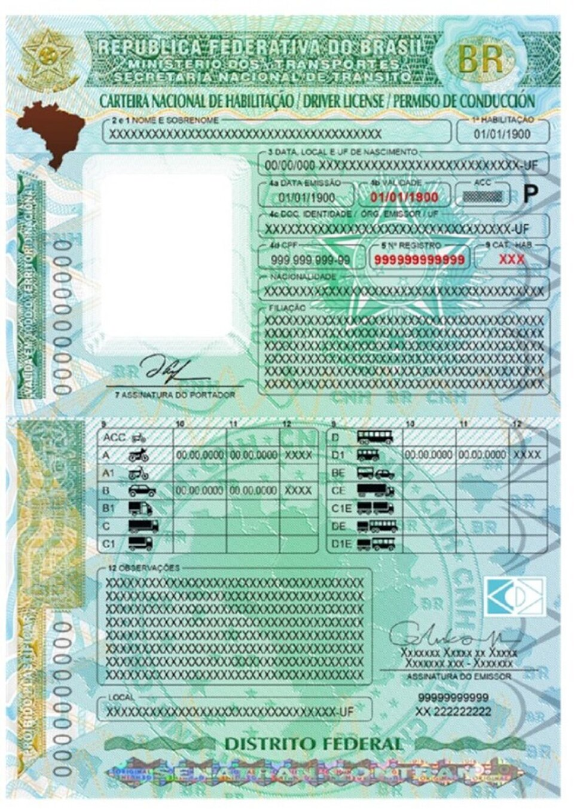
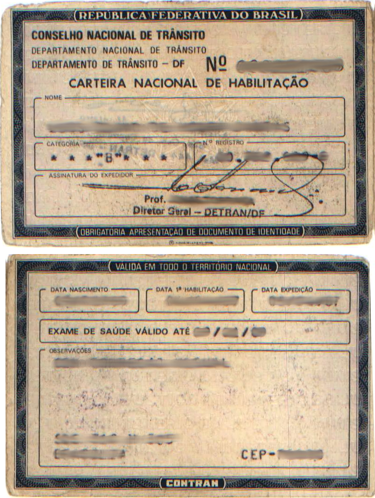
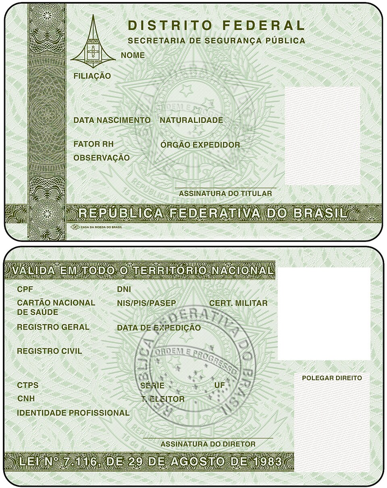

# Elementos de Seguranca da CNH

**Documentos de Identidade Brasileiros — Guia Tecnico e Legislativo**
**Documento:** DOC-CNH-007 | **Revisao:** 1.0 | **Data:** 2026-03-09
**Base Legal:** Lei 9.503/1997 (CTB), Resolucoes CONTRAN n. 789/2020 e n. 886/2021

---

> **NOTA IMPORTANTE:** Os elementos de seguranca descritos neste documento referem-se aos modelos de CNH em circulacao no Brasil, com enfase no modelo vigente desde 2022. As especificacoes tecnicas dos dispositivos de seguranca sao baseadas em informacoes publicas divulgadas pelo DENATRAN e pelos orgaos de transito estaduais. Detalhes classificados de fabricacao nao sao abordados.

---

## 1. Visao Geral da Seguranca Documental

A Carteira Nacional de Habilitacao (CNH) e um dos documentos mais falsificados no Brasil, devido ao seu amplo uso como documento de identificacao e a sua aceitacao em todo o territorio nacional. Para combater fraudes e falsificacoes, o Conselho Nacional de Transito (CONTRAN) implementou ao longo das decadas sucessivas camadas de elementos de seguranca, culminando no modelo atual que incorpora tecnologias de ponta em seguranca documental.

A evolucao dos elementos de seguranca acompanha o avanco tecnologico dos metodos de falsificacao. Enquanto os primeiros modelos de CNH dependiam basicamente de papel especial e carimbos, os modelos atuais empregam uma combinacao sofisticada de elementos fisicos, opticos, eletronicos e digitais que tornam a falsificacao significativamente mais complexa e dispendiosa.

O modelo atual da CNH, ilustrado acima, representa o estado da arte em seguranca documental no Brasil. Seus elementos de protecao operam em multiplas camadas — desde o substrato do cartao ate os dados codificados digitalmente — criando um sistema de defesa em profundidade contra tentativas de fraude.

---

## 2. Evolucao Historica dos Elementos de Seguranca

### 2.1 Modelos Antigos (Pre-2006)

Os modelos de CNH anteriores a 2006 utilizavam elementos de seguranca relativamente simples:

- **Papel moeda:** Substrato de papel especial com fibras de seguranca coloridas visiveis a olho nu
- **Marca d'agua:** Imagem tenue visivel por transparencia (geralmente o brasao da Republica)
- **Impressao calcografica:** Relevo perceptivel ao tato em determinados elementos graficos
- **Carimbos e selos:** Selos holograficos colados sobre a fotografia do condutor
- **Fotografia colada:** A foto do condutor era impressa separadamente e colada ao documento, coberta por laminado plastico

O modelo de 1987, apresentado acima, ilustra a simplicidade relativa dos elementos de seguranca da epoca. A fotografia colada, o papel sem holografia e a ausencia de elementos opticos variaveis tornavam este modelo vulneravel a diversas tecnicas de falsificacao, incluindo substituicao de fotografia e adulteracao de dados impressos.

### 2.2 Modelo 2006-2017

A partir de 2006, a CNH passou por uma modernizacao significativa:

- Introducao de impressao em **policarbonato** (cartao plastico rigido)
- **Fotografia digitalizada** impressa diretamente no substrato (eliminando a vulnerabilidade da foto colada)
- **Holografia** por laminacao a quente cobrindo toda a face frontal
- **Microimpressao** (textos microscopicos visiveis apenas com lente de aumento)
- **Tinta reativa a UV** (ultravioleta) em elementos ocultos
- **Codigo de barras bidimensional** (PDF417) na face posterior

### 2.3 Modelo 2017-2022 (Padrao MERCOSUL)

O modelo padronizado para o MERCOSUL introduziu:

- **QR Code** na face frontal para validacao digital
- **Tinta OVI** (Optically Variable Ink) que muda de cor conforme o angulo de observacao
- **Gravacao a laser** dos dados pessoais (nome, CPF, data de nascimento) diretamente no policarbonato
- **Imagem fantasma** (ghost image) — reproducao menor da fotografia do condutor em area secundaria
- Padronizacao visual com os demais paises do MERCOSUL

### 2.4 Modelo 2022+ (Atual)

O modelo mais recente, regulamentado pela Resolucao CONTRAN n. 789/2020, acrescentou:

- **Chip RFID** (Radio-Frequency Identification) embutido no cartao
- **Certificado digital ICP-Brasil** armazenado no chip
- **QR Code dinamico** vinculado ao sistema RENACH
- **OVD** (Optical Variable Device) de alta complexidade
- Integracao com o aplicativo **Carteira Digital de Transito (CDT)**

---

## 3. Elementos de Seguranca Fisicos

### 3.1 Substrato de Policarbonato

O cartao da CNH e fabricado em **policarbonato multicamada**, um material plastico rigido e transparente que oferece diversas vantagens de seguranca:

- **Resistencia a delaminacao:** As camadas sao fundidas a quente, tornando impossivel a separacao sem destruir o cartao
- **Durabilidade:** Resistente a dobras, umidade e temperaturas moderadas
- **Compatibilidade com gravacao a laser:** Permite a inscricao permanente de dados dentro das camadas internas do cartao
- **Transparencia controlada:** Permite a criacao de janelas transparentes e elementos visiveis por transparencia

### 3.2 Gravacao a Laser (Laser Engraving)

Os dados pessoais do condutor sao gravados por laser diretamente nas camadas internas do policarbonato. Este processo carboniza o material em pontos precisos, criando caracteres permanentes que:

- Nao podem ser apagados sem danificar visivelmente o cartao
- Sao perceptiveis ao tato (leve relevo negativo)
- Apresentam tonalidade cinza-escura uniforme, diferente de impressao por tinta
- Sao visiveis quando o cartao e examinado por transparencia (efeito de sombra)

Os seguintes campos sao gravados a laser: nome completo, numero do CPF, data de nascimento, numero do registro, categoria e data de validade.

### 3.3 Microimpressao (Microprint)

Diversos elementos graficos da CNH contem textos microscopicos que sao visiveis apenas com auxilio de lente de aumento (ampliacao minima de 10x). As microimpressoes incluem:

- **Texto positivo:** Repeticao do texto "REPUBLICA FEDERATIVA DO BRASIL" em linhas de 0,2 mm de altura
- **Texto negativo:** Textos em negativo (letras claras sobre fundo escuro) com a palavra "CNH" repetida
- **Guilhoches:** Padroes geometricos complexos compostos por linhas finas entrecruzadas, tipicos de documentos de seguranca

A microimpressao e um dos primeiros elementos a se degradar em copias por scanner ou impressora, pois a resolucao tipica de equipamentos comerciais (300-600 dpi) e insuficiente para reproduzir detalhes abaixo de 0,3 mm.

### 3.4 Impressao Calcografica

A impressao calcografica (tambem chamada de intaglio) produz um relevo perceptivel ao toque. Na CNH, este tipo de impressao e utilizado em:

- Brasao da Republica
- Titulo "CARTEIRA NACIONAL DE HABILITACAO"
- Moldura da fotografia principal
- Elementos decorativos de borda

Este tipo de impressao requer maquinario industrial especializado (prensas calcograficas de alta pressao), elevando significativamente a barreira tecnica para falsificacao.

---

## 4. Elementos de Seguranca Opticos

### 4.1 Holografia (Overlay Holografico)

A CNH possui uma camada holografica laminada a quente sobre toda a face frontal do documento. O holograma apresenta:

- **Efeito de profundidade:** Imagens tridimensionais que aparentam estar em diferentes planos quando o cartao e inclinado
- **Mudanca de cor:** Elementos que transitam entre cores (tipicamente verde-dourado ou azul-prata) conforme o angulo de visualizacao
- **Elementos cineticos:** Imagens que aparentam mover-se quando o cartao e rotacionado
- **Microsimbologia:** Elementos holograficos miniaturizados visiveis apenas com ampliacao

O holograma da CNH inclui simbolos nacionais (bandeira, brasao), a sigla "CNH" e elementos geometricos padronizados pelo CONTRAN.

### 4.2 OVD — Optical Variable Device

Alem da holografia convencional, o modelo atual inclui um dispositivo optico variavel de alta seguranca (OVD) que combina:

- **Efeitos de diffracao:** Padroes que decompeem a luz branca em espectro de cores
- **Efeitos de interferencia de pelicula fina:** Camadas nanometricas que produzem cores por interferencia construtiva e destrutiva
- **Nanoestruturas:** Padroes gravados em escala nanometrica que produzem efeitos opticos unicos e praticamente impossiveis de reproduzir com tecnologia comercial

O OVD da CNH esta localizado na regiao inferior direita da face frontal e apresenta uma imagem do mapa do Brasil que muda de cor e exibe efeitos dinamicos quando observado em diferentes angulos.

### 4.3 Tinta OVI (Optically Variable Ink)

A CNH utiliza tinta opticamente variavel em pelo menos dois elementos:

- **Numero do documento:** Impresso em tinta que transita entre verde e dourado conforme o angulo
- **Elemento decorativo lateral:** Faixa vertical que transita entre azul e magenta

A tinta OVI contem nanoparticulas metalicas com camadas de interferencia optica. Sua fabricacao e restrita a poucos fornecedores mundiais autorizados, o que dificulta a obtencao por falsificadores.

### 4.4 Tinta Reativa a UV (Ultravioleta)

Sob iluminacao ultravioleta (comprimento de onda de 365 nm), a CNH revela elementos ocultos impressos com tinta fluorescente:

- **Fotografia UV:** Reproducao da fotografia do condutor visivel apenas sob UV
- **Padroes graficos:** Elementos decorativos e textos que nao sao visiveis sob luz normal
- **Fibras fluorescentes:** Fibras incorporadas ao substrato que brilham em cores especificas sob UV
- **Numero de serie UV:** Numeracao de controle visivel apenas sob iluminacao ultravioleta

A imagem acima ilustra um exemplo de documento em policarbonato com elementos de seguranca similares aos empregados na CNH, incluindo chip RFID visivel e camadas holograficas.

---

## 5. Elementos de Seguranca Eletronicos e Digitais

### 5.1 Chip RFID

A partir do modelo 2022, a CNH passou a incorporar um **chip RFID** (Radio-Frequency Identification) sem contato, embutido entre as camadas de policarbonato. O chip armazena:

- **Dados biograficos:** Nome, CPF, data de nascimento, filiacao
- **Fotografia digital:** Imagem facial em formato JPEG2000 comprimido
- **Dados da habilitacao:** Categoria, numero do registro, validade, restricoes
- **Certificado digital ICP-Brasil:** Certificado de atributo que vincula o chip ao condutor
- **Biometria:** Template de impressao digital (minucias) armazenado de forma criptografada
- **Assinatura digital:** Hash SHA-256 assinado pela Autoridade Certificadora do DENATRAN

O chip opera no padrao ISO/IEC 14443 (comunicacao por proximidade a 13,56 MHz) e implementa os protocolos de seguranca:

- **BAC** (Basic Access Control): Exige leitura optica da MRZ (Machine Readable Zone) para desbloquear o chip
- **PACE** (Password Authenticated Connection Establishment): Protocolo de autenticacao por senha
- **PA** (Passive Authentication): Verificacao da integridade dos dados por assinatura digital
- **AA** (Active Authentication): Prova de que o chip e autentico (nao clonado)

### 5.2 QR Code

O QR Code presente na face frontal da CNH permite a verificacao rapida da autenticidade do documento. Ao ser escaneado com o aplicativo oficial **Carteira Digital de Transito (CDT)** ou com aplicativos autorizados:

- Exibe os dados do condutor armazenados no sistema RENACH
- Compara a fotografia digital (armazenada no servidor) com a impressa no documento
- Verifica a validade da CNH em tempo real
- Indica se ha bloqueios, suspensoes ou cassacoes registradas

O QR Code e **dinamico**, ou seja, seu conteudo e um token criptografado que aponta para o registro no banco de dados central do DENATRAN. Isso impede que um QR Code copiado de uma CNH autentica seja utilizado em um documento falso, pois a fotografia e os dados retornados pelo servidor nao corresponderiam ao documento fisico falso.

### 5.3 MRZ — Machine Readable Zone

A face posterior da CNH contem uma zona de leitura mecanica (MRZ) no formato padrao ICAO 9303 (mesmo padrao de passaportes), com duas linhas de caracteres OCR-B. A MRZ codifica:

- Tipo de documento
- Pais emissor (BRA)
- Nome do portador
- Numero do documento
- Nacionalidade
- Data de nascimento
- Sexo
- Data de validade
- Digitos verificadores (check digits)

A MRZ permite a leitura automatizada por equipamentos de controle de fronteira e por leitores de documentos, facilitando a verificacao de identidade em aeroportos, hoteis e estabelecimentos que exigem identificacao.

### 5.4 Codigo de Barras PDF417

Na face posterior da CNH, alem da MRZ, existe um codigo de barras bidimensional no formato **PDF417** que armazena dados complementares codificados, incluindo:

- Dados completos do condutor
- Historico resumido de categorias
- Codigo do orgao emissor (DETRAN estadual)
- Informacoes de rastreabilidade do lote de producao

---

## 6. Comparacao entre Modelos

A tabela abaixo apresenta a evolucao dos elementos de seguranca nos diferentes modelos de CNH:

| Elemento de Seguranca | Pre-2006 | 2006-2017 | 2017-2022 | 2022+ (Atual) |
| :--- | :---: | :---: | :---: | :---: |
| Papel especial | Sim | Nao | Nao | Nao |
| Policarbonato | Nao | Sim | Sim | Sim |
| Fotografia colada | Sim | Nao | Nao | Nao |
| Fotografia digital impressa | Nao | Sim | Sim | Sim |
| Gravacao a laser | Nao | Parcial | Sim | Sim |
| Holografia | Selo colado | Laminada | Laminada | Laminada + OVD |
| Microimpressao | Basica | Avancada | Avancada | Avancada |
| Tinta OVI | Nao | Nao | Sim | Sim |
| Tinta UV | Basica | Sim | Sim | Sim |
| Imagem fantasma | Nao | Sim | Sim | Sim |
| QR Code | Nao | Nao | Sim | Sim (dinamico) |
| Codigo de barras 2D | Nao | Sim (PDF417) | Sim (PDF417) | Sim (PDF417) |
| MRZ (ICAO) | Nao | Nao | Sim | Sim |
| Chip RFID | Nao | Nao | Nao | Sim |
| Certificado digital | Nao | Nao | Nao | Sim |

---

## 7. Como Verificar a Autenticidade de uma CNH

### 7.1 Verificacao Visual (Nivel 1)

Qualquer pessoa pode realizar a verificacao de nivel 1 sem equipamentos especiais:

1. **Holografia:** Incline o cartao sob uma fonte de luz. Os elementos holograficos devem mudar de cor e exibir efeitos de profundidade de forma suave e continua. Hologramas falsos apresentam mudancas abruptas ou cores opacas.
2. **Tinta OVI:** Observe o numero do documento em diferentes angulos. A cor deve transitar visivelmente entre verde e dourado.
3. **Relevo calcografico:** Passe o dedo sobre o brasao da Republica e o titulo do documento. O relevo deve ser nitido e perceptivel ao tato.
4. **Fotografia:** A foto deve estar integrada ao cartao (nao colada). Nao deve haver bordas visiveis ao redor da fotografia.
5. **Gravacao a laser:** Os dados pessoais devem apresentar tonalidade cinza uniforme, sem borroes ou irregularidades.

### 7.2 Verificacao com Equipamentos (Nivel 2)

Com equipamentos simples (lente de aumento e lanterna UV):

1. **Microimpressao:** Com lente de 10x, os textos microscopicos devem ser legiveis e nitidos. Em documentos falsos, a microimpressao aparece como linhas borradas ou pontilhadas.
2. **Tinta UV:** Sob lanterna ultravioleta (365 nm), devem aparecer os elementos fluorescentes (fotografia UV, padroes graficos, fibras).
3. **Imagem fantasma:** A miniatura da fotografia deve ser visivel na posicao designada e corresponder a fotografia principal.

### 7.3 Verificacao Eletronica (Nivel 3)

Com equipamentos especializados e acesso a sistemas:

1. **Leitura RFID:** Leitores compativeis com ISO 14443 podem acessar os dados do chip (apos desbloqueio via BAC/PACE) e verificar a assinatura digital.
2. **Leitura de MRZ:** Leitores de documentos podem decodificar a MRZ e verificar os digitos de controle.
3. **QR Code:** O aplicativo CDT ou sistemas autorizados podem escanear o QR Code e confrontar os dados com o banco de dados central do RENACH.
4. **Consulta ao RENACH:** Orgaos de seguranca publica e DETRANs podem consultar diretamente o banco de dados para verificar a validade do registro.

---

## 8. Medidas Antifraude e Legislacao

### 8.1 Tipificacao Penal

A falsificacao ou adulteracao de CNH constitui crime previsto no Codigo Penal Brasileiro:

- **Art. 297:** Falsificacao de documento publico — pena de reclusao de 2 a 6 anos e multa
- **Art. 304:** Uso de documento falso — mesma pena cominada a falsificacao
- **Art. 311:** Adulteracao de sinal identificador de veiculo (quando associada a fraude na CNH para conducao irregular)

### 8.2 Rastreabilidade

Cada CNH produzida possui um numero de serie unico que permite rastrear:

- O lote de producao (fabricante do cartao, data de producao)
- O orgao emissor (DETRAN estadual)
- O operador que realizou a emissao
- A data e hora exatas da emissao

Esse rastreamento e mantido no sistema RENACH e permite identificar rapidamente se um numero de serie e valido e corresponde ao documento fisico apresentado.

### 8.3 Cooperacao Internacional

O modelo de seguranca da CNH brasileira segue padroes internacionais estabelecidos por:

- **ICAO Doc 9303:** Padrao para documentos de viagem legiveis por maquina
- **ISO/IEC 18013:** Padrao internacional para cartas de conducao
- **MERCOSUL/CMC Dec. 18/14:** Padronizacao de documentos de transito no ambito do MERCOSUL

---

## 9. Desafios e Perspectivas Futuras

### 9.1 Falsificacao Digital

Com o avanco da inteligencia artificial e das tecnicas de deepfake, novos desafios surgem:

- **Geracao de fotografias sinteticas:** Faces geradas por IA que nao correspondem a pessoas reais
- **Adulteracao digital:** Manipulacao de imagens de CNH para apresentacao em formato digital
- **Clonagem de QR Code:** Tentativas de reproduzir QR Codes de documentos autenticos

Para mitigar esses riscos, o DENATRAN tem investido em:

- **Biometria facial com prova de vida** no aplicativo CDT
- **Validacao em tempo real** dos dados do QR Code contra o banco de dados central
- **Certificado digital** armazenado no chip RFID com chaves criptograficas unicas

### 9.2 Integracao com Identidade Digital

A tendencia e que os elementos de seguranca fisicos da CNH sejam complementados — e eventualmente parcialmente substituidos — por mecanismos de validacao digital via:

- **Gov.br:** Integracao com a plataforma federal de identidade digital
- **CDT:** Carteira Digital de Transito com assinatura digital
- **CIN:** Convergencia com a Carteira de Identidade Nacional para um ecossistema unico de identidade

---

*DOC-CNH-007 — Revisao 1.0 — Marco 2026*

*Publicado por: Divisao de Documentacao Tecnica*

*Baseado na legislacao vigente: CTB (Lei 9.503/1997) e Resolucoes CONTRAN*
