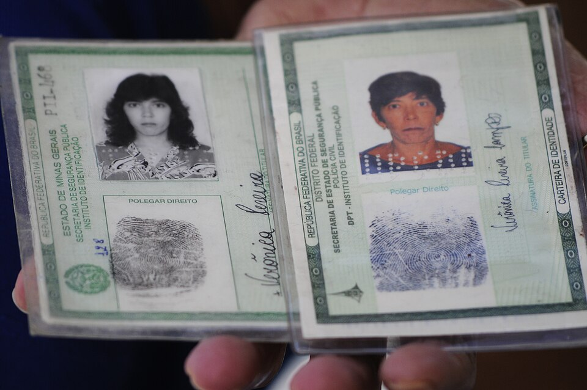
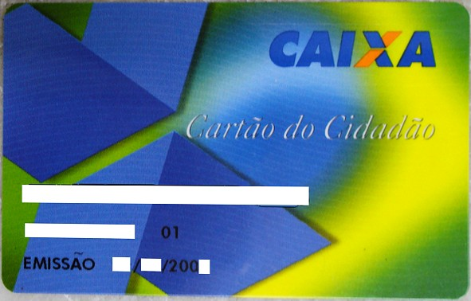

# Processo de Habilitacao

**Documentos de Identidade Brasileiros — Guia Tecnico e Legislativo**
**Documento:** DOC-CNH-008 | **Revisao:** 1.0 | **Data:** 2026-03-09
**Base Legal:** Lei 9.503/1997 (CTB), Resolucao CONTRAN n. 168/2004, Lei n. 14.071/2020

---

> **NOTA IMPORTANTE:** O processo de habilitacao descrito neste documento segue as normas vigentes ate marco de 2026, conforme estabelecido pelo Codigo de Transito Brasileiro (CTB) e regulamentado pelas Resolucoes do CONTRAN. Procedimentos especificos podem variar conforme regulamentacao complementar de cada DETRAN estadual.

---

## 1. Visao Geral do Processo de Habilitacao

O processo de primeira habilitacao para conducao de veiculos automotores no Brasil e regulamentado pelo Codigo de Transito Brasileiro (Lei n. 9.503/1997) e pela Resolucao CONTRAN n. 168/2004. Envolve etapas obrigatorias de formacao teorica, formacao pratica, avaliacoes medicas e psicologicas, exames de aptidao e um periodo probatorio de 12 meses, garantindo que todo condutor possua os conhecimentos e condicoes necessarias para conduzir veiculos com seguranca.

A imagem acima ilustra a documentacao de identidade que pode ser utilizada no processo de habilitacao. Com a implementacao da Carteira de Identidade Nacional (CIN), o candidato pode utilizar este documento como identificacao principal ao se apresentar ao DETRAN ou ao Centro de Formacao de Condutores (CFC).

---

## 2. Pre-requisitos para Iniciar o Processo

Antes de dar inicio ao processo de habilitacao, o candidato deve atender aos seguintes pre-requisitos:

### 2.1 Requisitos Pessoais

| Requisito | Detalhamento |
| :--- | :--- |
| **Idade minima** | 18 anos completos (Categorias A, B, AB ou ACC); 21 anos para Categorias D e E |
| **Alfabetizacao** | Saber ler e escrever (comprovado durante o processo) |
| **CPF regular** | Cadastro de Pessoa Fisica em situacao regular na Receita Federal |
| **Documento de identidade** | RG, CIN, Passaporte ou outro documento oficial com foto |
| **Comprovante de residencia** | No estado onde pretende obter a habilitacao |

### 2.2 Documentacao Necessaria

O candidato devera apresentar ao DETRAN ou CFC credenciado:

1. Documento de identificacao oficial com foto (original e copia)
2. CPF (pode estar no documento de identidade, caso seja a CIN)
3. Comprovante de residencia recente (ate 90 dias)
4. Declaracao de nao possuir CNH em outro estado (quando aplicavel)

---

## 3. Etapa 1 — Abertura do Processo (RENACH)

### 3.1 Registro no RENACH

O primeiro passo formal e a abertura do processo no **RENACH** (Registro Nacional de Carteiras de Habilitacao), o sistema informatizado nacional que gerencia todos os processos de habilitacao no Brasil. O registro pode ser feito:

- **Presencialmente:** No DETRAN estadual ou em posto de atendimento autorizado
- **Online:** Atraves do portal do DETRAN estadual (disponivel na maioria dos estados)
- **Via CFC:** O Centro de Formacao de Condutores pode realizar a abertura em nome do candidato

Ao ser registrado no RENACH, o candidato recebe um **numero de processo** que o acompanhara em todas as etapas subsequentes. Este numero e vinculado ao CPF e fica registrado permanentemente no sistema nacional.

### 3.2 Escolha da Categoria

No momento da abertura do processo, o candidato deve informar a categoria desejada:

- **Categoria A:** Motocicletas e motonetas
- **Categoria B:** Automoveis e utilitarios leves
- **Categoria AB:** Habilitacao combinada (motos e carros)
- **ACC:** Autorizacao para conduzir ciclomotores

Para categorias C, D e E, o candidato ja deve possuir habilitacao previa conforme os pre-requisitos de cada categoria.

---

## 4. Etapa 2 — Exames Medico e Psicologico

### 4.1 Exame de Aptidao Fisica e Mental (Exame Medico)

O exame medico e realizado por medico perito examinador de transito, credenciado pelo DETRAN, conforme a Resolucao CONTRAN n. 425/2012. O exame avalia:

**Acuidade visual:**
- Visao central: minimo de 20/40 (ou 0,50) em cada olho, com ou sem correcao
- Visao periferica: campo visual minimo de 120 graus
- Visao de cores: capacidade de distinguir vermelho, verde e amarelo (cores dos semaforos)
- Visao noturna: ausencia de cegueira noturna significativa

**Capacidade auditiva:**
- Percepcao de sons de buzina e sirene a distancia adequada
- Portadores de deficiencia auditiva podem ser considerados aptos com restricoes

**Capacidade motora:**
- Coordenacao motora adequada para operacao dos comandos do veiculo
- Forca muscular suficiente para acionar volante, pedais e alavancas
- Mobilidade cervical para observacao do transito

**Condicoes gerais:**
- Ausencia de doencas ou condicoes que comprometam a seguranca na conducao
- Avaliacao de condicoes neurologicas, cardiovasculares e psiquiatricas
- Verificacao do uso de medicamentos que possam afetar a capacidade de conducao

O resultado do exame medico pode ser:

| Resultado | Significado |
| :--- | :--- |
| **Apto** | Condicoes plenas para conducao na categoria solicitada |
| **Apto com restricoes** | Conducao permitida com adaptacoes ou limitacoes especificas |
| **Inapto temporario** | Condicao medica reversivel que impede temporariamente a conducao |
| **Inapto** | Condicao medica permanente incompativel com a conducao segura |

### 4.2 Avaliacao Psicologica

A avaliacao psicologica e realizada por psicologo perito examinador de transito, credenciado pelo DETRAN. A avaliacao utiliza instrumentos psicologicos padronizados e validados pelo Conselho Federal de Psicologia (CFP), e avalia:

- **Atencao:** Capacidade de manter foco, dividir atencao e reagir a situacoes inesperadas
- **Percepcao:** Interpretacao de informacoes visuais e espaciais do transito
- **Tomada de decisao:** Avaliacao de riscos e decisoes sob pressao
- **Controle emocional:** Estabilidade emocional em situacoes estressantes
- **Personalidade:** Tracos que influenciam o comportamento no transito (impulsividade, agressividade)

O resultado pode ser **apto**, **inapto temporario** ou **inapto**. Em caso de inaptidao, o candidato pode solicitar reavaliacao por junta psicologica.

### 4.3 Prazos e Validade dos Exames

- Os exames medico e psicologico tem validade de **12 meses** a partir da data de realizacao
- Caso o candidato nao conclua o processo de habilitacao dentro desse prazo, devera repetir os exames
- Os exames podem ser realizados em clinicas credenciadas pelo DETRAN em todo o estado

---

## 5. Etapa 3 — Curso Teorico-Tecnico

### 5.1 Estrutura do Curso

O curso teorico-tecnico de formacao de condutores e ministrado por Centros de Formacao de Condutores (CFCs) credenciados pelo DETRAN. A carga horaria minima obrigatoria e de **45 horas/aula**, distribuidas nas seguintes disciplinas:

| Disciplina | Carga Horaria | Conteudo Principal |
| :--- | :---: | :--- |
| **Legislacao de Transito** | 18 horas | CTB, sinalizacao, normas de circulacao, infrações, penalidades |
| **Direcao Defensiva** | 16 horas | Tecnicas de conducao segura, prevencao de acidentes, condicoes adversas |
| **Primeiros Socorros** | 4 horas | Procedimentos basicos de emergencia, sinalizacao de acidente, acionamento do SAMU |
| **Meio Ambiente e Cidadania** | 4 horas | Impacto ambiental dos veiculos, mobilidade urbana, convivencia no transito |
| **Nocoes de Mecanica Basica** | 3 horas | Funcionamento do veiculo, manutencao preventiva, verificacoes de seguranca |

### 5.2 Modalidades de Ensino

O curso teorico pode ser realizado nas seguintes modalidades:

- **Presencial:** Aulas ministradas em sala de aula no CFC
- **Semipresencial:** Parte das aulas em formato EAD (ensino a distancia) e parte presencial
- **EAD (100% a distancia):** Autorizado por alguns DETRANs estaduais, com validacao por biometria facial durante as aulas

Em todas as modalidades, o controle de frequencia e obrigatorio e realizado por sistema informatizado vinculado ao DETRAN. O candidato deve atingir presenca minima de **75%** em cada disciplina.

### 5.3 Material Didatico

O material didatico utilizado nos CFCs deve ser aprovado pelo DETRAN estadual e seguir as diretrizes do CONTRAN. Inclui:

- Apostila ou livro-texto cobrindo todas as disciplinas
- Material audiovisual (videos de simulacao de transito, animacoes de sinalizacao)
- Simulacoes de questoes no formato do exame teorico
- Legislacao completa (CTB e resolucoes pertinentes)

---

## 6. Etapa 4 — Exame Teorico-Tecnico

### 6.1 Formato do Exame

O exame teorico e aplicado pelo DETRAN estadual (ou banca credenciada) em formato informatizado. Caracteristicas:

- **Numero de questoes:** 30 questoes de multipla escolha
- **Alternativas:** 4 alternativas por questao (A, B, C, D)
- **Nota minima:** 21 acertos (70%)
- **Tempo:** 60 minutos
- **Tentativas:** O candidato pode realizar o exame quantas vezes forem necessarias, respeitando o prazo de validade dos exames medicos
- **Intervalo entre tentativas:** Minimo de 15 dias entre uma tentativa e outra

### 6.2 Conteudo do Exame

As questoes sao sorteadas de um banco de questoes mantido pelo DETRAN e abrangem todas as disciplinas do curso teorico:

- Legislacao de transito (predominante, com cerca de 40% das questoes)
- Sinalizacao de transito (horizontal, vertical, semáfórica, gestos)
- Direcao defensiva
- Primeiros socorros
- Meio ambiente e cidadania
- Mecanica basica

### 6.3 Aprovacao e Reprovacao

Em caso de aprovacao, o candidato esta liberado para iniciar as aulas praticas. Em caso de reprovacao, deve aguardar o prazo minimo e realizar nova tentativa. Nao ha limite de tentativas, desde que o processo esteja dentro do prazo de validade.

---

## 7. Etapa 5 — Curso Pratico de Direcao Veicular

### 7.1 Carga Horaria e Estrutura

O curso pratico de direcao veicular e ministrado por instrutor de transito credenciado, vinculado a um CFC. A carga horaria minima obrigatoria e de **20 horas/aula** para cada categoria, distribuidas da seguinte forma:

| Componente | Carga Horaria | Detalhamento |
| :--- | :---: | :--- |
| **Simulador de direcao** | 5 horas | Aulas em simulador eletronico (obrigatorio conforme Resolucao CONTRAN) |
| **Pratica em veiculo (noturna)** | 1 hora minimo | Aula pratica obrigatoria em periodo noturno |
| **Pratica em veiculo (diurna)** | 14 horas | Aulas em vias publicas e areas controladas |

Para habilitacao na Categoria AB, sao necessarias 20 horas praticas em cada tipo de veiculo (motocicleta e automovel), totalizando 40 horas praticas.

### 7.2 Simulador de Direcao

O simulador de direcao veicular foi incorporado ao processo pela Resolucao CONTRAN n. 543/2015. O equipamento reproduz painel de instrumentos, volante com forca de reacao, pedais, alavanca de cambio e cenarios virtuais. As aulas focam em familiarizacao com comandos, partida em aclive, frenagem de emergencia, conducao em condicoes adversas (chuva, neblina, noite) e situacoes de risco.

### 7.3 Aulas Praticas em Veiculo

As aulas praticas em veiculo real sao realizadas em vias publicas e em areas fechadas, sob supervisao direta do instrutor de transito. O conteudo inclui:

O conteudo pratico abrange habilidades basicas (partida, aceleracao, frenagem, controle de embreagem, uso de retrovisores e sinalizacao), manobras (baliza, estacionamento perpendicular, conversoes, retorno e partida em aclive) e conducao em transito real (vias urbanas, respeito a sinalizacao, interacao com pedestres e ciclistas).

---

## 8. Etapa 6 — Exame Pratico de Direcao Veicular

### 8.1 Estrutura do Exame

O exame pratico de direcao veicular e a etapa final e mais decisiva do processo de habilitacao. E aplicado por examinador credenciado pelo DETRAN, que avalia o candidato durante a realizacao de manobras em area fechada e conducao em via publica.

### 8.2 Componentes do Exame

**Parte 1 — Manobras em area fechada (percurso interno):**

- **Baliza (estacionamento paralelo):** O candidato deve estacionar o veiculo em vaga demarcada, sem tocar nos limites, dentro do tempo estipulado
- **Partida em aclive (rampa):** Partida do veiculo em ladeira sem permitir que o veiculo retroceda mais de 50 cm
- **Garagem (estacionamento perpendicular):** Manobra de estacionamento em 90 graus

**Parte 2 — Conducao em via publica (percurso externo):**

- Percurso pre-definido pelo DETRAN com extensao variavel (geralmente 15 a 30 minutos)
- Avaliacao de todos os aspectos de conducao segura
- Inclusao de situacoes reais de transito (semaforos, cruzamentos, pedestres)

### 8.3 Criterios de Avaliacao

O examinador utiliza uma ficha de avaliacao padronizada que classifica as faltas em:

| Tipo de Falta | Penalidade | Exemplos |
| :--- | :--- | :--- |
| **Falta eliminatoria** | Reprovacao imediata | Avancar sinal vermelho, subir na calcada, provocar acidente, exceder velocidade permitida, nao usar cinto |
| **Falta grave** | -3 pontos | Nao observar retrovisores, nao sinalizar conversao, estacionar longe do meio-fio |
| **Falta media** | -2 pontos | Ajustar retrovisores apos inicio do exame, usar buzina indevidamente |
| **Falta leve** | -1 ponto | Posicao incorreta das maos no volante, movimento brusco de partida |

O candidato e **aprovado** se nao cometer nenhuma falta eliminatoria e acumular no maximo **3 pontos negativos** no total. Caso contrario, e reprovado e deve agendar nova tentativa.

### 8.4 Tentativas e Prazos

- O candidato pode realizar o exame pratico quantas vezes forem necessarias
- Intervalo minimo de **15 dias** entre tentativas
- Todo o processo de habilitacao deve ser concluido em ate **12 meses** a partir da data de abertura no RENACH (prazo prorrogavel conforme regulamentacao estadual)

---

## 9. Etapa 7 — Permissao Provisoria para Dirigir (PPD)

### 9.1 Emissao da PPD

Apos a aprovacao no exame pratico, o candidato nao recebe imediatamente a CNH definitiva. Em vez disso, recebe a **Permissao Provisoria para Dirigir (PPD)**, tambem conhecida como **PPNH** (Permissao Provisoria Nacional de Habilitacao), que tem validade de **1 (um) ano**.

A PPD possui o mesmo formato visual da CNH e confere ao portador os mesmos direitos de conducao na categoria em que foi habilitado. No entanto, durante o periodo de vigencia da PPD, aplicam-se restricoes adicionais.

### 9.2 Restricoes durante a PPD

Durante o periodo de 1 ano da PPD, o condutor:

- **Nao pode cometer infracoes de natureza grave ou gravissima:** Caso cometa, tera a PPD cancelada e devera reiniciar todo o processo de habilitacao
- **Nao pode ser reincidente em infracoes medias:** A reincidencia em infracoes medias durante a PPD tambem resulta em cancelamento
- **Nao pode exercer atividade remunerada:** O portador de PPD esta proibido de trabalhar como motorista profissional (taxi, aplicativo, caminhao, onibus)

### 9.3 Conversao para CNH Definitiva

Ao final do periodo de 1 ano, se o condutor nao tiver incorrido em nenhuma das situacoes de cancelamento, a PPD e automaticamente convertida em **CNH definitiva**. O condutor deve:

1. Comparecer ao DETRAN ou posto de atendimento
2. Solicitar a emissao da CNH definitiva
3. Pagar a taxa de emissao do documento
4. Aguardar a confeccao e entrega da CNH

---

## 10. Sistema de Pontuacao e Penalidades

### 10.1 Sistema de Pontos

O sistema de pontuacao da CNH, atualizado pela Lei n. 14.071/2020, funciona da seguinte forma:

| Natureza da Infracao | Pontos | Exemplo |
| :--- | :---: | :--- |
| **Leve** | 3 pontos | Estacionar em local proibido (sem gravidade) |
| **Media** | 4 pontos | Dirigir com apenas uma mao no volante |
| **Grave** | 5 pontos | Transitar pela contramao em via de mao unica |
| **Gravissima** | 7 pontos | Dirigir sob influencia de alcool, avancar sinal vermelho |

### 10.2 Limites para Suspensao

A partir da Lei n. 14.071/2020, os limites para suspensao do direito de dirigir foram alterados:

| Situacao | Limite de Pontos (em 12 meses) |
| :--- | :---: |
| Condutor sem infracao gravissima | 40 pontos |
| Condutor com 1 infracao gravissima | 30 pontos |
| Condutor com 2+ infracoes gravissimas | 20 pontos |
| Condutor com EAR (atividade remunerada) | 40 pontos |

### 10.3 Suspensao do Direito de Dirigir

A suspensao do direito de dirigir pode ocorrer por:

- Acumulo de pontos acima do limite no periodo de 12 meses
- Infracoes autossuspensivas (dirigir sob influencia de alcool, disputar corrida em via publica, etc.)
- Decisao judicial

O periodo de suspensao varia de **6 meses a 2 anos**, conforme a gravidade e a reincidencia. Durante a suspensao, o condutor nao pode dirigir nenhum tipo de veiculo automotor. Ao final do periodo, deve realizar curso de reciclagem e novos exames para reaver a habilitacao.

### 10.4 Cassacao do Direito de Dirigir

A cassacao e a penalidade mais severa e ocorre quando:

- O condutor e suspenso e flagrado dirigindo durante o periodo de suspensao
- O condutor e reincidente em suspensao no prazo de 24 meses
- O condutor e condenado judicialmente por crime de transito

A cassacao tem duracao de **2 anos**, apos os quais o condutor deve reiniciar todo o processo de habilitacao (exames medicos, psicologicos, teorico e pratico) como se fosse a primeira habilitacao.

---

## 11. Casos Especiais

### 11.1 Portadores de Necessidades Especiais

Pessoas com deficiencia fisica podem obter a CNH desde que a deficiencia nao comprometa a conducao segura. O processo inclui:

- Exame medico pericial especifico que determina as adaptacoes necessarias
- Aulas praticas em veiculo adaptado conforme a deficiencia
- Exame pratico em veiculo adaptado
- CNH com restricao indicando o tipo de adaptacao obrigatoria (cambio automatico, direcao hidraulica, acelerador e freio manuais, etc.)

### 11.2 Transferencia de CNH Estrangeira

Condutores com habilitacao estrangeira podem transferir para a CNH brasileira, desde que o pais de origem tenha acordo de reciprocidade com o Brasil, a habilitacao esteja vigente, o condutor comprove residencia no Brasil e seja aprovado nos exames medico, psicologico, teorico e pratico (estes dois ultimos podem ser dispensados conforme acordo bilateral).

### 11.3 Renovacao da CNH

A renovacao da CNH e obrigatoria ao final do periodo de validade e exige exame medico, exame psicologico (apenas para condutores com EAR), pagamento da taxa e atualizacao de fotografia. Nao e necessario realizar novos exames teorico ou pratico.

---

## 12. Legislacao Aplicavel

O processo de habilitacao e regulamentado pelos seguintes dispositivos legais:

- **Lei n. 9.503/1997** — Codigo de Transito Brasileiro (CTB)
- **Lei n. 14.071/2020** — Alteracoes ao CTB
- **Resolucao CONTRAN n. 168/2004** — Normas para o processo de habilitacao
- **Resolucao CONTRAN n. 425/2012** — Exame de aptidao fisica e mental e avaliacao psicologica
- **Resolucao CONTRAN n. 543/2015** — Simulador de direcao veicular
- **Resolucao CONTRAN n. 789/2020** — Modelo da CNH
- **Resolucao CONTRAN n. 886/2021** — Curso de formacao de condutores

---

*DOC-CNH-008 — Revisao 1.0 — Marco 2026*

*Publicado por: Divisao de Documentacao Tecnica*

*Baseado na legislacao vigente: CTB (Lei 9.503/1997) e Resolucoes CONTRAN*
