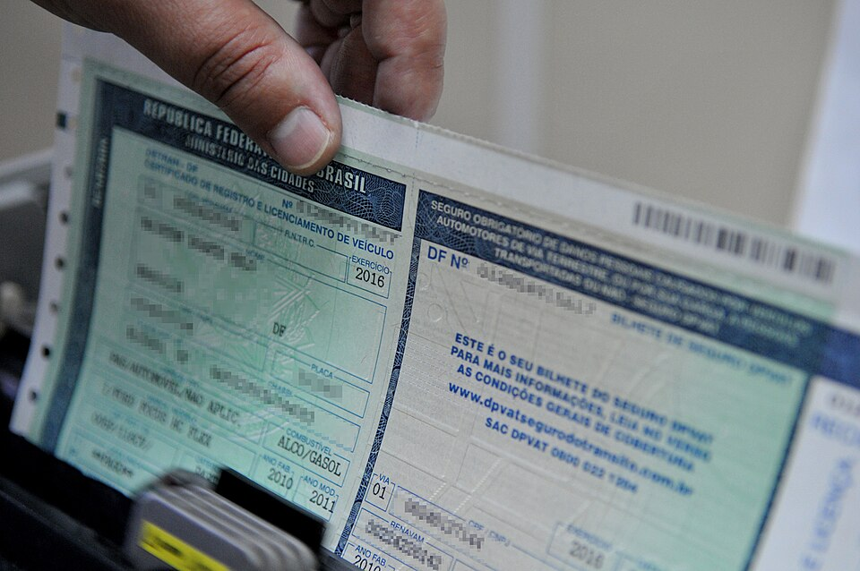
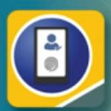

# CNH Digital

**Documentos de Identidade Brasileiros — Guia Tecnico e Legislativo**
**Documento:** DOC-CNH-009 | **Revisao:** 1.0 | **Data:** 2026-03-09
**Base Legal:** Lei 9.503/1997 (CTB), Resolucao CONTRAN n. 789/2020, Lei n. 14.071/2020

---

> **NOTA IMPORTANTE:** A CNH Digital e parte do ecossistema da Carteira Digital de Transito (CDT), aplicativo oficial do Governo Federal administrado pelo SENATRAN (Secretaria Nacional de Transito). As informacoes deste documento refletem as funcionalidades e regulamentacoes vigentes ate marco de 2026.

---

## 1. Visao Geral da CNH Digital

A CNH Digital e a versao eletronica da Carteira Nacional de Habilitacao, disponibilizada por meio do aplicativo **Carteira Digital de Transito (CDT)**, desenvolvido pelo SERPRO (Servico Federal de Processamento de Dados) em parceria com o SENATRAN. Lancada inicialmente em 2017 como piloto e ampliada a todo o territorio nacional em 2018, a CNH Digital tem a mesma **validade juridica** que o documento fisico impresso em policarbonato.

A base legal para a CNH Digital esta no artigo 159, paragrafo 1o, do CTB (incluido pela Lei n. 13.154/2015), que autoriza a expedição de documentos de habilitacao em meio digital, com certificacao digital do ITI (Instituto Nacional de Tecnologia da Informacao), no padrao ICP-Brasil.

A CNH Digital nao substitui a CNH fisica — ambas coexistem e tem a mesma validade. O condutor pode optar por portar uma ou outra, ou ambas. Em caso de fiscalizacao, o agente de transito deve aceitar a apresentacao da CNH Digital no aplicativo CDT como comprovante valido de habilitacao.

A imagem acima ilustra o Certificado de Registro e Licenciamento de Veiculo eletronico (CRLV-e), que e integrado ao mesmo aplicativo CDT que hospeda a CNH Digital. Esta integracao permite que o condutor tenha todos os documentos de transito essenciais em um unico aplicativo.

---

## 2. Carteira Digital de Transito (CDT)

### 2.1 O que e a CDT

A **Carteira Digital de Transito (CDT)** e o aplicativo oficial do Governo Federal para documentos de transito digitais. Disponivel gratuitamente para dispositivos Android (Google Play Store) e iOS (Apple App Store), o aplicativo unifica em uma unica plataforma:

- **CNH Digital:** Versao eletronica da Carteira Nacional de Habilitacao
- **CRLV-e:** Certificado de Registro e Licenciamento de Veiculo eletronico
- **Infrações:** Consulta de multas e infrações registradas
- **Veiculos:** Informacoes sobre veiculos vinculados ao CPF do usuario
- **SNE:** Sistema de Notificacao Eletronica (adesao voluntaria)
- **Recall:** Alertas de recalls de veiculos
- **Indicacao de condutor principal:** Funcionalidade para designar quem conduzia o veiculo no momento da infracao

### 2.2 Requisitos Tecnicos

| Requisito | Detalhamento |
| :--- | :--- |
| **Sistema operacional** | Android 8.0 ou superior / iOS 13.0 ou superior |
| **Armazenamento** | Minimo de 100 MB disponivel |
| **Conectividade** | Internet necessaria para ativacao e atualizacao (funciona offline apos ativacao) |
| **Camera** | Necessaria para leitura de QR Code e prova de vida |
| **Biometria** | Compatibilidade com leitor de impressao digital ou reconhecimento facial do dispositivo |

### 2.3 Historico de Versoes

| Ano | Marco |
| :--- | :--- |
| 2017 | Lancamento piloto em Goias e Distrito Federal |
| 2018 | Expansao para todos os estados brasileiros |
| 2019 | Inclusao do CRLV-e no aplicativo |
| 2020 | Integracao com o SNE (Sistema de Notificacao Eletronica) |
| 2021 | Redesign da interface e inclusao de indicacao de condutor principal |
| 2022 | Integracao com a conta Gov.br (nivel prata ou ouro) |
| 2023 | Compartilhamento digital de documentos e notificacoes push de infracoes |
| 2024 | Prova de vida com biometria facial para ativacao |
| 2025 | Integracao com o sistema de pontuacao em tempo real |

---

## 3. Como Ativar a CNH Digital

### 3.1 Pre-requisitos para Ativacao

Para ativar a CNH Digital no aplicativo CDT, o condutor deve:

1. **Possuir CNH fisica vigente** — nao e possivel ativar a versao digital se a CNH fisica estiver vencida, suspensa ou cassada
2. **Possuir conta Gov.br** com nivel de confiabilidade **prata** ou **ouro** (verificacao biometrica obrigatoria desde 2022)
3. **Ter o aplicativo CDT instalado** em dispositivo compativel
4. **Possuir acesso a internet** no momento da ativacao

### 3.2 Passo a Passo da Ativacao

**Etapa 1 — Criacao/verificacao da conta Gov.br:**

1. Acesse o aplicativo Gov.br ou o portal gov.br
2. Crie uma conta (caso nao possua) informando CPF, nome completo e dados pessoais
3. Eleve o nivel da conta para prata ou ouro:
   - **Nivel prata:** Validacao por biometria facial (comparacao com a foto do banco de dados do TSE ou do DENATRAN) ou por internet banking de banco conveniado
   - **Nivel ouro:** Validacao por certificado digital ICP-Brasil ou biometria facial com prova de vida

**Etapa 2 — Instalacao e acesso ao CDT:**

1. Baixe o aplicativo "Carteira Digital de Transito" na loja de aplicativos do seu dispositivo
2. Abra o aplicativo e selecione "Entrar com Gov.br"
3. Informe as credenciais da conta Gov.br (CPF e senha)
4. Autorize o acesso do CDT aos dados de transito

**Etapa 3 — Ativacao da CNH Digital:**

1. Na tela inicial do CDT, selecione "CNH Digital"
2. O sistema verificara automaticamente se existe CNH vigente vinculada ao CPF
3. Realize a **prova de vida** (selfie com movimentos faciais solicitados pela camera)
4. O sistema comparara a biometria facial com a foto registrada no RENACH
5. Apos validacao, a CNH Digital sera exibida no aplicativo
6. O documento ficara disponivel para uso offline (armazenado de forma criptografada no dispositivo)

### 3.3 Problemas Comuns na Ativacao

| Problema | Causa Provavel | Solucao |
| :--- | :--- | :--- |
| "CNH nao encontrada" | CPF divergente ou CNH emitida recentemente | Aguardar 72h apos emissao da CNH fisica |
| "Falha na biometria" | Foto do RENACH muito antiga ou divergente | Atualizar foto no DETRAN antes de tentar novamente |
| "Conta Gov.br insuficiente" | Nivel bronze (nao atende requisito minimo) | Elevar para nivel prata ou ouro |
| "Documento expirado" | CNH fisica com validade vencida | Renovar a CNH fisica antes de ativar a digital |

---

## 4. Validacao por QR Code

### 4.1 Como Funciona

A CNH Digital exibe um **QR Code dinamico** que permite a qualquer pessoa verificar a autenticidade do documento. O QR Code e atualizado periodicamente e contem um token criptografado que, ao ser escaneado:

1. Conecta-se ao servidor do SENATRAN/DENATRAN
2. Retorna os dados do condutor (nome, foto, categoria, validade)
3. Confirma que o documento e autentico e vigente
4. Indica se ha restricoes, suspensoes ou bloqueios

### 4.2 Quem Pode Validar

A validacao por QR Code pode ser realizada por:

- **Agentes de transito:** Utilizando equipamentos de fiscalizacao ou o proprio aplicativo CDT
- **Estabelecimentos comerciais:** Locadoras de veiculos, seguradoras, hoteis e qualquer entidade que necessite verificar a habilitacao
- **Qualquer cidadao:** Utilizando o aplicativo CDT em modo de leitura

### 4.3 Funcionamento Offline

A CNH Digital pode ser apresentada mesmo sem conexao com a internet. Neste caso:

- O documento exibe os dados do condutor armazenados localmente
- O QR Code estatico (ultimo gerado) pode ser escaneado, porem a validacao em tempo real nao sera possivel
- O agente de transito pode aceitar o documento offline e realizar consulta posterior pelo numero do registro

A imagem acima mostra a interface do aplicativo de documentos digitais com recursos de validacao por QR Code e compartilhamento, funcionalidades analogas as disponibilizadas pela CDT para a CNH Digital.

---

## 5. Integracao com o CRLV-e

### 5.1 O que e o CRLV-e

O **CRLV-e** (Certificado de Registro e Licenciamento de Veiculo eletronico) e a versao digital do documento que comprova o licenciamento anual do veiculo. Desde 2020, o CRLV-e substituiu progressivamente o documento fisico impresso, sendo o unico formato aceito em varios estados.

### 5.2 Integracao no CDT

O aplicativo CDT integra a CNH Digital e o CRLV-e em uma unica plataforma, permitindo que o condutor:

- **Visualize todos os veiculos** registrados em seu CPF ou CNPJ
- **Compartilhe o CRLV-e** com terceiros (locatarios, condutores autorizados, seguradoras)
- **Receba alertas** de vencimento do licenciamento
- **Consulte debitos** de IPVA, multas e taxas pendentes

### 5.3 Vantagens da Integracao

A integracao CNH + CRLV no CDT oferece beneficios praticos:

| Beneficio | Detalhamento |
| :--- | :--- |
| **Documentos unificados** | Um unico aplicativo para todos os documentos de transito |
| **Atualizacao automatica** | Alteracoes no cadastro (mudanca de endereco, renovacao) refletidas automaticamente |
| **Compartilhamento seguro** | Envio de documentos por link ou QR Code com prazo de validade |
| **Historico de veiculos** | Consulta de veiculos anteriores e atual proprietario |
| **Alertas inteligentes** | Notificacoes de vencimentos, recalls e infrações |

---

## 6. Compartilhamento Digital

### 6.1 Compartilhamento da CNH Digital

O aplicativo CDT permite compartilhar a CNH Digital com terceiros de forma segura e controlada. Os cenarios mais comuns incluem:

- **Locacao de veiculos:** Enviar a CNH Digital para a locadora durante o processo de reserva online
- **Seguradoras:** Compartilhar para cotacao ou acionamento de seguro
- **Empregadores:** Comprovar habilitacao para cargos que exijam conducao de veiculos
- **Orgaos publicos:** Identificacao em processos administrativos

### 6.2 Mecanismo de Compartilhamento

O compartilhamento funciona por meio de:

1. **Link temporario:** O CDT gera um link unico com prazo de validade (configuravel pelo usuario, de 1 hora a 30 dias)
2. **QR Code de compartilhamento:** Codigo especifico para compartilhamento (diferente do QR Code de validacao)
3. **PDF assinado digitalmente:** O CDT gera um PDF com os dados da CNH, assinado com certificado digital ICP-Brasil

O destinatario do compartilhamento:
- Pode visualizar os dados da CNH (nome, foto, categoria, validade, restricoes)
- Pode verificar a autenticidade do documento via assinatura digital
- **Nao** tem acesso ao numero completo do CPF (parcialmente mascarado)
- **Nao** pode utilizar o compartilhamento para fins nao autorizados (protecao LGPD)

### 6.3 CRLV-e para Terceiros

O compartilhamento do CRLV-e segue a mesma logica e e especialmente util quando:

- O veiculo sera conduzido por outra pessoa (emprestimo)
- O veiculo esta em processo de venda (comprovacao de licenciamento)
- O veiculo sera transportado (guincho, caminhao-cegonha)

---

## 7. Sistema de Notificacao Eletronica (SNE)

### 7.1 O que e o SNE

O **Sistema de Notificacao Eletronica (SNE)** e um servico oferecido pelo SENATRAN que permite ao proprietario de veiculo receber notificacoes de infracoes de transito por meio eletronico (aplicativo CDT e e-mail), em substituicao as notificacoes por correio postal.

### 7.2 Adesao ao SNE

A adesao ao SNE e **voluntaria** e pode ser feita diretamente pelo aplicativo CDT:

1. Acesse o CDT com a conta Gov.br
2. Selecione o veiculo desejado
3. Selecione "SNE — Sistema de Notificacao Eletronica"
4. Leia e aceite os termos de adesao
5. Confirme a adesao

### 7.3 Beneficios do SNE

| Beneficio | Detalhamento |
| :--- | :--- |
| **Desconto de 40% na multa** | O principal atrativo: multas notificadas pelo SNE tem desconto de 40% no valor se pagas ate o vencimento |
| **Velocidade** | Notificacao chega em dias (versus semanas pelo correio) |
| **Prazo ampliado** | Maior prazo para indicacao de condutor e apresentacao de defesa |
| **Comprovante digital** | Todas as notificacoes ficam registradas no aplicativo |
| **Sem extravio** | Elimina o risco de a notificacao nao chegar por problemas postais |

### 7.4 Funcionamento

Quando uma infracao e registrada para um veiculo cujo proprietario aderiu ao SNE:

1. O orgao autuador registra a infracao no sistema
2. O SENATRAN gera a notificacao eletronica
3. O proprietario recebe uma notificacao push no aplicativo CDT
4. O proprietario recebe e-mail com a notificacao (endereco cadastrado)
5. O proprietario pode visualizar os detalhes da infracao, a imagem (quando aplicavel), e tomar as providencias:
   - Pagar a multa com desconto de 40%
   - Indicar o condutor infrator
   - Apresentar defesa previa
   - Interpor recurso

### 7.5 Prazos do SNE

| Evento | Prazo |
| :--- | :--- |
| Notificacao da autuacao | Ate 30 dias apos a infracao |
| Indicacao de condutor | 30 dias apos o recebimento da notificacao |
| Defesa previa | 30 dias apos o recebimento da notificacao |
| Pagamento com desconto | Ate a data de vencimento indicada na notificacao |

---

## 8. Notificacao de Multas e Infracoes no CDT

### 8.1 Consulta de Infracoes

Independentemente da adesao ao SNE, o aplicativo CDT permite consultar:

- Infracoes registradas para o veiculo (como proprietario)
- Infracoes registradas para o condutor (na CNH)
- Pontuacao acumulada na CNH
- Status de processos administrativos (defesas, recursos)

### 8.2 Indicacao de Condutor Principal

Funcionalidade introduzida em 2021, a **indicacao de condutor principal** permite que o proprietario do veiculo indique previamente quem utiliza o veiculo com mais frequencia. Em caso de infracao registrada por equipamento automatico (radar, camera):

- Se houver condutor principal indicado, a pontuacao e a responsabilidade sao atribuidas automaticamente ao condutor indicado
- Se nao houver indicacao, a pontuacao e atribuida ao proprietario (procedimento padrao)
- O condutor indicado pode contestar a indicacao no prazo legal

### 8.3 Pagamento de Multas

O CDT oferece integracao com sistemas de pagamento para quitacao de multas:

- **PIX:** Pagamento instantaneo via QR Code gerado no aplicativo
- **Boleto bancario:** Geracao de boleto para pagamento em rede bancaria
- **Parcelamento:** Quando disponivel pelo orgao autuador, permite parcelamento em ate 12 vezes

---

## 9. Validade Juridica da CNH Digital

### 9.1 Base Legal

A validade juridica da CNH Digital esta respaldada por:

- **Lei n. 9.503/1997 (CTB), art. 159, par. 1o:** Autoriza a expedicao de documentos de habilitacao em meio digital
- **Lei n. 13.154/2015:** Incluiu o paragrafo que autoriza documentos digitais com certificado ICP-Brasil
- **Resolucao CONTRAN n. 789/2020:** Regulamenta o modelo e as especificacoes da CNH digital
- **Medida Provisoria n. 1.051/2021 (convertida em Lei n. 14.382/2022):** Ampliou o arcabouco juridico para documentos digitais

### 9.2 Aceitacao Obrigatoria

A CNH Digital apresentada no aplicativo CDT **deve ser aceita** por:

- Agentes de transito (policia rodoviaria, guardas municipais, agentes do DETRAN)
- Estabelecimentos comerciais (locadoras, postos de combustivel, estacionamentos)
- Orgaos publicos (cartórios, reparticoes, tribunais)
- Instituicoes financeiras (quando utilizada como documento de identidade)

A recusa em aceitar a CNH Digital pode configurar constrangimento ilegal ou abuso de autoridade, conforme a situacao.

### 9.3 Limitacoes

Apesar da validade juridica plena, existem situacoes em que a CNH Digital pode encontrar limitacoes praticas:

- **Viagens internacionais:** A CNH Digital nao e reconhecida por todos os paises. Para dirigir no exterior, recomenda-se portar a CNH fisica e a Permissao Internacional para Dirigir (PID)
- **Falta de bateria:** Se o dispositivo movel ficar sem bateria, o condutor nao podera apresentar o documento digital
- **Areas sem conectividade:** Embora funcione offline, a validacao em tempo real nao e possivel em areas sem sinal

---

## 10. Perspectivas Futuras

### 10.1 Integracao com a CIN Digital

Com a implementacao da Carteira de Identidade Nacional (CIN) e sua versao digital, a tendencia e que a CNH Digital e a CIN Digital se integrem em um ecossistema unificado de identidade, possivelmente em um unico aplicativo ou plataforma:

- **Gov.br como hub central:** A conta Gov.br ja funciona como ponto de acesso para ambos os documentos
- **Interoperabilidade:** Validacao cruzada entre CNH Digital e CIN Digital
- **Identidade digital unica:** Perspectiva de longo prazo de unificar todos os documentos em uma unica credencial digital

### 10.2 Carteira de Motorista Digital Internacional

O Brasil participa de discussoes no ambito da **Convencao de Viena sobre Transito Viario** e do **MERCOSUL** para estabelecer padroes de reconhecimento mutuo de documentos digitais de habilitacao. A perspectiva e que, no futuro, a CNH Digital brasileira seja aceita diretamente em paises signatarios de acordos de reciprocidade, sem necessidade de PID.

### 10.3 Tecnologias Emergentes

O SENATRAN e o SERPRO estao avaliando a incorporacao de tecnologias emergentes ao CDT:

- **Identidade descentralizada (SSI):** Uso de credenciais verificaveis baseadas em blockchain
- **mDL (ISO 18013-5):** Padrao internacional para carteira de motorista digital, que permite apresentacao seletiva de atributos (por exemplo, comprovar idade minima sem revelar data de nascimento)
- **Biometria comportamental:** Uso de padroes de digitacao e movimento do dispositivo como fator adicional de autenticacao

A imagem acima mostra o logotipo do e-Titulo, outro documento digital do ecossistema governamental brasileiro. Assim como a CNH Digital, o e-Titulo (titulo de eleitor digital) faz parte da estrategia do Governo Federal de digitalizar documentos civis, demonstrando a tendencia de convergencia para uma plataforma unica de identidade digital.

---

## 11. Perguntas Frequentes

**A CNH Digital substitui a CNH fisica?**
Nao. A CNH Digital coexiste com a CNH fisica. Ambas tem a mesma validade juridica. O condutor pode optar por portar uma ou outra.

**Preciso pagar para ativar a CNH Digital?**
Nao. A ativacao da CNH Digital no aplicativo CDT e gratuita. O unico custo e o da emissao da CNH fisica (necessaria como pre-requisito).

**Se minha CNH fisica vencer, a digital tambem vence?**
Sim. A CNH Digital reflete os mesmos dados da CNH fisica. Se a validade expirar, a versao digital tambem sera exibida como vencida.

**Posso usar a CNH Digital como documento de identidade?**
Sim. A CNH (fisica ou digital) e aceita como documento de identidade em todo o territorio nacional, conforme o CTB.

**O que acontece se eu perder o celular?**
Os dados da CNH Digital ficam vinculados a sua conta Gov.br, nao ao dispositivo. Basta instalar o CDT em outro dispositivo e realizar nova ativacao com a conta Gov.br.

**A CNH Digital funciona sem internet?**
Sim, para apresentacao do documento. A validacao em tempo real do QR Code requer conexao, mas o documento pode ser exibido offline.

---

*DOC-CNH-009 — Revisao 1.0 — Marco 2026*

*Publicado por: Divisao de Documentacao Tecnica*

*Baseado na legislacao vigente: CTB (Lei 9.503/1997), Resolucoes CONTRAN e normas do SENATRAN*
