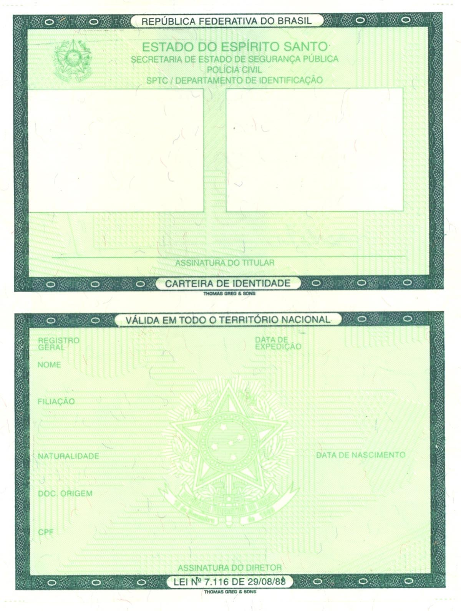
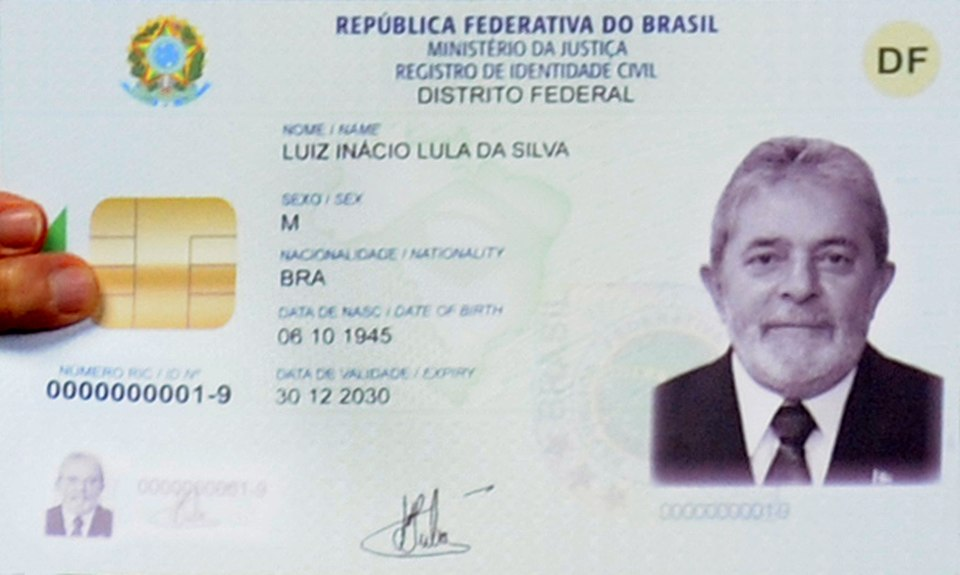

# Comparativo: CIN, CNH e Documentos Digitais

**Documentos de Identidade Brasileiros — Guia Tecnico e Legislativo**
**Documento:** DOC-COMP-010 | **Revisao:** 1.0 | **Data:** 2026-03-09
**Base Legal:** Lei 7.116/1983, Lei 9.503/1997 (CTB), Lei 14.534/2023, Decreto 10.977/2022

---

> **NOTA IMPORTANTE:** Este documento apresenta um comparativo abrangente entre os principais documentos de identificacao e habilitacao em vigor no Brasil, incluindo suas versoes digitais. As informacoes refletem a legislacao e as praticas vigentes ate marco de 2026.

---

## 1. Visao Geral do Ecossistema Documental Brasileiro

O Brasil possui um ecossistema documental complexo, resultado de decadas de criacao de documentos especificos para diferentes finalidades — identificacao civil, habilitacao para conducao, cadastro tributario, registro eleitoral, entre outros. Historicamente, cada documento era emitido por um orgao diferente, com numeracoes distintas e sem interoperabilidade entre os sistemas.

Essa fragmentacao gerou problemas praticos significativos: o cidadao brasileiro precisava portar multiplos documentos para diferentes situacoes, cada um com seu proprio numero de registro, gerando confusao, burocracia e vulnerabilidades a fraudes. Um mesmo cidadao poderia ter RGs emitidos por diferentes estados, com numeros diferentes, sem que os sistemas estaduais se comunicassem entre si.

A imagem acima mostra a Carteira de Identidade Nacional (CIN), que representa o principal marco na simplificacao do ecossistema documental brasileiro. Ao adotar o CPF como numero unico de identificacao, a CIN elimina a duplicidade de registros e estabelece as bases para um sistema de identidade verdadeiramente nacional e integrado.

A partir de 2023, com a implementacao progressiva da **Carteira de Identidade Nacional (CIN)** — regulamentada pela Lei n. 14.534/2023 e pelo Decreto n. 10.977/2022 — o Brasil iniciou um processo de convergencia documental que visa simplificar o ecossistema e caminhar para uma identidade unica do cidadao.

---

## 2. Tabela Comparativa Principal

A tabela abaixo compara os principais documentos de identificacao e habilitacao em vigor no Brasil:

| Caracteristica | **CIN** | **RG (antigo)** | **CNH** | **CPF** |
| :--- | :--- | :--- | :--- | :--- |
| **Nome oficial** | Carteira de Identidade Nacional | Carteira de Identidade / Registro Geral | Carteira Nacional de Habilitacao | Cadastro de Pessoa Fisica |
| **Orgao emissor** | Institutos de Identificacao (SSP estaduais) | Institutos de Identificacao (SSP estaduais) | DETRANs estaduais | Receita Federal do Brasil |
| **Base legal** | Lei 14.534/2023, Decreto 10.977/2022 | Lei 7.116/1983 | Lei 9.503/1997 (CTB) | Instrucao Normativa RFB |
| **Numero principal** | CPF (unico nacional) | RG (numero estadual, pode variar entre estados) | Numero de registro RENACH | Numero do CPF |
| **Validade** | 10 anos (ate 49 anos), 5 anos (50-59), variavel acima | Indefinida (sem data de validade) | 10 anos (ate 49 anos), 5 anos (50-69), 3 anos (70+) | Indefinida |
| **Fotografia** | Sim | Sim | Sim | Nao |
| **Biometria** | Sim (digital) | Sim (digital, conforme estado) | Sim (digital e facial) | Nao |
| **Chip RFID** | Sim (modelo policarbonato) | Nao | Sim (modelo 2022+) | Nao (nao e documento fisico com chip) |
| **QR Code** | Sim | Nao | Sim | Nao |
| **Versao digital** | Sim (Gov.br) | Nao | Sim (CDT) | Sim (Gov.br / app CPF Digital) |
| **Aceito como identidade** | Sim (todo territorio) | Sim (todo territorio) | Sim (todo territorio) | Nao (nao e documento de identidade) |
| **Valido para viagem MERCOSUL** | Sim | Sim (com validade de ate 10 anos) | Nao | Nao |
| **Material** | Policarbonato ou papel | Papel ou policarbonato (conforme estado) | Policarbonato | Papel (cartao) ou digital |
| **Custo de emissao** | Gratuita (primeira via) | Gratuita (primeira via, maioria dos estados) | Paga (taxas do DETRAN) | Gratuita |
| **Prazo para substituicao** | Ate 2032 (obrigatorio) | Sera descontinuado ate 2032 | Coexiste com CIN | Permanece ativo |

---

## 3. CIN versus RG — A Transicao

### 3.1 O que Muda

A CIN representa a evolucao direta do antigo RG (Registro Geral), com as seguintes diferencas fundamentais:

**Numero unico nacional:**
O RG antigo utilizava uma numeracao estadual — cada Instituto de Identificacao atribuia um numero independente. Isso significava que um cidadao poderia ter RGs com numeros diferentes em estados distintos, e nao havia mecanismo automatico de deteccao de duplicidade. A CIN adota o **CPF como numero unico**, eliminando completamente esse problema.

**Padronizacao nacional:**
O RG nao tinha padrao visual unico — cada estado emitia documentos com layouts, cores e formatos diferentes. A CIN segue um **modelo padronizado** em todo o territorio nacional, com as mesmas especificacoes de seguranca, layout e informacoes.

**Tecnologia de seguranca:**
O RG, em muitos estados, ainda era emitido em formato de papel, sem elementos sofisticados de seguranca. A CIN em formato policarbonato incorpora chip RFID, holografia, gravacao a laser, QR Code e certificado digital — o mesmo nivel de seguranca dos melhores documentos de identidade do mundo.

A imagem acima permite visualizar a CIN em seu formato atual, evidenciando a evolucao significativa em relacao aos modelos anteriores de RG em termos de design, tecnologia e padronizacao.

### 3.2 Cronograma de Transicao

| Prazo | Evento |
| :--- | :--- |
| 2022 | Inicio da emissao da CIN em carater piloto (alguns estados) |
| 2023 | Expansao para todos os estados brasileiros |
| 2024 | Intensificacao da emissao — CIN e o documento padrao para novas emissoes |
| 2026 | RG antigo permanece valido, porem nao e mais emitido em novos formatos |
| 2032 | Prazo final para substituicao — RGs antigos perdem validade |

### 3.3 O que Acontece com o Numero do RG

O numero do RG antigo nao desaparece. Ele e mantido como informacao complementar na CIN, no campo "Registro Geral". No entanto, o **numero principal** de identificacao passa a ser o CPF, que e utilizado como chave de busca em todos os sistemas governamentais.

---

## 4. CNH como Documento de Identidade

### 4.1 Validade para Identificacao

A CNH e aceita como documento de identidade em todo o territorio nacional, conforme o artigo 159 do CTB. Na pratica, muitos brasileiros utilizam a CNH como seu principal (e por vezes unico) documento de identificacao. Isso ocorre porque a CNH:

- Contem fotografia atualizada
- Contem numero do CPF
- Contem data de nascimento e filiacao
- E emitida por orgao oficial (DETRAN)
- Possui alto nivel de seguranca contra falsificacao

### 4.2 CNH Nao Substitui a CIN

Apesar de ser amplamente aceita como identificacao, a CNH **nao substitui formalmente** a CIN/RG para todos os fins:

| Situacao | CNH aceita? | CIN/RG necessario? |
| :--- | :---: | :---: |
| Identificacao em fiscalizacao de transito | Sim | Nao |
| Embarque em voos nacionais | Sim | Nao (CNH e aceita) |
| Viagem internacional (MERCOSUL) | **Nao** | **Sim** (CIN ou passaporte) |
| Abertura de conta bancaria | Sim (maioria dos bancos) | Depende da instituicao |
| Concursos publicos | Sim (maioria dos editais) | Depende do edital |
| Votacao | Sim | Nao (e-Titulo tambem aceito) |
| Posse em cargo publico | Depende do orgao | Geralmente exigido |

### 4.3 CIN Nao Autoriza Conducao

Importante ressaltar: a CIN e um documento de **identidade civil** e **nao autoriza** a conducao de veiculos automotores. Para dirigir, o cidadao deve possuir a CNH valida na categoria correspondente ao veiculo. A CIN e a CNH sao documentos complementares com finalidades distintas.

---

## 5. Ecossistema Digital — Gov.br e CDT

### 5.1 Plataforma Gov.br

A plataforma **Gov.br** e o hub central de identidade digital do Governo Federal, unificando o acesso a mais de 4.000 servicos publicos digitais. Para o ecossistema documental, o Gov.br desempenha papel central:

| Documento | Disponivel no Gov.br? | Como acessar |
| :--- | :---: | :--- |
| **CIN Digital** | Sim | App Gov.br ou portal gov.br |
| **CPF Digital** | Sim | App Gov.br |
| **CNH Digital** | Via CDT | App Carteira Digital de Transito (login Gov.br) |
| **e-Titulo** | Via app proprio | App e-Titulo (login Gov.br) |
| **CTPS Digital** | Via app proprio | App Carteira de Trabalho Digital (login Gov.br) |
| **Certificado de Vacinacao** | Sim | App Gov.br ou ConecteSUS |

### 5.2 Niveis de Conta Gov.br

O acesso aos documentos digitais depende do nivel de confiabilidade da conta Gov.br:

| Nivel | Como obter | Documentos acessiveis |
| :--- | :--- | :--- |
| **Bronze** | Cadastro basico com CPF | CPF Digital, servicos basicos |
| **Prata** | Validacao facial, internet banking ou certificado digital | CNH Digital, CIN Digital, e-Titulo |
| **Ouro** | Biometria facial com prova de vida, certificado ICP-Brasil | Todos os documentos + assinatura digital |

### 5.3 Carteira Digital de Transito (CDT)

O aplicativo CDT e o canal especifico para documentos de transito:

- **CNH Digital:** Apresentacao e compartilhamento
- **CRLV-e:** Licenciamento do veiculo
- **Infracoes:** Consulta e pagamento de multas
- **SNE:** Notificacao eletronica de infracoes (com 40% de desconto)

A imagem acima mostra detalhes da CIN que evidenciam a integracao do documento fisico com o ecossistema digital, incluindo elementos que permitem validacao eletronica e vinculacao com a plataforma Gov.br.

---

## 6. Roteiro para o Futuro: Identidade Digital Unica

### 6.1 Situacao Atual

Em 2026, o cidadao brasileiro ainda precisa lidar com multiplos documentos e aplicativos:

- CIN ou RG (identidade civil)
- CPF (cadastro tributario)
- CNH (habilitacao para conducao)
- Titulo de eleitor / e-Titulo (identificacao eleitoral)
- CTPS (relacoes trabalhistas)
- Passaporte (viagens internacionais)
- Cartao SUS (saude publica)

### 6.2 Convergencia em Andamento

Diversos movimentos de convergencia ja estao em curso:

**CIN como documento unificador:**
A CIN ja incorpora o CPF como numero principal e inclui campos para informacoes complementares. A tendencia e que futuramente a CIN absorva dados hoje presentes em outros documentos (titulo de eleitor, cartao SUS, etc.).

**Gov.br como identidade digital:**
A plataforma Gov.br ja funciona como uma "identidade digital unica" no ambito dos servicos publicos federais. Com a conta Gov.br nivel ouro, o cidadao pode assinar documentos eletronicos, acessar servicos e provar sua identidade remotamente.

**Interoperabilidade entre sistemas:**
Os sistemas do DENATRAN (CNH), dos Institutos de Identificacao (CIN), da Receita Federal (CPF) e do TSE (titulo de eleitor) estao sendo progressivamente integrados, compartilhando bases biometricas e cadastrais.

### 6.3 Perspectiva de Longo Prazo

A visao de longo prazo do Governo Federal contempla:

1. **Documento fisico unico:** A CIN como unico documento de identidade fisico necessario (absorvendo funcoes do RG, CPF e eventualmente do titulo de eleitor)
2. **Carteira digital unica:** Um unico aplicativo ou plataforma (evolucao do Gov.br) que contenha todos os documentos digitais do cidadao
3. **Identidade descentralizada:** Adocao de credenciais verificaveis (Verifiable Credentials) baseadas em padroes W3C, permitindo ao cidadao compartilhar seletivamente atributos de sua identidade sem revelar dados desnecessarios
4. **Reconhecimento internacional:** Integracao com padroes internacionais (ICAO, ISO 18013-5 para mDL) para reconhecimento mutuo de identidade digital entre paises

---

## 7. Reconhecimento Internacional

### 7.1 CIN no MERCOSUL

A CIN e aceita como documento de viagem para transito entre os paises membros e associados do MERCOSUL:

- **Membros plenos:** Argentina, Brasil, Paraguai, Uruguai
- **Associados:** Bolivia, Chile, Colombia, Equador, Guiana, Peru, Suriname

Para viagens ao MERCOSUL, a CIN deve estar dentro da validade. O RG antigo tambem e aceito, desde que tenha sido emitido ha menos de 10 anos.

### 7.2 CNH no Exterior

A CNH brasileira **nao e** um documento de viagem e **nao e** automaticamente aceita para conducao em outros paises. Para dirigir no exterior, o condutor brasileiro deve:

1. **Convencao de Viena:** O Brasil e signatario. Paises membros devem aceitar a CNH brasileira acompanhada de traducao juramentada ou da **PID** (Permissao Internacional para Dirigir)
2. **PID:** Emitida pelo DETRAN, tem validade de 3 anos e e um documento complementar a CNH (nao a substitui)
3. **Acordos bilaterais:** Alguns paises possuem acordos especificos que permitem a transferencia da CNH brasileira para habilitacao local (Portugal, Italia, Japao, entre outros)

### 7.3 Documentos Digitais no Exterior

A CNH Digital e a CIN Digital **nao possuem** reconhecimento internacional generalizado. Para fins de identificacao no exterior, recomenda-se portar:

- Passaporte (para paises fora do MERCOSUL)
- CIN fisica (para paises do MERCOSUL)
- CNH fisica + PID (para conducao)

---

## 8. Perguntas Frequentes (FAQ)

### 8.1 Posso usar a CIN para dirigir?

**Nao.** A CIN e um documento de identidade civil. Para conduzir veiculos automotores, e obrigatoria a CNH valida na categoria correspondente. A CIN nao comprova habilitacao para conducao.

### 8.2 A CNH substitui o RG?

**Para fins de identificacao, sim.** A CNH e aceita como documento de identidade em praticamente todas as situacoes no territorio nacional. No entanto, a CNH nao e aceita para viagens internacionais ao MERCOSUL (para isso, e necessaria a CIN, o RG valido ou o passaporte).

### 8.3 Preciso ter CIN se ja tenho CNH?

**Sim, eventualmente.** A CIN sera obrigatoria para todos os cidadaos brasileiros ate 2032. Mesmo portadores de CNH deverao obter a CIN. Os dois documentos coexistem e servem a finalidades distintas (identidade civil vs. habilitacao para conducao).

### 8.4 O CPF vai deixar de existir?

**Nao.** O CPF continua existindo como registro tributario na Receita Federal. O que muda e que o CPF passa a ser o **numero de identificacao principal** em todos os documentos, comecando pela CIN. O cartao fisico do CPF tende a cair em desuso, ja que o numero esta impresso na CIN e disponivel digitalmente.

### 8.5 Posso viajar para a Argentina com a CNH?

**Nao.** A CNH nao e documento de viagem. Para viagens ao MERCOSUL, e necessario portar a CIN (ou RG valido, emitido ha menos de 10 anos) ou o passaporte. A CNH so e necessaria se voce pretende **dirigir** no destino (e mesmo assim, recomenda-se portar a PID).

### 8.6 Qual documento e mais seguro contra fraude?

Os modelos mais recentes da **CIN** (policarbonato) e da **CNH** (2022+) possuem niveis de seguranca equivalentes e muito elevados: chip RFID, holografia, gravacao a laser, tinta OVI, QR Code, certificado digital. Ambos estao entre os documentos mais seguros do mundo em termos de tecnologia antifraude.

### 8.7 A CNH Digital e a CIN Digital vao se fundir?

Ainda nao ha previsao legal para fusao dos aplicativos. Atualmente, a CNH Digital e acessada pelo CDT e a CIN Digital pelo Gov.br. No entanto, a tendencia de longo prazo aponta para uma convergencia em plataforma unica.

### 8.8 Posso usar documentos digitais em qualquer lugar?

Na teoria, sim — documentos digitais com certificacao ICP-Brasil tem a mesma validade juridica dos fisicos. Na pratica, pode haver situacoes em que o atendente desconheca a validade ou o sistema local nao esteja preparado para verificacao digital. Recomenda-se portar o documento fisico como backup.

---

## 9. Tabela Resumo de Substituicoes

| Documento Antigo | Substituto | Status |
| :--- | :--- | :--- |
| RG (Registro Geral) | CIN (Carteira de Identidade Nacional) | Em transicao (prazo ate 2032) |
| Cartao CPF (fisico) | Numero CPF integrado a CIN | CPF fisico em desuso progressivo |
| CNH modelo antigo | CNH modelo 2022+ | Substituicao na renovacao |
| CRLV (papel) | CRLV-e (digital) | Substituicao concluida na maioria dos estados |
| Titulo de eleitor (papel) | e-Titulo (digital) | Coexistem; digital amplamente adotado |
| CTPS (papel) | CTPS Digital | Substituicao concluida desde 2020 |

---

## 10. Legislacao de Referencia

| Documento Legal | Objeto |
| :--- | :--- |
| Lei n. 7.116/1983 | Carteira de Identidade (normas gerais) |
| Lei n. 9.503/1997 | Codigo de Transito Brasileiro (CNH) |
| Lei n. 13.154/2015 | Documentos de transito em meio digital |
| Lei n. 14.071/2020 | Alteracoes ao CTB (validade CNH, pontuacao) |
| Lei n. 14.534/2023 | Carteira de Identidade Nacional (CIN) |
| Decreto n. 10.977/2022 | Regulamentacao da CIN |
| Resolucao CONTRAN n. 789/2020 | Modelo da CNH |
| Lei n. 14.382/2022 | Documentos publicos eletronicos |

---

*DOC-COMP-010 — Revisao 1.0 — Marco 2026*

*Publicado por: Divisao de Documentacao Tecnica*

*Baseado na legislacao vigente ate marco de 2026*
